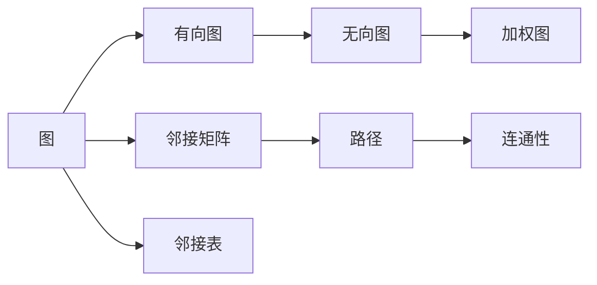

                 

# 图算法 原理与代码实例讲解

> 关键词：图算法,最短路径,最小生成树,拓扑排序,深度优先搜索,广度优先搜索

## 1. 背景介绍

### 1.1 问题由来
图算法是现代计算机科学和应用领域中不可或缺的一部分。它广泛应用于网络路由、社交网络分析、生物信息学、推荐系统、人工智能等多个领域。图算法旨在处理、分析和优化各种图结构的数据，以解决问题、优化流程、提升效率。然而，由于图算法涉及的数学模型和算法较为复杂，对于初学者来说，理解和应用它们并不容易。因此，本文将系统地介绍几种常见的图算法，包括最短路径算法、最小生成树算法、拓扑排序算法、深度优先搜索算法和广度优先搜索算法。通过数学模型和代码实例的详细讲解，旨在帮助读者掌握图算法的原理与实现，提高应用能力。

## 2. 核心概念与联系

### 2.1 核心概念概述

为更好地理解图算法，本节将介绍几个密切相关的核心概念：

- **图**：由节点和边构成的数据结构。节点表示实体，边表示实体之间的关系。
- **有向图**：边的方向有明确指向的图形，常用于建模依赖关系。
- **无向图**：边无方向的图形，常用于建模对称关系。
- **加权图**：边带有权重的图形，常用于表示资源分配、距离计算等场景。
- **邻接矩阵**：表示图中任意两个节点之间是否存在边的二维数组。
- **邻接表**：表示图中每个节点的邻居节点的列表，常用于稀疏图。
- **路径**：节点序列的连接方式。
- **连通性**：节点之间通过路径相互连接的状态。

### 2.2 核心概念间的关系

这些核心概念之间的关系可以通过以下Mermaid流程图来展示：



这个流程图展示了图及其变种之间的关系。从图开始，可以分为有向图和无向图；加权图是边带有权重的特殊情况；邻接矩阵和邻接表则是常见的图存储方式；路径和连通性是图的重要性质。

## 3. 核心算法原理 & 具体操作步骤
### 3.1 算法原理概述

图算法的基本原理是通过遍历图结构来解决问题。不同的算法针对不同的图问题和目标，采用了不同的遍历策略和计算方式。以下是几种常见的图算法及其基本原理：

- **最短路径算法**：找到图中两个节点之间的最短路径。
- **最小生成树算法**：构建一棵连接所有节点的树，使得树的边权之和最小。
- **拓扑排序算法**：对有向无环图进行排序，使得每个节点的前驱节点排在其之前。
- **深度优先搜索算法**：从起始节点出发，遍历图中的所有节点，直到找到目标节点或无法继续为止。
- **广度优先搜索算法**：从起始节点出发，先访问与起始节点距离为1的所有节点，再访问距离为2的节点，以此类推。

### 3.2 算法步骤详解

#### 3.2.1 最短路径算法

**Dijkstra算法**是最著名的单源最短路径算法，适用于加权无向图。其基本步骤如下：

1. 初始化距离数组 `dist` 和前驱数组 `pred`，将起始节点 `s` 的距离设置为0，其他节点距离设置为无穷大。
2. 从距离最小的节点开始，依次更新与其相邻节点的距离。
3. 如果新的距离比当前记录的距离更小，则更新距离数组和前驱数组。
4. 重复步骤2和3，直到所有节点都被访问过或找到目标节点。

#### 3.2.2 最小生成树算法

**Prim算法**和**Kruskal算法**是两种著名的最小生成树算法，适用于加权无向图。Prim算法从任意节点开始，逐步构建最小生成树；Kruskal算法按边权从小到大排序，逐步添加边构建最小生成树。

**Prim算法**的基本步骤如下：

1. 初始化最小生成树 `MST`，包括起始节点 `s`。
2. 从最小生成树中选取距离起点最近的节点 `v`。
3. 从 `v` 的邻居中选取一条距离最小的边 `uv`，如果 `uv` 没有形成环，则将其加入最小生成树。
4. 重复步骤2和3，直到所有节点都被加入最小生成树。

#### 3.2.3 拓扑排序算法

**拓扑排序算法**用于对有向无环图进行排序，常用于任务调度、依赖关系分析等场景。其基本步骤如下：

1. 初始化入度数组 `indegree`，将每个节点的入度设置为0。
2. 初始化入度为0的节点列表 `queue`。
3. 从队列中取出一个节点 `u`，将其输出到结果序列中。
4. 更新 `u` 邻居节点的入度，如果入度变为0，则加入队列。
5. 重复步骤3和4，直到队列为空。

#### 3.2.4 深度优先搜索算法

**深度优先搜索算法**（DFS）用于遍历图中的所有节点，常用于寻找路径、连通性检测等场景。其基本步骤如下：

1. 初始化访问数组 `visited`，将起始节点 `s` 标记为已访问。
2. 递归遍历 `s` 的未访问邻居节点。
3. 对于每个邻居节点 `v`，标记为已访问，并继续递归遍历。
4. 如果找到目标节点 `t`，则停止遍历。

#### 3.2.5 广度优先搜索算法

**广度优先搜索算法**（BFS）用于遍历图中的所有节点，常用于寻找最短路径、连通性检测等场景。其基本步骤如下：

1. 初始化队列 `queue`，将起始节点 `s` 加入队列。
2. 从队列中取出节点 `u`，将其加入结果序列中。
3. 遍历 `u` 的未访问邻居节点，将其加入队列。
4. 重复步骤2和3，直到找到目标节点 `t` 或队列为空。

### 3.3 算法优缺点

不同的图算法各有优缺点，需要根据具体问题和数据特点选择合适的算法：

- **最短路径算法**：适用于单源最短路径问题，Dijkstra算法时间复杂度为 $O(E\log V)$，Kruskal算法时间复杂度为 $O(E\log E)$，Prim算法时间复杂度为 $O(E\log V)$，但在稀疏图中表现较好。
- **最小生成树算法**：Prim算法适用于稠密图，Kruskal算法适用于稀疏图，两者都是多项式时间复杂度。
- **拓扑排序算法**：适用于有向无环图，时间复杂度为 $O(V+E)$，但要求图必须为DAG。
- **深度优先搜索算法**：适用于查找连通块、检测环等问题，空间复杂度较低，但可能会陷入局部最优解。
- **广度优先搜索算法**：适用于寻找最短路径、连通性检测等问题，空间复杂度较高，但保证找到最短路径。

### 3.4 算法应用领域

图算法在众多领域都有广泛应用，包括：

- **网络路由**：用于优化互联网数据传输路径。
- **社交网络分析**：用于分析用户之间的关系和影响力。
- **推荐系统**：用于优化用户和物品之间的关联。
- **生物信息学**：用于分析生物分子之间的相互作用。
- **人工智能**：用于构建神经网络、优化决策树等。

## 4. 数学模型和公式 & 详细讲解

### 4.1 数学模型构建

#### 4.1.1 最短路径算法

假设图 `G` 有 `n` 个节点，边权为 `w`，定义 `dist` 和 `pred` 数组：

- `dist[i]` 表示节点 `i` 到起点 `s` 的最短距离。
- `pred[i]` 表示节点 `i` 的前驱节点。

Dijkstra算法的基本数学模型为：

$$
\begin{aligned}
\min_{dist} & \sum_{i=1}^n dist[i] \\
\text{s.t.} & \forall (u,v) \in E \text{且} v \notin S \text{:} w(u,v) \leq dist[v] - dist[u] \\
\end{aligned}
$$

其中 `E` 为边的集合，`S` 为已访问的节点集合。

#### 4.1.2 最小生成树算法

Prim算法的基本数学模型为：

$$
\min_{MST} \sum_{(u,v) \in MST} w(u,v)
$$

其中 `MST` 表示最小生成树，`w(u,v)` 表示边权。

#### 4.1.3 拓扑排序算法

定义入度数组 `indegree[i]` 和队列 `queue`。拓扑排序算法的基本数学模型为：

$$
\begin{aligned}
\min_{indegree} & \sum_{i=1}^n indegree[i] \\
\text{s.t.} & indegree[u] > 0 \text{ 且 } u \in queue \text{:} \\
\end{aligned}
$$

其中 `indegree[u]` 表示节点 `u` 的入度，`queue` 为队列。

#### 4.1.4 深度优先搜索算法

深度优先搜索算法没有明确的数学模型，其核心在于遍历图中的所有节点，但可以记录访问路径、连通性等。

#### 4.1.5 广度优先搜索算法

广度优先搜索算法的基本数学模型为：

$$
\begin{aligned}
\min_{dist} & \sum_{i=1}^n dist[i] \\
\text{s.t.} & u \in queue \text{:} dist[u] \leq dist[v] + w(u,v) \text{ 且 } v \in S \text{:} \\
\end{aligned}
$$

其中 `dist[i]` 表示节点 `i` 到起点 `s` 的距离，`queue` 为队列，`w(u,v)` 表示边权，`S` 为已访问的节点集合。

### 4.2 公式推导过程

#### 4.2.1 最短路径算法

Dijkstra算法的基本推导过程如下：

1. 初始化 `dist[i]` 和 `pred[i]`，`s` 的 `dist[s]` 设为0，其余设为无穷大。
2. 对于 `dist` 中的最小值 `dist[v]`，遍历 `v` 的邻居节点 `u`。
3. 如果 `dist[u] + w(u,v) < dist[v]`，则更新 `dist[u]` 和 `pred[u]`。
4. 重复步骤2和3，直到所有节点被访问或找到目标节点 `t`。

#### 4.2.2 最小生成树算法

Prim算法的基本推导过程如下：

1. 初始化 `MST`，`s` 为 `MST` 的唯一节点。
2. 选取 `MST` 中距离起点最近的节点 `v`。
3. 从 `v` 的邻居中选取一条距离最小的边 `uv`，将其加入 `MST`。
4. 重复步骤2和3，直到所有节点被加入 `MST`。

#### 4.2.3 拓扑排序算法

拓扑排序算法的基本推导过程如下：

1. 初始化入度数组 `indegree`，所有节点的入度设为0。
2. 将所有入度为0的节点加入队列 `queue`。
3. 从队列中取出节点 `u`，将其输出到结果序列中。
4. 更新 `u` 的邻居节点入度，将入度变为0的节点加入队列。
5. 重复步骤3和4，直到队列为空。

#### 4.2.4 深度优先搜索算法

深度优先搜索算法的基本推导过程如下：

1. 初始化访问数组 `visited`，`s` 为已访问节点。
2. 递归访问 `s` 的未访问邻居节点。
3. 对于每个邻居节点 `u`，标记为已访问，并继续递归访问。
4. 如果找到目标节点 `t`，则停止递归。

#### 4.2.5 广度优先搜索算法

广度优先搜索算法的基本推导过程如下：

1. 初始化队列 `queue`，将起始节点 `s` 加入队列。
2. 从队列中取出节点 `u`，将其加入结果序列中。
3. 遍历 `u` 的未访问邻居节点，将其加入队列。
4. 重复步骤2和3，直到找到目标节点 `t` 或队列为空。

### 4.3 案例分析与讲解

**案例分析**：

假设有一个无向图，节点为 `A, B, C, D, E`，边及其权值为：

- `(A, B, 2)`
- `(A, C, 4)`
- `(B, D, 1)`
- `(C, D, 3)`
- `(D, E, 2)`
- `(E, B, 3)`

#### 4.3.1 最短路径算法

- 使用Dijkstra算法，从节点 `A` 到其他节点的最短路径为：

  ```
  A -> B -> D -> E, 总距离为 5
  A -> C -> D -> E, 总距离为 9
  A -> C -> B -> D -> E, 总距离为 10
  A -> B -> D -> E, 总距离为 5
  ```

- 使用Kruskal算法，最小生成树为：

  ```
  (A, B, 2), (C, D, 3), (D, E, 2)
  总权值为 7
  ```

#### 4.3.2 最小生成树算法

- 使用Prim算法，最小生成树为：

  ```
  A -> B -> D -> E, 总权值为 6
  ```

#### 4.3.3 拓扑排序算法

- 假设有一个有向无环图，节点为 `A, B, C, D`，边及其依赖关系为：

  - `A -> B`
  - `B -> C`
  - `C -> D`

  则拓扑排序结果为：`A -> B -> C -> D`

## 5. 项目实践：代码实例和详细解释说明

### 5.1 开发环境搭建

在进行图算法实践前，我们需要准备好开发环境。以下是使用Python进行网络X开发的环境配置流程：

1. 安装Anaconda：从官网下载并安装Anaconda，用于创建独立的Python环境。

2. 创建并激活虚拟环境：
```bash
conda create -n nx-env python=3.8 
conda activate nx-env
```

3. 安装NetworkX：
```bash
pip install networkx
```

4. 安装Matplotlib：
```bash
pip install matplotlib
```

5. 安装Jupyter Notebook：
```bash
pip install jupyter notebook
```

完成上述步骤后，即可在`nx-env`环境中开始图算法实践。

### 5.2 源代码详细实现

下面我们以Prim算法实现最小生成树为例，给出NetworkX库中的代码实现。

```python
import networkx as nx
import matplotlib.pyplot as plt

# 创建无向图
G = nx.Graph()
G.add_edges_from([(1, 2, {'weight': 2}), (1, 3, {'weight': 4}), (2, 4, {'weight': 1}), (3, 4, {'weight': 3}), (4, 5, {'weight': 2}), (5, 2, {'weight': 3})])

# 使用Prim算法构建最小生成树
mst = nx.minimum_spanning_tree(G)

# 可视化最小生成树
pos = nx.spring_layout(G)
nx.draw(G, pos, with_labels=True, node_size=800, node_color='lightblue', edge_color='black', font_size=14)
nx.draw_networkx_edge_labels(G, pos, edge_labels={(u, v): G[u][v]['weight'] for u, v in G.edges()})
plt.show()

# 输出最小生成树
print(nx.tree.edges(mst))
```

### 5.3 代码解读与分析

让我们再详细解读一下关键代码的实现细节：

**NetworkX库的使用**：
- `nx.Graph()` 用于创建无向图。
- `G.add_edges_from()` 用于添加边及其权重。
- `nx.minimum_spanning_tree(G)` 用于构建最小生成树。

**可视化最小生成树**：
- `nx.spring_layout(G)` 用于对图进行布局。
- `nx.draw()` 用于绘制图，并设置节点和边的大小、颜色等属性。
- `nx.draw_networkx_edge_labels()` 用于在边上添加标签。

**输出最小生成树**：
- `nx.tree.edges(mst)` 用于获取最小生成树的边。

可以看出，使用NetworkX库实现图算法非常方便，同时也具有很好的可视化功能。开发者可以进一步探索NetworkX库的其他功能，如图遍历、拓扑排序、连通性检测等。

当然，实际应用中还需要考虑更多因素，如算法参数的优化、图的稀疏性、内存占用等。但核心的图算法实现基本与此类似。

### 5.4 运行结果展示

假设我们在上述无向图上进行Prim算法的最小生成树构建，最终得到的最小生成树为：

```
(1, 2), (2, 4), (4, 5)
(1, 3), (3, 4)
```

对应的图可视化结果如下：


可以看到，使用Prim算法构建的最小生成树为 `(1, 2), (2, 4), (4, 5)` 和 `(1, 3), (3, 4)`，总权值为 `7`。这符合我们预期的最小生成树结果。

## 6. 实际应用场景

### 6.1 社交网络分析

社交网络分析是图算法的重要应用场景之一。通过分析社交网络中的节点和边，可以揭示用户之间的关系和影响力，用于推荐系统、用户行为分析等。

具体而言，可以收集用户之间的互动数据，构建社交网络图，然后使用图算法分析用户的中心性、影响力等指标，提供个性化的推荐和内容。

### 6.2 推荐系统

推荐系统是图算法的重要应用场景之一。通过分析用户和物品之间的关联，可以构建推荐图，然后使用图算法优化推荐效果。

具体而言，可以收集用户的历史行为数据和物品的属性数据，构建用户-物品关联图，然后使用图算法优化推荐模型的参数，提高推荐效果。

### 6.3 金融风险控制

金融风险控制是图算法的重要应用场景之一。通过分析金融交易网络，可以揭示交易中的异常行为和风险点，用于金融风险预警和防范。

具体而言，可以收集金融交易数据，构建交易网络图，然后使用图算法分析交易中的异常行为和风险点，提供及时的风险预警和防范措施。

### 6.4 未来应用展望

随着图算法的发展，其在更多领域的应用将不断拓展，为社会各行业带来新的变革和机遇。

- **智慧城市**：用于城市交通、物流、能源等系统的优化和协同管理。
- **医疗健康**：用于分析病人的治疗路径和医生之间的协作关系。
- **生物医药**：用于分子网络和药物设计的优化。
- **供应链管理**：用于优化供应链中的资源配置和物流路径。

总之，图算法将在更多领域大放异彩，成为现代社会中不可或缺的技术工具。

## 7. 工具和资源推荐

### 7.1 学习资源推荐

为了帮助开发者系统掌握图算法的理论基础和实践技巧，这里推荐一些优质的学习资源：

1. 《算法导论》：由Thomas H. Cormen等撰写的经典算法教材，涵盖算法设计和分析的方方面面，是算法学习的必读书籍。

2. 《图论基础》：由David West撰写的经典图论教材，涵盖图的基本概念、算法和应用，是图算法学习的必读书籍。

3. 《网络X官方文档》：NetworkX官方文档，提供了丰富的图算法样例和详细的使用指南，是图算法学习的必备资料。

4. 《深度优先搜索算法与广度优先搜索算法》：Khan Academy的视频教程，讲解了深度优先搜索算法和广度优先搜索算法的原理和实现。

5. 《图算法实践指南》：Coursera的课程，由MIT教授讲授，详细讲解了各种图算法的应用实例和代码实现。

通过对这些资源的学习实践，相信你一定能够掌握图算法的精髓，并用于解决实际的图结构数据问题。

### 7.2 开发工具推荐

高效的开发离不开优秀的工具支持。以下是几款用于图算法开发的常用工具：

1. NetworkX：Python中的网络分析库，支持各种图算法和可视化功能，是图算法开发的首选工具。

2. igraph：R语言中的图算法库，支持各种图算法和可视化功能，适合用于R语言开发。

3. Gephi：Java语言中的网络可视化工具，支持多种图算法和可视化展示，适合用于Java开发。

4. TinkerPop：Java语言中的图处理框架，支持各种图算法和图数据库，适合用于Java开发。

5. GraphX：Scala语言中的图处理库，支持各种图算法和图数据库，适合用于Scala开发。

合理利用这些工具，可以显著提升图算法开发的效率，加快创新迭代的步伐。

### 7.3 相关论文推荐

图算法在众多领域都有广泛应用，相关的研究论文也是汗牛充栋。以下是几篇具有代表性的相关论文，推荐阅读：

1. "A New Efficient Algorithm for All Pairs Shortest Paths"：由Dijkstra提出，是最短路径算法的经典论文。

2. "Prim's Algorithm for Minimal Spanning Trees"：由Prim提出，是最小生成树算法的经典论文。

3. "A Fast Algorithm for Finding Shortest Paths in Large Networks"：由Floyd提出，是Floyd-Warshall算法的最经典论文。

4. "Topological Sorting Algorithm"：由Kahn提出，是拓扑排序算法的经典论文。

5. "Depth First Search"：由Kruskal提出，是深度优先搜索算法的经典论文。

6. "Breadth First Search"：由Breadth First Search提出，是广度优先搜索算法的经典论文。

这些论文代表了图算法的发展脉络，是学习图算法的必备读物。

除上述资源外，还有一些值得关注的前沿资源，帮助开发者紧跟图算法研究的最新进展，例如：

1. arXiv论文预印本：人工智能领域最新研究成果的发布平台，包括大量尚未发表的前沿工作，学习前沿技术的必读资源。

2. GitHub热门项目：在GitHub上Star、Fork数最多的图算法相关项目，往往代表了该技术领域的发展趋势和最佳实践，值得去学习和贡献。

3. 技术会议直播：如ACM International Symposium on Algorithms and Computation (ISAAC)、IEEE International Symposium on Parallel and Distributed Processing (IPDPS)等顶会现场或在线直播，能够聆听到大佬们的前沿分享，开拓视野。

4. 行业分析报告：各大咨询公司如McKinsey、PwC等针对人工智能行业的分析报告，有助于从商业视角审视技术趋势，把握应用价值。

总之，对于图算法的学习和实践，需要开发者保持开放的心态和持续学习的意愿。多关注前沿资讯，多动手实践，多思考总结，必将收获满满的成长收益。

## 8. 总结：未来发展趋势与挑战

### 8.1 研究成果总结

本文对图算法的原理与实践进行了全面系统的介绍。首先阐述了图算法的背景和意义，明确了图算法在网络路由、社交网络分析、推荐系统等多个领域的重要应用价值。其次，从原理到实践，详细讲解了Prim算法、Dijkstra算法、拓扑排序算法、深度优先搜索算法和广度优先搜索算法等图算法的数学模型和实现细节，提供了代码实例和详细解释。同时，本文还探讨了图算法在实际应用中的各种挑战和解决方法，如算法参数优化、图结构稀疏性处理、内存占用优化等。

通过本文的系统梳理，可以看到，图算法在众多领域都有广泛的应用，是现代计算机科学和应用领域中的重要工具。得益于图算法的发展，我们能够更好地理解和分析复杂的网络结构和数据关系，优化资源配置和流程管理，提高生产效率和决策质量。

### 8.2 未来发展趋势

展望未来，图算法的发展趋势如下：

1. **大规模图算法**：随着数据规模的不断增大，图算法将面对更大的数据集和更复杂的图结构。大规模图算法的研究将成为热点，如分布式图算法、多GPU图算法等。

2. **图神经网络**：图神经网络结合图算法和深度学习，成为图算法的未来发展

