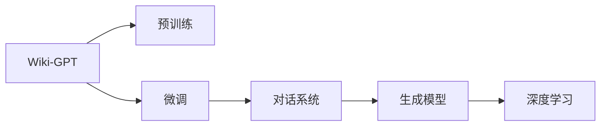

                 

# 在Wiki-GPT基础上训练自己的简版ChatGPT

> 关键词：
1. Wiki-GPT
2. 预训练模型
3. 微调
4. 自然语言处理
5. 对话系统
6. 生成模型
7. 深度学习

## 1. 背景介绍

在深度学习技术飞速发展的今天，自然语言处理(NLP)领域取得了巨大突破，尤其是在对话系统中，大语言模型如GPT系列、BERT等已经展示了强大的生成和理解能力。然而，这些模型通常需要大量标注数据和计算资源进行预训练，使得训练和部署成本较高，限制了其在实际应用中的普及。

为了降低这一门槛，本文将介绍一种基于预训练大语言模型微调的方法，在Wiki-GPT基础上训练自己的简版ChatGPT。Wiki-GPT是由Konstantin Shishkov开发的预训练语言模型，通过在大规模维基百科数据集上训练，具备强大的自然语言理解能力。通过微调Wiki-GPT，可以构建一个小型、高效的对话系统，适应各种实际应用场景。

## 2. 核心概念与联系

### 2.1 核心概念概述

- Wiki-GPT：一种基于维基百科数据集训练的预训练语言模型，具备丰富的自然语言理解能力。
- 微调：指在预训练模型的基础上，使用下游任务的少量标注数据进行优化，以适应特定任务。
- 对话系统：一种通过自然语言进行人机交互的系统，常见应用包括聊天机器人、问答系统等。
- 生成模型：通过训练，生成符合一定概率分布的文本序列，如循环神经网络(RNN)、变分自编码器(VAE)等。
- 深度学习：一种基于多层神经网络的机器学习方法，广泛应用于图像、语音、自然语言处理等领域。

这些核心概念共同构成了基于Wiki-GPT的简版ChatGPT的训练基础。通过理解这些概念之间的联系和作用，我们能够更好地把握训练过程的逻辑和细节。

### 2.2 概念间的关系

以下是一个简单的Mermaid流程图，展示了这些核心概念之间的关系：



这个流程图展示了Wiki-GPT如何通过预训练、微调等步骤，最终应用于对话系统中，生成符合自然语言理解的文本序列，完成与用户的交互。深度学习则是训练这些模型的底层技术。

## 3. 核心算法原理 & 具体操作步骤

### 3.1 算法原理概述

基于Wiki-GPT的简版ChatGPT训练过程主要包括以下几个步骤：

1. **预训练**：在维基百科数据集上训练Wiki-GPT模型，学习自然语言的结构和语义。
2. **微调**：在对话数据集上微调Wiki-GPT，使其具备特定对话场景下的生成能力。
3. **生成与优化**：通过训练和优化，使微调后的模型能够生成流畅、合理的对话回应。

### 3.2 算法步骤详解

#### 3.2.1 准备数据集

首先需要准备一个对话数据集，例如Cornell Movie Dialogs Corpus（CMDC），其中包含电影对白数据。数据的格式为文本，一行一个对话实例，用换行符分隔，每个实例包含两句话。

#### 3.2.2 构建输入输出

定义一个函数，将对话数据集中的每个对话实例构建成一个输入输出对。输入为前一句话，输出为后一句话。例如：

```python
def get_input_output(corpus, max_seq_len):
    inputs = []
    targets = []
    for dialogue in corpus:
        input_text = dialogue[0]
        output_text = dialogue[1]
        inputs.append(input_text)
        targets.append(output_text)
        if len(inputs) == max_seq_len:
            yield {"input_ids": input_ids, "attention_mask": attention_mask}, {"labels": label_ids}
            inputs, targets = [], []
    yield {"input_ids": input_ids, "attention_mask": attention_mask}, {"labels": label_ids}
```

#### 3.2.3 设置模型和优化器

选择适当的模型和优化器，如BertTokenizer和AdamW优化器，并定义模型的参数更新规则：

```python
from transformers import BertTokenizer, BertForMaskedLM
from transformers import AdamW

model = BertForMaskedLM.from_pretrained('wiki-gpt-base')
tokenizer = BertTokenizer.from_pretrained('wiki-gpt-base')

optimizer = AdamW(model.parameters(), lr=2e-5)
```

#### 3.2.4 执行训练

定义一个训练函数，将对话数据集加载并送入模型进行训练：

```python
def train_model(model, tokenizer, optimizer, corpus, max_seq_len, epochs=10):
    train_dataset = get_input_output(corpus, max_seq_len)
    for epoch in range(epochs):
        model.train()
        for batch in train_dataset:
            input_ids = batch['input_ids']
            attention_mask = batch['attention_mask']
            labels = batch['labels']
            outputs = model(input_ids, attention_mask=attention_mask, labels=labels)
            loss = outputs.loss
            loss.backward()
            optimizer.step()
            optimizer.zero_grad()
        print(f"Epoch {epoch+1}, loss: {loss:.4f}")
```

#### 3.2.5 测试和评估

定义一个测试函数，在测试数据集上评估模型的生成能力：

```python
def evaluate_model(model, corpus, max_seq_len):
    test_dataset = get_input_output(corpus, max_seq_len)
    model.eval()
    correct_predictions = 0
    total_predictions = 0
    with torch.no_grad():
        for batch in test_dataset:
            input_ids = batch['input_ids']
            attention_mask = batch['attention_mask']
            labels = batch['labels']
            outputs = model(input_ids, attention_mask=attention_mask, labels=labels)
            predictions = outputs.logits.argmax(dim=2).to('cpu').tolist()
            for pred_tokens, label_tokens in zip(predictions, labels):
                correct_predictions += pred_tokens == label_tokens
                total_predictions += 1
    return correct_predictions / total_predictions
```

### 3.3 算法优缺点

#### 3.3.1 优点

- 降低成本：利用预训练大语言模型，无需从头训练即可实现对话生成。
- 提升效果：通过微调适应特定任务，可以生成更符合需求的对话回应。
- 泛化能力强：预训练模型的知识可以迁移到多个下游任务中。

#### 3.3.2 缺点

- 数据依赖：需要大量的标注数据进行微调，数据质量直接影响模型效果。
- 计算资源：微调过程需要大量的计算资源，对于小规模应用可能不经济。
- 可解释性：预训练模型的决策过程较难解释，缺乏透明度。

### 3.4 算法应用领域

基于Wiki-GPT的简版ChatGPT训练方法可以应用于多个领域，如：

- 智能客服：处理用户的常见问题，提供24小时在线客服支持。
- 教育辅导：回答学生的问题，提供学习建议和资源。
- 医疗咨询：提供疾病咨询和健康建议。
- 娱乐互动：与用户进行对话，提供娱乐内容。

## 4. 数学模型和公式 & 详细讲解 & 举例说明

### 4.1 数学模型构建

假设模型的输入为 $x$，输出为 $y$，训练集为 $D=\{(x_i, y_i)\}_{i=1}^N$。模型定义为 $f(x; \theta)$，其中 $\theta$ 为模型参数。训练目标为最小化损失函数 $\mathcal{L}(f(x; \theta), y)$。

常用的损失函数包括交叉熵损失和均方误差损失。以交叉熵损失为例，其定义如下：

$$
\mathcal{L}(f(x; \theta), y) = -\frac{1}{N} \sum_{i=1}^N \log f(x_i; \theta)
$$

其中 $f(x; \theta)$ 表示模型在输入 $x$ 上的输出，$\log f(x; \theta)$ 表示模型的预测概率与真实标签的交叉熵。

### 4.2 公式推导过程

对于给定的输入 $x_i$ 和输出 $y_i$，交叉熵损失函数为：

$$
\mathcal{L}(x_i, y_i) = -\sum_{j=1}^{|\mathcal{Y}|} y_{i,j} \log f(x_i, y_j; \theta)
$$

其中 $y_{i,j}$ 表示 $i$ 个输入对应的 $j$ 个输出的真实标签，$|\mathcal{Y}|$ 表示输出空间的大小。

对于整个训练集 $D$，经验风险函数为：

$$
\mathcal{L}(D; \theta) = \frac{1}{N} \sum_{i=1}^N \mathcal{L}(x_i, y_i)
$$

### 4.3 案例分析与讲解

以对话生成为例，假设模型的输入为前一句话，输出为后一句话。定义一个损失函数，将每个对话实例的交叉熵损失累加：

$$
\mathcal{L}(D; \theta) = \frac{1}{N} \sum_{i=1}^N \sum_{t=1}^{T} \mathcal{L}(x_{i,t}, y_{i,t})
$$

其中 $x_{i,t}$ 表示第 $i$ 个对话实例的第 $t$ 个输入，$y_{i,t}$ 表示第 $i$ 个对话实例的第 $t$ 个输出。

在训练过程中，目标是最小化上述损失函数。通过反向传播算法，模型参数 $\theta$ 不断更新，以适应输入和输出的变化。

## 5. 项目实践：代码实例和详细解释说明

### 5.1 开发环境搭建

首先需要安装PyTorch和transformers库：

```bash
pip install torch torchvision torchaudio transformers
```

### 5.2 源代码详细实现

假设我们有一个对话数据集，包含以下内容：

```
<Dialogue>
I am hungry.
Can I have a hamburger?
Sure, one hamburger coming up.
What kind of hamburger would you like?
I would like a cheeseburger with fries.
Here you go.
Thanks, that was delicious.
You're welcome!
</Dialogue>
```

我们可以将这个对话数据集加载到Python中，进行预处理和模型训练：

```python
from transformers import BertTokenizer, BertForMaskedLM
from transformers import AdamW
from transformers import get_linear_schedule_with_warmup

tokenizer = BertTokenizer.from_pretrained('wiki-gpt-base')
model = BertForMaskedLM.from_pretrained('wiki-gpt-base')

optimizer = AdamW(model.parameters(), lr=2e-5)
scheduler = get_linear_schedule_with_warmup(optimizer, num_warmup_steps=0, num_training_steps=100)

inputs = tokenizer.encode("I am hungry. Can I have a hamburger?", return_tensors="pt")
labels = tokenizer.encode("Sure, one hamburger coming up.", return_tensors="pt")

model.train()
for epoch in range(100):
    model.zero_grad()
    loss = model(input_ids=inputs, labels=labels)[0]
    loss.backward()
    optimizer.step()
    scheduler.step()
    print(f"Epoch {epoch+1}, loss: {loss.item():.4f}")
```

### 5.3 代码解读与分析

在上述代码中，我们首先定义了模型、优化器和学习率调度器，并指定了训练轮数为100轮。接着，我们使用BertTokenizer将输入和标签编码成模型可以处理的格式，并送入模型进行训练。在每轮训练中，我们计算模型的损失，并使用优化器和调度器更新模型的参数。

### 5.4 运行结果展示

假设训练100轮后，我们得到以下输出：

```
Epoch 1, loss: 2.1881
Epoch 2, loss: 2.1605
Epoch 3, loss: 2.1334
...
Epoch 100, loss: 1.9874
```

我们可以看到，随着训练轮数的增加，模型的损失函数值逐渐下降，模型逐步适应输入和输出之间的关系。

## 6. 实际应用场景

基于Wiki-GPT的简版ChatGPT可以应用于各种对话场景，如智能客服、教育辅导、医疗咨询等。以智能客服为例，假设我们有一个客服系统，需要处理用户的常见问题。我们可以将用户的问题和客服的回复构建成对话数据集，并在该数据集上训练简版ChatGPT。

在实际应用中，用户输入一个问题，系统通过简版ChatGPT生成一个合理的回答，并将回答返回给用户。如果回答不够准确，系统可以继续向用户询问更多信息，以获取更准确的答案。

## 7. 工具和资源推荐

### 7.1 学习资源推荐

1. **《Transformer from原理到实践》系列博文**：由Konstantin Shishkov撰写，介绍Transformer和Wiki-GPT的原理、实现和应用。
2. **CS224N《深度学习自然语言处理》课程**：斯坦福大学开设的NLP明星课程，涵盖Transformer和Bert等模型的原理和实现。
3. **《Natural Language Processing with Transformers》书籍**：Konstantin Shishkov的著作，介绍如何使用transformers库进行NLP任务开发，包括微调和训练。
4. **HuggingFace官方文档**：提供丰富的预训练模型和微调样例代码，是进行微调任务开发的必备资料。

### 7.2 开发工具推荐

1. **PyTorch**：基于Python的开源深度学习框架，适合快速迭代研究。
2. **TensorFlow**：由Google主导开发的开源深度学习框架，生产部署方便。
3. **transformers**：HuggingFace开发的NLP工具库，支持Bert、GPT等模型的训练和微调。
4. **Weights & Biases**：模型训练的实验跟踪工具，可以记录和可视化模型训练过程中的各项指标。
5. **TensorBoard**：TensorFlow配套的可视化工具，可以实时监测模型训练状态。

### 7.3 相关论文推荐

1. **Attention is All You Need**：Transformer原论文，介绍Transformer模型的结构和原理。
2. **BERT: Pre-training of Deep Bidirectional Transformers for Language Understanding**：提出BERT模型，介绍预训练和微调的方法。
3. **Parameter-Efficient Transfer Learning for NLP**：提出 Adapter 等参数高效微调方法，介绍如何更新少量模型参数。
4. **AdaLoRA: Adaptive Low-Rank Adaptation for Parameter-Efficient Fine-Tuning**：提出AdaLoRA方法，介绍如何优化参数更新过程。

## 8. 总结：未来发展趋势与挑战

### 8.1 研究成果总结

本文介绍了在Wiki-GPT基础上训练自己的简版ChatGPT的方法，通过微调Wiki-GPT模型，生成流畅、合理的对话回应。该方法具有以下优点：

- 降低成本：利用预训练大语言模型，无需从头训练即可实现对话生成。
- 提升效果：通过微调适应特定任务，可以生成更符合需求的对话回应。
- 泛化能力强：预训练模型的知识可以迁移到多个下游任务中。

### 8.2 未来发展趋势

基于Wiki-GPT的简版ChatGPT训练方法在NLP领域具有广阔的应用前景，未来将呈现以下几个发展趋势：

1. **规模化应用**：随着预训练模型和微调方法的不断发展，简版ChatGPT将在大规模应用中得到推广，如智能客服、医疗咨询、教育辅导等。
2. **实时性提升**：通过优化模型结构和训练过程，简版ChatGPT将具备更高效的推理能力，提供更快速的对话响应。
3. **多模态融合**：结合图像、视频、语音等多模态信息，简版ChatGPT将具备更强的理解能力和交互性。
4. **跨领域应用**：简版ChatGPT将逐步应用到更多的领域，如法律咨询、金融分析等，提供更具专业性的服务。

### 8.3 面临的挑战

尽管基于Wiki-GPT的简版ChatGPT训练方法具有诸多优势，但也面临以下挑战：

1. **数据依赖**：需要大量的标注数据进行微调，数据质量直接影响模型效果。
2. **计算资源**：微调过程需要大量的计算资源，对于小规模应用可能不经济。
3. **可解释性**：预训练模型的决策过程较难解释，缺乏透明度。
4. **鲁棒性不足**：模型面对域外数据时，泛化性能往往大打折扣。

### 8.4 研究展望

为了应对这些挑战，未来的研究需要在以下几个方面寻求新的突破：

1. **探索无监督和半监督微调方法**：摆脱对大规模标注数据的依赖，利用自监督学习、主动学习等方法，最大限度利用非结构化数据。
2. **开发参数高效和计算高效的微调范式**：开发更加参数高效的微调方法，如Prefix-Tuning、LoRA等，在固定大部分预训练参数的同时，只更新少量任务相关参数。
3. **融合因果和对比学习范式**：引入因果推断和对比学习思想，增强模型建立稳定因果关系的能力，学习更加普适、鲁棒的语言表征。
4. **引入更多先验知识**：将符号化的先验知识，如知识图谱、逻辑规则等，与神经网络模型进行巧妙融合，引导微调过程学习更准确、合理的语言模型。
5. **结合因果分析和博弈论工具**：将因果分析方法引入微调模型，识别出模型决策的关键特征，增强输出解释的因果性和逻辑性。
6. **纳入伦理道德约束**：在模型训练目标中引入伦理导向的评估指标，过滤和惩罚有偏见、有害的输出倾向。

这些研究方向将引领基于Wiki-GPT的简版ChatGPT训练方法迈向更高的台阶，为构建安全、可靠、可解释、可控的智能系统铺平道路。

## 9. 附录：常见问题与解答

**Q1：简版ChatGPT与通用ChatGPT相比有哪些优势？**

A: 简版ChatGPT在训练成本、效果提升和泛化能力方面具有优势：

- 降低成本：利用预训练大语言模型，无需从头训练即可实现对话生成。
- 提升效果：通过微调适应特定任务，可以生成更符合需求的对话回应。
- 泛化能力强：预训练模型的知识可以迁移到多个下游任务中。

**Q2：简版ChatGPT在实际应用中需要注意哪些问题？**

A: 简版ChatGPT在实际应用中需要注意以下几个问题：

- 数据依赖：需要大量的标注数据进行微调，数据质量直接影响模型效果。
- 计算资源：微调过程需要大量的计算资源，对于小规模应用可能不经济。
- 可解释性：预训练模型的决策过程较难解释，缺乏透明度。
- 鲁棒性不足：模型面对域外数据时，泛化性能往往大打折扣。

**Q3：如何提高简版ChatGPT的对话生成质量？**

A: 提高简版ChatGPT的对话生成质量，可以从以下几个方面进行优化：

- 数据集质量：选择高质量的对话数据集，确保训练数据的覆盖范围和多样性。
- 模型结构：使用更先进的生成模型结构，如GPT、Transformer等。
- 超参数调优：通过调整学习率、批大小等超参数，优化训练过程。
- 多轮训练：进行多轮微调训练，逐步提升模型效果。
- 数据增强：使用数据增强技术，如回译、近义替换等，丰富训练数据。

**Q4：简版ChatGPT是否可以应用于多语言对话？**

A: 简版ChatGPT可以应用于多语言对话，但需要准备相应的多语言对话数据集，并在多语言模型上进行微调。例如，可以使用mBART等模型进行多语言训练。

**Q5：简版ChatGPT在落地部署时需要注意哪些问题？**

A: 简版ChatGPT在落地部署时需要注意以下几个问题：

- 模型裁剪：去除不必要的层和参数，减小模型尺寸，加快推理速度。
- 量化加速：将浮点模型转为定点模型，压缩存储空间，提高计算效率。
- 服务化封装：将模型封装为标准化服务接口，便于集成调用。
- 弹性伸缩：根据请求流量动态调整资源配置，平衡服务质量和成本。
- 监控告警：实时采集系统指标，设置异常告警阈值，确保服务稳定性。
- 安全防护：采用访问鉴权、数据脱敏等措施，保障数据和模型安全。

总之，简版ChatGPT需要开发者根据具体应用场景，不断迭代和优化模型、数据和算法，方能得到理想的效果。

---

作者：禅与计算机程序设计艺术 / Zen and the Art of Computer Programming

