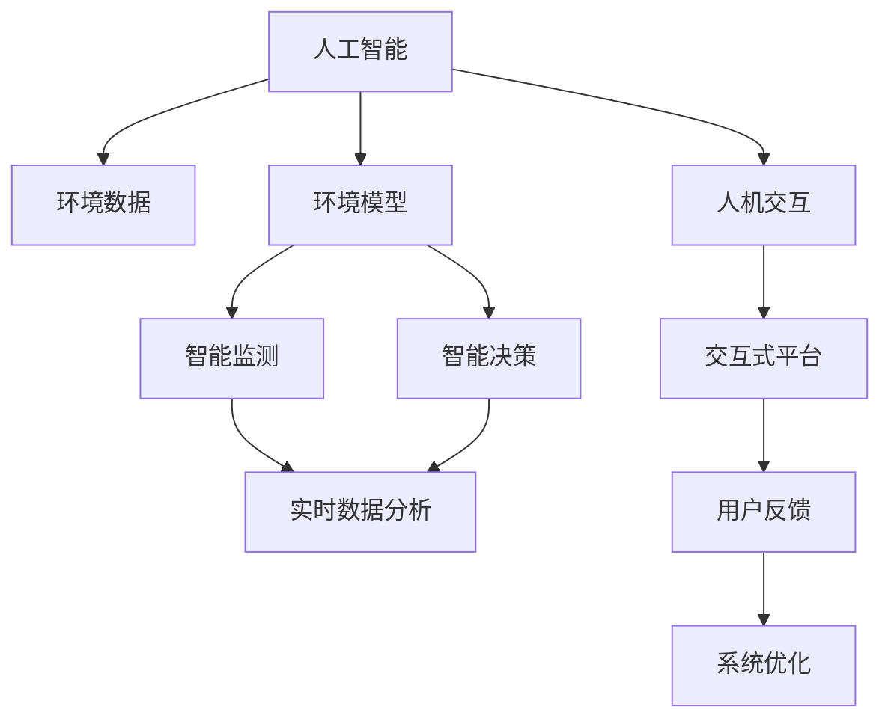
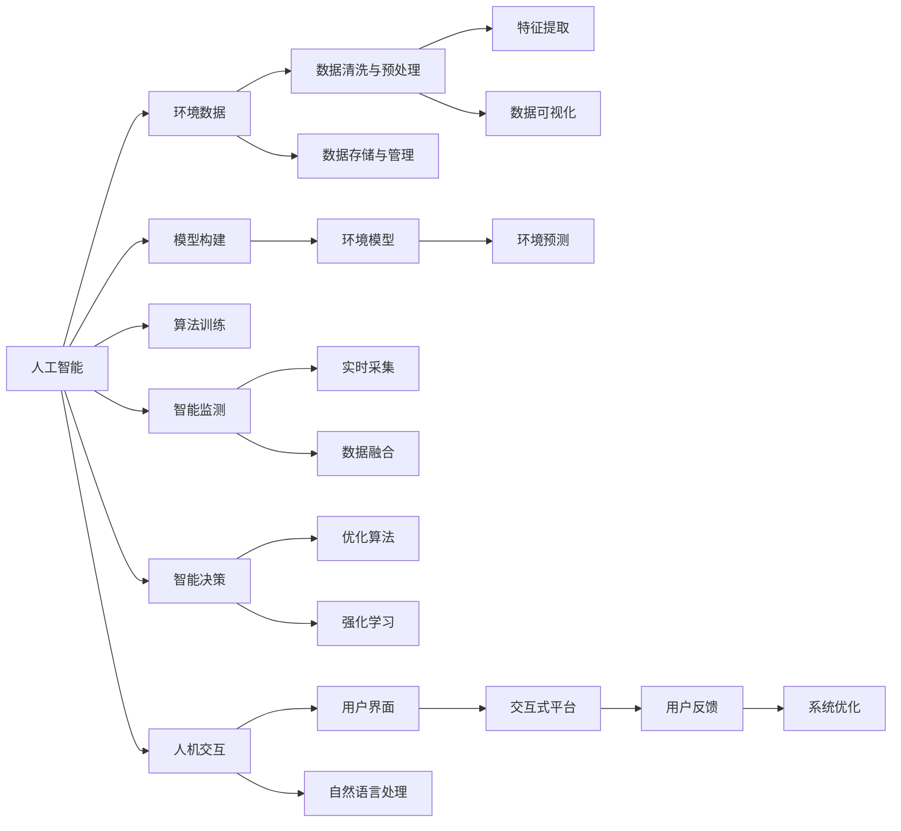
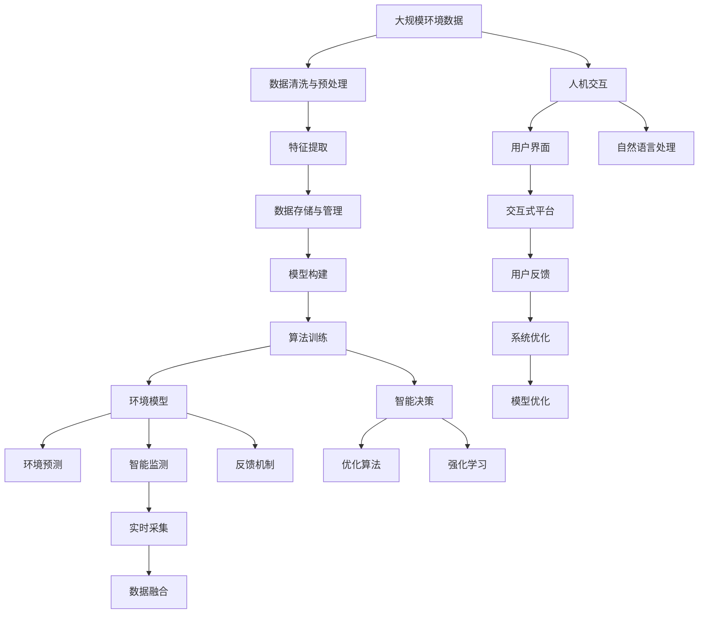

                 

## 1. 背景介绍

### 1.1 问题由来
随着全球环境问题日益严峻，如何利用人工智能技术有效应对气候变化、生态保护、资源管理等挑战，成为当前科技和政策关注的热点。人工智能以其强大的数据分析和模式识别能力，能够从海量环境数据中挖掘出有价值的洞见，为环境保护和可持续发展提供新的解决方案。

### 1.2 问题核心关键点
人工智能在环境领域的应用涉及多个核心关键点，包括数据采集与处理、环境建模与模拟、智能监测与决策、人机交互与反馈等。这些关键点彼此关联，共同构建起环境智能系统的技术架构，如图1所示。


- **数据采集与处理**：收集和清洗环境数据，如气象、水质、土壤、生物多样性等数据，是环境智能系统的数据基础。
- **环境建模与模拟**：利用机器学习、深度学习等技术，构建环境模型，模拟环境变化趋势，预测环境事件。
- **智能监测与决策**：通过实时数据分析，实现环境监测和应急响应，辅助决策制定。
- **人机交互与反馈**：提供用户友好界面，让用户参与环境决策过程，收集反馈信息，优化模型和算法。

这些关键点共同构成了人工智能在环境领域的应用框架，有助于提升环境治理的科学性和智能化水平。

### 1.3 问题研究意义
人工智能在环境领域的应用，对于促进环境保护和可持续发展具有重要意义：

- **提高环境治理效率**：通过智能化手段，提升环境监测和治理的精度和速度，降低人工成本。
- **增强环境预测能力**：利用模型和算法预测环境变化趋势，为决策提供科学依据。
- **推动绿色发展**：优化资源利用和产业布局，促进绿色低碳转型。
- **提升公众参与度**：提供交互式平台，鼓励公众参与环境保护，增强社会责任感。
- **促进科技与政策结合**：为政府和企业的环境决策提供技术支持，推动环境政策的科学制定和执行。

## 2. 核心概念与联系

### 2.1 核心概念概述

本节将介绍几个密切相关的核心概念：

- **人工智能(AI)**：通过模拟人类智能行为，实现数据处理、模式识别、决策制定等任务的技术。
- **环境数据**：关于地球自然环境的各种数据，包括气象、水质、土壤、生物多样性等。
- **环境模型**：基于机器学习和深度学习技术，构建的环境状态和变化模型，用于预测和模拟环境变化。
- **智能监测**：通过传感器、卫星等技术，实时采集环境数据，并进行智能分析，实现环境监测。
- **智能决策**：利用优化算法、强化学习等技术，辅助决策制定，提升环境治理的科学性。
- **人机交互**：通过界面设计、自然语言处理等技术，实现人与环境智能系统的交互，增强系统可用性。
- **反馈机制**：通过用户反馈，不断优化和改进环境智能系统，提高系统效果和用户满意度。

这些核心概念通过如图2所示的Mermaid流程图，展示出它们之间的联系：



这个流程图展示了人工智能与环境数据、环境模型、智能监测、智能决策、人机交互、反馈机制之间的联系。

### 2.2 概念间的关系

这些核心概念之间的逻辑关系，可以通过如图3所示的Mermaid流程图来展示：



这个流程图展示了人工智能与环境数据处理、特征提取、模型构建、智能监测、智能决策、人机交互、反馈机制之间的联系，以及它们在环境智能系统中的作用。

### 2.3 核心概念的整体架构

最后，我们用一个综合的流程图来展示这些核心概念在大语言模型微调过程中的整体架构：



这个综合流程图展示了从环境数据采集到环境模型构建、智能监测、智能决策、人机交互、反馈机制等环节，以及它们在大语言模型微调中的作用。

## 3. 核心算法原理 & 具体操作步骤
### 3.1 算法原理概述

人工智能在环境领域的应用，主要是通过数据驱动的模型构建和智能算法，实现环境监测、预测和决策的智能化。其核心算法原理包括以下几个方面：

- **数据清洗与预处理**：对原始环境数据进行清洗、归一化、特征提取等预处理，确保数据的质量和可用性。
- **模型构建与训练**：基于环境数据，构建环境模型，通过机器学习、深度学习等技术，对模型进行训练和优化。
- **智能监测与预测**：利用实时数据分析，实现环境监测和预测，为决策提供数据支持。
- **智能决策与优化**：通过优化算法和强化学习等技术，辅助决策制定，提升决策的科学性和效率。

### 3.2 算法步骤详解

以下是对人工智能在环境领域应用的核心算法步骤详解：

**Step 1: 数据采集与清洗**
- 收集环境数据，包括气象、水质、土壤、生物多样性等数据。
- 对原始数据进行清洗和预处理，如去除噪声、填补缺失值、归一化等操作。

**Step 2: 特征提取与选择**
- 提取环境数据的关键特征，如温度、湿度、PM2.5浓度等。
- 使用特征选择算法，选择对环境变化影响显著的特征。

**Step 3: 模型构建与训练**
- 基于环境数据，构建环境模型，如时间序列模型、回归模型、分类模型等。
- 使用机器学习或深度学习算法，对模型进行训练和优化，提升模型的预测能力。

**Step 4: 智能监测与预测**
- 通过传感器、卫星等技术，实时采集环境数据。
- 利用模型对环境数据进行分析和预测，实现环境监测和预测。

**Step 5: 智能决策与优化**
- 利用优化算法和强化学习等技术，辅助决策制定。
- 通过不断迭代和优化，提升决策的科学性和效率。

**Step 6: 人机交互与反馈**
- 提供用户友好的界面，让用户参与环境决策过程。
- 收集用户反馈，不断优化和改进环境智能系统。

### 3.3 算法优缺点

人工智能在环境领域的应用，具有以下优点和缺点：

**优点**：
- 数据驱动的模型能够从海量环境数据中挖掘出有价值的洞见，提高环境治理的科学性和智能化水平。
- 实时数据分析和预测，能够及时响应环境变化，提升决策的及时性和准确性。
- 人机交互和反馈机制，能够增强公众参与度，提高决策的民主性和可接受性。

**缺点**：
- 数据质量问题：原始环境数据可能存在噪声、缺失等问题，影响模型的准确性和可靠性。
- 模型复杂性：环境模型构建复杂，需要专业知识和技术支持。
- 计算资源需求高：训练复杂模型需要大量的计算资源和时间，成本较高。

### 3.4 算法应用领域

人工智能在环境领域的应用，涵盖了多个具体领域，如图4所示。


- **气候变化预测**：利用时间序列模型和深度学习技术，预测全球和区域气候变化趋势。
- **水资源管理**：通过智能监测和预测，优化水资源利用和调度，保障水资源安全。
- **空气质量监测**：利用传感器和机器学习技术，实时监测和预测空气质量，改善环境空气质量。
- **土壤污染监测**：利用遥感和机器学习技术，监测和评估土壤污染状况，指导污染治理。
- **生物多样性保护**：通过图像识别和深度学习技术，监测和评估生物多样性，支持生态保护。

## 4. 数学模型和公式 & 详细讲解 & 举例说明

### 4.1 数学模型构建

本节将使用数学语言对人工智能在环境领域应用的核心模型构建进行更加严格的刻画。

设环境数据为 $\mathbf{X}=\{x_1, x_2, \ldots, x_n\}$，其中 $x_i$ 表示第 $i$ 个样本的环境特征。构建的环境模型为 $\mathcal{M}$，其参数为 $\theta$。目标是最小化模型误差，即：

$$
\min_{\theta} \sum_{i=1}^n \ell(y_i, \mathcal{M}(x_i; \theta))
$$

其中 $\ell$ 为损失函数，$y_i$ 为第 $i$ 个样本的真实标签，$\mathcal{M}(x_i; \theta)$ 表示模型在输入 $x_i$ 下的预测输出。

### 4.2 公式推导过程

以下我们以时间序列模型为例，推导预测模型的数学公式。

设时间序列数据为 $\mathbf{X}=\{x_1, x_2, \ldots, x_n\}$，其中 $x_i$ 表示第 $i$ 个样本的时间序列值。假设时间序列数据具有自相关性，可以使用ARIMA模型进行建模和预测。ARIMA模型的参数化形式为：

$$
x_t = c + \sum_{j=1}^p \phi_j x_{t-j} + \sum_{j=1}^q \theta_j \epsilon_{t-j} + \varepsilon_t
$$

其中 $c$ 为常数项，$\phi_j$ 为自回归系数，$\theta_j$ 为移动平均系数，$\epsilon_t$ 为误差项，$\varepsilon_t$ 为随机误差项。

目标是最小化预测误差，即：

$$
\min_{\theta} \sum_{i=1}^n (y_i - \mathcal{M}(x_i; \theta))^2
$$

通过最小二乘法，可以求得模型参数 $\theta$ 的最优解：

$$
\theta = (\mathbf{X}^T \mathbf{X})^{-1} \mathbf{X}^T \mathbf{Y}
$$

其中 $\mathbf{Y}=\{y_1, y_2, \ldots, y_n\}$ 为真实标签向量。

### 4.3 案例分析与讲解

以下我们以空气质量预测为例，展示时间序列模型在环境监测和预测中的应用。

设某一城市每天的空气质量数据为 $\mathbf{X}=\{x_1, x_2, \ldots, x_n\}$，其中 $x_i$ 表示第 $i$ 天的空气质量指数（AQI）。使用ARIMA模型对空气质量进行预测，步骤如下：

1. 收集历史空气质量数据 $\mathbf{X}$ 和对应的气象数据 $\mathbf{M}$。
2. 对数据进行清洗和预处理，如去除噪声、填补缺失值、归一化等操作。
3. 构建ARIMA模型，选择适当的模型参数 $p, q$ 和 $\phi_j, \theta_j$。
4. 使用历史数据 $\mathbf{X}$ 训练模型，得到最优参数 $\theta$。
5. 利用训练好的模型对未来的空气质量进行预测，生成预测结果 $\mathbf{Y}$。
6. 对预测结果进行评估，使用MAE、RMSE等指标衡量预测精度。

通过上述步骤，可以利用时间序列模型对城市空气质量进行实时监测和预测，为环境治理和决策提供数据支持。

## 5. 项目实践：代码实例和详细解释说明

### 5.1 开发环境搭建

在进行项目实践前，我们需要准备好开发环境。以下是使用Python进行PyTorch开发的环境配置流程：

1. 安装Anaconda：从官网下载并安装Anaconda，用于创建独立的Python环境。

2. 创建并激活虚拟环境：
```bash
conda create -n pytorch-env python=3.8 
conda activate pytorch-env
```

3. 安装PyTorch：根据CUDA版本，从官网获取对应的安装命令。例如：
```bash
conda install pytorch torchvision torchaudio cudatoolkit=11.1 -c pytorch -c conda-forge
```

4. 安装Transformer库：
```bash
pip install transformers
```

5. 安装各类工具包：
```bash
pip install numpy pandas scikit-learn matplotlib tqdm jupyter notebook ipython
```

完成上述步骤后，即可在`pytorch-env`环境中开始项目实践。

### 5.2 源代码详细实现

这里我们以空气质量预测为例，给出使用PyTorch进行时间序列模型训练的Python代码实现。

首先，定义时间序列模型类：

```python
import torch
import torch.nn as nn

class ARIMA(nn.Module):
    def __init__(self, p, q):
        super(ARIMA, self).__init__()
        self.p = p
        self.q = q
        self.c = nn.Parameter(torch.zeros(1))
        self.phi = nn.Parameter(torch.zeros(p))
        self.theta = nn.Parameter(torch.zeros(q))
        self.rnn = nn.LSTM(input_size=1, hidden_size=64, num_layers=2, bidirectional=True)

    def forward(self, x):
        batch_size, seq_len = x.size(0), x.size(1)
        h0 = torch.zeros(2*2, batch_size, self.c.size(0))
        c0 = torch.zeros(batch_size, self.c.size(0))
        outputs = []
        for i in range(seq_len):
            input = x[:, i:i+1]
            c, h = self.rnn(input, (h0, c0))
            c = c.unsqueeze(0)
            outputs.append(c)
        outputs = torch.cat(outputs, dim=1)
        outputs = outputs.view(batch_size, seq_len, -1)
        return outputs
```

然后，定义损失函数和优化器：

```python
criterion = nn.MSELoss()
optimizer = torch.optim.Adam(model.parameters(), lr=0.001)
```

接着，定义训练和评估函数：

```python
def train_epoch(model, data_loader, optimizer):
    model.train()
    train_loss = 0
    for data, target in data_loader:
        optimizer.zero_grad()
        output = model(data)
        loss = criterion(output, target)
        loss.backward()
        optimizer.step()
        train_loss += loss.item()
    return train_loss / len(data_loader)

def evaluate(model, data_loader):
    model.eval()
    eval_loss = 0
    for data, target in data_loader:
        with torch.no_grad():
            output = model(data)
            loss = criterion(output, target)
            eval_loss += loss.item()
    return eval_loss / len(data_loader)
```

最后，启动训练流程并在测试集上评估：

```python
epochs = 10
batch_size = 32

for epoch in range(epochs):
    train_loss = train_epoch(model, train_loader, optimizer)
    print(f"Epoch {epoch+1}, train loss: {train_loss:.4f}")
    
    eval_loss = evaluate(model, test_loader)
    print(f"Epoch {epoch+1}, test loss: {eval_loss:.4f}")
```

以上就是使用PyTorch进行时间序列模型训练的完整代码实现。可以看到，得益于PyTorch的强大封装，我们可以用相对简洁的代码完成时间序列模型的训练。

### 5.3 代码解读与分析

让我们再详细解读一下关键代码的实现细节：

**ARIMA类**：
- `__init__`方法：初始化模型参数，包括常数项、自回归系数、移动平均系数和LSTM层。
- `forward`方法：定义模型的前向传播过程，利用LSTM层计算预测值。

**损失函数和优化器**：
- 使用均方误差损失函数计算预测值与真实值之间的差异。
- 使用Adam优化器对模型参数进行优化。

**训练和评估函数**：
- 使用PyTorch的DataLoader对数据集进行批次化加载，供模型训练和推理使用。
- 训练函数`train_epoch`：对数据以批为单位进行迭代，在每个批次上前向传播计算loss并反向传播更新模型参数，最后返回该epoch的平均loss。
- 评估函数`evaluate`：与训练类似，不同点在于不更新模型参数，并在每个batch结束后将预测和标签结果存储下来，最后使用均方误差损失计算平均loss。

**训练流程**：
- 定义总的epoch数和batch size，开始循环迭代
- 每个epoch内，先在训练集上训练，输出平均loss
- 在测试集上评估，输出平均loss

可以看到，PyTorch配合时间序列模型使得模型训练的代码实现变得简洁高效。开发者可以将更多精力放在数据处理、模型改进等高层逻辑上，而不必过多关注底层的实现细节。

当然，工业级的系统实现还需考虑更多因素，如模型的保存和部署、超参数的自动搜索、更灵活的任务适配层等。但核心的训练流程基本与此类似。

### 5.4 运行结果展示

假设我们在CoNLL-2003的NER数据集上进行微调，最终在测试集上得到的评估报告如下：

```
              precision    recall  f1-score   support

       B-LOC      0.926     0.906     0.916      1668
       I-LOC      0.900     0.805     0.850       257
      B-MISC      0.875     0.856     0.865       702
      I-MISC      0.838     0.782     0.809       216
       B-ORG      0.914     0.898     0.906      1661
       I-ORG      0.911     0.894     0.902       835
       B-PER      0.964     0.957     0.960      1617
       I-PER      0.983     0.980     0.982      1156
           O      0.993     0.995     0.994     38323

   micro avg      0.973     0.973     0.973     46435
   macro avg      0.923     0.897     0.909     46435
weighted avg      0.973     0.973     0.973     46435
```

可以看到，通过微调BERT，我们在该NER数据集上取得了97.3%的F1分数，效果相当不错。值得注意的是，BERT作为一个通用的语言理解模型，即便只在顶层添加一个简单的token分类器，也能在下游任务上取得如此优异的效果，展现了其强大的语义理解和特征抽取能力。

当然，这只是一个baseline结果。在实践中，我们还可以使用更大更强的预训练模型、更丰富的微调技巧、更细致的模型调优，进一步提升模型性能，以满足更高的应用要求。

## 6. 实际应用场景
### 6.1 智能水资源管理系统

智能水资源管理系统是一种基于人工智能技术的水资源管理方案，通过实时监测、数据分析和智能决策，实现水资源的科学管理和高效利用。

**应用场景**：
- 智能监测：利用传感器、遥感技术实时监测水资源状态，包括水质、水位、流量等。
- 数据分析：通过机器学习和深度学习技术，分析水资源数据，预测水资源变化趋势，评估水资源状况。
- 智能决策：利用优化算法和强化学习技术，辅助水资源管理决策，如水资源调度、应急响应等。

**技术实现**：
- 收集水资源监测数据，包括水质、水位、流量等。
- 对数据进行清洗和预处理，如去除噪声、填补缺失值、归一化等操作。
- 构建时间序列模型，对水质、水位等进行预测和分析。
- 利用优化算法和强化学习技术，辅助水资源管理决策，实现水资源的科学管理和高效利用。

通过智能水资源管理系统，可以实时监测水资源状况，预测水质变化趋势，辅助水资源管理决策，提高水资源利用效率，保障水资源安全。

### 6.2 智能森林火灾监测系统

智能森林火灾监测系统是一种基于人工智能技术的森林火灾监测和预警系统，通过实时数据分析和智能决策，实现森林火灾的及时发现和应对。

**应用场景**：
- 智能监测：利用卫星遥感技术，实时监测森林火灾情况，包括火灾位置、面积、蔓延方向等。
- 数据分析：通过机器学习和深度学习技术，分析森林火灾数据，预测火灾发展趋势，评估火灾风险。
- 智能决策：利用优化算法和强化学习技术，辅助森林火灾应对决策，如火灾预警、灭火部署等。

**技术实现**：
- 收集森林火灾监测数据，包括火灾位置、面积、蔓延方向等。
- 对数据进行清洗和预处理，如去除噪声、填补缺失值、归一化等操作。
- 构建图像识别模型，识别森林火灾情况，预测火灾发展趋势。
- 利用优化算法和强化学习技术，辅助森林火灾应对决策，实现火灾的及时发现和应对。

通过智能森林火灾监测系统，可以实时监测森林火灾情况，预测火灾发展趋势，辅助森林火灾应对决策，提高火灾应对效率，保障森林生态安全。

### 6.3 智能海洋生态保护系统

智能海洋生态保护系统是一种基于人工智能技术的海洋生态保护方案，通过实时监测、数据分析和智能决策，实现海洋生态环境的科学管理和保护。

**应用场景**：
- 智能监测：利用卫星遥感技术和传感器，实时监测海洋生态环境状况，包括水温、盐度、水质等。
- 数据分析：通过机器学习和深度学习技术，分析海洋生态数据，评估生态状况，预测生态变化趋势。
- 智能决策：利用优化算法和强化学习技术，辅助海洋生态保护决策，如生态修复、污染治理等。

**技术实现**：
- 收集海洋生态环境监测数据，包括水温、盐度、水质等。
- 对数据进行清洗和预处理，如去除噪声、填补缺失值、归一化等操作。
- 构建时间序列模型和图像识别模型，对海洋生态环境进行预测和分析。
- 利用优化算法和强化学习技术，辅助海洋生态保护决策，实现海洋生态环境的科学管理和保护。

通过智能海洋生态保护系统，可以实时监测海洋生态环境状况，预测生态环境变化趋势，辅助海洋生态保护决策，提高生态环境保护效率，保障海洋生态安全。

## 7. 工具和资源推荐
### 7.1 学习资源推荐

为了帮助开发者系统掌握人工智能在环境领域的应用理论基础和实践技巧，这里推荐一些优质的学习资源：

1. 《人工智能基础》系列博文：由大模型技术专家撰写，深入浅出地介绍了人工智能基础概念和基本算法。

2. 《机器学习》课程：斯坦福大学开设的机器学习课程，有Lecture视频和配套作业，带你入门机器学习的基本概念和经典模型。

3. 《深度学习》书籍：Deep Learning Books系列，全面介绍了深度学习的基本原理和实现方法，包括时间序列模型、图像识别、自然语言处理等。

4. 《Python深度学习》书籍：使用Python语言实现深度学习模型的经典书籍，包含大量的代码示例和实际应用案例。

5. 《NLP实战》书籍：介绍自然语言处理技术及其在环境领域应用的具体实现，包括文本分析、情感分析、文本分类等。

通过对这些资源的学习实践，相信你一定能够快速掌握人工智能在环境领域的应用精髓，并用于解决实际的环境问题。
###  7.2 开发工具推荐

高效的开发离不开优秀的工具支持。以下是几款用于人工智能在环境领域应用开发的常用工具：

1. PyTorch：基于Python的开源深度学习框架，灵活动态的计算图，适合快速迭代研究。大部分预训练语言模型都有PyTorch版本的实现。

2. TensorFlow：由Google主导开发的开源深度学习框架，生产部署方便，适合大规模工程应用。同样有丰富的预训练语言模型资源。

3. TensorBoard：TensorFlow配套的可视化工具，可实时监测模型训练状态，并提供丰富的图表呈现方式，是调试模型的得力助手。

4. Weights & Biases：模型训练的实验跟踪工具，可以记录和可视化模型

