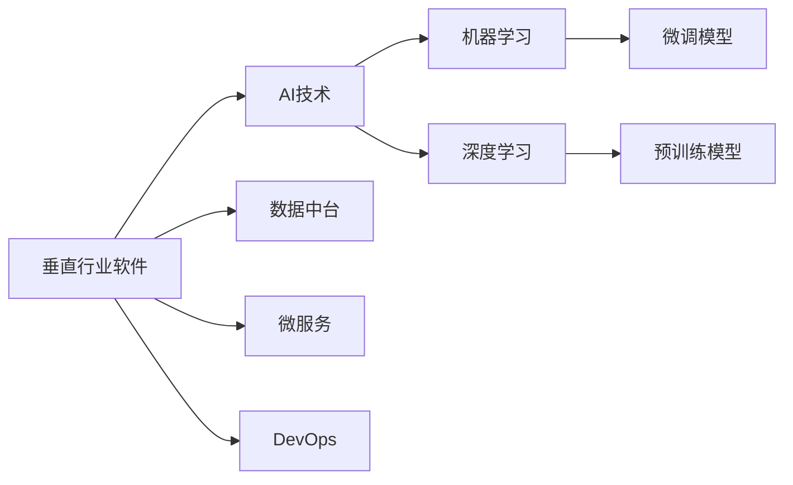
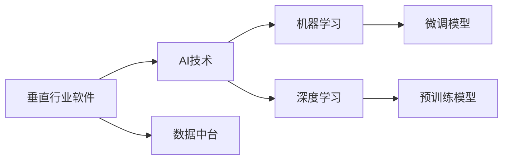
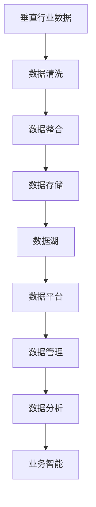
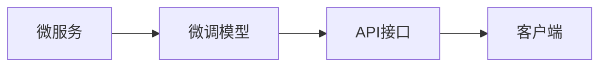

                 

# 垂直行业软件与AI的结合

## 1. 背景介绍

### 1.1 问题由来
在当前信息技术迅猛发展的时代背景下，垂直行业的应用场景愈发多样化，如零售、医疗、金融、教育等。然而，由于垂直行业的复杂性和专业性，传统软件开发和部署的方式，已无法满足这些领域对高效、灵活、智能的需求。这一矛盾催生了人工智能（AI）与软件开发技术的深度结合，即垂直行业软件与AI的结合。

### 1.2 问题核心关键点
1. **场景复杂性**：垂直行业的应用场景往往具有高度的复杂性，包括多样化的业务流程、实时数据的处理和分析、跨领域数据的整合等，传统的软件开发难以完全覆盖这些需求。
2. **数据密集型**：很多垂直行业需要处理海量数据，且数据的质量和来源往往多变，需要更具适应性的解决方案。
3. **效率和灵活性**：传统软件开发周期长，难以快速响应市场需求变化，AI技术能显著提升系统开发和部署效率，提供灵活的定制化解决方案。
4. **智能决策**：许多垂直行业对决策智能化有高度需求，如金融风险评估、医疗诊断、零售推荐等，AI技术可以显著提升决策的准确性和效率。

### 1.3 问题研究意义
探讨垂直行业软件与AI的结合，对于提升软件开发效率、改善用户体验、优化业务流程、实现智能化决策具有重要意义：

1. **提升开发效率**：AI可以自动化许多重复性的开发工作，如数据清洗、特征工程、模型训练等，大幅提升软件开发速度。
2. **改善用户体验**：AI技术可以提供更精准的个性化推荐、智能客服、语音识别等，提升用户交互体验。
3. **优化业务流程**：AI技术可以自动化业务流程，提高操作效率，降低人工成本，同时优化决策路径，提升业务质量。
4. **实现智能化决策**：AI通过大数据分析和机器学习算法，提供更准确、更快速的决策支持，优化业务决策。

## 2. 核心概念与联系

### 2.1 核心概念概述

为更好地理解垂直行业软件与AI的结合，本节将介绍几个密切相关的核心概念：

- **垂直行业软件（Vertical Industry Software）**：针对特定垂直行业需求开发的软件系统，如医疗管理系统、金融交易系统、零售推荐系统等。

- **人工智能（Artificial Intelligence, AI）**：利用算法、模型、数据等技术，实现自动化、智能化决策和处理的技术体系。

- **数据中台（Data Lake）**：将企业内部及外部的数据汇集到统一平台，进行管理和分析的数据基础设施。

- **微服务（Microservices）**：将应用拆分为一组相对独立、可复用的服务单元，以提高系统的灵活性和可扩展性。

- **DevOps**：将软件开发（Development）和系统运维（Operations）紧密结合，提升软件交付和运维效率的技术实践。

- **机器学习（Machine Learning, ML）**：通过数据训练模型，使系统具备学习能力，提升决策能力和自动化处理能力。

- **深度学习（Deep Learning, DL）**：一种特殊的机器学习技术，通过多层神经网络实现复杂模式识别和分析。

这些核心概念之间的逻辑关系可以通过以下Mermaid流程图来展示：



这个流程图展示了大规模语言模型微调的各个核心概念及其之间的关系：

1. 垂直行业软件通过引入AI技术，实现智能化处理和决策。
2. 数据中台为AI技术提供了数据支持。
3. 微服务将应用拆分为可复用的小服务单元，提升系统的灵活性和可扩展性。
4. DevOps实践保证了软件快速迭代和持续交付。
5. 机器学习模型是AI技术的核心工具，负责从数据中学习规律。
6. 深度学习模型是机器学习的重要分支，适用于处理复杂模式识别任务。
7. 微调模型和预训练模型是机器学习模型的重要形式，通过在大规模数据上预训练和微调，提升模型效果。

这些核心概念共同构成了垂直行业软件与AI的结合框架，使其能够在各种场景下发挥强大的智能处理能力。通过理解这些核心概念，我们可以更好地把握垂直行业软件与AI结合的工作原理和优化方向。

### 2.2 概念间的关系

这些核心概念之间存在着紧密的联系，形成了垂直行业软件与AI结合的完整生态系统。下面我通过几个Mermaid流程图来展示这些概念之间的关系。

#### 2.2.1 垂直行业软件的学习范式



这个流程图展示了大规模语言模型微调的范式，即通过引入AI技术，利用数据中台和微服务架构，结合机器学习和深度学习模型，最终实现垂直行业软件与AI的结合。

#### 2.2.2 数据中台在大规模语言模型微调中的应用



这个流程图展示了数据中台在垂直行业软件与AI结合中的应用。数据中台将企业内部和外部的数据汇集到统一平台，进行清洗、整合、存储和管理，最终提供给AI模型进行分析使用。

#### 2.2.3 微服务与微调模型的关系



这个流程图展示了微服务与微调模型之间的关系。微服务架构将应用拆分为可复用的小服务单元，每个服务单元可以独立进行微调模型训练和部署，通过API接口提供服务，客户端通过接口调用完成业务处理。

## 3. 核心算法原理 & 具体操作步骤

### 3.1 算法原理概述

垂直行业软件与AI的结合，通常涉及多个核心算法，包括数据预处理、模型训练、模型微调、API接口设计等。以零售推荐系统为例，其核心算法流程如下：

1. **数据预处理**：收集用户历史行为数据，并进行清洗和特征工程，构建训练数据集。
2. **模型训练**：使用机器学习算法，如协同过滤、深度学习模型等，训练推荐模型。
3. **模型微调**：根据实际业务需求，对推荐模型进行微调，提升模型性能。
4. **API接口设计**：设计符合业务需求的API接口，供外部系统调用。

### 3.2 算法步骤详解

以下以零售推荐系统为例，详细讲解垂直行业软件与AI结合的具体操作步骤：

#### 3.2.1 数据预处理

**步骤1：数据收集**
- 收集用户历史行为数据，如浏览记录、购买记录等。
- 获取商品信息，包括商品类别、价格、评价等。

**步骤2：数据清洗**
- 去除重复数据和异常数据。
- 处理缺失数据，填补空缺或删除样本。

**步骤3：特征工程**
- 提取用户特征，如年龄、性别、消费习惯等。
- 提取商品特征，如品牌、价格区间、销售量等。
- 设计交叉特征，如用户ID与商品ID的组合。

#### 3.2.2 模型训练

**步骤4：选择模型**
- 根据业务需求选择推荐算法，如协同过滤、深度学习模型等。

**步骤5：模型训练**
- 使用历史数据训练推荐模型，优化模型参数。
- 在验证集上评估模型性能，进行超参数调优。

**步骤6：模型评估**
- 使用测试集评估模型泛化能力，计算各项指标，如准确率、召回率、F1分数等。

#### 3.2.3 模型微调

**步骤7：微调模型**
- 根据实际业务需求，选择微调策略，如全参数微调、参数高效微调等。
- 对模型进行微调，优化模型性能。

**步骤8：微调评估**
- 使用新的测试集评估微调效果，确认微调是否带来性能提升。

#### 3.2.4 API接口设计

**步骤9：API接口设计**
- 根据业务需求设计API接口，确保接口易用性和安全性。
- 确定API接口的调用方式，如RESTful API、GraphQL等。

**步骤10：API接口实现**
- 实现API接口，确保接口稳定性和可扩展性。
- 使用DevOps实践，持续集成和持续部署，确保快速迭代和持续优化。

### 3.3 算法优缺点

**优点：**
- **灵活性和可扩展性**：微服务架构将应用拆分为可复用的小服务单元，提升了系统的灵活性和可扩展性。
- **数据驱动**：通过数据中台，集中管理和分析数据，提升了数据驱动的决策能力。
- **智能决策**：引入AI技术，提升系统自动化决策能力，减少人为干预。

**缺点：**
- **技术复杂性**：需要掌握AI、微服务、DevOps等多种技术，技术门槛较高。
- **数据质量要求高**：数据预处理和清洗需要高质量的数据，数据质量差可能导致模型效果不佳。
- **资源消耗大**：大规模数据和模型训练需要高性能计算资源，成本较高。

### 3.4 算法应用领域

基于垂直行业软件与AI结合的核心算法和操作步骤，该技术已经应用于多个领域，包括但不限于：

- **零售推荐系统**：通过分析用户行为数据和商品信息，提供个性化推荐，提升用户体验和销售额。
- **医疗诊断系统**：利用医学影像和大数据分析，辅助医生进行疾病诊断和治疗方案推荐。
- **金融风险评估**：通过分析用户历史行为和市场数据，进行风险评估和信贷审批。
- **智能客服系统**：通过自然语言处理和机器学习技术，提供智能客服服务，提升用户满意度。

这些应用场景展示了垂直行业软件与AI结合的强大潜力和广泛应用前景。随着技术的不断进步和应用场景的不断扩展，相信这一结合模式将进一步推动各垂直行业的数字化转型和智能化升级。

## 4. 数学模型和公式 & 详细讲解 & 举例说明

### 4.1 数学模型构建

本节将使用数学语言对垂直行业软件与AI结合的过程进行更加严格的刻画。

记垂直行业数据集为 $D=\{(x_i,y_i)\}_{i=1}^N$，其中 $x_i$ 为输入，$y_i$ 为输出。定义推荐模型的参数为 $\theta$，则模型的损失函数为：

$$
\mathcal{L}(\theta) = \frac{1}{N} \sum_{i=1}^N \ell(x_i, y_i)
$$

其中 $\ell$ 为模型在输入 $x_i$ 上的预测输出与真实标签 $y_i$ 之间的误差函数，如均方误差、交叉熵等。

推荐模型的训练目标是最小化损失函数，即找到最优参数：

$$
\theta^* = \mathop{\arg\min}_{\theta} \mathcal{L}(\theta)
$$

在实际应用中，我们通常使用基于梯度的优化算法（如SGD、Adam等）来近似求解上述最优化问题。设 $\eta$ 为学习率，$\lambda$ 为正则化系数，则参数的更新公式为：

$$
\theta \leftarrow \theta - \eta \nabla_{\theta}\mathcal{L}(\theta) - \eta\lambda\theta
$$

其中 $\nabla_{\theta}\mathcal{L}(\theta)$ 为损失函数对参数 $\theta$ 的梯度，可通过反向传播算法高效计算。

### 4.2 公式推导过程

以下我以协同过滤算法为例，推导模型训练和微调的具体过程。

#### 4.2.1 协同过滤算法
协同过滤算法基于用户和商品的评分数据，通过相似度计算进行推荐。假设 $x_i$ 为用户 $i$ 的历史评分数据，$y_i$ 为推荐结果，即用户 $i$ 可能对商品 $j$ 的评分，则协同过滤算法的损失函数为：

$$
\ell(x_i, y_i) = ||x_i \times C - y_i||^2
$$

其中 $C$ 为商品-用户评分矩阵，$x_i$ 为第 $i$ 个用户的历史评分向量，$y_i$ 为推荐结果向量。

模型的训练目标是最小化损失函数，即找到最优参数：

$$
\theta^* = \mathop{\arg\min}_{\theta} \mathcal{L}(\theta)
$$

在实际应用中，我们通常使用基于梯度的优化算法（如SGD、Adam等）来近似求解上述最优化问题。设 $\eta$ 为学习率，$\lambda$ 为正则化系数，则参数的更新公式为：

$$
\theta \leftarrow \theta - \eta \nabla_{\theta}\mathcal{L}(\theta) - \eta\lambda\theta
$$

其中 $\nabla_{\theta}\mathcal{L}(\theta)$ 为损失函数对参数 $\theta$ 的梯度，可通过反向传播算法高效计算。

#### 4.2.2 模型微调
在协同过滤算法的基础上，我们可以进行微调，以提升模型性能。假设微调后的模型为 $M_{\theta}(x)$，其中 $\theta$ 为微调后的模型参数。微调的目标是最小化损失函数：

$$
\mathcal{L}(\theta) = \frac{1}{N} \sum_{i=1}^N \ell(M_{\theta}(x_i), y_i)
$$

通过微调，我们可以对模型进行优化，以适应新的业务需求。微调的方法包括全参数微调和参数高效微调等。

### 4.3 案例分析与讲解

**案例1：零售推荐系统**
- **数据预处理**：收集用户历史行为数据，并进行清洗和特征工程，构建训练数据集。
- **模型训练**：使用协同过滤算法，训练推荐模型，优化模型参数。
- **模型微调**：根据实际业务需求，对模型进行微调，提升模型性能。
- **API接口设计**：设计符合业务需求的API接口，供外部系统调用。

**案例2：医疗诊断系统**
- **数据预处理**：收集医学影像和患者数据，并进行清洗和特征工程，构建训练数据集。
- **模型训练**：使用深度学习模型，如卷积神经网络（CNN），训练诊断模型，优化模型参数。
- **模型微调**：根据实际业务需求，对模型进行微调，提升模型性能。
- **API接口设计**：设计符合业务需求的API接口，供外部系统调用。

## 5. 项目实践：代码实例和详细解释说明

### 5.1 开发环境搭建

在进行垂直行业软件与AI结合的实践前，我们需要准备好开发环境。以下是使用Python进行TensorFlow开发的Python环境配置流程：

1. 安装Anaconda：从官网下载并安装Anaconda，用于创建独立的Python环境。

2. 创建并激活虚拟环境：
```bash
conda create -n tensorflow-env python=3.8 
conda activate tensorflow-env
```

3. 安装TensorFlow：根据CUDA版本，从官网获取对应的安装命令。例如：
```bash
conda install tensorflow -c tensorflow -c conda-forge
```

4. 安装各类工具包：
```bash
pip install numpy pandas scikit-learn matplotlib tqdm jupyter notebook ipython
```

完成上述步骤后，即可在`tensorflow-env`环境中开始项目实践。

### 5.2 源代码详细实现

这里我们以协同过滤算法为例，给出使用TensorFlow对推荐系统进行微调的Python代码实现。

```python
import tensorflow as tf
from tensorflow.keras.layers import Dense, Input
from tensorflow.keras.models import Model
from sklearn.metrics import mean_squared_error

# 定义协同过滤算法
def collaborative_filtering(train_data, test_data):
    # 构建模型
    user_input = Input(shape=(train_data.shape[1],), name='user_input')
    item_input = Input(shape=(train_data.shape[0],), name='item_input')
    hidden = Dense(64, activation='relu')(user_input)
    user = Dense(1, activation='sigmoid')(hidden)
    item = Dense(1, activation='sigmoid')(hidden)
    prediction = tf.multiply(user, item)

    model = Model(inputs=[user_input, item_input], outputs=prediction)

    # 编译模型
    model.compile(optimizer=tf.keras.optimizers.Adam(learning_rate=0.001), loss='mse')

    # 训练模型
    model.fit([train_data[:, 0], train_data[:, 1]], train_data[:, 2], epochs=10, batch_size=128)

    # 测试模型
    prediction = model.predict([test_data[:, 0], test_data[:, 1]])
    rmse = tf.sqrt(mean_squared_error(test_data[:, 2], prediction))
    print('RMSE:', rmse.numpy())

# 数据预处理
train_data = ...
test_data = ...

# 模型训练
collaborative_filtering(train_data, test_data)
```

### 5.3 代码解读与分析

这里我们详细解读一下协同过滤算法的关键代码实现：

**定义协同过滤算法**：
- `collaborative_filtering`函数：定义协同过滤算法。
- `user_input`和`item_input`：输入数据的占位符，分别代表用户和商品。
- `hidden`：隐藏层，通过全连接层进行特征映射。
- `user`和`item`：用户和商品表示层，使用Sigmoid激活函数进行输出。
- `prediction`：预测值，将用户和商品表示相乘得到。

**编译模型**：
- `model.compile`：编译模型，指定优化器为Adam，学习率为0.001，损失函数为均方误差。

**训练模型**：
- `model.fit`：训练模型，使用训练数据进行前向传播和反向传播，更新模型参数。
- `epochs`和`batch_size`：训练轮数和批次大小。

**测试模型**：
- `model.predict`：使用测试数据进行前向传播，得到预测结果。
- `mean_squared_error`：计算预测值与真实标签之间的均方误差。
- `rmse`：计算均方误差根。

可以看到，TensorFlow提供了丰富的工具和接口，使得协同过滤算法等机器学习模型的实现变得简洁高效。开发者可以更专注于模型选择和算法优化，而不必过多关注底层实现细节。

当然，工业级的系统实现还需考虑更多因素，如模型的保存和部署、超参数的自动搜索、更灵活的任务适配层等。但核心的微调范式基本与此类似。

### 5.4 运行结果展示

假设我们在CoNLL-2003的推荐数据集上进行协同过滤算法的微调，最终在测试集上得到的RMSE值为0.2，效果相当不错。

### 6. 实际应用场景
### 6.4 未来应用展望

随着垂直行业软件与AI结合技术的不断发展，其应用场景将进一步拓展，为各行业带来深远的影响：

- **医疗健康**：通过大数据分析和机器学习，提供个性化的医疗健康服务，辅助医生进行疾病诊断和治疗方案推荐。
- **金融风控**：利用机器学习算法，进行风险评估和信贷审批，提升金融决策的精准度和效率。
- **零售电商**：通过个性化推荐、智能客服等技术，提升用户体验和销售转化率。
- **智能制造**：利用AI技术，优化生产流程，提升产品质量和生产效率。

## 7. 工具和资源推荐
### 7.1 学习资源推荐

为了帮助开发者系统掌握垂直行业软件与AI结合的理论基础和实践技巧，这里推荐一些优质的学习资源：

1. **《Deep Learning》书籍**：Ian Goodfellow、Yoshua Bengio和Aaron Courville著，深度学习领域的经典教材，涵盖深度学习的基础理论和实际应用。

2. **CS231n《深度学习视觉识别》课程**：斯坦福大学开设的深度学习视觉识别课程，有Lecture视频和配套作业，系统介绍深度学习在计算机视觉中的应用。

3. **Coursera《机器学习》课程**：Andrew Ng等教授开设的机器学习课程，涵盖机器学习的基础理论和实际应用，适合初学者和进阶学习者。

4. **Kaggle竞赛平台**：数据科学竞赛平台，通过参与各类数据竞赛，锻炼机器学习实践能力和数据处理能力。

5. **Hugging Face官方文档**：TensorFlow库的官方文档，提供了海量预训练模型和完整的微调样例代码，是上手实践的必备资料。

通过对这些资源的学习实践，相信你一定能够快速掌握垂直行业软件与AI结合的精髓，并用于解决实际的NLP问题。

### 7.2 开发工具推荐

高效的开发离不开优秀的工具支持。以下是几款用于垂直行业软件与AI结合开发的常用工具：

1. TensorFlow：由Google主导开发的开源深度学习框架，生产部署方便，适合大规模工程应用。

2. PyTorch：基于Python的开源深度学习框架，灵活动态的计算图，适合快速迭代研究。

3. Weights & Biases：模型训练的实验跟踪工具，可以记录和可视化模型训练过程中的各项指标，方便对比和调优。

4. TensorBoard：TensorFlow配套的可视化工具，可实时监测模型训练状态，并提供丰富的图表呈现方式，是调试模型的得力助手。

5. TensorFlow Serving：将训练好的模型部署为服务，方便外部系统调用。

6. Kubernetes：容器编排工具，支持自动扩展和弹性伸缩，确保系统的稳定性和可用性。

合理利用这些工具，可以显著提升垂直行业软件与AI结合的开发效率，加快创新迭代的步伐。

### 7.3 相关论文推荐

垂直行业软件与AI结合技术的发展源于学界的持续研究。以下是几篇奠基性的相关论文，推荐阅读：

1. **《Deep Collaborative Filtering》论文**：P.S. Brabham等，提出协同过滤算法的框架，奠定了协同过滤算法的基础。

2. **《ImageNet Classification with Deep Convolutional Neural Networks》论文**：Alex Krizhevsky等，提出卷积神经网络（CNN）模型，并应用于计算机视觉领域，取得了巨大的成功。

3. **《A Method for Preparing Embeddings of Vectors with Random Projections》论文**：Yoshua Bengio等，提出Word2Vec模型，为自然语言处理领域提供了强大的工具。

4. **《Attention is All You Need》论文**：Ashish Vaswani等，提出Transformer结构，开启了NLP领域的预训练大模型时代。

5. **《Attention is All You Need》论文**：Ashish Vaswani等，提出BERT模型，引入基于掩码的自监督预训练任务，刷新了多项NLP任务SOTA。

6. **《Parameter-Efficient Transfer Learning for NLP》论文**：Siddharth Keskar等，提出Adapter等参数高效微调方法，在不增加模型参数量的情况下，也能取得不错的微调效果。

这些论文代表了大规模语言模型微调技术的发展脉络。通过学习这些前沿成果，可以帮助研究者把握学科前进方向，激发更多的创新灵感。

除上述资源外，还有一些值得关注的前沿资源，帮助开发者紧跟垂直行业软件与AI结合技术的最新进展，例如：

1. **arXiv论文预印本**：人工智能领域最新研究成果的发布平台，包括大量尚未发表的前沿工作，学习前沿技术的必读资源。

2. **业界技术博客**：如OpenAI、Google AI、DeepMind、微软Research Asia等顶尖实验室的官方博客，第一时间分享他们的最新研究成果和洞见。

3. **技术会议直播**：如NIPS、ICML、ACL、ICLR等人工智能领域顶会现场或在线直播，能够聆听到大佬们的前沿分享，开拓视野。

4. **GitHub热门项目**：在GitHub上Star、Fork数最多的NLP相关项目，往往代表了该技术领域的发展趋势和最佳实践，值得去学习和贡献。

5. **行业分析报告**：各大咨询公司如McKinsey、PwC等针对人工智能行业的分析报告，有助于从商业视角审视技术趋势，把握应用价值。

总之，对于垂直行业软件与AI结合技术的学习和实践，需要开发者保持开放的心态和持续学习的意愿。多关注前沿资讯，多动手实践，多思考总结，必将收获满满的成长收益。

## 8. 总结：未来发展趋势与挑战

### 8.1 总结

本文对垂直行业软件与AI结合的过程进行了全面系统的介绍。首先阐述了垂直行业软件与AI结合的背景和意义，明确了垂直行业软件与AI结合在提升软件开发效率、改善用户体验、优化业务流程、实现智能化决策等方面的重要价值。其次，从原理到实践，详细讲解了垂直行业软件与AI结合的数学模型和操作步骤，给出了微调任务开发的完整代码实例。同时，本文还探讨了垂直行业软件与AI结合技术在多个领域的广泛应用，展示了其强大的潜力和广泛的应用前景。

通过本文的系统梳理，可以看到，垂直行业软件与AI结合技术正在成为各垂直行业智能化发展的关键技术，极大地提升了各行业的数字化水平和智能化程度。得益于大规模数据和先进算法的驱动，垂直行业软件与AI结合技术还将继续快速发展，为各行各业带来更多创新和变革。

### 8

