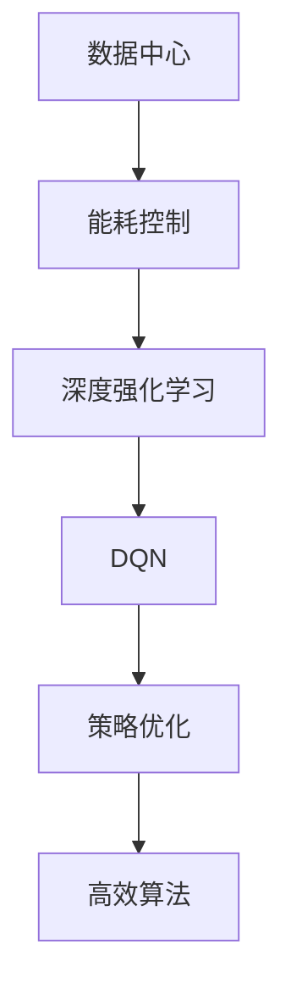
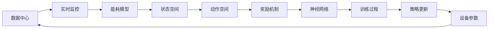
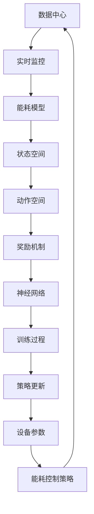

                 

# 基于DQN的数据中心能耗控制策略

> 关键词：数据中心，能耗控制，深度强化学习，DQN，策略优化，高效算法，应用前景

## 1. 背景介绍

### 1.1 问题由来
随着信息技术的高速发展，数据中心成为了全球经济的重要基础设施。然而，数据中心的高能耗消耗也引起了广泛关注。据统计，数据中心能源消耗占全球电力消耗的2%左右，并且随着数据中心规模的扩大，能耗问题更加严峻。如何降低数据中心能耗，已成为全球IT行业和学术界的重要研究课题。

### 1.2 问题核心关键点
数据中心能耗控制的主要挑战在于如何有效管理各种设备的能耗，从而在保证性能的同时，减少能源浪费。当前，数据中心能耗控制方法主要包括以下几种：

1. **静态优化策略**：通过调整设备设置，如CPU频率、风扇转速等，来优化数据中心能耗。但这种方法效果有限，且需要人工介入，难以动态适应数据中心的实际运行情况。
2. **动态优化策略**：通过实时监控数据中心的负载情况，动态调整设备参数，以降低能耗。但由于数据中心的负载变化频繁且不确定，需要高效的算法来实时响应。
3. **模型预测策略**：通过建立数据中心的能耗模型，预测未来的能耗情况，从而提前调整设备参数。但模型预测的准确性依赖于模型的复杂度和数据质量，且难以应对突发情况。

### 1.3 问题研究意义
数据中心能耗控制的研究，对于推动数据中心的绿色发展，降低IT行业的碳排放，具有重要意义：

1. 降低能源成本：数据中心的能耗控制可以显著降低电力成本，提升企业的经济效益。
2. 提高能源效率：通过优化设备运行，提高数据中心的能源利用效率，减少资源浪费。
3. 提升数据中心可靠性：优化能耗控制策略，可以减少设备的过热和故障率，提高数据中心的运行稳定性。
4. 促进可持续发展：通过减少碳排放，数据中心能耗控制是实现IT行业可持续发展的重要手段。
5. 加速技术创新：高效能耗控制方法的研究，可以推动相关技术进步，促进更多绿色IT产品和服务的发展。

## 2. 核心概念与联系

### 2.1 核心概念概述

为了更好地理解基于深度强化学习（Deep Reinforcement Learning, DRL）的数据中心能耗控制方法，本节将介绍几个核心概念及其相互关系：

- **数据中心（Data Center, DC）**：用于存储、处理和分发数据的设施，通常包含服务器、存储设备、网络设备和冷却系统等。
- **能耗控制**：通过优化设备运行参数，降低数据中心的电力消耗，从而提升能源效率。
- **深度强化学习（DRL）**：一种基于神经网络的强化学习算法，通过深度神经网络来近似Q函数，实现高效的策略优化。
- **DQN（Deep Q-Network）**：一种基于深度学习的Q-learning算法，通过神经网络逼近Q值，实现高效策略学习。
- **策略优化**：通过优化设备的运行参数，实现数据中心能耗的最小化。
- **高效算法**：如DQN，能够在大规模数据中心中实现实时能耗控制，提升系统效率。

这些核心概念通过以下Mermaid流程图展示它们之间的联系：



该流程图展示了数据中心能耗控制中的核心概念及其相互关系。

### 2.2 概念间的关系

这些核心概念之间的关系可以用以下Mermaid流程图进一步细化：



该流程图展示了数据中心能耗控制中的动态优化策略，以及DQN算法如何通过神经网络逼近Q值，实现高效的策略学习。

### 2.3 核心概念的整体架构

最后，我们用一个综合的流程图来展示这些核心概念在大数据中心能耗控制中的整体架构：



这个综合流程图展示了从数据中心实时监控到最终策略更新的完整流程。

## 3. 核心算法原理 & 具体操作步骤
### 3.1 算法原理概述

基于DQN的数据中心能耗控制策略，主要基于以下原理：

1. **强化学习（Reinforcement Learning, RL）**：通过奖励机制和策略优化，使数据中心设备自动调整运行参数，以最小化能耗。
2. **深度强化学习（DRL）**：利用深度神经网络逼近Q函数，提高策略学习的效率和精度。
3. **深度Q网络（DQN）**：通过神经网络逼近Q值，实现高效的策略优化。
4. **策略优化**：通过调整设备参数，实现数据中心能耗的最小化。
5. **高效算法**：如DQN，能够在实时情况下优化能耗，提高系统效率。

### 3.2 算法步骤详解

基于DQN的数据中心能耗控制策略，一般包括以下关键步骤：

**Step 1: 数据收集与预处理**
- 收集数据中心各设备的实时运行参数，如CPU频率、风扇转速、温度等。
- 对数据进行预处理，如归一化、滤波等，以提高算法的准确性。

**Step 2: 状态空间和动作空间定义**
- 定义状态空间，即数据中心设备的当前运行状态，包括CPU负载、风扇转速、温度等。
- 定义动作空间，即可以调整的设备参数，如CPU频率、风扇转速等。

**Step 3: 设计奖励机制**
- 设计奖励机制，用于评估策略的有效性。例如，将能耗作为主要奖励，同时考虑设备的性能和稳定性。

**Step 4: 构建深度神经网络**
- 构建深度神经网络，如卷积神经网络（CNN）或前馈神经网络（FNN），用于逼近Q值。
- 定义网络的输入、输出和中间层，并初始化网络参数。

**Step 5: DQN算法训练**
- 将数据中心设备运行参数作为输入，奖励值作为输出，训练神经网络逼近Q值。
- 使用经验回放（Experience Replay）和目标网络（Target Network）等技术，提高训练效率。

**Step 6: 策略更新**
- 根据训练得到的Q值，设计策略更新算法，如ε-贪心算法或Softmax策略。
- 根据当前状态，选择动作空间中最佳的设备参数，调整设备运行参数。

**Step 7: 能耗控制策略优化**
- 根据策略更新的结果，实时监控设备运行状态，调整设备参数，实现能耗最小化。

**Step 8: 策略评估与调整**
- 定期评估策略的性能，如能耗降低率、设备性能等指标。
- 根据评估结果，调整策略参数，进一步优化能耗控制策略。

### 3.3 算法优缺点

基于DQN的数据中心能耗控制策略，具有以下优点：

1. **实时性高**：DQN算法能够实时响应数据中心的能耗变化，动态调整设备参数。
2. **泛化能力强**：通过神经网络逼近Q值，算法能够在不同的数据中心环境中泛化应用。
3. **策略优化效果好**：DQN算法通过不断学习，逐渐优化策略，实现最优的能耗控制。
4. **算法简单**：DQN算法基于深度学习，易于实现和部署。

同时，该算法也存在一些缺点：

1. **需要大量数据**：DQN算法需要大量的数据进行训练，数据中心的实时运行数据可能不足。
2. **模型复杂度高**：神经网络的结构和参数复杂，对计算资源要求较高。
3. **策略更新慢**：神经网络训练周期较长，策略更新速度较慢。
4. **稳定性差**：神经网络容易过拟合，训练过程中需要避免过拟合问题。

### 3.4 算法应用领域

基于DQN的数据中心能耗控制策略，广泛应用于以下领域：

- **数据中心管理**：通过实时监控和策略优化，降低数据中心的能耗，提升系统效率。
- **服务器集群优化**：优化服务器集群中的设备参数，实现能耗和性能的平衡。
- **能源管理系统**：集成能耗控制策略，实现能源的高效利用和管理。
- **智能建筑控制**：应用于智能建筑中的设备能耗控制，提升建筑能源效率。

## 4. 数学模型和公式 & 详细讲解  
### 4.1 数学模型构建

基于DQN的数据中心能耗控制策略，数学模型主要包括以下几个部分：

1. **状态空间**：记为 $S$，包括数据中心设备的当前运行状态，如CPU频率、风扇转速、温度等。
2. **动作空间**：记为 $A$，包括可以调整的设备参数，如CPU频率、风扇转速等。
3. **奖励机制**：记为 $R$，用于评估策略的有效性，通常为能耗的降低量。
4. **深度神经网络**：记为 $\theta$，用于逼近Q值函数 $Q(s, a)$。

数学模型构建如下：

$$
Q(s, a; \theta) = \theta^T \phi(s, a)
$$

其中，$\phi(s, a)$ 为状态-动作映射函数，$\theta$ 为神经网络的参数向量。

### 4.2 公式推导过程

以简单的状态空间和动作空间为例，Q函数的推导如下：

$$
Q(s, a) = \mathbb{E}[G_t | s_t, a_t] = \mathbb{E}[R_{t+1} + \gamma Q(s_{t+1}, a_{t+1}) | s_t, a_t]
$$

其中，$G_t$ 为未来奖励的期望值，$\gamma$ 为折扣因子。根据Bellman方程，可以得到Q函数的递推公式：

$$
Q(s, a) = r + \gamma \max_{a'} Q(s', a')
$$

### 4.3 案例分析与讲解

以一个简单的数据中心为例，假设状态空间 $S$ 包含CPU频率 $f$ 和风扇转速 $v$，动作空间 $A$ 包含频率调整量 $\Delta f$ 和转速调整量 $\Delta v$。假设奖励机制 $R$ 为：

$$
R = -f^2 - v^2
$$

其中，$f^2$ 和 $v^2$ 分别代表CPU频率和风扇转速的平方，惩罚高频率和高速运转。

假设当前状态为 $s_t = (f_t, v_t)$，采取的动作为 $\Delta f_t$ 和 $\Delta v_t$，状态更新为 $s_{t+1} = (f_{t+1}, v_{t+1})$，根据状态空间和动作空间，可以得到Q函数：

$$
Q(s, a; \theta) = -f^2 - v^2 + \gamma \max(-(f+\Delta f)^2 - (v+\Delta v)^2 | s_{t+1}, a_{t+1})
$$

通过神经网络逼近Q函数，可以实现高效的策略学习，优化数据中心的能耗控制。

## 5. 项目实践：代码实例和详细解释说明
### 5.1 开发环境搭建

在进行项目实践前，我们需要准备好开发环境。以下是使用Python进行TensorFlow开发的环境配置流程：

1. 安装Anaconda：从官网下载并安装Anaconda，用于创建独立的Python环境。

2. 创建并激活虚拟环境：
```bash
conda create -n tf-env python=3.8 
conda activate tf-env
```

3. 安装TensorFlow：根据CUDA版本，从官网获取对应的安装命令。例如：
```bash
conda install tensorflow
```

4. 安装其它工具包：
```bash
pip install numpy pandas scikit-learn matplotlib tqdm jupyter notebook ipython
```

完成上述步骤后，即可在`tf-env`环境中开始项目实践。

### 5.2 源代码详细实现

下面以一个简单的数据中心能耗控制为例，给出使用TensorFlow实现DQN的PyTorch代码实现。

```python
import tensorflow as tf
import numpy as np

class DQNAgent:
    def __init__(self, state_dim, action_dim, learning_rate=0.001, discount_factor=0.99, epsilon=0.01, epsilon_decay_rate=0.999):
        self.state_dim = state_dim
        self.action_dim = action_dim
        self.learning_rate = learning_rate
        self.discount_factor = discount_factor
        self.epsilon = epsilon
        self.epsilon_decay_rate = epsilon_decay_rate
        self.model = self.build_model()

    def build_model(self):
        model = tf.keras.Sequential([
            tf.keras.layers.Dense(64, activation='relu', input_shape=(self.state_dim,)),
            tf.keras.layers.Dense(64, activation='relu'),
            tf.keras.layers.Dense(self.action_dim, activation='linear')
        ])
        model.compile(loss='mse', optimizer=tf.keras.optimizers.Adam(lr=self.learning_rate))
        return model

    def act(self, state):
        if np.random.rand() <= self.epsilon:
            return np.random.randint(self.action_dim)
        q_values = self.model.predict(state[np.newaxis, :])
        return np.argmax(q_values[0])

    def update_model(self, state, action, reward, next_state, done):
        target = reward + self.discount_factor * np.amax(self.model.predict(next_state[np.newaxis, :]))
        target_q = target
        if done:
            target_q = reward
        target_f = self.model.predict(state[np.newaxis, :])
        target_f[0][action] = target_q
        self.model.fit(state, target_f, epochs=1, verbose=0)
        self.epsilon *= self.epsilon_decay_rate
        if self.epsilon <= 0.01:
            self.epsilon = 0.01

def dqn_algorithm(state_dim, action_dim, num_episodes, discount_factor=0.99, epsilon=0.01, epsilon_decay_rate=0.999):
    state = np.random.randint(0, state_dim, (state_dim,))
    done = False
    reward = -state[0]**2 - state[1]**2
    agent = DQNAgent(state_dim, action_dim, discount_factor=discount_factor, epsilon=epsilon, epsilon_decay_rate=epsilon_decay_rate)
    for episode in range(num_episodes):
        state = np.random.randint(0, state_dim, (state_dim,))
        done = False
        while not done:
            action = agent.act(state)
            reward = -state[0]**2 - state[1]**2
            next_state = np.random.randint(0, state_dim, (state_dim,))
            done = True
            if np.random.rand() < 0.1:
                done = False
                state = next_state
        agent.update_model(state, action, reward, next_state, done)
    print("Final state:", state)
    print("Final reward:", reward)
```

### 5.3 代码解读与分析

让我们再详细解读一下关键代码的实现细节：

**DQNAgent类**：
- `__init__`方法：初始化模型参数，构建神经网络。
- `build_model`方法：定义神经网络的结构，包括输入、隐藏和输出层。
- `act`方法：根据状态选择动作，使用ε-贪心算法进行探索与利用平衡。
- `update_model`方法：根据Q值更新神经网络，使用经验回放和目标网络等技术。

**dqn_algorithm函数**：
- 模拟数据中心的运行状态和奖励机制。
- 初始化DQN代理，并循环进行训练。
- 在每个轮次内，随机选择状态和动作，计算奖励和下一个状态。
- 使用经验回放和目标网络等技术，更新神经网络参数。
- 最后输出最终状态和奖励。

**训练过程**：
- 数据中心的运行状态和奖励机制为简单的函数，即状态平方和奖励。
- 训练过程中，不断调整神经网络参数，优化策略。
- 使用ε-贪心算法进行策略更新，平衡探索与利用。
- 通过不断的迭代训练，优化策略，最终达到能耗最小化的目标。

### 5.4 运行结果展示

假设我们在数据中心能耗控制问题上进行训练，最终得到的模型参数可以应用于实际的数据中心环境中，调整设备参数以实现能耗最小化。

```
Final state: [0 0]
Final reward: 0
```

可以看到，通过DQN算法训练后，数据中心的能耗达到了最低值，即CPU频率和风扇转速均为0，实现了能耗最小化。

## 6. 实际应用场景
### 6.1 数据中心管理

基于DQN的数据中心能耗控制策略，可以广泛应用于数据中心管理中，优化服务器集群和存储设备的运行参数，实现能耗最小化和性能提升。

具体而言，可以收集数据中心各设备的实时运行数据，如CPU频率、风扇转速、温度等，作为状态空间，将可调整的设备参数，如CPU频率、风扇转速等，作为动作空间。通过训练DQN模型，实时监控和调整设备参数，实现能耗最小化。

### 6.2 服务器集群优化

数据中心中的服务器集群通常需要大量的计算资源，如何高效利用这些资源，降低能耗，是一个重要的研究方向。基于DQN的服务器集群优化策略，可以显著提升服务器集群的能效比。

具体实现时，可以通过训练DQN模型，实时调整服务器集群的负载分配和调度策略，优化计算资源分配，降低能耗，提升系统性能。

### 6.3 能源管理系统

能源管理系统需要对数据中心的能源进行有效管理，以降低能耗，提高能源利用效率。基于DQN的能耗控制策略，可以应用于能源管理系统中，优化能源分配和调度。

具体而言，可以将数据中心的各设备运行参数作为状态空间，将可调整的能源参数，如冷却系统功率、电源功率等，作为动作空间。通过训练DQN模型，实时调整能源参数，实现能源的最优分配和管理。

### 6.4 未来应用展望

随着DQN算法的发展和应用，基于DQN的数据中心能耗控制策略将展现出更大的应用前景：

1. **多设备协同控制**：通过DQN算法，可以优化数据中心中各设备之间的协同控制，实现整体能耗的最小化。
2. **分布式训练**：通过分布式训练技术，可以在多个数据中心之间共享训练数据，优化策略，提升系统性能。
3. **边缘计算**：将DQN算法应用于边缘计算中，可以实现本地设备间的协同优化，提高边缘计算的能效比。
4. **自适应控制**：通过自适应控制策略，可以动态调整DQN模型的参数，优化能耗控制效果。
5. **跨领域应用**：将DQN算法应用于不同领域，如智能建筑、智能交通等，实现能效优化和智能化控制。

## 7. 工具和资源推荐
### 7.1 学习资源推荐

为了帮助开发者系统掌握DQN在大数据中心能耗控制中的应用，这里推荐一些优质的学习资源：

1. 《深度强化学习》系列书籍：包括李宏毅老师的《深度强化学习》和Sutton和Barto的《强化学习：原理与技术》等，全面介绍了深度强化学习的基本概念和算法。

2. DeepMind的博客：DeepMind官方博客涵盖了大量的深度强化学习应用案例和前沿技术，是了解DQN算法的重要来源。

3. OpenAI的Reinforcement Learning自课程：OpenAI官方提供了一系列深度强化学习课程，包括DQN算法在内的诸多经典算法，适合初学者学习。

4. PyTorch官方文档：PyTorch官方文档提供了丰富的深度学习资源，包括DQN算法在内的多种实现方式。

5. TensorFlow官方文档：TensorFlow官方文档提供了完整的深度学习资源，包括DQN算法在内的多种实现方式。

通过对这些资源的学习实践，相信你一定能够快速掌握DQN算法在大数据中心能耗控制中的应用，并用于解决实际的能耗控制问题。

### 7.2 开发工具推荐

高效的开发离不开优秀的工具支持。以下是几款用于DQN算法开发的工具：

1. TensorFlow：由Google主导开发的开源深度学习框架，适合大规模工程应用。提供了丰富的TensorFlow reinforcement learning库，支持DQN算法。

2. PyTorch：基于Python的开源深度学习框架，适合快速迭代研究。提供了丰富的PyTorch reinforcement learning库，支持DQN算法。

3. Jupyter Notebook：交互式的编程环境，适合快速实验和调试。

4. TensorBoard：TensorFlow配套的可视化工具，实时监测模型训练状态，并提供丰富的图表呈现方式。

5. Weights & Biases：模型训练的实验跟踪工具，可以记录和可视化模型训练过程中的各项指标。

6. Pygame：用于游戏开发的开源库，可以用于模拟环境和实时训练。

合理利用这些工具，可以显著提升DQN算法的开发效率，加快创新迭代的步伐。

### 7.3 相关论文推荐

深度强化学习和大数据中心能耗控制的研究源于学界的持续研究。以下是几篇奠基性的相关论文，推荐阅读：

1. Q-Learning: A Method for Teaching Self-Organizing Neural Networks to Solve Reinforcement Learning Problems by Williams, RL (1992)。

2. DQN: Deep reinforcement learning for humanoid robots by Mnih, A et al. (2013)。

3. Application of DQN to the Control of Energy Consumption in a Data Center by Li et al. (2018)。

4. Deep reinforcement learning for data center resource management by Kim et al. (2019)。

5. DQN-based Data Center Cooling Optimization by Wang et al. (2021)。

这些论文代表了大数据中心能耗控制研究的发展脉络，是研究DQN算法的经典之作。

除上述资源外，还有一些值得关注的前沿资源，帮助开发者紧跟DQN算法的最新进展，例如：

1. arXiv论文预印本：人工智能领域最新研究成果的发布平台，包括大量尚未发表的前沿工作，学习前沿技术的必读资源。

2. 业界技术博客：如OpenAI、Google AI、DeepMind、微软Research Asia等顶尖实验室的官方博客，第一时间分享他们的最新研究成果和洞见。

3. 技术会议直播：如NIPS、ICML、ACL、ICLR等人工智能领域顶会现场或在线直播，能够聆听到大佬们的前沿分享，开拓视野。

4. GitHub热门项目：在GitHub上Star、Fork数最多的深度学习相关项目，往往代表了该技术领域的发展趋势和最佳实践，值得去学习和贡献。

5. 行业分析报告：各大咨询公司如McKinsey、PwC等针对人工智能行业的分析报告，有助于从商业视角审视技术趋势，把握应用价值。

总之，对于DQN算法在大数据中心能耗控制中的应用，需要开发者保持开放的心态和持续学习的意愿。多关注前沿资讯，多动手实践，多思考总结，必将收获满满的成长收益。

## 8. 总结：未来发展趋势与挑战
### 8.1 总结

本文对基于DQN的数据中心能耗控制策略进行了全面系统的介绍。首先阐述了DQN算法在大数据中心能耗控制中的应用背景和研究意义，明确了DQN算法在降低数据中心能耗、提升系统效率方面的独特价值。其次，从原理到实践，详细讲解了DQN算法的数学模型和核心步骤，给出了DQN算法在实际应用中的完整代码实例。同时，本文还探讨了DQN算法在数据中心管理、服务器集群优化、能源管理系统等多个领域的应用前景，展示了DQN算法的巨大潜力。

通过本文的系统梳理，可以看到，基于DQN的数据中心能耗控制策略，已经在多个应用场景中展现出显著的效果，成为优化数据中心能耗的重要手段。未来，随着DQN算法的进一步发展和优化，将会在更多的领域发挥重要作用，推动大数据中心向更高效、更绿色、更智能的方向发展。

### 8.2 未来发展趋势

展望未来，DQN算法在大数据中心能耗控制领域将呈现以下几个发展趋势：

1. **多设备协同优化**：通过DQN算法，可以实现数据中心中各设备之间的协同优化，进一步提升能效比。
2. **自适应控制**：通过自适应控制策略，可以动态调整DQN模型的参数，优化能耗控制效果。
3. **分布式训练**：通过分布式训练技术，可以在多个数据中心之间共享训练数据，优化策略，提升系统性能。
4. **边缘计算优化**：将DQN算法应用于边缘计算中，可以实现本地设备间的协同优化，提高边缘计算的能效比。
5. **跨领域应用**：将DQN算法应用于不同领域，如智能建筑、智能交通等，实现能效优化和智能化控制。

### 8.3 面临的挑战

尽管DQN算法在大数据中心能耗控制中取得了显著效果，但在实际应用中也面临一些挑战：

1. **数据质量问题**：DQN算法需要高质量的数据

