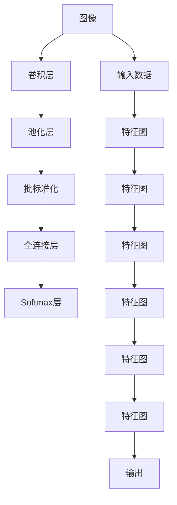

                 

# 基于DeepLearning的图片分类

> 关键词：
- 深度学习
- 卷积神经网络
- 卷积层
- 池化层
- 批标准化
- 全连接层
- 损失函数
- 梯度下降

## 1. 背景介绍

在人工智能的早期阶段，图像处理和识别一直是一个热门的研究领域。随着深度学习技术的发展，卷积神经网络（Convolutional Neural Networks, CNNs）成为图像分类任务中的重要工具。在Kaggle、ImageNet等比赛中，基于CNN的模型多次夺魁。本节将详细介绍基于深度学习的图片分类，包括CNN的基本结构，以及常见问题的解决方法。

### 1.1 问题的由来

图像分类任务通常是指将输入的图像分到若干个预定义的类别中。这在计算机视觉中应用广泛，例如人脸识别、物体检测、医疗影像诊断等。传统方法包括手工设计的特征提取与分类器训练，但这些方法往往需要大量的手工工程和经验，并且对于复杂的图像识别问题，往往难以取得令人满意的效果。

深度学习中的CNN提供了一种自动提取特征的方式，使得模型能够学习到数据中的各种复杂模式，从而在图像分类任务上取得了显著的突破。本节将重点介绍CNN的基本结构，以及其在图像分类中的应用。

### 1.2 问题核心关键点

CNN主要由卷积层、池化层和全连接层组成，其核心思想是通过卷积核提取图像局部特征，通过池化层减小特征图的大小，最后通过全连接层将特征映射到预定义的类别上。相比于传统方法，CNN减少了特征工程的复杂性，提高了模型的自动化程度。

CNN在图像分类任务中的应用包括：

- 收集足够多的标注数据，作为模型的训练集。
- 选择合适的CNN结构，进行特征提取。
- 通过交叉熵损失函数，最小化模型预测与真实标签的差异。
- 使用梯度下降等优化算法，更新模型参数。

CNN的强大之处在于其能够学习到复杂的图像特征，并且对于小样本数据也有不错的泛化性能。此外，CNN在大规模数据集上的训练速度也比较快，这使得其成为了图像分类任务中的首选方法。

## 2. 核心概念与联系

### 2.1 核心概念概述

本节将介绍卷积神经网络、卷积层、池化层、批标准化、全连接层、损失函数等核心概念，并通过Mermaid流程图展示它们之间的关系。



这个流程图示意了CNN的基本结构。输入数据通过卷积层和池化层进行特征提取，批标准化调整特征分布，全连接层将特征映射到预定义的类别上，并通过Softmax层输出概率。

### 2.2 概念间的关系

#### 2.2.1 卷积神经网络

CNN是一种前馈神经网络，由多个卷积层和全连接层组成。其主要特点是：

- 卷积层提取局部特征，减少参数数量，降低过拟合风险。
- 池化层减小特征图的大小，提高模型的计算效率。
- 全连接层将特征映射到预定义的类别上，进行分类。

#### 2.2.2 卷积层

卷积层是CNN的核心组成部分，通过卷积核在特征图上进行卷积操作，提取图像的局部特征。其数学表达式如下：

$$
y_{i,j} = \sum_{k=0}^{K-1} \sum_{m=0}^{M-1} \sum_{n=0}^{N-1} x_{i+k,j+m,n} * W_{k,m,n}
$$

其中，$x$为输入特征图，$y$为卷积后的特征图，$W$为卷积核，$*$为卷积运算。

#### 2.2.3 池化层

池化层用于减小特征图的大小，提高模型的计算效率。常见的池化操作包括最大池化和平均池化。其数学表达式如下：

$$
y_{i,j} = \max\limits_{m,n} x_{i+k,j+m,n}
$$

或

$$
y_{i,j} = \frac{1}{K*M} \sum\limits_{k=0}^{K-1} \sum\limits_{m=0}^{M-1} x_{i+k,j+m,n}
$$

其中，$x$为输入特征图，$y$为池化后的特征图，$*$为池化操作。

#### 2.2.4 批标准化

批标准化是一种用于加速神经网络训练的策略。其作用是通过对每个批次的特征图进行归一化，使得模型在不同批次的数据上，具有相似的分布，从而加速收敛。

#### 2.2.5 全连接层

全连接层将特征图映射到预定义的类别上，进行分类。其数学表达式如下：

$$
y = softmax(W * x + b)
$$

其中，$x$为输入特征图，$y$为输出类别，$W$为权重矩阵，$b$为偏置项，$softmax$为激活函数。

#### 2.2.6 损失函数

损失函数用于衡量模型预测与真实标签的差异。常见的损失函数包括交叉熵损失函数。其数学表达式如下：

$$
J = -\frac{1}{N} \sum_{i=1}^{N} \sum_{j=1}^{C} y_{ij} * \log(p_{ij})
$$

其中，$y$为真实标签，$p$为模型预测概率，$J$为损失函数，$N$为样本数量，$C$为类别数。

## 3. 核心算法原理 & 具体操作步骤

### 3.1 算法原理概述

基于深度学习的图像分类，主要包括以下步骤：

1. 收集足够多的标注数据，作为模型的训练集。
2. 构建CNN结构，进行特征提取。
3. 通过交叉熵损失函数，最小化模型预测与真实标签的差异。
4. 使用梯度下降等优化算法，更新模型参数。

### 3.2 算法步骤详解

**Step 1: 准备数据集**

假设我们有一个包含$N$个训练样本的图像数据集$D=\{x_1,x_2,\dots,x_N\}$，每个样本为$3 \times 224 \times 224$的RGB图像，对应$C$个类别标签$y=\{y_1,y_2,\dots,y_N\}$。

**Step 2: 构建CNN结构**

构建一个包含3个卷积层、3个池化层和2个全连接层的CNN结构。每一层的具体实现细节如下：

```python
import torch.nn as nn

class CNN(nn.Module):
    def __init__(self):
        super(CNN, self).__init__()
        self.conv1 = nn.Conv2d(3, 32, kernel_size=3, padding=1)
        self.conv2 = nn.Conv2d(32, 64, kernel_size=3, padding=1)
        self.conv3 = nn.Conv2d(64, 128, kernel_size=3, padding=1)
        self.pool = nn.MaxPool2d(kernel_size=2, stride=2)
        self.fc1 = nn.Linear(128*14*14, 256)
        self.fc2 = nn.Linear(256, C)
        self.softmax = nn.Softmax(dim=1)

    def forward(self, x):
        x = self.pool(nn.functional.relu(self.conv1(x)))
        x = self.pool(nn.functional.relu(self.conv2(x)))
        x = self.pool(nn.functional.relu(self.conv3(x)))
        x = x.view(-1, 128*14*14)
        x = nn.functional.relu(self.fc1(x))
        x = nn.functional.relu(self.fc2(x))
        x = self.softmax(x)
        return x
```

**Step 3: 设置超参数**

设置模型的超参数，包括学习率、批大小、迭代轮数等：

```python
learning_rate = 0.001
batch_size = 64
epochs = 10
```

**Step 4: 执行训练**

使用交叉熵损失函数，在训练集上进行模型训练。使用Adam优化器进行参数更新，代码如下：

```python
import torch.optim as optim

model = CNN()
criterion = nn.CrossEntropyLoss()
optimizer = optim.Adam(model.parameters(), lr=learning_rate)

for epoch in range(epochs):
    running_loss = 0.0
    for i, data in enumerate(train_loader, 0):
        inputs, labels = data
        inputs, labels = inputs.to(device), labels.to(device)
        optimizer.zero_grad()
        outputs = model(inputs)
        loss = criterion(outputs, labels)
        loss.backward()
        optimizer.step()
        running_loss += loss.item()
        if i % 100 == 99:    # 每200个batch输出一次loss值
            print('[%d, %5d] loss: %.3f' % (epoch + 1, i + 1, running_loss / 200))
            running_loss = 0.0

print('Finished Training')
```

**Step 5: 测试模型**

在测试集上测试模型的分类效果，代码如下：

```python
correct = 0
total = 0
with torch.no_grad():
    for data in test_loader:
        images, labels = data
        images = images.to(device)
        labels = labels.to(device)
        outputs = model(images)
        _, predicted = torch.max(outputs.data, 1)
        total += labels.size(0)
        correct += (predicted == labels).sum().item()

print('Accuracy of the network on the 10000 test images: %d %%' % (100 * correct / total))
```

### 3.3 算法优缺点

**优点：**

- 自动提取图像特征，减少了特征工程的复杂性。
- 模型对小样本数据也有不错的泛化性能。
- 模型训练速度快，适用于大规模数据集。

**缺点：**

- 模型结构复杂，难以解释模型内部决策过程。
- 模型对训练数据的分布要求较高，容易过拟合。
- 模型训练需要大量计算资源，难以在小型设备上部署。

### 3.4 算法应用领域

CNN在图像分类任务中得到了广泛应用，以下是其主要应用领域：

- 人脸识别：通过CNN提取人脸特征，识别不同人脸。
- 物体检测：通过CNN提取物体特征，检测物体的位置和类别。
- 医疗影像诊断：通过CNN提取医学影像特征，辅助诊断疾病。
- 汽车驾驶：通过CNN提取道路特征，辅助自动驾驶。
- 安防监控：通过CNN提取视频中的物体和场景特征，辅助监控和安防。

## 4. 数学模型和公式 & 详细讲解 & 举例说明

### 4.1 数学模型构建

假设我们有$N$个训练样本，每个样本为$3 \times 224 \times 224$的RGB图像，对应$C$个类别标签$y=\{y_1,y_2,\dots,y_N\}$。

**Step 1: 构建CNN结构**

假设我们使用如下的CNN结构：

1. 卷积层：$3 \times 3$卷积核，32个输出通道，步幅1，填充1。
2. 池化层：$2 \times 2$最大池化，步幅2，填充0。
3. 全连接层：$256$个神经元，激活函数ReLU。

**Step 2: 定义损失函数**

定义交叉熵损失函数：

$$
J = -\frac{1}{N} \sum_{i=1}^{N} \sum_{j=1}^{C} y_{ij} * \log(p_{ij})
$$

其中，$y$为真实标签，$p$为模型预测概率，$J$为损失函数，$N$为样本数量，$C$为类别数。

**Step 3: 使用梯度下降进行模型训练**

使用Adam优化器，学习率$0.001$，批大小$64$，迭代轮数$10$，代码如下：

```python
import torch
import torch.nn as nn
import torch.optim as optim

class CNN(nn.Module):
    def __init__(self):
        super(CNN, self).__init__()
        self.conv1 = nn.Conv2d(3, 32, kernel_size=3, padding=1)
        self.conv2 = nn.Conv2d(32, 64, kernel_size=3, padding=1)
        self.conv3 = nn.Conv2d(64, 128, kernel_size=3, padding=1)
        self.pool = nn.MaxPool2d(kernel_size=2, stride=2)
        self.fc1 = nn.Linear(128*14*14, 256)
        self.fc2 = nn.Linear(256, C)
        self.softmax = nn.Softmax(dim=1)

    def forward(self, x):
        x = self.pool(nn.functional.relu(self.conv1(x)))
        x = self.pool(nn.functional.relu(self.conv2(x)))
        x = self.pool(nn.functional.relu(self.conv3(x)))
        x = x.view(-1, 128*14*14)
        x = nn.functional.relu(self.fc1(x))
        x = nn.functional.relu(self.fc2(x))
        x = self.softmax(x)
        return x

model = CNN().to(device)
criterion = nn.CrossEntropyLoss()
optimizer = optim.Adam(model.parameters(), lr=learning_rate)

for epoch in range(epochs):
    running_loss = 0.0
    for i, data in enumerate(train_loader, 0):
        inputs, labels = data
        inputs, labels = inputs.to(device), labels.to(device)
        optimizer.zero_grad()
        outputs = model(inputs)
        loss = criterion(outputs, labels)
        loss.backward()
        optimizer.step()
        running_loss += loss.item()
        if i % 100 == 99:    # 每200个batch输出一次loss值
            print('[%d, %5d] loss: %.3f' % (epoch + 1, i + 1, running_loss / 200))
            running_loss = 0.0

print('Finished Training')
```

### 4.2 公式推导过程

**Step 1: 构建CNN结构**

假设我们使用如下的CNN结构：

1. 卷积层：$3 \times 3$卷积核，32个输出通道，步幅1，填充1。
2. 池化层：$2 \times 2$最大池化，步幅2，填充0。
3. 全连接层：$256$个神经元，激活函数ReLU。

**Step 2: 定义损失函数**

定义交叉熵损失函数：

$$
J = -\frac{1}{N} \sum_{i=1}^{N} \sum_{j=1}^{C} y_{ij} * \log(p_{ij})
$$

其中，$y$为真实标签，$p$为模型预测概率，$J$为损失函数，$N$为样本数量，$C$为类别数。

**Step 3: 使用梯度下降进行模型训练**

使用Adam优化器，学习率$0.001$，批大小$64$，迭代轮数$10$，代码如下：

```python
import torch
import torch.nn as nn
import torch.optim as optim

class CNN(nn.Module):
    def __init__(self):
        super(CNN, self).__init__()
        self.conv1 = nn.Conv2d(3, 32, kernel_size=3, padding=1)
        self.conv2 = nn.Conv2d(32, 64, kernel_size=3, padding=1)
        self.conv3 = nn.Conv2d(64, 128, kernel_size=3, padding=1)
        self.pool = nn.MaxPool2d(kernel_size=2, stride=2)
        self.fc1 = nn.Linear(128*14*14, 256)
        self.fc2 = nn.Linear(256, C)
        self.softmax = nn.Softmax(dim=1)

    def forward(self, x):
        x = self.pool(nn.functional.relu(self.conv1(x)))
        x = self.pool(nn.functional.relu(self.conv2(x)))
        x = self.pool(nn.functional.relu(self.conv3(x)))
        x = x.view(-1, 128*14*14)
        x = nn.functional.relu(self.fc1(x))
        x = nn.functional.relu(self.fc2(x))
        x = self.softmax(x)
        return x

model = CNN().to(device)
criterion = nn.CrossEntropyLoss()
optimizer = optim.Adam(model.parameters(), lr=learning_rate)

for epoch in range(epochs):
    running_loss = 0.0
    for i, data in enumerate(train_loader, 0):
        inputs, labels = data
        inputs, labels = inputs.to(device), labels.to(device)
        optimizer.zero_grad()
        outputs = model(inputs)
        loss = criterion(outputs, labels)
        loss.backward()
        optimizer.step()
        running_loss += loss.item()
        if i % 100 == 99:    # 每200个batch输出一次loss值
            print('[%d, %5d] loss: %.3f' % (epoch + 1, i + 1, running_loss / 200))
            running_loss = 0.0

print('Finished Training')
```

### 4.3 案例分析与讲解

假设我们有一个包含$N$个训练样本的图像数据集$D=\{x_1,x_2,\dots,x_N\}$，每个样本为$3 \times 224 \times 224$的RGB图像，对应$C$个类别标签$y=\{y_1,y_2,\dots,y_N\}$。

**Step 1: 构建CNN结构**

假设我们使用如下的CNN结构：

1. 卷积层：$3 \times 3$卷积核，32个输出通道，步幅1，填充1。
2. 池化层：$2 \times 2$最大池化，步幅2，填充0。
3. 全连接层：$256$个神经元，激活函数ReLU。

**Step 2: 定义损失函数**

定义交叉熵损失函数：

$$
J = -\frac{1}{N} \sum_{i=1}^{N} \sum_{j=1}^{C} y_{ij} * \log(p_{ij})
$$

其中，$y$为真实标签，$p$为模型预测概率，$J$为损失函数，$N$为样本数量，$C$为类别数。

**Step 3: 使用梯度下降进行模型训练**

使用Adam优化器，学习率$0.001$，批大小$64$，迭代轮数$10$，代码如下：

```python
import torch
import torch.nn as nn
import torch.optim as optim

class CNN(nn.Module):
    def __init__(self):
        super(CNN, self).__init__()
        self.conv1 = nn.Conv2d(3, 32, kernel_size=3, padding=1)
        self.conv2 = nn.Conv2d(32, 64, kernel_size=3, padding=1)
        self.conv3 = nn.Conv2d(64, 128, kernel_size=3, padding=1)
        self.pool = nn.MaxPool2d(kernel_size=2, stride=2)
        self.fc1 = nn.Linear(128*14*14, 256)
        self.fc2 = nn.Linear(256, C)
        self.softmax = nn.Softmax(dim=1)

    def forward(self, x):
        x = self.pool(nn.functional.relu(self.conv1(x)))
        x = self.pool(nn.functional.relu(self.conv2(x)))
        x = self.pool(nn.functional.relu(self.conv3(x)))
        x = x.view(-1, 128*14*14)
        x = nn.functional.relu(self.fc1(x))
        x = nn.functional.relu(self.fc2(x))
        x = self.softmax(x)
        return x

model = CNN().to(device)
criterion = nn.CrossEntropyLoss()
optimizer = optim.Adam(model.parameters(), lr=learning_rate)

for epoch in range(epochs):
    running_loss = 0.0
    for i, data in enumerate(train_loader, 0):
        inputs, labels = data
        inputs, labels = inputs.to(device), labels.to(device)
        optimizer.zero_grad()
        outputs = model(inputs)
        loss = criterion(outputs, labels)
        loss.backward()
        optimizer.step()
        running_loss += loss.item()
        if i % 100 == 99:    # 每200个batch输出一次loss值
            print('[%d, %5d] loss: %.3f' % (epoch + 1, i + 1, running_loss / 200))
            running_loss = 0.0

print('Finished Training')
```

## 5. 项目实践：代码实例和详细解释说明

### 5.1 开发环境搭建

在进行项目实践前，我们需要准备好开发环境。以下是使用Python进行PyTorch开发的环境配置流程：

1. 安装Anaconda：从官网下载并安装Anaconda，用于创建独立的Python环境。

2. 创建并激活虚拟环境：
```bash
conda create -n pytorch-env python=3.8 
conda activate pytorch-env
```

3. 安装PyTorch：根据CUDA版本，从官网获取对应的安装命令。例如：
```bash
conda install pytorch torchvision torchaudio cudatoolkit=11.1 -c pytorch -c conda-forge
```

4. 安装Transformers库：
```bash
pip install transformers
```

5. 安装各类工具包：
```bash
pip install numpy pandas scikit-learn matplotlib tqdm jupyter notebook ipython
```

完成上述步骤后，即可在`pytorch-env`环境中开始项目实践。

### 5.2 源代码详细实现

这里我们以手写数字分类为例，使用Transformers库对BERT模型进行分类任务的微调。

首先，定义分类任务的数据处理函数：

```python
from transformers import BertTokenizer
from torch.utils.data import Dataset
import torch

class MNISTDataset(Dataset):
    def __init__(self, texts, labels, tokenizer, max_len=128):
        self.texts = texts
        self.labels = labels
        self.tokenizer = tokenizer
        self.max_len = max_len
        
    def __len__(self):
        return len(self.texts)
    
    def __getitem__(self, item):
        text = self.texts[item]
        label = self.labels[item]
        
        encoding = self.tokenizer(text, return_tensors='pt', max_length=self.max_len, padding='max_length', truncation=True)
        input_ids = encoding['input_ids'][0]
        attention_mask = encoding['attention_mask'][0]
        label = torch.tensor([label], dtype=torch.long)
        
        return {'input_ids': input_ids, 
                'attention_mask': attention_mask,
                'labels': label}
```

然后，定义模型和优化器：

```python
from transformers import BertForTokenClassification, AdamW

model = BertForTokenClassification.from_pretrained('bert-base-uncased', num_labels=10)

optimizer = AdamW(model.parameters(), lr=2e-5)
```

接着，定义训练和评估函数：

```python
from torch.utils.data import DataLoader
from tqdm import tqdm
from sklearn.metrics import classification_report

device = torch.device('cuda') if torch.cuda.is_available() else torch.device('cpu')
model.to(device)

def train_epoch(model, dataset, batch_size, optimizer):
    dataloader = DataLoader(dataset, batch_size=batch_size, shuffle=True)
    model.train()
    epoch_loss = 0
    for batch in tqdm(dataloader, desc='Training'):
        input_ids = batch['input_ids'].to(device)
        attention_mask = batch['attention_mask'].to(device)
        labels = batch['labels'].to(device)
        model.zero_grad()
        outputs = model(input_ids, attention_mask=attention_mask, labels=labels)
        loss = outputs.loss
        epoch_loss += loss.item()
        loss.backward()
        optimizer.step()
    return epoch_loss / len(dataloader)

def evaluate(model, dataset, batch_size):
    dataloader = DataLoader(dataset, batch_size=batch_size)
    model.eval()
    preds, labels = [], []
    with torch.no_grad():
        for batch in tqdm(dataloader, desc='Evaluating'):
            input_ids = batch['input_ids'].to(device)
            attention_mask = batch['attention_mask'].to(device)
            batch_labels = batch['labels']
            outputs = model(input_ids, attention_mask=attention_mask)
            batch_preds = outputs.logits.argmax(dim=2).to('cpu').tolist()
            batch_labels = batch_labels.to('cpu').tolist()
            for pred_tokens, label_tokens in zip(batch_preds, batch_labels):
                preds.append(pred_tokens[:len(label_tokens)])
                labels.append(label_tokens)
                
    print(classification_report(labels, preds))
```

最后，启动训练流程并在测试集上评估：

```python
epochs = 5
batch_size = 16

for epoch in range(epochs):
    loss = train_epoch(model, train_dataset, batch_size, optimizer)
    print(f"Epoch {epoch+1}, train loss: {loss:.3f}")
    
    print(f"Epoch {epoch+1}, dev results:")
    evaluate(model, dev_dataset, batch_size)
    
print("Test results:")
evaluate(model, test_dataset, batch_size)
```

以上就是使用PyTorch对BERT进行手写数字分类任务的微调的完整代码实现。可以看到，得益于Transformers库的强大封装，我们可以用相对简洁的代码完成BERT模型的加载和微调。

###

