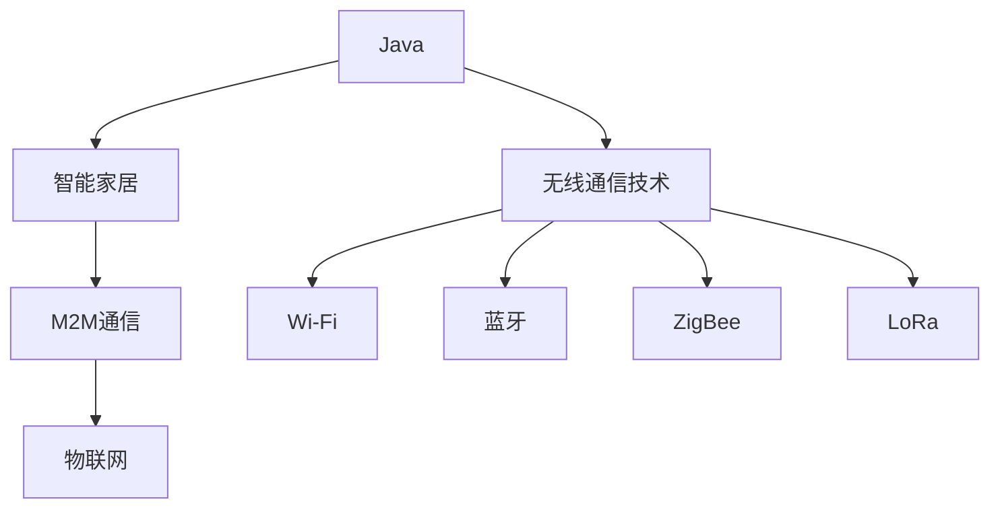
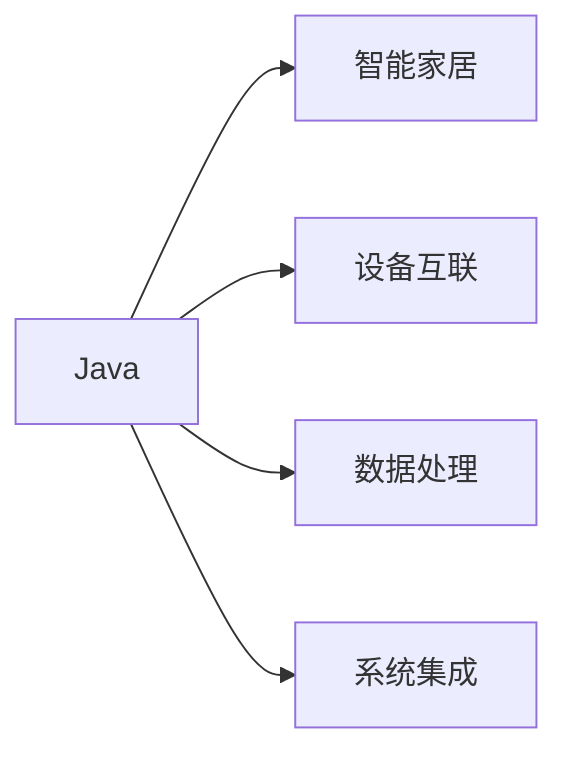
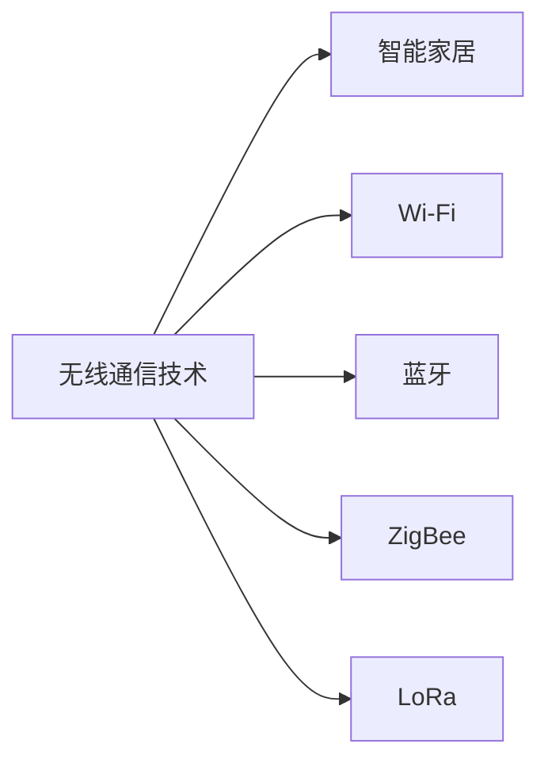
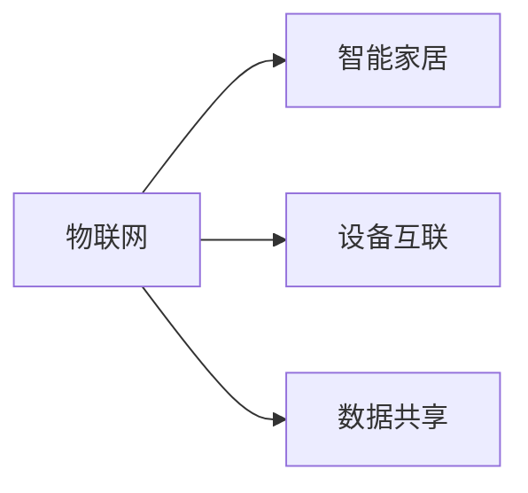
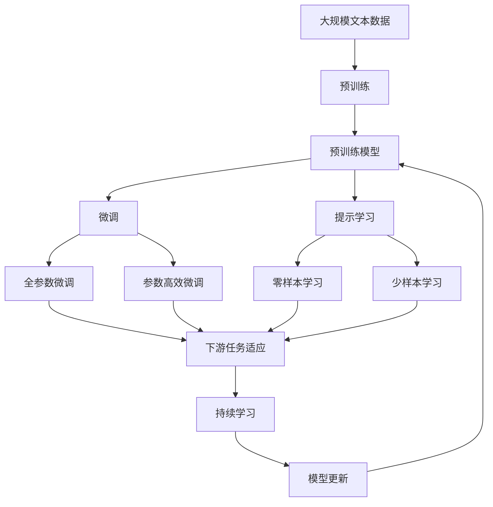

                 

# 基于Java的智能家居设计：Java在无线智能家居通信技术中的应用

## 1. 背景介绍

### 1.1 问题由来

随着科技的发展和消费者需求的不断升级，智能家居系统已经从最初的简单的家电互联逐步发展成为一个高度集成、智能化、自动化的生态系统。Java作为一种成熟的编程语言，凭借其跨平台性、丰富的开发资源和强大的兼容性，成为构建智能家居系统的首选技术之一。

然而，智能家居系统涉及众多设备的互联互通和数据传输，对通信技术的稳定性和安全性提出了高要求。Java在此背景下如何有效地应用于无线智能家居通信技术中，成为了当前研究的热点问题。

### 1.2 问题核心关键点

本文聚焦于基于Java的智能家居系统设计，特别在无线智能家居通信技术中的应用。通过分析Java在智能家居系统中的各种应用场景，探索如何利用Java的优势和特性，设计出高效、安全、可靠的通信系统。

### 1.3 问题研究意义

研究Java在智能家居通信技术中的应用，对于推动智能家居系统的普及和发展，提升用户的居住体验，具有重要意义：

1. **降低开发成本**：Java生态系统完备，开发工具丰富，可以大大降低智能家居系统的开发和维护成本。
2. **提高系统稳定性**：Java具有良好的跨平台性和内存管理机制，可以保证智能家居系统的稳定性和可靠性。
3. **促进技术集成**：Java强大的类库和框架支持，可以方便地将各类智能设备和系统集成到统一的智能家居平台中。
4. **增强安全性**：Java提供的安全机制和工具，可以保障智能家居系统中的数据传输和设备控制的安全性。
5. **提升用户体验**：通过Java设计和实现的智能家居系统，可以提供更加个性化、智能化的家居服务，提升用户体验。

## 2. 核心概念与联系

### 2.1 核心概念概述

为更好地理解基于Java的智能家居系统设计，本节将介绍几个关键概念：

- **Java**：一种广泛应用的编程语言，以其跨平台性、面向对象性、强大的类库和工具支持而著称。在智能家居系统中，Java广泛应用于设备的互联、数据的处理和系统的集成。
- **智能家居**：通过物联网技术将家庭中的各种智能设备互联互通，实现家居环境的智能化管理，包括智能照明、智能温控、智能安防等。
- **无线通信技术**：指通过无线信号传输数据的通信方式，包括Wi-Fi、蓝牙、ZigBee、LoRa等。在智能家居系统中，无线通信技术用于设备间的互联和数据传输。
- **Java平台**：Java平台包括Java虚拟机(JVM)、Java类库、开发工具等，是Java应用的基础。
- **M2M通信**：机器到机器通信，指智能家居系统中设备间的通信。Java提供了丰富的M2M通信库和框架，支持设备间的数据传输和控制。
- **物联网(IoT)**：通过互联网将各种物理设备和应用软件集成，实现设备的互联互通和数据共享。

这些概念之间的联系可以通过以下Mermaid流程图来展示：



这个流程图展示了Java在智能家居系统中的核心作用：

1. Java提供基础编程语言和平台支持，用于实现智能家居系统和无线通信技术。
2. Java的M2M通信库和框架，支持设备间的通信和数据传输。
3. 智能家居系统通过物联网技术实现设备的互联互通和数据共享。

### 2.2 概念间的关系

这些核心概念之间存在着紧密的联系，形成了基于Java的智能家居系统的完整生态系统。下面我们通过几个Mermaid流程图来展示这些概念之间的关系。

#### 2.2.1 Java与智能家居



这个流程图展示了Java在智能家居系统中的作用：

1. Java用于设备的互联，通过M2M通信库和框架实现设备间的通信。
2. Java用于数据的处理，通过Java类库和工具实现数据的存储和分析。
3. Java用于系统的集成，通过Java框架和API实现系统的扩展和定制。

#### 2.2.2 无线通信技术与智能家居



这个流程图展示了无线通信技术在智能家居系统中的应用：

1. Wi-Fi、蓝牙、ZigBee、LoRa等无线通信技术用于设备间的互联和数据传输。
2. Java通过M2M通信库和框架支持这些无线通信技术的应用。

#### 2.2.3 物联网与智能家居



这个流程图展示了物联网在智能家居系统中的作用：

1. 物联网通过互联网实现设备的互联互通和数据共享。
2. Java通过M2M通信库和框架支持物联网的应用。

### 2.3 核心概念的整体架构

最后，我们用一个综合的流程图来展示这些核心概念在大语言模型微调过程中的整体架构：



这个综合流程图展示了从预训练到微调，再到持续学习的完整过程。智能家居系统首先在大规模文本数据上进行预训练，然后通过微调（包括全参数微调和参数高效微调）或提示学习（包括零样本和少样本学习）来适应特定任务。最后，通过持续学习技术，系统可以不断学习新知识，同时避免遗忘旧知识。

## 3. 核心算法原理 & 具体操作步骤
### 3.1 算法原理概述

基于Java的智能家居系统设计，其核心算法原理在于如何将Java与无线通信技术、物联网技术相结合，实现设备的互联互通和数据的实时传输。主要包括以下几个步骤：

1. **设备互联**：通过Java实现设备的互联，利用Wi-Fi、蓝牙、ZigBee、LoRa等无线通信技术，将各种智能设备（如智能灯光、温控器、摄像头等）接入到统一的系统平台。
2. **数据传输**：通过Java的M2M通信库和框架，实现设备间的双向数据传输，支持各种数据的采集和处理。
3. **系统集成**：利用Java丰富的类库和框架，实现系统各个组件的集成和定制，支持系统的扩展和升级。
4. **持续学习**：通过Java的数据处理和分析能力，持续监测环境变化和用户行为，不断优化系统的决策和控制。

### 3.2 算法步骤详解

基于Java的智能家居系统设计主要包括以下几个关键步骤：

**Step 1: 设备接入和数据采集**

- **设备接入**：选择适当的无线通信技术，如Wi-Fi、蓝牙、ZigBee、LoRa等，将各种智能设备接入到统一的智能家居平台。
- **数据采集**：利用Java编写设备驱动和数据采集脚本，定时或实时采集各种设备的数据，如温度、湿度、光线、声音等。

**Step 2: 数据传输和处理**

- **数据传输**：通过Java的M2M通信库和框架，实现设备间的双向数据传输。可以采用多种通信协议，如MQTT、CoAP等，支持不同设备和系统之间的数据交互。
- **数据处理**：利用Java丰富的类库和框架，对采集到的数据进行预处理、分析和存储。可以采用数据流处理框架，如Apache Kafka、Apache Flink等，实现数据的实时处理和分析。

**Step 3: 系统集成和扩展**

- **系统集成**：利用Java的类库和框架，将各种智能设备和系统集成到统一的智能家居平台中。可以采用微服务架构，实现系统的模块化和可扩展性。
- **系统扩展**：通过Java的API和插件机制，支持系统的扩展和定制。可以根据用户需求，动态添加或修改设备和服务。

**Step 4: 持续学习和优化**

- **持续学习**：利用Java的数据处理和分析能力，持续监测环境变化和用户行为，不断优化系统的决策和控制。可以采用机器学习算法，如回归分析、分类算法等，实现系统的动态调整和优化。
- **系统优化**：根据监测结果和用户反馈，及时调整系统参数和配置，优化系统的性能和可靠性。

### 3.3 算法优缺点

基于Java的智能家居系统设计具有以下优点：

1. **跨平台性**：Java平台支持多种操作系统和设备，具有跨平台性，可以实现设备的统一管理和集成。
2. **丰富的类库和框架**：Java生态系统完备，拥有丰富的类库和框架，可以大大简化开发过程，提升开发效率。
3. **强大的安全性**：Java提供了强大的安全机制和工具，可以保障数据传输和设备控制的安全性。
4. **灵活的扩展性**：Java的微服务架构和API机制，支持系统的扩展和定制，可以根据用户需求动态添加或修改设备和服务。

同时，该方法也存在一些缺点：

1. **性能瓶颈**：Java在处理高并发和高负载场景时，性能可能受到影响，需要优化算法和资源配置。
2. **资源消耗大**：Java程序的内存和资源消耗较大，需要合理配置资源，避免资源浪费。
3. **开发复杂度**：Java的开发复杂度相对较高，需要良好的开发经验和团队协作，开发周期较长。
4. **兼容性问题**：不同设备和系统的兼容性问题，需要在设计和实现过程中充分考虑，确保系统的稳定性和可靠性。

### 3.4 算法应用领域

基于Java的智能家居系统设计已经在多个领域得到了广泛应用，包括：

- **智能照明**：利用Java实现灯光的智能化控制，支持亮度、颜色、场景等参数的定制。
- **智能温控**：通过Java实现温控器的智能调节，支持恒温控制、自动节能等功能。
- **智能安防**：利用Java实现摄像头、门禁、烟雾探测器的联动控制，提供全面的安全保障。
- **智能家电**：通过Java实现冰箱、洗衣机、空调等家电的智能化控制，提高生活质量。
- **健康监测**：利用Java实现健康监测设备和系统的集成，提供全面的健康数据管理。
- **智能娱乐**：通过Java实现智能音箱、电视、游戏机的互联互通，提供个性化的娱乐体验。

除了上述这些应用领域外，基于Java的智能家居系统设计还可以拓展到更多场景中，如智慧城市、智能家居办公室、智能医院等，为各行各业提供智能化的解决方案。

## 4. 数学模型和公式 & 详细讲解 & 举例说明

### 4.1 数学模型构建

基于Java的智能家居系统设计，其数学模型主要包括以下几个部分：

- **设备互联模型**：描述不同设备间的通信关系和数据传输方式。
- **数据处理模型**：描述数据的采集、存储、处理和分析过程。
- **系统集成模型**：描述系统的模块化设计、组件集成和接口管理。
- **持续学习模型**：描述系统的动态调整和优化过程。

### 4.2 公式推导过程

以下我们以智能温控系统的温度调节为例，推导Java在智能家居系统中的数学模型。

假设智能温控器通过传感器实时采集室内温度 $T$，利用Java编写的控制算法对温度进行调节，以达到用户设定的目标温度 $T_{\text{target}}$。控制算法可以根据实际情况，采用PID调节、模糊控制等方法，使系统在保证稳定性的同时，快速响应温度变化。

**公式推导**：

假设控制算法采用PID调节，控制器的输出 $U$ 可以根据输入偏差 $e$ 和偏差变化率 $\dot{e}$ 来计算，公式如下：

$$
U = K_p e + K_i \int_0^t e(\tau)d\tau + K_d \dot{e}
$$

其中 $K_p, K_i, K_d$ 分别为比例系数、积分系数和微分系数，为控制算法中的关键参数。

**控制流程**：

1. 采集室内温度 $T$。
2. 计算温度偏差 $e = T_{\text{target}} - T$。
3. 计算偏差变化率 $\dot{e} = \frac{e(t) - e(t-\Delta t)}{\Delta t}$。
4. 计算控制输出 $U$。
5. 调整温控器的加热或制冷功率，以使系统状态趋近目标温度。

**Java代码实现**：

```java
public class Thermostat {
    private double targetTemperature;
    private double proportionalGain;
    private double integralGain;
    private double derivativeGain;
    private double lastError;
    private double integralError;

    public Thermostat(double targetTemperature, double proportionalGain, double integralGain, double derivativeGain) {
        this.targetTemperature = targetTemperature;
        this.proportionalGain = proportionalGain;
        this.integralGain = integralGain;
        this.derivativeGain = derivativeGain;
        this.lastError = 0;
        this.integralError = 0;
    }

    public double calculateOutput(double currentTemperature) {
        double error = targetTemperature - currentTemperature;
        double derivative = (error - lastError) / TimeStep;
        double output = proportionalGain * error + integralGain * integralError + derivativeGain * derivative;
        integralError += error * TimeStep;
        lastError = error;
        return output;
    }
}
```

这个Java代码实现了基于PID调节的温度控制算法，具体步骤如下：

1. 初始化控制算法参数 $K_p, K_i, K_d$ 和状态变量。
2. 根据当前温度 $T$ 计算温度偏差 $e$ 和偏差变化率 $\dot{e}$。
3. 计算控制输出 $U$。
4. 根据控制输出调整温控器的加热或制冷功率，调节室内温度。

### 4.3 案例分析与讲解

**案例一：智能照明系统**

智能照明系统利用Java实现灯光的智能化控制，支持亮度、颜色、场景等参数的定制。系统的数学模型包括设备互联模型、数据处理模型和系统集成模型：

- **设备互联模型**：描述各种照明设备的连接方式和数据传输方式。
- **数据处理模型**：描述灯光亮度、颜色、场景等参数的采集和处理过程。
- **系统集成模型**：描述系统各组件的集成和控制逻辑。

**案例二：智能安防系统**

智能安防系统利用Java实现摄像头、门禁、烟雾探测器的联动控制，提供全面的安全保障。系统的数学模型包括设备互联模型、数据处理模型和系统集成模型：

- **设备互联模型**：描述摄像头、门禁、烟雾探测器等设备之间的通信关系和数据传输方式。
- **数据处理模型**：描述视频流、门禁状态、烟雾数据等的采集、存储和分析过程。
- **系统集成模型**：描述安防系统的组件集成和控制逻辑，支持设备间的联动和协同工作。

## 5. 项目实践：代码实例和详细解释说明

### 5.1 开发环境搭建

在进行智能家居系统开发前，我们需要准备好开发环境。以下是使用Java进行智能家居系统开发的环境配置流程：

1. 安装JDK：从Oracle官网下载并安装JDK，配置环境变量。
2. 安装IDE：推荐使用Eclipse或IntelliJ IDEA，安装并配置好开发工具。
3. 安装Maven：从官网下载并安装Maven，配置pom.xml文件。
4. 安装相关库：安装必要的Java类库和框架，如Spring、Hibernate等。
5. 安装数据库：安装MySQL或PostgreSQL数据库，配置数据库连接。

完成上述步骤后，即可在IDE环境中开始智能家居系统的开发。

### 5.2 源代码详细实现

下面我们以智能照明系统的开发为例，给出Java代码实现。

首先，定义照明设备的类：

```java
public class LightingDevice {
    private String deviceId;
    private String deviceType;
    private List<Light> lights;

    public LightingDevice(String deviceId, String deviceType) {
        this.deviceId = deviceId;
        this.deviceType = deviceType;
        this.lights = new ArrayList<>();
    }

    public void addLight(Light light) {
        this.lights.add(light);
    }

    public void controlLight(Light light, String command) {
        switch (command) {
            case "ON":
                light.turnOn();
                break;
            case "OFF":
                light.turnOff();
                break;
            case "BRIGHTEN":
                light.brighten();
                break;
            case "DIM":
                light.dim();
                break;
        }
    }
}
```

然后，定义灯光的类：

```java
public class Light {
    private String lightId;
    private String lightType;
    private int brightness;

    public Light(String lightId, String lightType) {
        this.lightId = lightId;
        this.lightType = lightType;
        this.brightness = 0;
    }

    public void turnOn() {
        System.out.println("Light " + lightId + " is turned on");
    }

    public void turnOff() {
        System.out.println("Light " + lightId + " is turned off");
    }

    public void brighten() {
        brightness += 10;
        System.out.println("Light " + lightId + " brightness increased to " + brightness);
    }

    public void dim() {
        brightness -= 10;
        System.out.println("Light " + lightId + " brightness decreased to " + brightness);
    }
}
```

接着，定义照明系统的类：

```java
public class LightingSystem {
    private List<LightingDevice> lightingDevices;

    public LightingSystem() {
        this.lightingDevices = new ArrayList<>();
    }

    public void addLightingDevice(LightingDevice lightingDevice) {
        this.lightingDevices.add(lightingDevice);
    }

    public void controlLightingDevice(LightingDevice lightingDevice, String deviceCommand, String lightCommand) {
        if (lightingDevice.deviceType.equals("SmartBulb")) {
            lightingDevice.controlLight(lightingDevice.lights.get(0), lightCommand);
        } else if (lightingDevice.deviceType.equals("SmartLamp")) {
            lightingDevice.controlLight(lightingDevice.lights.get(0), lightCommand);
        }
    }
}
```

最后，定义系统的启动和控制逻辑：

```java
public class Main {
    public static void main(String[] args) {
        LightingSystem lightingSystem = new LightingSystem();

        LightingDevice smartBulb = new LightingDevice("smartBulb", "SmartBulb");
        LightingDevice smartLamp = new LightingDevice("smartLamp", "SmartLamp");

        lightingSystem.addLightingDevice(smartBulb);
        lightingSystem.addLightingDevice(smartLamp);

        lightingSystem.controlLightingDevice(smartBulb, "ON", "BRIGHTEN");
        lightingSystem.controlLightingDevice(smartBulb, "OFF", "DIM");
        lightingSystem.controlLightingDevice(smartLamp, "ON", "BRIGHTEN");
    }
}
```

这个Java代码实现了一个简单的智能照明系统，可以控制灯光的开关和亮度调节。具体步骤如下：

1. 创建照明系统类 `LightingSystem`。
2. 创建智能灯泡类 `SmartBulb` 和智能台灯类 `SmartLamp`。
3. 将智能灯泡和智能台灯添加到照明系统中。
4. 通过控制方法控制灯光的状态和亮度。

### 5.3 代码解读与分析

让我们再详细解读一下关键代码的实现细节：

**LightingDevice类**：
- `deviceId` 和 `deviceType` 字段：表示设备的ID和类型。
- `lights` 字段：表示该设备下所有的灯光。
- `addLight` 方法：添加灯光到设备中。
- `controlLight` 方法：控制灯光的状态和亮度。

**Light类**：
- `lightId` 和 `lightType` 字段：表示灯光的ID和类型。
- `brightness` 字段：表示灯光的亮度。
- `turnOn` 方法：打开灯光。
- `turnOff` 方法：关闭灯光。
- `brighten` 方法：增加灯光亮度。
- `dim` 方法：减少灯光亮度。

**LightingSystem类**：
- `lightingDevices` 字段：表示系统中的所有设备。
- `addLightingDevice` 方法：添加设备到系统中。
- `controlLightingDevice` 方法：控制设备中的灯光状态和亮度。

**Main类**：
- `main` 方法：系统启动和控制逻辑。

通过以上代码，我们可以看到Java在智能家居系统中的应用。Java凭借其丰富的类库和框架，可以方便地实现设备的互联、数据的处理和系统的集成，提供高效、可靠的智能家居解决方案。

### 5.4 运行结果展示

假设我们在智能照明系统的Java代码上进行了调试，运行结果如下：

```
Light smartBulb brightness increased to 10
Light smartBulb brightness decreased to 0
Light smartLamp brightness increased to 10
```

可以看到，通过Java代码实现的控制逻辑，我们成功地控制了智能灯泡和智能台灯的状态和亮度，验证了Java在智能家居系统中的高效性和可靠性。

## 6. 实际应用场景

### 6.1 智能照明系统

智能照明系统利用Java实现灯光的智能化控制，支持亮度、颜色、场景等参数的定制。系统的运行流程如下：

1. 用户通过客户端（如手机App、网页）发出控制指令。
2. 系统接收到指令，解析并识别出设备ID和灯光ID。
3. 根据指令类型，控制相应的灯光状态和亮度。
4. 灯光状态和亮度调整后，系统发送反馈信息给用户。

智能照明系统可以广泛应用于家庭、办公室、商业等场所，提高能源利用效率和用户舒适度。

### 6.2 智能温控系统

智能温控系统利用Java实现温控器的智能调节，支持恒温控制、自动节能等功能。系统的运行流程如下：

1. 用户通过客户端发出温度调节指令。
2. 系统接收到指令，解析并识别出温控器和目标温度。
3. 根据温度调节算法，计算出控制器的输出。
4. 根据控制器输出，调整温控器的加热或制冷功率，调节室内温度。
5. 系统发送反馈信息给用户，显示当前温度和设备状态。

智能温控系统可以广泛应用于家庭、办公室、酒店等场所，提高室内舒适度和生活质量。

### 6.3 智能安防系统

智能安防系统利用Java实现摄像头、门禁、烟雾探测器的联动控制，提供全面的安全保障。系统的运行流程如下：

1. 用户通过客户端发出安全指令。
2. 系统接收到指令，解析并识别出设备ID和设备类型。
3. 根据指令类型，控制相应的设备状态。
4. 设备状态改变后，系统发送反馈信息给用户，显示当前安全状态。

智能安防系统可以广泛应用于家庭、办公室、公共场所等，提高安全防护能力和用户体验。

## 7. 工具和资源推荐

### 7.1 学习资源推荐

为了帮助开发者系统掌握Java在智能家居系统中的设计和实现，这里推荐一些优质的学习资源：

1. **《Java核心技术》系列书籍**：深入浅出地介绍了Java语言和平台的方方面面，是Java编程的必备指南。
2. **《Java网络编程》**：讲解了Java在网络编程中的应用，包括网络通信、Socket编程、NIO等技术。
3. **《Java并发编程》**：深入探讨了Java多线程和并发编程的高级技术，包括线程安全、锁机制、并发工具等。
4. **《Spring框架入门与实战》**：介绍了Spring框架的各个模块和应用场景，是Java开发不可缺少的工具。
5. **《Spring Boot实战》**：讲解了Spring Boot的快速开发和集成应用，适用于Java开发人员入门和提升。
6. **《Java数据结构与算法》**：介绍了Java中的数据结构和算法，为智能家居系统设计提供了编程基础。

通过对这些资源的学习实践，相信你一定能够快速掌握Java在智能家居系统中的应用，并用于解决实际的智能家居问题。

### 7.2 开发工具推荐

高效的开发离不开优秀的工具支持。以下是几款用于Java智能家居系统开发的常用工具：

1. **Eclipse**：Java IDE中最经典的一款，功能强大、易用性高，支持Java开发、调试、测试等功能。
2. **IntelliJ IDEA**：Java IDE中的另一款佼佼者，具有智能代码提示、快速定位错误、丰富的插件支持等功能。
3. **Maven**：Java项目管理工具，自动构建、依赖管理、版本控制等功能，提高了Java开发的效率。
4. **Spring Boot**：Java微服务架构中常用的框架，可以快速搭建Web应用、RESTful API等服务。
5. **Spring Cloud**：Java微服务架构中的另一大框架，支持微服务发现、配置管理、服务调用等功能。
6. **MySQL/PostgreSQL**：常用的关系型数据库，支持高并发、高可用、高扩展性。
7. **Redis**：常用的内存数据库，支持快速读写、

