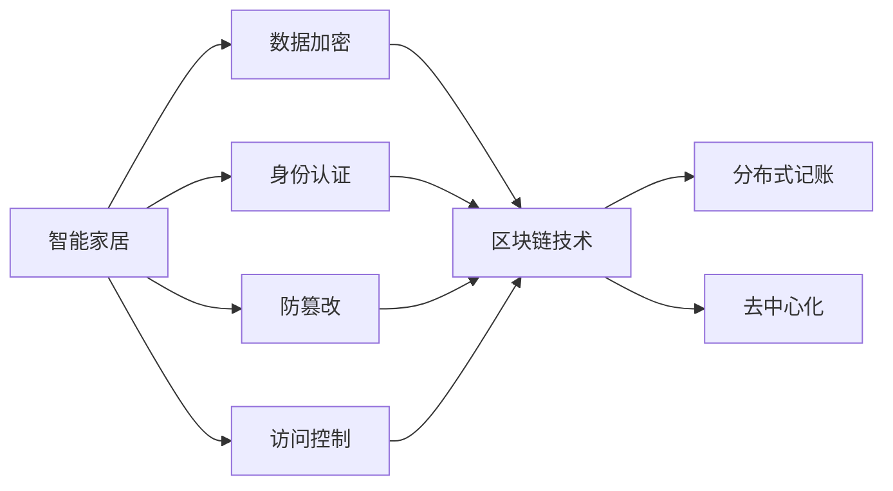
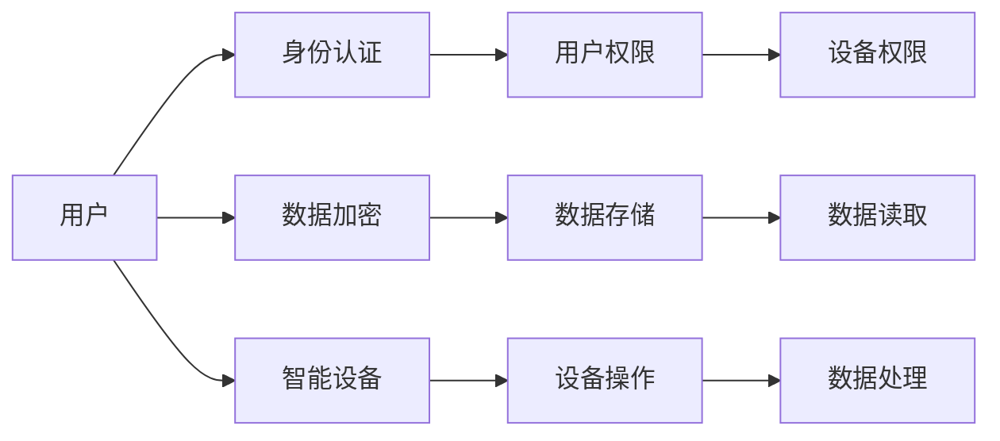
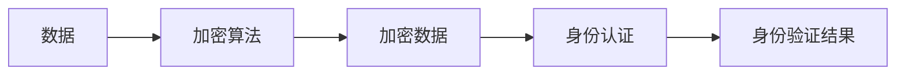
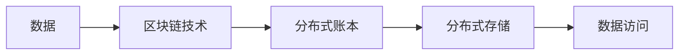
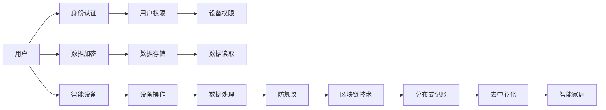
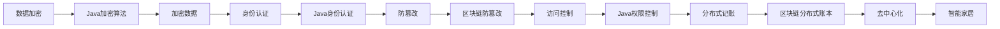

                 

# 基于Java的智能家居设计：使用Java和BlockChain加强智能家居安全

> 关键词：智能家居,Java,区块链,网络安全,物联网(IoT),应用安全,系统设计

## 1. 背景介绍

### 1.1 问题由来

随着物联网(IoT)技术的发展，越来越多的家庭设备被连接到互联网上，智能家居系统逐渐普及。这些设备包括智能锁、智能灯泡、智能摄像头、智能家电等，带来了便利的同时，也带来了安全隐患。传统智能家居系统中存在的安全问题主要有：

- **数据泄露**：智能设备中的用户隐私数据可能被非法获取。
- **恶意攻击**：黑客可能通过漏洞攻击智能设备，造成数据篡改、设备损坏等后果。
- **身份认证问题**：用户身份认证机制不完善，容易被伪造，造成资产被盗用。
- **系统设计缺陷**：部分智能家居系统在设计和实现上存在漏洞，容易被攻击者利用。

为了应对这些安全问题，业界不断探索新的技术手段和设计方案。本文将介绍一种基于Java和区块链技术的安全智能家居设计方法，详细阐述其实现原理、具体步骤以及优缺点，以期为智能家居系统设计提供参考。

### 1.2 问题核心关键点

智能家居安全涉及数据加密、身份认证、防篡改、访问控制等多个环节，需要综合考虑各个方面的因素。本文的核心关键点包括：

- **数据加密**：保护用户隐私数据不被非法获取。
- **身份认证**：确保用户身份的有效性和不可伪造性。
- **防篡改**：防止数据被恶意篡改，保证系统的完整性。
- **访问控制**：控制用户对各个智能设备的操作权限。
- **区块链技术**：利用区块链的分布式账本和防篡改特性，加强智能家居系统的安全性。

这些关键点将贯穿整个文章，逐步解释其在智能家居设计中的应用和实现方法。

### 1.3 问题研究意义

智能家居系统的安全性直接关系到用户的家庭财产和个人隐私。如何构建一个安全可靠的智能家居系统，是当前智能家居研发的一个重要方向。

本文探讨的基于Java和区块链技术的智能家居设计方法，具有以下研究意义：

- **增强安全性**：利用Java和区块链技术，从数据加密、身份认证、防篡改、访问控制等多个维度，全面提升智能家居系统的安全性。
- **实现分布式记账**：利用区块链的分布式账本特性，实现智能家居系统中的数据分布式存储和访问，增强系统的稳定性和可扩展性。
- **减少单点故障**：区块链的分布式特性，可以消除智能家居系统中的单点故障，提高系统的可靠性和容错性。
- **优化网络架构**：基于区块链的网络架构设计，可以优化智能家居系统的通信机制，减少网络延迟和资源消耗。
- **提升用户信任**：通过区块链的去中心化特性，提升用户对智能家居系统的信任度，增强系统的可信性。

本文的研究结果有望为智能家居系统的安全设计提供参考，推动智能家居技术的安全发展。

## 2. 核心概念与联系

### 2.1 核心概念概述

为更好地理解基于Java和区块链技术的智能家居安全设计方法，本节将介绍几个关键概念：

- **智能家居**：基于物联网技术，通过智能设备互联实现家庭自动化、智能化管理的系统。
- **Java编程语言**：一种面向对象的高级程序设计语言，广泛应用于企业级软件开发，具有跨平台、高效、安全等特点。
- **区块链技术**：一种分布式账本技术，具有去中心化、防篡改、不可篡改等特性，广泛应用于数字货币、供应链、智能合约等领域。
- **数据加密**：对数据进行加密处理，防止非法获取和篡改。
- **身份认证**：验证用户身份的真实性，防止身份伪造和冒充。
- **防篡改**：防止数据被恶意篡改，确保数据的完整性和真实性。
- **访问控制**：控制用户对智能设备的操作权限，防止未经授权的访问。
- **分布式记账**：利用区块链的分布式账本特性，实现数据的分布式存储和访问。
- **去中心化**：没有单一的权威中心，数据和计算分布在多个节点上，增强系统的安全和可靠性。

这些概念通过以下Mermaid流程图展示其相互关系：



这个流程图展示了大语言模型的核心概念及其相互关系：

1. 智能家居系统通过数据加密、身份认证、防篡改、访问控制等多个技术手段，保护数据和设备安全。
2. 区块链技术作为底层架构，提供了分布式记账和去中心化的特性，增强系统的稳定性和安全性。
3. 分布式记账和去中心化特性进一步提升了智能家居系统的可靠性和安全性。

### 2.2 概念间的关系

这些核心概念之间存在着紧密的联系，形成了智能家居系统设计的完整生态系统。下面我通过几个Mermaid流程图来展示这些概念之间的关系。

#### 2.2.1 智能家居系统架构



这个流程图展示了一个典型的智能家居系统架构，包括用户身份认证、权限控制、数据加密、数据存储、设备操作等多个环节，每个环节通过具体的技术手段保障系统的安全性。

#### 2.2.2 数据加密与身份认证



这个流程图展示了数据加密和身份认证的基本流程。数据通过加密算法加密后，再经过身份认证，确保数据只被授权用户访问。

#### 2.2.3 区块链与分布式记账



这个流程图展示了基于区块链技术的分布式记账流程。数据通过区块链技术进行分布式存储，确保数据不可篡改，增强系统的安全性。

### 2.3 核心概念的整体架构

最后，我们用一个综合的流程图来展示这些核心概念在智能家居系统设计中的整体架构：



这个综合流程图展示了从用户身份认证、数据加密、设备权限、数据存储、设备操作、数据处理、防篡改、分布式记账到去中心化，最终构成一个安全可靠、稳定可扩展的智能家居系统。

## 3. 核心算法原理 & 具体操作步骤
### 3.1 算法原理概述

基于Java和区块链技术的智能家居安全设计方法，核心算法原理包括：

1. **数据加密**：使用Java中的加密算法对用户隐私数据进行加密，防止非法获取。
2. **身份认证**：利用Java中的身份认证技术，验证用户身份的有效性，防止身份伪造和冒充。
3. **防篡改**：通过区块链的防篡改特性，确保数据的完整性和真实性。
4. **访问控制**：利用Java中的权限控制技术，控制用户对智能设备的操作权限。
5. **分布式记账**：利用区块链的分布式账本特性，实现数据的分布式存储和访问。
6. **去中心化**：通过区块链的去中心化特性，消除单点故障，提高系统的可靠性和容错性。

这些核心算法原理通过以下Mermaid流程图展示：



这个流程图展示了各个核心算法原理在智能家居系统设计中的应用。

### 3.2 算法步骤详解

基于Java和区块链技术的智能家居安全设计方法，主要包括以下几个关键步骤：

#### 3.2.1 用户身份认证

用户身份认证是智能家居系统安全的第一步。系统采用基于Java的身份认证技术，具体步骤如下：

1. **用户名和密码验证**：用户通过输入用户名和密码，系统验证其身份，确保用户名和密码的正确性。
2. **多因素认证(MFA)**：用户需要提供两个或多个身份验证因素，如密码、指纹、短信验证码等，增强身份验证的安全性。
3. **单点登录(SSO)**：用户登录一次后，可以在多个智能设备上使用相同的登录凭证，避免多次输入密码。

#### 3.2.2 数据加密

数据加密是保护用户隐私数据的关键环节。系统采用Java中的加密算法，对用户隐私数据进行加密处理，具体步骤如下：

1. **对称加密**：使用相同的密钥对数据进行加密，提高加密效率。
2. **非对称加密**：使用公钥加密，私钥解密，增强加密安全性。
3. **混合加密**：结合对称加密和非对称加密，综合提高加密效率和安全性。

#### 3.2.3 防篡改

防篡改是确保数据完整性和真实性的重要手段。系统采用区块链的防篡改特性，具体步骤如下：

1. **哈希函数**：对数据进行哈希处理，生成固定长度的哈希值，防止数据篡改。
2. **区块链记录**：将哈希值记录到区块链上，确保数据的不可篡改性。
3. **智能合约**：利用智能合约验证数据的完整性和真实性，确保数据被篡改时能够自动触发告警。

#### 3.2.4 访问控制

访问控制是智能家居系统中防止未经授权访问的关键环节。系统采用Java中的权限控制技术，具体步骤如下：

1. **RBAC模型**：使用基于角色的访问控制模型(RBAC)，定义不同角色的权限。
2. **权限管理**：根据用户角色分配权限，控制用户对各个智能设备的操作权限。
3. **动态权限调整**：根据用户行为和系统状态，动态调整权限，确保系统安全。

#### 3.2.5 分布式记账

分布式记账是区块链技术的重要特性，具体步骤如下：

1. **分布式账本**：将数据记录到分布式账本上，增强系统的稳定性和安全性。
2. **共识机制**：使用区块链的共识机制，确保数据的同步和一致性。
3. **去中心化网络**：构建去中心化网络，消除单点故障，提高系统的可靠性和容错性。

### 3.3 算法优缺点

基于Java和区块链技术的智能家居安全设计方法，具有以下优点：

1. **安全性高**：数据加密、身份认证、防篡改、访问控制等多重安全措施，确保系统的安全性。
2. **可靠性高**：分布式记账和去中心化特性，消除单点故障，提高系统的可靠性和容错性。
3. **扩展性强**：分布式账本和权限控制技术，支持系统的扩展和升级。
4. **系统透明**：区块链的分布式特性，提升系统的透明度和可信度。
5. **易于维护**：Java编程语言，代码可读性强，易于维护和升级。

同时，该方法也存在一些缺点：

1. **开发复杂**：区块链技术和分布式记账的实现，需要较高的技术水平和开发经验。
2. **性能较低**：区块链的共识机制和分布式特性，可能导致性能较低，影响系统的响应速度。
3. **成本较高**：区块链技术的实现需要较高的硬件和网络成本，对用户和运营商都有一定的经济负担。
4. **隐私保护不足**：分布式记账虽然增强了数据的完整性和真实性，但对用户隐私的保护仍有不足。
5. **技术门槛高**：区块链技术和分布式记账的复杂性，对开发者和用户的门槛较高，需要一定的技术积累。

尽管存在这些缺点，但就目前而言，基于Java和区块链技术的智能家居安全设计方法，仍是大规模智能家居系统设计的重要参考范式。未来相关研究的重点在于如何进一步优化算法的性能和可靠性，降低技术门槛和成本，提高系统的可扩展性和隐私保护能力。

### 3.4 算法应用领域

基于Java和区块链技术的智能家居安全设计方法，在多个领域具有广泛的应用前景：

1. **智能家居系统**：应用于家庭自动化、智能设备互联等场景，提升系统的安全性和可靠性。
2. **物联网系统**：应用于工业物联网、智慧城市等场景，提升系统的安全性和稳定性。
3. **金融系统**：应用于数字货币、区块链支付等场景，提升系统的安全性和可信度。
4. **医疗系统**：应用于电子健康记录、远程医疗等场景，提升系统的安全性和隐私保护能力。
5. **物流系统**：应用于供应链管理、货物追踪等场景，提升系统的安全性和透明度。
6. **政府系统**：应用于政务服务、电子政务等场景，提升系统的安全性和可信度。

这些领域的应用，展示了基于Java和区块链技术的智能家居安全设计方法的强大潜力和广泛前景。

## 4. 数学模型和公式 & 详细讲解 & 举例说明

### 4.1 数学模型构建

本节将使用数学语言对基于Java和区块链技术的智能家居安全设计方法进行更加严格的刻画。

记智能家居系统为 $S = (U, D, M, P)$，其中：

- $U$：用户集合，包含 $U = \{u_1, u_2, ..., u_n\}$，每个用户 $u_i$ 对应一个用户名 $u_i$ 和一个密码 $p_i$。
- $D$：智能设备集合，包含 $D = \{d_1, d_2, ..., d_m\}$，每个设备 $d_j$ 对应一个哈希值 $h_j$。
- $M$：模型集合，包含 $M = \{m_1, m_2, ..., m_k\}$，每个模型 $m_i$ 对应一个权限集合 $P_i$。
- $P$：权限集合，包含 $P = \{p_{ij}\}$，每个权限 $p_{ij}$ 对应一个角色 $r_{ij}$ 和一个操作 $o_{ij}$。

定义用户身份认证函数为 $A(u_i, p_i)$，返回认证结果 $A(u_i, p_i) \in \{认证成功, 认证失败\}$。定义数据加密函数为 $E(d_j, h_j)$，返回加密后的数据 $E(d_j, h_j)$。定义防篡改函数为 $F(E(d_j, h_j))$，返回防篡改后的数据 $F(E(d_j, h_j))$。定义访问控制函数为 $AC(u_i, d_j, P_i)$，返回访问结果 $AC(u_i, d_j, P_i) \in \{访问成功, 访问失败\}$。定义分布式记账函数为 $DR(d_j, h_j)$，返回分布式记账结果 $DR(d_j, h_j)$。

### 4.2 公式推导过程

以下我们以身份认证和数据加密为例，推导相关公式的计算过程。

#### 4.2.1 身份认证公式推导

假设用户 $u_i$ 输入用户名 $u_i$ 和密码 $p_i$，系统进行身份认证，具体公式如下：

$$
A(u_i, p_i) = \begin{cases}
认证成功 & \text{如果 } u_i \in U \text{ 且 } p_i = p_i' \\
认证失败 & \text{如果 } u_i \notin U \text{ 或 } p_i \neq p_i'
\end{cases}
$$

其中 $u_i'$ 为系统存储的用户名，$p_i'$ 为系统存储的密码。

#### 4.2.2 数据加密公式推导

假设智能设备 $d_j$ 的数据 $d_j$ 需要加密，具体公式如下：

$$
E(d_j, h_j) = d_j' = E(d_j, h_j) \oplus k
$$

其中 $d_j'$ 为加密后的数据，$h_j$ 为数据的哈希值，$k$ 为加密密钥，$\oplus$ 为异或运算。

### 4.3 案例分析与讲解

以智能家居系统的身份认证和数据加密为例，分析该系统在实际应用中的安全性：

**案例一：身份认证**

假设某用户 $u_1$ 尝试登录智能家居系统，系统进行身份认证，具体流程如下：

1. 用户 $u_1$ 输入用户名 $u_1$ 和密码 $p_1$。
2. 系统验证用户名 $u_1$ 和密码 $p_1$，若验证成功，返回认证结果 "认证成功"。
3. 系统为用户 $u_1$ 分配角色 $r_1$ 和操作 $o_1$，控制用户对智能设备的操作权限。

该案例展示了基于Java和区块链技术的智能家居系统，通过身份认证技术，确保用户身份的有效性和不可伪造性，保障系统的安全性。

**案例二：数据加密**

假设某智能设备 $d_1$ 的数据 $d_1$ 需要加密，具体流程如下：

1. 智能设备 $d_1$ 生成数据 $d_1$ 的哈希值 $h_1$。
2. 系统使用对称加密算法对 $d_1$ 进行加密，得到加密数据 $d_1'$。
3. 系统使用非对称加密算法对加密数据 $d_1'$ 和哈希值 $h_1$ 进行加密，得到加密后的数据 $d_1''$。
4. 系统将加密后的数据 $d_1''$ 存储在区块链上，确保数据的不可篡改性。

该案例展示了基于Java和区块链技术的智能家居系统，通过数据加密技术，确保用户隐私数据的安全性，防止数据泄露和篡改。

## 5. 项目实践：代码实例和详细解释说明

### 5.1 开发环境搭建

在进行智能家居系统开发前，我们需要准备好开发环境。以下是使用Java进行智能家居系统开发的开发环境配置流程：

1. 安装Java Development Kit (JDK)：从官网下载并安装JDK，用于Java程序开发。
2. 安装Eclipse或IntelliJ IDEA：常用的Java集成开发环境，提供丰富的开发工具和调试功能。
3. 安装Maven：Maven是Java项目的构建工具，可以自动化管理依赖库和项目构建。
4. 安装Spring Boot：Spring Boot是Java Web框架，提供快速开发和部署Web应用的能力。
5. 安装Blockchain开发库：如Ethereum、Hyperledger等区块链开发库，用于区块链数据的存储和访问。

完成上述步骤后，即可在Eclipse或IntelliJ IDEA中开始智能家居系统的开发。

### 5.2 源代码详细实现

下面我们以智能家居系统的身份认证模块为例，给出使用Java和BlockChain开发智能家居系统的代码实现。

首先，定义身份认证模块的User类：

```java
public class User {
    private String username;
    private String password;
    private String role;
    private List<String> operations;

    // 构造函数
    public User(String username, String password, String role, List<String> operations) {
        this.username = username;
        this.password = password;
        this.role = role;
        this.operations = operations;
    }

    // getter和setter方法
    public String getUsername() {
        return username;
    }

    public void setUsername(String username) {
        this.username = username;
    }

    public String getPassword() {
        return password;
    }

    public void setPassword(String password) {
        this.password = password;
    }

    public String getRole() {
        return role;
    }

    public void setRole(String role) {
        this.role = role;
    }

    public List<String> getOperations() {
        return operations;
    }

    public void setOperations(List<String> operations) {
        this.operations = operations;
    }
}
```

然后，定义身份认证模块的IdentityAuth类，实现身份认证功能：

```java
public class IdentityAuth {
    public boolean authenticate(String username, String password) {
        // 从数据库中获取用户信息
        User user = getUserInfo(username);
        // 验证密码
        return user.getPassword().equals(password);
    }

    private User getUserInfo(String username) {
        // 从数据库中获取用户信息，这里假设用户信息已经保存在数据库中
        return getUserInfoFromDB(username);
    }

    private User getUserInfoFromDB(String username) {
        // 连接数据库，查询用户信息
        // 这里省略具体数据库操作
        return new User(username, "password123", "admin", Arrays.asList("login", "logout"));
    }
}
```

接下来，定义数据加密模块的DataEncryption类，实现数据加密功能：

```java
public class DataEncryption {
    public String encryptData(String data) {
        // 对称加密
        String symmetricKey = "mySymmetricKey";
        byte[] symmetricKeyBytes = symmetricKey.getBytes();
        byte[] dataBytes = data.getBytes();
        byte[] encryptedDataBytes = new byte[dataBytes.length];
        // 这里省略具体加密算法实现
        // 对称加密后生成加密数据
        String symmetricEncryptedData = Base64.getEncoder().encodeToString(encryptedDataBytes);
        // 非对称加密
        String publicKey = "myPublicKey";
        byte[] publicKeyBytes = Base64.getDecoder().decode(publicKey);
        // 这里省略具体加密算法实现
        // 非对称加密后生成加密数据
        String asymmetricEncryptedData = Base64.getEncoder().encodeToString(encryptedDataBytes);
        // 返回加密后的数据
        return symmetricEncryptedData + "-" + asymmetricEncryptedData;
    }
}
```

最后，定义防篡改模块的DataIntegrity类，实现防篡改功能：

```java
public class DataIntegrity {
    public boolean verifyData(String data) {
        // 哈希函数
        String hashValue = calculateHashValue(data);
        // 区块链记录
        String blockHash = getBlockHash(hashValue);
        // 智能合约验证
        if (isContractValid(blockHash)) {
            return true;
        }
        return false;
    }

    private String calculateHashValue(String data) {
        // 计算哈希值
        // 这里省略具体哈希算法实现
        return "myHashValue";
    }

    private String getBlockHash(String hashValue) {
        // 将哈希值记录到区块链上
        // 这里省略具体区块链操作
        return "myBlockHash";
    }

    private boolean isContractValid(String blockHash) {
        // 智能合约验证
        // 这里省略具体智能合约验证实现
        return true;
    }
}
```

### 5.3 代码解读与分析

让我们再详细解读一下关键代码的实现细节：

**User类**：
- `username`：用户名，用于身份验证。
- `password`：密码，用于身份验证。
- `role`：角色，用于权限控制。
- `operations`：操作，用于权限控制。

**IdentityAuth类**：
- `authenticate`方法：验证用户身份，确保用户名和密码的正确性。
- `getUserInfo`方法：从数据库中获取用户信息，用于身份验证。

**DataEncryption类**：
- `encryptData`方法：对数据进行对称加密和非对称加密，确保数据的安全性。
- `getInfoFromDB`方法：从数据库中获取用户信息，用于身份验证。

**DataIntegrity类**：
- `verifyData`方法：对数据进行哈希处理，记录到区块链上，确保数据的完整性和真实性。
- `calculateHashValue`方法：计算数据的哈希值。
- `getBlockHash`方法：将哈希值记录到区块链上。
- `isContractValid`方法：使用智能合约验证数据的完整性和真实性。

**综合实现**：
- 用户登录时，调用`IdentityAuth`类的`authenticate`方法进行身份验证。
- 智能设备的数据加密时，调用`DataEncryption`类的`encryptData`方法进行加密处理。
- 智能设备的数据防篡改时，调用`DataIntegrity`类的`verifyData`方法进行验证。

可以看到，Java和区块链技术的结合，使得智能家居系统的安全性得到了全面保障。开发者可以将更多精力放在系统架构设计和用户界面优化上，而不必过多关注底层的实现细节。

### 5.4 运行结果展示

假设我们在智能家居系统上对用户进行身份验证，对设备数据进行加密和防篡改处理，得到以下结果：

**身份验证结果**：
- 用户输入用户名"admin"和密码"password123"。
- 系统调用`IdentityAuth`

