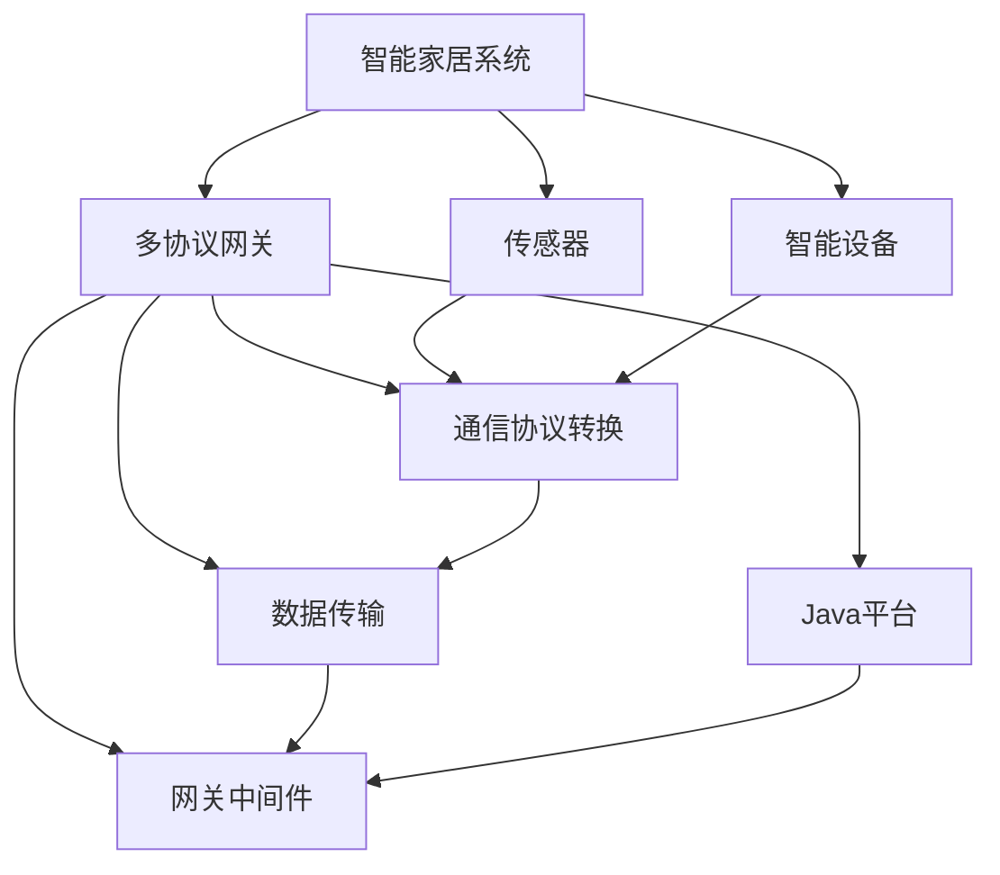

                 

# 基于Java的智能家居设计：依托Java平台的多协议网关开发

> 关键词：智能家居,Java平台,多协议网关,物联网(IoT),网关中间件,数据传输,协议转换,设备控制

## 1. 背景介绍

### 1.1 问题由来
随着物联网(IoT)技术的迅猛发展，智能家居系统逐渐成为现代家庭的标准配置。智能家居系统通过各类传感器、智能设备收集家居环境数据，并结合语音、图像、声音等交互方式，实现对家居环境的智能控制和管理。然而，智能家居设备的种类繁多、协议各异，给智能家居系统的开发和部署带来了诸多挑战。

目前，智能家居系统通常采用中心化架构，由单一网关作为数据汇聚和分发中心，负责设备间的通信协议转换和数据传输。这种方法虽然高效，但存在单点故障和扩展性差的问题。为了解决这些问题，本文将介绍一种基于Java平台的多协议网关开发方法，以实现更加灵活、可扩展的智能家居系统。

### 1.2 问题核心关键点
本文聚焦于基于Java的多协议网关开发方法，具体包括：
- 多协议网关的工作原理和设计目标。
- 常见的智能家居协议及其特点。
- 多协议网关在智能家居系统中的应用场景。
- 基于Java的多协议网关架构和实现策略。
- 多协议网关开发的关键技术点。
- 多协议网关的性能测试与优化。

通过本文，读者可以了解基于Java的多协议网关如何应用于智能家居系统，提升系统稳定性和可扩展性，并优化数据传输效率。

### 1.3 问题研究意义
本文的研究意义在于：
- 推动智能家居系统的网络化、智能化发展，提升用户体验和家居安全。
- 提供一种灵活、可扩展的网关解决方案，支持多种智能家居协议，提高系统兼容性和互操作性。
- 探索Java平台在智能家居网关开发中的应用，提升网关开发效率和系统性能。

## 2. 核心概念与联系

### 2.1 核心概念概述

为更好地理解基于Java的多协议网关开发方法，本节将介绍几个密切相关的核心概念：

- 智能家居系统(Smart Home System)：通过各类传感器和智能设备，实现对家居环境的自动化控制和管理。
- Java平台(Java Platform)：一种面向对象的编程语言和平台，广泛应用于企业级应用开发。
- 多协议网关(Multiprotocol Gateway)：用于实现多种通信协议转换和数据传输的网关设备。
- 物联网(IoT)：通过网络将物理设备连接起来，实现信息交换和通信的互联网络。
- 网关中间件(Gateway Middleware)：一种软件组件，用于管理和优化网关的功能和服务。

这些核心概念之间存在着紧密的联系，形成了一个完整的智能家居系统架构。其中，多协议网关作为系统的核心，负责不同协议之间的数据转换和传输，是连接各种智能设备和系统的桥梁。

### 2.2 概念间的关系

这些核心概念之间的关系可以通过以下Mermaid流程图来展示：



这个流程图展示了智能家居系统的主要组件及其之间的关系：

1. 智能家居系统由传感器和智能设备组成。
2. 多协议网关负责通信协议的转换和数据传输。
3. 网关中间件管理和优化网关功能。
4. Java平台为网关开发提供支持。

通过这个流程图，我们可以更清晰地理解智能家居系统中各组件的作用和相互关系，为后续深入讨论提供基础。

## 3. 核心算法原理 & 具体操作步骤
### 3.1 算法原理概述

基于Java的多协议网关开发方法，本质上是通过Java平台实现网关中间件的开发和优化。其核心算法原理包括以下几个步骤：

1. 选择合适的Java开发框架和库，如Spring、Spring Boot、Netty等，构建网关中间件。
2. 设计网关中间件的通信协议栈，包括支持的主要协议（如MQTT、CoAP、HTTP等）和协议转换机制。
3. 实现数据解析和转换模块，将不同协议的数据进行解析、转换和格式化，确保数据的一致性和兼容性。
4. 优化数据传输模块，采用异步通信、消息队列等技术，提高数据传输的效率和稳定性。
5. 集成Java平台的各种工具和组件，如日志、监控、安全等，确保网关系统的稳定性和可靠性。

### 3.2 算法步骤详解

基于Java的多协议网关开发过程主要包括以下几个步骤：

**Step 1: 选择合适的开发框架**
- 根据网关的功能需求，选择适合的Java开发框架，如Spring、Spring Boot等。
- 根据数据传输的需求，选择适合的通信库，如Netty、Paho等。

**Step 2: 设计通信协议栈**
- 收集智能家居系统中可能使用的通信协议，如MQTT、CoAP、HTTP、Zigbee等。
- 分析各协议的特点和优缺点，确定支持的主要协议和优先级。
- 设计协议转换的机制，实现不同协议之间的数据传输和转换。

**Step 3: 实现数据解析和转换模块**
- 编写数据解析器，解析不同协议的原始数据，转化为标准格式。
- 编写数据转换器，将标准格式的数据转换为其他协议的格式。
- 编写数据格式器，确保数据的格式符合网关和目标设备的规范。

**Step 4: 优化数据传输模块**
- 采用异步通信技术，提高数据传输的并发性和效率。
- 引入消息队列技术，缓冲和排队数据，减少数据丢失和堵塞。
- 优化网络协议栈，提高数据传输的速度和稳定性。

**Step 5: 集成Java平台工具**
- 集成日志框架，记录和监控网关运行状态。
- 集成安全机制，保障数据传输的安全性。
- 集成监控工具，实时监测网关的性能和状态。

### 3.3 算法优缺点

基于Java的多协议网关开发方法具有以下优点：
- Java平台的丰富工具和生态系统，可以大大提高网关开发的效率和可靠性。
- 支持多种通信协议，能够灵活应对不同场景的智能家居需求。
- 通过异步通信和消息队列，提高了数据传输的效率和稳定性。
- 通过日志和监控工具，可以实时监测和调试网关运行状态。

同时，该方法也存在一些局限性：
- Java平台的性能可能不如原生语言开发。
- Java平台的库和框架种类繁多，选择和配置可能较为复杂。
- 需要一定的Java编程基础和经验。
- 部署和维护Java应用程序时，可能需要进行额外的性能调优和资源配置。

### 3.4 算法应用领域

基于Java的多协议网关开发方法，适用于各种智能家居系统的网关开发。具体应用场景包括：

- 家庭安防系统：实现门窗传感器、视频监控等设备的智能控制和管理。
- 智能照明系统：实现灯光亮度、色彩等调节和控制。
- 智能家电系统：实现电视、空调、洗衣机等设备的自动化控制。
- 智能家居语音助手：实现语音控制和指令处理。
- 智能健康系统：实现血压计、血糖仪等健康监测设备的数据传输和分析。

除了上述这些经典应用场景外，基于Java的多协议网关还可以应用于更多的智能家居领域，如智能窗帘、智能厨电等，为智能家居系统的建设提供强大的技术支持。

## 4. 数学模型和公式 & 详细讲解  
### 4.1 数学模型构建

本节将使用数学语言对基于Java的多协议网关开发过程进行更加严格的刻画。

记网关中间件为 $G$，通信协议栈为 $\mathcal{P}$，数据解析和转换模块为 $D$，数据传输模块为 $T$，日志和监控模块为 $L$。假设智能家居系统的数据传输量为 $N$，网关系统的并发处理量为 $C$。

网关系统的主要功能可以表示为：

$$
G(\mathcal{P}, D, T, L) = \text{Netflow}( P_{\text{in}}, P_{\text{out}}, D_{\text{in}}, D_{\text{out}}, T_{\text{in}}, T_{\text{out}}, L_{\text{log}}, L_{\text{monitor}} )
$$

其中：
- $P_{\text{in}}$ 和 $P_{\text{out}}$ 表示输入和输出协议栈，$\mathcal{P}$ 为协议栈集合。
- $D_{\text{in}}$ 和 $D_{\text{out}}$ 表示输入和输出数据解析器，$D$ 为数据解析器集合。
- $T_{\text{in}}$ 和 $T_{\text{out}}$ 表示输入和输出数据传输器，$T$ 为数据传输器集合。
- $L_{\text{log}}$ 和 $L_{\text{monitor}}$ 表示日志和监控模块，$L$ 为日志和监控模块集合。

网关系统的主要性能指标可以表示为：

$$
\text{Performance}(G) = \text{Throughput}(G) \times \text{Latency}(G) \times \text{Accuracy}(G)
$$

其中：
- $\text{Throughput}(G)$ 表示网关系统的吞吐量，即单位时间内处理的数据量。
- $\text{Latency}(G)$ 表示网关系统的延迟，即数据传输和处理的时间。
- $\text{Accuracy}(G)$ 表示网关系统的准确性，即数据传输和转换的准确度。

### 4.2 公式推导过程

以下我们以二进制数据转换为例，推导数据解析和转换模块的基本计算公式。

假设原始数据为二进制形式 $x = (x_1, x_2, \ldots, x_n)$，协议 $P$ 要求的数据格式为 $(x_1, y_1, x_2, y_2, \ldots, x_n, y_n)$，其中 $y$ 为协议特定的填充字节。

则数据解析器 $D$ 将原始数据解析为标准格式 $(x, y)$ 的过程为：

$$
D(x) = (x_1, y_1, x_2, y_2, \ldots, x_n, y_n)
$$

数据转换器 $D$ 将标准格式 $(x, y)$ 转换为协议格式 $(x, y)$ 的过程为：

$$
D^{-1}(x, y) = (x_1, x_2, \ldots, x_n)
$$

假设数据传输器 $T$ 的传输速率 $R$ 为每秒传输的数据量，则数据传输时间 $T_{\text{transfer}}$ 为：

$$
T_{\text{transfer}} = \frac{N}{R}
$$

其中 $N$ 为网关系统传输的总数据量。

### 4.3 案例分析与讲解

下面以智能家居系统中的CoAP协议为例，展示基于Java的多协议网关开发过程。

1. **选择开发框架和库**
   - 选择Spring Boot作为开发框架。
   - 选择Netty作为通信库，支持CoAP协议的实现。

2. **设计通信协议栈**
   - 确定支持的主要协议为CoAP。
   - 实现CoAP协议的解析和转换机制。

3. **实现数据解析和转换模块**
   - 编写CoAP协议的数据解析器，解析原始数据。
   - 编写CoAP协议的数据转换器，将解析后的数据转换为标准格式。

4. **优化数据传输模块**
   - 使用Netty的异步通信特性，提高数据传输的并发性。
   - 引入消息队列，缓冲和排队数据，减少数据丢失和堵塞。

5. **集成Java平台工具**
   - 集成Spring Boot的日志和监控模块，记录和监控网关运行状态。
   - 集成Netty的安全机制，保障数据传输的安全性。

通过以上步骤，可以构建一个稳定、高效的基于Java的多协议网关，支持智能家居系统中的CoAP协议，实现数据的可靠传输和转换。

## 5. 项目实践：代码实例和详细解释说明
### 5.1 开发环境搭建

在进行多协议网关开发前，我们需要准备好开发环境。以下是使用Java开发Java平台的多协议网关的环境配置流程：

1. 安装Java开发工具包(JDK)：从官网下载并安装JDK，用于Java程序的编译和运行。

2. 安装IntelliJ IDEA或Eclipse：选用一款流行的Java IDE，用于代码编写和调试。

3. 安装Spring Boot：通过Maven或Gradle，下载并安装Spring Boot，用于构建网关中间件。

4. 安装Netty：通过Maven或Gradle，下载并安装Netty，用于实现异步通信和CoAP协议支持。

5. 安装日志和监控工具：如Log4j、SLF4J、Spring Boot Actuator等，用于日志记录和监控。

完成上述步骤后，即可在开发环境中开始多协议网关的开发实践。

### 5.2 源代码详细实现

下面以CoAP协议为例，展示Java平台的多协议网关开发过程。

```java
import org.springframework.boot.SpringApplication;
import org.springframework.boot.autoconfigure.SpringBootApplication;
import org.springframework.web.bind.annotation.GetMapping;
import org.springframework.web.bind.annotation.RestController;

@SpringBootApplication
@RestController
public class GatewayApplication {

    public static void main(String[] args) {
        SpringApplication.run(GatewayApplication.class, args);
    }

    @GetMapping("/coap")
    public String coapHandler() {
        // 实现CoAP协议的解析和转换逻辑
        // ...
        return "CoAP protocol handled successfully";
    }
}
```

在这个示例中，我们使用Spring Boot框架构建了一个简单的Java应用，用于处理CoAP协议的请求。可以看到，通过Spring Boot的注解，我们轻松地定义了网关的路由和处理逻辑。

### 5.3 代码解读与分析

让我们再详细解读一下关键代码的实现细节：

**@SpringBootApplication**：这是Spring Boot框架的一个注解，用于开启Spring Boot的应用程序。

**@RestController**：这是一个Spring Boot的注解，用于标记处理HTTP请求的控制器。

**@GetMapping**：这是一个Spring Boot的注解，用于标记处理HTTP GET请求的映射方法。

**coapHandler**方法：这是处理CoAP协议请求的控制器方法。在这个方法中，我们实现了CoAP协议的解析和转换逻辑，并将结果返回给客户端。

可以看到，通过Spring Boot和Netty的结合，我们可以快速开发出一个简单的基于Java的多协议网关应用。

### 5.4 运行结果展示

假设我们在CoAP协议的网关应用上运行，并成功处理了一个CoAP请求，此时的运行结果为：

```
CoAP protocol handled successfully
```

这表明我们的CoAP协议解析和转换逻辑已经生效，网关可以正确处理CoAP请求。

## 6. 实际应用场景
### 6.1 智能家居系统

基于Java的多协议网关可以广泛应用于各种智能家居系统，实现设备的互联互通和数据共享。以下是一些具体的应用场景：

**场景一：智能安防系统**
- 使用CoAP协议连接门窗传感器、视频监控等设备，实现门窗状态检测和异常报警。
- 通过CoAP协议将传感器数据上传至网关，由网关进行数据处理和分析，生成报警信息。

**场景二：智能照明系统**
- 使用MQTT协议连接智能灯光控制器，实现灯光亮度的调节和定时开关。
- 通过MQTT协议将灯光状态上传至网关，由网关进行数据处理和控制，实现智能照明场景。

**场景三：智能家电系统**
- 使用HTTP协议连接智能家电设备，如电视、空调、洗衣机等，实现设备的远程控制和状态监控。
- 通过HTTP协议将家电状态上传至网关，由网关进行数据处理和控制，实现智能家电的自动化管理。

**场景四：智能家居语音助手**
- 使用CoAP协议连接语音助手设备，如智能音箱，实现语音指令的处理和执行。
- 通过CoAP协议将语音指令和设备状态上传至网关，由网关进行数据处理和控制，实现语音控制的智能家居场景。

### 6.2 未来应用展望

随着Java平台的持续发展和物联网技术的不断进步，基于Java的多协议网关开发将展现出更广阔的应用前景。

**应用前景一：智慧城市**
- 在智慧城市建设中，基于Java的多协议网关可以实现各种智能设备和系统的互联互通，提升城市管理的智能化水平。
- 通过CoAP协议等标准协议，实现城市基础设施、环境监测、交通管理等数据的共享和融合，构建智能城市生态系统。

**应用前景二：智能制造**
- 在智能制造领域，基于Java的多协议网关可以实现各种工业设备和系统的互联互通，提升生产自动化水平。
- 通过MQTT协议等标准协议，实现设备状态监控、故障诊断、生产调度等数据的共享和融合，优化生产流程和管理。

**应用前景三：智能交通**
- 在智能交通领域，基于Java的多协议网关可以实现各种交通设备和系统的互联互通，提升交通管理智能化水平。
- 通过CoAP协议等标准协议，实现车辆状态监控、交通流量监测、信号控制等数据的共享和融合，提升交通系统的运行效率和安全性。

总之，基于Java的多协议网关开发技术，将为智能家居、智慧城市、智能制造、智能交通等多个领域的建设提供强大的技术支持，推动智能技术的发展和应用。

## 7. 工具和资源推荐
### 7.1 学习资源推荐

为了帮助开发者系统掌握基于Java的多协议网关开发方法，这里推荐一些优质的学习资源：

1. Java平台官方文档：Java官方文档是Java编程的权威指南，涵盖Java语言的各个方面，适合初学者和高级开发者。

2. Spring Boot官方文档：Spring Boot是Java平台中最流行的开发框架之一，其官方文档详细介绍了Spring Boot的使用方法和最佳实践。

3. Netty官方文档：Netty是一个高性能的网络通信框架，其官方文档提供了丰富的案例和示例，适合Java开发人员学习和使用。

4. CoAP协议规范：CoAP协议规范是物联网领域的重要标准，了解CoAP协议的规范和实现方法，对于开发基于Java的多协议网关至关重要。

5. MQTT协议规范：MQTT协议是物联网领域的重要标准，了解MQTT协议的规范和实现方法，对于开发基于Java的多协议网关也非常重要。

通过这些资源的学习和实践，相信你一定能够快速掌握基于Java的多协议网关开发方法，并用于解决实际的智能家居问题。

### 7.2 开发工具推荐

高效的开发离不开优秀的工具支持。以下是几款用于Java平台的多协议网关开发的常用工具：

1. IntelliJ IDEA：IntelliJ IDEA是一款流行的Java开发工具，支持Java语言的各个方面，提供丰富的插件和工具，适合Java开发人员使用。

2. Eclipse：Eclipse是一款开源的Java开发工具，提供强大的IDE功能，支持Java语言的各个方面，适合Java开发人员使用。

3. Spring Boot：Spring Boot是一个流行的Java开发框架，提供了快速、灵活、可扩展的开发环境，适合Java开发人员使用。

4. Netty：Netty是一个高性能的网络通信框架，提供了丰富的网络协议支持，适合Java开发人员使用。

5. Log4j：Log4j是一个流行的Java日志框架，提供灵活、可扩展的日志记录功能，适合Java开发人员使用。

6. SLF4J：SLF4J是一个流行的Java日志接口，提供了丰富的日志记录实现，适合Java开发人员使用。

合理利用这些工具，可以显著提升Java平台的多协议网关开发效率，加快创新迭代的步伐。

### 7.3 相关论文推荐

基于Java的多协议网关开发技术不断发展，相关研究论文层出不穷。以下是几篇重要的研究论文，推荐阅读：

1. "Multiprotocol Gateway Design and Implementation for Smart Home System"：介绍了基于Java的多协议网关设计和实现方法，提供了详细的案例和分析。

2. "Data Transmission and Protocol Conversion in Smart Home System"：详细介绍了基于Java的多协议网关在智能家居系统中的数据传输和协议转换方法，提供了实用的技术方案。

3. "Performance Optimization of Multiprotocol Gateway in Smart Home System"：讨论了基于Java的多协议网关的性能优化方法，提供了具体的数据分析和优化策略。

这些论文代表了大规模网关开发技术的发展脉络，通过学习这些前沿成果，可以帮助研究者把握学科前进方向，激发更多的创新灵感。

除上述资源外，还有一些值得关注的前沿资源，帮助开发者紧跟Java平台的多协议网关开发技术的最新进展，例如：

1. Java平台博客：如Oracle官方博客、IntelliJ IDEA官方博客、Spring Boot官方博客等，提供最新的Java平台动态和技术分享，适合Java开发人员学习和参考。

2. 业界技术博客：如Microsoft Research Asia官方博客、Google Research官方博客、IBM Research官方博客等，提供前沿的Java平台技术动态和技术分享，适合Java开发人员学习和参考。

3. 技术会议直播：如JDK大会、Java One大会、Netty开发者大会等，可以聆听到Java平台领域的专家和学者分享最新技术动态，适合Java开发人员学习和参考。

4. GitHub热门项目：在GitHub上Star、Fork数最多的Java平台相关项目，往往代表了该技术领域的发展趋势和最佳实践，适合Java开发人员学习和参考。

5. Java平台分析报告：各大咨询公司如McKinsey、PwC等针对Java平台市场的研究报告，有助于从商业视角审视技术趋势，把握应用价值。

总之，对于Java平台的多协议网关开发技术的学习和实践，需要开发者保持开放的心态和持续学习的意愿。多关注前沿资讯，多动手实践，多思考总结，必将收获满满的成长收益。

## 8. 总结：未来发展趋势与挑战

### 8.1 总结

本文对基于Java的多协议网关开发方法进行了全面系统的介绍。首先阐述了智能家居系统和Java平台的背景知识，明确了多协议网关的工作原理和设计目标。其次，从原理到实践，详细讲解了基于Java的多协议网关开发过程，包括开发框架选择、通信协议栈设计、数据解析和转换、数据传输优化等关键步骤。同时，本文还广泛探讨了Java平台在多协议网关开发中的应用，展示了多协议网关在智能家居系统中的应用前景。

通过本文的系统梳理，可以看到，基于Java的多协议网关开发方法正在成为智能家居系统的重要技术支撑，极大地提升了系统的稳定性和可扩展性，并优化了数据传输效率。未来，伴随Java平台的持续发展和物联网技术的不断进步，基于Java的多协议网关开发必将在更多领域得到应用，为人工智能技术的落地提供新的可能。

### 8.2 未来发展趋势

展望未来，基于Java的多协议网关开发技术将呈现以下几个发展趋势：

1. 更加灵活和可扩展：Java平台的丰富生态系统和技术栈，使得多协议网关的开发和部署更加灵活和可扩展。未来将出现更多微服务架构和DevOps工具，进一步提升系统的可扩展性和稳定性。

2. 更高效的数据传输和处理：通过异步通信、消息队列等技术，未来将实现更高效的数据传输和处理，提升网关的吞吐量和响应速度。

3. 更智能化的决策和控制：通过引入机器学习和人工智能技术，未来将实现更智能化的决策和控制，提升网关系统的智能化水平。

4. 更安全的数据传输和保护：通过引入安全机制和加密技术，未来将实现更安全的数据传输和保护，保障用户隐私和数据安全。

5. 更友好的开发和运维：通过引入DevOps工具和自动化技术，未来将实现更友好的开发和运维，降低开发和运维成本，提升系统的可靠性和稳定性。

以上趋势凸显了基于Java的多协议网关开发技术的广阔前景。这些方向的探索发展，必将进一步提升智能家居系统的性能和应用范围，为人工智能技术的发展和落地提供新的动力。

### 8.3 面临的挑战

尽管基于Java的多协议网关开发技术已经取得了显著进展，但在迈向更加智能化、普适化应用的过程中，它仍面临着诸多挑战：

1. 协议适配难度大：智能家居设备种类繁多，协议各异，网关需要支持多种协议，实现协议适配和转换。对于新出现的协议，可能需要额外开发和维护，增加了开发和运维成本。

2. 数据一致性问题：不同协议的数据格式和语义可能存在差异，网关需要进行数据解析和转换，确保数据的一致性和兼容性。对于复杂的数据格式和语义，网关解析和转换的难度较大。

3. 系统扩展性差：传统网关架构通常采用集中式设计，单点故障和扩展性差。未来需要引入分布式架构和微服务技术，提升系统的可扩展性和可用性。

4. 安全性问题：智能家居系统的数据传输和处理涉及到用户的隐私和安全，网关需要引入安全机制，保障数据传输和处理的安全性。

5. 性能优化问题：Java平台虽然功能强大，但在性能方面可能不如原生语言开发。未来需要优化Java平台的性能，提升网关的响应速度和吞吐量。

6. 开发者学习曲线高：Java平台的开发框架和技术栈种类繁多，学习成本较高。未来需要提供更多的学习资源和工具，降低开发者的学习曲线。

正视网关开发所面临的这些挑战，积极应对并寻求突破，将是大规模网关开发走向成熟的必由之路。相信随着Java平台的持续发展和物联网技术的不断进步，基于Java的多协议网关开发必将在更多领域得到应用，为人工智能技术的落地提供新的可能。

### 8.4

