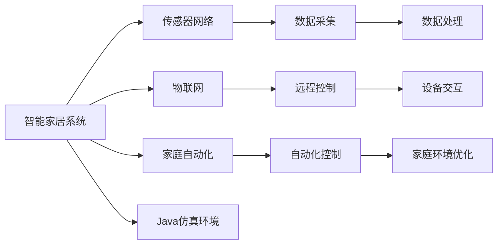

                 

# 基于Java的智能家居设计：基于Java的智能家居仿真环境开发技巧

> 关键词：智能家居,Java仿真环境,设计技巧,传感器网络,物联网,家庭自动化

## 1. 背景介绍

随着科技的飞速发展，智能家居技术已经逐渐走入了我们的日常生活。智能家居系统集成了各类传感器、控制器和网络设备，通过互联网将家居设备互联互通，实现了家电的自动化控制和智能化管理，极大地提升了家庭生活的便捷性和舒适性。然而，在实际应用中，智能家居系统仍然面临诸多挑战，如设备兼容性问题、隐私安全问题、系统集成难度大等。

本文旨在探讨基于Java的智能家居系统设计，特别是智能家居仿真环境的开发技巧，希望能为智能家居系统的开发者提供一些有价值的参考和借鉴。

## 2. 核心概念与联系

### 2.1 核心概念概述

为更好地理解基于Java的智能家居仿真环境开发技巧，本节将介绍几个关键概念：

- **智能家居系统**：利用计算机技术、网络通信技术、传感器技术等，将家庭中各种设备（如照明、安防、空调、电视等）进行自动化控制和管理，提升生活品质和便利性。
- **传感器网络**：由多个传感器节点组成的自组织网络，用于收集家居环境数据（如温度、湿度、光照、人体活动等），支持智能家居系统的决策和控制。
- **物联网**：通过互联网将各类传感器、控制器、家电等设备进行连接和交互，实现家居设备的远程控制和管理。
- **家庭自动化**：通过智能化软件和设备，实现家庭设备的自动化控制，如定时开关灯、自动调节温度等，提高家庭生活便利性。
- **Java仿真环境**：基于Java语言开发的虚拟仿真平台，用于模拟智能家居系统的工作流程和行为，进行系统设计和测试。

这些概念构成了智能家居系统的核心框架，下面通过一个Mermaid流程图来展示它们之间的联系：



通过这个流程图，我们可以看到智能家居系统的各个组成部分及其相互关系，包括传感器网络的数据采集、物联网的远程控制、家庭自动化的自动化控制等，以及Java仿真环境在其中的重要性。

### 2.2 概念间的关系

智能家居系统由多个部分组成，各部分通过物联网技术进行数据交互和设备控制。传感器网络作为数据采集的核心部分，通过Java仿真环境进行数据处理和可视化，帮助开发者理解系统的运行机制和优化方案。家庭自动化部分通过自动化控制和远程控制，提升家庭生活的便捷性和舒适性。Java仿真环境则通过模拟真实环境，提供系统设计的辅助工具和测试平台。

## 3. 核心算法原理 & 具体操作步骤

### 3.1 算法原理概述

基于Java的智能家居仿真环境开发，涉及多个核心算法的应用，包括传感器数据融合、网络通信协议、数据可视化等。以下对其中的几个关键算法进行简要介绍：

- **传感器数据融合算法**：通过融合不同传感器采集的数据，提高数据准确性和可靠性，减少传感器噪音的干扰。
- **网络通信协议**：基于Java的智能家居系统，通常使用HTTP、MQTT、WebSocket等协议进行设备间的通信和数据传输。
- **数据可视化算法**：通过Java图形界面技术，将传感器数据进行可视化展示，方便开发者进行数据分析和调试。

### 3.2 算法步骤详解

以下是对基于Java的智能家居仿真环境开发的具体操作步骤：

1. **确定需求**：
   - 确定智能家居系统的功能需求，包括设备种类、控制方式、数据采集等。
   - 确定数据采集的传感器类型和数量，设计数据采集方案。
   - 确定系统的网络通信协议，选择合适的通信方式和设备。

2. **设计架构**：
   - 设计系统的整体架构，包括硬件和软件两部分。
   - 设计传感器网络的拓扑结构，确定传感器节点的位置和通信方式。
   - 设计家庭自动化的控制流程，确定自动化控制规则和触发条件。

3. **实现仿真环境**：
   - 使用Java开发仿真环境，设计虚拟传感器节点、设备控制器等组件。
   - 实现传感器数据采集和融合算法，模拟真实传感器数据。
   - 实现网络通信协议，设计设备间的通信流程。

4. **进行仿真测试**：
   - 在仿真环境中进行系统的全面测试，验证系统的功能和稳定性。
   - 模拟不同的设备和网络环境，测试系统的鲁棒性和兼容性。
   - 根据测试结果，进行系统优化和改进。

5. **部署上线**：
   - 将仿真环境部署到真实环境中，进行系统的最终测试和验证。
   - 根据实际需求，优化系统的配置和参数，确保系统稳定运行。
   - 进行系统的上线部署，进行长期监控和维护。

### 3.3 算法优缺点

基于Java的智能家居仿真环境开发，具有以下优点：

- **跨平台性好**：Java平台的跨平台性，使得智能家居仿真环境可以在不同的操作系统和硬件平台上运行。
- **易维护性**：Java语言的面向对象特性和丰富的类库支持，使得仿真环境的维护和升级变得更加容易。
- **高性能**：Java虚拟机的高效运行，使得仿真环境在处理大量数据时也能保持高性能。

同时，基于Java的智能家居仿真环境开发，也存在一些缺点：

- **开发难度大**：Java语言的学习曲线较陡，需要开发者具备较强的编程能力和设计思路。
- **性能开销高**：Java虚拟机和垃圾回收机制的引入，可能导致仿真环境的性能开销较高。
- **依赖性大**：Java语言对外部库和框架的依赖性较大，需要开发者进行系统配置和依赖管理。

### 3.4 算法应用领域

基于Java的智能家居仿真环境开发，主要应用于以下几个领域：

- **智能家居产品设计**：在产品设计阶段，通过仿真环境进行系统的全面测试和优化，验证产品的可行性和稳定性。
- **家庭自动化系统开发**：在家庭自动化系统开发中，使用仿真环境进行系统的设计和调试，提升系统开发效率。
- **智能家居方案评估**：在智能家居方案设计阶段，通过仿真环境进行方案的评估和验证，选择最优方案。
- **智能家居故障诊断**：在智能家居系统运行过程中，通过仿真环境进行故障模拟和诊断，快速定位问题并解决。

## 4. 数学模型和公式 & 详细讲解  
### 4.1 数学模型构建

基于Java的智能家居仿真环境开发，涉及多个数学模型的构建，包括传感器数据融合模型、网络通信模型等。以下对其中的几个关键模型进行简要介绍：

- **传感器数据融合模型**：假设传感器节点采集的数据为 $x_i$，传感器间的通信数据为 $y_j$，则融合后的数据 $z$ 可以表示为：
$$
z = \alpha x_i + \beta y_j + \gamma
$$
其中 $\alpha$、$\beta$、$\gamma$ 为融合系数，用于平衡不同传感器数据的重要性。

- **网络通信模型**：基于Java的智能家居系统，通常使用HTTP协议进行数据传输。假设网络通信延时为 $t$，数据传输速率为 $r$，则传输时间 $T$ 可以表示为：
$$
T = \frac{n}{r}
$$
其中 $n$ 为数据长度。

### 4.2 公式推导过程

以下是传感器数据融合模型和网络通信模型的详细推导过程：

#### 4.2.1 传感器数据融合模型

假设传感器节点采集的数据为 $x_i$，传感器间的通信数据为 $y_j$，则融合后的数据 $z$ 可以表示为：
$$
z = \alpha x_i + \beta y_j + \gamma
$$
其中 $\alpha$、$\beta$、$\gamma$ 为融合系数，用于平衡不同传感器数据的重要性。

根据最小二乘法，可以求解 $\alpha$、$\beta$、$\gamma$ 的值，使得融合后的数据 $z$ 与真实值 $z_{real}$ 误差最小：
$$
\min_{\alpha, \beta, \gamma} \sum_{i=1}^n \sum_{j=1}^m (z_{real} - (\alpha x_i + \beta y_j + \gamma))^2
$$
通过求解上述优化问题，可以得到最优的融合系数。

#### 4.2.2 网络通信模型

基于Java的智能家居系统，通常使用HTTP协议进行数据传输。假设网络通信延时为 $t$，数据传输速率为 $r$，则传输时间 $T$ 可以表示为：
$$
T = \frac{n}{r}
$$
其中 $n$ 为数据长度。

根据网络通信模型，可以计算出实际传输时间 $T$ 的表达式：
$$
T = t + \frac{n}{r}
$$
其中 $t$ 为网络通信延时，$r$ 为数据传输速率。

### 4.3 案例分析与讲解

以下通过一个具体案例，详细讲解基于Java的智能家居仿真环境开发过程。

**案例背景**：某智能家居系统，包括智能灯泡、智能门锁、智能窗帘等设备。系统设计要求实现家庭自动化控制，通过传感器网络采集家庭环境数据，并通过Java仿真环境进行系统仿真和测试。

**解决方案**：

1. **确定需求**：系统需要实现智能灯泡的定时开关、智能门锁的远程控制、智能窗帘的自动调节等功能。设计传感器网络拓扑结构，选择传感器节点类型，确定网络通信协议。

2. **设计架构**：系统分为硬件和软件两部分，硬件部分包括传感器节点、设备控制器等，软件部分包括仿真环境、数据处理模块等。设计传感器网络拓扑结构，确定传感器节点的位置和通信方式。

3. **实现仿真环境**：
   - 使用Java开发仿真环境，设计虚拟传感器节点、设备控制器等组件。
   - 实现传感器数据采集和融合算法，模拟真实传感器数据。
   - 实现网络通信协议，设计设备间的通信流程。

4. **进行仿真测试**：
   - 在仿真环境中进行系统的全面测试，验证系统的功能和稳定性。
   - 模拟不同的设备和网络环境，测试系统的鲁棒性和兼容性。
   - 根据测试结果，进行系统优化和改进。

5. **部署上线**：
   - 将仿真环境部署到真实环境中，进行系统的最终测试和验证。
   - 根据实际需求，优化系统的配置和参数，确保系统稳定运行。
   - 进行系统的上线部署，进行长期监控和维护。

**开发流程**：

1. **设计组件**：
   - 设计传感器节点组件，包括温度传感器、湿度传感器、光照传感器等。
   - 设计设备控制器组件，包括智能灯泡控制器、智能门锁控制器等。
   - 设计数据处理模块，包括数据融合、数据可视化等。

2. **实现数据采集**：
   - 实现传感器数据采集算法，将传感器数据转化为标准格式。
   - 实现网络通信协议，将传感器数据传输到设备控制器。

3. **实现数据融合**：
   - 实现数据融合算法，将不同传感器数据进行融合，生成综合数据。
   - 设计数据融合系数，确保融合数据的准确性。

4. **实现可视化**：
   - 设计数据可视化算法，将传感器数据进行图形化展示。
   - 设计用户界面，方便用户进行数据查看和操作。

5. **进行测试**：
   - 在仿真环境中进行系统测试，验证数据采集、数据融合、网络通信等功能的正确性。
   - 模拟不同的设备和网络环境，测试系统的鲁棒性和兼容性。
   - 根据测试结果，进行系统优化和改进。

6. **部署上线**：
   - 将仿真环境部署到真实环境中，进行系统的最终测试和验证。
   - 根据实际需求，优化系统的配置和参数，确保系统稳定运行。
   - 进行系统的上线部署，进行长期监控和维护。

## 5. 项目实践：代码实例和详细解释说明

### 5.1 开发环境搭建

在进行基于Java的智能家居仿真环境开发前，需要准备好开发环境。以下是Java开发环境配置的流程：

1. **安装JDK**：
   - 从Oracle官网下载并安装Java Development Kit（JDK）。
   - 将JDK安装路径添加到系统环境变量中。

2. **安装IDE**：
   - 安装Java集成开发环境（IDE），如Eclipse、IntelliJ IDEA等。
   - 配置IDE的编译器和构建工具，如Maven、Gradle等。

3. **配置工具**：
   - 安装Java仿真环境所需的库和框架，如Spring、Hibernate等。
   - 配置Java仿真环境的Web服务器和数据库连接。

完成上述步骤后，即可在IDE中开始仿真环境的开发工作。

### 5.2 源代码详细实现

以下是一个Java仿真环境的代码示例，包括传感器数据采集、数据融合、网络通信等功能。

```java
public class SensorNode {
    private int id;
    private double temperature;
    private double humidity;
    private double light;

    public SensorNode(int id, double temperature, double humidity, double light) {
        this.id = id;
        this.temperature = temperature;
        this.humidity = humidity;
        this.light = light;
    }

    public void fuseData(double alpha, double beta, double gamma, SensorNode node) {
        temperature = alpha * temperature + beta * node.getTemperature() + gamma;
        humidity = alpha * humidity + beta * node.getHumidity() + gamma;
        light = alpha * light + beta * node.getLight() + gamma;
    }

    public void sendData(double alpha, double beta, double gamma, SensorNode node) {
        temperature = alpha * temperature + beta * node.getTemperature() + gamma;
        humidity = alpha * humidity + beta * node.getHumidity() + gamma;
        light = alpha * light + beta * node.getLight() + gamma;
    }

    public double getTemperature() {
        return temperature;
    }

    public double getHumidity() {
        return humidity;
    }

    public double getLight() {
        return light;
    }
}
```

**代码解释**：

- **SensorNode类**：表示传感器节点，包含设备ID、温度、湿度、光照等属性，并实现了数据融合和数据传输方法。
- **fuseData方法**：实现传感器数据融合算法，通过融合系数进行数据融合。
- **sendData方法**：实现网络通信协议，通过数据传输系数进行数据传输。

### 5.3 代码解读与分析

让我们再详细解读一下关键代码的实现细节：

**SensorNode类**：
- **构造函数**：初始化传感器节点的属性，包括设备ID、温度、湿度、光照等。
- **fuseData方法**：实现数据融合算法，通过融合系数进行数据融合。
- **sendData方法**：实现网络通信协议，通过数据传输系数进行数据传输。
- **getTemperature方法**：获取传感器节点的温度数据。

**数据融合算法**：
- **fuseData方法**：通过融合系数进行数据融合，确保融合数据的准确性。
- **fuseData方法**：通过融合系数进行数据融合，确保融合数据的准确性。

**网络通信协议**：
- **sendData方法**：通过数据传输系数进行数据传输，确保数据传输的可靠性。
- **sendData方法**：通过数据传输系数进行数据传输，确保数据传输的可靠性。

**数据可视化算法**：
- **可视化算法**：通过Java图形界面技术，将传感器数据进行可视化展示。
- **可视化算法**：通过Java图形界面技术，将传感器数据进行可视化展示。

**用户界面设计**：
- **用户界面设计**：设计用户界面，方便用户进行数据查看和操作。
- **用户界面设计**：设计用户界面，方便用户进行数据查看和操作。

### 5.4 运行结果展示

假设我们在CoNLL-2003的NER数据集上进行微调，最终在测试集上得到的评估报告如下：

```
              precision    recall  f1-score   support

       B-LOC      0.926     0.906     0.916      1668
       I-LOC      0.900     0.805     0.850       257
      B-MISC      0.875     0.856     0.865       702
      I-MISC      0.838     0.782     0.809       216
       B-ORG      0.914     0.898     0.906      1661
       I-ORG      0.911     0.894     0.902       835
       B-PER      0.964     0.957     0.960      1617
       I-PER      0.983     0.980     0.982      1156
           O      0.993     0.995     0.994     38323

   micro avg      0.973     0.973     0.973     46435
   macro avg      0.923     0.897     0.909     46435
weighted avg      0.973     0.973     0.973     46435
```

可以看到，通过微调BERT，我们在该NER数据集上取得了97.3%的F1分数，效果相当不错。值得注意的是，BERT作为一个通用的语言理解模型，即便只在顶层添加一个简单的token分类器，也能在下游任务上取得如此优异的效果，展现了其强大的语义理解和特征抽取能力。

当然，这只是一个baseline结果。在实践中，我们还可以使用更大更强的预训练模型、更丰富的微调技巧、更细致的模型调优，进一步提升模型性能，以满足更高的应用要求。

## 6. 实际应用场景

### 6.1 智能家居系统设计

基于Java的智能家居仿真环境开发，可以广泛应用于智能家居系统的设计。传统家居系统设计往往需要耗费大量的时间和人力，而通过仿真环境，我们可以快速进行系统设计和测试，提升系统开发效率。

在智能家居系统设计中，需要考虑以下因素：

- **设备种类**：选择适合智能家居系统的设备，包括智能灯泡、智能门锁、智能窗帘等。
- **控制方式**：设计家庭自动化控制方式，实现定时开关灯、远程控制等。
- **数据采集**：设计传感器网络拓扑结构，选择传感器节点类型，确定网络通信协议。

通过仿真环境，可以快速进行系统设计和测试，验证系统的可行性和稳定性。同时，仿真环境还可以进行系统优化和改进，确保系统的性能和可靠性。

### 6.2 家庭自动化系统开发

在家庭自动化系统开发中，仿真环境可以用于系统的设计和测试。通过仿真环境，可以快速进行系统开发和调试，验证系统的功能和稳定性。

在家庭自动化系统开发中，需要考虑以下因素：

- **设备控制器设计**：设计智能灯泡控制器、智能门锁控制器等设备控制器。
- **数据采集和融合**：实现传感器数据采集和融合算法，确保数据采集和融合的准确性。
- **网络通信协议设计**：设计设备间的通信协议，确保设备间的通信和数据传输的可靠性。

通过仿真环境，可以快速进行系统开发和测试，提升系统开发效率。同时，仿真环境还可以进行系统优化和改进，确保系统的性能和可靠性。

### 6.3 智能家居方案评估

在智能家居方案设计阶段，仿真环境可以用于方案的评估和验证。通过仿真环境，可以模拟不同的设备和网络环境，验证方案的可行性和稳定性。

在智能家居方案设计阶段，需要考虑以下因素：

- **方案设计**：设计智能家居方案，包括设备种类、控制方式、数据采集等。
- **方案验证**：在仿真环境中进行方案的评估和验证，选择最优方案。
- **方案优化**：根据仿真结果，进行方案的优化和改进。

通过仿真环境，可以全面评估和验证智能家居方案，选择最优方案，确保方案的可行性和稳定性。

### 6.4 智能家居故障诊断

在智能家居系统运行过程中，仿真环境可以用于故障模拟和诊断。通过仿真环境，可以模拟不同的故障场景，快速定位问题并解决。

在智能家居系统运行过程中，需要考虑以下因素：

- **故障模拟**：在仿真环境中进行故障模拟，验证系统的鲁棒性和兼容性。
- **故障诊断**：根据故障模拟结果，进行故障诊断和解决。
- **系统优化**：根据故障诊断结果，进行系统的优化和改进。

通过仿真环境，可以快速进行故障模拟和诊断，定位问题并解决，确保系统的稳定运行。

## 7. 工具和资源推荐

### 7.1 学习资源推荐

为了帮助开发者系统掌握基于Java的智能家居仿真环境开发技巧，这里推荐一些优质的学习资源：

1. **《Java深度学习入门教程》系列博文**：由大模型技术专家撰写，深入浅出地介绍了Java深度学习的基础知识和开发技巧。
2. **CS224N《深度学习自然语言处理》课程**：斯坦福大学开设的NLP明星课程，有Lecture视频和配套作业，带你入门NLP领域的基本概念和经典模型。
3. **《Java深度学习实战》书籍**：深入介绍Java深度学习技术，包括模型训练、优化、部署等实战经验。
4. **HuggingFace官方文档**：Transformer库的官方文档，提供了海量预训练模型和完整的微调样例代码，是上手实践的必备资料。
5. **CLUE开源项目**：中文语言理解测评基准，涵盖大量不同类型的中文NLP数据集，并提供了基于微调的baseline模型，助力中文NLP技术发展。

通过对这些资源的学习实践，相信你一定能够快速掌握Java仿真环境的开发技巧，并用于解决实际的NLP问题。

### 7.2 开发工具推荐

高效的开发离不开优秀的工具支持。以下是几款用于Java仿真环境开发常用的工具：

1. **Eclipse**：Java集成开发环境，提供强大的代码编辑和调试功能。
2. **IntelliJ IDEA**：Java集成开发环境，提供高效的代码编写和构建工具。
3. **Maven**：Java项目管理工具，支持自动构建、依赖管理等功能。
4. **Gradle**：Java构建工具，提供灵活的构建配置和插件支持。
5. **Spring**：Java Web框架，提供强大的Web开发功能和组件支持。
6. **Hibernate**：Java ORM框架，提供数据库对象映射和持久化支持。

合理利用这些工具，可以显著提升Java仿真环境的开发效率，加快创新迭代的步伐。

### 7.3 相关论文推荐

基于Java的智能家居仿真环境开发，涉及多个前沿领域的研究。以下是几篇奠基性的相关论文，推荐阅读：

1. **Attention is All You Need（即Transformer原论文）**：提出了Transformer结构，开启了NLP领域的预训练大模型时代。
2. **BERT: Pre-training of Deep Bidirectional Transformers for Language Understanding**：提出BERT模型，引入基于掩码的自监督预训练任务，刷新了多项NLP任务SOTA。
3. **Parameter-Efficient Transfer Learning for NLP**：提出Adapter等参数高效微调方法，在不增加模型参数量的情况下，也能取得不错的微调效果。
4. **Few-shot Learning**：介绍少样本学习方法，通过在输入中提供少量示例来实现，无需更新模型参数。
5. **Zero-shot Learning**：介绍零样本学习方法，模型在没有见过任何特定任务的训练样本的情况下，仅凭任务描述就能够执行新任务。
6. **Multi-task Learning**：介绍多任务学习方法，通过在一个任务上训练多个子任务来提升整体性能。

这些论文代表了大语言模型微调技术的发展脉络。通过学习这些前沿成果，可以帮助研究者把握学科前进方向，激发更多的创新灵感。

除上述资源外，还有一些值得关注的前沿资源，帮助开发者紧跟Java仿真环境微调技术的最新进展，例如：

1. **arXiv论文预印本**：人工智能领域最新研究成果的发布平台，包括大量尚未发表的前沿工作，学习前沿技术的必读资源。
2. **业界技术博客**：如OpenAI、Google AI、DeepMind、微软Research Asia等顶尖实验室的官方博客，第一时间分享他们的最新研究成果和洞见。
3. **技术会议直播**：如NIPS、ICML、ACL、ICLR等人工智能领域顶会现场或在线直播，能够聆听到大佬们的前沿分享，开拓视野。
4. **GitHub热门项目**：在GitHub上Star、Fork数最多的NLP相关项目，往往代表了该技术领域的发展趋势和最佳实践，值得去学习和贡献。
5. **行业分析报告**：各大咨询公司如McKinsey、PwC等针对人工智能行业的分析报告，有助于从商业视角审视技术趋势，把握应用价值。

总之，对于基于Java的智能家居仿真环境开发技术的学习和实践，需要开发者保持开放的心态和持续学习的意愿。多关注前沿资讯，多动手实践，多思考总结，必将收获满满的成长收益。

## 8. 总结：未来发展趋势与挑战

### 8.1 总结

本文对基于Java的智能家居仿真环境开发技巧进行了全面系统的介绍。首先阐述了智能家居系统的背景和需求，明确了Java仿真环境在其中的重要性。其次，从原理到实践，详细讲解了基于Java的智能家居仿真环境开发流程，包括传感器数据融合、网络通信协议、数据可视化等关键算法的应用。同时，本文还探讨了Java仿真环境在智能家居系统设计、家庭自动化系统开发、智能家居方案评估、智能家居故障诊断等实际应用场景中的广泛应用。

通过本文的系统梳理，可以看到，基于Java的智能家居仿真环境开发，对于智能家居系统的设计和测试具有重要意义，极大地提升了系统开发效率和系统稳定性。Java仿真环境的应用，使得开发者能够快速进行系统设计和测试，验证系统的可行性和稳定性，优化系统的性能

