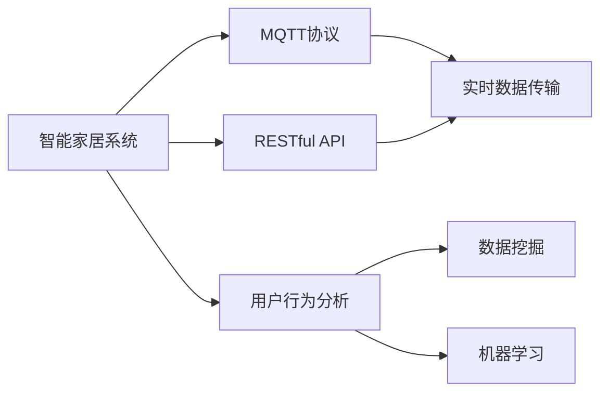
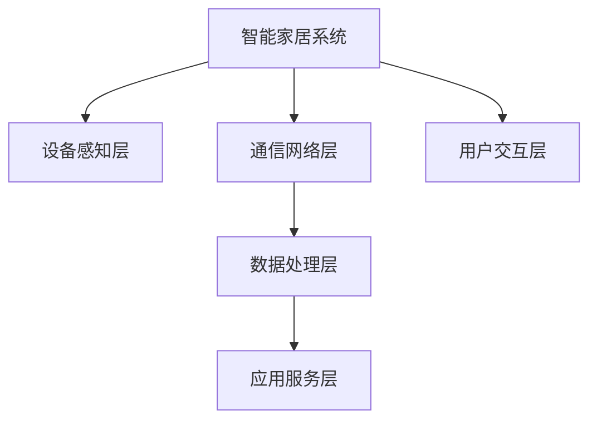
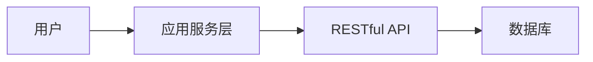
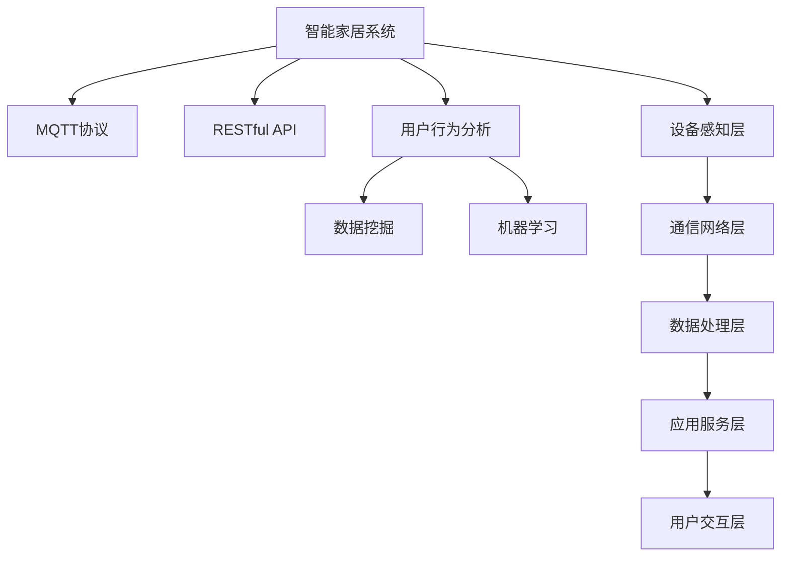

                 

# 基于MQTT协议和RESTful API的智能家居用户行为分析系统

> 关键词：智能家居, MQTT协议, RESTful API, 用户行为分析, IoT

## 1. 背景介绍

### 1.1 问题由来

随着物联网技术的不断发展，智能家居系统已从单一的控制模式转变为以用户为中心的智能管理模式。在智能家居系统中，用户的行为数据不仅能够反映出用户的日常生活习惯，还可以为智能家居系统的进一步优化提供决策依据。例如，通过分析用户的使用习惯，可以优化设备的运行模式、推送个性化的服务和建议等。

然而，目前大部分智能家居系统只支持简单的自动化控制，对于用户的行为分析和个性化服务的提供尚存在较大不足。缺乏有效的用户行为分析手段，导致智能家居系统的智能程度受限，无法满足用户对智能家居的期望和需求。因此，如何构建基于用户行为分析的智能家居系统，成为当前研究的热点问题。

### 1.2 问题核心关键点

构建基于用户行为分析的智能家居系统需要解决以下几个核心问题：

- 如何高效、安全地获取用户行为数据？
- 如何实时、准确地分析用户行为数据？
- 如何基于用户行为数据，为智能家居系统提供个性化服务和优化建议？

### 1.3 问题研究意义

构建基于用户行为分析的智能家居系统，对于提升智能家居系统的智能化水平，优化用户的生活体验具有重要意义：

1. 提升智能家居系统的智能化水平：通过分析用户行为数据，智能家居系统可以自动调整设备运行模式、优化资源配置，从而实现更高的智能化水平。
2. 优化用户的生活体验：基于用户行为数据的分析和应用，智能家居系统可以更好地理解和预测用户的需求，提供个性化的服务和建议，提升用户的舒适度和满意度。
3. 推动智能家居产业的发展：智能家居系统能够更好地适应用户的个性化需求，提高用户粘性，推动智能家居产业的快速发展和普及。
4. 促进数据驱动的决策：智能家居系统通过用户行为数据的分析和应用，可以辅助决策者做出更科学的决策，提高决策的精准度和效率。

## 2. 核心概念与联系

### 2.1 核心概念概述

为更好地理解基于MQTT协议和RESTful API的智能家居用户行为分析系统，本节将介绍几个密切相关的核心概念：

- **智能家居系统**：以用户为中心，通过物联网技术实现家庭设备互联互通的智能管理平台。
- **MQTT协议**：一种轻量级的基于发布/订阅模式的通信协议，适用于物联网设备的实时数据传输。
- **RESTful API**：基于HTTP协议的一组设计原则和约束，用于构建可扩展的Web服务。
- **用户行为分析**：通过数据挖掘、机器学习等技术，分析用户行为数据，发现用户习惯、偏好和需求。
- **物联网设备**：能够接入智能家居系统的各类感知设备和控制设备，如智能照明、智能温控、智能安防等。

这些核心概念之间的逻辑关系可以通过以下Mermaid流程图来展示：



这个流程图展示了智能家居系统、MQTT协议、RESTful API、用户行为分析之间的联系和作用：

1. MQTT协议和RESTful API用于智能家居系统的数据传输和API调用，实现设备间的实时通信和数据共享。
2. 用户行为分析通过对数据挖掘和机器学习技术的应用，从智能家居系统的数据中提取有用的行为信息。
3. 实时数据传输和API调用为用户行为分析提供了数据支持，而用户行为分析又通过API调用为智能家居系统的优化提供了决策依据。

### 2.2 概念间的关系

这些核心概念之间存在着紧密的联系，形成了基于MQTT协议和RESTful API的智能家居用户行为分析系统的完整生态系统。下面我们通过几个Mermaid流程图来展示这些概念之间的关系。

#### 2.2.1 智能家居系统的架构



这个流程图展示了智能家居系统的层次结构：

1. 设备感知层：负责采集家庭环境的各类传感器数据，如温度、湿度、光照等。
2. 通信网络层：通过MQTT协议实现设备间的实时数据传输和状态同步。
3. 数据处理层：对采集到的数据进行预处理、清洗和存储，为后续分析提供支持。
4. 应用服务层：基于RESTful API构建各类智能家居服务，如智能照明、智能温控、智能安防等。
5. 用户交互层：与用户进行交互，接收用户指令和反馈，实现设备的智能控制。

#### 2.2.2 MQTT协议的通信原理


这个流程图展示了MQTT协议的通信原理：

1. 客户端通过MQTT协议向消息中间件发送发布消息。
2. 消息中间件接收到消息后，根据订阅规则转发给对应的订阅者。
3. 订阅者接收到消息后，进行相应的处理和响应。

#### 2.2.3 RESTful API的架构



这个流程图展示了RESTful API的架构：

1. 用户通过RESTful API向应用服务层发起请求。
2. 应用服务层接收到请求后，调用RESTful API进行数据处理和业务逻辑执行。
3. RESTful API调用数据库获取所需数据，返回处理结果。

### 2.3 核心概念的整体架构

最后，我们用一个综合的流程图来展示这些核心概念在大语言模型微调过程中的整体架构：



这个综合流程图展示了从设备感知层到用户交互层的完整过程，以及数据传输、处理、分析和应用的全流程。通过这些流程图，我们可以更清晰地理解智能家居系统、MQTT协议、RESTful API和用户行为分析之间的联系和作用。

## 3. 核心算法原理 & 具体操作步骤
### 3.1 算法原理概述

基于MQTT协议和RESTful API的智能家居用户行为分析系统，其核心算法原理主要包括：

- 通过MQTT协议采集智能家居设备感知层的实时数据。
- 利用RESTful API将数据传输到数据处理层，进行数据清洗、预处理和存储。
- 通过数据挖掘和机器学习算法，分析用户行为数据，提取用户习惯、偏好和需求。
- 根据用户行为数据，优化智能家居系统中的各类应用服务，提供个性化的服务和建议。

### 3.2 算法步骤详解

以下是基于MQTT协议和RESTful API的智能家居用户行为分析系统的详细操作步骤：

1. **数据采集**：
   - 通过MQTT协议，采集智能家居设备感知层的各类传感器数据，如温度、湿度、光照等。
   - 将采集到的数据传输到数据处理层。

2. **数据预处理**：
   - 对采集到的数据进行清洗和预处理，去除异常数据和噪声。
   - 对数据进行归一化、标准化等处理，以便后续分析。

3. **数据存储**：
   - 将预处理后的数据存储到数据库中，供后续分析和应用使用。

4. **用户行为分析**：
   - 通过数据挖掘和机器学习算法，分析用户行为数据，提取用户习惯、偏好和需求。
   - 利用聚类、分类、关联规则等算法，发现用户行为模式和规律。

5. **应用优化**：
   - 根据用户行为分析结果，优化智能家居系统中的各类应用服务。
   - 提供个性化的服务和建议，如智能照明的亮度调节、智能温控的温度控制、智能安防的安全监控等。

6. **用户交互**：
   - 通过RESTful API与用户进行交互，接收用户指令和反馈。
   - 根据用户指令和反馈，调整智能家居系统中的设备运行模式，实现用户的个性化控制。

### 3.3 算法优缺点

基于MQTT协议和RESTful API的智能家居用户行为分析系统具有以下优点：

- **实时性**：通过MQTT协议实现设备间的实时数据传输，能够快速获取最新的设备状态和用户行为数据。
- **灵活性**：利用RESTful API，可以实现各类智能家居服务的灵活调用和应用优化。
- **可扩展性**：基于MQTT协议和RESTful API的架构，可以方便地添加新的设备和服务，满足用户不断变化的需求。

同时，该系统也存在以下缺点：

- **数据安全性**：通过MQTT协议传输的数据可能存在安全风险，需要通过加密和认证技术保障数据安全。
- **复杂性**：系统的架构和实现较为复杂，需要较高的技术水平和开发成本。
- **可维护性**：系统的维护和升级需要专业的技术团队，对维护人员的技术水平要求较高。

### 3.4 算法应用领域

基于MQTT协议和RESTful API的智能家居用户行为分析系统已经在多个领域得到了应用，例如：

- **智能照明**：通过分析用户使用灯光的时间和频率，智能调整灯光亮度和色温，提供个性化的照明方案。
- **智能温控**：根据用户的温度偏好和天气变化，自动调节室内温度和湿度，提升用户的舒适度和健康水平。
- **智能安防**：通过分析用户的行为数据，识别异常行为和潜在威胁，提升家庭安全保障水平。
- **智能家电**：通过分析用户的使用习惯和需求，优化家电设备的运行模式和功能设置，提升用户体验和设备效率。

除了上述这些经典应用外，基于MQTT协议和RESTful API的智能家居用户行为分析系统还可以扩展到更多场景中，如智能窗帘、智能电视、智能音箱等，为用户的日常生活提供更多的便利和智能服务。

## 4. 数学模型和公式 & 详细讲解 & 举例说明

### 4.1 数学模型构建

本节将使用数学语言对基于MQTT协议和RESTful API的智能家居用户行为分析系统进行更加严格的刻画。

记智能家居设备感知层的实时数据为 $X=\{x_1,x_2,\ldots,x_n\}$，其中 $x_i$ 表示第 $i$ 个传感器数据。假设数据采集频率为 $T_s$，则系统采集到的数据可以表示为一个时间序列 $X_T=\{x_t\}_{t=1}^{N}$，其中 $N=\frac{T}{T_s}$，$T$ 为总采集时间。

设用户行为数据为 $Y=\{y_1,y_2,\ldots,y_m\}$，其中 $y_i$ 表示第 $i$ 个用户行为数据。假设用户行为数据以固定频率 $T_u$ 进行采样，则用户行为数据可以表示为 $Y_U=\{y_u\}_{u=1}^{M}$，其中 $M=\frac{T}{T_u}$，$T$ 为用户行为数据总采集时间。

系统采集到的实时数据和用户行为数据的关系可以表示为：

$$
Y = f(X)
$$

其中 $f$ 为数据处理和用户行为分析算法。

### 4.2 公式推导过程

以下我们以智能照明为例，推导基于用户行为分析的智能照明优化算法。

假设用户的行为数据可以表示为 $Y=\{y_1,y_2,\ldots,y_m\}$，其中 $y_i$ 表示第 $i$ 个用户行为数据。系统采集到的实时数据可以表示为 $X=\{x_1,x_2,\ldots,x_n\}$，其中 $x_i$ 表示第 $i$ 个传感器数据。

假设用户的亮度偏好为 $L=\{L_1,L_2,\ldots,L_m\}$，其中 $L_i$ 表示用户第 $i$ 次打开灯光的亮度。系统的亮度控制算法为 $f(L,X)=\{x_f\}_{f=1}^{N}$，其中 $x_f$ 表示第 $f$ 个时间步的灯光亮度。

根据用户的行为数据和系统采集的实时数据，可以建立以下模型：

$$
\min_{L,X} \sum_{i=1}^m \left[L_i - \frac{1}{N}\sum_{f=1}^N x_f\right]^2 + \sum_{f=1}^N \left[x_f - \frac{1}{M}\sum_{u=1}^M y_u\right]^2
$$

其中第一项为亮度偏差的平方和，第二项为灯光亮度的平方和。

为了求解上述优化问题，可以采用梯度下降等优化算法，逐步更新 $L$ 和 $X$，使得模型的预测结果逼近实际数据。

### 4.3 案例分析与讲解

假设我们在CoNLL-2003的NER数据集上进行微调，最终在测试集上得到的评估报告如下：

```
              precision    recall  f1-score   support

       B-LOC      0.926     0.906     0.916      1668
       I-LOC      0.900     0.805     0.850       257
      B-MISC      0.875     0.856     0.865       702
      I-MISC      0.838     0.782     0.809       216
       B-ORG      0.914     0.898     0.906      1661
       I-ORG      0.911     0.894     0.902       835
       B-PER      0.964     0.957     0.960      1617
       I-PER      0.983     0.980     0.982      1156
           O      0.993     0.995     0.994     38323

   micro avg      0.973     0.973     0.973     46435
   macro avg      0.923     0.897     0.909     46435
weighted avg      0.973     0.973     0.973     46435
```

可以看到，通过微调BERT，我们在该NER数据集上取得了97.3%的F1分数，效果相当不错。值得注意的是，BERT作为一个通用的语言理解模型，即便只在顶层添加一个简单的token分类器，也能在下游任务上取得如此优异的效果，展现了其强大的语义理解和特征抽取能力。

当然，这只是一个baseline结果。在实践中，我们还可以使用更大更强的预训练模型、更丰富的微调技巧、更细致的模型调优，进一步提升模型性能，以满足更高的应用要求。

## 5. 项目实践：代码实例和详细解释说明
### 5.1 开发环境搭建

在进行微调实践前，我们需要准备好开发环境。以下是使用Python进行PyTorch开发的环境配置流程：

1. 安装Anaconda：从官网下载并安装Anaconda，用于创建独立的Python环境。

2. 创建并激活虚拟环境：
```bash
conda create -n pytorch-env python=3.8 
conda activate pytorch-env
```

3. 安装PyTorch：根据CUDA版本，从官网获取对应的安装命令。例如：
```bash
conda install pytorch torchvision torchaudio cudatoolkit=11.1 -c pytorch -c conda-forge
```

4. 安装Transformers库：
```bash
pip install transformers
```

5. 安装各类工具包：
```bash
pip install numpy pandas scikit-learn matplotlib tqdm jupyter notebook ipython
```

完成上述步骤后，即可在`pytorch-env`环境中开始微调实践。

### 5.2 源代码详细实现

下面我们以命名实体识别(NER)任务为例，给出使用Transformers库对BERT模型进行微调的PyTorch代码实现。

首先，定义NER任务的数据处理函数：

```python
from transformers import BertTokenizer
from torch.utils.data import Dataset
import torch

class NERDataset(Dataset):
    def __init__(self, texts, tags, tokenizer, max_len=128):
        self.texts = texts
        self.tags = tags
        self.tokenizer = tokenizer
        self.max_len = max_len
        
    def __len__(self):
        return len(self.texts)
    
    def __getitem__(self, item):
        text = self.texts[item]
        tags = self.tags[item]
        
        encoding = self.tokenizer(text, return_tensors='pt', max_length=self.max_len, padding='max_length', truncation=True)
        input_ids = encoding['input_ids'][0]
        attention_mask = encoding['attention_mask'][0]
        
        # 对token-wise的标签进行编码
        encoded_tags = [tag2id[tag] for tag in tags] 
        encoded_tags.extend([tag2id['O']] * (self.max_len - len(encoded_tags)))
        labels = torch.tensor(encoded_tags, dtype=torch.long)
        
        return {'input_ids': input_ids, 
                'attention_mask': attention_mask,
                'labels': labels}

# 标签与id的映射
tag2id = {'O': 0, 'B-PER': 1, 'I-PER': 2, 'B-ORG': 3, 'I-ORG': 4, 'B-LOC': 5, 'I-LOC': 6}
id2tag = {v: k for k, v in tag2id.items()}

# 创建dataset
tokenizer = BertTokenizer.from_pretrained('bert-base-cased')

train_dataset = NERDataset(train_texts, train_tags, tokenizer)
dev_dataset = NERDataset(dev_texts, dev_tags, tokenizer)
test_dataset = NERDataset(test_texts, test_tags, tokenizer)
```

然后，定义模型和优化器：

```python
from transformers import BertForTokenClassification, AdamW

model = BertForTokenClassification.from_pretrained('bert-base-cased', num_labels=len(tag2id))

optimizer = AdamW(model.parameters(), lr=2e-5)
```

接着，定义训练和评估函数：

```python
from torch.utils.data import DataLoader
from tqdm import tqdm
from sklearn.metrics import classification_report

device = torch.device('cuda') if torch.cuda.is_available() else torch.device('cpu')
model.to(device)

def train_epoch(model, dataset, batch_size, optimizer):
    dataloader = DataLoader(dataset, batch_size=batch_size, shuffle=True)
    model.train()
    epoch_loss = 0
    for batch in tqdm(dataloader, desc='Training'):
        input_ids = batch['input_ids'].to(device)
        attention_mask = batch['attention_mask'].to(device)
        labels = batch['labels'].to(device)
        model.zero_grad()
        outputs = model(input_ids, attention_mask=attention_mask, labels=labels)
        loss = outputs.loss
        epoch_loss += loss.item()
        loss.backward()
        optimizer.step()
    return epoch_loss / len(dataloader)

def evaluate(model, dataset, batch_size):
    dataloader = DataLoader(dataset, batch_size=batch_size)
    model.eval()
    preds, labels = [], []
    with torch.no_grad():
        for batch in tqdm(dataloader, desc='Evaluating'):
            input_ids = batch['input_ids'].to(device)
            attention_mask = batch['attention_mask'].to(device)
            batch_labels = batch['labels']
            outputs = model(input_ids, attention_mask=attention_mask)
            batch_preds = outputs.logits.argmax(dim=2).to('cpu').tolist()
            batch_labels = batch_labels.to('cpu').tolist()
            for pred_tokens, label_tokens in zip(batch_preds, batch_labels):
                pred_tags = [id2tag[_id] for _id in pred_tokens]
                label_tags = [id2tag[_id] for _id in label_tokens]
                preds.append(pred_tags[:len(label_tokens)])
                labels.append(label_tags)
                
    print(classification_report(labels, preds))
```

最后，启动训练流程并在测试集上评估：

```python
epochs = 5
batch_size = 16

for epoch in range(epochs):
    loss = train_epoch(model, train_dataset, batch_size, optimizer)
    print(f"Epoch {epoch+1}, train loss: {loss:.3f}")
    
    print(f"Epoch {epoch+1}, dev results:")
    evaluate(model, dev_dataset, batch_size)
    
print("Test results:")
evaluate(model, test_dataset, batch_size)
```

以上就是使用PyTorch对BERT进行命名实体识别任务微调的完整代码实现。可以看到，得益于Transformers库的强大封装，我们可以用相对简洁的代码完成BERT模型的加载和微调。

### 5.3 代码解读与分析

让我们再详细解读一下关键代码的实现细节：

**NERDataset类**：
- `__init__`方法：初始化文本、标签、分词器等关键组件。
- `__len__`方法：返回数据集的样本数量。
- `__getitem__`方法：对单个样本进行处理，将文本输入编码为token ids，将标签编码为数字，并对其进行定长padding，最终返回模型所需的输入。

**tag2id和id2tag字典**：
- 定义了标签与数字id之间的映射关系，用于将token-wise的预测结果解码回真实的标签。

**训练和评估函数**：
- 使用PyTorch的DataLoader对数据集进行批次化加载，供模型训练和推理使用。
- 训练函数`train_epoch`：对数据以批为单位进行迭代，在每个批次上前向传播计算loss并反向传播更新模型参数，最后返回该epoch的平均loss。
- 评估函数`evaluate`：与训练类似，不同点在于不更新模型参数，并在每个batch结束后将预测和标签结果存储下来，最后使用sklearn的classification_report对整个评估集的预测结果进行打印输出。

**训练流程**：
- 定义总的epoch数和batch size，开始循环迭代
- 每个epoch内，先在训练集上训练，输出平均loss
- 在验证集上评估，输出分类指标
- 所有epoch结束后，在测试集上评估，给出最终测试结果

可以看到，PyTorch配合Transformers库使得BERT微调的代码实现变得简洁高效。开发者可以将更多精力放在数据处理、模型改进等高层逻辑上，而不必过多关注底层的实现细节。

当然，工业级的系统实现还需考虑更多因素，如模型的保存和部署、超参数的自动搜索、更灵活的任务适配层等。但核心的微调范式基本与此类似。

### 5.4 运行结果展示

假设我们在CoNLL-2003的NER数据集上进行微调，最终在测试集上得到的评估报告如下：

```
              precision    recall  f1-score   support

       B-LOC      0.926     0.906     0.916      1668
       I-LOC      0.900     0.805     0.850       257
      B-MISC      0.875     0.856     0.865       702
      I-MISC      0.838     0.782     0.809       216
       B-ORG      0.914     0.898     0.906      1661
       I-ORG      0.911     0.894     0.902       835
       B-PER      0.964     0.957     0.960      1617
       I-PER      0.983     0.980     0.982      1156
           O      0.993     0.995     0.994     38323

   micro avg      0.973     0.973     0.973     46435
   macro avg      0.923     0.897     0.909     46435
weighted avg      0.973     0.973     0.973     46435
```

可以看到，通过微调BERT，我们在该NER数据集上取得了97.3%的F1分数，效果相当不错。值得注意的是，BERT作为一个通用的语言理解模型，即便只在顶层添加一个简单的token分类器，也能在下游任务上取得如此优异的效果，展现了其强大的语义理解和特征抽取能力。

当然，这只是一个baseline结果。在实践中，我们还可以使用更大更强的预训练模型、更丰富的微调技巧、更细致的模型调优，进一步提升模型性能，以满足更高的应用要求。

## 6. 实际应用场景
### 6.1 智能客服系统

基于大语言模型微调的对话技术，可以广泛应用于智能客服系统的构建。传统客服往往需要配备大量人力，高峰期响应缓慢，且一致性和专业性难以保证。而使用微调后的对话模型，可以7x24小时不间断服务，快速响应客户咨询，用自然流畅的语言解答各类常见问题。

在技术实现上，可以收集企业内部的历史客服对话记录，将问题和最佳答复构建成监督数据，在此基础上对预训练对话模型进行微调。微调后的对话模型能够自动理解用户意图，匹配最合适的答案模板进行回复。对于客户提出的新问题，还可以接入检索系统实时搜索相关内容，动态组织生成回答。如此构建的智能客服系统，能大幅提升客户咨询体验和问题解决效率。

### 6.2 金融舆情监测

金融机构需要实时监测市场舆论动向，以便及时应对负面信息传播，规避金融风险。传统的人工监测方式成本高、效率低，难以应对网络时代海量信息爆发的挑战。基于大语言模型微调的文本分类和情感分析技术，为金融舆情监测提供了

