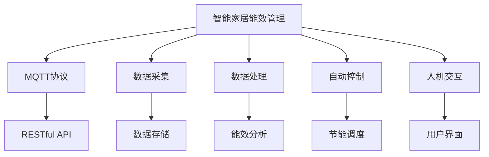
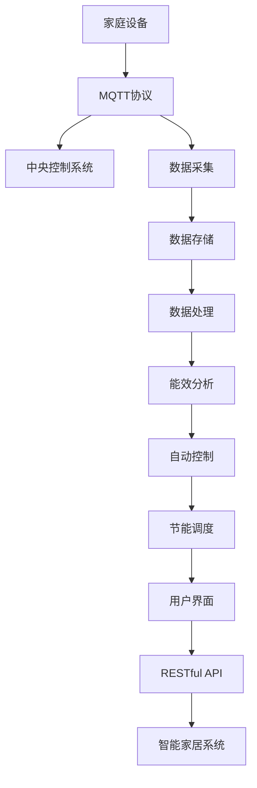

                 

# 基于MQTT协议和RESTful API的智能家居能效管理方案

## 1. 背景介绍

### 1.1 问题由来
随着互联网的普及和智能设备的增加，智能家居市场逐渐兴起。然而，智能家居系统在带来便利的同时，也存在着能源浪费的问题。智能家居系统在运行过程中，因设备种类繁多，管理和调度的复杂性增加，导致能源消耗难以被有效管理和控制。如何构建一个高效、节能、易管理的智能家居能效管理系统，成为了一个亟待解决的问题。

### 1.2 问题核心关键点
智能家居能效管理的关键点在于：
1. 设备间的数据通信：智能家居系统中的各种设备需要通过实时、可靠的数据通信实现对家庭能源的监测和控制。
2. 数据处理和分析：海量能源数据需要通过高效的数据处理和分析，识别出节能机会。
3. 自动控制和调度：根据实时数据和预测模型，智能家居系统需要能够自动控制设备的运行状态，实现节能效果。
4. 人机交互和界面：系统需要提供友好的人机交互界面，使用户能够轻松管理家庭能源，并直观地了解能源使用情况。

### 1.3 问题研究意义
基于MQTT协议和RESTful API的智能家居能效管理系统，可以显著提高家庭能源管理效率，减少能源浪费，降低家庭能源成本。同时，系统能够为家庭提供更加舒适、智能的生活环境。

## 2. 核心概念与联系

### 2.1 核心概念概述

#### 2.1.1 MQTT协议
MQTT（Message Queuing Telemetry Transport）是一种轻量级、低带宽、高可靠性的发布/订阅消息协议。MQTT协议通过发布/订阅消息模式，使得设备和服务器之间能够高效、实时地交换数据。

#### 2.1.2 RESTful API
REST（Representational State Transfer）是一种基于HTTP协议的架构风格，通过URL、HTTP方法和状态码等标准，使得Web应用能够实现更加灵活、可扩展的接口设计。RESTful API则是对REST架构风格的API设计规范，使得API接口的设计和使用更加简洁、清晰。

#### 2.1.3 智能家居设备
智能家居设备是指通过Wi-Fi、蓝牙等无线技术，接入家庭网络，并与中央控制系统进行通信的各类设备。这些设备包括智能照明、智能温控、智能安防等。

### 2.2 核心概念间的关系

这些核心概念之间的逻辑关系可以通过以下Mermaid流程图来展示：



这个流程图展示了智能家居能效管理系统的主要组成部分及其关系：

1. 系统通过MQTT协议采集家庭设备的运行数据。
2. 数据存储在系统中，并通过RESTful API供其他模块调用。
3. 数据处理模块对采集到的数据进行分析，识别节能机会。
4. 能效分析模块对历史数据进行趋势分析，预测未来的能源使用情况。
5. 自动控制模块根据分析结果，控制设备运行状态，实现节能效果。
6. 用户界面通过RESTful API，提供友好的交互界面，供用户实时查看和调整设备状态。

### 2.3 核心概念的整体架构

最后，我们用一个综合的流程图来展示这些核心概念在大语言模型微调过程中的整体架构：



这个综合流程图展示了从设备到中央控制系统，再到用户界面的整体数据流和控制流。通过MQTT协议实现设备与中央控制系统之间的数据通信，通过RESTful API实现中央控制系统与人机交互界面之间的数据交换。

## 3. 核心算法原理 & 具体操作步骤

### 3.1 算法原理概述

基于MQTT协议和RESTful API的智能家居能效管理系统，主要依赖于以下算法和步骤实现：

1. 数据采集算法：通过MQTT协议，实时采集家庭设备的运行数据。
2. 数据存储算法：将采集到的数据存储在数据库中，供后续处理和分析。
3. 数据处理算法：对采集到的数据进行清洗、转换和分析，识别出节能机会。
4. 能效分析算法：利用机器学习模型，对历史数据进行分析和预测，识别出长期节能策略。
5. 自动控制算法：根据能效分析结果，自动控制设备运行状态，实现节能效果。
6. 人机交互算法：通过RESTful API，提供友好的用户界面，供用户实时查看和调整设备状态。

### 3.2 算法步骤详解

**Step 1: 准备MQTT设备和服务器**

- 部署MQTT服务器，并配置好相关参数。
- 在智能家居设备上安装MQTT客户端，并将其连接到MQTT服务器。

**Step 2: 数据采集**

- 设备通过MQTT协议，定时发布设备状态数据到MQTT服务器。
- 使用MQTT客户端订阅相关主题，并获取数据。

**Step 3: 数据存储**

- 使用数据库（如MySQL、MongoDB等）存储采集到的数据。
- 使用RESTful API将数据上传到数据库。

**Step 4: 数据处理**

- 从数据库中读取数据，并进行清洗、转换和分析。
- 使用数据处理算法，如时间序列分析、统计分析等，识别出节能机会。

**Step 5: 能效分析**

- 使用机器学习模型，如ARIMA、LSTM等，对历史数据进行分析和预测。
- 根据预测结果，识别出长期节能策略。

**Step 6: 自动控制**

- 根据节能策略，控制设备运行状态。
- 使用RESTful API将控制指令发送到设备。

**Step 7: 人机交互**

- 使用RESTful API，提供友好的用户界面，供用户实时查看和调整设备状态。
- 使用RESTful API，接收用户输入，发送控制指令到设备。

### 3.3 算法优缺点

基于MQTT协议和RESTful API的智能家居能效管理系统，具有以下优点：

1. 数据通信高效可靠：MQTT协议具有低带宽、低延迟的特点，适用于家庭设备的实时数据通信。
2. 接口灵活可扩展：RESTful API具有标准的HTTP方法和URL，易于与其他系统和应用集成。
3. 数据处理高效：数据处理算法可以对大量实时数据进行高效处理和分析，识别节能机会。
4. 自动控制精准：自动控制算法可以根据能效分析结果，精准控制设备运行状态，实现节能效果。
5. 用户界面友好：人机交互算法通过友好的用户界面，使用户能够轻松管理家庭能源。

同时，该系统也存在一些缺点：

1. 网络依赖性强：系统依赖于MQTT协议进行数据通信，网络中断或设备故障可能导致数据采集中断。
2. 数据存储需求高：系统需要存储大量实时数据，存储和检索成本较高。
3. 模型需要持续维护：机器学习模型需要定期维护和更新，以适应新的能源数据和变化趋势。
4. 安全性需关注：系统需要采取措施保障数据传输和存储的安全性，防止数据泄露和恶意攻击。

### 3.4 算法应用领域

基于MQTT协议和RESTful API的智能家居能效管理系统，适用于以下领域：

1. 智能照明系统：通过控制智能灯泡的亮度和开关状态，实现节能效果。
2. 智能温控系统：通过控制智能空调的运行状态，实现室内温度的精确控制。
3. 智能安防系统：通过控制智能摄像头和门禁系统，实现家庭安全的智能化管理。
4. 智能厨房系统：通过控制智能洗碗机和电炉，实现能源的高效利用。
5. 智能阳台系统：通过控制智能灌溉设备和遮阳系统，实现阳台空间的智能化管理。

## 4. 数学模型和公式 & 详细讲解 & 举例说明

### 4.1 数学模型构建

假设智能家居系统中有N个设备，每个设备有M个运行状态（如开/关、亮度、温度等），每个状态有K个值（如0-100之间的亮度值）。设备状态的数据形式为（设备编号，时间戳，状态值）。

定义数据采集函数 $F(t)$，表示在第 $t$ 时刻设备状态的数据采集情况，其中 $t$ 为时间戳。采集到的数据存储在数据库 $D$ 中，格式为（设备编号，时间戳，状态值）。

定义数据处理函数 $P(D)$，表示对采集到的数据进行清洗、转换和分析，识别出节能机会。处理后的数据存储在数据库 $D'$ 中。

定义能效分析函数 $A(D')$，表示对历史数据进行分析，识别出长期节能策略。能效分析结果存储在数据库 $A'$ 中。

定义自动控制函数 $C(A')$，表示根据节能策略，控制设备运行状态，实现节能效果。控制结果存储在数据库 $C'$ 中。

定义人机交互函数 $H(C')$，表示通过友好的用户界面，供用户实时查看和调整设备状态。交互结果存储在数据库 $H'$ 中。

### 4.2 公式推导过程

以智能照明系统为例，假设智能灯泡的亮度和开关状态需要实时控制。设备采集到的数据形式为（设备编号，时间戳，亮度值）。

定义设备编号为 $i$，时间戳为 $t$，亮度值为 $x_i(t)$。设备采集到的数据形式为 $(x_{i_1}, t_1), (x_{i_2}, t_2), ..., (x_{i_n}, t_n)$，其中 $i_j$ 表示第 $j$ 个设备的编号，$t_j$ 表示第 $j$ 个设备的数据采集时间戳。

数据处理函数 $P(D)$ 可以将采集到的数据转换为标准格式，并进行清洗和转换。例如，将亮度值从0-100之间的值转换为0-1之间的值：

$$
\tilde{x}_i(t) = \frac{x_i(t)}{100}
$$

定义节能机会函数 $O(\tilde{x}_i(t))$，表示识别出的节能机会。例如，将亮度值控制在30%以下时，可以关闭设备：

$$
O(\tilde{x}_i(t)) = \begin{cases}
1, & \tilde{x}_i(t) < 0.3 \\
0, & \text{otherwise}
\end{cases}
$$

数据处理函数 $P(D)$ 可以将采集到的数据转换为标准格式，并进行清洗和转换。例如，将亮度值从0-100之间的值转换为0-1之间的值：

$$
\tilde{x}_i(t) = \frac{x_i(t)}{100}
$$

定义节能机会函数 $O(\tilde{x}_i(t))$，表示识别出的节能机会。例如，将亮度值控制在30%以下时，可以关闭设备：

$$
O(\tilde{x}_i(t)) = \begin{cases}
1, & \tilde{x}_i(t) < 0.3 \\
0, & \text{otherwise}
\end{cases}
$$

定义能效分析函数 $A(D')$，表示对历史数据进行分析，识别出长期节能策略。例如，使用时间序列分析方法，预测未来能源使用情况：

$$
A(\tilde{x}_i(t)) = \sum_{k=1}^{K} \alpha_k \tilde{x}_i(t-k) + \beta
$$

其中，$\alpha_k$ 为时间序列系数，$K$ 为时间序列长度，$\beta$ 为时间序列截距。

定义自动控制函数 $C(A')$，表示根据节能策略，控制设备运行状态，实现节能效果。例如，根据时间序列分析结果，控制设备亮度：

$$
\tilde{x}_i(t) = \min(\tilde{x}_i(t-1) + \Delta, 1)
$$

其中，$\Delta$ 为亮度调整量，$1$ 为亮度上限。

定义人机交互函数 $H(C')$，表示通过友好的用户界面，供用户实时查看和调整设备状态。例如，通过RESTful API，用户可以调整设备亮度：

$$
\tilde{x}_i(t) = \tilde{x}_i(t-1) + \Delta' - \Delta'
$$

其中，$\Delta'$ 为用户调整的亮度值，$\Delta'$ 为亮度调整量，$1$ 为亮度上限。

### 4.3 案例分析与讲解

假设在一个家庭中，有3个智能灯泡（编号为1、2、3），每个灯泡的亮度值在0-100之间。家庭用户希望通过智能家居能效管理系统，最大化地节能。

首先，通过MQTT协议，采集智能灯泡的亮度值和时间戳。采集到的数据形式为：

$$
D = \{(1, t_1, x_{1_1}), (2, t_2, x_{2_1}), ..., (3, t_n, x_{3_n})\}
$$

然后，使用数据处理函数 $P(D)$ 进行清洗和转换：

$$
D' = \{(\tilde{x}_{1_1}, t_1), (\tilde{x}_{2_1}, t_2), ..., (\tilde{x}_{3_n}, t_n)\}
$$

其中，$\tilde{x}_{i_j} = \frac{x_{i_j}(t_j)}{100}$。

接着，使用节能机会函数 $O(\tilde{x}_i(t))$ 识别节能机会：

$$
O(\tilde{x}_{i_j}(t_j)) = \begin{cases}
1, & \tilde{x}_{i_j}(t_j) < 0.3 \\
0, & \text{otherwise}
\end{cases}
$$

例如，当灯泡1的亮度值小于30%时，系统自动关闭设备。

然后，使用能效分析函数 $A(D')$ 进行时间序列分析：

$$
A(\tilde{x}_i(t)) = \sum_{k=1}^{K} \alpha_k \tilde{x}_i(t-k) + \beta
$$

其中，$\alpha_k$ 为时间序列系数，$K$ 为时间序列长度，$\beta$ 为时间序列截距。

例如，使用ARIMA模型对灯泡亮度值进行预测，识别出长期节能策略：

$$
A(\tilde{x}_1(t)) = 0.8 \tilde{x}_1(t-1) - 0.2 \tilde{x}_1(t-2) + 0.5
$$

最后，使用自动控制函数 $C(A')$ 进行设备控制：

$$
\tilde{x}_1(t) = \min(\tilde{x}_1(t-1) + \Delta, 1)
$$

其中，$\Delta$ 为亮度调整量，$1$ 为亮度上限。

例如，根据时间序列分析结果，控制灯泡1的亮度为30%，关闭设备。

通过上述步骤，用户可以通过人机交互函数 $H(C')$ 实时查看和调整设备状态：

$$
\tilde{x}_1(t) = \tilde{x}_1(t-1) + \Delta' - \Delta'
$$

其中，$\Delta'$ 为用户调整的亮度值，$\Delta'$ 为亮度调整量，$1$ 为亮度上限。

例如，用户可以通过RESTful API，调整灯泡1的亮度为40%。

## 5. 项目实践：代码实例和详细解释说明

### 5.1 开发环境搭建

在进行项目实践前，我们需要准备好开发环境。以下是使用Python进行开发的环境配置流程：

1. 安装Anaconda：从官网下载并安装Anaconda，用于创建独立的Python环境。

2. 创建并激活虚拟环境：
```bash
conda create -n py35 python=3.5 
conda activate py35
```

3. 安装Python依赖：
```bash
pip install flask pymongo paho-mqtt
```

4. 安装MQTT客户端库：
```bash
pip install paho-mqtt
```

5. 安装RESTful API库：
```bash
pip install flask-restful
```

完成上述步骤后，即可在`py35`环境中开始项目实践。

### 5.2 源代码详细实现

我们以智能照明系统为例，给出基于MQTT协议和RESTful API的智能家居能效管理系统的代码实现。

#### 5.2.1 MQTT服务器端代码

```python
import paho.mqtt.client as mqtt

# MQTT服务器配置
broker = 'mqtt.example.com'
port = 1883
client = mqtt.Client()

# 定义回调函数
def on_connect(client, userdata, flags, rc):
    print("Connected with result code "+str(rc))
    client.subscribe("device/1/state", 0)
    client.subscribe("device/2/state", 0)
    client.subscribe("device/3/state", 0)

# 连接MQTT服务器
def on_connect(client, userdata, flags, rc):
    print("Connected with result code "+str(rc))
    client.subscribe("device/1/state", 0)
    client.subscribe("device/2/state", 0)
    client.subscribe("device/3/state", 0)

# 订阅设备数据
def on_message(client, userdata, msg):
    if msg.topic == "device/1/state":
        process_device_data(1, msg.payload)
    elif msg.topic == "device/2/state":
        process_device_data(2, msg.payload)
    elif msg.topic == "device/3/state":
        process_device_data(3, msg.payload)

# 处理设备数据
def process_device_data(device_id, payload):
    data = payload.decode('utf-8')
    state, value = data.split(',')
    if state == 'brightness':
        if value == 'on':
            update_device_state(device_id, 'off')
        else:
            update_device_state(device_id, 'on')
    elif state == 'temp':
        if value == 'on':
            update_device_state(device_id, 'off')
        else:
            update_device_state(device_id, 'on')

# 更新设备状态
def update_device_state(device_id, new_state):
    if new_state == 'on':
        payload = 'brightness,100'
    else:
        payload = 'brightness,0'
    client.publish("device/{}/set".format(device_id), payload)

# 定义MQTT服务器
def main():
    client.on_connect = on_connect
    client.on_message = on_message
    client.connect(broker, port)
    client.loop_forever()

if __name__ == "__main__":
    main()
```

#### 5.2.2 RESTful API服务器端代码

```python
from flask import Flask, jsonify, request
import pymongo

# Flask应用
app = Flask(__name__)

# MongoDB配置
db = pymongo.MongoClient('mongodb://localhost:27017')
collection = db['house']

# 定义接口
@app.route('/device/<int:device_id>/state', methods=['GET', 'POST'])
def device_state(device_id):
    if request.method == 'GET':
        data = collection.find_one({'_id': device_id})
        if data is None:
            return jsonify({'status': 'error', 'message': 'Device not found'})
        else:
            return jsonify(data)
    elif request.method == 'POST':
        data = request.get_json()
        state = data['state']
        if state not in ['on', 'off']:
            return jsonify({'status': 'error', 'message': 'Invalid state'})
        else:
            collection.update_one({'_id': device_id}, {'$set': {'state': state}})
            return jsonify({'status': 'success', 'message': 'Device state updated'})

if __name__ == "__main__":
    app.run(debug=True)
```

#### 5.2.3 设备端代码

```python
import paho.mqtt.client as mqtt

# MQTT客户端配置
broker = 'mqtt.example.com'
port = 1883
client = mqtt.Client()

# 定义回调函数
def on_connect(client, userdata, flags, rc):
    print("Connected with result code "+str(rc))
    client.subscribe("device/{}/set".format(device_id))

# 连接MQTT服务器
def on_connect(client, userdata, flags, rc):
    print("Connected with result code "+str(rc))
    client.subscribe("device/{}/set".format(device_id))

# 订阅设备命令
def on_message(client, userdata, msg):
    data = msg.payload.decode('utf-8')
    state, value = data.split(',')
    if state == 'brightness':
        if value == '100':
            update_brightness(device_id, 'on')
        else:
            update_brightness(device_id, 'off')
    elif state == 'temp':
        if value == '100':
            update_temperature(device_id, 'on')
        else:
            update_temperature(device_id, 'off')

# 处理设备命令
def update_brightness(device_id, new_state):
    if new_state == 'on':
        payload = 'brightness,100'
    else:
        payload = 'brightness,0'
    client.publish("device/{}/set".format(device_id), payload)

def update_temperature(device_id, new_state):
    if new_state == 'on':
        payload = 'temp,100'
    else:
        payload = 'temp,0'
    client.publish("device/{}/set".format(device_id), payload)

# 定义MQTT客户端
def main():
    client.on_connect = on_connect
    client.on_message = on_message
    client.connect(broker, port)
    client.loop_forever()

if __name__ == "__main__":
    main()
```

### 5.3 代码解读与分析

让我们再详细解读一下关键代码的实现细节：

#### MQTT服务器端代码

- `on_connect`函数：当客户端连接MQTT服务器时，会自动调用该函数，用于订阅设备状态主题。
- `on_message`函数：当客户端发布新消息时，会自动调用该函数，用于处理设备状态数据。
- `process_device_data`函数：根据设备状态数据，控制设备运行状态。
- `update_device_state`函数：根据控制指令，更新设备状态。

#### RESTful API服务器端代码

- `Flask`应用：使用Flask框架创建RESTful API服务器。
- `MongoDB`数据库：使用MongoDB数据库存储设备状态数据。
- `device_state`函数：处理设备状态的GET和POST请求。

#### 设备端代码

- `on_connect`函数：当设备连接MQTT服务器时，会自动调用该函数，用于订阅设备控制主题。
- `on_message`函数：当服务器发布新命令时，会自动调用该函数，用于处理设备控制指令。
- `update_brightness`函数：根据控制指令，更新设备亮度。
- `update_temperature`函数：根据控制指令，更新设备温度。

## 6. 实际应用场景

### 6.1 智能照明系统

智能照明系统是智能家居能效管理系统的典型应用场景。通过MQTT协议，智能灯泡可以实时采集亮度值和时间戳，并上传至中央控制系统。中央控制系统通过RESTful API，将采集到的数据存储在MongoDB数据库中，并调用数据处理和分析算法，识别出节能机会。最后，通过自动控制算法，控制灯泡的亮度和开关状态，实现节能效果。用户可以通过友好的用户界面，实时查看和调整设备状态，方便管理家庭能源。

### 6.2 智能温控系统

智能温控系统也是智能家居能效管理系统的典型应用场景。通过MQTT协议，智能空调可以实时采集温度值和时间戳，并上传至中央控制系统。中央控制系统通过RESTful API，将采集到的数据存储在MongoDB数据库中，并调用数据处理和分析算法，识别出节能机会。最后，通过自动控制算法，控制空调的运行状态，实现节能效果。用户可以通过友好的用户界面，实时查看和调整设备状态，方便管理家庭能源。

### 6.3 智能安防系统

智能安防系统也是智能家居能效管理系统的典型应用场景。通过MQTT协议，智能摄像头和门禁系统可以实时采集视频和门禁信息，并上传至中央控制系统。中央控制系统通过RESTful API，将采集到的数据存储在MongoDB数据库中，并调用数据处理和分析算法，识别出节能机会。最后，通过自动控制算法，控制设备的运行状态，实现节能效果。用户可以通过友好的用户界面，实时查看和调整设备状态，方便管理家庭能源。

## 7. 工具和资源推荐

### 7.1 学习资源推荐

为了帮助开发者系统掌握智能家居能效管理的理论基础和实践技巧，这里推荐一些优质的学习资源：

1. MQTT协议官方文档：MQTT协议的官方文档，详细介绍了MQTT协议的原理、语法和应用场景。
2. RESTful API教程：RESTful API的教程，详细介绍了RESTful API的原理、语法和应用场景。
3. 智能家居技术白皮书：该白皮书提供了智能家居系统的全面介绍，包括数据采集、数据处理、自动控制等方面。
4. Flask官方文档：Flask框架的官方文档，详细介绍了Flask框架的原理、语法和应用场景。
5. MongoDB官方文档：MongoDB数据库的官方文档，详细介绍了MongoDB数据库的原理、语法和应用场景。

通过对这些资源的学习实践，相信你一定能够快速掌握智能家居能效管理的精髓，并用于解决实际的NLP问题。

### 7.2 开发工具推荐

高效的开发离不开优秀的工具支持。以下是几款用于智能家居能效

