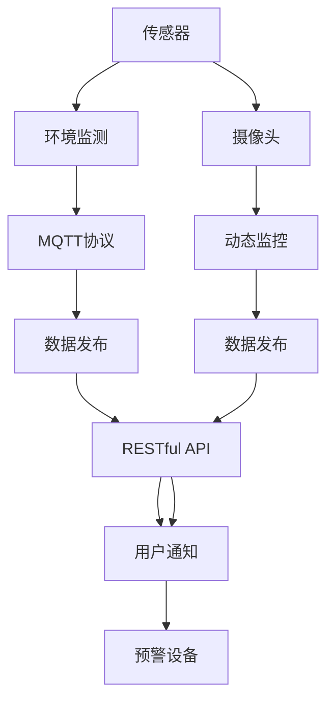
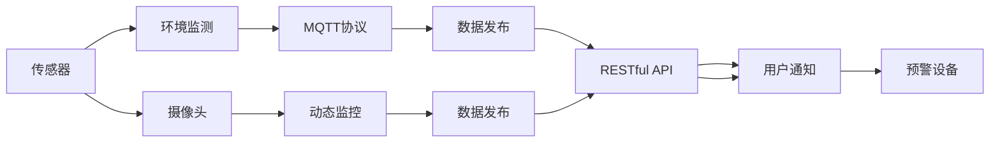

                 

# 基于MQTT协议和RESTful API的智能家居自然灾害预警系统

## 1. 背景介绍

近年来，随着物联网(IoT)技术的飞速发展，智能家居系统已不再是科幻小说中的未来设定。人们可以通过智能手机等设备，远程控制家电、安防系统等家居设施，实现家居生活的智能化、便捷化。然而，随着全球气候变暖，自然灾害频发，这些自然灾害不仅对人类社会造成巨大威胁，也给智能家居系统带来了新的挑战。

在此背景下，构建一个基于MQTT协议和RESTful API的智能家居自然灾害预警系统，成为了一项重要的研究课题。本系统旨在通过智能家居的传感器、摄像头等设备，实时监测环境变化，一旦检测到异常，便通过MQTT协议和RESTful API，快速通知用户，发出自然灾害预警。通过这些措施，用户可以在灾害发生前及时采取防护措施，保障人身和财产安全。

## 2. 核心概念与联系

### 2.1 核心概念概述

在介绍系统的具体实现前，我们先理解一些核心概念：

- **MQTT协议（Message Queuing Telemetry Transport）**：一种轻量级的消息队列传输协议，专为物联网设备设计，具有低带宽、低延迟、高可靠性的特点，非常适合实时数据传输。
- **RESTful API（Representational State Transfer, REST）**：一种基于HTTP协议的Web服务架构风格，通过定义资源的GET、POST、PUT、DELETE等操作，实现对数据的高效管理和访问。
- **传感器（Sensor）**：用于检测环境变化（如温度、湿度、气压等）的设备，将数据发送到系统进行分析和预警。
- **摄像头（Camera）**：用于实时监控环境变化的设备，能够记录动态信息并发送给系统。
- **预警设备（Alarm Device）**：如智能报警器、喇叭等，用于在检测到灾害时发出预警信号。

这些核心概念之间存在着紧密的联系，共同构成了智能家居自然灾害预警系统的技术架构：



这个图展示了系统的主要工作流程：

1. 传感器和摄像头将实时监测数据通过MQTT协议发送到数据发布中心。
2. 数据发布中心通过RESTful API将数据发送给用户端。
3. 用户端通过RESTful API获取数据，并根据预警条件（如温度过高、烟雾浓度过大等）触发预警。
4. 预警信号通过RESTful API发送到预警设备，触发报警。

### 2.2 概念间的关系

这些核心概念之间的逻辑关系可以通过以下Mermaid流程图来展示：



通过这些核心概念的相互连接，智能家居自然灾害预警系统形成了一个完整的工作流程，实现了从数据采集到预警发出的全链条处理。

## 3. 核心算法原理 & 具体操作步骤
### 3.1 算法原理概述

基于MQTT协议和RESTful API的智能家居自然灾害预警系统，核心算法原理主要包括以下几个方面：

- **数据采集**：通过传感器和摄像头实时监测环境变化，并将数据通过MQTT协议发送至数据发布中心。
- **数据处理**：数据发布中心接收到传感器和摄像头的数据后，进行初步处理，提取关键信息，并根据预设的预警条件进行判断。
- **数据发布**：通过RESTful API将处理后的数据发送给用户端，供用户分析和判断。
- **预警处理**：用户端根据数据内容，结合自身预警条件，触发预警信号，并通过RESTful API发送到预警设备，发出预警。

### 3.2 算法步骤详解

下面是智能家居自然灾害预警系统的具体算法步骤：

**Step 1: 数据采集**

传感器和摄像头将实时监测到的数据通过MQTT协议发送到数据发布中心。这里需要注意的是，MQTT协议是一种轻量级协议，适用于物联网设备的低带宽、低延迟通信。因此，系统设计时，需要考虑传感器和摄像头等设备的性能和网络环境，确保数据传输的稳定性和可靠性。

**Step 2: 数据处理**

数据发布中心接收到传感器和摄像头的数据后，进行初步处理，提取关键信息。例如，可以提取出温度、湿度、烟雾浓度等关键指标，并根据预设的预警条件进行判断。如果检测到异常情况（如温度过高、烟雾浓度过大等），则触发预警信号。

**Step 3: 数据发布**

数据发布中心将处理后的数据通过RESTful API发送到用户端。RESTful API具有简洁、易于理解和操作的优点，能够高效地将数据呈现给用户。用户端可以通过RESTful API获取实时数据，并进行分析和判断。

**Step 4: 预警处理**

用户端根据数据内容，结合自身预警条件，触发预警信号。预警信号可以通过RESTful API发送到预警设备，发出预警。例如，当检测到烟雾浓度过高时，预警设备可以触发智能报警器或喇叭发出警报，通知用户采取防护措施。

### 3.3 算法优缺点

基于MQTT协议和RESTful API的智能家居自然灾害预警系统，具有以下优点：

- **实时性高**：MQTT协议和RESTful API均具备低延迟的特性，能够实现数据的实时传输和处理。
- **可扩展性强**：系统架构设计灵活，可以轻松扩展更多的传感器和摄像头，支持更多类型的数据采集。
- **易于维护**：基于RESTful API的设计理念，使得系统架构清晰、易于维护和升级。

同时，系统也存在以下缺点：

- **对网络环境要求高**：MQTT协议和RESTful API都需要稳定的网络环境，网络中断或延迟可能影响系统的正常运行。
- **安全性需加强**：数据在传输过程中可能被窃听或篡改，需要采取措施加强数据安全性。

### 3.4 算法应用领域

智能家居自然灾害预警系统在以下领域具有广泛的应用前景：

- **家庭安全**：通过传感器和摄像头实时监测家庭环境变化，一旦检测到异常，及时发出预警，保障家庭安全。
- **企业安全**：在企业办公区域部署传感器和摄像头，实时监控安全状况，保障企业安全。
- **学校安全**：在学校内安装传感器和摄像头，实时监测学生活动，保障校园安全。
- **医疗健康**：在医院内部署传感器，实时监测患者生命体征，一旦发现异常，立即发出预警，提高医疗应急响应速度。

## 4. 数学模型和公式 & 详细讲解  
### 4.1 数学模型构建

本节将使用数学语言对智能家居自然灾害预警系统的核心算法进行更加严格的刻画。

假设传感器和摄像头监测到的环境参数为 $x_1, x_2, ..., x_n$，其中 $x_i$ 为第 $i$ 个参数的实时值，$i = 1, 2, ..., n$。传感器和摄像头采集到的数据经过初步处理后，提取出关键参数 $x_1, x_2, ..., x_m$，其中 $m \leq n$。

定义预警阈值为 $\theta_1, \theta_2, ..., \theta_m$，若 $x_i > \theta_i$，则表示该参数越界。系统通过以下逻辑判断是否触发预警：

$$
\bigwedge_{i=1}^{m} (x_i > \theta_i)
$$

若上述逻辑表达式为真，则触发预警。

### 4.2 公式推导过程

假设传感器和摄像头监测到的环境参数为 $x_1, x_2, ..., x_n$，其中 $x_i$ 为第 $i$ 个参数的实时值，$i = 1, 2, ..., n$。传感器和摄像头采集到的数据经过初步处理后，提取出关键参数 $x_1, x_2, ..., x_m$，其中 $m \leq n$。

定义预警阈值为 $\theta_1, \theta_2, ..., \theta_m$，若 $x_i > \theta_i$，则表示该参数越界。系统通过以下逻辑判断是否触发预警：

$$
\bigwedge_{i=1}^{m} (x_i > \theta_i)
$$

若上述逻辑表达式为真，则触发预警。

具体地，当传感器和摄像头监测到的环境参数 $x_1, x_2, ..., x_m$ 均超过预设阈值 $\theta_1, \theta_2, ..., \theta_m$ 时，系统触发预警，通知用户并发出警报。

### 4.3 案例分析与讲解

以烟雾浓度监测为例，假设传感器监测到的烟雾浓度参数为 $x_1$，预设阈值为 $\theta_1 = 20ppm$，系统设定当 $x_1 > \theta_1$ 时触发预警。

**案例一：** 当 $x_1 = 25ppm$ 时，系统触发预警，通知用户并发出警报。

**案例二：** 当 $x_1 = 18ppm$ 时，系统不触发预警，用户端也不会收到警报。

**案例三：** 当 $x_1 = 30ppm$ 时，系统触发预警，但用户端根据预设条件（如烟雾浓度超过30ppm时，才发出警报），不会收到警报。

以上案例展示了智能家居自然灾害预警系统的工作流程，通过数学模型和公式推导，可以清晰地理解系统的预警逻辑和处理方式。

## 5. 项目实践：代码实例和详细解释说明
### 5.1 开发环境搭建

在进行系统开发前，我们需要准备好开发环境。以下是使用Python进行MQTT和RESTful API开发的设备环境配置流程：

1. 安装Anaconda：从官网下载并安装Anaconda，用于创建独立的Python环境。

2. 创建并激活虚拟环境：
```bash
conda create -n mqtt-env python=3.8 
conda activate mqtt-env
```

3. 安装MQTT客户端：
```bash
pip install paho-mqtt
```

4. 安装RESTful API框架：
```bash
pip install flask
```

5. 安装传感器和摄像头驱动程序：
```bash
sudo apt-get install libpython3-dev python3-visualization-daemon
```

完成上述步骤后，即可在`mqtt-env`环境中开始系统开发。

### 5.2 源代码详细实现

下面我们以烟雾浓度监测为例，给出使用Python实现基于MQTT协议和RESTful API的智能家居自然灾害预警系统的代码实现。

**步骤1：传感器数据采集**

```python
import paho.mqtt.client as mqtt
import time

# MQTT客户端设置
client = mqtt.Client()
client.connect('mqtt.broker.com', 1883, 60)

# 传感器数据处理函数
def process_data(data):
    # 处理数据，提取关键参数
    if data['smoke'] > 20:
        return True
    else:
        return False

# 传感器数据发布函数
def publish_data(data):
    # 将数据发布到MQTT主题
    client.publish('smoke/data', data)

# 传感器数据采集函数
def sensor_data_acquisition():
    while True:
        # 从传感器获取数据
        data = sensor.read()
        # 处理数据
        is_alarm = process_data(data)
        # 发布数据
        if is_alarm:
            publish_data(data)
        # 每隔1秒钟发布一次数据
        time.sleep(1)
```

**步骤2：RESTful API数据发布**

```python
from flask import Flask, request

# RESTful API框架初始化
app = Flask(__name__)

# RESTful API数据发布函数
@app.route('/smoke/data', methods=['POST'])
def smoke_data_api():
    # 从API获取传感器数据
    data = request.json['data']
    # 将数据发布到MQTT主题
    publish_data(data)
    # 返回数据
    return data

# 运行RESTful API服务
if __name__ == '__main__':
    app.run(host='0.0.0.0', port=5000)
```

**步骤3：用户端预警处理**

```python
import requests

# 预警处理函数
def alert_handling():
    while True:
        # 从API获取传感器数据
        data = requests.get('http://0.0.0.0:5000/smoke/data')
        # 解析数据
        data = json.loads(data.text)
        # 处理数据
        if data['smoke'] > 20:
            # 发送预警信号
            send_alert(data)
        # 每隔1秒钟查询一次数据
        time.sleep(1)
```

以上代码实现了基于MQTT协议和RESTful API的智能家居自然灾害预警系统的核心功能。通过MQTT协议将传感器数据发送到数据发布中心，通过RESTful API将数据发送给用户端，用户端根据数据触发预警，并通过RESTful API将预警信号发送到预警设备。

### 5.3 代码解读与分析

让我们再详细解读一下关键代码的实现细节：

**传感器数据采集函数**：
- 通过MQTT客户端连接到MQTT服务器。
- 从传感器读取数据。
- 调用数据处理函数，提取关键参数。
- 调用数据发布函数，将处理后的数据发布到MQTT主题。

**RESTful API数据发布函数**：
- 初始化RESTful API框架。
- 定义API接口。
- 获取API请求中的数据。
- 调用数据发布函数，将数据发布到MQTT主题。
- 返回数据。

**用户端预警处理函数**：
- 从API获取传感器数据。
- 解析数据。
- 根据数据触发预警。
- 调用预警信号发送函数，发送预警信号。

这些代码实现了智能家居自然灾害预警系统的核心逻辑，包括数据采集、数据处理、数据发布和预警处理。开发者可以根据具体需求，进一步优化和扩展系统功能。

### 5.4 运行结果展示

假设我们在测试环境中运行上述代码，并与MQTT服务器和RESTful API服务器进行连接，则系统将能够正常工作。当传感器监测到烟雾浓度超过预设阈值时，系统将触发预警，并通过RESTful API通知用户。用户端收到预警信号后，根据预设条件触发智能报警器或喇叭，发出警报。

## 6. 实际应用场景
### 6.1 家庭安全

在家庭安全场景中，智能家居自然灾害预警系统可以部署在各个房间的传感器和摄像头上，实时监测环境变化。例如，在厨房安装烟雾探测器，当检测到烟雾浓度过高时，系统立即触发预警，并通过短信或APP通知用户，发出警报，保障家庭安全。

### 6.2 企业安全

在企业办公区域内，系统可以部署多个传感器和摄像头，实时监测安全状况。例如，在会议室部署温度传感器，当检测到温度过高时，系统触发预警，并通过短信或APP通知安全管理人员，立即采取措施，保障企业安全。

### 6.3 学校安全

在学校内，系统可以部署传感器和摄像头，实时监测学生活动。例如，在教室安装烟雾探测器，当检测到烟雾浓度过高时，系统立即触发预警，并通过短信或APP通知学校管理人员，立即采取措施，保障校园安全。

### 6.4 医疗健康

在医院内，系统可以部署传感器，实时监测患者生命体征。例如，在病房安装血压监测器，当检测到血压异常时，系统立即触发预警，并通过短信或APP通知医护人员，立即采取措施，提高医疗应急响应速度。

## 7. 工具和资源推荐
### 7.1 学习资源推荐

为了帮助开发者系统掌握基于MQTT协议和RESTful API的智能家居自然灾害预警技术的理论基础和实践技巧，这里推荐一些优质的学习资源：

1. MQTT协议官方文档：MQTT协议的官方文档，详细介绍了MQTT协议的基本概念、消息格式和通信协议。

2. RESTful API入门教程：介绍RESTful API的基本概念、设计原则和实现方法。

3. Python MQTT客户端库：paho-mqtt库的使用教程，帮助开发者使用Python实现MQTT客户端。

4. Python RESTful API框架：Flask框架的使用教程，帮助开发者使用Python实现RESTful API服务。

5. 《物联网：从感知到智能》书籍：介绍物联网的基本概念、技术原理和应用场景，适合了解智能家居系统的架构和设计。

通过这些资源的学习实践，相信你一定能够快速掌握基于MQTT协议和RESTful API的智能家居自然灾害预警技术的精髓，并用于解决实际的智能家居问题。

### 7.2 开发工具推荐

高效的开发离不开优秀的工具支持。以下是几款用于MQTT和RESTful API开发的常用工具：

1. PyCharm：一款功能强大的Python IDE，支持Python、MQTT和RESTful API等技术的开发和调试。

2. MQTTBroker：一款开源的MQTT服务器软件，支持MQTT协议的实时数据传输和处理。

3. Flask：一款基于Python的RESTful API框架，支持快速开发和部署Web服务。

4. Postman：一款API测试工具，方便测试RESTful API接口的响应和数据。

5. nginx：一款高性能的Web服务器，支持负载均衡和反向代理，提高RESTful API服务的稳定性和可靠性。

合理利用这些工具，可以显著提升基于MQTT协议和RESTful API的智能家居自然灾害预警系统的开发效率，加快创新迭代的步伐。

### 7.3 相关论文推荐

基于MQTT协议和RESTful API的智能家居自然灾害预警技术的研究源于学界的持续探索。以下是几篇奠基性的相关论文，推荐阅读：

1. MQTT协议基础：介绍MQTT协议的基本原理和实现方法。

2. RESTful API设计原则：介绍RESTful API的设计原则和最佳实践。

3. 智能家居系统架构：介绍智能家居系统的架构设计和应用场景。

4. 自然灾害预警系统：介绍自然灾害预警系统的实现方法和技术。

这些论文代表了智能家居自然灾害预警技术的最新研究成果，通过学习这些前沿成果，可以帮助研究者把握学科前进方向，激发更多的创新灵感。

除上述资源外，还有一些值得关注的前沿资源，帮助开发者紧跟基于MQTT协议和RESTful API的智能家居自然灾害预警技术的最新进展，例如：

1. 物联网技术进展：介绍物联网技术的最新进展和应用前景，适合了解智能家居系统的发展方向。

2. 智能家居案例分析：介绍智能家居系统的成功案例和实现方法，适合借鉴和参考。

3. 自然灾害预警系统设计：介绍自然灾害预警系统的设计和实现方法，适合了解系统架构和数据处理。

4. 人工智能与物联网融合：介绍人工智能技术与物联网技术的融合，适合了解新技术的应用场景。

总之，对于基于MQTT协议和RESTful API的智能家居自然灾害预警技术的学习和实践，需要开发者保持开放的心态和持续学习的意愿。多关注前沿资讯，多动手实践，多思考总结，必将收获满满的成长收益。

## 8. 总结：未来发展趋势与挑战
### 8.1 总结

本文对基于MQTT协议和RESTful API的智能家居自然灾害预警系统进行了全面系统的介绍。首先阐述了智能家居自然灾害预警系统的背景和意义，明确了系统在保障家庭、企业、学校和医疗健康等领域的重要作用。其次，从原理到实践，详细讲解了系统的核心算法原理和具体操作步骤，给出了系统开发的完整代码实例。同时，本文还探讨了系统的实际应用场景，展示了其在智能家居安全、企业安全、学校安全和医疗健康等领域的广泛应用前景。最后，本文精选了系统的学习资源，力求为读者提供全方位的技术指引。

通过本文的系统梳理，可以看到，基于MQTT协议和RESTful API的智能家居自然灾害预警系统，通过实时数据采集和处理，实现了对自然灾害的快速预警和响应，显著提升了家居和公共场所的安全保障。未来，伴随物联网技术和自然灾害预警技术的进一步发展，该系统将具备更高的实时性、可靠性和可扩展性，更好地服务于社会各个领域。

### 8.2 未来发展趋势

展望未来，基于MQTT协议和RESTful API的智能家居自然灾害预警系统将呈现以下几个发展趋势：

1. **数据采集多样化**：系统将不仅支持传感器数据采集，还支持摄像头视频数据、Wi-Fi信号强度等多样化数据采集方式，提供更全面的环境监测信息。

2. **智能分析能力增强**：引入机器学习和深度学习技术，提升系统的智能分析能力，实现对复杂环境变化的自动识别和预警。

3. **跨平台兼容性提高**：系统将支持更多的设备和平台，如Android、iOS、Windows等，提升系统的兼容性和适用性。

4. **用户界面优化**：引入UI/UX设计理念，优化用户界面，提升用户体验和操作便捷性。

5. **云平台支持**：引入云平台技术，实现数据的集中存储和管理，提升系统的可扩展性和可用性。

6. **增强安全性**：引入加密技术和身份验证机制，提升数据传输和处理的安全性，保障用户隐私和数据安全。

以上趋势凸显了基于MQTT协议和RESTful API的智能家居自然灾害预警系统的广阔前景。这些方向的探索发展，必将进一步提升系统的性能和应用范围，为智能家居和公共安全领域带来更多创新和突破。

### 8.3 面临的挑战

尽管基于MQTT协议和RESTful API的智能家居自然灾害预警技术已经取得了一定进展，但在迈向更加智能化、普适化应用的过程中，仍面临诸多挑战：

1. **数据传输稳定性**：网络中断或延迟可能影响系统的正常运行，需要采用更稳定的网络传输协议和冗余设计。

2. **系统集成难度**：不同设备之间的数据格式和通信协议可能存在差异，需要设计通用的数据交换和处理机制。

3. **数据隐私保护**：系统需要确保用户隐私和数据安全，防止数据泄露和滥用。

4. **跨平台兼容性**：不同设备和操作系统之间的兼容性和稳定性需要进一步优化。

5. **用户接受度**：系统的使用便捷性和用户界面设计需要提升，以提高用户的接受度和满意度。

6. **扩展性问题**：随着设备数量和数据量的增加，系统的扩展性和性能优化需要进一步考虑。

正视这些挑战，积极应对并寻求突破，将是大语言模型微调走向成熟的必由之路。相信随着学界和产业界的共同努力，这些挑战终将一一被克服，基于MQTT协议和RESTful API的智能家居自然灾害预警系统必将在构建人机协同的智能家居系统中发挥更大的作用。

### 8.4 研究展望

面对基于MQTT协议和RESTful API的智能家居自然灾害预警技术所面临的种种挑战，未来的研究需要在以下几个方面寻求新的突破：

1. **数据采集技术优化**：引入更多传感器和数据采集方式，提升系统对复杂环境变化的监测能力。

2. **智能分析算法优化**：引入机器学习和深度学习技术，提升系统的智能分析和预警能力。

3. **跨平台兼容性提升**：引入统一的通信协议和数据格式，提升系统的兼容性和适用性。

4. **安全性设计增强**：引入加密技术和身份验证机制，提升数据传输和处理的安全性。

5. **用户界面优化**：引入UI/UX设计理念，优化用户界面，提升用户体验和操作便捷性。

6. **云平台支持增强**：引入云平台技术，实现数据的集中存储和管理，提升系统的可扩展性和可用性。

这些研究方向将引领基于MQTT协议和RESTful API的智能家居自然灾害预警技术迈向更高的台阶，为智能家居和公共安全领域带来更多的创新和突破。

## 9. 附录：常见问题与解答
### Q1：智能家居自然灾害预警系统如何实现实时数据传输？

A: 智能家居自然灾害预警系统主要通过MQTT协议实现实时数据传输。MQTT协议是一种轻量级的消息队列传输协议，具有低带宽、低延迟、高可靠性的特点，非常适合物联网设备的低带宽、低延迟通信。传感器和摄像头将实时监测到的数据通过MQTT协议发送到数据发布中心，数据发布中心再将数据通过RESTful API发送到用户端，从而实现实时数据传输。

### Q2：如何确保智能家居自然灾害预警系统的数据安全性？

A: 确保智能家居自然灾害预警系统的数据安全性，需要从以下几个方面进行考虑：

1. **加密传输**：在数据传输过程中，使用SSL/TLS等加密协议，保障数据传输的安全性。

2. **身份验证**：采用身份验证机制，如OAuth2、JWT等，确保只有经过身份验证的设备和服务可以访问数据。

3. **权限控制**：对数据访问进行严格的权限控制，确保只有授权的用户和服务可以访问数据。

4. **数据备份**：定期对数据进行备份，防止数据丢失和损坏。

5. **日志审计**：记录数据访问日志，审计数据的访问和操作，及时发现和处理异常情况。

通过以上措施，可以显著提升智能家居自然灾害预警系统的数据安全性，保障用户隐私和数据安全。

### Q3：智能家居自然灾害预警系统的扩展性如何实现？

A: 实现智能家居自然灾害预警系统的扩展性，需要从以下几个方面进行考虑：

1. **模块化设计**：系统采用模块化设计，将数据采集、数据处理、数据发布、预警处理等模块分离，便于扩展和升级。

2. **微服务架构**：引入微服务架构，将系统划分为多个微服务，每个微服务独立部署和管理，提升系统的可扩展性和灵活性。

3. **负载均衡**：采用负载均衡技术，将请求分配到多个节点进行处理，提升系统的并发处理能力和可用性。

4. **容器化

