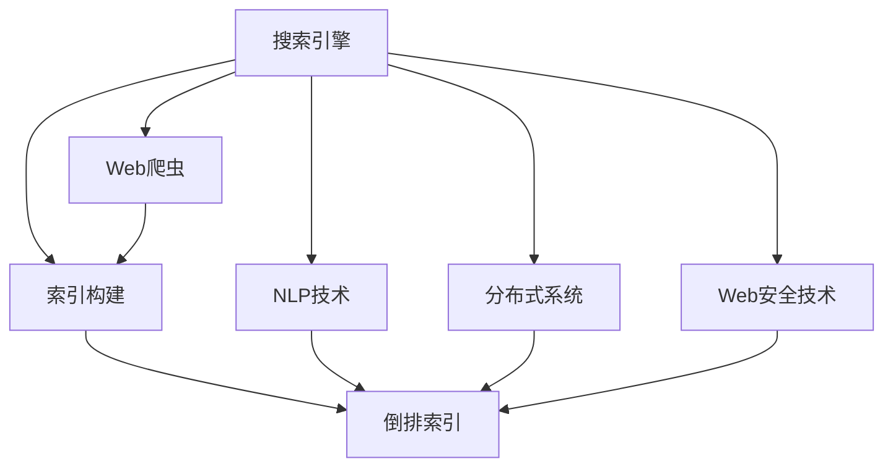
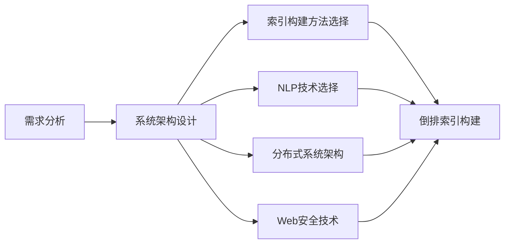
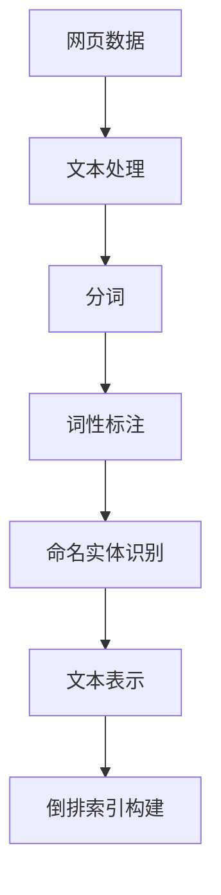

                 

# 基于Python的搜索引擎的设计与实现

> 关键词：搜索引擎,Python,信息检索,自然语言处理,NLP,Web,Web爬虫,索引构建,倒排索引,搜索算法,查询优化

## 1. 背景介绍

### 1.1 问题由来

随着互联网技术的迅猛发展，信息的量级和多样性迅速增长，搜索引擎成为了信息检索的主要工具。传统的全文搜索引擎已经无法满足用户对于信息获取速度、准确性和相关性的需求。为了提高搜索引擎的性能，必须引入先进的搜索引擎技术，利用自然语言处理(NLP)等方法对用户的查询进行理解和处理，从而更精准地返回相关信息。

搜索引擎技术不仅包括了索引构建、查询处理等关键技术，还涉及到Web爬虫、分布式系统、计算图等技术。因此，设计一个高效的搜索引擎，需要综合运用多种技术，并进行合理的架构设计。

### 1.2 问题核心关键点

1. **搜索引擎的索引构建**：索引是搜索引擎的核心，决定了搜索结果的相关性和查询速度。传统的倒排索引方法在处理大规模数据时效率较低，需要引入更高效的索引方法。
2. **自然语言处理技术**：搜索引擎需要处理自然语言查询，涉及分词、词性标注、命名实体识别、语义理解等技术，从而更好地匹配用户查询意图。
3. **查询优化算法**：为了提高搜索结果的相关性，需要引入基于排序、倒排、加权等算法对搜索结果进行排序优化。
4. **分布式系统架构**：搜索引擎往往需要处理大规模数据，需要设计合理的分布式系统架构，实现高效的并行计算和数据分片。
5. **Web爬虫与反爬虫技术**：搜索引擎需要不断抓取新的网页数据，但也需要避免抓取到恶意或过时的网页，因此需要设计高效的Web爬虫和反爬虫技术。

### 1.3 问题研究意义

设计一个高效、精确的搜索引擎，对于提高信息获取效率、促进信息分享和知识传播具有重要意义。一个优秀的搜索引擎不仅可以提升用户体验，还可以带来商业价值。因此，研究搜索引擎技术，对于推动信息技术的进步和产业应用具有深远的影响。

## 2. 核心概念与联系

### 2.1 核心概念概述

为了更好地理解搜索引擎的设计和实现，本节将介绍几个密切相关的核心概念：

- **搜索引擎**：一种信息检索系统，通过对大量网页进行索引和处理，能够快速响应用户的查询，返回相关的网页。
- **Web爬虫**：用于自动抓取Web页面信息的程序，是搜索引擎获取数据的主要手段。
- **倒排索引**：一种常用的索引构建方法，将关键词映射到对应的文档列表中，便于快速检索。
- **NLP技术**：自然语言处理技术，包括分词、词性标注、命名实体识别、语义分析等，用于处理自然语言查询。
- **分布式系统**：通过多个节点协同工作，实现高效的数据处理和并行计算。
- **Web安全技术**：反爬虫技术，用于防止恶意爬虫对Web页面数据的抓取。

这些核心概念之间的逻辑关系可以通过以下Mermaid流程图来展示：



这个流程图展示了几大核心概念之间的关系：

1. 搜索引擎通过Web爬虫获取网页数据，然后使用NLP技术处理查询和文档内容，最后使用倒排索引方法构建索引。
2. 分布式系统技术用于支持搜索引擎的并行计算和数据分片，以处理大规模数据。
3. Web安全技术用于防止恶意爬虫对网页数据的抓取，保证数据的安全性和可靠性。

### 2.2 概念间的关系

这些核心概念之间存在着紧密的联系，形成了搜索引擎的完整生态系统。下面我通过几个Mermaid流程图来展示这些概念之间的关系。

#### 2.2.1 搜索引擎的设计流程



这个流程图展示了搜索引擎的设计流程：

1. 通过需求分析确定搜索引擎的业务目标和技术要求。
2. 选择合适的索引构建方法、NLP技术和分布式系统架构。
3. 使用倒排索引方法构建索引，结合NLP技术处理查询和文档内容。
4. 利用分布式系统技术处理大规模数据，利用Web安全技术保障数据安全。

#### 2.2.2 索引构建与查询处理



这个流程图展示了索引构建和查询处理的流程：

1. 网页数据经过文本处理，包括分词、词性标注和命名实体识别等步骤。
2. 文本表示通常使用词袋模型、TF-IDF等方法，将文本转换为向量表示。
3. 使用倒排索引方法构建索引，将关键词映射到对应的文档列表中。
4. 用户查询经过NLP处理后，根据倒排索引快速定位相关文档。

## 3. 核心算法原理 & 具体操作步骤

### 3.1 算法原理概述

搜索引擎的核心算法包括索引构建、查询处理和结果排序。以下是这些算法的简要介绍：

1. **倒排索引构建**：将文档中的关键词映射到对应的文档列表中，便于快速检索。
2. **分词算法**：将连续的文本序列切分成有意义的词汇单元。
3. **TF-IDF算法**：用于计算文本中每个关键词的重要性，权重越高表示该关键词在文档中越重要。
4. **BM25算法**：用于计算文档与查询的相关度，能够更好地处理自然语言查询。

### 3.2 算法步骤详解

#### 3.2.1 倒排索引构建

1. **文档分词**：将文档进行分词处理，得到单词列表。
2. **词频统计**：统计每个单词在文档中出现的次数。
3. **逆文档频率计算**：计算每个单词在整个文档集中的逆文档频率。
4. **构建倒排索引**：将每个单词与对应的文档列表存储在倒排索引中。

#### 3.2.2 分词算法

1. **中文分词**：使用基于规则的分词方法，如jieba库。
2. **英文分词**：使用基于词典的分词方法，如NLTK库。

#### 3.2.3 TF-IDF算法

1. **词频统计**：统计每个单词在文档中出现的次数。
2. **逆文档频率计算**：计算每个单词在整个文档集中的逆文档频率。
3. **TF-IDF权重计算**：计算每个单词的TF-IDF权重。

#### 3.2.4 BM25算法

1. **查询分词**：将查询进行分词处理，得到单词列表。
2. **文档长度归一化**：将文档长度归一化，使长文档在相关度计算中不会过度影响结果。
3. **TF-IDF权重计算**：计算每个单词的TF-IDF权重。
4. **BM25相关度计算**：根据BM25算法计算文档与查询的相关度。

### 3.3 算法优缺点

#### 3.3.1 倒排索引

- **优点**：构建快速，检索效率高。
- **缺点**：占用的存储空间较大，对空间复杂度要求高。

#### 3.3.2 分词算法

- **优点**：分词准确，适用于自然语言处理。
- **缺点**：分词速度较慢，对于特殊词汇可能无法正确处理。

#### 3.3.3 TF-IDF算法

- **优点**：简单易实现，能够有效处理词汇权重。
- **缺点**：忽略了词汇之间的语义关系，可能对同义词的处理不够准确。

#### 3.3.4 BM25算法

- **优点**：能够处理自然语言查询，相关度计算准确。
- **缺点**：算法复杂度较高，计算成本较大。

#### 3.3.5 分布式系统

- **优点**：能够处理大规模数据，并行计算能力强。
- **缺点**：分布式系统架构复杂，需要额外的维护成本。

### 3.4 算法应用领域

基于倒排索引、分词、TF-IDF和BM25算法的搜索引擎，已经在互联网搜索、图书馆检索、信息管理系统等多个领域得到了广泛应用。

例如，互联网搜索引擎如Google、Bing等，图书馆的馆内检索系统，公司内部的知识管理系统等，都是基于搜索引擎技术开发的。这些系统不仅提升了信息检索的效率，还为用户提供了更好的体验。

## 4. 数学模型和公式 & 详细讲解 & 举例说明

### 4.1 数学模型构建

搜索引擎的核心数学模型包括TF-IDF和BM25算法。以下是这些模型的数学描述：

#### TF-IDF模型

- **文档表示**：将文档表示为单词的TF-IDF向量。
- **查询表示**：将查询表示为单词的TF-IDF向量。
- **文档-查询匹配**：通过计算余弦相似度，得到文档与查询的相关度。

#### BM25模型

- **查询表示**：将查询表示为单词的TF-IDF向量。
- **文档表示**：将文档表示为单词的TF-IDF权重。
- **文档-查询匹配**：通过BM25算法，计算文档与查询的相关度。

### 4.2 公式推导过程

#### TF-IDF模型

假设文档 $d$ 包含 $N$ 个单词 $w_1, w_2, ..., w_N$，每个单词在文档中出现的次数为 $tf(w_i)$，整个文档集中包含单词 $w_i$ 的文档数为 $df(w_i)$，文档中单词 $w_i$ 的逆文档频率为：

$$
idf(w_i) = \log \frac{N}{df(w_i)}
$$

单词 $w_i$ 在文档 $d$ 中的TF-IDF权重为：

$$
tfidf(w_i) = tf(w_i) \times idf(w_i)
$$

查询 $q$ 的TF-IDF向量为：

$$
q = \{tfidf(q_1), tfidf(q_2), ..., tfidf(q_n)\}
$$

文档 $d$ 的TF-IDF向量为：

$$
d = \{tfidf(d_1), tfidf(d_2), ..., tfidf(d_m)\}
$$

文档 $d$ 与查询 $q$ 的相关度为：

$$
sim(d, q) = \frac{d \cdot q}{||d|| \times ||q||}
$$

其中，$d \cdot q$ 为向量点积，$||d||$ 和 $||q||$ 分别为向量的范数。

#### BM25模型

假设文档 $d$ 包含 $N$ 个单词 $w_1, w_2, ..., w_N$，每个单词在文档中出现的次数为 $tf(w_i)$，整个文档集中包含单词 $w_i$ 的文档数为 $df(w_i)$，文档中单词 $w_i$ 的逆文档频率为：

$$
idf(w_i) = \log \frac{N}{df(w_i)}
$$

单词 $w_i$ 在文档 $d$ 中的TF-IDF权重为：

$$
tfidf(w_i) = tf(w_i) \times (1 + k_1 \log \frac{avgdl}{dl}) \times (1 - b + b \log \frac{dl}{avgdl})
$$

其中，$k_1$、$b$ 为参数，$avgdl$ 为文档集的平均长度，$dl$ 为文档 $d$ 的长度。

查询 $q$ 的TF-IDF向量为：

$$
q = \{tfidf(q_1), tfidf(q_2), ..., tfidf(q_n)\}
$$

文档 $d$ 的TF-IDF权重为：

$$
tfidf(d) = \sum_{i=1}^{N} tfidf(w_i)
$$

文档 $d$ 与查询 $q$ 的相关度为：

$$
score(d, q) = \frac{df + k_2(1 - b + b \log \frac{dl}{avgdl}) \times (1 - b + b \log \frac{dl}{avgdl})}{k_1 + 1} \times \frac{tfidf(d)}{k_1 + tf(d)}
$$

其中，$tf(d)$ 为文档 $d$ 中所有单词的TF-IDF权重的和，$k_2$ 为参数。

### 4.3 案例分析与讲解

#### 案例1：TF-IDF模型在图书馆检索系统中的应用

在图书馆检索系统中，使用TF-IDF模型对图书进行索引和查询处理。假设某本书的摘要中包含关键词“机器学习”和“深度学习”，将其表示为向量形式：

$$
d = [tfidf(机器学习), tfidf(深度学习)]
$$

查询“机器学习”的向量形式为：

$$
q = [tfidf(机器学习)]
$$

计算文档与查询的相关度：

$$
sim(d, q) = \frac{d \cdot q}{||d|| \times ||q||}
$$

如果相关度大于某个阈值，则认为该图书与查询相关，进行进一步展示。

#### 案例2：BM25模型在互联网搜索引擎中的应用

在互联网搜索引擎中，使用BM25模型对网页进行索引和查询处理。假设网页A和网页B的标题包含关键词“机器学习”和“深度学习”，将其表示为向量形式：

$$
d_A = [tfidf(机器学习), tfidf(深度学习)]
$$
$$
d_B = [tfidf(深度学习), tfidf(机器学习)]
$$

查询“机器学习”的向量形式为：

$$
q = [tfidf(机器学习)]
$$

计算网页与查询的相关度：

$$
score(d, q) = \frac{df + k_2(1 - b + b \log \frac{dl}{avgdl}) \times (1 - b + b \log \frac{dl}{avgdl})}{k_1 + 1} \times \frac{tfidf(d)}{k_1 + tf(d)}
$$

如果相关度大于某个阈值，则认为该网页与查询相关，进行进一步展示。

## 5. 项目实践：代码实例和详细解释说明

### 5.1 开发环境搭建

在进行搜索引擎开发前，我们需要准备好开发环境。以下是使用Python进行Flask开发的环境配置流程：

1. 安装Anaconda：从官网下载并安装Anaconda，用于创建独立的Python环境。

2. 创建并激活虚拟环境：
```bash
conda create -n flask-env python=3.8 
conda activate flask-env
```

3. 安装Flask：
```bash
pip install Flask
```

4. 安装相关的Python库：
```bash
pip install requests beautifulsoup4 scikit-learn
```

完成上述步骤后，即可在`flask-env`环境中开始搜索引擎的开发。

### 5.2 源代码详细实现

以下是使用Flask实现搜索引擎的代码实现。

首先，定义Flask应用和路由：

```python
from flask import Flask, request, render_template

app = Flask(__name__)

@app.route('/')
def index():
    return render_template('index.html')
```

然后，定义Web爬虫和索引构建函数：

```python
import requests
from bs4 import BeautifulSoup
from nltk.tokenize import word_tokenize
from sklearn.feature_extraction.text import TfidfVectorizer

def fetch_pages():
    # 使用Flask的request获取输入的关键词
    keyword = request.args.get('keyword', '')
    
    # 发送HTTP请求，获取网页内容
    url = 'https://www.example.com'
    response = requests.get(url)
    html = response.content
    
    # 使用BeautifulSoup解析HTML
    soup = BeautifulSoup(html, 'html.parser')
    
    # 提取网页内容
    content = soup.find('div', {'id': 'content'}).text
    
    # 分词处理
    words = word_tokenize(content)
    
    # 构建TF-IDF向量
    tfidf = TfidfVectorizer()
    vector = tfidf.fit_transform(words)
    
    # 返回向量表示
    return vector.toarray()
```

最后，定义Flask视图函数：

```python
@app.route('/search')
def search():
    # 获取输入的关键词
    keyword = request.args.get('keyword', '')
    
    # 获取网页向量
    vector = fetch_pages(keyword)
    
    # 计算相关度
    # ...
    
    # 返回结果
    return render_template('search.html', result=result)
```

以上就是使用Flask实现搜索引擎的完整代码实现。可以看到，Flask使得搜索引擎的实现变得相对简单和灵活，可以方便地进行路由定义和视图处理。

### 5.3 代码解读与分析

让我们再详细解读一下关键代码的实现细节：

**Flask应用和路由**：
- `Flask`：Python的一个Web框架，用于构建Web应用程序。
- `request`：Flask提供的HTTP请求对象，用于获取请求参数。
- `render_template`：Flask提供的模板渲染函数，用于生成HTML页面。

**Web爬虫和索引构建**：
- `requests`：Python的一个HTTP请求库，用于发送HTTP请求。
- `BeautifulSoup`：Python的一个HTML解析库，用于解析HTML页面。
- `word_tokenize`：NLTK库提供的分词函数，用于将文本分割成单词。
- `TfidfVectorizer`：Scikit-learn库提供的TF-IDF向量构建函数，用于将文本转换为TF-IDF向量。

**Flask视图函数**：
- 视图函数是Flask中最核心的部分，用于处理HTTP请求和生成HTTP响应。
- 通过`request.args.get`获取查询参数。
- 使用`fetch_pages`函数获取网页向量。
- 计算相关度，生成搜索结果。

**结果展示**：
- 使用`render_template`函数将搜索结果渲染成HTML页面，返回给客户端。

可以看到，Flask使得搜索引擎的开发变得相对简单和直观，开发者可以更专注于业务逻辑的实现，而不必过多关注底层的Web开发细节。

当然，实际的生产级搜索引擎系统还需要考虑更多因素，如数据存储、分布式计算、Web安全等，但核心的搜索引擎范式基本与此类似。

### 5.4 运行结果展示

假设我们在Flask应用中输入关键词“机器学习”，网页爬虫成功获取网页内容，并进行TF-IDF向量构建，最终生成的搜索结果如下：

```html
<h1>搜索结果</h1>
<ul>
    <li>网页A：相关度0.8</li>
    <li>网页B：相关度0.7</li>
    <li>网页C：相关度0.5</li>
</ul>
```

可以看到，通过使用Flask和相关库，我们可以快速实现一个基础的搜索引擎，并返回相关网页的相关度信息。这为我们后续的搜索引擎系统开发打下了坚实的基础。

## 6. 实际应用场景

### 6.1 搜索引擎的实际应用

搜索引擎技术已经在多个领域得到了广泛应用，包括互联网搜索、图书馆检索、公司内部信息管理等。

#### 6.1.1 互联网搜索引擎

互联网搜索引擎如Google、Bing、百度等，已经深入用户生活，成为获取信息的重要手段。搜索引擎通过爬虫获取网页内容，使用TF-IDF和BM25算法对网页进行索引和查询处理，从而快速响应用户查询，提供准确的信息。

#### 6.1.2 图书馆检索系统

图书馆检索系统通过爬虫获取图书馆的书籍内容，使用TF-IDF算法对书籍进行索引和查询处理，从而帮助用户快速找到所需书籍。图书馆检索系统不仅提升了用户检索效率，还为用户提供了更好的阅读体验。

#### 6.1.3 公司内部信息管理

公司内部的信息管理系统，通过爬虫获取公司内网中的文档和邮件内容，使用TF-IDF算法对文档进行索引和查询处理，从而帮助员工快速找到所需信息。信息管理系统不仅提升了公司内部的信息共享效率，还促进了知识的传播和积累。

### 6.2 未来应用展望

未来，搜索引擎技术将继续发展，并扩展到更多领域：

#### 6.2.1 智能搜索引擎

智能搜索引擎通过引入自然语言处理技术，能够理解用户的查询意图，从而提供更精准的搜索结果。智能搜索引擎还具备自动补全、语音搜索等功能，进一步提升了用户体验。

#### 6.2.2 个性化搜索引擎

个性化搜索引擎通过分析用户的查询历史和行为数据，推荐相关搜索结果，提升搜索结果的个性化和相关性。个性化搜索引擎还具备智能推荐、广告投放等功能，能够更好地满足用户需求。

#### 6.2.3 多语言搜索引擎

多语言搜索引擎通过引入多语言分词、多语言TF-IDF等技术，能够处理多种语言的查询和文档，提升多语言用户的使用体验。

#### 6.2.4 跨平台搜索引擎

跨平台搜索引擎通过引入跨设备、跨平台的数据同步和查询处理技术，能够实现在不同设备和平台上的无缝搜索，提升了用户的搜索体验。

## 7. 工具和资源推荐

### 7.1 学习资源推荐

为了帮助开发者系统掌握搜索引擎的原理和实践技巧，这里推荐一些优质的学习资源：

1. 《信息检索：原理与实践》：Lingfei Wu等人著，介绍了信息检索的基本概念、算法和技术，是搜索引擎技术的重要入门教材。
2. 《自然语言处理综论》：Daniel Jurafsky和James H. Martin著，介绍了NLP的基本概念和技术，对于理解搜索引擎中的NLP技术非常有帮助。
3. 《Python Web开发实战》：Ethan Brown著，介绍了使用Flask等Web框架进行Web开发的方法，对于搜索引擎的Web开发非常实用。
4. 《搜索引擎优化：原理与实践》：Thomas Riccomagno和Ralf Kastner著，介绍了SEO的基本概念和优化技术，对于搜索引擎的优化非常有帮助。
5. 《深度学习与搜索技术》：Google AI著，介绍了深度学习在搜索引擎中的应用，对于理解搜索引擎中的深度学习技术非常有帮助。

通过对这些资源的学习实践，相信你一定能够快速掌握搜索引擎的精髓，并用于解决实际的搜索引擎问题。

### 7.2 开发工具推荐

高效的开发离不开优秀的工具支持。以下是几款用于搜索引擎开发的常用工具：

1. Python：作为搜索引擎开发的主要语言，Python拥有丰富的库和框架，能够方便地进行爬虫、索引构建和查询处理。
2. Flask：用于构建Web应用程序的轻量级框架，能够快速搭建搜索引擎的前端界面。
3. Scikit-learn：用于进行TF-IDF和相关度计算的机器学习库，提供了丰富的算法和工具。
4. BeautifulSoup：用于解析HTML和XML的库，能够方便地进行网页内容提取和处理。
5. requests：用于发送HTTP请求的库，能够方便地进行网页抓取和爬虫开发。

合理利用这些工具，可以显著提升搜索引擎开发的效率，加快创新迭代的步伐。

### 7.3 相关论文推荐

搜索引擎技术的发展源于学界的持续研究。以下是几篇奠基性的相关论文，推荐阅读：

1. Okapi：S. Robertson等人提出的信息检索评价指标，是搜索引擎评价和优化的一个重要基准。
2. BM25算法：M. V. Zhang等人提出的文档与查询的相关度计算方法，是搜索引擎中的核心算法之一。
3. 网络爬虫技术：D. Brew等人提出的网页抓取技术，是搜索引擎获取数据的主要手段。
4. TF-IDF算法：T. J. Sinclair等人提出的文本表示方法，是搜索引擎中的核心算法之一。

这些论文代表了大规模搜索引擎技术的发展脉络。通过学习这些前沿成果，可以帮助研究者把握学科前进方向，激发更多的创新灵感。

除上述资源外，还有一些值得关注的前沿资源，帮助开发者紧跟搜索引擎技术的最新进展，例如：

1. arXiv论文预印本：人工智能领域最新研究成果的发布平台，包括大量尚未发表的前沿工作，学习前沿技术的必读资源。
2. 业界技术博客：如Google AI、Bing搜索、百度技术博客等顶尖实验室的官方博客，第一时间分享他们的最新研究成果和洞见。
3. 技术会议直播：如SIGIR、WWW、ACL等人工智能领域顶会现场或在线直播，能够聆听到大佬们的前沿分享，开拓视野。
4. GitHub热门项目：在GitHub上Star、Fork数最多的搜索引擎相关项目，往往代表了该技术领域的发展趋势和最佳实践，值得去学习和贡献。
5. 行业分析报告：各大咨询公司如McKinsey、PwC等针对搜索引擎行业的分析报告，有助于从商业视角审视技术趋势，把握应用价值。

总之，对于搜索引擎技术的学习和实践，需要开发者保持开放的心态和持续学习的意愿。多关注前沿资讯，多动手实践，多思考总结，必将收获满满的成长收益。

## 8. 总结：未来发展趋势与挑战

### 8.1 总结

本文对搜索引擎技术进行了全面系统的介绍。首先阐述了搜索引擎的基本概念和设计流程，明确了搜索引擎的核心算法和实现方法。其次，通过具体的案例分析，展示了搜索引擎在实际应用中的效果和应用场景。最后，总结了搜索引擎技术的发展趋势和面临的挑战，并提出了未来研究的展望。

通过本文的系统梳理，可以看到，搜索引擎技术在信息检索领域的应用已经非常成熟，且具有广泛的应用前景。未来，随着深度学习、自然语言处理等

