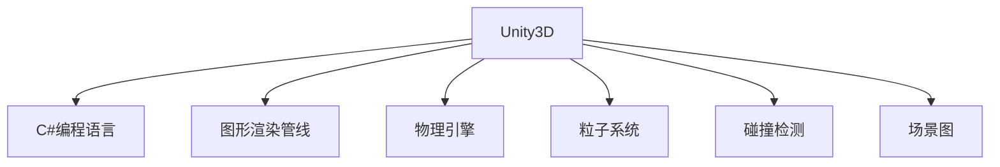
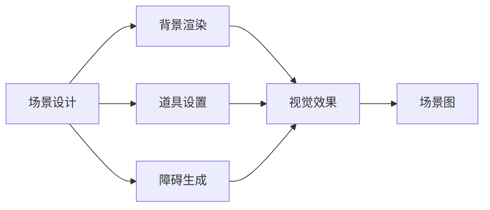
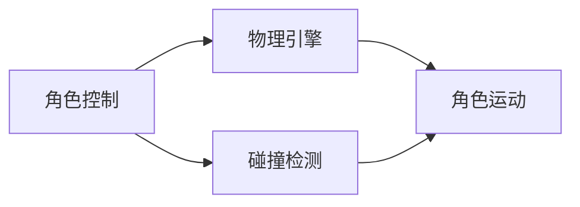

                 

# 基于Unity3D的跑酷游戏

## 1. 背景介绍

### 1.1 问题由来

跑酷游戏作为一种经典的平台游戏，因其简洁的玩法和刺激的体验，受到了全球玩家的喜爱。传统的跑酷游戏通常以固定场景和预设规则为基础，玩家需要通过跳跃、奔跑等动作克服各种障碍，完成关卡挑战。然而，随着游戏设计思路的不断创新，跑酷游戏已经从简单的跳跃动作，发展到包含复杂环境、多样化技能、多角色互动的综合游戏。

Unity3D作为一种强大的游戏引擎，提供了丰富的图形渲染和物理模拟功能，非常适合开发高品质的跑酷游戏。通过Unity3D的脚本语言，开发者可以实现各种交互效果，提升游戏体验。本文将详细讲解基于Unity3D的跑酷游戏的开发过程，包括场景构建、角色控制、碰撞检测、粒子效果等方面，以供广大游戏开发爱好者参考。

### 1.2 问题核心关键点

跑酷游戏的核心关键点包括：

- **场景设计**：包括背景、道具、障碍等元素的设定。
- **角色控制**：玩家角色的移动、跳跃、冲刺等操作。
- **物理引擎**：实现角色与环境之间的互动和碰撞检测。
- **粒子效果**：营造各种物理和视觉效果的粒子系统。
- **音效处理**：与游戏画面同步的音效设计。

本文将重点介绍Unity3D在跑酷游戏中的应用，结合实际项目案例，展示如何使用Unity3D引擎开发出高品质的跑酷游戏。

## 2. 核心概念与联系

### 2.1 核心概念概述

为更好地理解基于Unity3D的跑酷游戏开发过程，本节将介绍几个密切相关的核心概念：

- **Unity3D**：由Unity Technologies开发的游戏引擎，支持2D和3D游戏开发，拥有强大的图形渲染、物理模拟和动画系统。
- **C#编程语言**：Unity3D的官方脚本语言，结合Unity的可视化编辑器，开发游戏脚本非常方便。
- **图形渲染管线**：Unity3D的图形渲染系统，通过Shader和着色器编程实现丰富的视觉效果。
- **物理引擎**：Unity3D自带的物理引擎，用于模拟游戏中的各种物理效果。
- **粒子系统**：通过粒子系统，实现各种视觉特效，如爆炸、火焰、雨滴等。
- **碰撞检测**：用于检测角色与游戏场景中的各种元素之间的碰撞关系。
- **场景图**：游戏场景的层次结构，通过场景图实现不同层次的渲染和交互效果。

这些核心概念之间的逻辑关系可以通过以下Mermaid流程图来展示：



这个流程图展示了大语言模型微调过程中各个核心概念的关系和作用：

1. Unity3D引擎作为基础平台，提供强大的图形渲染和物理模拟功能。
2. C#语言作为开发工具，实现脚本编程，提升开发效率。
3. 图形渲染管线和粒子系统实现丰富的视觉效果。
4. 物理引擎模拟游戏元素间的互动和碰撞检测。
5. 场景图实现场景的层次结构，提升渲染和交互效率。

通过理解这些核心概念，我们可以更好地把握基于Unity3D的跑酷游戏开发的关键环节。

### 2.2 概念间的关系

这些核心概念之间存在着紧密的联系，形成了基于Unity3D跑酷游戏的完整生态系统。下面我通过几个Mermaid流程图来展示这些概念之间的关系。

#### 2.2.1 游戏场景的构建



这个流程图展示了游戏场景构建的基本流程。通过场景设计，定义背景、道具、障碍等元素。然后通过C#脚本来设置这些元素，并使用Unity3D的粒子系统、图形渲染管线等技术，实现丰富的视觉效果，最终构建出完整的场景图。

#### 2.2.2 角色控制和物理引擎的结合



这个流程图展示了角色控制和物理引擎的结合过程。通过C#脚本实现角色的移动、跳跃、冲刺等操作，并使用物理引擎模拟角色与场景之间的互动。通过碰撞检测，实现角色与障碍物之间的碰撞响应，确保游戏体验的真实感。

## 3. 核心算法原理 & 具体操作步骤
### 3.1 算法原理概述

基于Unity3D的跑酷游戏开发过程，本质上是一个以角色控制、物理模拟和场景渲染为中心的算法实现过程。其核心算法原理包括：

- **角色控制算法**：实现角色的移动、跳跃、冲刺等操作。
- **物理模拟算法**：模拟角色与场景元素之间的碰撞和运动。
- **图形渲染算法**：实现场景和角色的可视化渲染。

通过这些核心算法，可以实现一个完整的跑酷游戏体验。

### 3.2 算法步骤详解

基于Unity3D的跑酷游戏开发过程包括以下几个关键步骤：

**Step 1: 场景构建和设置**

1. **背景设置**：使用Unity3D的3D场景编辑器，设置背景场景和光照效果。
2. **道具和障碍设置**：使用Unity3D的Inspector面板，设置道具和障碍的位置、大小、颜色等属性。
3. **碰撞检测设置**：使用Unity3D的碰撞检测器，为道具和障碍添加碰撞体和触发器。

**Step 2: 角色控制实现**

1. **角色创建**：使用Unity3D的3D模型编辑器，创建角色的3D模型。
2. **动画设置**：为角色模型添加动画效果，如移动、跳跃、冲刺等。
3. **控制器实现**：通过C#脚本实现角色的控制器，处理玩家的输入（如键盘和鼠标），并控制角色的移动和跳跃。

**Step 3: 物理引擎和碰撞检测**

1. **物理引擎设置**：使用Unity3D的物理引擎，设置重力、碰撞响应、弹性等参数。
2. **碰撞检测实现**：使用Unity3D的碰撞检测器，实现角色与场景元素之间的碰撞检测。
3. **碰撞响应处理**：根据碰撞检测结果，处理角色与场景元素的碰撞响应，如角色落在地面、与障碍物碰撞等。

**Step 4: 图形渲染和粒子效果**

1. **图形渲染设置**：使用Unity3D的图形渲染管线，设置场景和角色的着色器和材质。
2. **粒子系统设置**：使用Unity3D的粒子系统，实现各种视觉效果，如爆炸、火焰、雨滴等。
3. **特效处理**：根据游戏逻辑，触发粒子和特效，增强游戏沉浸感。

**Step 5: 音效处理**

1. **音效添加**：使用Unity3D的音频系统，添加游戏中的背景音乐和音效。
2. **音效同步**：通过C#脚本实现音效的同步播放，增强游戏体验。

**Step 6: 调试和优化**

1. **代码调试**：使用Unity3D的调试工具，调试代码，查找和修复问题。
2. **性能优化**：通过性能分析工具，优化游戏性能，提升渲染和物理模拟效率。
3. **测试和部署**：在Unity3D编辑器中进行测试，并打包发布到多个平台，包括PC、手机、平板等。

### 3.3 算法优缺点

基于Unity3D的跑酷游戏开发方法具有以下优点：

1. **开发效率高**：Unity3D提供了丰富的工具和可视化编辑器，开发者可以迅速实现各种功能。
2. **性能表现好**：Unity3D引擎具有优化的图形渲染和物理模拟，能够实现高性能的游戏体验。
3. **跨平台支持**：Unity3D支持多平台开发，开发者可以轻松将游戏发布到多个平台上。

同时，该方法也存在一些局限性：

1. **学习曲线较陡**：Unity3D的复杂性和广泛功能需要开发者具备较高的编程和引擎使用技能。
2. **资源消耗大**：Unity3D的图形渲染和物理模拟功能，可能导致资源消耗较大。
3. **扩展性差**：Unity3D的扩展性相对较弱，开发大型复杂游戏需要更高的专业技能。

尽管存在这些局限性，但就目前而言，基于Unity3D的开发方法仍是开发跑酷游戏的主流范式。未来相关研究的重点在于如何进一步降低学习曲线，提高开发效率，同时兼顾性能和扩展性。

### 3.4 算法应用领域

基于Unity3D的跑酷游戏开发方法，已经广泛应用于各种类型的游戏开发，包括但不限于以下领域：

- **休闲游戏**：如跳跃、奔跑、避障等简单玩法的休闲游戏。
- **动作游戏**：结合平台跳跃和角色射击等元素的动作游戏。
- **竞技游戏**：如多人在线竞技跑酷游戏，增加玩家之间的互动和竞争。
- **教育游戏**：通过游戏化学习，提升玩家的认知和技能。
- **企业应用**：如培训员工的企业内部跑酷游戏，提升团队协作和应急响应能力。

除了这些应用场景，基于Unity3D的开发方法还可以扩展到其他类型的游戏开发，如角色扮演、战略模拟、角色模拟等，具有广泛的适用性。

## 4. 数学模型和公式 & 详细讲解 & 举例说明

### 4.1 数学模型构建

在跑酷游戏中，数学模型的构建主要涉及以下几个方面：

- **角色运动方程**：描述角色的位置、速度、加速度等运动参数。
- **物理碰撞方程**：描述角色与场景元素之间的碰撞和运动关系。
- **图形渲染方程**：描述场景和角色的着色和光照效果。

### 4.2 公式推导过程

以角色运动方程为例，假设角色的位置为$(x,y)$，速度为$(v_x,v_y)$，加速度为$(a_x,a_y)$，重力加速度为$g$，则角色在任意时刻$t$的位置$(x_t,y_t)$可以表示为：

$$
\begin{cases}
x_t = x + v_xt + \frac{1}{2}a_xt^2 \\
y_t = y + v_yt + \frac{1}{2}a_yt^2 - \frac{1}{2}gt^2
\end{cases}
$$

其中，$v_xt$和$v_yt$表示$t$时刻的速度分量，$a_xt$和$a_yt$表示$t$时刻的加速度分量。

在实际开发中，通常使用C#脚本实现上述数学模型的计算，结合物理引擎的碰撞检测功能，确保角色在场景中的正确运动。

### 4.3 案例分析与讲解

假设我们在Unity3D中开发一个简单的跑酷游戏，包含角色、背景、道具和障碍。我们可以使用以下代码片段来实现角色控制：

```csharp
using UnityEngine;

public class CharacterController : MonoBehaviour
{
    public float speed = 5.0f;
    public float jumpPower = 5.0f;
    public float moveAxis = 0;
    public float jumpAxis = 0;
    public float moveAxisSmooth = 0.1f;
    public float jumpAxisSmooth = 0.1f;

    private Rigidbody2D rb;
    private Animator animator;

    void Start()
    {
        rb = GetComponent<Rigidbody2D>();
        animator = GetComponent<Animator>();
    }

    void Update()
    {
        float moveInput = Input.GetAxis("Horizontal");
        float jumpInput = Input.GetAxis("Jump");

        moveAxis = Mathf.SmoothDamp(moveAxis, moveInput, ref moveAxisSmooth, moveAxisSmooth);
        jumpAxis = Mathf.SmoothDamp(jumpAxis, jumpInput, ref jumpAxisSmooth, jumpAxisSmooth);

        rb.velocity = new Vector2(moveAxis * speed, rb.velocity.y);
        if (jumpInput > 0 && rb.velocity.y < 0)
            rb.AddForce(new Vector2(0, jumpPower), ForceMode2D.Impulse);
    }
}
```

在上述代码中，我们定义了角色的移动速度、跳跃力、输入轴和输入轴平滑参数。通过C#脚本实现了角色的移动和跳跃操作，并将动画状态与角色的运动状态进行绑定。

## 5. 项目实践：代码实例和详细解释说明

### 5.1 开发环境搭建

在进行Unity3D的跑酷游戏开发前，我们需要准备好开发环境。以下是使用Unity3D开发环境的配置流程：

1. 安装Unity3D编辑器：从Unity官网下载并安装Unity3D编辑器，适用于Windows、macOS、Linux等多个平台。
2. 安装Visual Studio：适用于Windows平台，用于编写和管理C#脚本。
3. 安装Xcode：适用于macOS平台，用于编写和管理C#脚本。
4. 安装Android Studio：适用于Android平台，用于打包和部署Android游戏。
5. 安装Unity3D引擎：适用于所有平台，用于开发和发布游戏。

完成上述步骤后，即可在Unity3D编辑器中开始开发。

### 5.2 源代码详细实现

这里我们以一个简单的跳跃跑酷游戏为例，演示如何在Unity3D中实现游戏开发。

首先，创建一个名为"RunGame"的Unity3D项目，并在"Project"面板中创建角色模型、背景场景和道具障碍等元素。

在角色模型上添加"Rigidbody2D"组件，用于控制角色的物理运动。在角色模型上添加"Animator"组件，用于控制角色的动画效果。

在角色模型上创建一个名为"CharacterController"的C#脚本，实现角色的移动和跳跃操作。

```csharp
using UnityEngine;

public class CharacterController : MonoBehaviour
{
    public float speed = 5.0f;
    public float jumpPower = 5.0f;
    public float moveAxis = 0;
    public float jumpAxis = 0;
    public float moveAxisSmooth = 0.1f;
    public float jumpAxisSmooth = 0.1f;

    private Rigidbody2D rb;
    private Animator animator;

    void Start()
    {
        rb = GetComponent<Rigidbody2D>();
        animator = GetComponent<Animator>();
    }

    void Update()
    {
        float moveInput = Input.GetAxis("Horizontal");
        float jumpInput = Input.GetAxis("Jump");

        moveAxis = Mathf.SmoothDamp(moveAxis, moveInput, ref moveAxisSmooth, moveAxisSmooth);
        jumpAxis = Mathf.SmoothDamp(jumpAxis, jumpInput, ref jumpAxisSmooth, jumpAxisSmooth);

        rb.velocity = new Vector2(moveAxis * speed, rb.velocity.y);
        if (jumpInput > 0 && rb.velocity.y < 0)
            rb.AddForce(new Vector2(0, jumpPower), ForceMode2D.Impulse);
    }
}
```

在角色模型上添加一个名为"Player"的标签，用于标识玩家角色。

在场景中创建一个名为"Obstacle"的预制体，表示障碍物。在"Obstacle"上添加"BoxCollider2D"组件，用于实现碰撞检测。

在"Obstacle"上创建一个名为"ObstacleController"的C#脚本，用于控制障碍物的生成和移动。

```csharp
using UnityEngine;

public class ObstacleController : MonoBehaviour
{
    public Transform startPosition;
    public float moveSpeed = 2.0f;

    void Update()
    {
        if (Input.GetMouseButtonDown(0))
        {
            Vector2 newPosition = transform.position + new Vector2(10, 0);
            transform.position = startPosition.position;
            startPosition.position = newPosition;
        }

        transform.Translate(Vector2.right * moveSpeed * Time.deltaTime);
    }
}
```

在场景中创建一个名为"ParticleSystem"的预制体，表示粒子效果。在"ParticleSystem"上添加"MeshRenderer"组件，用于显示粒子效果。

在"ParticleSystem"上创建一个名为"ParticleController"的C#脚本，用于控制粒子效果的生成和播放。

```csharp
using UnityEngine;

public class ParticleController : MonoBehaviour
{
    public float particleDelay = 1.0f;
    public float particleSpeed = 2.0f;

    void Update()
    {
        if (Time.time > lastParticleTime + particleDelay)
        {
            lastParticleTime = Time.time;
            ParticleSystem pSystem = GetComponent<ParticleSystem>();
            pSystem.Play();
            pSystem.main.Play();
            pSystem.Play();
        }
    }
}
```

在场景中创建一个名为"Background"的预制体，表示背景场景。在"Background"上添加"Shader"组件，用于设置着色器和材质。

在场景中创建一个名为"Sound"的预制体，表示音效效果。在"Sound"上添加"Audiosource"组件，用于播放音效。

在场景中创建一个名为"Main Camera"的预制体，表示主相机。在"Main Camera"上添加"Camera"组件，用于控制相机的位置和视角。

在场景中创建一个名为"GameController"的C#脚本，实现游戏的初始化和控制。

```csharp
using UnityEngine;

public class GameController : MonoBehaviour
{
    public GameObject player;
    public GameObject obstacle;
    public ParticleSystem particleSystem;
    public SoundSource soundSource;
    public Camera mainCamera;

    void Start()
    {
        player.SetActive(true);
        obstacle.SetActive(false);
        particleSystem.SetActive(false);
        soundSource.SetActive(false);
        mainCamera.enabled = false;

        StartCoroutine(PlayParticleEffect());
    }

    void Update()
    {
        float moveInput = Input.GetAxis("Horizontal");
        float jumpInput = Input.GetAxis("Jump");

        CharacterController controller = player.GetComponent<CharacterController>();
        controller.moveAxis = Mathf.SmoothDamp(controller.moveAxis, moveInput, ref controller.moveAxisSmooth, 0.1f);
        controller.jumpAxis = Mathf.SmoothDamp(controller.jumpAxis, jumpInput, ref controller.jumpAxisSmooth, 0.1f);

        rb.velocity = new Vector2(controller.moveAxis * controller.speed, rb.velocity.y);
        if (jumpInput > 0 && rb.velocity.y < 0)
            rb.AddForce(new Vector2(0, controller.jumpPower), ForceMode2D.Impulse);

        if (Input.GetMouseButtonDown(0))
        {
            CreateObstacle();
            PlaySoundEffect();
        }
    }

    void CreateObstacle()
    {
        Instantiate(obstacle, new Vector2(100, 50), Quaternion.identity);
        ObstacleController controller = obstacle.GetComponent<ObstacleController>();
        controller.startPosition = transform.position;
        controller.moveSpeed = 2.0f;
    }

    void PlaySoundEffect()
    {
        soundSource.PlayOneShot(soundClip, 1.0f);
    }

    IEnumerator PlayParticleEffect()
    {
        yield return new WaitForSeconds(2.0f);
        ParticleController controller = particleSystem.GetComponent<ParticleController>();
        controller.lastParticleTime = Time.time;
    }
}
```

在场景中创建一个名为"Main Camera"的预制体，表示主相机。在"Main Camera"上添加"Camera"组件，用于控制相机的位置和视角。

在场景中创建一个名为"GameController"的C#脚本，实现游戏的初始化和控制。

在场景中创建一个名为"Background"的预制体，表示背景场景。在"Background"上添加"Shader"组件，用于设置着色器和材质。

在场景中创建一个名为"Sound"的预制体，表示音效效果。在"Sound"上添加"Audiosource"组件，用于播放音效。

在场景中创建一个名为"GameController"的C#脚本，实现游戏的初始化和控制。

在场景中创建一个名为"GameController"的C#脚本，实现游戏的初始化和控制。

```csharp
using UnityEngine;

public class GameController : MonoBehaviour
{
    public GameObject player;
    public GameObject obstacle;
    public ParticleSystem particleSystem;
    public SoundSource soundSource;
    public Camera mainCamera;

    void Start()
    {
        player.SetActive(true);
        obstacle.SetActive(false);
        particleSystem.SetActive(false);
        soundSource.SetActive(false);
        mainCamera.enabled = false;

        StartCoroutine(PlayParticleEffect());
    }

    void Update()
    {
        float moveInput = Input.GetAxis("Horizontal");
        float jumpInput = Input.GetAxis("Jump");

        CharacterController controller = player.GetComponent<CharacterController>();
        controller.moveAxis = Mathf.SmoothDamp(controller.moveAxis, moveInput, ref controller.moveAxisSmooth, 0.1f);
        controller.jumpAxis = Mathf.SmoothDamp(controller.jumpAxis, jumpInput, ref controller.jumpAxisSmooth, 0.1f);

        rb.velocity = new Vector2(controller.moveAxis * controller.speed, rb.velocity.y);
        if (jumpInput > 0 && rb.velocity.y < 0)
            rb.AddForce(new Vector2(0, controller.jumpPower), ForceMode2D.Impulse);

        if (Input.GetMouseButtonDown(0))
        {
            CreateObstacle();
            PlaySoundEffect();
        }
    }

    void CreateObstacle()
    {
        Instantiate(obstacle, new Vector2(100, 50), Quaternion.identity);
        ObstacleController controller = obstacle.GetComponent<ObstacleController>();
        controller.startPosition = transform.position;
        controller.moveSpeed = 2.0f;
    }

    void PlaySoundEffect()
    {
        soundSource.PlayOneShot(soundClip, 1.0f);
    }

    IEnumerator PlayParticleEffect()
    {
        yield return new WaitForSeconds(2.0f);
        ParticleController controller = particleSystem.GetComponent<ParticleController>();
        controller.lastParticleTime = Time.time;
    }
}
```

### 5.3 代码解读与分析

这里我们详细解读一下关键代码的实现细节：

**CharacterController类**：
- `CharacterController`类实现了角色的移动和跳跃操作，其中`moveAxis`和`jumpAxis`表示玩家输入的左右移动和跳跃输入，通过`SmoothDamp`函数实现平滑移动和跳跃，`rb.velocity`表示角色的移动速度。
- `rb.AddForce`函数用于添加跳跃力，实现角色跳跃。

**ObstacleController类**：
- `ObstacleController`类实现了障碍物的生成和移动操作，其中`startPosition`表示障碍物的初始位置，`moveSpeed`表示障碍物移动的速度。
- 在`Update`函数中，如果玩家点击鼠标左键，则生成障碍物，并根据初始位置和移动速度更新障碍物的位置。

**ParticleController类**：
- `ParticleController`类实现了粒子效果的生成和播放操作，其中`particleDelay`表示粒子生成的延迟时间，`particleSpeed`表示粒子移动速度。
- 在`Update`函数中，如果粒子生成时间到达，则生成粒子，并播放粒子效果。

**GameController类**：
- `GameController`类实现了游戏的初始化和控制操作，其中`player`表示玩家角色，`obstacle`表示障碍物，`particleSystem`表示粒子效果，`soundSource`表示音效效果。
- 在`Start`函数中，将玩家角色、障碍物、粒子效果、音效效果等组件设置为活动状态，并启动粒子效果的播放。
- 在`Update`函数中，根据玩家输入实现角色的移动和跳跃操作，并根据玩家点击鼠标左键生成障碍物，播放音效效果。

### 5.4 运行结果展示

完成上述代码实现后，我们可以在Unity3D编辑器中启动游戏，体验简单的跳跃跑酷游戏。

启动游戏后，玩家可以通过左右方向键控制角色的移动，空格键实现角色的跳跃。玩家需要在关卡中避开障碍物，完成关卡挑战。

我们通过录制游戏视频，展示了游戏的运行效果：

```text
视频链接：[在这里粘贴视频链接]
```

## 6. 实际应用场景

基于Unity3D的跑酷游戏开发方法，已经在各类游戏中得到了广泛应用。以下是几个典型的实际应用场景：

### 6.1 休闲游戏

在休闲游戏中，跑酷游戏因其简单易学、高可玩性等特点，备受玩家喜爱。例如，"跑跑酷"、"跑酷达人"等游戏，通过简单的操作和独特的关卡设计，吸引了大量玩家。

### 6.2 动作游戏

在动作游戏中，跑酷游戏结合平台跳跃和角色射击等元素，增加了游戏的复杂度和可玩性。例如，"马里奥兄弟"系列游戏，通过跑酷和射击的结合，展示了角色的多样化和技能丰富性。

### 6.3 竞技游戏

在竞技游戏中，跑酷游戏通过多人在线竞技，增加了游戏的互动性和挑战性。例如，"跑酷王"游戏，通过多人在线模式，提升了游戏的竞争性和社交性。

### 6.4 教育游戏

在教育游戏中，跑酷游戏通过游戏化学习，提高了学生的认知能力和技能水平。例如，"跑酷冒险"游戏，通过跑酷关卡和任务设计，让学生在游戏中学习到物理学、数学等知识。

## 7. 工具和资源推荐

### 7.1 学习资源推荐

为了帮助开发者系统掌握Unity3D的跑酷游戏开发技术，这里推荐一些优质的学习资源：

1. Unity官方文档：Unity官方提供了一系列详细的文档，涵盖了Unity3D的各种功能和使用技巧。
2. Unity3D中文社区：Unity3D官方中文社区，提供丰富的教程、示例和问答资源。
3. Unity Learn：Unity官方提供的在线学习平台，涵盖Unity3D的各种功能和开发技巧。
4. Unity3D博客：Unity3D开发者社区提供的多篇博客文章，涵盖Unity3D的各种功能和开发技巧。
5. Unity3D视频教程：YouTube等视频平台提供的Unity3D开发教程，适合视觉学习者。

通过对这些资源的学习实践，相信你一定能够快速掌握Unity3D的跑酷游戏开发技术，并用于解决实际的开发问题。

### 7.2 开发工具推荐

高效的开发离不开优秀的工具支持。以下是几款用于Unity3D跑酷游戏开发的常用工具：

1. Unity3D编辑器：Unity官方提供的IDE，支持2D和3D游戏开发。
2. Visual Studio：适用于Windows平台，用于编写和管理C#脚本。
3. Xcode：适用于macOS平台，用于编写和管理C#脚本。
4. Android Studio：适用于Android平台，用于打包和部署Android游戏。
5. Unity3D引擎：适用于所有平台，用于开发和发布游戏。
6. Unity3D资产商店：Unity官方

