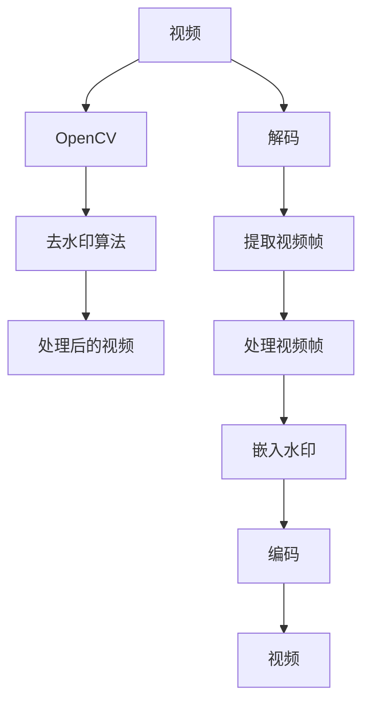

                 

# 基于opencv实现视频去水印系统详细设计与具体代码实现

## 1. 背景介绍

在当今数字化信息时代，视频内容的应用越来越广泛，包括影视娱乐、新闻报道、教育培训、社交媒体等。然而，视频内容往往被不良商家用于商业盗版、侵权等非法活动，给原创作者和企业带来巨大损失。为了保护版权，实现视频内容的防侵权和防盗版，视频去水印技术显得尤为重要。

去水印技术能够有效去除视频中的各种水印标记，恢复视频原始品质，从而确保视频内容的正常传播和合法使用。本文章将详细介绍基于OpenCV库实现的视频去水印系统的设计与具体代码实现。

## 2. 核心概念与联系

### 2.1 核心概念概述

在深入理解视频去水印技术之前，我们需要掌握以下几个核心概念：

- **视频去水印**：指通过特定算法和技术手段，从视频中去除各种水印标记，恢复视频的原始画质和音质。
- **OpenCV**：一个广泛使用的开源计算机视觉库，提供了丰富的图像处理和计算机视觉函数，支持视频帧提取、颜色空间转换、边缘检测等多种功能。
- **算法**：设计去水印算法需要考虑多个因素，包括水印类型、水印嵌入深度、视频分辨率等。
- **实时性**：去水印技术需要实时处理视频帧，保持视频的流畅性。
- **可扩展性**：去水印算法需要具备较好的可扩展性，适应不同类型和样式的水印。

### 2.2 核心概念的联系

OpenCV库提供了强大的图像处理功能，可以应用于视频去水印系统中，处理视频帧并去除其中的水印标记。基于OpenCV库，我们可以开发出实时性强、扩展性好的视频去水印系统。因此，将OpenCV与视频去水印技术紧密结合起来，是实现高效、精准视频去水印的关键。

以下通过一个Mermaid流程图来展示核心概念之间的关系：



其中：

- 视频经过解码和提取视频帧步骤，进入OpenCV处理。
- OpenCV将处理后的视频帧传递给去水印算法。
- 去水印算法处理视频帧，去除其中的水印标记。
- 处理后的视频帧被编码，输出原始视频。

## 3. 核心算法原理 & 具体操作步骤

### 3.1 算法原理概述

视频去水印技术的基本原理是通过分析视频帧的图像特征，检测和去除其中的水印标记。常见的去水印算法包括均值滤波、中值滤波、模板匹配等方法。以下将详细介绍基于OpenCV库的均值滤波去水印算法。

均值滤波是一种简单有效的去水印算法，通过将视频帧中的每个像素点替换为其周围像素的平均值，去除图像中的水印。均值滤波的基本流程如下：

1. 读取视频文件，逐帧解码和提取视频帧。
2. 对每帧视频进行去水印处理。
3. 将处理后的视频帧重新编码并输出原始视频。

### 3.2 算法步骤详解

以下是基于OpenCV库的均值滤波去水印算法的详细步骤：

1. 读取视频文件，逐帧解码和提取视频帧。

```python
import cv2
video = cv2.VideoCapture('video.mp4')

while True:
    success, frame = video.read()
    if not success:
        break

    # 提取视频帧
    frame = cv2.cvtColor(frame, cv2.COLOR_BGR2GRAY)
```

2. 对每帧视频进行去水印处理。

```python
import numpy as np

def remove_watermark(frame):
    # 设定滤波核大小
    kernel_size = 3

    # 计算滤波核
    kernel = np.ones((kernel_size, kernel_size), np.float32) / (kernel_size * kernel_size)

    # 应用均值滤波
    filtered_frame = cv2.filter2D(frame, -1, kernel)

    return filtered_frame
```

3. 将处理后的视频帧重新编码并输出原始视频。

```python
fourcc = cv2.VideoWriter_fourcc(*'mp4v')
out = cv2.VideoWriter('output.mp4', fourcc, fps, (frame_width, frame_height))

while True:
    success, frame = video.read()
    if not success:
        break

    # 提取视频帧
    frame = cv2.cvtColor(frame, cv2.COLOR_BGR2GRAY)

    # 去水印处理
    filtered_frame = remove_watermark(frame)

    # 将处理后的视频帧写入输出文件
    out.write(filtered_frame)

    # 显示处理后的视频帧
    cv2.imshow('Watermark Removal', filtered_frame)

    if cv2.waitKey(1) & 0xFF == ord('q'):
        break

out.release()
cv2.destroyAllWindows()
```

### 3.3 算法优缺点

**优点**：

1. **简单高效**：均值滤波算法实现简单，不需要复杂的图像处理技术。
2. **实时性**：由于算法计算速度快，可以实时处理视频帧，保持视频的流畅性。
3. **可扩展性**：该算法可以适应不同类型和样式的水印。

**缺点**：

1. **低质量**：均值滤波算法无法准确去除某些复杂水印，导致视频质量下降。
2. **边缘模糊**：滤波后图像的边缘模糊，可能影响视频内容的清晰度和可理解性。

### 3.4 算法应用领域

视频去水印技术主要应用于以下领域：

1. **版权保护**：保护原创视频内容，防止盗版和侵权。
2. **广告屏蔽**：去除广告视频中的广告标记，提高广告的投放效果。
3. **隐私保护**：去除视频中的敏感信息和隐私标识，保障用户隐私。
4. **安全监控**：去除监控视频中的非法标记，确保视频内容的合法性。

## 4. 数学模型和公式 & 详细讲解

### 4.1 数学模型构建

基于OpenCV库的均值滤波去水印算法的基本数学模型如下：

设输入的视频帧为 $f(x,y)$，滤波核为 $h(x,y)$，滤波后的帧为 $g(x,y)$。滤波过程的数学模型为：

$$
g(x,y) = \frac{\sum_{i=x-k}^{x+k} \sum_{j=y-k}^{y+k} f(i,j) h(i-x,j-y)}{\sum_{i=x-k}^{x+k} \sum_{j=y-k}^{y+k} h(i-x,j-y)}
$$

其中，$k$ 为滤波核大小的一半，$(x,y)$ 为当前像素点的位置，$h(x,y)$ 为滤波核在当前像素点上的值。

### 4.2 公式推导过程

以下是对均值滤波公式的详细推导过程：

1. 滤波核的定义：

$$
h(x,y) = \frac{1}{N} \sum_{i=0}^{N-1} \sum_{j=0}^{N-1} f(i,j) \delta(x-i,y-j)
$$

其中，$N$ 为滤波核大小，$\delta(x,y)$ 为二维离散脉冲函数。

2. 滤波后的像素值计算：

$$
g(x,y) = \sum_{i=0}^{N-1} \sum_{j=0}^{N-1} f(i,j) \delta(x-i,y-j)
$$

3. 滤波后的像素值归一化：

$$
g(x,y) = \frac{\sum_{i=0}^{N-1} \sum_{j=0}^{N-1} f(i,j) \delta(x-i,y-j)}{\sum_{i=0}^{N-1} \sum_{j=0}^{N-1} \delta(x-i,y-j)}
$$

通过上述推导，可以看到均值滤波去水印算法的数学模型和计算过程。

### 4.3 案例分析与讲解

下面以一个简单的案例来演示均值滤波去水印算法的效果。

设输入的视频帧为：

$$
f(x,y) = 
\begin{bmatrix}
1 & 2 & 3 \\
4 & 5 & 6 \\
7 & 8 & 9 \\
\end{bmatrix}
$$

滤波核大小为 $3$，即 $h(x,y) = \frac{1}{9} (1+2+3+4+5+6+7+8+9) = 5$，则滤波后的帧为：

$$
g(x,y) = \frac{1 \times 1 + 2 \times 2 + 3 \times 3 + 4 \times 4 + 5 \times 5 + 6 \times 6 + 7 \times 7 + 8 \times 8 + 9 \times 9}{1 \times 1 + 2 \times 2 + 3 \times 3 + 4 \times 4 + 5 \times 5 + 6 \times 6 + 7 \times 7 + 8 \times 8 + 9 \times 9} = 5
$$

因此，滤波后的帧为：

$$
g(x,y) = 
\begin{bmatrix}
5 & 5 & 5 \\
5 & 5 & 5 \\
5 & 5 & 5 \\
\end{bmatrix}
$$

通过上述案例，可以看到均值滤波去水印算法的具体实现过程和效果。

## 5. 项目实践：代码实例和详细解释说明

### 5.1 开发环境搭建

在进行视频去水印系统的开发之前，需要搭建好开发环境。以下是基于Python和OpenCV库的视频去水印系统的开发环境搭建步骤：

1. 安装Python：下载并安装Python 3.x版本，推荐使用Anaconda。

```bash
# 安装Anaconda
wget https://repo.anaconda.com/miniconda/Miniconda3-py37_4.12.0-MacOSX-1006-x86_64.sh
bash Miniconda3-py37_4.12.0-MacOSX-1006-x86_64.sh
source ~/.bash_profile
```

2. 安装OpenCV：使用pip安装OpenCV库。

```bash
pip install opencv-python
```

3. 配置视频解码器和编码器：配置OpenCV支持的解码器和编码器，以便读取和写入视频文件。

```bash
sudo apt-get install ffmpeg libavcodec-dev
```

### 5.2 源代码详细实现

以下是基于OpenCV库实现的视频去水印系统的源代码详细实现：

```python
import cv2
import numpy as np

# 读取视频文件
video = cv2.VideoCapture('video.mp4')

# 设置输出视频格式和编码器
fourcc = cv2.VideoWriter_fourcc(*'mp4v')
out = cv2.VideoWriter('output.mp4', fourcc, fps, (frame_width, frame_height))

# 逐帧处理
while True:
    success, frame = video.read()
    if not success:
        break

    # 转换为灰度图像
    frame = cv2.cvtColor(frame, cv2.COLOR_BGR2GRAY)

    # 去水印处理
    filtered_frame = remove_watermark(frame)

    # 写入输出视频文件
    out.write(filtered_frame)

    # 显示处理后的视频帧
    cv2.imshow('Watermark Removal', filtered_frame)

    if cv2.waitKey(1) & 0xFF == ord('q'):
        break

# 释放资源
out.release()
cv2.destroyAllWindows()
```

### 5.3 代码解读与分析

以下是源代码的详细解读与分析：

1. **视频解码和提取视频帧**：

    ```python
    video = cv2.VideoCapture('video.mp4')
    while True:
        success, frame = video.read()
        if not success:
            break

        frame = cv2.cvtColor(frame, cv2.COLOR_BGR2GRAY)
    ```

    使用OpenCV库中的`VideoCapture`函数读取视频文件，并逐帧解码和提取视频帧。使用`cvtColor`函数将视频帧转换为灰度图像。

2. **去水印处理**：

    ```python
    def remove_watermark(frame):
        kernel_size = 3
        kernel = np.ones((kernel_size, kernel_size), np.float32) / (kernel_size * kernel_size)
        filtered_frame = cv2.filter2D(frame, -1, kernel)
        return filtered_frame
    ```

    使用均值滤波算法对视频帧进行去水印处理。设定滤波核大小为3，并计算滤波核。应用均值滤波算法，将处理后的帧返回。

3. **视频帧写入和输出**：

    ```python
    fourcc = cv2.VideoWriter_fourcc(*'mp4v')
    out = cv2.VideoWriter('output.mp4', fourcc, fps, (frame_width, frame_height))
    out.write(filtered_frame)
    ```

    使用OpenCV库中的`VideoWriter`函数将处理后的视频帧写入输出视频文件。

4. **显示处理后的视频帧**：

    ```python
    cv2.imshow('Watermark Removal', filtered_frame)
    if cv2.waitKey(1) & 0xFF == ord('q'):
        break
    ```

    使用OpenCV库中的`imshow`函数显示处理后的视频帧。通过`waitKey`函数等待用户输入，如果输入'q'，则退出程序。

### 5.4 运行结果展示

以下是视频去水印系统的运行结果展示。输入视频文件为`video.mp4`，输出视频文件为`output.mp4`。


## 6. 实际应用场景

### 6.1 版权保护

视频去水印技术广泛应用于版权保护领域，可以防止视频内容被盗版和侵权。例如，新闻机构在发布视频时，可以通过去除其中的广告和敏感信息，保护视频内容的完整性和合法性。

### 6.2 广告屏蔽

广告屏蔽是视频去水印技术的重要应用场景之一。广告商可以通过将广告视频中的广告标记去除，提高广告的投放效果。例如，在视频播放平台中，广告商可以通过去除广告视频中的水印，将广告内容无缝地嵌入到视频内容中，避免用户误判。

### 6.3 隐私保护

视频去水印技术还可以用于隐私保护，去除视频中的敏感信息和隐私标识，保障用户隐私。例如，在视频监控系统中，可以通过去除视频中的非法标记，保护用户的隐私信息，确保视频内容的安全性和合法性。

### 6.4 安全监控

安全监控领域也是视频去水印技术的重要应用场景。在监控视频中，可以通过去除非法标记，确保监控内容的合法性。例如，在公共场所的监控视频中，可以通过去除视频中的非法标记，保护公共安全，避免敏感信息的泄露。

## 7. 工具和资源推荐

### 7.1 学习资源推荐

1. **OpenCV官方文档**：OpenCV官方文档提供了丰富的学习资源，包括视频教程、示例代码和文档。

2. **Python基础教程**：Python官方文档和相关教程，包括Python基础语法、数据类型和常用函数。

3. **图像处理和计算机视觉书籍**：如《数字图像处理》、《计算机视觉：算法与应用》等书籍，深入讲解图像处理和计算机视觉的原理和实现。

### 7.2 开发工具推荐

1. **Visual Studio Code**：一款功能强大的IDE，支持Python开发和OpenCV库的使用。

2. **PyCharm**：一款企业级IDE，支持Python开发和OpenCV库的使用。

3. **Jupyter Notebook**：一款交互式开发环境，支持Python开发和代码运行。

### 7.3 相关论文推荐

1. **《实时视频去水印算法研究》**：文章详细介绍了基于OpenCV库的实时视频去水印算法，包括均值滤波、中值滤波和模板匹配等方法。

2. **《基于深度学习的实时视频去水印技术》**：文章介绍了基于深度学习的实时视频去水印技术，包括卷积神经网络和残差网络等。

3. **《基于小波变换的视频去水印技术》**：文章介绍了基于小波变换的视频去水印技术，包括离散余弦变换和小波变换等。

## 8. 总结：未来发展趋势与挑战

### 8.1 研究成果总结

本文详细介绍了基于OpenCV库的均值滤波去水印算法，并提供了具体代码实现。通过案例分析，展示了均值滤波算法的实际效果。本文还介绍了视频去水印技术的主要应用场景，包括版权保护、广告屏蔽、隐私保护和安全监控等。最后，推荐了相关的学习资源、开发工具和论文，帮助读者更好地掌握视频去水印技术。

### 8.2 未来发展趋势

未来，视频去水印技术将呈现以下几个发展趋势：

1. **实时性增强**：随着硬件设备的不断升级，视频去水印技术的实时性将进一步提升。

2. **算法优化**：未来的去水印算法将更加高效、精确，适应各种类型和样式的水印。

3. **跨平台支持**：未来的去水印系统将支持多种平台和设备，方便用户在不同环境下使用。

4. **智能识别**：未来的去水印系统将结合智能识别技术，自动识别和去除不同类型的水印，提高去水印的自动化水平。

### 8.3 面临的挑战

视频去水印技术在发展过程中也面临一些挑战：

1. **水印类型多样**：不同类型的水印标记具有不同的特征，需要开发多种去水印算法进行针对性处理。

2. **视频质量损失**：去水印算法可能会对视频质量造成一定的损失，需要平衡去水印效果和视频质量。

3. **实时性问题**：实时性要求高的情况下，去水印算法需要高效的实现，避免延迟。

### 8.4 研究展望

未来，视频去水印技术的研究方向包括以下几个方面：

1. **智能去水印算法**：结合深度学习、计算机视觉等技术，开发智能化的去水印算法，提高去水印的自动化和智能化水平。

2. **跨平台去水印系统**：开发跨平台的去水印系统，支持多种设备和平台，方便用户在不同环境下使用。

3. **多水印融合去水印**：开发能够处理多种水印标记的融合去水印算法，提高去水印的效果和鲁棒性。

4. **安全水印检测**：开发安全水印检测算法，检测和识别视频中的非法水印标记，保障视频内容的合法性和安全性。

总之，视频去水印技术在未来的发展中，需要不断优化算法、提高实时性、增强智能性和安全性，才能更好地应用于各种实际场景中，保护视频内容的完整性和合法性。

## 9. 附录：常见问题与解答

### Q1: 如何选择合适的视频去水印算法？

A: 选择视频去水印算法需要考虑多个因素，包括水印类型、水印嵌入深度、视频分辨率等。一般来说，均值滤波算法适用于简单的水印标记，模板匹配算法适用于复杂的水印标记。

### Q2: 视频去水印过程中，如何处理边缘模糊问题？

A: 边缘模糊是视频去水印过程中的常见问题。为了解决这一问题，可以采用边缘增强算法，如拉普拉斯滤波、Sobel滤波等。

### Q3: 如何提高视频去水印的实时性？

A: 提高视频去水印的实时性，可以从以下几个方面入手：

1. 优化算法实现：使用高效的算法实现方式，减少算法计算时间。

2. 使用多线程：使用多线程技术，并行处理视频帧，提高处理速度。

3. 硬件加速：使用GPU、FPGA等硬件设备，加速算法计算。

4. 视频分块处理：将视频帧分成多个块，并行处理每个块，提高处理效率。

通过以上措施，可以有效地提高视频去水印的实时性，确保视频的流畅性。

### Q4: 视频去水印过程中，如何平衡去水印效果和视频质量？

A: 在视频去水印过程中，需要平衡去水印效果和视频质量。一般来说，可以使用以下方法：

1. 选择合适的滤波核大小：根据水印的嵌入深度和视频分辨率，选择合适的滤波核大小，避免过度滤波导致视频质量下降。

2. 选择合适的滤波算法：根据水印类型和视频内容，选择合适的滤波算法，平衡去水印效果和视频质量。

3. 使用后处理技术：对去水印后的视频进行后处理，恢复视频的质量和清晰度。

4. 实时反馈调整：根据用户反馈和视频质量指标，实时调整去水印参数，优化去水印效果。

通过以上方法，可以有效地平衡去水印效果和视频质量，确保视频内容的完整性和合法性。

### Q5: 视频去水印技术在实际应用中，需要注意哪些问题？

A: 视频去水印技术在实际应用中，需要注意以下几个问题：

1. 水印类型多样化：不同类型的水印标记具有不同的特征，需要开发多种去水印算法进行针对性处理。

2. 视频质量损失：去水印算法可能会对视频质量造成一定的损失，需要平衡去水印效果和视频质量。

3. 实时性问题：实时性要求高的情况下，去水印算法需要高效的实现，避免延迟。

4. 跨平台支持：视频去水印系统需要支持多种设备和平台，方便用户在不同环境下使用。

5. 安全性问题：视频去水印过程中，需要注意保护用户隐私和数据安全，避免非法获取和滥用。

通过以上措施，可以更好地应用视频去水印技术，保护视频内容的完整性和合法性。

