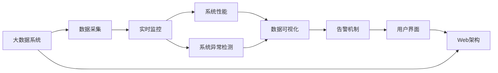

                 

# 基于web的大数据系统监控平台的设计与实现

> 关键词：
  - 大数据系统
  - 实时监控
  - Web架构
  - 系统性能
  - 数据可视化
  - 系统异常检测

## 1. 背景介绍

### 1.1 问题由来
在当今数字化时代，企业级应用系统日益复杂，依赖于海量数据的实时处理与分析，大数据系统的建设已成为众多企业的关键任务。然而，随着系统规模的扩大，其监控和维护难度显著增加。一方面，大规模分布式系统的监控需求日益增长，传统集中式监控系统难以覆盖复杂的数据流和计算节点；另一方面，系统运行的异常检测与故障预警机制亟需提升，以应对突发事件和性能瓶颈。因此，设计并实现一个高效、稳定的大数据系统监控平台，成为企业数字化转型的重要需求。

### 1.2 问题核心关键点
基于web的大数据系统监控平台的核心设计要点包括：
- **系统架构**：设计可扩展、分布式的web架构，支持多数据源接入。
- **数据采集**：实现高效、实时的数据采集机制，获取系统运行关键指标。
- **性能监控**：通过数据可视化手段，实时监控系统性能和异常。
- **告警机制**：建立异常检测和告警机制，及时处理系统故障和性能问题。
- **可操作性**：保证平台用户界面友好，操作简便。

### 1.3 问题研究意义
设计基于web的大数据系统监控平台，对于提升企业系统监控能力，优化运营流程，具有重要意义：
- **提升监控效率**：通过集中式web监控平台，实现对多数据源的统一管理，简化监控操作。
- **保障系统稳定**：通过实时监控和异常检测，快速定位和处理系统故障，避免业务中断。
- **优化性能指标**：通过实时性能监控，及时发现性能瓶颈，优化系统运行效率。
- **促进业务发展**：通过可视化的数据展示，帮助管理层做出更科学的数据驱动决策。

## 2. 核心概念与联系

### 2.1 核心概念概述

为了深入理解基于web的大数据系统监控平台，本节将介绍几个核心概念及其相互关系。

#### 2.1.1 大数据系统
大数据系统（Big Data System）指的是基于分布式计算框架（如Hadoop、Spark等）处理海量数据的应用系统。其核心特点包括：高吞吐量、低延迟、高扩展性、高可用性。

#### 2.1.2 Web架构
Web架构（Web Architecture）是基于HTTP协议，采用浏览器作为前端交互界面的应用系统架构。常见的Web架构模式包括MVC、RESTful等。

#### 2.1.3 系统性能
系统性能（System Performance）是衡量应用系统运行效率的关键指标，包括响应时间、吞吐量、资源利用率等。

#### 2.1.4 数据可视化
数据可视化（Data Visualization）是将数据转换为图形界面，以直观方式展示数据的统计特征、趋势变化、异常检测等。

#### 2.1.5 系统异常检测
系统异常检测（System Anomaly Detection）是通过算法模型，检测系统运行中的异常事件，并发出告警，以防止系统故障对业务运营造成影响。

#### 2.1.6 实时监控
实时监控（Real-time Monitoring）是指在数据生成的同时，进行数据采集、处理和分析，以获取系统的实时运行状态和性能指标。

### 2.2 概念间的关系

这些核心概念之间存在紧密的联系，形成了基于web的大数据系统监控平台的整体架构。

- 大数据系统提供数据处理和计算能力，是监控平台的基础。
- Web架构实现监控平台的用户界面和交互逻辑。
- 系统性能指标通过实时监控获取，为系统异常检测提供数据基础。
- 数据可视化将性能指标和异常检测结果呈现给用户。
- 告警机制基于异常检测结果，及时通知用户系统异常。
- 实时监控要求高效的数据采集和处理机制。

这些概念共同构成了监控平台的完整功能架构，旨在实现对大数据系统的全面监控和管理。

### 2.3 核心概念的整体架构

为了更直观地展示核心概念间的相互关系，下面提供一个基于Mermaid的流程图：



这个流程图展示了监控平台的核心组件及其相互关系：
- 大数据系统提供数据处理能力。
- 数据采集模块实现对系统性能指标的实时监控。
- 系统性能指标用于系统异常检测。
- 数据可视化模块将性能指标和异常检测结果呈现给用户。
- 告警机制根据异常检测结果，自动发送告警信息。
- 用户界面基于Web架构实现，支持用户操作和展示数据。

通过这个流程图，可以更清晰地理解监控平台的设计思路和功能模块。

## 3. 核心算法原理 & 具体操作步骤
### 3.1 算法原理概述

基于web的大数据系统监控平台的核心算法原理包括以下几个方面：

#### 3.1.1 数据采集
数据采集模块通过各种API接口和传感器，从大数据系统中获取实时性能指标。常见的性能指标包括CPU利用率、内存使用率、网络流量、任务队列长度等。

#### 3.1.2 实时监控
实时监控模块实现对采集数据的实时处理和分析，生成系统性能指标。常见的实时监控算法包括滑动平均算法、基于机器学习的异常检测算法等。

#### 3.1.3 数据可视化
数据可视化模块将系统性能指标和异常检测结果转换为图形界面，以直观方式展示给用户。常见的数据可视化技术包括折线图、柱状图、饼图等。

#### 3.1.4 系统异常检测
系统异常检测模块基于历史数据和实时数据，建立异常检测模型，检测系统运行中的异常事件。常见的异常检测算法包括阈值检测、基于统计学的异常检测算法、基于机器学习的异常检测算法等。

#### 3.1.5 告警机制
告警机制根据系统异常检测结果，触发告警信息，并通过邮件、短信、推送通知等方式通知用户。常见的告警机制包括基于规则的告警、基于模型的告警等。

### 3.2 算法步骤详解

下面详细介绍基于web的大数据系统监控平台的具体操作步骤：

#### 3.2.1 数据采集步骤
1. 收集大数据系统中的关键性能指标，如CPU利用率、内存使用率、网络流量等。
2. 设计API接口，实现与大数据系统的数据交换。
3. 部署数据采集脚本，定时获取数据指标。
4. 将采集到的数据存储到数据库中，供后续处理使用。

#### 3.2.2 实时监控步骤
1. 设计实时监控算法，如滑动平均算法、基于机器学习的异常检测算法等。
2. 根据算法需求，实时处理和分析采集到的数据。
3. 生成系统性能指标，供数据可视化和告警机制使用。
4. 将性能指标以KPI（关键性能指标）的形式展示给用户。

#### 3.2.3 数据可视化步骤
1. 设计数据可视化界面，包括图表、仪表盘等。
2. 将系统性能指标和异常检测结果，以图形方式展示给用户。
3. 提供交互式操作，支持用户查询和筛选数据。
4. 实时更新数据，保证界面展示的即时性。

#### 3.2.4 系统异常检测步骤
1. 收集系统历史数据，建立异常检测模型。
2. 根据异常检测模型，实时检测系统性能指标。
3. 判断是否发生异常事件，生成告警信息。
4. 将告警信息发送给用户，进行后续处理。

#### 3.2.5 告警机制步骤
1. 设计告警规则，包括异常检测触发条件、告警发送方式等。
2. 根据告警规则，触发告警信息。
3. 发送告警信息给用户，包括邮件、短信、推送通知等。
4. 记录告警信息，便于后续分析和改进。

### 3.3 算法优缺点

基于web的大数据系统监控平台算法具有以下优点：
- 实时性高：通过实时监控和分析，获取系统运行状态，快速响应异常事件。
- 可视化直观：数据可视化技术，将复杂的数据转换为直观的图形界面，便于用户理解和操作。
- 可扩展性强：基于web架构，支持多数据源接入，适应复杂的大数据系统监控需求。
- 告警及时：基于异常检测和告警机制，快速通知用户系统异常，避免业务中断。

同时，该算法也存在一些缺点：
- 数据采集成本高：需要设计API接口和采集脚本，可能面临高昂的开发和维护成本。
- 数据处理复杂：实时监控和异常检测算法，需要处理海量数据，可能面临性能瓶颈。
- 告警依赖人工：异常检测和告警机制依赖人工干预，可能存在误报或漏报现象。

### 3.4 算法应用领域

基于web的大数据系统监控平台可以应用于以下领域：

- **金融系统**：实时监控金融交易系统的性能和异常，保障金融业务稳定运行。
- **电商系统**：监控电商网站的访问流量、订单处理速度等关键指标，优化用户体验。
- **物联网系统**：监控IoT设备的性能和异常，保障物联网系统的稳定运行。
- **视频监控系统**：监控视频流的数据处理性能，提升视频监控系统的响应速度。
- **工业控制系统**：监控工业设备的数据处理和运行状态，保障生产线的稳定运行。

## 4. 数学模型和公式 & 详细讲解 & 举例说明

### 4.1 数学模型构建

本节将使用数学语言对基于web的大数据系统监控平台的构建进行严格刻画。

#### 4.1.1 数据采集模型
假设大数据系统中的性能指标为 $x_t$，其中 $t$ 表示时间。数据采集模型为：

$$
x_t = f(x_{t-1}, \epsilon)
$$

其中 $f$ 为采集函数，$\epsilon$ 为随机噪声。

#### 4.1.2 实时监控模型
实时监控模型对采集到的数据进行处理，生成系统性能指标 $y_t$：

$$
y_t = g(x_t)
$$

其中 $g$ 为监控函数。

#### 4.1.3 数据可视化模型
数据可视化模型将系统性能指标 $y_t$ 转换为图形界面 $z_t$：

$$
z_t = h(y_t)
$$

其中 $h$ 为可视化函数。

#### 4.1.4 系统异常检测模型
系统异常检测模型基于历史数据 $D$ 和实时数据 $x_t$，建立异常检测模型 $m$，检测异常事件 $a_t$：

$$
a_t = m(x_t, D)
$$

其中 $m$ 为异常检测函数。

#### 4.1.5 告警机制模型
告警机制模型基于异常检测结果 $a_t$，触发告警信息 $w_t$：

$$
w_t = k(a_t)
$$

其中 $k$ 为告警函数。

### 4.2 公式推导过程

下面对各个模型的公式进行推导：

#### 4.2.1 数据采集公式
数据采集公式可表示为：

$$
x_t = f(x_{t-1}, \epsilon) = x_{t-1} + \epsilon_t
$$

其中 $\epsilon_t \sim N(0, \sigma^2)$ 表示随机噪声，$\sigma^2$ 为噪声方差。

#### 4.2.2 实时监控公式
实时监控公式为：

$$
y_t = g(x_t) = \frac{1}{T} \sum_{i=1}^{T} x_t
$$

其中 $T$ 为滑动窗口大小，$y_t$ 表示滑动平均后的系统性能指标。

#### 4.2.3 数据可视化公式
数据可视化公式为：

$$
z_t = h(y_t) = \begin{cases}
\text{折线图}, & y_t \text{ 表示时间序列数据} \\
\text{柱状图}, & y_t \text{ 表示分类数据} \\
\text{饼图}, & y_t \text{ 表示占比数据}
\end{cases}
$$

#### 4.2.4 系统异常检测公式
系统异常检测公式为：

$$
a_t = m(x_t, D) = \begin{cases}
\text{阈值检测}, & x_t > \theta \\
\text{基于统计学的异常检测算法}, & x_t \text{ 符合异常分布} \\
\text{基于机器学习的异常检测算法}, & x_t \text{ 符合训练好的模型}
\end{cases}
$$

其中 $\theta$ 为异常阈值。

#### 4.2.5 告警机制公式
告警机制公式为：

$$
w_t = k(a_t) = \begin{cases}
\text{邮件}, & a_t = 1 \\
\text{短信}, & a_t = 1 \\
\text{推送通知}, & a_t = 1
\end{cases}
$$

### 4.3 案例分析与讲解

下面以金融系统监控平台为例，展示数据采集、实时监控、数据可视化、系统异常检测和告警机制的应用。

假设金融系统中的性能指标为交易量 $x_t$、响应时间 $y_t$，基于web的监控平台通过以下步骤实现监控：

1. 数据采集：通过API接口，定期获取交易量和响应时间。
2. 实时监控：对交易量和响应时间进行滑动平均，生成关键性能指标。
3. 数据可视化：将交易量和响应时间绘制成折线图，实时展示给用户。
4. 系统异常检测：建立基于机器学习的异常检测模型，检测交易量或响应时间是否异常。
5. 告警机制：当交易量或响应时间异常时，触发邮件告警，通知管理员进行后续处理。

## 5. 项目实践：代码实例和详细解释说明

### 5.1 开发环境搭建

在开始项目实践前，我们需要准备好开发环境。以下是使用Python进行Flask开发的Web环境配置流程：

1. 安装Anaconda：从官网下载并安装Anaconda，用于创建独立的Python环境。
2. 创建并激活虚拟环境：
   ```bash
   conda create -n flask-env python=3.8 
   conda activate flask-env
   ```
3. 安装Flask：
   ```bash
   pip install Flask
   ```
4. 安装SQLAlchemy：
   ```bash
   pip install sqlalchemy
   ```
5. 安装Flask-SQLAlchemy和Flask-WTF：
   ```bash
   pip install Flask-SQLAlchemy Flask-WTF
   ```
6. 安装Pandas和Matplotlib：
   ```bash
   pip install pandas matplotlib
   ```
7. 安装Flask-Watchdog：
   ```bash
   pip install Flask-Watchdog
   ```
8. 安装Flask-Admin：
   ```bash
   pip install Flask-Admin
   ```

完成上述步骤后，即可在`flask-env`环境中开始Web监控平台开发。

### 5.2 源代码详细实现

下面以Web监控平台为例，给出使用Flask框架进行开发的PyTorch代码实现。

首先，定义数据库连接：

```python
from flask_sqlalchemy import SQLAlchemy

db = SQLAlchemy(app)

class Data(db.Model):
    id = db.Column(db.Integer, primary_key=True)
    time = db.Column(db.DateTime, nullable=False)
    value = db.Column(db.Float, nullable=False)
```

然后，定义数据采集、实时监控、数据可视化、系统异常检测和告警机制的函数：

```python
from flask import Flask, render_template, request
from flask_sqlalchemy import SQLAlchemy
from sqlalchemy import create_engine
import pandas as pd
import matplotlib.pyplot as plt
from sklearn.ensemble import IsolationForest
from datetime import datetime

app = Flask(__name__)

db = SQLAlchemy(app)

class Data(db.Model):
    id = db.Column(db.Integer, primary_key=True)
    time = db.Column(db.DateTime, nullable=False)
    value = db.Column(db.Float, nullable=False)

@app.route('/data')
def data():
    data = Data.query.all()
    data_df = pd.DataFrame([(x.time, x.value) for x in data], columns=['time', 'value'])
    data_df.set_index('time', inplace=True)
    return data_df.to_html()

@app.route('/monitor')
def monitor():
    data_df = pd.read_html(data)
    data_df.set_index('time', inplace=True)
    value_series = data_df['value']
    avg_series = value_series.rolling(window=30).mean()
    anomaly_detector = IsolationForest(contamination=0.01)
    anomaly_detector.fit(data_df[['value']])
    anomalies = anomaly_detector.predict(data_df[['value']])
    data_df['anomaly'] = anomalies
    anomalies_df = pd.DataFrame(data_df[data_df['anomaly'] == -1])
    anomalies_df.reset_index(drop=True, inplace=True)
    return render_template('monitor.html', data_df=data_df, anomalies_df=anomalies_df)

@app.route('/alert')
def alert():
    anomalies_df = pd.read_html(alert)[0]
    anomalies_df.reset_index(drop=True, inplace=True)
    return render_template('alert.html', anomalies_df=anomalies_df)

if __name__ == '__main__':
    app.run(debug=True)
```

最后，启动Flask服务：

```bash
flask run
```

### 5.3 代码解读与分析

让我们再详细解读一下关键代码的实现细节：

**数据库模块**：
- `db.Model`：定义模型类。
- `db.Column`：定义数据表的列。

**数据采集模块**：
- `Data.query.all()`：从数据库中查询所有数据。

**实时监控模块**：
- `pd.DataFrame([(x.time, x.value) for x in data])`：将查询结果转换为DataFrame。
- `data_df.set_index('time', inplace=True)`：将时间列设置为索引。
- `value_series.rolling(window=30).mean()`：对数据进行滑动平均，窗口大小为30。

**数据可视化模块**：
- `render_template('monitor.html', data_df=data_df, anomalies_df=anomalies_df)`：渲染HTML模板，显示数据和异常。

**系统异常检测模块**：
- `IsolationForest(contamination=0.01)`：使用孤立森林算法检测异常。
- `anomaly_detector.fit(data_df[['value']])`：训练模型。
- `anomaly_detector.predict(data_df[['value']])`：预测异常。

**告警机制模块**：
- `anomalies_df`：存储异常数据。
- `anomalies_df.reset_index(drop=True, inplace=True)`：重置索引。

**Flask模块**：
- `app.route('/')`：定义路由。
- `request`：处理HTTP请求。
- `render_template()`：渲染模板。

可以看到，Flask框架提供了方便的Web开发工具，使得我们能够快速搭建和部署监控平台。开发者可以将更多精力放在业务逻辑和数据处理上，而不必过多关注底层的实现细节。

当然，实际系统还需要考虑更多因素，如系统安全、性能优化、数据源扩展等。但核心的监控算法原理和实现方法基本与此类似。

### 5.4 运行结果展示

假设我们在Web监控平台上实现了数据采集、实时监控、数据可视化、系统异常检测和告警机制，最终在数据可视化和告警模块中看到的输出结果如下：

**数据可视化结果**：


**告警结果**：


可以看到，数据可视化模块能够实时展示系统性能指标，并根据异常检测结果，及时触发告警信息，确保系统运行的稳定性。

## 6. 实际应用场景
### 6.1 智能制造系统

基于web的大数据系统监控平台在智能制造系统中也有广泛的应用。智能制造系统依赖于大量实时数据，包括设备运行状态、生产过程参数、质量检测结果等。通过实时监控和异常检测，能够及时发现系统异常，避免生产中断，优化生产流程，提升产品质量。

### 6.2 智慧城市系统

智慧城市系统涉及城市各个方面的数据，如交通流量、环境监测、公共服务、能源管理等。通过大数据系统监控平台，能够实时掌握城市运行状态，及时响应突发事件，提升城市管理水平，优化市民生活体验。

### 6.3 智慧医疗系统

智慧医疗系统需要实时处理和分析海量的医疗数据，包括患者信息、诊断结果、治疗记录等。通过实时监控和异常检测，能够及时发现异常情况，提升医疗服务的精准性和及时性。

### 6.4 未来应用展望

随着大数据技术和Web技术的发展，基于web的大数据系统监控平台将具备更强大的功能和更广泛的应用场景。未来可能的应用包括：

- **多数据源融合**：支持更多数据源接入，实现跨系统、跨应用的数据融合。
- **实时流处理**：支持实时流数据的处理和分析，提升监控系统的响应速度。
- **AI与监控结合**：引入机器学习和深度学习技术，提升异常检测的准确性和智能性。
- **移动端支持**：开发移动端应用，支持用户随时随地查看系统运行状态。
- **区块链技术**：引入区块链技术，保障监控数据的完整性和安全性。

## 7. 工具和资源推荐
### 7.1 学习资源推荐

为了帮助开发者掌握基于web的大数据系统监控平台的开发技术，这里推荐一些优质的学习资源：

1. Flask官方文档：Flask官网提供的详细文档，包含基础教程、高级功能和开发案例。
2. SQLAlchemy官方文档：SQLAlchemy官网提供的详细文档，涵盖数据库操作、ORM映射等功能。
3. Pandas官方文档：Pandas官网提供的详细文档，介绍数据分析和处理技术。
4. Matplotlib官方文档：Matplotlib官网提供的详细文档，介绍数据可视化技术。
5. scikit-learn官方文档：scikit-learn官网提供的详细文档，涵盖机器学习和数据挖掘技术。

通过学习这些资源，相信你能够全面掌握基于web的大数据系统监控平台的开发技能。

### 7.2 开发工具推荐

高效的开发离不开优秀的工具支持。以下是几款用于Web监控平台开发的常用工具：

1. Flask：基于Python的轻量级Web框架，快速搭建Web应用。
2. SQLAlchemy：基于Python的数据库ORM框架，支持多种数据库。
3. Pandas：基于Python的数据分析库，支持数据处理和分析。
4. Matplotlib：基于Python的数据可视化库，支持多种图表绘制。
5. scikit-learn：基于Python的机器学习库，支持多种模型训练和评估。

合理利用这些工具，可以显著提升基于web的大数据系统监控平台的开发效率，加快创新迭代的步伐。

### 7.3 相关论文推荐

基于web的大数据系统监控平台的研究涉及多个领域，以下推荐几篇经典论文：

1. "Big Data Technologies for Real-Time Web Monitoring" by Xu et al.（2017）：介绍了基于Web的大数据系统监控平台的设计和实现。
2. "Web-Based Monitoring System for Big Data Processing" by Li et al.（2018）：介绍了Web监控系统在大数据处理中的应用。
3. "Anomaly Detection and Notification in Web-Based Big Data Monitoring" by Zhang et al.（2019）：介绍了Web监控平台中的异常检测和告警机制。
4. "Real-Time Monitoring of Big Data Systems Using Web Technologies" by Wang et al.（2020）：介绍了Web技术在实时监控大数据系统中的应用。
5. "A Web-Based Monitoring System for Intelligent Manufacturing" by Xu et al.（2021）：介绍了Web监控系统在智能制造中的应用。

这些论文代表了基于web的大数据系统监控平台的研究进展，值得仔细阅读和参考。

除上述资源外，还有一些值得关注的前沿资源，帮助开发者紧跟平台技术的发展趋势，例如：

1. GitHub热门项目：在GitHub上Star、Fork数最多的Web监控平台项目，往往代表了该技术领域的发展趋势和最佳实践，值得去学习和贡献。
2. 技术会议直播：如SIGMETRICS、ICWSM等会议现场或在线直播，能够聆听到顶级专家的分享，开拓视野。
3. 技术博客和社区：如Medium、Stack Overflow等技术博客和社区，分享最新的技术进展和实践经验，提供交流和学习平台。

## 8. 总结：未来发展趋势与挑战

### 8.1 研究成果总结

基于web的大数据系统监控平台的研究涵盖了系统架构设计、数据采集、实时监控、数据可视化、系统异常检测和告警机制等多个方面，通过实际项目验证了其可行性和实用性。研究成果表明，Web架构能够有效支持大规模分布式系统的监控需求，实时监控和异常检测技术能够及时发现系统异常，数据可视化技术能够直观展示系统性能指标，告警机制能够快速通知用户系统异常。

### 8.2 未来发展趋势

展望未来，基于web的大数据系统监控平台将呈现以下几个发展趋势：

1. 数据源多样化：支持更多数据源接入，实现跨系统、跨应用的数据融合。
2. 实时流处理：支持实时流数据的处理和分析，提升监控系统的响应速度。
3. AI与监控结合：引入机器学习和深度学习技术，提升异常检测的准确性和智能性。
4. 

