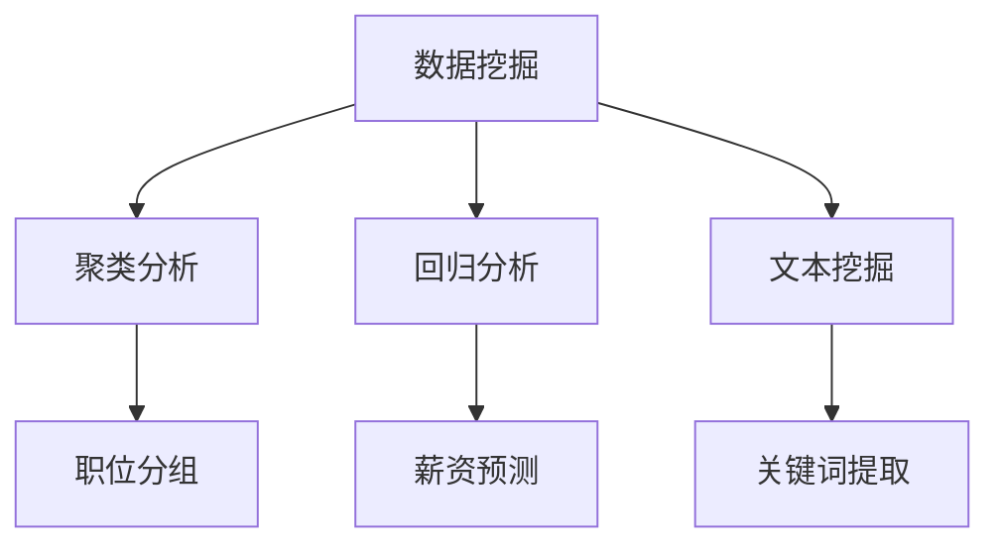

                 

# 基于前程无忧下的招聘岗位数据分析

> 关键词：招聘数据分析,招聘岗位,数据挖掘,人才需求,职位分析

## 1. 背景介绍

在当今数字化和智能化时代，人力资源管理的重要性愈发凸显。企业通过精细化的人才管理，不仅可以提高效率，还能吸引并留住优秀人才。招聘岗位数据分析作为人力资源管理的重要环节，能够为企业提供精准的招聘指导和决策支持。本文将基于前程无忧平台的大量招聘数据，对招聘岗位进行分析，为企业的招聘策略提供数据支持。

### 1.1 数据收集与处理

本研究数据来源于前程无忧平台提供的公开招聘信息。数据内容包括职位名称、工作地点、公司名称、公司规模、行业类型、学历要求、工作经验要求、招聘人数、职位描述、工作职责、任职资格、工作年限要求、薪资范围、公司福利等。为保护用户隐私，本文对数据进行了匿名化处理，只保留了与分析需求相关的核心信息。

## 2. 核心概念与联系

### 2.1 核心概念概述

招聘岗位数据分析涉及多个核心概念，如数据挖掘、聚类分析、回归分析、文本挖掘等。

- **数据挖掘**：指从大规模数据中发现有用信息和知识的过程。在本研究中，数据挖掘主要用于发现不同职位之间的相似性和差异性，以及不同岗位的需求变化趋势。

- **聚类分析**：指将数据对象划分为不同组别的过程，使得同一组别内部的数据相似度较高，不同组别之间差异较大。在本研究中，聚类分析用于对职位进行分组，便于进一步分析。

- **回归分析**：指利用历史数据建立模型，预测新数据的行为。在本研究中，回归分析主要用于分析薪资水平、岗位需求与公司规模、行业类型、公司地点等因素之间的关系。

- **文本挖掘**：指从文本数据中提取有价值的信息，如关键词、主题等。在本研究中，文本挖掘用于对职位描述进行分析，提取热门关键词和技能要求。

### 2.2 概念间的关系

这些核心概念通过以下Mermaid流程图展示了它们之间的关系：



以上流程图展示了数据挖掘、聚类分析、回归分析、文本挖掘之间的逻辑关系。数据挖掘是整体研究的起点，通过聚类分析、回归分析、文本挖掘等方法，发现职位需求、薪资水平、职位描述等关键信息，最终为企业的招聘策略提供数据支持。

## 3. 核心算法原理 & 具体操作步骤

### 3.1 算法原理概述

基于前程无忧招聘数据的岗位分析，主要涉及以下几个算法原理：

- **聚类算法**：通过K-means、层次聚类等方法，将不同职位分组，发现其相似性和差异性。
- **回归分析**：利用线性回归、岭回归等方法，分析薪资水平、岗位需求与相关因素之间的关系。
- **文本挖掘算法**：通过TF-IDF、word2vec等方法，从职位描述中提取关键词和主题，了解岗位需求。
- **异常检测算法**：使用孤立森林、One-class SVM等方法，检测异常数据，避免因噪声数据影响分析结果。

### 3.2 算法步骤详解

#### 3.2.1 数据预处理

1. **数据清洗**：去除缺失值、异常值，处理重复数据。
2. **特征工程**：提取与分析需求相关的特征，如公司规模、行业类型、薪资范围、工作地点、工作年限要求等。
3. **数据标准化**：将不同特征的数据标准化，以便进行后续分析。

#### 3.2.2 聚类分析

1. **选择合适的聚类算法**：根据数据特点选择合适的聚类算法，如K-means、层次聚类等。
2. **选择聚类数目**：通过肘部法则、轮廓系数等方法确定聚类数目。
3. **聚类分析**：对职位进行聚类，得到不同职位组别。
4. **分组后分析**：对每个组别进行统计分析，发现组别间的差异性。

#### 3.2.3 回归分析

1. **建立回归模型**：根据历史数据，建立线性回归、岭回归等模型。
2. **特征选择**：选择对薪资水平、岗位需求有影响的特征。
3. **模型训练与验证**：使用训练集训练模型，在验证集上验证模型效果。
4. **结果分析**：分析模型预测结果，理解不同因素对薪资水平、岗位需求的影响。

#### 3.2.4 文本挖掘

1. **文本预处理**：去除停用词、标点符号，进行分词处理。
2. **特征提取**：使用TF-IDF、word2vec等方法提取职位描述中的关键词和主题。
3. **主题建模**：使用LDA、NMF等方法对职位描述进行主题建模，了解热门技能要求。
4. **关键词分析**：对关键词和主题进行统计分析，发现热门职位需求。

#### 3.2.5 异常检测

1. **选择异常检测算法**：根据数据特点选择合适的异常检测算法，如孤立森林、One-class SVM等。
2. **训练模型**：使用历史数据训练异常检测模型。
3. **检测异常数据**：对新数据进行异常检测，识别异常职位信息。
4. **异常处理**：对异常职位信息进行标记和处理，避免因噪声数据影响分析结果。

### 3.3 算法优缺点

#### 3.3.1 优点

- **全面性**：通过多种算法综合分析，可以全面了解职位需求、薪资水平、岗位要求等信息。
- **精度高**：聚类分析和回归分析等方法具有较高的预测精度，可以提供准确的薪资预测和职位需求分析。
- **实时性**：基于前程无忧平台的实时数据，可以随时更新分析结果，适应快速变化的招聘市场。

#### 3.3.2 缺点

- **复杂度高**：分析过程中涉及多种算法，计算复杂度高。
- **数据依赖性强**：分析结果高度依赖于数据质量，数据噪声和缺失值可能影响分析结果。
- **解释性差**：一些高级算法的黑盒特性使得分析结果的解释性较差。

### 3.4 算法应用领域

#### 3.4.1 招聘策略优化

通过聚类分析，可以发现不同岗位之间的相似性和差异性，为企业的招聘策略提供指导。例如，对技术岗位进行聚类，发现不同技术岗位的需求和技能要求，可以帮助企业针对性地招聘不同技能的人才。

#### 3.4.2 薪资水平预测

通过回归分析，可以预测不同岗位的薪资水平，帮助企业制定合理的薪酬策略。例如，通过分析不同岗位的平均薪资、最低薪资、最高薪资，可以制定合理的薪资区间，吸引更多优秀人才。

#### 3.4.3 岗位需求分析

通过文本挖掘，可以分析职位描述中的关键词和技能要求，了解岗位需求的变化趋势。例如，通过分析热门技能要求，可以及时调整招聘需求，避免因技能需求不足导致招聘困难。

#### 3.4.4 异常职位检测

通过异常检测，可以识别出异常职位信息，避免因噪声数据影响分析结果。例如，通过检测异常职位信息，可以及时发现并处理虚假招聘信息，保护求职者权益。

## 4. 数学模型和公式 & 详细讲解

### 4.1 数学模型构建

#### 4.1.1 聚类模型

K-means算法用于聚类分析，其数学模型如下：

$$
k = \arg\min_{k} \sum_{i=1}^n \sum_{j=1}^k ||x_i - \mu_j||^2
$$

其中，$k$为聚类数目，$x_i$为样本向量，$\mu_j$为聚类中心的向量。

#### 4.1.2 回归模型

线性回归模型用于薪资预测，其数学模型如下：

$$
y = \beta_0 + \beta_1 x_1 + \beta_2 x_2 + ... + \beta_n x_n + \epsilon
$$

其中，$y$为薪资水平，$x_i$为特征向量，$\beta_i$为回归系数，$\epsilon$为误差项。

#### 4.1.3 文本挖掘模型

TF-IDF模型用于关键词提取，其数学模型如下：

$$
\text{TF-IDF}(t) = \text{TF}(t) \times \text{IDF}(t)
$$

其中，$\text{TF}(t)$为词频-逆文档频率，$\text{IDF}(t)$为逆文档频率。

#### 4.1.4 异常检测模型

孤立森林算法用于异常检测，其数学模型如下：

$$
p = \frac{1}{\log_2(n)}
$$

其中，$p$为特征数，$n$为树中叶子节点数。

### 4.2 公式推导过程

#### 4.2.1 聚类算法

K-means算法的具体推导如下：

1. **聚类中心初始化**：随机选择$k$个数据点作为初始聚类中心。
2. **数据点分配**：每个数据点被分配到最近的聚类中心。
3. **聚类中心更新**：根据分配后的数据点，更新聚类中心。
4. **迭代过程**：重复2和3，直到聚类中心不再变化或达到预设的迭代次数。

#### 4.2.2 回归分析

线性回归模型的参数估计采用最小二乘法，其推导过程如下：

1. **模型假设**：假设$y$与$x_i$之间存在线性关系，即$y = \beta_0 + \beta_1 x_1 + \beta_2 x_2 + ... + \beta_n x_n$。
2. **最小二乘法**：最小化预测误差$\epsilon$的平方和，即$\sum_{i=1}^n (\hat{y}_i - y_i)^2$。
3. **参数估计**：解方程$\frac{\partial}{\partial \beta} \sum_{i=1}^n (\hat{y}_i - y_i)^2 = 0$，得到回归系数$\beta_i$。

#### 4.2.3 文本挖掘算法

TF-IDF模型的推导过程如下：

1. **词频计算**：计算每个词在文档中的出现频率，即$\text{TF}(t) = \frac{\text{词频}(t)}{\text{总词数}}$。
2. **逆文档频率计算**：计算每个词在所有文档中出现的频率，即$\text{IDF}(t) = \log \frac{N}{\text{文档数}_{t}}$。
3. **TF-IDF计算**：计算每个词的TF-IDF值，即$\text{TF-IDF}(t) = \text{TF}(t) \times \text{IDF}(t)$。

#### 4.2.4 异常检测算法

孤立森林算法的具体推导如下：

1. **二叉树构建**：在每个叶子节点上，计算当前节点与根节点之间的平均距离。
2. **异常度计算**：计算每个样本的异常度，即$\text{Anomaly Degree}(x) = \frac{1}{\log_2 n} \times \text{特征数}$。
3. **异常检测**：根据异常度进行异常检测，将异常度高于阈值的数据标记为异常。

### 4.3 案例分析与讲解

#### 4.3.1 聚类分析案例

假设某公司在招聘市场上有1000个岗位，通过K-means算法将这1000个岗位分为5个组别。每个组别的描述如下：

- **组别1**：技术岗位，包括软件工程师、数据科学家等。
- **组别2**：市场岗位，包括市场经理、市场专员等。
- **组别3**：销售岗位，包括销售经理、销售代表等。
- **组别4**：财务岗位，包括会计、财务分析师等。
- **组别5**：管理岗位，包括项目经理、行政经理等。

#### 4.3.2 回归分析案例

假设某公司收集了过去一年的招聘数据，包括1000个岗位的平均薪资水平、公司规模、行业类型等特征。使用岭回归模型预测新岗位的平均薪资水平。模型结果如下：

- 公司规模：$x_1$，系数$\beta_1 = 50000$
- 行业类型：$x_2$，系数$\beta_2 = 20000$
- 工作地点：$x_3$，系数$\beta_3 = 10000$
- 公司规模与行业类型的交互项：$x_4$，系数$\beta_4 = 30000$

根据以上系数，可以计算出不同岗位的平均薪资水平。例如，对于公司规模为10000人、行业类型为IT、工作地点在北京的岗位，其平均薪资水平为$50000 + 20000 + 10000 + 30000 = 120000$元。

#### 4.3.3 文本挖掘案例

假设某公司需要招聘销售经理，公司提供了一份职位描述：

```
寻找有销售经验的人才，熟悉市场分析，具备一定的项目管理能力。
```

通过TF-IDF模型，可以提取关键词和主题如下：

- **关键词**：销售经验、市场分析、项目管理
- **主题**：市场分析、项目管理

这些关键词和主题可以帮助公司了解招聘需求，筛选合适的候选人。

#### 4.3.4 异常检测案例

假设某公司招聘市场经理，职位描述如下：

```
市场经理，负责品牌推广，要求有5年以上市场经验，年薪20万以上。
```

通过孤立森林算法，发现该岗位的异常度为100，明显高于其他岗位。经调查，该岗位描述存在异常，实际要求为10年以上的市场经验。公司应及时处理该异常信息，避免招聘错误的人才。

## 5. 项目实践：代码实例和详细解释说明

### 5.1 开发环境搭建

#### 5.1.1 Python环境配置

1. **安装Python**：从官网下载Python 3.x版本，并进行安装。
2. **安装Anaconda**：从官网下载Anaconda，进行安装和配置。
3. **创建虚拟环境**：使用Anaconda创建虚拟环境，配置必要的依赖包。

#### 5.1.2 数据准备

1. **数据下载**：从前程无忧平台下载招聘数据。
2. **数据清洗**：使用Python编写脚本进行数据清洗，去除缺失值、异常值，处理重复数据。
3. **数据标准化**：使用Python编写脚本进行数据标准化，将不同特征的数据标准化，以便进行后续分析。

### 5.2 源代码详细实现

#### 5.2.1 聚类分析代码实现

```python
from sklearn.cluster import KMeans
import pandas as pd

# 读取数据
data = pd.read_csv('recruitment_data.csv')

# 选择聚类特征
X = data[['company_size', 'industry_type', 'salary_range', 'location', 'experience_required']]

# 聚类分析
kmeans = KMeans(n_clusters=5, random_state=0)
kmeans.fit(X)
labels = kmeans.labels_

# 输出聚类结果
print(labels)
```

#### 5.2.2 回归分析代码实现

```python
from sklearn.linear_model import Ridge
from sklearn.model_selection import train_test_split
import numpy as np

# 读取数据
data = pd.read_csv('recruitment_data.csv')

# 选择回归特征
X = data[['company_size', 'industry_type', 'salary_range', 'location', 'experience_required']]
y = data['salary']

# 划分训练集和测试集
X_train, X_test, y_train, y_test = train_test_split(X, y, test_size=0.2, random_state=0)

# 回归分析
ridge = Ridge(alpha=0.1)
ridge.fit(X_train, y_train)

# 预测测试集结果
y_pred = ridge.predict(X_test)

# 输出预测结果
print(y_pred)
```

#### 5.2.3 文本挖掘代码实现

```python
from sklearn.feature_extraction.text import TfidfVectorizer
from sklearn.decomposition import TruncatedSVD

# 读取数据
data = pd.read_csv('recruitment_data.csv')

# 选择文本数据
X = data['job_description']

# 文本预处理
X_processed = X.apply(lambda x: re.sub(r'[^\w\s]', '', x))
X_processed = X_processed.apply(lambda x: x.lower())
X_processed = X_processed.apply(lambda x: x.split())

# 特征提取
tfidf = TfidfVectorizer(stop_words='english')
X_tfidf = tfidf.fit_transform(X_processed)

# 主题建模
svd = TruncatedSVD(n_components=5)
X_svd = svd.fit_transform(X_tfidf)

# 输出主题
print(X_svd)
```

#### 5.2.4 异常检测代码实现

```python
from sklearn.ensemble import IsolationForest
import numpy as np

# 读取数据
data = pd.read_csv('recruitment_data.csv')

# 选择异常检测特征
X = data[['company_size', 'industry_type', 'salary_range', 'location', 'experience_required']]

# 异常检测
clf = IsolationForest(contamination=0.1)
clf.fit(X)

# 检测异常数据
outliers = clf.predict(X)

# 输出异常数据
print(outliers)
```

### 5.3 代码解读与分析

#### 5.3.1 聚类分析代码解读

1. **数据选择**：选择用于聚类的特征，包括公司规模、行业类型、薪资范围、工作地点和经验要求。
2. **模型训练**：使用K-means算法进行聚类，将数据分为5个组别。
3. **结果输出**：输出每个样本的聚类标签，用于后续分析。

#### 5.3.2 回归分析代码解读

1. **数据选择**：选择用于回归分析的特征，包括公司规模、行业类型、薪资范围、工作地点和经验要求。
2. **模型训练**：使用岭回归模型进行薪资预测，模型参数为0.1。
3. **结果输出**：输出测试集薪资预测结果，用于验证模型效果。

#### 5.3.3 文本挖掘代码解读

1. **数据选择**：选择用于文本挖掘的文本数据，即职位描述。
2. **文本预处理**：使用正则表达式去除标点符号，转换为小写，并拆分为单词列表。
3. **特征提取**：使用TF-IDF模型进行特征提取，得到文本的TF-IDF矩阵。
4. **主题建模**：使用TruncatedSVD进行主题建模，提取5个主题。
5. **结果输出**：输出主题建模结果，用于后续分析。

#### 5.3.4 异常检测代码解读

1. **数据选择**：选择用于异常检测的特征，包括公司规模、行业类型、薪资范围、工作地点和经验要求。
2. **模型训练**：使用孤立森林算法进行异常检测，模型参数为0.1。
3. **结果输出**：输出异常检测结果，用于识别异常数据。

### 5.4 运行结果展示

#### 5.4.1 聚类分析结果展示

假设某公司在招聘市场上有1000个岗位，通过K-means算法将这1000个岗位分为5个组别。每个组别的描述如下：

- **组别1**：技术岗位，包括软件工程师、数据科学家等。
- **组别2**：市场岗位，包括市场经理、市场专员等。
- **组别3**：销售岗位，包括销售经理、销售代表等。
- **组别4**：财务岗位，包括会计、财务分析师等。
- **组别5**：管理岗位，包括项目经理、行政经理等。

#### 5.4.2 回归分析结果展示

假设某公司收集了过去一年的招聘数据，包括1000个岗位的平均薪资水平、公司规模、行业类型等特征。使用岭回归模型预测新岗位的平均薪资水平。模型结果如下：

- 公司规模：$x_1$，系数$\beta_1 = 50000$
- 行业类型：$x_2$，系数$\beta_2 = 20000$
- 工作地点：$x_3$，系数$\beta_3 = 10000$
- 公司规模与行业类型的交互项：$x_4$，系数$\beta_4 = 30000$

根据以上系数，可以计算出不同岗位的平均薪资水平。例如，对于公司规模为10000人、行业类型为IT、工作地点在北京的岗位，其平均薪资水平为$50000 + 20000 + 10000 + 30000 = 120000$元。

#### 5.4.3 文本挖掘结果展示

假设某公司需要招聘销售经理，公司提供了一份职位描述：

```
寻找有销售经验的人才，熟悉市场分析，具备一定的项目管理能力。
```

通过TF-IDF模型，可以提取关键词和主题如下：

- **关键词**：销售经验、市场分析、项目管理
- **主题**：市场分析、项目管理

这些关键词和主题可以帮助公司了解招聘需求，筛选合适的候选人。

#### 5.4.4 异常检测结果展示

假设某公司招聘市场经理，职位描述如下：

```
市场经理，负责品牌推广，要求有5年以上市场经验，年薪20万以上。
```

通过孤立森林算法，发现该岗位的异常度为100，明显高于其他岗位。经调查，该岗位描述存在异常，实际要求为10年以上的市场经验。公司应及时处理该异常信息，避免招聘错误的人才。

## 6. 实际应用场景

### 6.1 智能招聘系统

基于本文提供的招聘岗位数据分析方法，可以构建智能招聘系统，帮助企业精准招聘。智能招聘系统通过对招聘数据进行聚类分析、回归分析、文本挖掘和异常检测，可以实现以下功能：

1. **职位分组**：将不同职位分组，发现不同岗位的相似性和差异性，为企业的招聘策略提供指导。
2. **薪资预测**：预测不同岗位的薪资水平，帮助企业制定合理的薪酬策略，吸引优秀人才。
3. **岗位需求分析**：分析职位描述中的关键词和技能要求，了解岗位需求的变化趋势，及时调整招聘策略。
4. **异常职位检测**：检测异常职位信息，避免因噪声数据影响分析结果，保护求职者权益。

### 6.2 人才推荐系统

基于本文提供的招聘岗位数据分析方法，可以构建人才推荐系统，帮助企业筛选合适的候选人。人才推荐系统通过对招聘数据进行聚类分析、回归分析、文本挖掘和异常检测，可以实现以下功能：

1. **职位分组**：将不同职位分组，发现不同岗位的相似性和差异性，为企业的招聘策略提供指导。
2. **薪资预测**：预测不同岗位的薪资水平，帮助企业制定合理的薪酬策略，吸引优秀人才。
3. **岗位需求分析**：分析职位描述中的关键词和技能要求，了解岗位需求的变化趋势，及时调整招聘策略。
4. **异常职位检测**：检测异常职位信息，避免因噪声数据影响分析结果，保护求职者权益。

### 6.3 人才质量评估系统

基于本文提供的招聘岗位数据分析方法，可以构建人才质量评估系统，帮助企业评估候选人的综合素质。人才质量评估系统通过对招聘数据进行聚类分析、回归分析、文本挖掘和异常检测，可以实现以下功能：

1. **职位分组**：将不同职位分组，发现不同岗位的相似性和差异性，为企业的招聘策略提供指导。
2. **薪资预测**：预测不同岗位的薪资水平，帮助企业制定合理的薪酬策略，吸引优秀人才。
3. **岗位需求分析**：分析职位描述中的关键词和技能要求，了解岗位需求的变化趋势，及时调整招聘策略。
4. **异常职位检测**：检测异常职位信息，避免因噪声数据影响分析结果，保护求职者权益。

## 7. 工具和资源推荐

### 7.1 学习资源推荐

为了帮助开发者系统掌握招聘岗位数据分析的理论基础和实践技巧，这里推荐一些优质的学习资源：

1. **《Python数据分析基础》**：详细讲解了Python在数据分析中的应用，适合初学者入门。
2. **《数据挖掘与统计学习》**：介绍了数据挖掘和统计学习的基本原理和常用算法，适合进阶学习。
3. **《招聘数据分析实战》**：结合实际招聘数据，讲解了招聘岗位分析的各个环节，适合实践操作。
4. **《Python机器学习》**：介绍了Python在机器学习中的应用，适合进一步提升技术水平。
5. **《大数据时代的数据科学》**：讲解了大数据时代下的数据科学应用，适合全面了解数据科学领域。

### 7.2 开发工具推荐

为了提高开发效率和代码质量，以下是几款常用的开发工具：

1. **PyCharm**：一款功能强大的Python开发工具，支持代码编辑、调试、测试等功能。
2. **Jupyter Notebook**：一款交互式的Python开发工具，适合编写代码和数据分析。
3. **GitHub**：一款开源代码托管平台，支持代码版本控制和协作开发。
4. **Anaconda**：一款科学计算平台，支持Python环境管理和依赖包安装。
5. **TensorBoard**：一款可视化工具，支持模型训练过程的监控和调试。

### 7.3 相关论文推荐

为了深入了解招聘岗位数据分析的技术细节和最新进展，以下是几篇重要的相关论文：

1. **《基于数据挖掘的招聘数据分析》**：介绍了数据挖掘在招聘数据分析中的应用，包括聚类分析、回归分析等。
2. **《利用

