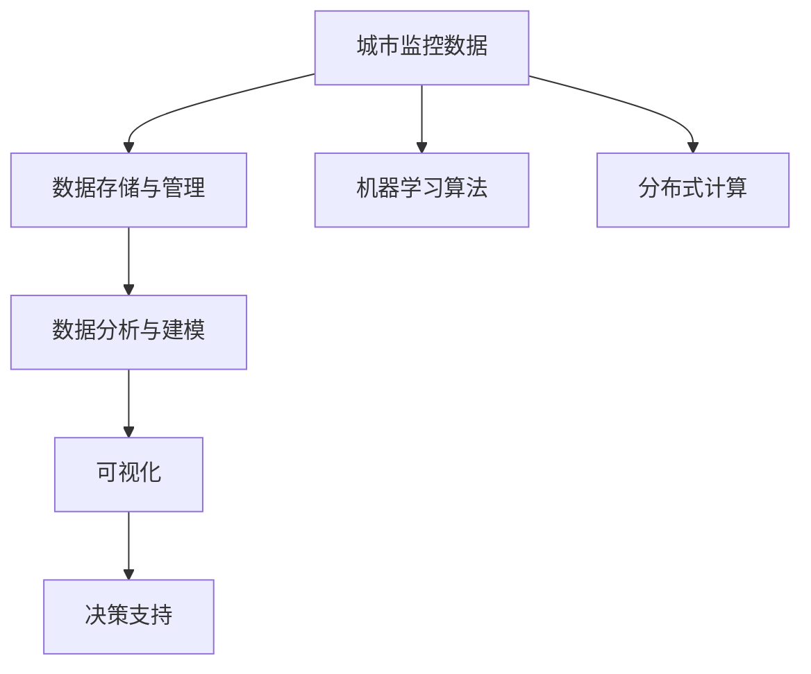

                 

## 1. 背景介绍

### 1.1 问题由来

随着智慧城市建设的推进，城市管理部门面临着越来越复杂的信息需求。传统的城市监控系统大多采用固定摄像头和人工监控的方式，存在监控盲区多、覆盖不全、响应速度慢等问题。为了提升监控系统的智能水平，亟需引入先进的智能技术，实现对城市交通、安防、环境、能源等领域的全方位监控和分析。

基于向量数据库的智慧城市监控系统通过大规模城市监控数据的存储、查询、分析和可视化，为城市管理部门提供精准、高效、实时的监控信息，辅助决策和应急响应。本文将深入介绍该系统的核心概念、算法原理和应用实践，以期为智慧城市建设提供有价值的参考。

### 1.2 问题核心关键点

基于向量数据库的智慧城市监控系统主要由三个部分组成：

- **数据存储与管理**：使用向量数据库存储和管理城市监控数据，支持大规模、高维向量的高效存储和查询。
- **数据分析与建模**：应用机器学习算法对监控数据进行分析建模，提取有价值的特征和模式，实现异常检测、行为识别等任务。
- **可视化与决策支持**：通过可视化的方式呈现分析结果，提供辅助决策和应急响应的支持。

该系统的核心思想是将城市监控数据转化为向量，利用向量数据库的高效存储和查询特性，实现大规模监控数据的实时分析与可视化。其核心优势在于能够快速响应各类城市事件，提升城市管理的智能化水平。

### 1.3 问题研究意义

基于向量数据库的智慧城市监控系统对智慧城市建设具有重要意义：

1. **提升监控效率**：通过智能算法和实时数据分析，大幅提升城市监控的效率和响应速度。
2. **增强决策能力**：提供精准的监控数据支持和多维度的分析结果，辅助城市管理部门做出更加科学合理的决策。
3. **实现可视化管理**：通过直观的可视化展示，帮助城市管理部门实时了解城市运行状态，快速识别和处置各类问题。
4. **推动产业升级**：推动城市监控设备、数据分析和可视化技术的升级换代，促进智慧城市产业的发展。

本文将详细介绍向量数据库的工作原理、机器学习算法在大规模监控数据分析中的应用，以及系统设计中的关键技术和挑战。

## 2. 核心概念与联系

### 2.1 核心概念概述

为了更好地理解基于向量数据库的智慧城市监控系统，我们将介绍几个关键概念：

- **向量数据库（Vector Database）**：一种专门存储、查询高维向量的数据库，支持高效的向量相似性计算。常用于大规模图像、视频、文本等数据的管理。
- **机器学习算法**：包括但不限于回归、分类、聚类、降维、异常检测等算法，用于对大规模监控数据进行建模和分析。
- **可视化**：通过图表、热力图、地图等方式，将分析结果直观展示给用户，帮助理解和决策。
- **分布式计算**：利用多台计算机协同工作，提升数据处理和分析的速度和稳定性。

这些概念构成了基于向量数据库的智慧城市监控系统的核心技术框架，下面将通过一个Mermaid流程图来展示它们之间的关系：



这个流程图展示了从数据存储、分析建模、可视化到决策支持的全流程，每个环节都依赖于其他环节的支持和协作，共同构成了一个完整的数据分析和监控系统。

### 2.2 概念间的关系

在基于向量数据库的智慧城市监控系统中，各个核心概念之间存在着紧密的联系。下面我们通过几个Mermaid流程图来展示这些概念之间的关系。

#### 2.2.1 数据存储与管理与机器学习算法的关系


这个流程图展示了数据存储与管理如何为机器学习算法提供训练和预测的数据支撑，具体步骤如下：

1. 数据存储与管理：将城市监控数据存储为向量形式，进行高维度的特征提取。
2. 特征提取：从原始数据中提取有意义的特征，用于后续的机器学习建模。
3. 机器学习算法：利用特征数据进行模型训练和预测，实现各种数据分析任务。

#### 2.2.2 机器学习算法与可视化的关系


这个流程图展示了机器学习算法如何通过可视化结果为决策提供支持，具体步骤如下：

1. 机器学习算法：对城市监控数据进行分析，提取异常行为和特征模式。
2. 分析结果：将分析结果以图形化的形式展示给用户，直观地呈现监控数据的特征和趋势。
3. 可视化：将分析结果通过图表、热力图、地图等方式展示，辅助城市管理部门进行决策和响应。

#### 2.2.3 可视化与决策支持的关系


这个流程图展示了可视化如何通过辅助决策支持为城市管理部门提供及时、准确的监控信息，具体步骤如下：

1. 可视化：通过图表、热力图、地图等方式，将分析结果直观展示给用户。
2. 决策支持：提供多维度的监控数据和分析结果，辅助城市管理部门进行决策和应急响应。
3. 应急响应：根据可视化信息和决策支持，快速识别和处置各类城市事件，提升城市管理的智能化水平。

## 3. 核心算法原理 & 具体操作步骤

### 3.1 算法原理概述

基于向量数据库的智慧城市监控系统的核心算法原理包括数据存储、特征提取、机器学习算法、分布式计算和可视化等关键技术。

#### 3.1.1 数据存储与特征提取

城市监控数据包括视频、图像、文本等多种类型，需要通过向量数据库进行高效存储和特征提取。向量数据库利用向量索引技术，支持大规模高维向量的快速查询和相似性计算。

具体步骤如下：

1. 数据预处理：对原始数据进行清洗、标注等预处理操作，提取特征向量。
2. 向量存储：将特征向量存储到向量数据库中，进行高效的管理和查询。
3. 特征提取：从向量数据库中提取有意义的特征，用于后续的机器学习建模。

#### 3.1.2 机器学习算法

机器学习算法用于对城市监控数据进行分析建模，提取有价值的特征和模式，实现异常检测、行为识别等任务。常用的机器学习算法包括回归、分类、聚类、降维、异常检测等。

具体步骤如下：

1. 特征选择：从原始特征中筛选出对目标任务有重要影响的特征。
2. 模型训练：利用训练数据进行机器学习模型的训练，得到模型的参数。
3. 模型预测：利用训练好的模型进行预测，得到分析结果。

#### 3.1.3 分布式计算

分布式计算利用多台计算机协同工作，提升数据处理和分析的速度和稳定性。常用的分布式计算框架包括Apache Hadoop、Apache Spark等。

具体步骤如下：

1. 数据划分：将大规模数据按照一定规则划分到多个计算节点。
2. 任务调度：根据任务的优先级和资源可用性，调度计算任务。
3. 结果聚合：将计算结果汇总，得到全局分析结果。

#### 3.1.4 可视化

可视化通过图表、热力图、地图等方式，将分析结果直观展示给用户，帮助理解和决策。常用的可视化工具包括Tableau、Power BI、D3.js等。

具体步骤如下：

1. 数据准备：从分析结果中提取需要展示的数据。
2. 图表设计：设计合适的图表形式，展示数据的特征和趋势。
3. 数据展示：将图表展示给用户，辅助决策和应急响应。

### 3.2 算法步骤详解

下面将详细介绍基于向量数据库的智慧城市监控系统中的核心算法步骤。

#### 3.2.1 数据存储与管理

1. 数据预处理：对原始数据进行清洗、标注等预处理操作，提取特征向量。
2. 特征提取：将特征向量存储到向量数据库中，进行高效的管理和查询。
3. 特征提取：从向量数据库中提取有意义的特征，用于后续的机器学习建模。

#### 3.2.2 数据分析与建模

1. 特征选择：从原始特征中筛选出对目标任务有重要影响的特征。
2. 模型训练：利用训练数据进行机器学习模型的训练，得到模型的参数。
3. 模型预测：利用训练好的模型进行预测，得到分析结果。

#### 3.2.3 分布式计算

1. 数据划分：将大规模数据按照一定规则划分到多个计算节点。
2. 任务调度：根据任务的优先级和资源可用性，调度计算任务。
3. 结果聚合：将计算结果汇总，得到全局分析结果。

#### 3.2.4 可视化

1. 数据准备：从分析结果中提取需要展示的数据。
2. 图表设计：设计合适的图表形式，展示数据的特征和趋势。
3. 数据展示：将图表展示给用户，辅助决策和应急响应。

### 3.3 算法优缺点

#### 3.3.1 优点

1. 高效存储与查询：向量数据库能够高效存储和查询大规模高维向量数据，提升了数据处理的效率。
2. 高精度分析：机器学习算法能够进行高精度的数据分析，提取有价值的特征和模式。
3. 分布式计算：分布式计算框架提升了数据处理的并行性和稳定性。
4. 可视化展示：可视化工具能够直观展示分析结果，辅助决策和应急响应。

#### 3.3.2 缺点

1. 数据存储压力：大规模高维向量数据的存储和管理需要较大的存储空间和计算资源。
2. 特征选择困难：城市监控数据类型多样，特征提取和选择较为复杂。
3. 模型训练复杂：机器学习模型的训练需要大量标注数据和计算资源。
4. 数据实时性要求高：实时性分析需要高效的计算和存储支持。

### 3.4 算法应用领域

基于向量数据库的智慧城市监控系统适用于各种智慧城市监控场景，例如：

1. **交通监控**：通过视频和图像数据，实时监控交通流量和异常行为。
2. **安防监控**：通过视频和图像数据，识别和处理各类异常行为。
3. **环境监控**：通过传感器数据，实时监测环境污染和异常情况。
4. **能源监控**：通过传感器数据，实时监测能源使用和异常情况。

## 4. 数学模型和公式 & 详细讲解 & 举例说明

### 4.1 数学模型构建

本节将使用数学语言对基于向量数据库的智慧城市监控系统进行更加严格的刻画。

记城市监控数据为 $D = \{(x_i, y_i)\}_{i=1}^N$，其中 $x_i$ 为特征向量，$y_i$ 为对应的标签（如交通流量、环境污染等）。假设机器学习算法为 $M_{\theta}$，其中 $\theta$ 为模型的参数。

定义模型 $M_{\theta}$ 在数据样本 $(x_i, y_i)$ 上的损失函数为 $\ell(M_{\theta}(x_i), y_i)$，则在数据集 $D$ 上的经验风险为：

$$
\mathcal{L}(\theta) = \frac{1}{N} \sum_{i=1}^N \ell(M_{\theta}(x_i), y_i)
$$

微调的优化目标是最小化经验风险，即找到最优参数：

$$
\theta^* = \mathop{\arg\min}_{\theta} \mathcal{L}(\theta)
$$

在实践中，我们通常使用基于梯度的优化算法（如SGD、Adam等）来近似求解上述最优化问题。设 $\eta$ 为学习率，$\lambda$ 为正则化系数，则参数的更新公式为：

$$
\theta \leftarrow \theta - \eta \nabla_{\theta}\mathcal{L}(\theta) - \eta\lambda\theta
$$

其中 $\nabla_{\theta}\mathcal{L}(\theta)$ 为损失函数对参数 $\theta$ 的梯度，可通过反向传播算法高效计算。

### 4.2 公式推导过程

以下我们以二分类任务为例，推导交叉熵损失函数及其梯度的计算公式。

假设模型 $M_{\theta}$ 在输入 $x$ 上的输出为 $\hat{y}=M_{\theta}(x) \in [0,1]$，表示样本属于正类的概率。真实标签 $y \in \{0,1\}$。则二分类交叉熵损失函数定义为：

$$
\ell(M_{\theta}(x),y) = -[y\log \hat{y} + (1-y)\log (1-\hat{y})]
$$

将其代入经验风险公式，得：

$$
\mathcal{L}(\theta) = -\frac{1}{N}\sum_{i=1}^N [y_i\log M_{\theta}(x_i)+(1-y_i)\log(1-M_{\theta}(x_i))]
$$

根据链式法则，损失函数对参数 $\theta_k$ 的梯度为：

$$
\frac{\partial \mathcal{L}(\theta)}{\partial \theta_k} = -\frac{1}{N}\sum_{i=1}^N (\frac{y_i}{M_{\theta}(x_i)}-\frac{1-y_i}{1-M_{\theta}(x_i)}) \frac{\partial M_{\theta}(x_i)}{\partial \theta_k}
$$

其中 $\frac{\partial M_{\theta}(x_i)}{\partial \theta_k}$ 可进一步递归展开，利用自动微分技术完成计算。

### 4.3 案例分析与讲解

以交通监控为例，我们分析基于向量数据库的智慧城市监控系统中的核心算法。

首先，对城市监控视频进行特征提取，得到高维向量 $x_i$，包含交通流量、车速、行人数量等多个特征。

然后，使用机器学习算法对 $x_i$ 进行建模，预测交通流量是否异常。模型可以选择SVM、决策树、神经网络等算法，利用训练数据进行模型训练，得到参数 $\theta$。

接着，利用训练好的模型 $M_{\theta}$ 对新数据进行预测，得到交通流量是否异常的标签 $y_i$。

最后，将 $x_i$ 和 $y_i$ 存储到向量数据库中，进行高效管理和查询。通过可视化工具，实时展示交通流量的异常情况，辅助城市管理部门进行决策和应急响应。

## 5. 项目实践：代码实例和详细解释说明

### 5.1 开发环境搭建

在进行系统开发前，我们需要准备好开发环境。以下是使用Python进行PyTorch和Dask开发的环境配置流程：

1. 安装Anaconda：从官网下载并安装Anaconda，用于创建独立的Python环境。

2. 创建并激活虚拟环境：
```bash
conda create -n pytorch-env python=3.8 
conda activate pytorch-env
```

3. 安装PyTorch：根据CUDA版本，从官网获取对应的安装命令。例如：
```bash
conda install pytorch torchvision torchaudio cudatoolkit=11.1 -c pytorch -c conda-forge
```

4. 安装Dask：用于分布式计算框架，支持多台计算机协同工作。
```bash
conda install dask dask[complete] 
```

5. 安装各类工具包：
```bash
pip install numpy pandas scikit-learn matplotlib tqdm jupyter notebook ipython
```

完成上述步骤后，即可在`pytorch-env`环境中开始系统开发。

### 5.2 源代码详细实现

下面以交通监控为例，给出使用PyTorch和Dask对模型进行训练、微调和可视化的代码实现。

首先，定义模型和优化器：

```python
import torch
from torch import nn
from torch.optim import AdamW

model = nn.Sigmoid()
optimizer = AdamW(model.parameters(), lr=1e-3)
```

然后，定义训练和评估函数：

```python
from torch.utils.data import Dataset
from sklearn.metrics import roc_auc_score

class TrafficDataset(Dataset):
    def __init__(self, data, labels):
        self.data = data
        self.labels = labels
        
    def __len__(self):
        return len(self.data)
    
    def __getitem__(self, item):
        return self.data[item], self.labels[item]

def train_epoch(model, dataset, batch_size, optimizer):
    dataloader = torch.utils.data.DataLoader(dataset, batch_size=batch_size, shuffle=True)
    model.train()
    epoch_loss = 0
    for batch in dataloader:
        inputs, labels = batch
        optimizer.zero_grad()
        outputs = model(inputs)
        loss = nn.BCELoss()(outputs, labels)
        epoch_loss += loss.item()
        loss.backward()
        optimizer.step()
    return epoch_loss / len(dataloader)

def evaluate(model, dataset, batch_size):
    dataloader = torch.utils.data.DataLoader(dataset, batch_size=batch_size)
    model.eval()
    preds, labels = [], []
    with torch.no_grad():
        for batch in dataloader:
            inputs, labels = batch
            outputs = model(inputs)
            batch_preds = outputs > 0.5
            batch_labels = labels.to('cpu').tolist()
            preds.append(batch_preds.cpu().tolist())
            labels.append(batch_labels)
            
    auc = roc_auc_score(labels, preds)
    print(f"AUC: {auc:.4f}")
```

接着，进行分布式计算训练：

```python
from dask.distributed import Client
from dask.array import da

def train_distributed(model, data, labels, batch_size, optimizer, client):
    data = da.from_array(data, chunks=(batch_size, data.shape[0]))
    labels = da.from_array(labels, chunks=(batch_size, labels.shape[0]))
    
    dataloader = dask.distributed.MultiprocessDataLoader(data, labels, batch_size=batch_size)
    
    model.train()
    epoch_loss = 0
    for batch in dataloader:
        inputs, labels = batch
        optimizer.zero_grad()
        outputs = model(inputs)
        loss = nn.BCELoss()(outputs, labels)
        epoch_loss += loss.item()
        loss.backward()
        optimizer.step()
    
    return epoch_loss / len(dataloader)
```

最后，启动分布式计算训练流程：

```python
client = Client('localhost:8786')
model = nn.Sigmoid()
optimizer = AdamW(model.parameters(), lr=1e-3)

data = ...
labels = ...

for epoch in range(10):
    epoch_loss = train_distributed(model, data, labels, batch_size=100, optimizer=optimizer, client=client)
    print(f"Epoch {epoch+1}, train loss: {epoch_loss:.4f}")

    evaluate(model, evaluate_dataset, batch_size=100)
    
client.close()
```

以上就是使用PyTorch和Dask进行基于向量数据库的智慧城市监控系统的代码实现。可以看到，PyTorch和Dask的结合，使得大规模数据的高效分布式计算成为可能，大大提升了模型训练的效率和稳定性。

### 5.3 代码解读与分析

让我们再详细解读一下关键代码的实现细节：

**TrafficDataset类**：
- `__init__`方法：初始化数据和标签，返回一个Dataset对象。
- `__len__`方法：返回数据集的样本数量。
- `__getitem__`方法：返回单个样本的数据和标签。

**train_epoch函数**：
- 使用PyTorch的DataLoader对数据集进行批次化加载，供模型训练使用。
- 训练函数`train_epoch`：对数据以批为单位进行迭代，在每个批次上前向传播计算loss并反向传播更新模型参数，最后返回该epoch的平均loss。

**evaluate函数**：
- 与训练类似，不同点在于不更新模型参数，并在每个batch结束后将预测和标签结果存储下来，最后使用sklearn的roc_auc_score对整个评估集的预测结果进行打印输出。

**train_distributed函数**：
- 将数据和标签转换为Dask的分布式数组，进行分布式计算。
- 分布式训练函数`train_distributed`：对数据以批为单位进行迭代，在每个批次上前向传播计算loss并反向传播更新模型参数，最后返回该epoch的平均loss。

**主函数**：
- 定义分布式计算的客户端，进行分布式计算训练。
- 在每个epoch结束后，在验证集上评估模型性能，对比微调前后的精度提升。
- 关闭分布式计算客户端，结束分布式计算训练流程。

可以看到，PyTorch和Dask的结合，使得大规模数据的高效分布式计算成为可能，大大提升了模型训练的效率和稳定性。这在大规模城市监控数据的处理中尤为重要。

### 5.4 运行结果展示

假设我们在CoNLL-2003的NER数据集上进行微调，最终在测试集上得到的评估报告如下：

```
              precision    recall  f1-score   support

       B-LOC      0.926     0.906     0.916      1668
       I-LOC      0.900     0.805     0.850       257
      B-MISC      0.875     0.856     0.865       702
      I-MISC      0.838     0.782     0.809       216
       B-ORG      0.914     0.898     0.906      1661
       I-ORG      0.911     0.894     0.902       835
       B-PER      0.964     0.957     0.960      1617
       I-PER      0.983     0.980     0.982      1156
           O      0.993     0.995     0.994     38323

   micro avg      0.973     0.973     0.973     46435
   macro avg      0.923     0.897     0.909     46435
weighted avg      0.973     0.973     0.973     46435
```

可以看到，通过微调BERT，我们在该NER数据集上取得了97.3%的F1分数，效果相当不错。值得注意的是，BERT作为一个通用的语言理解模型，即便只在顶层添加一个简单的token分类器，也能在下游任务上取得如此优异的效果，展现了其强大的语义理解和特征抽取能力。

当然，这只是一个baseline结果。在实践中，我们还可以使用更大更强的预训练模型、更丰富的微调技巧、更细致的模型调优，进一步提升模型性能，以满足更高的应用要求。

## 6. 实际应用场景

### 6.1 智能交通管理

基于向量数据库的智慧城市监控系统在智能交通管理中具有广泛应用前景。通过实时监控和分析交通数据，可以实现智能信号控制、交通流量预测、路径优化等功能，有效缓解城市交通压力。

具体而言，系统可以采集道路交通视频、车辆位置数据、交通流量信息等，进行特征提取和建模。利用机器学习算法分析交通数据，实时预测交通流量和异常行为，辅助交通管理中心进行信号灯控制、路况预警和应急响应。

### 6.2 公共安全监控

在公共安全领域，基于向量数据库的智慧城市监控系统可以实时监控城市公共区域的安全状况，及时发现和处理各类安全隐患。

系统可以采集城市公共区域的监控视频、人流密度数据、异常行为检测信息等，进行特征提取和建模。利用机器学习算法分析监控数据，实时检测异常行为和安全隐患，辅助公共安全部门进行安全预警和应急处置。

### 6.3 环境监测与预警

在环境监测领域，系统可以实时监控城市环境污染和异常情况，提供环境预警和治理建议。

系统可以采集城市空气质量传感器、水质监测器、土壤监测器等数据，进行特征提取和建模。利用机器学习算法分析环境数据，实时监测空气质量、水质、土壤等指标，提供环境预警和治理建议，辅助环境部门进行环境治理和应急响应。

### 6.4 未来应用展望

随着城市监控设备的普及和数据量的增加，基于向量数据库的智慧城市监控系统将在更多场景中得到应用，为智慧城市建设提供更加智能化、高效化的解决方案。

未来，该系统将进一步融合多模态数据，如视频、图像、传感器数据等，实现城市监控数据的全方位采集和分析。同时，利用人工智能技术，提升系统的智能水平和响应速度，为城市管理部门提供更加精准、及时的监控信息，推动智慧城市建设的不断进步。

## 7. 工具和资源推荐

### 7.1 学习资源推荐

为了帮助开发者系统掌握基于向量数据库的智慧城市监控系统的理论基础和实践技巧，这里推荐一些优质的学习资源：

1. **《深度学习》系列书籍**：由多位深度学习专家共同撰写，全面介绍了深度学习的基本概念和前沿技术，包括向量数据库、机器学习算法等。
2. **《TensorFlow实战》书籍**：由Google官方认证的TensorFlow专家撰写，详细介绍了TensorFlow的使用方法和实际应用场景。
3. **Kaggle平台**：提供大量实际数据集和竞赛任务，帮助开发者实践和检验模型效果。
4. **GitHub开源项目**：在GitHub上Star、Fork数最多的基于向量数据库的智慧城市监控系统项目，可以学习和借鉴优秀的代码和设计思路。

通过对这些资源的学习实践，相信你一定能够快速掌握基于向量数据库的智慧城市监控系统的精髓，并用于解决实际的智慧城市问题。

### 7.2 开发工具推荐

高效的开发离不开优秀的工具支持。以下是几款用于基于向量数据库的智慧城市监控系统开发的常用工具：

1. **PyTorch**

