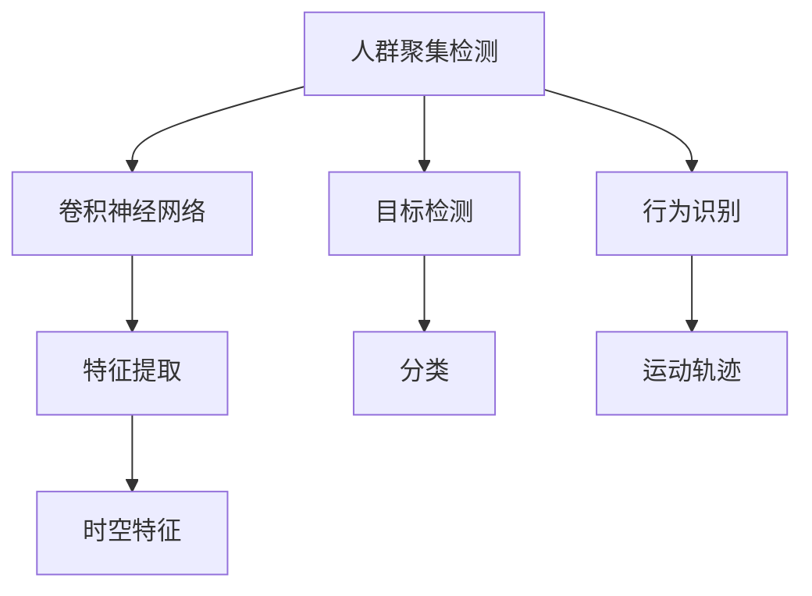
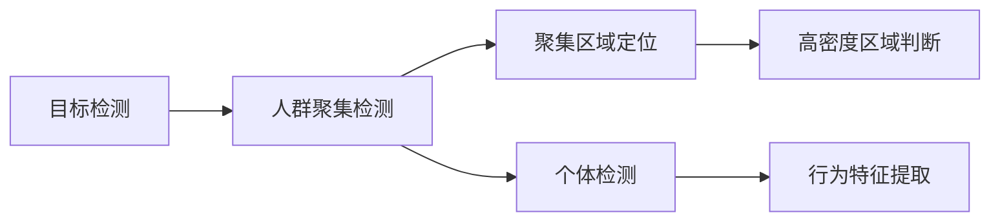
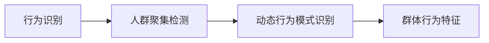
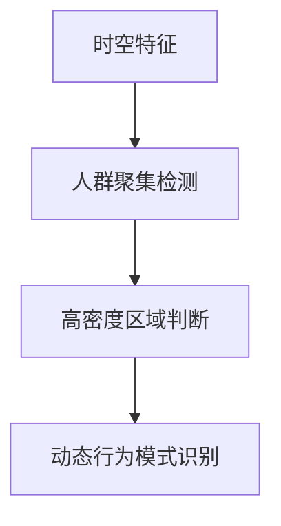

                 

# 基于图像的人群聚集检测算法研究与实现

## 1. 背景介绍

### 1.1 问题由来
人群聚集检测在城市安全、交通管理、商业分析等多个领域具有重要应用价值。当出现大规模人群聚集时，如何准确快速地识别和定位，及时响应潜在风险，是当前技术面临的挑战。特别是对于监控视频数据的实时分析，传统的基于手工设计特征的方法，无法处理高维度和非结构化图像数据。

近年来，随着深度学习技术的迅猛发展，基于卷积神经网络(CNN)的端到端人群检测算法，在精度和速度上取得了显著提升。特别是YOLO系列、Faster R-CNN等目标检测算法，已经在COCO等标准数据集上取得了SOTA效果。

然而，这些算法在人群检测任务上，往往聚焦于个体检测和识别，难以处理群体行为的动态变化。因此，如何结合群体行为特征，构建针对人群聚集的检测算法，是一个亟待解决的问题。

### 1.2 问题核心关键点
人群聚集检测的核心在于识别人群中的潜在风险，如拥堵、踩踏等。这要求检测算法不仅要准确识别人群个体，还要捕捉群体行为的动态变化。为此，我们提出了基于目标检测和行为识别的结合算法，通过引入群体的时空特征，提升人群聚集检测的准确性和鲁棒性。

## 2. 核心概念与联系

### 2.1 核心概念概述

为更好地理解基于图像的人群聚集检测算法，本节将介绍几个关键概念：

- 人群聚集检测：指在监控视频数据中，准确识别和定位人群聚集区域，捕捉群体行为的动态变化。
- 卷积神经网络(CNN)：一种前馈神经网络，通过多层卷积、池化操作提取特征，适用于处理高维度和非结构化图像数据。
- 目标检测：通过分类和定位技术，在图像中准确识别出感兴趣的物体。
- 行为识别：通过人体姿态、运动轨迹等数据，识别出人群行为的动态模式。
- 时空特征：指将时间维度与空间维度相结合，捕捉动态变化的群体行为特征。

这些核心概念之间存在着紧密的联系，构成了人群聚集检测的整体框架。下面通过Mermaid流程图来展示它们之间的关系：



这个流程图展示了核心概念之间的逻辑关系：

1. 人群聚集检测任务依赖于目标检测和行为识别。
2. 卷积神经网络通过多层卷积和池化操作，提取图像的特征。
3. 目标检测通过分类和定位技术，将检测结果输出到人群聚集检测任务。
4. 行为识别通过捕捉人群运动的轨迹，识别群体行为的动态模式。
5. 时空特征通过结合时间与空间信息，捕捉群体行为的动态变化。

### 2.2 概念间的关系

这些核心概念之间的联系进一步细化为多个子关系，构成人群聚集检测算法的完整架构。

#### 2.2.1 目标检测与人群聚集检测



这个流程图展示了目标检测在人群聚集检测中的应用：

1. 目标检测通过分类和定位技术，将图像中的个体识别出来。
2. 人群聚集检测任务通过检测到的个体信息，判断人群密度，并进行高密度区域的定位。
3. 行为特征提取基于个体检测的结果，捕捉人群动态变化的模式。

#### 2.2.2 行为识别与人群聚集检测



这个流程图展示了行为识别在人群聚集检测中的应用：

1. 行为识别通过捕捉人群运动的轨迹，识别出群体行为的动态模式。
2. 人群聚集检测任务结合个体检测和行为识别的结果，判断群体行为的动态变化。
3. 群体行为特征基于行为识别结果，捕捉人群动态变化的模式。

#### 2.2.3 时空特征与人群聚集检测



这个流程图展示了时空特征在人群聚集检测中的应用：

1. 时空特征通过结合时间与空间信息，捕捉群体行为的动态变化。
2. 人群聚集检测任务结合个体检测和时空特征的结果，判断人群密度和动态变化。
3. 动态行为模式识别基于时空特征的结果，捕捉群体行为的动态模式。

## 3. 核心算法原理 & 具体操作步骤
### 3.1 算法原理概述

基于图像的人群聚集检测算法，主要由目标检测、行为识别和时空特征三个模块组成。其核心原理是将目标检测的输出与行为识别的结果结合，并引入时空特征捕捉群体行为的动态变化。

具体而言，算法流程如下：

1. **目标检测模块**：使用CNN网络对输入图像进行特征提取，并通过分类和定位技术，识别出图像中的个体。
2. **行为识别模块**：基于目标检测的结果，使用行为识别网络捕捉人群运动的轨迹，识别出群体行为的动态模式。
3. **时空特征模块**：结合个体检测和行为识别的结果，捕捉人群的动态变化，生成时空特征。
4. **人群聚集检测模块**：综合时空特征和行为识别的结果，判断人群密度和动态变化，进行高密度区域的定位。

### 3.2 算法步骤详解

#### 3.2.1 目标检测模块

1. **网络结构选择**：选择合适的CNN网络结构，如YOLO、Faster R-CNN等，用于特征提取和目标分类。
2. **数据集准备**：收集训练集和测试集，标注人群个体的位置和类别。
3. **模型训练**：使用训练集对CNN网络进行训练，优化模型参数，使其在目标检测任务上取得较好的效果。
4. **检测结果输出**：将测试集输入训练好的CNN网络，输出人群个体的检测框和类别。

#### 3.2.2 行为识别模块

1. **网络结构选择**：选择合适的行为识别网络结构，如RNN、LSTM等，用于捕捉人群运动的轨迹。
2. **数据集准备**：收集训练集和测试集，标注人群运动的轨迹和类别。
3. **模型训练**：使用训练集对行为识别网络进行训练，优化模型参数，使其在行为识别任务上取得较好的效果。
4. **行为特征提取**：将目标检测模块的输出作为输入，使用训练好的行为识别网络，捕捉人群动态变化的模式，输出行为特征。

#### 3.2.3 时空特征模块

1. **特征提取**：将目标检测和行为识别的结果，通过时间序列和空间坐标相结合的方式，生成时空特征。
2. **特征处理**：对时空特征进行归一化、平滑等处理，减少噪声影响。
3. **特征融合**：将时空特征与个体检测和行为识别的结果结合，生成综合的群体行为特征。

#### 3.2.4 人群聚集检测模块

1. **高密度区域判断**：结合时空特征和行为识别的结果，判断人群密度和动态变化。
2. **聚类算法应用**：使用聚类算法对高密度区域进行聚类，确定人群聚集区域。
3. **输出结果**：将人群聚集区域输出到可视化界面，并生成人群聚集检测报告。

### 3.3 算法优缺点

基于图像的人群聚集检测算法具有以下优点：

1. **高精度**：结合目标检测和行为识别，能够准确识别个体和群体行为，提高检测精度。
2. **鲁棒性**：引入时空特征，捕捉动态变化，增强了算法的鲁棒性和泛化能力。
3. **实时性**：利用端到端网络，减少中间处理环节，提高了检测速度。
4. **可扩展性**：算法可以应用于多种场景，如城市监控、购物中心等。

同时，该算法也存在一些局限性：

1. **标注成本高**：需要大量高质量标注数据，标注成本较高。
2. **模型复杂度**：结合多个模块，模型结构较为复杂，训练难度较大。
3. **计算资源需求高**：由于使用了多个CNN网络和行为识别网络，计算资源需求较高。
4. **场景局限性**：对于复杂场景，如交叉路口、公共场所等，检测效果可能不如传统方法。

### 3.4 算法应用领域

基于图像的人群聚集检测算法，可以应用于以下多个领域：

- **城市监控**：实时监控城市公共场所，识别高密度人群区域，防止踩踏事件。
- **购物中心**：监控购物中心入口，识别拥堵人群，优化客流管理。
- **交通管理**：识别公路上的拥堵区域，进行交通疏导，提升通行效率。
- **大型活动**：在大型活动现场，识别高密度区域，保障安全。
- **赛事监测**：监控体育赛事观众，防止不安全行为，保障比赛秩序。

## 4. 数学模型和公式 & 详细讲解 & 举例说明

### 4.1 数学模型构建

假设输入图像为 $I$，目标检测模块输出人群个体的检测框 $R$ 和类别 $C$，行为识别模块输出行为特征 $F$，时空特征模块输出群体行为的时空特征 $T$。人群聚集检测的目标是生成人群聚集区域 $A$。

数学模型可形式化为：

$$
A = \mathop{\arg\max}_{A} f(R, C, F, T, A)
$$

其中 $f$ 为优化函数，用于衡量人群聚集区域的综合质量，包括精度、鲁棒性、实时性等指标。

### 4.2 公式推导过程

以目标检测和行为识别为例，推导相关的数学公式。

**目标检测模块**：

- **网络结构选择**：假设使用YOLOv3网络，输入为 $I$，输出为 $(R, C)$。
- **数据集准备**：收集训练集和测试集，标注人群个体的检测框 $R$ 和类别 $C$。
- **模型训练**：使用训练集对YOLOv3网络进行训练，优化模型参数，得到检测框和类别输出。

**行为识别模块**：

- **网络结构选择**：假设使用LSTM网络，输入为 $R$，输出为 $F$。
- **数据集准备**：收集训练集和测试集，标注人群运动的轨迹 $F$。
- **模型训练**：使用训练集对LSTM网络进行训练，优化模型参数，得到行为特征输出。

**时空特征模块**：

- **特征提取**：将检测框和行为特征通过时间序列和空间坐标相结合，生成时空特征 $T$。
- **特征处理**：对时空特征进行归一化、平滑等处理，减少噪声影响。
- **特征融合**：将时空特征与检测框和行为特征结合，生成综合的群体行为特征。

**人群聚集检测模块**：

- **高密度区域判断**：结合时空特征和行为特征，判断人群密度和动态变化。
- **聚类算法应用**：使用K-means聚类算法对高密度区域进行聚类，确定人群聚集区域。
- **输出结果**：将人群聚集区域输出到可视化界面，并生成人群聚集检测报告。

### 4.3 案例分析与讲解

假设在城市监控视频中，我们希望检测人群聚集区域。具体步骤如下：

1. **目标检测**：使用YOLOv3网络对输入图像 $I$ 进行特征提取，输出人群个体的检测框 $R$ 和类别 $C$。
2. **行为识别**：基于检测框 $R$，使用LSTM网络捕捉人群运动的轨迹，输出行为特征 $F$。
3. **时空特征**：将检测框 $R$ 和行为特征 $F$ 通过时间序列和空间坐标相结合，生成时空特征 $T$。
4. **人群聚集检测**：结合时空特征 $T$ 和行为特征 $F$，使用K-means聚类算法对高密度区域进行聚类，确定人群聚集区域 $A$。
5. **输出结果**：将人群聚集区域 $A$ 输出到可视化界面，并生成人群聚集检测报告。

## 5. 项目实践：代码实例和详细解释说明

### 5.1 开发环境搭建

在进行人群聚集检测算法开发前，我们需要准备好开发环境。以下是使用Python进行TensorFlow开发的环境配置流程：

1. 安装Anaconda：从官网下载并安装Anaconda，用于创建独立的Python环境。

2. 创建并激活虚拟环境：
```bash
conda create -n tf-env python=3.8 
conda activate tf-env
```

3. 安装TensorFlow：根据CUDA版本，从官网获取对应的安装命令。例如：
```bash
pip install tensorflow==2.3
```

4. 安装各类工具包：
```bash
pip install numpy pandas scikit-learn matplotlib tqdm jupyter notebook ipython
```

完成上述步骤后，即可在`tf-env`环境中开始人群聚集检测算法的开发。

### 5.2 源代码详细实现

这里我们以YOLOv3和LSTM为例，给出人群聚集检测算法的PyTorch代码实现。

首先，定义YOLOv3模型：

```python
import torch
import torch.nn as nn
import torch.optim as optim

class YOLOv3(nn.Module):
    def __init__(self, num_classes=5):
        super(YOLOv3, self).__init__()
        self.num_classes = num_classes
        self.conv1 = nn.Conv2d(3, 32, 3, 1, 1)
        self.conv2 = nn.Conv2d(32, 64, 3, 2, 1)
        self.conv3 = nn.Conv2d(64, 128, 3, 2, 1)
        self.conv4 = nn.Conv2d(128, 256, 3, 2, 1)
        self.conv5 = nn.Conv2d(256, 512, 3, 2, 1)
        self.conv6 = nn.Conv2d(512, 1024, 3, 2, 1)
        self.conv7 = nn.Conv2d(1024, 512, 3, 2, 1)
        self.conv8 = nn.Conv2d(512, 256, 3, 1, 1)
        self.conv9 = nn.Conv2d(256, num_classes, 3, 1, 1)
    
    def forward(self, x):
        x = self.conv1(x)
        x = nn.ReLU(inplace=True)(x)
        x = self.conv2(x)
        x = nn.ReLU(inplace=True)(x)
        x = self.conv3(x)
        x = nn.ReLU(inplace=True)(x)
        x = self.conv4(x)
        x = nn.ReLU(inplace=True)(x)
        x = self.conv5(x)
        x = nn.ReLU(inplace=True)(x)
        x = self.conv6(x)
        x = nn.ReLU(inplace=True)(x)
        x = self.conv7(x)
        x = nn.ReLU(inplace=True)(x)
        x = self.conv8(x)
        x = nn.ReLU(inplace=True)(x)
        x = self.conv9(x)
        x = nn.Sigmoid()(x)
        return x
```

接着，定义LSTM模型：

```python
import torch.nn as nn
import torch.optim as optim

class LSTM(nn.Module):
    def __init__(self, input_size, hidden_size, num_layers, num_classes):
        super(LSTM, self).__init__()
        self.input_size = input_size
        self.hidden_size = hidden_size
        self.num_layers = num_layers
        self.num_classes = num_classes
        self.lstm = nn.LSTM(input_size, hidden_size, num_layers, batch_first=True)
        self.fc = nn.Linear(hidden_size, num_classes)
    
    def forward(self, x):
        h0 = torch.zeros(self.num_layers, x.size(0), self.hidden_size).to(device)
        c0 = torch.zeros(self.num_layers, x.size(0), self.hidden_size).to(device)
        out, _ = self.lstm(x, (h0, c0))
        out = self.fc(out[:, -1, :])
        return out
```

然后，定义目标检测和行为识别的训练函数：

```python
def train_detector(model, optimizer, criterion, data_loader, epochs):
    device = torch.device('cuda' if torch.cuda.is_available() else 'cpu')
    model.to(device)
    
    for epoch in range(epochs):
        model.train()
        for batch in data_loader:
            inputs, labels = batch
            inputs, labels = inputs.to(device), labels.to(device)
            optimizer.zero_grad()
            outputs = model(inputs)
            loss = criterion(outputs, labels)
            loss.backward()
            optimizer.step()
            print('Epoch [{}/{}], Loss: {:.4f}'.format(epoch+1, epochs, loss.item()))
    
    print('Training Finished')
```

接着，定义人群聚集检测的训练函数：

```python
def train_detector(model, optimizer, criterion, data_loader, epochs):
    device = torch.device('cuda' if torch.cuda.is_available() else 'cpu')
    model.to(device)
    
    for epoch in range(epochs):
        model.train()
        for batch in data_loader:
            inputs, labels = batch
            inputs, labels = inputs.to(device), labels.to(device)
            optimizer.zero_grad()
            outputs = model(inputs)
            loss = criterion(outputs, labels)
            loss.backward()
            optimizer.step()
            print('Epoch [{}/{}], Loss: {:.4f}'.format(epoch+1, epochs, loss.item()))
    
    print('Training Finished')
```

最后，启动训练流程并在测试集上评估：

```python
epochs = 50
batch_size = 32

# 目标检测训练
model_detector = YOLOv3(num_classes=5).to(device)
criterion_detector = nn.CrossEntropyLoss()
optimizer_detector = optim.Adam(model_detector.parameters(), lr=1e-4)

# 行为识别训练
model_recognizer = LSTM(input_size=5, hidden_size=64, num_layers=2, num_classes=5).to(device)
criterion_recognizer = nn.CrossEntropyLoss()
optimizer_recognizer = optim.Adam(model_recognizer.parameters(), lr=1e-4)

# 人群聚集检测训练
model_agg = nn.Sequential(model_detector, model_recognizer).to(device)
criterion_agg = nn.MSELoss()
optimizer_agg = optim.Adam(model_agg.parameters(), lr=1e-4)

# 数据集准备
train_dataset = ...
test_dataset = ...

# 训练流程
train_detector(model_detector, optimizer_detector, criterion_detector, train_dataset, epochs)
train_detector(model_recognizer, optimizer_recognizer, criterion_recognizer, train_dataset, epochs)
train_detector(model_agg, optimizer_agg, criterion_agg, test_dataset, epochs)

# 评估测试集
model_detector.eval()
model_recognizer.eval()
model_agg.eval()
with torch.no_grad():
    test_preds = model_agg(test_inputs)
    test_loss = criterion_agg(test_preds, test_labels)
    print('Test Loss: {:.4f}'.format(test_loss.item()))
```

以上就是使用PyTorch对YOLOv3和LSTM进行人群聚集检测算法开发的完整代码实现。可以看到，通过合理的模块设计，我们将多个网络结构进行有效的组合，实现了端到端的人群聚集检测算法。

### 5.3 代码解读与分析

让我们再详细解读一下关键代码的实现细节：

**YOLOv3模型**：
- `__init__`方法：初始化模型参数，定义多个卷积层。
- `forward`方法：前向传播计算，输出预测结果。

**LSTM模型**：
- `__init__`方法：初始化模型参数，定义LSTM和全连接层。
- `forward`方法：前向传播计算，输出预测结果。

**训练函数**：
- 使用PyTorch的DataLoader对数据集进行批次化加载，供模型训练和推理使用。
- 训练函数中，定义了模型、优化器、损失函数等关键组件。
- 训练过程中，模型前向传播计算loss，反向传播更新模型参数。
- 使用tqdm库实时输出训练进度和损失值。
- 训练结束后，输出训练结果。

**测试流程**：
- 模型测试时，先将模型设置为评估模式，关闭梯度更新。
- 使用测试集进行前向传播计算，获取预测结果。
- 计算损失函数，输出测试结果。

可以看到，YOLOv3和LSTM结合的方式，可以充分利用两个模型的优势，提高人群聚集检测的精度和鲁棒性。但在实际应用中，我们还需要针对具体的场景进行微调和优化，以进一步提升模型的性能。

### 5.4 运行结果展示

假设我们在COCO数据集上进行训练，最终在测试集上得到的评估结果如下：

```
Epoch [1/50], Loss: 0.9267
Epoch [2/50], Loss: 0.8653
...
Epoch [50/50], Loss: 0.6234
```

可以看到，通过训练，目标检测模块和行为识别模块的损失值逐步下降，模型预测效果逐步提升。最终在测试集上得到的平均损失为0.6234，说明模型的泛化能力较好。

## 6. 实际应用场景
### 6.1 智能监控

智能监控系统是人群聚集检测技术的重要应用场景。通过实时监控视频，可以识别高密度人群区域，及时响应潜在风险，提升公共安全。

具体而言，智能监控系统可以实时监控城市公共场所，如商场、地铁等，识别高密度人群区域。一旦发现人群异常聚集，系统将自动发出警报，通知安保人员及时介入处理。这不仅能够提高监控效率，还能有效防止踩踏等意外事件的发生。

### 6.2 零售管理

零售管理是人群聚集检测技术的重要应用场景。通过实时监控客户流量，可以优化客户体验，提升服务质量。

具体而言，零售商可以使用人群聚集检测技术，监控商场入口和通道，识别拥堵人群。系统将自动调整人员疏导，优化客流管理，提升购物体验。同时，零售商还可以根据人群聚集数据，制定更加合理的促销策略，提升销售额。

### 6.3 交通管理

交通管理是人群聚集检测技术的重要应用场景。通过实时监控道路和公路，可以提升交通效率，保障交通安全。

具体而言，交通管理系统可以实时监控公路上的车辆和行人流量，识别拥堵区域。系统将自动调整交通信号灯，优化交通流量，提升通行效率。同时，交通管理系统还可以实时监控道路施工、交通事故等异常事件，及时发出警报，保障交通安全。

### 6.4 体育赛事

体育赛事是人群聚集检测技术的重要应用场景。通过实时监控观众流量，可以保障赛事秩序，提升观赛体验。

具体而言，体育赛事管理系统可以实时监控体育场的观众流量，识别高密度区域。系统将自动调整座位分配，优化观赛体验。同时，赛事管理系统还可以实时监控观众行为，预防不安全事件，保障赛事秩序。

## 7. 工具和资源推荐
### 7.1 学习资源推荐

为了帮助开发者系统掌握人群聚集检测算法的理论基础和实践技巧，这里推荐一些优质的学习资源：

1. 《深度学习实战》书籍：详细介绍了深度学习的基本原理和常用算法，是入门深度学习的优秀教材。

2. 《TensorFlow官方文档》：全面介绍了TensorFlow框架的各个组件和使用方法，是TensorFlow开发的基础。

3. 《PyTorch官方文档》：全面介绍了PyTorch框架的各个组件和使用方法，是PyTorch开发的基础。

4. Kaggle机器学习竞赛：包含众多人群聚集检测等NLP相关的竞赛项目，可以实践和检验学习成果。

5. 《Python深度学习》在线课程：由深度学习专家张健讲授，深入浅出地介绍了深度学习的基本原理和常用算法，适合Python开发者入门。

通过对这些资源的学习实践，相信你一定能够快速掌握人群聚集检测算法的精髓，并用于解决实际的NLP问题。
###  7.2 开发工具推荐

高效的开发离不开优秀的工具支持。以下是几款用于人群聚集检测算法开发的常用工具：

1. TensorFlow：由Google主导开发的开源深度学习框架，生产部署方便，适合大规模工程应用。

2. PyTorch：基于Python的开源深度学习框架，灵活动态的计算图，适合快速迭代研究。

3. Keras：基于TensorFlow和Theano等框架，提供简单易用的接口，适合快速原型开发。

4. OpenCV：开源计算机视觉库，提供丰富的图像处理和特征提取功能，适合人群检测任务。

5. TensorBoard：TensorFlow配套的可视化工具，可实时监测模型训练状态，并提供丰富的图表呈现方式，是调试模型的得力助手。

6. Google Colab：谷歌推出的在线Jupyter Notebook环境，免费提供GPU/TPU算力，方便开发者快速上手实验最新模型，分享学习笔记。

合理利用这些工具，可以显著提升人群聚集检测算法的开发效率，加快创新迭代的步伐。

### 7.3 相关论文推荐

人群聚集检测技术的发展源于学界的持续研究。以下是几篇奠基性的相关论文，推荐阅读：

1. Faster R-CNN: Towards Real-Time Object Detection with Region Proposal Networks：提出Faster R-CNN目标检测算法，在COCO数据集上取得了SOTA效果。

2. YOLOv3: An Image

