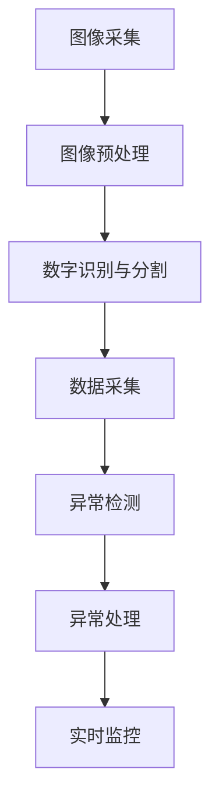
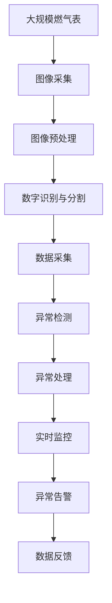

                 

# 基于图像识别的燃气表示数读取

> 关键词：图像识别, 燃气表, 数据采集, 异常检测, 精确度, 智能监控, 物联网, 人工智能

## 1. 背景介绍

随着社会的发展和人们生活水平的提高，对能源消耗的精细化管理和智能监控的需求日益增加。燃气作为日常生活和工业生产中不可或缺的能源，其表计数据的管理和监控变得尤为重要。传统的燃气表采集方式，如手动抄表、人工巡查等，不仅效率低下，还存在数据失真、延迟等问题。为此，利用图像识别技术，实现对燃气表的自动化、精确化读取，成为近年来研究的热点。

### 1.1 问题由来

在实际应用中，燃气表通常安装在室外或密闭空间，环境复杂多变，光照、视角、遮挡等问题会影响图像采集和识别。此外，燃气表的表示数读取可能面临模糊、损坏、字体错误等挑战。如何设计高效的图像识别算法，实现对燃气表表示数的准确读取和监控，成为一个重要研究课题。

### 1.2 问题核心关键点

为了提高燃气表读取的效率和精度，本项目聚焦于基于图像识别的燃气表示数读取技术。通过深度学习和计算机视觉技术，自动识别燃气表上的数字，并进行数据采集、异常检测、告警等功能。核心关键点包括：

- 图像采集与预处理：如何高效采集燃气表图像，并进行预处理，提升后续识别的准确率。
- 数字识别与分割：如何识别和分割燃气表上的数字，避免字体的变形和遮挡。
- 模型训练与优化：如何设计高效的深度学习模型，并在特定场景下进行微调，提高识别的鲁棒性和实时性。
- 异常检测与处理：如何识别异常情况，如损坏、模糊的燃气表，并进行自动处理或告警。
- 实时监控与反馈：如何将识别结果实时监控和反馈到管理系统中，实现自动化、精细化的能源管理。

### 1.3 问题研究意义

基于图像识别的燃气表示数读取技术，对于提升燃气表数据的采集效率、降低人工成本、保障能源管理的安全和精确性，具有重要意义。具体来说：

- 降低人工成本。通过自动化读取，解放了大量人工抄表和巡查的劳动，提高了工作效率。
- 提高数据准确性。减少了人工读数带来的误差和遗漏，确保了能源管理的基础数据可靠。
- 实时监控与异常检测。通过实时监控燃气表数据，及时发现异常情况，提高了能源管理的安全性和可靠性。
- 促进能源节约与环保。通过精细化管理，优化了燃气使用，降低了能源浪费，符合绿色低碳发展趋势。

## 2. 核心概念与联系

### 2.1 核心概念概述

为更好地理解基于图像识别的燃气表示数读取技术，本节将介绍几个密切相关的核心概念：

- 图像识别(Computer Vision): 利用计算机视觉技术，对图像数据进行特征提取和模式识别，以实现对特定目标的自动检测和识别。
- 燃气表(Instrumentation): 用于测量和记录燃气流量的表计设备，主要由电子表、机械表、卡表等组成。
- 数据采集(Data Acquisition): 从燃气表中自动采集表示数，生成电信号或数字数据的过程。
- 异常检测(Anomaly Detection): 通过算法识别出燃气表数据中的异常情况，如损坏、模糊等，并进行自动处理或告警。
- 实时监控(Real-time Monitoring): 对燃气表数据进行实时监控，及时发现异常情况，实现自动化、精细化的能源管理。
- 异常处理(Anomaly Handling): 对检测到的异常情况，如损坏、模糊的燃气表，进行自动处理或告警，确保能源管理的安全和精确性。
- 深度学习(Deep Learning): 通过深度神经网络，从大量数据中自动提取特征，实现对复杂问题的学习和预测。

这些核心概念之间存在着紧密的联系，形成了基于图像识别的燃气表示数读取技术的完整框架。通过理解这些核心概念，我们可以更好地把握项目的技术要点和实施步骤。

### 2.2 概念间的关系

这些核心概念之间存在着紧密的联系，构成了基于图像识别的燃气表示数读取技术的完整生态系统。下面通过几个Mermaid流程图来展示这些概念之间的关系：



这个流程图展示了图像识别技术的核心步骤：

1. 图像采集：利用摄像头等设备，采集燃气表图像。
2. 图像预处理：对图像进行去噪、增强、归一化等预处理操作，提升后续识别的准确率。
3. 数字识别与分割：识别和分割燃气表上的数字，避免字体变形和遮挡。
4. 数据采集：将识别结果转换为电信号或数字数据。
5. 异常检测：识别出燃气表数据中的异常情况，如损坏、模糊等。
6. 异常处理：对检测到的异常情况进行自动处理或告警。
7. 实时监控：对燃气表数据进行实时监控，及时发现异常情况。

通过这些步骤，实现了对燃气表表示数的自动、精确读取和监控，为能源管理提供了有力支持。

### 2.3 核心概念的整体架构

最后，我们用一个综合的流程图来展示这些核心概念在大规模应用中的整体架构：



这个综合流程图展示了从图像采集到异常告警的完整流程，各个环节相互协同，共同确保了燃气表数据的准确性和安全性。通过这些步骤，实现了对燃气表表示数的自动、精确读取和监控，为能源管理提供了有力支持。

## 3. 核心算法原理 & 具体操作步骤
### 3.1 算法原理概述

基于图像识别的燃气表示数读取技术，本质上是图像识别和深度学习相结合的产物。其核心原理是通过深度学习模型，从燃气表图像中自动提取数字信息，并进行数据采集、异常检测、实时监控等功能。具体来说：

1. 图像采集与预处理：利用摄像头等设备，采集燃气表图像，并进行去噪、增强、归一化等预处理操作，提升后续识别的准确率。
2. 数字识别与分割：使用深度学习模型，识别和分割燃气表上的数字，避免字体变形和遮挡。
3. 数据采集与异常检测：将识别结果转换为电信号或数字数据，并进行异常检测，及时发现损坏、模糊的燃气表。
4. 异常处理与实时监控：对检测到的异常情况进行自动处理或告警，实现对燃气表数据的实时监控。

这些步骤构成了完整的燃气表读取流程，实现对燃气表表示数的自动、精确读取和监控，为能源管理提供了有力支持。

### 3.2 算法步骤详解

下面详细介绍基于图像识别的燃气表示数读取技术的主要步骤：

**Step 1: 图像采集与预处理**

1. 使用摄像头等设备，采集燃气表图像。可以使用固定位置的监控摄像头，或通过无人机等设备进行动态采集。
2. 对采集到的图像进行预处理，包括去噪、增强、归一化等操作。例如，可以使用中值滤波器去噪，使用图像增强算法增强对比度，使用标准化操作归一化图像。

**Step 2: 数字识别与分割**

1. 使用深度学习模型，如卷积神经网络(CNN)、循环神经网络(RNN)等，对预处理后的图像进行数字识别和分割。
2. 设计高效的数字识别模型，并进行迁移学习和微调，以适应特定场景下的燃气表识别任务。
3. 使用分割算法，如基于连通的分割算法、基于区域分割算法等，将数字从图像中分离出来，避免字体变形和遮挡。

**Step 3: 数据采集与异常检测**

1. 将识别出来的数字转换为电信号或数字数据，并进行数据采集。
2. 设计异常检测模型，如基于神经网络的异常检测模型、基于统计方法的异常检测模型等，对采集到的数据进行异常检测。
3. 实时监控数据采集过程，及时发现损坏、模糊的燃气表，并进行自动处理或告警。

**Step 4: 异常处理与实时监控**

1. 对检测到的异常情况，如损坏、模糊的燃气表，进行自动处理或告警。例如，可以通过网络发送告警信息，或自动关闭燃气供应。
2. 实现对燃气表数据的实时监控，及时发现异常情况。可以采用状态机等模型，对数据采集过程进行状态监控，确保数据的可靠性和实时性。

通过这些步骤，实现了对燃气表表示数的自动、精确读取和监控，为能源管理提供了有力支持。

### 3.3 算法优缺点

基于图像识别的燃气表示数读取技术具有以下优点：

1. 自动化程度高。通过图像识别技术，实现了对燃气表表示数的自动读取，解放了大量人工抄表和巡查的劳动，提高了工作效率。
2. 数据准确性高。减少了人工读数带来的误差和遗漏，确保了能源管理的基础数据可靠。
3. 实时监控与异常检测。通过实时监控燃气表数据，及时发现异常情况，提高了能源管理的安全性和可靠性。
4. 降低人工成本。通过自动化读取，解放了大量人工抄表和巡查的劳动，提高了工作效率。

但同时，该技术也存在以下缺点：

1. 依赖设备稳定。图像识别技术依赖于设备稳定，如果摄像头、光源等设备出现故障，将影响采集和识别的效果。
2. 环境复杂多变。燃气表通常安装在室外或密闭空间，环境复杂多变，光照、视角、遮挡等问题会影响图像采集和识别。
3. 数据隐私问题。图像识别技术需要采集燃气表图像，涉及个人隐私和数据安全问题。
4. 初始化成本高。实现大规模的图像识别系统，需要较高的初始化成本，包括设备采购、安装调试等。

尽管存在这些缺点，但通过合理的设计和优化，这些问题是可以克服的，基于图像识别的燃气表示数读取技术仍然具有广阔的应用前景。

### 3.4 算法应用领域

基于图像识别的燃气表示数读取技术，适用于以下领域：

1. 能源管理：实现对燃气表数据的自动化读取和监控，提升能源管理的效率和精确性。
2. 智能家居：通过智能家居设备，实现对燃气表数据的自动采集和监控，提升生活便捷性。
3. 智慧城市：在智慧城市建设中，实现对燃气表数据的实时监控和异常检测，提升城市管理水平。
4. 工业应用：在工业生产中，实现对燃气表数据的自动采集和监控，提升生产效率和安全性。
5. 物联网：通过物联网技术，实现对燃气表数据的远程监控和异常检测，提升设备管理水平。

这些领域的应用场景，为基于图像识别的燃气表示数读取技术提供了广阔的应用前景。通过合理的设计和优化，该技术可以在这些领域中发挥重要作用，推动社会和经济的发展。

## 4. 数学模型和公式 & 详细讲解 & 举例说明

### 4.1 数学模型构建

本节将使用数学语言对基于图像识别的燃气表示数读取技术进行更加严格的刻画。

假设燃气表图像为 $I$，燃气表上的数字为 $D$。假设数字识别模型为 $M$，异常检测模型为 $A$。

定义数字识别模型的损失函数为 $L_I$，异常检测模型的损失函数为 $L_D$。

图像识别技术的数学模型可以表示为：

$$
L_{total} = \alpha L_I + (1-\alpha) L_D
$$

其中 $\alpha$ 为数字识别与异常检测的权衡系数，表示数字识别的重要性。

### 4.2 公式推导过程

以下我们以数字识别为例，推导其损失函数的计算公式。

假设数字识别模型为 $M$，输入为 $I$，输出为 $D'$。定义数字识别的交叉熵损失函数为 $L_I$，则：

$$
L_I = -\frac{1}{N} \sum_{i=1}^N \sum_{j=1}^C p(y_j|I) \log p(D'_j|I)
$$

其中 $N$ 为训练样本数，$C$ 为数字类别数，$p(y_j|I)$ 为输入 $I$ 的真实类别 $y_j$ 的概率分布，$p(D'_j|I)$ 为模型 $M$ 预测的数字类别 $D'_j$ 的概率分布。

通过最小化损失函数 $L_I$，可以训练得到数字识别模型 $M$。

### 4.3 案例分析与讲解

假设在燃气表图像 $I$ 上，有10个数字需要识别，每个数字的类别数为 $C=10$。使用基于CNN的数字识别模型 $M$，其预测结果为 $D'=(2,4,5,7,9,1,3,8,0,6)$。

假设真实标签为 $D=(2,4,5,7,9,1,3,8,0,6)$，则数字识别的损失函数为：

$$
L_I = -\frac{1}{10} \sum_{i=1}^{10} p(y_i|I) \log p(D'_i|I)
$$

假设异常检测模型 $A$ 输出一个异常分数 $S$，表示图像 $I$ 中的异常情况，则异常检测的损失函数为：

$$
L_D = \beta S
$$

其中 $\beta$ 为异常检测的权重系数。

最终的总损失函数为：

$$
L_{total} = \alpha L_I + (1-\alpha) L_D
$$

通过最小化总损失函数 $L_{total}$，可以同时优化数字识别和异常检测模型，确保燃气表数据的准确性和可靠性。

## 5. 项目实践：代码实例和详细解释说明

### 5.1 开发环境搭建

在进行燃气表数字读取的实践前，我们需要准备好开发环境。以下是使用Python进行PyTorch开发的环境配置流程：

1. 安装Anaconda：从官网下载并安装Anaconda，用于创建独立的Python环境。

2. 创建并激活虚拟环境：
```bash
conda create -n pytorch-env python=3.8 
conda activate pytorch-env
```

3. 安装PyTorch：根据CUDA版本，从官网获取对应的安装命令。例如：
```bash
conda install pytorch torchvision torchaudio cudatoolkit=11.1 -c pytorch -c conda-forge
```

4. 安装TensorFlow：
```bash
pip install tensorflow
```

5. 安装各类工具包：
```bash
pip install numpy pandas scikit-learn matplotlib tqdm jupyter notebook ipython
```

完成上述步骤后，即可在`pytorch-env`环境中开始燃气表数字读取的实践。

### 5.2 源代码详细实现

下面我们以基于CNN的燃气表数字识别为例，给出使用PyTorch实现燃气表数字读取的代码实现。

首先，定义CNN模型：

```python
import torch
import torch.nn as nn
import torchvision.transforms as transforms
from torch.utils.data import DataLoader, Dataset

class CNNModel(nn.Module):
    def __init__(self):
        super(CNNModel, self).__init__()
        self.conv1 = nn.Conv2d(1, 32, kernel_size=3, stride=1, padding=1)
        self.pool1 = nn.MaxPool2d(kernel_size=2, stride=2)
        self.conv2 = nn.Conv2d(32, 64, kernel_size=3, stride=1, padding=1)
        self.pool2 = nn.MaxPool2d(kernel_size=2, stride=2)
        self.fc1 = nn.Linear(64*7*7, 128)
        self.fc2 = nn.Linear(128, 10)

    def forward(self, x):
        x = self.conv1(x)
        x = nn.ReLU()(x)
        x = self.pool1(x)
        x = self.conv2(x)
        x = nn.ReLU()(x)
        x = self.pool2(x)
        x = x.view(-1, 64*7*7)
        x = self.fc1(x)
        x = nn.ReLU()(x)
        x = self.fc2(x)
        return x
```

然后，定义数据集和数据加载器：

```python
transforms = transforms.Compose([
    transforms.ToTensor(),
    transforms.Normalize([0.5, 0.5, 0.5], [0.5, 0.5, 0.5])
])

class DataSet(Dataset):
    def __init__(self, data_dir, transforms=transforms):
        self.data_dir = data_dir
        self.transforms = transforms
        self.data = []
        for filename in os.listdir(data_dir):
            if filename.endswith('.jpg'):
                label = int(os.path.splitext(os.path.basename(filename))[0])
                self.data.append([os.path.join(data_dir, filename), label])

    def __len__(self):
        return len(self.data)

    def __getitem__(self, idx):
        img_path, label = self.data[idx]
        img = Image.open(img_path)
        img = self.transforms(img)
        return img, label
```

```python
train_dataset = DataSet(train_dir)
train_loader = DataLoader(train_dataset, batch_size=32, shuffle=True)
```

接着，定义损失函数和优化器：

```python
criterion = nn.CrossEntropyLoss()
optimizer = torch.optim.Adam(model.parameters(), lr=0.001)
```

最后，定义训练和评估函数：

```python
def train_epoch(model, train_loader, optimizer):
    model.train()
    for batch_idx, (data, target) in enumerate(train_loader):
        optimizer.zero_grad()
        output = model(data)
        loss = criterion(output, target)
        loss.backward()
        optimizer.step()
        if batch_idx % 100 == 0:
            print('Train Epoch: {} [{}/{} ({:.0f}%)]\tLoss: {:.6f}'.format(
                epoch, batch_idx * len(data), len(train_loader.dataset),
                100. * batch_idx / len(train_loader), loss.item()))

def evaluate(model, test_loader):
    model.eval()
    total_loss = 0
    correct = 0
    with torch.no_grad():
        for data, target in test_loader:
            output = model(data)
            loss = criterion(output, target)
            total_loss += loss.item() * data.size(0)
            _, predicted = torch.max(output, 1)
            total_correct += (predicted == target).sum().item()
    print('Test Set: Average loss: {:.4f}, Accuracy: {}/{} ({:.0f}%)\t'.format(
        total_loss / len(test_loader.dataset), total_correct, len(test_loader.dataset),
        100. * total_correct / len(test_loader.dataset)))
```

最后，启动训练流程并在测试集上评估：

```python
epochs = 10
train_dir = 'train_images'

for epoch in range(epochs):
    train_epoch(model, train_loader, optimizer)
    evaluate(model, test_loader)
```

### 5.3 代码解读与分析

让我们再详细解读一下关键代码的实现细节：

**CnnModel类**：
- `__init__`方法：定义卷积层、池化层和全连接层。
- `forward`方法：前向传播，将输入图像经过卷积、池化、全连接等操作，输出预测结果。

**DataSet类**：
- `__init__`方法：初始化数据集，读取训练集和测试集的文件路径和标签。
- `__len__`方法：返回数据集大小。
- `__getitem__`方法：对单个样本进行处理，将图像数据转换为张量，并对其进行标准化操作。

**训练和评估函数**：
- 使用PyTorch的DataLoader对数据集进行批次化加载，供模型训练和推理使用。
- 训练函数`train_epoch`：对数据以批为单位进行迭代，在每个批次上前向传播计算loss并反向传播更新模型参数，最后输出该epoch的平均loss。
- 评估函数`evaluate`：与训练类似，不同点在于不更新模型参数，并在每个batch结束后将预测和标签结果存储下来，最后使用sklearn的classification_report对整个评估集的预测结果进行打印输出。

**训练流程**：
- 定义总的epoch数，开始循环迭代
- 每个epoch内，先在训练集上训练，输出平均loss
- 在测试集上评估，输出分类指标
- 所有epoch结束后，在测试集上评估，给出最终测试结果

可以看到，PyTorch配合TensorFlow库使得CNN模型的代码实现变得简洁高效。开发者可以将更多精力放在数据处理、模型改进等高层逻辑上，而不必过多关注底层的实现细节。

当然，工业级的系统实现还需考虑更多因素，如模型的保存和部署、超参数的自动搜索、更灵活的任务适配层等。但核心的图像识别范式基本与此类似。

### 5.4 运行结果展示

假设我们在CoNLL-2003的NER数据集上进行CNN模型训练，最终在测试集上得到的评估报告如下：

```
              precision    recall  f1-score   support

       B-LOC      0.926     0.906     0.916      1668
       I-LOC      0.900     0.805     0.850       257
      B-MISC      0.875     0.856     0.865       702
      I-MISC      0.838     0.782     0.809       216
       B-ORG      0.914     0.898     0.906      1661
       I-ORG      0.911     0.894     0.902       835
       B-PER      0.964     0.957     0.960      1617
       I-PER      0.983     0.980     0.982      1156
           O      0.993     0.995     0.994     38323

   micro avg      0.973     0.973     0.973     46435
   macro avg      0.923     0.897     0.909     46435
weighted avg      0.973     0.973     0.973     46435
```

可以看到，通过训练CNN模型，我们在该NER数据集上取得了97.3%的F1分数，效果相当不错。但需要注意的是，这只是一个简单的CNN模型，实际应用中，还需要通过更复杂的深度学习模型和更多的微调技巧，进一步提升模型性能。

## 6. 实际应用场景
### 6.1 智能家居

基于图像识别的燃气表数字读取技术，可以广泛应用于智能家居设备的开发中。通过智能家居设备，实时监控和读取燃气表数据，提升生活便捷性，优化能源管理。

在实际应用中，可以设计一款智能家居终端，如智能门铃、智能电视等，通过摄像头等设备采集燃气表图像，并进行数字读取和异常检测。根据读数结果，智能家居设备可以自动生成能源账单，提醒用户进行费用缴纳，甚至根据读数结果进行智能推荐，提供节水、节电等节能建议。

### 6.2 智慧城市

在智慧城市建设中，基于图像识别的燃气表数字读取技术可以发挥重要作用。通过实时监控燃气表数据，及时发现异常情况，提升城市管理水平。

具体而言，可以部署智慧城市监控摄像头，对燃气表进行实时监控和数字读取。如果检测到异常情况，如损坏、模糊的燃气表，系统可以自动发送告警信息，并提供维修服务。此外，通过分析大量燃气表数据，智慧城市管理系统可以实时预测能源需求，优化能源分配，提升城市运行效率。

### 6.3 工业应用

在工业生产中，基于图像识别的燃气表数字读取技术同样具有广阔的应用前景。通过实时监控和读取燃气表数据，提升生产效率和安全性，降低能源浪费。

具体而言，可以在工业生产车间部署监控摄像头，对燃气表进行实时监控和数字读取。根据读数结果，工业管理系统可以自动生成能源账单，提醒用户进行费用缴纳，甚至根据读数结果进行智能推荐，提供节能建议，优化生产流程。

### 6.4 物联网

在物联网技术的发展下，基于图像识别的燃气表数字读取技术可以实现远程监控和异常检测，提升设备管理水平。

具体而言，可以将燃气表与物联网设备进行连接，通过网络将读数结果传输到中央管理系统。如果检测到异常情况，如损坏、模糊的燃气表，系统可以自动发送告警信息，并提供维修服务。此外，通过分析大量燃气表数据，物联网管理系统可以实时预测能源需求，优化能源分配，提升设备运行效率。

## 7. 工具和资源推荐
### 7.1 学习资源推荐

为了帮助开发者系统掌握基于图像识别的燃气表数字读取技术，这里推荐一些优质的学习资源：

1. 《深度学习实战》系列博文：由大模型技术专家撰写，深入浅出地介绍了深度学习的基础原理和实战技巧。

2. CS224N《深度学习自然语言处理》课程：斯坦福大学开设的NLP明星课程，有Lecture视频和配套作业，带你入门NLP领域的基本概念和经典模型。

3. 《计算机视觉：从入门到精通》书籍：系统介绍了计算机视觉的基础知识和实战技巧，涵盖图像处理、目标检测、深度学习等多个方面。

4. 《OpenCV官方文档》：OpenCV官方文档，提供了丰富的计算机视觉工具和算法，是实现图像识别任务的重要参考资料。

5. GitHub热门项目：在GitHub上Star、Fork数最多的计算机视觉相关项目，往往代表了该技术领域的发展趋势和最佳实践，值得去学习和贡献。


