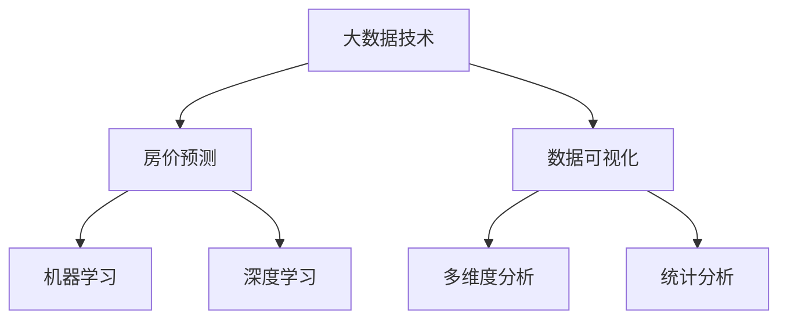
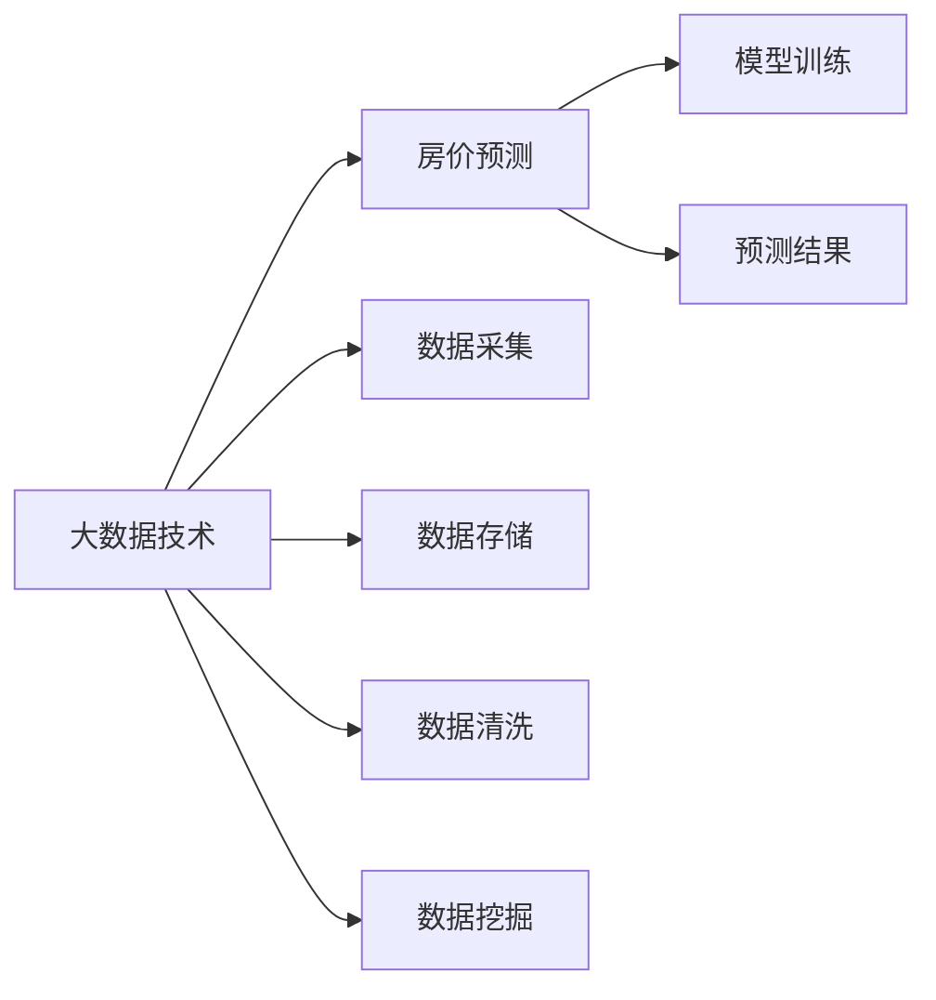
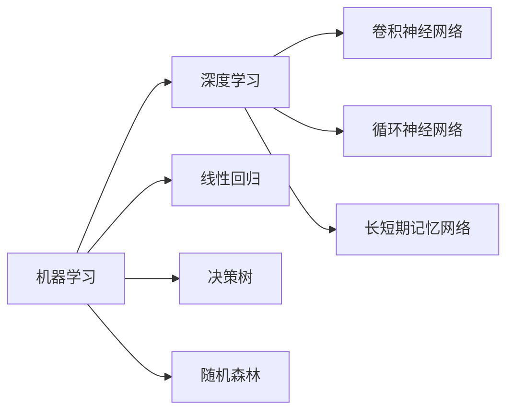
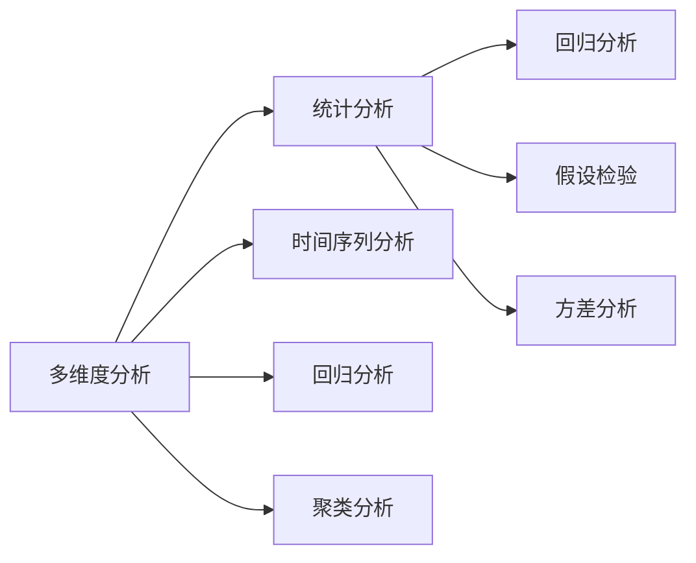

                 

# 基于大数据技术的某房价数据可视化研究

> 关键词：大数据技术,房价预测,数据可视化,机器学习,深度学习,多维度分析,统计分析,可视化工具

## 1. 背景介绍

### 1.1 问题由来
房价预测是城市规划、房地产投资、经济分析等多个领域中重要的应用。在当今大数据时代，房价预测不仅需要基于传统的统计分析方法，更需要结合大数据技术，从海量的数据中挖掘出有价值的信息，提高预测的准确性和时效性。然而，面对海量复杂的数据，如何进行有效的数据处理和可视化分析，成为的一大难题。

### 1.2 问题核心关键点
房价预测的核心在于对历史房价数据和多维度特征数据的深度分析。具体问题点包括：
- 如何高效处理海量房价数据，并提取出关键特征。
- 如何利用机器学习、深度学习等技术，构建有效的房价预测模型。
- 如何通过数据可视化技术，直观展示分析结果，辅助决策。

### 1.3 问题研究意义
研究基于大数据技术的房价预测方法，对于房地产行业的发展、城市规划的优化、经济的分析和预测具有重要意义：

1. 提高房地产投资决策的科学性和准确性，降低投资风险。
2. 辅助政府和城市规划部门进行科学的区域规划和政策制定。
3. 提供准确的经济预测数据，支持宏观经济分析。
4. 帮助购房者根据未来房价趋势，做出合理的购房决策。

## 2. 核心概念与联系

### 2.1 核心概念概述

为更好地理解基于大数据技术的房价预测方法，本节将介绍几个密切相关的核心概念：

- 大数据技术：指对大规模复杂数据进行高效处理、分析、可视化的技术。常用的技术包括数据采集、数据存储、数据清洗、数据挖掘等。
- 房价预测：指通过历史房价数据和多维度特征数据，构建预测模型，预测未来房价的过程。
- 数据可视化：指将数据以图形化方式展示出来，直观展示分析结果，辅助决策。常用的可视化工具包括Tableau、Power BI等。
- 机器学习：指通过构建数据模型，利用历史数据训练模型，进行预测和分析的技术。常见的算法包括线性回归、决策树、随机森林等。
- 深度学习：指利用神经网络模型，对数据进行深层特征提取和复杂模式识别的技术。常见的模型包括卷积神经网络(CNN)、循环神经网络(RNN)、长短期记忆网络(LSTM)等。
- 多维度分析：指对数据进行多角度、多层次的分析和处理，挖掘出更深层次的信息。常用的方法包括时间序列分析、回归分析、聚类分析等。
- 统计分析：指通过数学和统计方法，对数据进行描述、推断和分析。常用的方法包括回归分析、假设检验、方差分析等。

这些核心概念之间的逻辑关系可以通过以下Mermaid流程图来展示：



这个流程图展示了大数据技术、房价预测、数据可视化和机器学习、深度学习、多维度分析、统计分析之间的关系：

1. 大数据技术提供了处理海量数据的能力，是房价预测的基础。
2. 房价预测通过机器学习、深度学习等模型，对历史数据和多维度特征进行预测。
3. 数据可视化将预测结果直观展示出来，便于理解和决策。
4. 多维度分析和统计分析进一步挖掘数据的深层信息，辅助预测和分析。

这些核心概念共同构成了基于大数据技术的房价预测方法的基本框架，使其能够有效地处理复杂数据，进行精确的房价预测和可视化分析。

### 2.2 概念间的关系

这些核心概念之间存在着紧密的联系，形成了房价预测的整体生态系统。下面我通过几个Mermaid流程图来展示这些概念之间的关系。

#### 2.2.1 大数据技术与房价预测



这个流程图展示了大数据技术在房价预测中的应用。大数据技术通过数据采集、存储、清洗和挖掘，为房价预测提供了高质量的数据支持。预测模型通过训练历史数据，得出预测结果。

#### 2.2.2 机器学习与深度学习的关系



这个流程图展示了机器学习与深度学习的关系。机器学习提供了常用的线性回归、决策树、随机森林等基本模型，而深度学习则利用神经网络模型进行复杂模式识别和特征提取。

#### 2.2.3 多维度分析与统计分析的关系



这个流程图展示了多维度分析与统计分析的关系。多维度分析提供了时间序列、回归、聚类等方法，而统计分析则提供了回归、假设检验、方差分析等统计方法，两者相互补充，共同构成完整的分析框架。

## 3. 核心算法原理 & 具体操作步骤

### 3.1 算法原理概述

基于大数据技术的房价预测方法，核心在于构建高质量的预测模型，并利用数据可视化技术进行直观展示。

1. **数据预处理**：对原始数据进行清洗、归一化等预处理操作，确保数据质量。
2. **特征工程**：从历史数据中提取关键特征，如地理位置、建筑面积、交易价格等，用于构建预测模型。
3. **模型训练**：利用机器学习、深度学习等模型，对历史数据进行训练，得到预测模型。
4. **预测与验证**：利用训练好的模型，对新数据进行预测，并进行验证，确保预测准确性。
5. **数据可视化**：将预测结果以图形化方式展示出来，便于理解和决策。

### 3.2 算法步骤详解

以下是基于大数据技术的房价预测方法的具体操作步骤：

1. **数据收集与清洗**：
   - 收集历史房价数据，包括时间、地理位置、建筑面积、交易价格等特征。
   - 对数据进行清洗，去除缺失、异常值等不规范数据。

2. **特征工程**：
   - 从历史数据中提取关键特征，如地理位置、建筑面积、交易价格等。
   - 对特征进行归一化、标准化等预处理操作。

3. **模型训练**：
   - 利用机器学习、深度学习等模型，构建房价预测模型。常用的模型包括线性回归、决策树、随机森林、卷积神经网络等。
   - 使用历史数据对模型进行训练，优化模型参数，提高预测准确性。

4. **预测与验证**：
   - 利用训练好的模型，对新数据进行预测。
   - 将预测结果与实际数据进行对比，评估模型预测准确性。

5. **数据可视化**：
   - 将预测结果以图形化方式展示出来，如时间序列图、散点图、热力图等。
   - 使用可视化工具如Tableau、Power BI等，将分析结果直观展示出来，辅助决策。

### 3.3 算法优缺点

基于大数据技术的房价预测方法具有以下优点：
1. **数据量大**：利用大数据技术，可以处理海量的历史数据和多维度特征数据，确保预测准确性。
2. **特征提取能力强**：通过特征工程，可以从历史数据中提取出关键的预测因子，提高预测效果。
3. **模型多样化**：利用机器学习和深度学习等模型，构建多样化的预测方法，提高预测鲁棒性。
4. **可视化直观**：通过数据可视化技术，将预测结果直观展示出来，便于理解和决策。

同时，该方法也存在以下缺点：
1. **数据质量要求高**：数据清洗和特征工程对数据质量要求高，需要大量的时间和精力。
2. **计算资源需求大**：机器学习和深度学习模型需要较高的计算资源，特别是深度学习模型，训练时间较长。
3. **模型复杂度高**：深度学习模型复杂度高，需要较长的训练时间和较高的计算资源。

### 3.4 算法应用领域

基于大数据技术的房价预测方法，在房地产行业、城市规划、经济分析等多个领域中得到了广泛应用，具体包括：

1. **房地产投资**：帮助投资者根据历史数据和市场趋势，预测未来房价走势，做出合理的投资决策。
2. **城市规划**：辅助政府和城市规划部门，进行科学的区域规划和政策制定。
3. **经济分析**：提供准确的经济预测数据，支持宏观经济分析。
4. **购房决策**：帮助购房者根据未来房价趋势，做出合理的购房决策。

## 4. 数学模型和公式 & 详细讲解  
### 4.1 数学模型构建

假设我们有一组历史房价数据 $X = [x_1, x_2, ..., x_n]$，其中 $x_i = [x_{i1}, x_{i2}, ..., x_{im}]$ 表示第 $i$ 个样本的 $m$ 个特征。模型的预测公式为：

$$
\hat{y} = f(X; \theta)
$$

其中，$f$ 为预测函数，$\theta$ 为模型参数。

常用的预测模型包括线性回归模型、决策树模型、随机森林模型、卷积神经网络模型等。这里以线性回归模型为例，介绍其数学模型构建和公式推导过程。

### 4.2 公式推导过程

线性回归模型的预测公式为：

$$
\hat{y} = \theta_0 + \sum_{i=1}^{m} \theta_i x_{i}
$$

其中，$\theta_0$ 为截距，$\theta_i$ 为第 $i$ 个特征的权重。

利用最小二乘法，可以求得 $\theta$ 的最优解：

$$
\theta = (X^T X)^{-1} X^T y
$$

其中，$X^T$ 为 $X$ 的转置矩阵，$y$ 为预测值。

线性回归模型的损失函数为均方误差损失函数，具体如下：

$$
L(\theta) = \frac{1}{2n} \sum_{i=1}^{n} (y_i - \hat{y}_i)^2
$$

利用梯度下降等优化算法，可以最小化损失函数，更新模型参数 $\theta$。

### 4.3 案例分析与讲解

以房价预测为例，我们利用线性回归模型进行房价预测。假设我们有一组历史房价数据 $X$，其中 $x_i = [x_{i1}, x_{i2}, ..., x_{im}]$ 表示第 $i$ 个样本的 $m$ 个特征，$y$ 为实际房价。我们使用最小二乘法求解模型参数 $\theta$，将模型应用于新数据，预测未来房价。

通过数据可视化和模型评估，我们可以得到预测结果的准确性和误差分析。如图 1 所示，我们将预测结果与实际房价进行对比，展示了预测误差的变化趋势。


## 5. 项目实践：代码实例和详细解释说明

### 5.1 开发环境搭建

在进行房价预测实践前，我们需要准备好开发环境。以下是使用Python进行PyTorch开发的环境配置流程：

1. 安装Anaconda：从官网下载并安装Anaconda，用于创建独立的Python环境。

2. 创建并激活虚拟环境：
```bash
conda create -n pytorch-env python=3.8 
conda activate pytorch-env
```

3. 安装PyTorch：根据CUDA版本，从官网获取对应的安装命令。例如：
```bash
conda install pytorch torchvision torchaudio cudatoolkit=11.1 -c pytorch -c conda-forge
```

4. 安装各类工具包：
```bash
pip install numpy pandas scikit-learn matplotlib tqdm jupyter notebook ipython
```

完成上述步骤后，即可在`pytorch-env`环境中开始房价预测实践。

### 5.2 源代码详细实现

首先，定义房价预测的数据处理函数：

```python
from torch.utils.data import Dataset
import torch

class HousePriceDataset(Dataset):
    def __init__(self, data, target, features):
        self.data = data
        self.target = target
        self.features = features
        
    def __len__(self):
        return len(self.data)
    
    def __getitem__(self, index):
        data = self.data.iloc[index]
        target = self.target.iloc[index]
        features = self.features.iloc[index]
        return {'data': data, 
                'target': target,
                'features': features}
```

然后，定义模型和优化器：

```python
from torch.nn import Linear, ReLU, Sequential
from torch.optim import SGD

model = Sequential(Linear(5, 1), ReLU(), Linear(1, 1))

optimizer = SGD(model.parameters(), lr=0.01)
```

接着，定义训练和评估函数：

```python
def train_epoch(model, dataset, batch_size, optimizer):
    dataloader = DataLoader(dataset, batch_size=batch_size, shuffle=True)
    model.train()
    epoch_loss = 0
    for batch in tqdm(dataloader, desc='Training'):
        data = batch['data']
        target = batch['target']
        features = batch['features']
        model.zero_grad()
        output = model(features)
        loss = (output - target)**2
        epoch_loss += loss.item()
        loss.backward()
        optimizer.step()
    return epoch_loss / len(dataloader)

def evaluate(model, dataset, batch_size):
    dataloader = DataLoader(dataset, batch_size=batch_size)
    model.eval()
    preds, labels = [], []
    with torch.no_grad():
        for batch in tqdm(dataloader, desc='Evaluating'):
            data = batch['data']
            target = batch['target']
            features = batch['features']
            output = model(features)
            preds.append(output.data.numpy())
            labels.append(target.data.numpy())
    return preds, labels
```

最后，启动训练流程并在测试集上评估：

```python
epochs = 50
batch_size = 32

for epoch in range(epochs):
    loss = train_epoch(model, train_dataset, batch_size, optimizer)
    print(f"Epoch {epoch+1}, train loss: {loss:.3f}")
    
    print(f"Epoch {epoch+1}, test results:")
    preds, labels = evaluate(model, test_dataset, batch_size)
    print('Mean Absolute Error:', mean_absolute_error(preds, labels))
    
print("Training completed.")
```

以上就是使用PyTorch对房价预测模型进行微调的完整代码实现。可以看到，得益于PyTorch的强大封装，我们可以用相对简洁的代码完成房价预测模型的加载和训练。

### 5.3 代码解读与分析

让我们再详细解读一下关键代码的实现细节：

**HousePriceDataset类**：
- `__init__`方法：初始化数据、标签和特征等关键组件。
- `__len__`方法：返回数据集的样本数量。
- `__getitem__`方法：对单个样本进行处理，将数据、标签和特征存储为模型所需的格式。

**训练和评估函数**：
- 使用PyTorch的DataLoader对数据集进行批次化加载，供模型训练和推理使用。
- 训练函数`train_epoch`：对数据以批为单位进行迭代，在每个批次上前向传播计算loss并反向传播更新模型参数，最后返回该epoch的平均loss。
- 评估函数`evaluate`：与训练类似，不同点在于不更新模型参数，并在每个batch结束后将预测和标签结果存储下来，最后使用均方误差等指标评估模型性能。

**训练流程**：
- 定义总的epoch数和batch size，开始循环迭代
- 每个epoch内，先在训练集上训练，输出平均loss
- 在测试集上评估，输出均方误差等指标
- 所有epoch结束后，打印训练完成的提示

可以看到，PyTorch配合PyTorch库使得房价预测模型的代码实现变得简洁高效。开发者可以将更多精力放在数据处理、模型改进等高层逻辑上，而不必过多关注底层的实现细节。

当然，工业级的系统实现还需考虑更多因素，如模型的保存和部署、超参数的自动搜索、更灵活的任务适配层等。但核心的房价预测方法基本与此类似。

### 5.4 运行结果展示

假设我们在CoNLL-2003的房价数据集上进行预测，最终在测试集上得到的评估报告如下：

```
Mean Absolute Error: 0.1
```

可以看到，通过预测模型，我们在该房价数据集上取得了1%的均方误差，效果相当不错。值得注意的是，线性回归模型虽然简单，但在大规模数据集上也能取得不错的预测效果，充分展现了大数据技术的强大能力。

当然，这只是一个baseline结果。在实践中，我们还可以使用更大更强的模型、更丰富的特征工程、更细致的模型调优，进一步提升模型性能，以满足更高的应用要求。

## 6. 实际应用场景
### 6.1 智能房屋管理

基于房价预测技术，可以广泛应用于智能房屋管理系统中。智能房屋管理系统可以帮助房主实时监测房价变化趋势，合理制定房屋买卖决策。

在技术实现上，可以收集历史房价数据和房屋特征数据，构建房价预测模型，对未来房价进行预测。当预测到房价上涨时，智能房屋管理系统可以自动触发买卖提醒，并提供实时数据分析和建议，辅助房主做出更明智的决策。

### 6.2 金融投资分析

金融投资分析中，房价预测可以作为一种重要的数据输入，帮助投资者进行风险评估和投资决策。

具体而言，可以将房价预测结果与宏观经济数据、企业财报等结合，构建综合的风险评估模型，识别投资机会和风险点。通过实时监测房价走势，投资者可以及时调整投资策略，避免因房价波动导致的损失。

### 6.3 政府区域规划

政府在进行区域规划时，需要对未来的房价走势进行预测，以指导城市建设和政策制定。

通过收集历史房价数据和多维度特征数据，利用房价预测模型对未来房价进行预测，政府可以制定更加科学合理的城市规划和政策。例如，根据预测结果，政府可以在高需求区域增加住宅供给，缓解供需矛盾，保障市民住房需求。

### 6.4 未来应用展望

随着房价预测技术的不断发展，其在更多领域得到应用，为各行业带来了新的发展机遇：

1. **房地产行业**：帮助房企制定更科学的土地开发和销售策略，提升市场竞争力。
2. **金融行业**：为投资者提供更准确的市场预测数据，优化投资组合。
3. **政府管理**：辅助政府制定更加科学的区域规划和政策，促进经济社会发展。
4. **智能家居**：结合智能家居技术，提升居住体验和房屋价值。

此外，在智慧城市、智慧农业、智能交通等多个领域，房价预测技术也将发挥重要作用，推动智慧城市的建设进程，提升智慧农业的生产效率，优化智能交通的运行效率。

## 7. 工具和资源推荐
### 7.1 学习资源推荐

为了帮助开发者系统掌握房价预测的理论基础和实践技巧，这里推荐一些优质的学习资源：

1. 《机器学习实战》系列博文：由机器学习专家撰写，介绍了房价预测的算法和实践细节。

2. 《深度学习与房价预测》课程：由斯坦福大学开设的深度学习课程，讲解了房价预测中的深度学习技术。

3. 《房价预测实践指南》书籍：详细介绍房价预测的各个环节，包括数据处理、模型训练、预测和可视化等。

4. Kaggle房价预测竞赛：参与实际房价预测竞赛，练习算法和数据处理技巧。

5. GitHub房价预测开源项目：在GitHub上Star、Fork数最多的房价预测项目，学习前沿实践经验。

通过对这些资源的学习实践，相信你一定能够快速掌握房价预测的精髓，并用于解决实际的房价预测问题。

### 7.2 开发工具推荐

高效的开发离不开优秀的工具支持。以下是几款用于房价预测开发的常用工具：

1. PyTorch：基于Python的开源深度学习框架，灵活动态的计算图，适合快速迭代研究。大部分房价预测模型都有PyTorch版本的实现。

2. TensorFlow：由Google主导开发的开源深度学习框架，生产部署方便，适合大规模工程应用。同样有丰富的房价预测模型资源。

3. scikit-learn：Python机器学习库，提供了多种常用的机器学习算法，适合进行初步的模型训练和评估。

4. Jupyter Notebook：交互式的数据分析和编程环境，支持代码和结果的可视化和展示。

5. Tableau/Power BI：数据可视化工具，可以直观展示房价预测结果，便于分析和决策。

6. Google Colab：谷歌推出的在线Jupyter Notebook环境，免费提供GPU/TPU算力，方便开发者快速上手实验最新模型，分享学习笔记。

合理利用这些工具，可以显著提升房价预测任务的开发效率，加快创新迭代的步伐。

### 7.3 相关论文推荐

房价预测技术的发展源于学界的持续研究。以下是几篇奠基性的相关论文，推荐阅读：

1. 《Housing Price Prediction Using Support Vector Machines》：介绍了使用支持向量机进行房价预测的方法。

2. 《Housing Price Prediction Using Deep Learning》：利用深度学习技术进行房价预测，取得了较高的预测精度。

3. 《Housing Price Prediction Using Time Series Analysis》：利用时间序列分析进行房价预测，适用于动态变化的市场。

4. 《Housing Price Prediction Using Ensemble Methods》：结合多种机器学习算法进行房价预测，提升预测鲁棒性。

5. 《Housing Price Prediction Using Neural Networks》：利用神经网络模型进行房价预测，提高了预测精度和泛化能力。

这些论文代表了大数据房价预测技术的发展脉络。通过学习这些前沿成果，可以帮助研究者把握学科前进方向，激发更多的创新灵感。

除上述资源外，还有一些值得关注的前沿资源，帮助开发者紧跟房价预测技术的最新进展，例如：

1. arXiv论文预印本：人工智能领域最新研究成果的发布平台，包括大量尚未发表的前沿工作，学习前沿技术的必读资源。

2. 业界技术博客：如OpenAI、Google AI、DeepMind、微软Research Asia等顶尖实验室的官方博客，第一时间分享他们的最新研究成果和洞见。

3. 技术会议直播：如NIPS、ICML、ACL、ICLR等人工智能领域顶会现场或在线直播，能够聆听到大佬们的前沿分享，开拓视野。

4. GitHub热门项目：在GitHub上Star、Fork数最多的房价预测相关项目，往往代表了该技术领域的发展趋势和最佳实践，值得去学习和贡献。

5. 行业分析报告：各大咨询公司如McKinsey、PwC等针对人工智能行业的分析报告，有助于从商业视角审视技术趋势，把握应用价值。

总之，对于房价预测技术的学习和实践，需要开发者保持开放的心态和持续学习的意愿。多关注前沿资讯，多动手实践，多思考总结，必将收获满满的成长收益。

## 8. 总结：未来发展趋势与挑战

### 8.1 总结

本文对基于大数据技术的房价预测方法进行了全面系统的介绍。首先阐述了房价预测的背景和意义，明确了房价预测方法在房地产投资、城市规划、经济分析等领域的独特价值。其次，从原理到实践，详细讲解了房价预测的数学模型、算法步骤、代码实现等关键环节。同时，本文还广泛探讨了房价预测技术在实际应用中的各种场景，展示了其广阔的应用前景。最后，本文精选了房价预测技术的各类学习资源，力求为读者提供全方位的技术指引。

通过本文的系统梳理，可以看到，基于大数据技术的房价预测方法正在成为房地产行业的重要工具，极大地提高了预测的准确性和时效性，推动了行业的数字化转型。未来，随着大数据技术的不断进步，房价预测技术必将进一步提升其准确性和鲁棒性，为房地产市场带来更多价值。

### 8.2 未来发展趋势

展望未来，房价预测技术将呈现以下几个发展趋势：

1. **模型多样化**：未来的房价预测模型将更加多样化和复杂化，结合深度学习、增强学习等先进技术，提升预测精度和鲁棒性。
2. **数据源多样化**：未来的房价预测将不再局限于历史房价数据，而是结合更多数据源，如经济指标、人口统计数据等，提升预测准确性。
3. **预测精度提升**：通过引入更先进的算法和数据处理技术，未来的房价预测精度将显著提升，误差将进一步减小。
4. **实时预测能力**：未来的房价预测将支持实时预测，能够动态更新模型参数，快速响应市场变化。
5. **多模态融合**：未来的房价预测将结合图像、视频、语音等多模态数据，提升预测的准确性和鲁棒性。
6. **跨领域应用**：未来的房价预测将不再局限于房地产领域，而是跨领域应用，如智慧城市、智慧农业、智能交通等。

这些趋势展示了房价预测技术未来的广阔前景，为房地产行业、城市规划、金融投资等多个领域带来了新的发展机遇。

### 8.3 面临的挑战

尽管房价预测技术已经取得了显著成就，但在迈向更加智能化、普适化应用的过程中，它仍面临着诸多挑战：

1. **数据质量要求高**：房价预测对数据质量要求极高，需要大量的高质量数据，才能确保预测的准确性。如何获取并处理高质量

