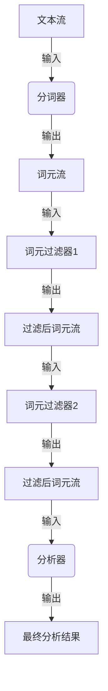

# Lucene分词原理与代码实例讲解

## 1. 背景介绍

### 1.1 问题的由来

在信息检索和自然语言处理领域中,分词(Tokenization)是一个基础且关键的预处理步骤。分词的目的是将连续的文本流拆分为一个个有意义的词元(Token),以便后续的处理和分析。然而,不同语言的分词规则和挑战有所不同,尤其是对于汉语这种缺乏明显的词语边界的语言,分词的难度更大。

### 1.2 研究现状

目前,已经有许多优秀的分词系统和算法被提出和应用,例如基于规则的分词、基于统计的分词、基于深度学习的分词等。其中,Lucene作为一款广泛使用的开源全文搜索引擎库,内置了多种分词器,可以有效地处理各种语言的分词需求。

### 1.3 研究意义

Lucene分词器的研究和应用具有重要意义:

1. **信息检索质量提升**:准确的分词是信息检索系统性能的基础,直接影响检索的准确性和召回率。
2. **自然语言处理应用**:分词是自然语言处理任务(如文本挖掘、情感分析等)的前置步骤,对后续处理质量有重要影响。
3. **跨语言处理能力**:Lucene分词器支持多种语言,有助于构建多语种的文本处理系统。
4. **开源社区贡献**:研究Lucene分词器有助于完善和优化开源分词算法,为社区做出贡献。

### 1.4 本文结构

本文将从以下几个方面对Lucene分词器进行全面介绍:

1. 核心概念与联系
2. 核心算法原理与具体操作步骤
3. 数学模型和公式详细讲解与案例分析
4. 项目实践:代码实例和详细解释
5. 实际应用场景
6. 工具和资源推荐
7. 总结:未来发展趋势与挑战
8. 附录:常见问题与解答

## 2. 核心概念与联系

在深入探讨Lucene分词器之前,我们需要理解一些核心概念及其相互关系:

1. **文本流(Text Stream)**: 指待处理的连续字符序列,可以是文件、网页内容等任何形式的文本数据。
2. **分词器(Tokenizer)**: 将文本流拆分为一个个有意义的词元的组件,是分词过程的核心。
3. **词元(Token)**: 分词后得到的、有意义的最小单位,通常是单词或短语。
4. **词元流(Token Stream)**: 由一系列词元组成的序列,是分词后的直接输出。
5. **词元过滤器(TokenFilter)**: 对词元流执行进一步的处理和过滤,如小写转换、同义词扩展等。
6. **分析器(Analyzer)**: 由分词器和一系列词元过滤器组成,负责完整的文本分析过程。

这些概念之间的关系如下所示:

Lucene提供了多种内置和自定义的分词器、词元过滤器和分析器,可以满足不同语言和场景的分词需求。下面我们将重点介绍Lucene分词器的核心算法原理。

## 3. 核心算法原理与具体操作步骤

### 3.1 算法原理概述

Lucene分词器采用了多种经典的分词算法,包括:

1. **基于规则的分词算法**:根据预定义的规则集合(如字典、正则表达式等)对文本进行匹配和切分。适用于规则相对固定的语言,如英语等。
2. **基于统计的分词算法**:通过对大量语料进行统计训练,得到词频、互信息等统计特征,并据此对文本进行分词。适用于缺乏明显词语边界的语言,如汉语等。
3. **基于深度学习的分词算法**:利用神经网络模型自动学习文本的语义和统计特征,实现端到端的分词。具有较好的泛化能力,但需要大量标注数据。

Lucene分词器综合运用了上述多种算法,并针对不同语言的特点进行了优化和扩展。下面我们将重点介绍其中的基于统计的分词算法。

### 3.2 算法步骤详解

Lucene的基于统计的分词算法主要分为以下几个步骤:

#### 3.2.1 语料库构建

首先需要构建一个包含大量文本数据的语料库,作为算法的训练数据集。语料库应该具有以下特点:

- 数据量大,能够覆盖广泛的词汇和语境
- 数据质量高,避免过多的错误和噪声
- 领域分布广,能够满足不同场景的需求

#### 3.2.2 统计特征提取

在语料库的基础上,需要提取一些统计特征,作为分词的依据。常用的统计特征包括:

1. **词频(Word Frequency)**: 每个词在语料库中出现的次数。
2. **互信息(Mutual Information)**: 衡量两个词之间关联程度的指标。
3. **左右熵(Left/Right Entropy)**: 描述一个词在句子中出现的位置分布情况。

提取这些统计特征的过程通常需要使用N-gram模型、最大熵模型等统计学习方法。

#### 3.2.3 生成候选词序列

对于给定的文本流,算法会生成所有可能的候选词序列。例如,对于文本"研究生命的奥秘",可能的候选词序列包括:

- "研究/生命/的/奥秘"
- "研究生/命的/奥秘"
- "研究生命/的/奥/秘"
- ...

#### 3.2.4 候选词序列评分

对于每个候选词序列,算法会根据之前提取的统计特征,计算一个评分,衡量该序列的可能性。评分函数通常是一个加权的线性组合,包括各个统计特征的得分。

例如,评分函数可以是:

$$\text{Score}(S) = \alpha \times \text{WordFreq}(S) + \beta \times \text{MutualInfo}(S) + \gamma \times \text{LeftEntropy}(S) + \delta \times \text{RightEntropy}(S)$$

其中,$ \alpha $、$ \beta $、$ \gamma $、$ \delta $是各个特征的权重系数,需要通过训练数据进行调优。

#### 3.2.5 动态规划求解

由于候选词序列的数量是指数级增长的,因此需要使用动态规划算法来高效求解最优序列。

动态规划的基本思路是:定义状态转移方程,将原问题划分为多个子问题,并利用子问题的最优解推导出原问题的最优解。

对于分词问题,我们可以定义:

- 状态: $ f(i) $表示文本流前 $ i $个字符的最优分词序列的评分
- 初始状态: $ f(0) = 0 $
- 状态转移方程:

$$f(i) = \max\limits_{j<i}\{f(j) + \text{Score}(\text{Substring}(j, i))\}$$

其中, $ \text{Substring}(j, i) $表示文本流从第 $ j $个字符到第 $ i $个字符的子串。

通过动态规划求解,我们可以得到文本流的最优分词序列。

### 3.3 算法优缺点

Lucene的基于统计分词算法具有以下优缺点:

**优点**:

1. **无需人工构建词典**,可以自动发现新词
2. **适用于缺乏明显词语边界的语言**,如汉语等
3. **可以通过调整统计特征权重适应不同领域**
4. **动态规划算法保证了高效性**

**缺点**:

1. **需要大量高质量的语料库作为训练数据**
2. **对低频词和生僻词的识别能力较差**
3. **统计特征的选择和权重调优需要大量的实验**
4. **对于一些特殊语法结构的处理可能不够精准**

### 3.4 算法应用领域

Lucene的分词算法广泛应用于以下领域:

1. **全文搜索引擎**: 作为Lucene的核心组件,分词器为搜索引擎提供了高质量的文本处理能力。
2. **自然语言处理**: 分词是自然语言处理任务(如文本挖掘、情感分析等)的前置步骤,对后续处理质量有重要影响。
3. **文本数据处理**: 任何需要对文本数据进行处理和分析的场景,如网页内容抽取、文本聚类等,都可以使用Lucene分词器。
4. **跨语言处理**: Lucene分词器支持多种语言,可以应用于多语种的文本处理系统。

## 4. 数学模型和公式详细讲解与举例说明

在第3.2.4节中,我们介绍了Lucene分词算法的评分函数,它是一个加权的线性组合,包括多个统计特征的得分。现在,我们将详细讲解这些统计特征的数学模型和公式。

### 4.1 数学模型构建

#### 4.1.1 词频(Word Frequency)

词频是最直观的统计特征,表示一个词在语料库中出现的次数。对于一个词 $ w $,它的词频可以定义为:

$$\text{WordFreq}(w) = \frac{c(w)}{N}$$

其中, $ c(w) $表示词 $ w $在语料库中出现的次数, $ N $表示语料库中所有词的总数。

通常,我们会对词频进行平滑处理,避免出现 $ 0 $值:

$$\text{SmoothWordFreq}(w) = \frac{c(w) + \alpha}{N + \alpha V}$$

其中, $ \alpha $是平滑参数, $ V $是语料库中不同词的数量。

#### 4.1.2 互信息(Mutual Information)

互信息用于衡量两个词之间的关联程度。对于两个词 $ w_1 $和 $ w_2 $,它们的互信息可以定义为:

$$\text{MutualInfo}(w_1, w_2) = \log\frac{P(w_1, w_2)}{P(w_1)P(w_2)}$$

其中, $ P(w_1, w_2) $表示两个词同时出现的概率, $ P(w_1) $和 $ P(w_2) $分别表示每个词单独出现的概率。

互信息的值越大,说明两个词之间的关联度越高。如果两个词完全独立,则互信息为 $ 0 $。

在实际计算中,我们通常使用最大似然估计来近似计算概率:

$$P(w) = \frac{c(w)}{N}, \quad P(w_1, w_2) = \frac{c(w_1, w_2)}{N}$$

其中, $ c(w_1, w_2) $表示两个词同时出现的次数。

#### 4.1.3 左右熵(Left/Right Entropy)

左熵和右熵用于描述一个词在句子中出现的位置分布情况。对于一个词 $ w $,它的左熵可以定义为:

$$\text{LeftEntropy}(w) = -\sum_{c \in \mathcal{C}} P(c|w) \log P(c|w)$$

其中, $ \mathcal{C} $表示所有可能的上下文(即词 $ w $前面的字符), $ P(c|w) $表示在给定词 $ w $的情况下,上下文 $ c $出现的条件概率。

类似地,右熵可以定义为:

$$\text{RightEntropy}(w) = -\sum_{c \in \mathcal{C}} P(c|w) \log P(c|w)$$

其中, $ \mathcal{C} $表示所有可能的下文(即词 $ w $后面的字符)。

熵的值越大,说明该词在句子中出现的位置分布越分散;熵值越小,说明该词在句子中出现的位置分布越集中。

在实际计算中,我们通常使用最大似然估计来近似计算条件概率:

$$P(c|w) = \frac{c(c, w)}{c(w)}$$

其中, $ c(c, w) $表示上下文 $ c $和词