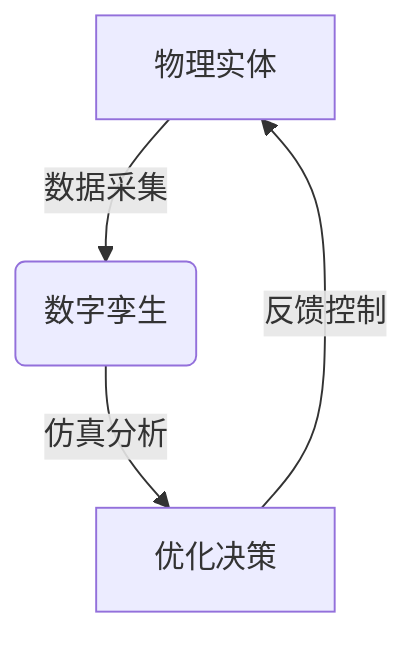
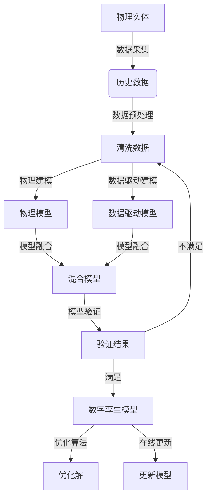

# 数字孪生 (Digital Twin)

## 1. 背景介绍

### 1.1 问题的由来

在当今快速发展的工业时代,制造业面临着许多挑战,例如提高效率、降低成本、缩短产品上市时间等。传统的物理模型和仿真方法已经无法满足日益复杂的系统需求。因此,数字孪生(Digital Twin)技术应运而生,旨在创建一个虚拟的数字化副本,与实际的物理实体保持同步,以支持产品的整个生命周期管理。

### 1.2 研究现状

数字孪生概念最早可追溯至2003年,当时由迈克尔·格里夫斯(Michael Grieves)在课程演讲中首次提出。近年来,随着物联网、大数据、人工智能等技术的快速发展,数字孪生技术也得到了广泛关注和应用。越来越多的企业开始采用数字孪生来优化产品设计、生产过程、运维管理等各个环节。

### 1.3 研究意义

数字孪生技术具有重要的理论意义和应用价值:

1. **理论意义**:数字孪生融合了多学科知识,包括物理建模、数据采集、机器学习、可视化等,为复杂系统的虚拟化和优化提供了新的研究方向。

2. **应用价值**:数字孪生可以帮助企业提高生产效率、降低运营成本、优化产品性能、延长资产使用寿命等,从而获得竞争优势。

### 1.4 本文结构

本文将全面介绍数字孪生技术的核心概念、关键算法、数学模型、实际应用以及未来趋势。文章结构如下:

1. 背景介绍
2. 核心概念与联系
3. 核心算法原理与具体操作步骤
4. 数学模型和公式详细讲解与案例分析
5. 项目实践:代码实例和详细解释
6. 实际应用场景
7. 工具和资源推荐
8. 总结:未来发展趋势与挑战
9. 附录:常见问题与解答

## 2. 核心概念与联系

数字孪生(Digital Twin)是一种集成了多学科知识的新兴技术paradigm,其核心思想是在虚拟空间中构建一个与现实世界中的物理实体相对应的数字副本。这种虚实映射关系贯穿了数字孪生的整个生命周期,包括设计、制造、运营和维护等各个阶段。

如上面的 Mermaid 流程图所示,数字孪生与物理实体之间存在双向交互:

1. **数据采集**: 利用各种传感器和数据采集设备,实时获取物理实体的状态数据,并传输到数字孪生模型中。

2. **仿真分析**: 在数字孪生模型中,可以进行各种仿真分析,包括性能预测、故障诊断、优化设计等,从而得出优化决策。

3. **反馈控制**: 将优化决策反馈到物理实体,通过控制系统实现闭环调节,优化物理实体的运行状态。

数字孪生技术与其他相关技术存在紧密联系,例如:

- **物联网(IoT)**: 提供了数据采集和通信的基础设施。
- **大数据分析**: 处理和分析来自物理实体的海量数据。
- **人工智能(AI)**: 机器学习算法用于建模和优化数字孪生。
- **虚拟现实(VR)**: 可视化和交互式展示数字孪生。
- **增强现实(AR)**: 将数字孪生信息叠加到物理世界中。

## 3. 核心算法原理与具体操作步骤

### 3.1 算法原理概述

构建数字孪生模型的核心算法主要包括以下几个方面:

1. **物理建模**: 根据物理定律和经验公式,建立描述物理实体行为的数学模型。

2. **数据驱动建模**: 利用机器学习算法,从历史数据中自动发现模式,构建数据驱动的模型。

3. **模型融合**: 将物理模型和数据驱动模型相结合,形成混合模型,以获得更准确的预测能力。

4. **优化算法**: 基于数字孪生模型,采用优化算法(如遗传算法、蚁群算法等)寻找最佳解决方案。

5. **在线更新**: 实时将物理实体的新数据融入数字孪生模型,持续优化和校准模型参数。

### 3.2 算法步骤详解

构建数字孪生模型的一般步骤如下:

1. **数据采集**: 从物理实体中采集相关数据,包括传感器数据、操作数据、环境数据等。

2. **数据预处理**: 对采集的原始数据进行清洗、去噪、填补缺失值等预处理,以提高数据质量。

3. **物理建模**: 基于物理定律和领域知识,构建描述物理实体行为的数学模型。

4. **数据驱动建模**: 使用机器学习算法(如神经网络、决策树等)从历史数据中学习模式,构建数据驱动模型。

5. **模型融合**: 将物理模型和数据驱动模型融合,形成混合模型,以结合两种模型的优势。

6. **模型验证**: 使用保留的测试数据集对混合模型进行验证,评估其预测精度和泛化能力。

7. **优化算法**: 如果模型验证结果满足要求,则基于数字孪生模型采用优化算法(如遗传算法、蚁群算法等)寻找最佳解决方案。

8. **在线更新**: 实时将物理实体的新数据融入数字孪生模型,持续优化和校准模型参数,保持模型的准确性。

9. **迭代优化**: 如果模型验证结果不满足要求,则需要重新进行数据预处理、模型构建等步骤,迭代优化模型。

### 3.3 算法优缺点

数字孪生算法具有以下优点:

1. **高精度**: 融合物理模型和数据驱动模型,可以提高预测精度。
2. **高效率**: 通过仿真分析,可以快速评估不同方案,提高决策效率。
3. **可解释性**: 物理模型具有较好的可解释性,有助于理解系统内在机理。
4. **在线更新**: 可以实时更新模型,保持与物理实体的同步。

但也存在以下缺点:

1. **建模复杂度高**: 对于复杂系统,构建准确的物理模型和数据驱动模型都是一个挑战。
2. **数据质量要求高**: 模型的准确性高度依赖于数据的质量和完整性。
3. **计算资源消耗大**: 复杂模型的训练和优化往往需要大量的计算资源。
4. **安全和隐私风险**: 数字孪生系统面临潜在的网络攻击和数据泄露风险。

### 3.4 算法应用领域

数字孪生算法可以广泛应用于各个领域,包括但不限于:

1. **制造业**: 产品设计优化、工艺过程仿真、预测性维护等。
2. **航空航天**: 飞机设计、飞行仿真、故障诊断等。
3. **能源电力**: 发电设备运维、输电线路优化、能源管理等。
4. **城市规划**: 交通流量模拟、环境影响评估、基础设施优化等。
5. **医疗健康**: 疾病预测模型、手术规划、个性化治疗方案等。
6. **智能建筑**: 能耗优化、舒适度调节、设备故障预测等。

## 4. 数学模型和公式详细讲解与案例分析

### 4.1 数学模型构建

在数字孪生中,物理建模是构建数学模型的关键步骤。根据不同的物理实体和应用场景,可以采用不同的数学模型,例如:

1. **常微分方程模型**: 描述连续时间动态系统的行为,广泛应用于机械、电气、化学等领域。

   $$
   \frac{d^2x}{dt^2} + 2\zeta\omega_n\frac{dx}{dt} + \omega_n^2x = f(t)
   $$

   上式是一个典型的质量-阻尼-弹性系统的运动方程,其中 $x$ 表示位移, $\zeta$ 是阻尼比, $\omega_n$ 是固有频率, $f(t)$ 是外力。

2. **有限元模型**: 将连续介质(如结构、流体等)离散化为有限个单元,常用于结构分析、流体动力学等领域。

3. **贝叶斯网络模型**: 基于概率论的图模型,可以表示随机变量之间的因果关系,适用于诊断、预测和决策等问题。

4. **神经网络模型**: 受生物神经元启发的数学模型,具有强大的非线性映射能力,广泛用于模式识别、回归分析等任务。

在构建数学模型时,需要根据实际问题的特点选择合适的模型形式,并确定模型参数,使模型能够准确描述物理实体的行为。

### 4.2 公式推导过程

以质量-阻尼-弹性系统为例,推导其运动方程的过程如下:

1. 根据牛顿第二定律,质点受到的合力等于其质量与加速度的乘积:

   $$
   \sum F = ma
   $$

2. 将作用在质点上的各个力分解:
   - 弹性力 $F_s = -kx$
   - 阻尼力 $F_d = -cv$
   - 外力 $F(t)$

   其中 $k$ 是弹性系数, $c$ 是阻尼系数, $v = \frac{dx}{dt}$ 是速度。

3. 将各个力代入牛顿运动方程:

   $$
   ma = -kx - cv + F(t)
   $$

4. 由于 $a = \frac{d^2x}{dt^2}$,将加速度替换:

   $$
   m\frac{d^2x}{dt^2} + c\frac{dx}{dt} + kx = F(t)
   $$

5. 令 $\omega_n = \sqrt{\frac{k}{m}}$, $2\zeta\omega_n = \frac{c}{m}$,得到标准形式:

   $$
   \frac{d^2x}{dt^2} + 2\zeta\omega_n\frac{dx}{dt} + \omega_n^2x = \frac{1}{m}F(t)
   $$

通过上述推导,我们得到了质量-阻尼-弹性系统的运动方程,描述了该系统在外力作用下的动态响应。这个公式是构建数字孪生模型的基础。

### 4.3 案例分析与讲解

考虑一个汽车悬架系统的数字孪生案例。我们需要构建一个数学模型,描述汽车在不同路面条件下的振动行为,以优化悬架设计,提高乘坐舒适性。

1. **确定模型形式**:

   由于汽车悬架系统属于质量-阻尼-弹性系统,因此可以采用前面推导的运动方程作为数学模型的基础。

2. **确定模型参数**:

   - 质量 $m$: 汽车的总质量
   - 弹性系数 $k$: 悬架弹簧的刚度
   - 阻尼系数 $c$: 减振器的阻尼特性
   - 外力 $F(t)$: 路面输入激励,可以根据不同路面类型(平整路面、坑洼路面等)建模

3. **模型求解**:

   对于给定的初始条件和外力输入,可以使用数值积分方法(如龙格-库