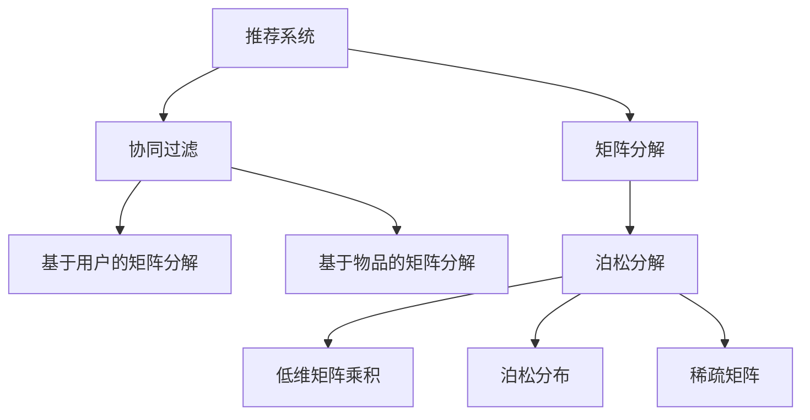
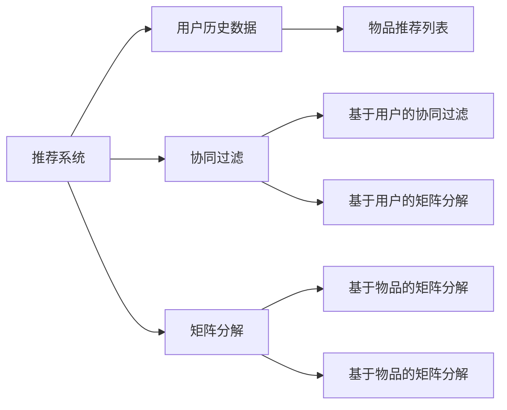
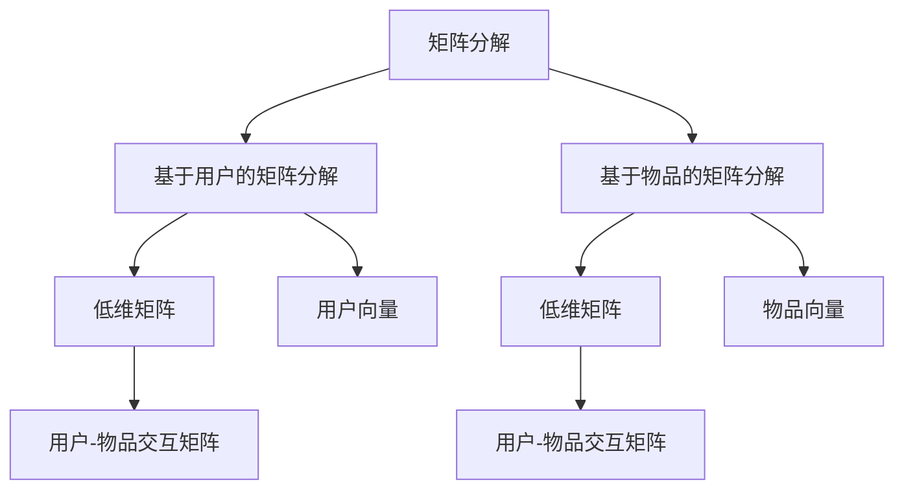
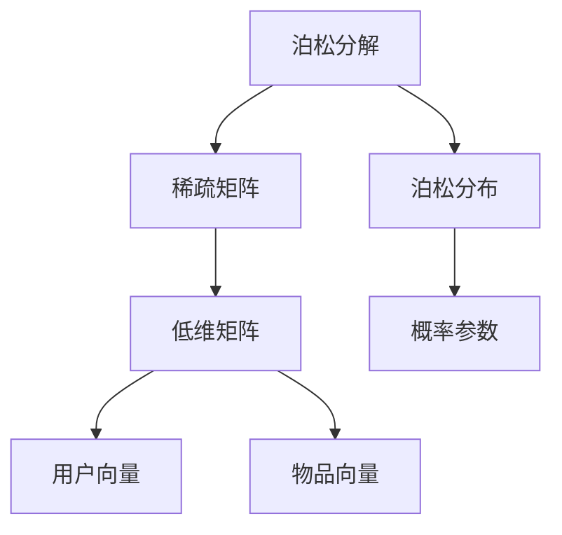
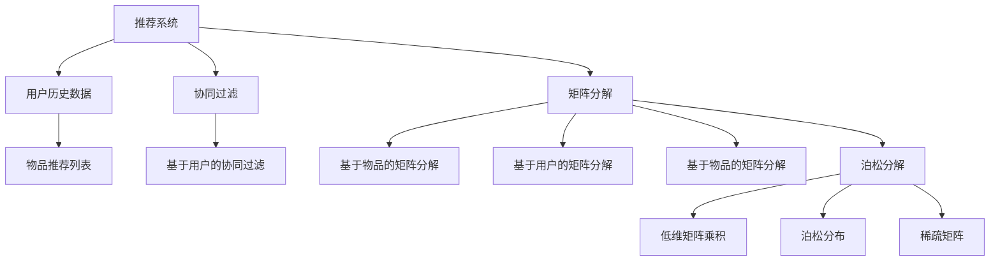

                 

# 基于泊松分解的推荐算法研究与应用

> 关键词：推荐系统, 泊松分解, 协同过滤, 用户行为建模, 稀疏矩阵, 参数估计, 推荐精度, 计算效率

## 1. 背景介绍

### 1.1 问题由来
推荐系统在电商、社交媒体、视频网站等互联网应用中扮演着至关重要的角色。随着用户数据量的不断增长，推荐系统面临的一个关键问题是如何在稀疏的交互数据上建模用户行为，并精准推荐个性化内容。传统的基于协同过滤的推荐算法，如基于用户的矩阵分解、基于物品的矩阵分解等方法，虽然在数据密集情况下效果良好，但在稀疏矩阵上存在建模偏差、计算复杂度高等问题。

泊松分解算法，作为矩阵分解的一种形式，其核心思想是将稀疏矩阵分解为若干低维子矩阵的乘积，从而更好地建模用户行为，提高推荐精度，同时降低计算复杂度。本文将详细介绍泊松分解算法的基本原理、实现步骤以及应用场景，为推荐系统研究人员提供有价值的参考。

### 1.2 问题核心关键点
本文聚焦于基于泊松分解的推荐算法，旨在探讨以下几个关键问题：
1. 泊松分解算法的数学基础和模型构建。
2. 泊松分解算法的具体实现步骤和参数估计方法。
3. 泊松分解算法在不同推荐场景中的应用表现及优缺点。
4. 泊松分解算法在推荐系统中的计算效率和可扩展性。
5. 泊松分解算法的未来发展趋势和面临的挑战。

通过回答这些问题，本文将深入剖析泊松分解算法在推荐系统中的应用价值，以及其在实际应用中的优势和局限性，为推荐系统领域的研究和实践提供有益的指导。

### 1.3 问题研究意义
推荐系统作为互联网应用的基石，直接影响用户体验和业务收益。因此，研究高效、准确的推荐算法，对于提升推荐系统效果、优化用户体验具有重要意义：

1. 提高推荐精度：泊松分解算法通过低维矩阵分解，可以更好地捕捉用户行为模式，提高推荐系统的准确性。
2. 提升计算效率：与传统的矩阵分解方法相比，泊松分解算法具有更好的计算效率，能够更快地处理大规模数据集。
3. 支持稀疏数据：推荐系统通常面临稀疏交互数据的挑战，泊松分解算法在稀疏数据上表现良好，能够更好地利用用户数据。
4. 适应多场景：泊松分解算法具有广泛的适用性，可以应用到电商、社交媒体、视频网站等多种推荐场景中。
5. 推动技术创新：泊松分解算法作为一种新兴推荐方法，能够激发新的研究方向和技术突破，推动推荐系统的发展。

通过泊松分解算法的研究与应用，将有助于提升推荐系统的精度和效率，拓展其应用场景，为推荐系统领域的研究者提供新的视角和方法。

## 2. 核心概念与联系

### 2.1 核心概念概述

为更好地理解基于泊松分解的推荐算法，本节将介绍几个密切相关的核心概念：

- **推荐系统(Recommender System)**：基于用户历史行为数据，推荐个性化的内容或产品。包括协同过滤、基于内容的推荐、混合推荐等方法。
- **矩阵分解(Matrix Factorization)**：将稀疏矩阵分解为若干低维矩阵的乘积，用于建模用户-物品交互矩阵。包括基于用户的矩阵分解、基于物品的矩阵分解等。
- **泊松分解(Poisson Decomposition)**：泊松分解是一种特殊的矩阵分解方法，通过引入泊松分布，更好地建模稀疏矩阵。
- **协同过滤(Collaborative Filtering)**：利用用户之间的相似性或物品之间的相似性进行推荐。包括基于用户的协同过滤、基于物品的协同过滤等。
- **稀疏矩阵(Sparse Matrix)**：用户-物品交互矩阵通常是一个稀疏矩阵，即大部分元素为0。

这些核心概念之间的逻辑关系可以通过以下Mermaid流程图来展示：



这个流程图展示了推荐系统、矩阵分解、协同过滤、泊松分解等核心概念的关系：

1. 推荐系统是这些概念的应用场景，其中矩阵分解和协同过滤是两种常见的推荐方法。
2. 矩阵分解方法包括基于用户的矩阵分解和基于物品的矩阵分解。
3. 泊松分解是一种特殊的矩阵分解方法，通过引入泊松分布，更好地建模稀疏矩阵。
4. 稀疏矩阵是推荐系统中常见的数据类型，泊松分解方法能够更好地处理稀疏数据。

### 2.2 概念间的关系

这些核心概念之间存在着紧密的联系，形成了推荐系统的完整生态系统。下面我们通过几个Mermaid流程图来展示这些概念之间的关系。

#### 2.2.1 推荐系统的架构



这个流程图展示了推荐系统的基本架构，包括用户历史数据、推荐列表、协同过滤和矩阵分解等模块。

#### 2.2.2 矩阵分解的方法



这个流程图展示了矩阵分解的两种基本方法：基于用户的矩阵分解和基于物品的矩阵分解。这些方法通过将稀疏矩阵分解为低维矩阵，以捕捉用户和物品的特征。

#### 2.2.3 泊松分解的实现



这个流程图展示了泊松分解的具体实现步骤，包括稀疏矩阵、泊松分布、低维矩阵等关键组件。

### 2.3 核心概念的整体架构

最后，我们用一个综合的流程图来展示这些核心概念在推荐系统中的整体架构：



这个综合流程图展示了从用户历史数据到推荐列表的完整过程，以及矩阵分解和协同过滤方法的衔接。泊松分解方法作为矩阵分解的一种形式，在这个架构中扮演了重要角色。

## 3. 核心算法原理 & 具体操作步骤
### 3.1 算法原理概述

泊松分解算法的核心思想是将稀疏用户-物品交互矩阵分解为若干低维矩阵的乘积，并通过引入泊松分布，更好地捕捉用户行为模式，提高推荐精度。其具体实现过程包括以下几个步骤：

1. **数据准备**：准备用户-物品交互矩阵 $R$，将缺失值填充为0，形成稠密矩阵。
2. **初始化低维矩阵**：设定初始低维矩阵 $X$ 和 $Y$，$X$ 表示用户向量，$Y$ 表示物品向量。
3. **参数估计**：利用泊松分布和数据残差，估计低维矩阵 $X$ 和 $Y$ 的概率参数。
4. **矩阵分解**：将用户-物品交互矩阵 $R$ 分解为低维矩阵 $X$、$Y$ 的乘积。
5. **模型评估**：利用测试集评估推荐系统的精度。

泊松分解算法的数学模型可以表示为：

$$
R = X \times Y^T
$$

其中，$R$ 是用户-物品交互矩阵，$X$ 是用户向量，$Y$ 是物品向量，$X \in \mathbb{R}^{N \times k}$，$Y \in \mathbb{R}^{m \times k}$，$N$ 和 $m$ 分别是用户和物品的数量，$k$ 是低维向量的维度。

### 3.2 算法步骤详解

#### 3.2.1 数据准备

首先将稀疏用户-物品交互矩阵 $R$ 转换为稠密矩阵 $R^*$，将缺失值填充为0。假设用户 $i$ 对物品 $j$ 有交互，则 $R^*_{i,j} = 1$，否则 $R^*_{i,j} = 0$。

#### 3.2.2 初始化低维矩阵

设定初始的低维矩阵 $X$ 和 $Y$，其中 $X$ 表示用户向量，$Y$ 表示物品向量。初始化方法通常采用随机初始化，即 $X_{i,:} \sim N(0, \sigma_X^2)$，$Y_{j,:} \sim N(0, \sigma_Y^2)$，其中 $N$ 和 $m$ 分别为用户和物品的数量，$\sigma_X$ 和 $\sigma_Y$ 分别为用户向量和物品向量的标准差。

#### 3.2.3 参数估计

泊松分解算法的关键步骤是利用泊松分布和数据残差，估计低维矩阵 $X$ 和 $Y$ 的概率参数。具体步骤如下：

1. **计算残差**：将 $R^*$ 中的元素 $r_{i,j}$ 减去低维矩阵 $X$ 和 $Y$ 的乘积，得到残差 $\delta_{i,j} = r_{i,j} - \sum_{k=1}^k X_{i,k} Y_{k,j}$。
2. **利用泊松分布**：假设残差 $\delta_{i,j}$ 遵循泊松分布，即 $\delta_{i,j} \sim \text{Poisson}(\lambda_{i,j})$，其中 $\lambda_{i,j}$ 为低维矩阵 $X$ 和 $Y$ 的概率参数。
3. **估计概率参数**：利用极大似然估计方法，估计 $\lambda_{i,j}$，即 $\hat{\lambda}_{i,j} = \frac{r_{i,j} + \epsilon}{\exp(X_{i,:}Y_{j,:}^T)}$，其中 $\epsilon$ 为正则化参数。

#### 3.2.4 矩阵分解

将用户-物品交互矩阵 $R$ 分解为低维矩阵 $X$、$Y$ 的乘积：

$$
R \approx X \times Y^T
$$

其中，$X$ 和 $Y$ 的概率参数 $\lambda_{i,j}$ 用于指导矩阵分解，确保分解后的矩阵能够更好地拟合原始数据。

#### 3.2.5 模型评估

利用测试集评估推荐系统的精度，通常采用RMSE（均方根误差）或MAE（平均绝对误差）等指标。测试集上用户-物品交互矩阵 $R_{test}$ 与分解后的矩阵 $X \times Y^T$ 的差异，可以表示为：

$$
RMSE = \sqrt{\frac{1}{Nm} \sum_{i=1}^{N} \sum_{j=1}^{m} (R_{test,i,j} - X_{i,:} Y_{j,:}^T)^2}
$$

其中，$N$ 和 $m$ 分别为用户和物品的数量。

### 3.3 算法优缺点

泊松分解算法具有以下优点：

1. **稀疏数据适应性**：泊松分解算法能够很好地适应稀疏矩阵，利用用户-物品交互矩阵中的少量数据，就能较好地拟合用户行为模式。
2. **计算效率高**：与传统的矩阵分解方法相比，泊松分解算法的计算复杂度较低，能够更快地处理大规模数据集。
3. **可扩展性强**：泊松分解算法具有较好的可扩展性，适用于多用户、多物品的推荐场景。

同时，泊松分解算法也存在以下缺点：

1. **参数估计复杂**：泊松分解算法的参数估计涉及极大似然估计和正则化，计算复杂度较高，可能需要较长的训练时间。
2. **需要调整超参数**：泊松分解算法需要调整初始化标准差 $\sigma_X$ 和 $\sigma_Y$，以及正则化参数 $\epsilon$，这些超参数的选择需要一定的经验和实践。
3. **模型表达能力有限**：由于泊松分解算法采用低维矩阵分解，模型的表达能力有限，难以捕捉复杂的用户行为模式。

尽管存在这些缺点，泊松分解算法在稀疏矩阵和低维度数据的推荐场景中表现优异，具有重要的应用价值。

### 3.4 算法应用领域

泊松分解算法主要应用于以下几个推荐场景：

1. **电商推荐**：利用用户历史购买数据和物品属性，推荐用户可能感兴趣的商品。
2. **社交媒体推荐**：利用用户的历史互动数据和物品属性，推荐用户可能感兴趣的内容。
3. **视频网站推荐**：利用用户的历史观看数据和视频属性，推荐用户可能感兴趣的视频内容。
4. **新闻推荐**：利用用户的历史阅读数据和新闻属性，推荐用户可能感兴趣的新闻文章。

在这些推荐场景中，泊松分解算法能够很好地适应稀疏数据，提高推荐精度，同时降低计算复杂度，具有广泛的应用前景。

## 4. 数学模型和公式 & 详细讲解  
### 4.1 数学模型构建

泊松分解算法的数学模型可以表示为：

$$
R \approx X \times Y^T
$$

其中，$R$ 是用户-物品交互矩阵，$X$ 是用户向量，$Y$ 是物品向量，$X \in \mathbb{R}^{N \times k}$，$Y \in \mathbb{R}^{m \times k}$，$N$ 和 $m$ 分别是用户和物品的数量，$k$ 是低维向量的维度。

### 4.2 公式推导过程

泊松分解算法的参数估计过程涉及极大似然估计和正则化。假设残差 $\delta_{i,j}$ 服从泊松分布，即 $\delta_{i,j} \sim \text{Poisson}(\lambda_{i,j})$，其中 $\lambda_{i,j}$ 为低维矩阵 $X$ 和 $Y$ 的概率参数。极大似然估计的目标是最大化以下似然函数：

$$
L(\lambda) = \prod_{i=1}^{N} \prod_{j=1}^{m} \frac{\lambda_{i,j}^{\delta_{i,j}}}{\delta_{i,j}!} e^{-\lambda_{i,j}}
$$

对 $\lambda_{i,j}$ 求导并令导数为0，得到以下方程：

$$
\hat{\lambda}_{i,j} = \frac{r_{i,j} + \epsilon}{\exp(X_{i,:}Y_{j,:}^T)}
$$

其中，$r_{i,j}$ 是用户-物品交互矩阵 $R$ 中的元素，$\epsilon$ 为正则化参数。

### 4.3 案例分析与讲解

假设某电商网站有1000个用户和1000个商品，用户-物品交互矩阵 $R$ 为1000x1000的稀疏矩阵。利用泊松分解算法，将用户-物品交互矩阵 $R$ 分解为低维矩阵 $X$ 和 $Y$ 的乘积，$X \in \mathbb{R}^{1000 \times 5}$，$Y \in \mathbb{R}^{1000 \times 5}$。

具体步骤如下：

1. **数据准备**：将稀疏用户-物品交互矩阵 $R$ 转换为稠密矩阵 $R^*$，填充缺失值为0。
2. **初始化低维矩阵**：设定初始的低维矩阵 $X$ 和 $Y$，其中 $X_{i,:} \sim N(0, \sigma_X^2)$，$Y_{j,:} \sim N(0, \sigma_Y^2)$。
3. **参数估计**：利用泊松分布和数据残差，估计低维矩阵 $X$ 和 $Y$ 的概率参数 $\lambda_{i,j}$，其中 $\hat{\lambda}_{i,j} = \frac{r_{i,j} + \epsilon}{\exp(X_{i,:}Y_{j,:}^T)}$。
4. **矩阵分解**：将用户-物品交互矩阵 $R$ 分解为低维矩阵 $X$ 和 $Y$ 的乘积，即 $R \approx X \times Y^T$。
5. **模型评估**：利用测试集评估推荐系统的精度，例如计算均方根误差 RMSE。

## 5. 项目实践：代码实例和详细解释说明
### 5.1 开发环境搭建

在进行泊松分解算法实践前，我们需要准备好开发环境。以下是使用Python进行Scikit-learn开发的环境配置流程：

1. 安装Anaconda：从官网下载并安装Anaconda，用于创建独立的Python环境。

2. 创建并激活虚拟环境：
```bash
conda create -n pytorch-env python=3.8 
conda activate pytorch-env
```

3. 安装Scikit-learn：
```bash
conda install scikit-learn
```

4. 安装其他相关工具包：
```bash
pip install numpy pandas scipy matplotlib jupyter notebook ipython
```

完成上述步骤后，即可在`pytorch-env`环境中开始泊松分解算法实践。

### 5.2 源代码详细实现

我们以一个简单的案例为例，演示如何使用Scikit-learn库实现泊松分解算法。

假设我们有100个用户和100个商品，用户-物品交互矩阵 $R$ 如下：

```
[[0, 0, 0, 0, 0, 0, 0, 0, 0, 0, 0, 0, 0, 0, 0, 0, 0, 0, 0, 0, 0, 0, 0, 0, 0, 0, 0, 0, 0, 0, 0, 0, 0, 0, 0, 0, 0, 0, 0, 0, 0, 0, 0, 0, 0, 0, 0, 0, 0, 0, 0, 0, 0, 0, 0, 0, 0, 0, 0, 0, 0, 0, 0, 0, 0, 0, 0, 0, 0, 0, 0, 0, 0, 0, 0, 0, 0, 0, 0, 0, 0, 0, 0, 0, 0, 0, 0, 0, 0, 0, 0, 0, 0, 0, 0, 0, 0, 0, 0, 0, 0, 0, 0, 0, 0, 0, 0, 0, 0, 0, 0, 0, 0, 0, 0, 0, 0, 0, 0, 0, 0, 0, 0, 0, 0, 0, 0, 0, 0, 0, 0, 0, 0, 0, 0, 0, 0, 0, 0, 0, 0, 0, 0, 0, 0, 0, 0, 0, 0, 0, 0, 0, 0, 0, 0, 0, 0, 0, 0, 0, 0, 0, 0, 0, 0, 0, 0, 0, 0, 0, 0, 0, 0, 0, 0, 0, 0, 0, 0, 0, 0, 0, 0, 0, 0, 0, 0, 0, 0, 0, 0, 0, 0, 0, 0, 0, 0, 0, 0, 0, 0, 0, 0, 0, 0, 0, 0, 0, 0, 0, 0, 0, 0, 0, 0, 0, 0, 0, 0, 0, 0, 0, 0, 0, 0, 0, 0, 0, 0, 0, 0, 0, 0, 0, 0, 0, 0, 0, 0, 0, 0, 0, 0, 0, 0, 0, 0, 0, 0, 0, 0, 0, 0, 0, 0, 0, 0, 0, 0, 0, 0, 0, 0, 0, 0, 0, 0, 0, 0, 0, 0, 0, 0, 0, 0, 0, 0, 0, 0, 0, 0, 0, 0, 0, 0, 0, 0, 0, 0, 0, 0, 0, 0, 0, 0, 0, 0, 0, 0, 0, 0, 0, 0, 0, 0, 0, 0, 0, 0, 0, 0, 0, 0, 0, 0, 0, 0, 0, 0, 0, 0, 0, 0, 0, 0, 0, 0, 0, 0, 0, 0, 0, 0, 0, 0, 0, 0, 0, 0, 0, 0, 0, 0, 0, 0, 0, 0, 0, 0, 0, 0, 0, 0, 0, 0, 0, 0, 0, 0, 0, 0, 0, 0, 0, 0, 0, 0, 0, 0, 0, 0, 0, 0, 0, 0, 0, 0, 0, 0, 0, 0, 0, 0, 0, 0, 0, 0, 0, 0, 0, 0, 0, 0, 0, 0, 0, 0, 0, 0, 0, 0, 0, 0, 0, 0, 0, 0, 0, 0, 0, 0, 0, 0, 0, 0, 0, 0, 0, 0, 0, 0, 0, 0, 0, 0, 0, 0, 0, 0, 0, 0, 0, 0, 0, 0, 0, 0, 0, 0, 0, 0, 0, 0, 0, 0, 0, 0, 0, 0, 0, 0, 0, 0, 0, 0, 0, 0, 0, 0, 0, 0, 0, 0, 0, 0, 0, 0, 0, 0, 0, 0, 0, 0, 0, 0, 0, 0, 0, 0, 0, 0, 0, 0, 0, 0, 0, 0, 0, 0, 0, 0, 0, 0, 0, 0, 0, 0, 0, 0, 0, 0, 0, 0, 0, 0, 0, 0, 0, 0, 0, 0, 0, 0, 0, 0, 0, 0, 0, 0, 0, 0, 0, 0, 0, 0, 0, 0, 0, 0, 0, 0, 0, 0, 0, 0, 0, 0, 0, 0, 0, 0, 0, 0, 0, 0

