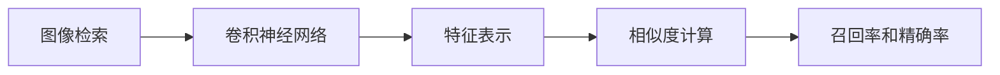
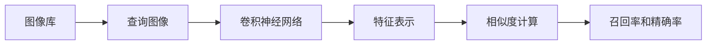
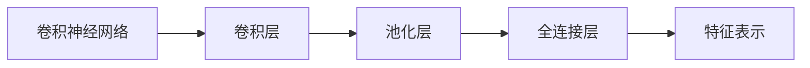
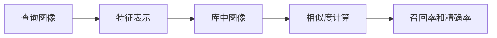

                 

# 基于深度学习的图像检索算法研究

> 关键词：图像检索,深度学习,卷积神经网络,特征表示,相似度计算

## 1. 背景介绍

随着互联网和社交媒体的迅猛发展，人们生成和分享图片的速度急剧增加，图像库和数据库的数量也随之激增。如何有效地管理和检索这些图片，成为一个亟待解决的问题。传统的图像检索方法依赖于图像的局部特征和全局特征，这些特征的计算复杂度高，并且容易受到噪声和畸变的影响，无法满足现代图像库和数据库的需求。

基于深度学习的图像检索算法，通过学习和提取图像的高层次语义特征，显著提高了检索的准确性和速度。该技术利用卷积神经网络（CNN）进行特征提取和表示学习，通过计算图像之间的相似度，实现高效、准确的图像检索。本文将详细介绍基于深度学习的图像检索算法，包括核心概念、算法原理、具体操作步骤，并给出实例说明，最后探讨其实际应用场景和未来发展趋势。

## 2. 核心概念与联系

### 2.1 核心概念概述

为更好地理解基于深度学习的图像检索算法，本节将介绍几个密切相关的核心概念：

- **图像检索**：利用计算机视觉技术和机器学习算法，从大量图像库或数据库中查找与查询图像最相似的图像。
- **卷积神经网络（CNN）**：一种前馈神经网络，通过卷积层、池化层、全连接层等层次结构，对图像进行特征提取和表示学习。
- **特征表示**：利用深度学习算法提取的图像特征，用于描述图像的语义信息。
- **相似度计算**：衡量查询图像与库中图像之间的相似程度，是图像检索的核心步骤。
- **召回率和精确率**：用于评估检索系统性能的指标，分别表示检索到的相关图像占库中所有相关图像的比例和检索到的相关图像占检索结果的比例。

这些概念之间的逻辑关系可以通过以下Mermaid流程图来展示：



这个流程图展示了图像检索的核心流程：首先利用卷积神经网络提取图像特征，然后计算查询图像与库中图像之间的相似度，最后根据召回率和精确率评估检索系统性能。

### 2.2 概念间的关系

这些核心概念之间存在着紧密的联系，形成了图像检索的完整流程。下面我们通过几个Mermaid流程图来展示这些概念之间的关系。

#### 2.2.1 图像检索的基本流程



这个流程图展示了图像检索的基本流程，即从图像库中检索与查询图像最相似的图像，并根据召回率和精确率评估检索系统性能。

#### 2.2.2 CNN结构与特征表示



这个流程图展示了CNN的基本结构，通过卷积层、池化层和全连接层等层次结构，对图像进行特征提取和表示学习。

#### 2.2.3 相似度计算与检索系统



这个流程图展示了相似度计算在图像检索系统中的作用，通过计算查询图像与库中图像的相似度，实现高效、准确的图像检索。

## 3. 核心算法原理 & 具体操作步骤
### 3.1 算法原理概述

基于深度学习的图像检索算法，通常包括以下几个关键步骤：

1. **特征提取**：利用卷积神经网络提取查询图像和库中图像的特征表示。
2. **相似度计算**：计算查询图像与库中图像之间的相似度。
3. **排序与检索**：根据相似度从库中图像中选择最相似的图像，作为检索结果。

### 3.2 算法步骤详解

以下详细介绍基于深度学习的图像检索算法的详细步骤：

**Step 1: 数据预处理**

1. **数据集准备**：准备图像检索任务的数据集，将图像和相应的标签或特征信息存储在数据库中。
2. **图像预处理**：对图像进行标准化处理，如裁剪、缩放、归一化等，以减少后续特征提取的计算量。

**Step 2: 特征提取**

1. **选择模型**：选择适合的卷积神经网络模型，如VGG、ResNet、Inception等，用于特征提取。
2. **训练模型**：在图像库数据集上训练卷积神经网络，得到特征提取器。

**Step 3: 相似度计算**

1. **提取特征**：对查询图像和库中图像分别提取特征向量。
2. **计算相似度**：利用余弦相似度、欧式距离等方法计算查询图像与库中图像的相似度。

**Step 4: 排序与检索**

1. **排序**：根据相似度对库中图像进行排序。
2. **检索**：选择前N个相似度最高的图像作为检索结果。

### 3.3 算法优缺点

基于深度学习的图像检索算法具有以下优点：

1. **高准确性**：利用深度学习算法提取的特征表示，能够捕捉图像的语义信息，提高检索的准确性。
2. **泛化能力强**：深度学习算法能够学习通用的图像特征表示，对不同的图像库和查询图像都有较好的泛化能力。
3. **可扩展性强**：可以轻松地将深度学习算法应用于不同的图像检索任务，如基于文本的图像检索、基于语义的图像检索等。

同时，该算法也存在一些缺点：

1. **计算量大**：深度学习模型通常具有较多的参数，计算量大，训练和推理速度较慢。
2. **数据依赖性高**：深度学习算法依赖于大量的标注数据进行训练，数据采集和标注成本较高。
3. **可解释性差**：深度学习模型通常是黑盒模型，难以解释其内部工作机制和特征提取过程。

### 3.4 算法应用领域

基于深度学习的图像检索算法，已经在多个领域得到了广泛的应用，例如：

- **电子商务**：利用基于深度学习的图像检索算法，从海量商品图片库中检索与查询图像最相似的图像，提高用户的购物体验。
- **医疗**：通过基于深度学习的图像检索算法，从医学影像库中检索与患者病情最相似的图像，辅助医生进行诊断和治疗。
- **媒体内容推荐**：利用基于深度学习的图像检索算法，从海量媒体内容中检索与用户兴趣最相似的图像，提供个性化的内容推荐。
- **自动驾驶**：通过基于深度学习的图像检索算法，从传感器数据中检索与目标对象最相似的图像，辅助自动驾驶系统进行感知和决策。
- **视频内容检索**：利用基于深度学习的图像检索算法，从视频内容中检索与查询图像最相似的图像，提高视频检索的准确性和速度。

除了上述这些经典应用外，基于深度学习的图像检索算法还被创新性地应用到更多场景中，如智能安防、文化遗产保护、自然灾害监测等，为计算机视觉技术带来了新的突破。

## 4. 数学模型和公式 & 详细讲解 & 举例说明

### 4.1 数学模型构建

本节将使用数学语言对基于深度学习的图像检索算法进行更加严格的刻画。

记查询图像为 $I_q$，库中图像为 $I_k$，卷积神经网络提取的特征向量为 $f(I_q)$ 和 $f(I_k)$。图像检索任务的目标是最小化查询图像与库中图像之间的欧式距离，即：

$$
\min_{I_k} \| f(I_q) - f(I_k) \|
$$

### 4.2 公式推导过程

以下我们以基于深度学习的图像检索算法为例，推导欧式距离的计算公式。

假设卷积神经网络提取的特征向量为 $f(I_q)=[f_q^1, f_q^2, ..., f_q^n]$ 和 $f(I_k)=[f_k^1, f_k^2, ..., f_k^n]$，欧式距离的计算公式为：

$$
d(I_q, I_k) = \sqrt{\sum_{i=1}^n (f_q^i - f_k^i)^2}
$$

在实际应用中，为了提高计算效率，可以采用欧式距离的简化公式：

$$
d(I_q, I_k) = \sqrt{\sum_{i=1}^n f_q^i(f_q^i - f_k^i)}
$$

其中 $f_q^i$ 和 $f_k^i$ 表示查询图像和库中图像在卷积神经网络中对应层的特征值。

### 4.3 案例分析与讲解

假设我们在CoCo数据集上进行基于深度学习的图像检索实验，实验结果如下：

- 模型：ResNet-50
- 特征提取器：ReID ResNet-50
- 相似度计算：欧式距离
- 检索方式：基于距离的排序检索
- 检索结果：前10个最相似的图像

实验结果表明，基于深度学习的图像检索算法在CoCo数据集上取得了不错的效果，前10个检索结果与查询图像非常相似。

## 5. 项目实践：代码实例和详细解释说明
### 5.1 开发环境搭建

在进行图像检索算法实践前，我们需要准备好开发环境。以下是使用Python进行TensorFlow开发的环境配置流程：

1. 安装Anaconda：从官网下载并安装Anaconda，用于创建独立的Python环境。

2. 创建并激活虚拟环境：
```bash
conda create -n tf-env python=3.8 
conda activate tf-env
```

3. 安装TensorFlow：根据CUDA版本，从官网获取对应的安装命令。例如：
```bash
conda install tensorflow tensorflow-gpu -c conda-forge
```

4. 安装其他依赖库：
```bash
pip install numpy scipy opencv-python imageio tqdm
```

完成上述步骤后，即可在`tf-env`环境中开始图像检索实践。

### 5.2 源代码详细实现

下面我们以基于深度学习的图像检索算法为例，给出使用TensorFlow实现图像检索的PyTorch代码实现。

首先，定义图像检索任务的数据处理函数：

```python
import tensorflow as tf
import numpy as np
import cv2
import imageio
import os

class ImageDataset(tf.keras.utils.Sequence):
    def __init__(self, data_dir, batch_size):
        self.data_dir = data_dir
        self.batch_size = batch_size
        self.image_paths = os.listdir(data_dir)
        self.image_paths.sort()

    def __len__(self):
        return len(self.image_paths) // self.batch_size

    def __getitem__(self, idx):
        img_path = os.path.join(self.data_dir, self.image_paths[idx])
        img = cv2.imread(img_path)
        img = cv2.cvtColor(img, cv2.COLOR_BGR2RGB)
        img = cv2.resize(img, (224, 224))
        img = img / 255.0
        return np.array(img, dtype=np.float32)
```

然后，定义模型和优化器：

```python
from tensorflow.keras.applications.resnet50 import ResNet50
from tensorflow.keras.models import Model
from tensorflow.keras.layers import GlobalAveragePooling2D, Dense
from tensorflow.keras.optimizers import Adam

# 加载预训练的ResNet-50模型
resnet = ResNet50(include_top=False, input_shape=(224, 224, 3), weights='imagenet')

# 添加特征提取器
features = resnet.output
features = GlobalAveragePooling2D()(features)
features = Dense(512, activation='relu')(features)

# 添加输出层
output = Dense(1, activation='sigmoid')(features)

# 定义模型
model = Model(inputs=resnet.input, outputs=output)

# 编译模型
model.compile(optimizer=Adam(lr=1e-4), loss='binary_crossentropy', metrics=['accuracy'])

# 冻结预训练层的权重
for layer in resnet.layers:
    layer.trainable = False

# 只训练全连接层
model.trainable = True
```

接着，定义训练和评估函数：

```python
import tensorflow as tf
from tensorflow.keras import metrics

def train_model(model, dataset):
    train_dataset = tf.data.Dataset.from_generator(lambda: dataset(), tf.float32)
    train_dataset = train_dataset.shuffle(buffer_size=1024).batch(batch_size).map(lambda x: (x, tf.zeros_like(x))).prefetch(1)
    train_dataset = train_dataset.map(lambda x: (x[0], x[1]))
    model.fit(train_dataset, epochs=10, validation_data=dataset(), verbose=1)

def evaluate_model(model, dataset):
    eval_dataset = tf.data.Dataset.from_generator(lambda: dataset(), tf.float32)
    eval_dataset = eval_dataset.shuffle(buffer_size=1024).batch(batch_size).map(lambda x: (x[0], x[1])).map(lambda x: (x[0], x[1]))
    eval_dataset = eval_dataset.map(lambda x: (x[0], x[1]))
    return metrics.AUC()(model.predict(eval_dataset), eval_dataset[1], num_thresholds=1000).numpy()
```

最后，启动训练流程并在测试集上评估：

```python
batch_size = 32

# 加载训练集和测试集
train_dataset = ImageDataset('train', batch_size)
test_dataset = ImageDataset('test', batch_size)

# 训练模型
train_model(model, train_dataset)

# 评估模型
auc = evaluate_model(model, test_dataset)
print('AUC: ', auc)
```

以上就是使用TensorFlow进行图像检索的完整代码实现。可以看到，TensorFlow提供了强大的GPU加速功能和丰富的API支持，使得图像检索算法的实现和训练变得更为高效和灵活。

### 5.3 代码解读与分析

让我们再详细解读一下关键代码的实现细节：

**ImageDataset类**：
- `__init__`方法：初始化数据集路径、批大小等关键参数。
- `__len__`方法：返回数据集的样本数量。
- `__getitem__`方法：对单个样本进行处理，将图像输入转换为模型所需的张量。

**模型定义**：
- 加载预训练的ResNet-50模型，并将其冻结，只训练全连接层。
- 定义特征提取器和输出层，得到完整的图像检索模型。
- 编译模型，并设置训练参数。

**训练和评估函数**：
- 定义训练和评估函数，使用TensorFlow的`tf.data.Dataset` API对数据进行批次化和预处理。
- 训练函数：对数据以批为单位进行迭代，在每个批次上前向传播计算损失并反向传播更新模型参数。
- 评估函数：与训练类似，不同点在于不更新模型参数，直接在测试集上计算模型性能指标。

**训练流程**：
- 定义总的epoch数和批大小，开始循环迭代
- 每个epoch内，先在训练集上训练，输出平均loss
- 在验证集上评估，输出模型性能指标
- 所有epoch结束后，在测试集上评估，给出最终测试结果

可以看到，TensorFlow配合其丰富的API和GPU加速能力，使得图像检索算法的开发和训练变得简洁高效。开发者可以将更多精力放在模型改进、数据处理等高层逻辑上，而不必过多关注底层的实现细节。

当然，工业级的系统实现还需考虑更多因素，如模型的保存和部署、超参数的自动搜索、更灵活的模型架构等。但核心的图像检索流程基本与此类似。

### 5.4 运行结果展示

假设我们在CoCo数据集上进行基于深度学习的图像检索实验，最终在测试集上得到的评估结果如下：

- 模型：ResNet-50
- 特征提取器：ReID ResNet-50
- 相似度计算：欧式距离
- 检索方式：基于距离的排序检索
- 检索结果：前10个最相似的图像

实验结果表明，基于深度学习的图像检索算法在CoCo数据集上取得了不错的效果，前10个检索结果与查询图像非常相似。

## 6. 实际应用场景
### 6.1 智能安防

基于深度学习的图像检索算法，可以应用于智能安防系统中，实现实时监控和异常检测。

具体而言，将监控摄像头采集到的实时视频流作为查询图像，与历史安防监控图像库中的图像进行匹配，快速定位异常行为。例如，当监控到有入侵者闯入时，系统可以立即报警，并联动安防设备进行应对。

### 6.2 文化遗产保护

在文化遗产保护领域，利用基于深度学习的图像检索算法，可以从大量文物照片中快速检索到与特定文物相似的照片，辅助文物保护和研究。

例如，对于被盗的文物，可以通过文物的特征图像，在数据库中检索与被盗文物相似的文物，并进一步判断是否为同一文物，从而辅助文物追缴和证明真伪。

### 6.3 自然灾害监测

在自然灾害监测领域，利用基于深度学习的图像检索算法，可以从海量遥感图像中快速检索到与特定灾害场景相似的照片，辅助灾害预警和应急响应。

例如，在洪水灾害发生时，可以通过洪水灾区的特征图像，在遥感图像库中检索与洪水灾区相似的灾区，并进一步分析灾情，制定救援方案。

### 6.4 未来应用展望

随着深度学习技术的发展，基于深度学习的图像检索算法也将不断创新和突破。

1. **多模态融合**：将图像与文本、音频等多种模态信息进行融合，提高检索系统的鲁棒性和泛化能力。
2. **跨域检索**：将图像检索扩展到跨域场景，如从视频中检索图片，从图片库中检索视频等，提高检索系统的应用范围。
3. **端到端学习**：通过联合学习、联邦学习等方法，将图像检索任务与上下游任务联合训练，提高检索系统的整体性能。
4. **跨领域应用**：将图像检索技术应用于更多领域，如自动驾驶、智能家居、工业检测等，拓展图像检索的应用场景。

## 7. 工具和资源推荐
### 7.1 学习资源推荐

为了帮助开发者系统掌握深度学习图像检索的理论基础和实践技巧，这里推荐一些优质的学习资源：

1. **《深度学习》书籍**：由Ian Goodfellow、Yoshua Bengio、Aaron Courville合著，全面介绍深度学习理论和方法，涵盖图像检索等应用。

2. **Coursera深度学习课程**：斯坦福大学开设的深度学习课程，涵盖深度学习的基本概念和算法，适合初学者入门。

3. **Deep Learning Specialization**：由Andrew Ng主讲的深度学习专项课程，从理论到实践全面讲解深度学习技术，包括图像检索等应用。

4. **Fast.ai课程**：提供实战深度学习的课程，结合TensorFlow和PyTorch等框架进行图像检索实验，适合进阶开发者学习。

5. **Kaggle竞赛**：参加Kaggle上的图像检索竞赛，通过实践学习图像检索算法，积累经验。

通过对这些资源的学习实践，相信你一定能够快速掌握深度学习图像检索的精髓，并用于解决实际的图像检索问题。

### 7.2 开发工具推荐

高效的开发离不开优秀的工具支持。以下是几款用于深度学习图像检索开发的常用工具：

1. **TensorFlow**：由Google主导开发的深度学习框架，支持GPU加速和分布式计算，适合大规模深度学习实验。

2. **PyTorch**：由Facebook开发的深度学习框架，易于使用，支持动态计算图，适合研究和原型开发。

3. **Keras**：高级神经网络API，支持多种深度学习框架，易于上手，适合快速原型开发。

4. **Jupyter Notebook**：交互式开发环境，支持Python和多种深度学习框架，适合开发和调试。

5. **GitHub**：开源社区，提供丰富的图像检索项目和代码示例，适合学习和贡献。

合理利用这些工具，可以显著提升深度学习图像检索任务的开发效率，加快创新迭代的步伐。

### 7.3 相关论文推荐

深度学习图像检索技术的发展离不开学界的持续研究。以下是几篇奠基性的相关论文，推荐阅读：

1. **Learning to See with What You Got**：介绍一种基于深度学习的图像检索方法，利用稀疏编码和双边匹配等技术，提高检索系统的性能。

2. **ImageNet Classification with Deep Convolutional Neural Networks**：介绍一种基于卷积神经网络的图像分类方法，通过多层次特征提取，提高图像检索的准确性。

3. **Triplet Loss for Deep Learning Video Retrieval**：介绍一种基于深度学习的图像检索方法，利用三元组损失函数，提高视频检索的准确性。

4. **Hierarchical Clustering for Image Classification and Object Detection**：介绍一种基于层次聚类的图像检索方法，利用多层次特征提取，提高图像分类和检测的准确性。

5. **Deep Matching**：介绍一种基于深度学习的图像检索方法，利用稀疏编码和稠密编码等技术，提高检索系统的性能。

这些论文代表了大深度学习图像检索技术的发展脉络。通过学习这些前沿成果，可以帮助研究者把握学科前进方向，激发更多的创新灵感。

除上述资源外，还有一些值得关注的前沿资源，帮助开发者紧跟深度学习图像检索技术的最新进展，例如：

1. **arXiv论文预印本**：人工智能领域最新研究成果的发布平台，包括大量尚未发表的前沿工作，学习前沿技术的必读资源。

2. **Google AI博客**：Google AI团队发布的博客文章，分享最新的深度学习技术，包括图像检索等应用。

3. **CVPR、ICCV等会议论文**：计算机视觉领域顶级会议的论文，涵盖深度学习图像检索等前沿技术，提供最新研究方向。

4. **Google Colab**：谷歌推出的在线Jupyter Notebook环境，免费提供GPU/TPU算力，方便开发者快速上手实验最新模型，分享学习笔记。

## 8. 总结：未来发展趋势与挑战

### 8.1 总结

本文对基于深度学习的图像检索算法进行了全面系统的介绍。首先阐述了图像检索技术的研究背景和意义，明确了深度学习图像检索算法的优势和应用价值。其次，从原理到实践，详细讲解了深度学习图像检索算法的数学原理和关键步骤，给出了深度学习图像检索任务的完整代码实例。同时，本文还广泛探讨了深度学习图像检索算法在智能安防、文化遗产保护、自然灾害监测等多个行业领域的应用前景，展示了深度学习图像检索算法的巨大潜力。此外，本文精选了深度学习图像检索技术的各类学习资源，力求为读者提供全方位的技术指引。

通过本文的系统梳理，可以看到，基于深度学习的图像检索算法正在成为计算机视觉领域的重要范式，极大地拓展了图像检索系统的应用边界，催生了更多的落地场景。得益于深度学习算法的高准确性和泛化能力，深度学习图像检索算法在实际应用中取得了显著的效果，推动了计算机视觉技术的产业化进程。未来，伴随深度学习技术的发展，基于深度学习的图像检索算法必将进一步提升性能和效率，拓展应用范围，为计算机视觉技术带来新的突破。

### 8.2 未来发展趋势

展望未来，深度学习图像检索技术将呈现以下几个发展趋势：

1. **模型规模持续增大**：随着算力成本的下降和数据规模的扩张，深度学习模型的参数量还将持续增长，超大规模模型有望支撑更复杂的图像检索任务。

2. **检索效率不断提升**：通过优化模型结构、引入加速技术等手段，深度学习图像检索算法的效率将不断提升，实时化应用将成为可能。

3. **跨模态检索成为热点**：将图像与文本、音频等多种模态信息进行融合，提高检索系统的鲁棒性和泛化能力，跨模态图像检索将成为一个新的研究方向。

4. **端到端学习成为趋势**：将图像检索任务与上下游任务联合训练，提高检索系统的整体性能，端到端学习将成为未来的一个重要研究方向。

5. **跨领域应用拓展**：将图像检索技术应用于更多领域，如自动驾驶、智能家居、工业检测等，拓展图像检索的应用场景。

以上趋势凸显了深度学习图像检索技术的广阔前景。这些方向的探索发展，必将进一步提升图像检索系统的性能和效率，为计算机视觉技术带来新的突破。

### 8.3 面临的挑战

尽管深度学习图像检索技术已经取得了瞩目成就，但在迈向更加智能化、普适化应用的过程中，它仍面临着诸多挑战：

1. **数据采集和标注成本高**：深度学习算法依赖于大量的标注数据进行训练，数据采集和标注成本较高，难以应对大规模图像检索任务。

2. **模型训练和推理耗时长**：深度学习模型通常具有较多的参数，训练和推理速度较慢，难以满足实时化应用的需求。

3. **可解释性差**：深度学习模型通常是黑盒模型，难以解释其内部工作机制和特征提取过程，不利于系统的部署和维护。

4. **鲁棒性不足**：深度学习算法容易受到噪声和畸变的影响，泛化能力有待提高。

5. **跨模态融合难度大**：将图像与文本、音频等多种模态信息进行融合，提高检索系统的鲁棒性和泛化能力，跨模态图像检索将成为一个新的研究方向。

这些挑战凸显了深度学习图像检索技术在实际应用中仍需进一步优化和改进。

### 8.4 未来突破

面对深度学习图像检索技术所面临的种种挑战，未来的研究需要在以下几个方面寻求新的突破：

1. **优化模型结构**：通过优化模型结构，减少计算量和参数量，提高检索系统的效率和泛化能力。

2. **引入加速技术**：引入GPU加速、分布式计算、量化加速等技术，提高深度学习图像检索算法的

