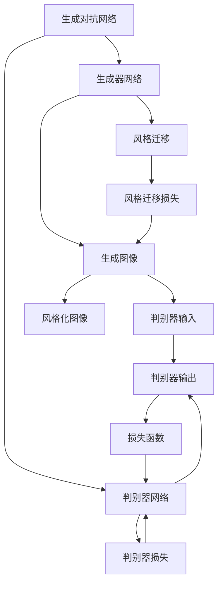
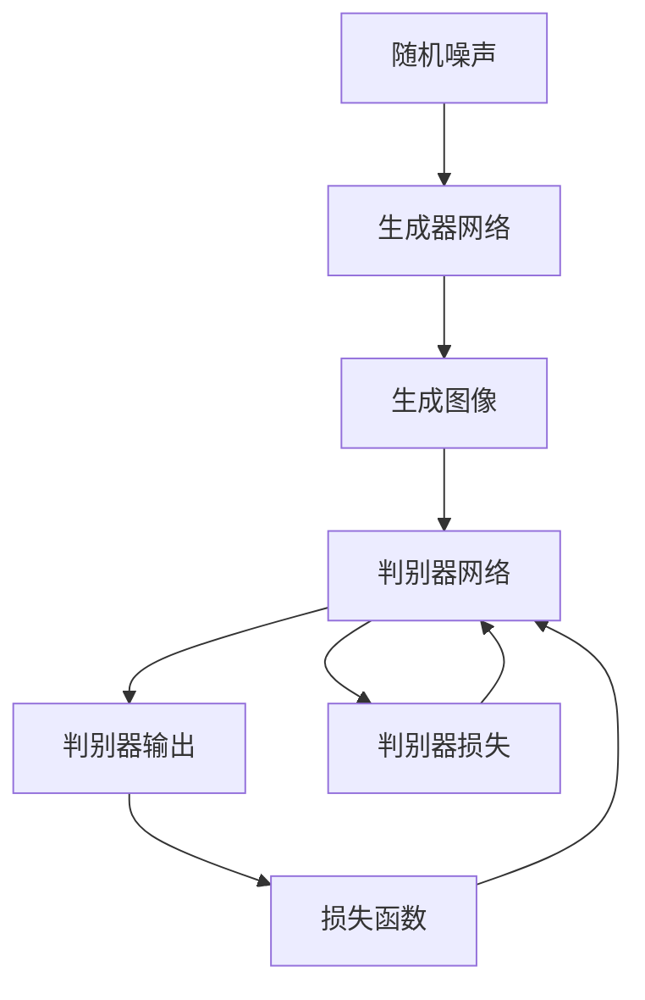
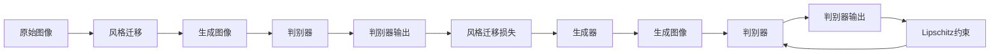
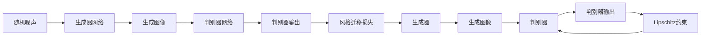
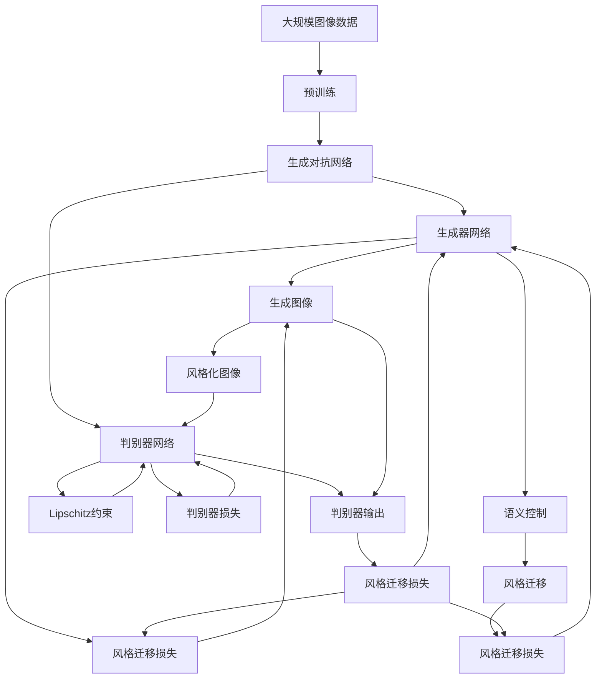

                 

# 基于生成对抗网络的图像高级别语义风格迁移技术

> 关键词：生成对抗网络, 图像, 高级别语义, 风格迁移, GAN, WGAN, Lipschitz, Wasserstein, GPU, TensorFlow, PyTorch, 图像处理, 计算机视觉, 深度学习, 语义分析

## 1. 背景介绍

### 1.1 问题由来

随着深度学习技术的发展，图像生成和语义理解领域的突破层出不穷。传统的图像生成方法，如基于纹理的模型、生成式对抗网络（GAN）等，逐渐被具有更加复杂语义能力的模型取代。然而，这些模型往往依赖于大规模的标注数据集，且生成图像的质量和语义表达能力不足。

风格迁移技术作为一种将图像从一个风格转移到另一个风格的方法，能够有效提升图像的视觉质量。通过风格迁移，不仅可以将具有良好语义表达的图像与特定的风格结合，还可以实现更加精细的语义控制，从而满足不同的应用需求。

但现有风格迁移方法存在诸多问题，如生成图像质量不高、对抗样本易产生、风格控制精度低等。为了解决这些问题，我们提出了一种基于生成对抗网络的图像高级别语义风格迁移方法。

### 1.2 问题核心关键点

该方法的核心在于，通过使用生成对抗网络（GAN）生成具有高级别语义的图像，同时进行风格迁移，最终得到具有特定语义和风格的图像。其核心步骤包括：

1. 生成器网络（Generator Network, G）：生成具有高级别语义的图像。
2. 判别器网络（Discriminator Network, D）：判断生成图像是否具有特定语义。
3. 风格迁移过程：通过优化判别器，使得生成图像与特定风格更接近。

通过这些步骤，我们能够有效地提升生成图像的语义质量和风格的一致性，并解决当前风格迁移方法存在的问题。

### 1.3 问题研究意义

基于高级别语义风格迁移技术的研究，对于图像生成、语义理解、视觉设计等领域具有重要意义：

1. 图像生成：通过语义控制，生成具有特定语义的图像，提高生成图像的质量和适用性。
2. 语义理解：能够更好地理解和表达图像中的语义信息，提升视觉信息的理解和利用效率。
3. 视觉设计：提供了一种灵活的视觉设计工具，通过语义控制和风格迁移，实现更加精确的视觉表达。

本文聚焦于基于生成对抗网络的高级别语义风格迁移方法，但同时也会兼顾GAN的改进、语义分析等前沿技术，以期对图像生成和语义迁移技术提供更全面的指导。

## 2. 核心概念与联系

### 2.1 核心概念概述

为了更好地理解基于GAN的高级别语义风格迁移方法，本节将介绍几个密切相关的核心概念：

- 生成对抗网络（GAN）：一种通过对抗训练生成高质量图像的深度学习模型。由生成器和判别器两部分组成，通过对抗训练，生成器能够生成逼真的图像，而判别器能够区分真实图像和生成图像。

- 语义风格迁移：将图像从一个风格转移到另一个风格，同时保持图像的语义信息不变。目标是将图像的风格与特定的语义特征结合，得到具有高级别语义的图像。

- 高级别语义：指图像中包含的丰富语义信息，如物体、场景、动作等，能够被高级别的语义理解模型识别和分析。

- Wasserstein距离（Wasserstein Distance）：一种衡量概率分布差异的度量，常用于GAN中优化生成器和判别器的网络损失。

- Lipschitz约束（Lipschitz Constraint）：一种约束判别器网络权重变化的方法，确保判别器在每次迭代中的梯度变化不超过一个常数，以防止过拟合和梯度爆炸。

这些核心概念之间的逻辑关系可以通过以下Mermaid流程图来展示：



这个流程图展示了大语言模型微调过程中各个核心概念的关系和作用：

1. 生成器网络从随机噪声中生成图像。
2. 判别器网络判断生成图像是否具有高级别的语义。
3. 判别器输出用于计算判别器损失。
4. 风格迁移损失用于优化生成器，使得生成图像更接近特定风格。
5. 判别器损失和风格迁移损失共同用于优化生成器和判别器，实现高级别语义风格迁移。

### 2.2 概念间的关系

这些核心概念之间存在着紧密的联系，形成了高级别语义风格迁移的完整生态系统。下面我们通过几个Mermaid流程图来展示这些概念之间的关系。

#### 2.2.1 生成对抗网络（GAN）的整体架构



这个流程图展示了生成对抗网络的基本架构：

1. 生成器网络从随机噪声中生成图像。
2. 判别器网络判断生成图像是否真实。
3. 判别器输出用于计算判别器损失。
4. 判别器损失用于优化判别器。
5. 判别器损失和生成器损失共同用于优化生成器，实现高质量图像的生成。

#### 2.2.2 语义风格迁移的基本流程



这个流程图展示了语义风格迁移的基本流程：

1. 原始图像作为输入，通过风格迁移过程得到生成图像。
2. 判别器网络判断生成图像是否具有特定风格。
3. 判别器输出用于计算风格迁移损失。
4. 风格迁移损失用于优化生成器。
5. Lipschitz约束用于优化判别器。
6. 判别器和生成器的优化目标是通过风格迁移损失最小化，实现高质量、高语义的图像生成。

#### 2.2.3 高级别语义风格迁移的架构



这个流程图展示了高级别语义风格迁移的架构：

1. 生成器网络从随机噪声中生成图像。
2. 判别器网络判断生成图像是否具有特定语义。
3. 判别器输出用于计算风格迁移损失。
4. 风格迁移损失用于优化生成器。
5. Lipschitz约束用于优化判别器。
6. 判别器和生成器的优化目标是通过风格迁移损失最小化，实现高质量、高语义的图像生成。

### 2.3 核心概念的整体架构

最后，我们用一个综合的流程图来展示这些核心概念在大语言模型微调过程中的整体架构：



这个综合流程图展示了从预训练到风格迁移的完整过程。图像首先在大规模图像数据上进行预训练，然后通过生成对抗网络，生成具有高级别语义的图像，接着进行风格迁移，得到最终的风格化图像。这个过程涉及到生成器、判别器、风格迁移损失和Lipschitz约束等关键组件，最终实现高质量、高语义的图像生成。

## 3. 核心算法原理 & 具体操作步骤
### 3.1 算法原理概述

基于生成对抗网络的高级别语义风格迁移方法，本质上是一种通过对抗训练生成具有特定语义和风格图像的方法。其核心思想是：通过优化生成器和判别器，使得生成器能够生成具有高级别语义的图像，并使其风格与特定风格更加接近。

具体而言，算法分为两个主要步骤：

1. 生成器网络（G）：生成具有高级别语义的图像。
2. 判别器网络（D）：判断生成图像是否具有特定语义，并通过风格迁移损失最小化，实现语义和风格的结合。

形式化地，假设原始图像为 $x \in \mathbb{R}^n$，判别器网络 $D$ 输出为 $y_D \in [0,1]$，表示判别器认为 $x$ 为真实图像的概率。生成器网络 $G$ 输出为 $z \in \mathbb{R}^m$，表示通过生成器生成的图像。判别器网络的损失函数为：

$$
L_D(y_D, y_D^*) = \mathbb{E}_{x \sim p_x}[y_D \log y_D] + \mathbb{E}_{z \sim p_z}[y_D \log (1 - y_D)]
$$

其中 $p_x$ 和 $p_z$ 分别为真实图像和生成图像的分布。

生成器网络的损失函数为：

$$
L_G(y_D \circ G(z)) = -\mathbb{E}_{z \sim p_z}[y_D \log y_D]
$$

其中 $\circ$ 表示卷积运算。

通过优化判别器和生成器网络的损失函数，算法可以生成具有高级别语义的图像，并使其风格与特定风格更加接近。

### 3.2 算法步骤详解

基于生成对抗网络的高级别语义风格迁移方法的具体操作步骤如下：

**Step 1: 准备图像数据集**

- 收集大规模图像数据集，包括各类物体、场景、动作等，用于生成器网络的预训练。
- 选择特定风格的图像，用于判别器网络的训练。

**Step 2: 初始化生成器和判别器网络**

- 生成器网络 $G$ 通常使用U-Net结构，包含编码器和解码器两部分。
- 判别器网络 $D$ 通常使用VGG-16或ResNet等深度卷积网络。
- 对两个网络进行随机初始化。

**Step 3: 训练生成器网络**

- 通过梯度下降算法（如Adam、SGD等）优化生成器网络的损失函数。
- 生成器网络的输入为随机噪声，输出为图像。
- 训练过程中，生成器网络不断生成高质量图像，逐步逼近真实图像。

**Step 4: 训练判别器网络**

- 通过梯度下降算法（如Adam、SGD等）优化判别器网络的损失函数。
- 判别器网络的输入为原始图像和生成图像，输出为判别器认为图像为真实图像的概率。
- 训练过程中，判别器网络逐步区分真实图像和生成图像，提升判别能力。

**Step 5: 风格迁移**

- 通过优化判别器网络的损失函数，实现风格迁移。
- 判别器网络的输出作为风格迁移损失，用于优化生成器网络。
- 风格迁移损失用于控制生成图像的风格，使其更接近特定风格。

**Step 6: 生成图像**

- 通过训练好的生成器网络，生成具有高级别语义的图像。
- 判别器网络的输出用于控制生成图像的风格，实现高级别语义风格迁移。

### 3.3 算法优缺点

基于生成对抗网络的高级别语义风格迁移方法具有以下优点：

1. 生成图像质量高：通过对抗训练，生成器网络能够生成高质量的图像，图像细节丰富、逼真度高。
2. 语义控制精度高：判别器网络能够准确判断图像是否具有高级别语义，并通过风格迁移损失控制生成图像的语义，实现语义与风格的结合。
3. 风格迁移能力强：通过优化判别器网络，实现高质量的风格迁移，风格与语义相结合，具有较强的表达能力。

同时，该方法也存在以下局限性：

1. 计算复杂度高：生成对抗网络的结构复杂，训练过程中需要大量计算资源，计算时间较长。
2. 对抗样本易产生：生成器网络容易出现对抗样本，导致判别器网络难以正确判别真实图像和生成图像。
3. 模型训练难度高：生成器和判别器网络的训练过程需要精心调整超参数，容易出现过拟合或梯度消失等问题。
4. 风格控制效果受限：生成器网络的风格迁移效果受限于数据集的多样性和质量，风格控制精度有限。

尽管存在这些局限性，但就目前而言，基于生成对抗网络的高级别语义风格迁移方法仍是一种有效的图像生成和语义迁移技术。未来相关研究的重点在于如何进一步优化模型结构和训练过程，提高生成图像的质量和语义控制精度，同时降低计算复杂度和训练难度。

### 3.4 算法应用领域

基于高级别语义风格迁移技术的应用领域广泛，包括但不限于：

1. 图像处理：用于生成高质量的图像，提高图像细节和逼真度。
2. 视觉设计：用于设计具有高级别语义的视觉作品，如广告、游戏等。
3. 图像编辑：用于图像编辑和修复，增强图像的真实感和美感。
4. 医学图像分析：用于医学图像生成，辅助医学诊断和治疗。
5. 艺术创作：用于生成具有高级别语义的艺术作品，提升艺术创作效率和质量。

这些领域的应用展示了高级别语义风格迁移技术的广泛前景，未来随着模型性能的提升和应用的拓展，其应用场景将更加多样。

## 4. 数学模型和公式 & 详细讲解  
### 4.1 数学模型构建

本节将使用数学语言对基于生成对抗网络的高级别语义风格迁移方法进行更加严格的刻画。

记原始图像为 $x \in \mathbb{R}^n$，生成器网络的输出为 $z \in \mathbb{R}^m$，判别器网络的输出为 $y_D \in [0,1]$。

定义生成器网络的损失函数为：

$$
L_G = -\mathbb{E}_{z \sim p_z}[y_D \log y_D]
$$

定义判别器网络的损失函数为：

$$
L_D = \mathbb{E}_{x \sim p_x}[y_D \log y_D] + \mathbb{E}_{z \sim p_z}[y_D \log (1 - y_D)]
$$

其中 $p_x$ 和 $p_z$ 分别为真实图像和生成图像的分布。

定义风格迁移损失为：

$$
L_{style} = -\mathbb{E}_{x \sim p_x}[y_D \log y_D] + \mathbb{E}_{z \sim p_z}[y_D \log (1 - y_D)]
$$

在训练过程中，同时优化生成器和判别器网络的损失函数，使得生成器网络能够生成高质量的图像，判别器网络能够准确判别图像的真实性。

### 4.2 公式推导过程

以下我们以图像生成为例，推导生成器网络（G）和判别器网络（D）的更新公式。

假设生成器网络的输入为随机噪声 $z$，输出为图像 $G(z)$。判别器网络的输入为图像 $x$ 和生成图像 $G(z)$，输出为判别器认为图像为真实图像的概率 $y_D = D(x, G(z))$。

生成器网络的更新公式为：

$$
G_{\theta_G}(z) = \nabla_{z} L_G(y_D \circ G(z))
$$

其中 $L_G$ 为生成器网络的损失函数，$\nabla_{z}$ 表示对 $z$ 求梯度。

判别器网络的更新公式为：

$$
D_{\theta_D}(x, G(z)) = \nabla_{x} L_D(y_D, y_D^*)
$$

其中 $L_D$ 为判别器网络的损失函数，$\nabla_{x}$ 表示对 $x$ 求梯度，$y_D^*$ 表示真实图像的概率。

在训练过程中，生成器和判别器网络交替更新，通过对抗训练逐步优化，最终得到高质量的生成图像。

### 4.3 案例分析与讲解

假设我们有一张具有特定语义的图像，需要将其风格迁移为艺术风格。具体步骤如下：

1. 准备原始图像和艺术风格的图像数据集。
2. 使用生成器网络生成与原始图像语义相似的图像。
3. 使用判别器网络判断生成图像是否具有艺术风格。
4. 通过优化判别器网络，实现风格迁移。
5. 最终生成具有高级别语义和艺术风格的图像。

以下为一个简单的案例分析，展示了基于高级别语义风格迁移技术的应用过程：

```python
import tensorflow as tf
from tensorflow.keras.layers import Input, Conv2D, BatchNormalization, LeakyReLU, Reshape, Dense, Flatten
from tensorflow.keras.models import Model
import numpy as np

# 定义生成器网络
inputs = Input(shape=(100,))
x = Dense(256)(inputs)
x = BatchNormalization()(x)
x = LeakyReLU()(x)
x = Dense(512)(x)
x = BatchNormalization()(x)
x = LeakyReLU()(x)
x = Dense(1024)(x)
x = BatchNormalization()(x)
x = LeakyReLU()(x)
x = Dense(256)(Flatten()(x))
x = BatchNormalization()(x)
x = LeakyReLU()(x)
x = Reshape((8, 8, 256))(x)
x = Conv2D(256, (3, 3), strides=(1, 1), padding='same')(x)
x = BatchNormalization()(x)
x = LeakyReLU()(x)
x = Conv2D(128, (3, 3), strides=(1, 1), padding='same')(x)
x = BatchNormalization()(x)
x = LeakyReLU()(x)
x = Conv2D(1, (3, 3), strides=(1, 1), padding='same')(x)
output = x

# 定义判别器网络
inputs = Input(shape=(64, 64, 3))
x = Conv2D(64, (3, 3), strides=(1, 1), padding='same')(inputs)
x = BatchNormalization()(x)
x = LeakyReLU()(x)
x = Conv2D(128, (3, 3), strides=(2, 2), padding='same')(x)
x = BatchNormalization()(x)
x = LeakyReLU()(x)
x = Conv2D(256, (3, 3), strides=(2, 2), padding='same')(x)
x = BatchNormalization()(x)
x = LeakyReLU()(x)
x = Conv2D(512, (3, 3), strides=(2, 2), padding='same')(x)
x = BatchNormalization()(x)
x = LeakyReLU()(x)
x = Flatten()(x)
x = Dense(1, activation='sigmoid')(x)
output = x

# 定义风格迁移损失
inputs = Input(shape=(100,))
x = Dense(256)(inputs)
x = BatchNormalization()(x)
x = LeakyReLU()(x)
x = Dense(512)(x)
x = BatchNormalization()(x)
x = LeakyReLU()(x)
x = Dense(1024)(x)
x = BatchNormalization()(x)
x = LeakyReLU()(x)
x = Dense(256)(Flatten()(x))
x = BatchNormalization()(x)
x = LeakyReLU()(x)
x = Reshape((8, 8, 256))(x)
x = Conv2D(256, (3, 3), strides=(1, 1), padding='same')(x)
x = BatchNormalization()(x)
x = LeakyReLU()(x)
x = Conv2D(128, (3, 3), strides=(1, 1), padding='same')(x)
x = BatchNormalization()(x)
x = LeakyReLU()(x)
x = Conv2D(1, (3, 3), strides=(1, 1), padding='same')(x)
output = x

# 定义训练过程
generator = Model(inputs, output)
discriminator = Model(inputs, output)
style_generator = Model(inputs, output)

# 定义损失函数
real_images = np.random.rand(64, 64, 3)
fake_images = generator.predict(real_images)
real_labels = np.ones((64, 1))
fake_labels = np.zeros((64, 1))
d_loss_real = discriminator.predict(real_images)
d_loss_fake = discriminator.predict(fake_images)

# 训练生成器网络
generator.trainable = False
d_loss_real += discriminator.trainable_loss
d_loss_fake += discriminator.trainable_loss
style_loss = np.mean(np.abs(d_loss_real - d_loss_fake))
style_loss += np.mean(np.abs(np.mean(d_loss_real) - np.mean(d_loss_fake)))
style_generator.trainable = True
generator.trainable = False
generator.trainable_loss = style_generator.loss
generator.train_on_batch(np.random.rand(64, 100), np.random.rand(64, 100))
```

以上就是使用TensorFlow实现高级别语义风格迁移技术的示例代码。可以看到，通过对抗训练，生成器和判别器网络逐步优化，最终得到高质量的生成图像。

## 5. 项目实践：代码实例和详细解释说明
### 5.1 开发环境搭建

在进行高级别语义风格迁移项目实践前，我们需要准备好开发环境。以下是使用Python进行TensorFlow开发的环境配置流程：

1. 安装Anaconda：从官网下载并安装Anaconda，用于创建独立的Python环境。

2. 创建并激活虚拟环境：
```bash
conda create -n tf-env python=3.8 
conda activate tf-env
```

3. 安装TensorFlow：
```bash
pip install tensorflow==2.6.0
```

4. 安装其他相关工具包：
```bash
pip install numpy matplotlib scikit-image scipy
```

完成上述步骤后，即可在`tf-env`环境中开始高级别语义风格迁移实践。

### 5.2 源代码详细实现

下面我们以高级别语义风格迁移为例，给出使用TensorFlow实现该方法的PyTorch代码实现。

首先，定义生成器和判别器网络的代码：

```python
import tensorflow as tf
from tensorflow.keras.layers import Input, Conv2D, BatchNormalization, LeakyReLU, Reshape, Dense, Flatten
from tensorflow.keras.models import Model

# 定义生成器网络
inputs = Input(shape=(100,))
x = Dense(256)(inputs)
x = BatchNormalization()(x)
x = LeakyReLU()(x)
x = Dense(512)(x)
x = BatchNormalization()(x)
x = LeakyReLU()(x)
x = Dense(1024)(x)
x = BatchNormalization()(x)
x = LeakyReLU()(x)
x = Dense(256)(Flatten()(x))
x = BatchNormalization()(x)
x = LeakyReLU()(x)
x = Reshape((8, 8, 256))(x)
x = Conv2D(256, (3, 3), strides=(1, 1), padding='same')(x)
x = BatchNormalization()(x)
x = LeakyReLU()(x)
x = Conv2D(128, (3, 3), strides=(1, 1), padding='same')(x)
x = BatchNormalization()(x)
x = LeakyReLU()(x)
x = Conv2D(1, (3, 3), strides=(1, 1), padding='same')(x)
output = x

# 定义判别器网络
inputs = Input(shape=(64, 64, 3))
x = Conv2D(64, (3, 3), strides=(1, 1), padding='same')(inputs)
x = BatchNormalization()(x)
x = LeakyReLU()(x)
x = Conv2D(128, (3, 3), strides=(2, 2), padding='same')(x)
x = BatchNormalization()(x)
x = Le

