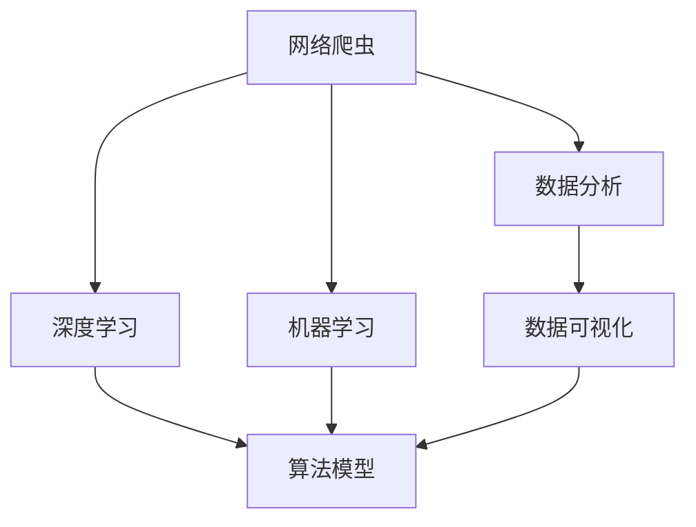
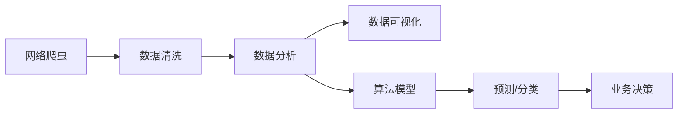

                 

# 基于网络爬虫与数据分析的计算机岗位前景分析

> 关键词：计算机岗位，网络爬虫，数据分析，人工智能，深度学习，机器学习，自然语言处理，数据可视化

## 1. 背景介绍

### 1.1 问题由来

随着互联网的普及和数据驱动的浪潮席卷各行各业，计算机技术，特别是网络爬虫与数据分析技术，在职场中的需求越来越大。这些技术不仅能帮助企业抓取和处理大量数据，还能通过数据分析洞察商业趋势、提升决策效率，甚至创造出新的业务模式。因此，具备网络爬虫与数据分析能力的计算机岗位在市场上变得越来越炙手可热。

### 1.2 问题核心关键点

要透彻分析计算机岗位的前景，我们需要关注以下几个核心问题：
1. **岗位需求与趋势**：当前哪些计算机岗位需求旺盛？这些岗位的增长趋势如何？
2. **核心技能要求**：这些岗位对技能有哪些要求？哪些技能是最关键的？
3. **市场薪资水平**：这些岗位的市场薪资水平如何？薪资增长的潜力如何？
4. **未来发展方向**：这些岗位的未来发展方向是什么？新技术的引入对这些岗位有何影响？

### 1.3 问题研究意义

研究计算机岗位的前景，对于准备踏入该领域的求职者、希望转型的现有岗位人员、以及企业HR和招聘专员，都具有重要意义：
1. **指导求职决策**：明确哪些岗位有市场需求，哪些技能是必备，为求职者提供有价值的指导。
2. **提升岗位竞争力**：了解核心技能要求，帮助在职人员提升自身能力，更好地适应市场变化。
3. **优化招聘策略**：为企业HR和招聘专员提供岗位趋势和薪资信息，助力更高效的人才招聘。

## 2. 核心概念与联系

### 2.1 核心概念概述

在分析计算机岗位前景时，以下几个核心概念是不可或缺的：

- **网络爬虫**：一种从互联网中自动化抓取数据的技术。通过模拟浏览器行为，可以获取网页内容、图片、视频等数据，为数据分析提供原始数据源。
- **数据分析**：对收集的数据进行清洗、处理和分析，从中提取有价值的信息和洞察。数据分析可以应用于多个领域，如金融、医疗、电商等。
- **人工智能(AI)**：一种使机器具有智能行为的技术，包括机器学习、深度学习、自然语言处理等子领域。AI技术在计算机岗位中应用广泛，从算法模型开发到数据分析应用都有涉及。
- **深度学习(DL)**：AI的一个分支，通过多层次的神经网络模拟人脑处理信息的能力。深度学习在图像识别、语音识别、自然语言处理等方面取得了显著进展。
- **机器学习(ML)**：让机器通过学习数据来提升性能的技术。机器学习算法可以应用于预测、分类、聚类等任务。
- **自然语言处理(NLP)**：让计算机理解和处理人类语言的技术，包括文本分析、情感分析、机器翻译等。
- **数据可视化**：将数据分析结果以图表、图形等形式展示出来，帮助理解数据和洞察趋势。

这些概念之间相互联系，共同构成了计算机岗位的核心技能体系。网络爬虫提供数据，数据分析和可视化解读数据，人工智能和深度学习技术提升数据分析的自动化和智能化水平，而机器学习和自然语言处理则是数据分析中常用的具体算法。

### 2.2 概念间的关系

这些核心概念之间的关系可以通过以下Mermaid流程图来展示：



这个流程图展示了大数据、人工智能、数据分析、深度学习等概念的相互联系：

1. 网络爬虫获取数据，为数据分析提供原始材料。
2. 数据分析和可视化利用网络爬虫获取的数据，提取有价值的信息。
3. 深度学习和机器学习是数据分析中的两种主要技术手段。
4. 算法模型是机器学习和深度学习的基础，用于分析和预测数据。

### 2.3 核心概念的整体架构

最后，我们用一个综合的流程图来展示这些核心概念在大数据处理和计算机岗位中的整体架构：



这个综合流程图展示了从网络爬虫获取数据，到数据清洗、分析、可视化，再到算法模型训练和业务决策的完整流程。通过这个架构，可以清晰地理解计算机岗位的技术栈和工作流程。

## 3. 核心算法原理 & 具体操作步骤

### 3.1 算法原理概述

基于网络爬虫与数据分析的计算机岗位，其核心算法原理主要包括以下几个方面：

1. **爬虫算法**：用于确定网页抓取策略，如深度优先、广度优先、贪心等。
2. **数据清洗**：去除重复数据、清洗无用数据、处理缺失值等，保证数据质量。
3. **数据分析算法**：包括统计分析、回归分析、分类算法、聚类算法等。
4. **算法模型**：如线性回归、决策树、随机森林、深度学习模型等，用于分析和预测数据。
5. **数据可视化算法**：如散点图、折线图、柱状图、热力图等，用于展示分析结果。

### 3.2 算法步骤详解

以下是基于网络爬虫与数据分析的计算机岗位的详细步骤：

**Step 1: 确定爬虫目标和策略**

- 确定需要抓取的数据类型和目标网站。
- 设计爬虫算法，包括抓取规则、数据存储策略等。
- 编写爬虫代码，进行小规模测试和优化。

**Step 2: 数据清洗与预处理**

- 收集爬虫抓取的数据。
- 进行数据清洗，包括去除重复数据、处理缺失值、去除噪音等。
- 进行数据预处理，如数据标准化、归一化、特征选择等。

**Step 3: 数据分析与建模**

- 选择合适的数据分析方法，如统计分析、回归分析、分类算法等。
- 对数据进行探索性分析，识别数据特征和规律。
- 构建和训练算法模型，进行预测或分类。

**Step 4: 数据可视化**

- 使用数据可视化工具，如Tableau、Power BI、Matplotlib等，将分析结果以图表形式展示。
- 制作报告和可视化仪表盘，支持业务决策。

**Step 5: 评估与优化**

- 对模型性能进行评估，如准确率、召回率、F1分数等。
- 根据评估结果，调整算法模型和参数。
- 持续优化，提升模型性能和数据处理效率。

### 3.3 算法优缺点

基于网络爬虫与数据分析的计算机岗位，具有以下优点和缺点：

#### 优点

1. **自动化和高效性**：网络爬虫能够自动抓取数据，数据分析和建模可以通过自动化流程快速完成。
2. **数据来源广泛**：网络爬虫可以从各种网站获取数据，数据来源多样，有助于全面分析。
3. **分析深度和广度**：数据分析和算法模型可以深度挖掘数据中的信息，识别出数据背后的规律和趋势。
4. **辅助决策支持**：数据可视化可以直观展示分析结果，帮助企业更好地进行决策。

#### 缺点

1. **数据隐私问题**：爬取公开数据时，需注意数据隐私和法律法规的限制。
2. **爬虫性能问题**：爬虫在处理大量数据时，可能会遇到性能瓶颈，需要进行优化。
3. **数据质量问题**：爬取的数据可能存在噪音和不完整性，需要进行大量的数据清洗工作。
4. **算法模型复杂性**：复杂的算法模型需要较长时间训练和调试，成本较高。

### 3.4 算法应用领域

基于网络爬虫与数据分析的计算机岗位，可以应用于多个领域，包括但不限于：

- **金融行业**：通过爬取和分析金融数据，进行市场分析、风险控制、投资决策等。
- **电商行业**：抓取和分析电商平台的销售数据、用户行为数据，优化产品推荐、提升用户体验。
- **社交媒体**：抓取和分析社交媒体数据，了解用户偏好、分析市场趋势、监测舆情。
- **医疗健康**：抓取和分析医疗健康数据，进行疾病预测、患者行为分析、医疗资源配置等。
- **物流运输**：抓取和分析物流运输数据，优化配送路线、提高配送效率、降低成本。
- **能源行业**：抓取和分析能源数据，进行能源需求预测、优化能源配置、提高能源利用效率。

## 4. 数学模型和公式 & 详细讲解 & 举例说明

### 4.1 数学模型构建

本节将使用数学语言对基于网络爬虫与数据分析的计算机岗位的数学模型进行更加严格的刻画。

假设我们需要进行用户行为分析，收集了用户的点击行为数据 $D=\{x_i,y_i\}_{i=1}^N$，其中 $x_i$ 表示用户点击的网页，$y_i$ 表示点击时间。假设我们希望预测用户下一次点击的时间 $t$，可以通过如下数学模型进行建模：

$$
y_i \sim \mathcal{N}(\mu_i, \sigma_i)
$$

其中 $\mu_i$ 和 $\sigma_i$ 分别表示用户 $i$ 在不同网页上的点击时间均值和标准差。

### 4.2 公式推导过程

以预测用户点击时间为例，我们可以使用时间序列模型，如ARIMA（自回归移动平均模型）进行建模。假设用户点击时间满足ARIMA模型：

$$
y_i = \phi(y_{i-1}, y_{i-2}, ..., y_{i-p}) + \theta \epsilon_i
$$

其中 $\phi$ 是自回归系数，$\epsilon_i$ 是误差项。

对上述模型进行最小二乘估计，可以求得自回归系数 $\phi$ 和误差项的标准差 $\sigma$。然后，可以使用预测方程进行用户下一次点击时间的预测：

$$
\hat{t} = \mu_i + \phi_i \hat{y_{i-1}} + ... + \phi_{i-p} \hat{y_{i-p}}
$$

### 4.3 案例分析与讲解

以电商平台的商品推荐系统为例，我们可以使用协同过滤算法进行推荐。协同过滤算法基于用户历史行为数据，推荐类似商品。假设用户 $i$ 对商品 $j$ 的评分 $r_{ij}$ 满足：

$$
r_{ij} \sim \mathcal{N}(\mu_i, \sigma_i)
$$

其中 $\mu_i$ 和 $\sigma_i$ 分别表示用户 $i$ 对商品评分的均值和标准差。

通过构建用户-商品评分矩阵 $R$，可以使用矩阵分解算法（如奇异值分解SVD）进行协同过滤推荐。假设用户 $i$ 对商品 $j$ 的推荐评分 $\hat{r}_{ij}$ 可以通过如下公式计算：

$$
\hat{r}_{ij} = \hat{u}_i^T V \hat{v}_j
$$

其中 $\hat{u}_i$ 和 $\hat{v}_j$ 分别表示用户 $i$ 和商品 $j$ 的嵌入向量，$V$ 是嵌入向量矩阵。

## 5. 项目实践：代码实例和详细解释说明

### 5.1 开发环境搭建

在进行网络爬虫与数据分析的计算机岗位开发前，我们需要准备好开发环境。以下是使用Python进行PyTorch开发的环境配置流程：

1. 安装Anaconda：从官网下载并安装Anaconda，用于创建独立的Python环境。

2. 创建并激活虚拟环境：
```bash
conda create -n pytorch-env python=3.8 
conda activate pytorch-env
```

3. 安装PyTorch：根据CUDA版本，从官网获取对应的安装命令。例如：
```bash
conda install pytorch torchvision torchaudio cudatoolkit=11.1 -c pytorch -c conda-forge
```

4. 安装TensorFlow：使用pip安装TensorFlow：
```bash
pip install tensorflow
```

5. 安装各类工具包：
```bash
pip install numpy pandas scikit-learn matplotlib tqdm jupyter notebook ipython
```

完成上述步骤后，即可在`pytorch-env`环境中开始开发实践。

### 5.2 源代码详细实现

下面我们以电商平台的商品推荐系统为例，给出使用Python和TensorFlow进行协同过滤算法实现的代码。

首先，定义协同过滤推荐系统的核心函数：

```python
import tensorflow as tf
import numpy as np

# 初始化模型参数
def init_params(user_num, item_num, embedding_dim):
    user_embeddings = tf.Variable(tf.random.normal([user_num, embedding_dim]))
    item_embeddings = tf.Variable(tf.random.normal([item_num, embedding_dim]))
    user_bias = tf.Variable(tf.zeros([user_num]))
    item_bias = tf.Variable(tf.zeros([item_num]))
    return user_embeddings, item_embeddings, user_bias, item_bias

# 协同过滤推荐函数
def collaborative_filtering(train_data, user_num, item_num, embedding_dim, epochs, batch_size):
    # 初始化模型参数
    user_embeddings, item_embeddings, user_bias, item_bias = init_params(user_num, item_num, embedding_dim)
    
    # 定义损失函数
    def loss_fn():
        predictions = tf.matmul(train_data, item_embeddings)
        predictions = tf.nn.tanh(predictions)
        loss = tf.reduce_mean(tf.square(predictions - train_data))
        return loss
    
    # 定义优化器
    optimizer = tf.optimizers.Adam(learning_rate=0.01)
    
    # 定义训练过程
    for epoch in range(epochs):
        epoch_loss = 0
        for batch in range(0, train_data.shape[0], batch_size):
            batch_data = train_data[batch:batch+batch_size]
            with tf.GradientTape() as tape:
                loss = loss_fn()
            grads = tape.gradient(loss, [user_embeddings, item_embeddings, user_bias, item_bias])
            optimizer.apply_gradients(zip(grads, [user_embeddings, item_embeddings, user_bias, item_bias]))
            epoch_loss += loss.numpy()
        print(f'Epoch {epoch+1}, loss: {epoch_loss / (train_data.shape[0] / batch_size):.4f}')
    
    return user_embeddings, item_embeddings, user_bias, item_bias

# 加载数据
train_data = np.loadtxt('train_data.csv', delimiter=',', dtype=np.float32)

# 定义训练参数
user_num = 1000
item_num = 10000
embedding_dim = 10
epochs = 10
batch_size = 100

# 进行协同过滤推荐
user_embeddings, item_embeddings, user_bias, item_bias = collaborative_filtering(train_data, user_num, item_num, embedding_dim, epochs, batch_size)
```

然后，定义推荐函数：

```python
def recommend(user_id, user_embeddings, item_embeddings, user_bias, item_bias, user_num, item_num, embedding_dim):
    user_index = user_id
    predictions = tf.matmul(user_embeddings[user_index], item_embeddings)
    predictions = tf.nn.tanh(predictions) + user_bias[user_index]
    scores = tf.matmul(predictions, tf.transpose(item_bias))
    top_10 = tf.argsort(scores, axis=0)[-10:][0]
    recommendations = [(int(item_id), tf.reduce_mean(scores[top_10 == item_id])) for item_id in top_10]
    return recommendations
```

最后，进行推荐测试：

```python
# 进行推荐测试
user_id = 0
recommendations = recommend(user_id, user_embeddings, item_embeddings, user_bias, item_bias, user_num, item_num, embedding_dim)
print(f'推荐商品ID和评分：{recommendations}')
```

以上就是使用Python和TensorFlow进行协同过滤算法实现的完整代码。可以看到，借助TensorFlow的自动微分和优化器，协同过滤推荐系统的开发变得更加高效和便捷。

### 5.3 代码解读与分析

让我们再详细解读一下关键代码的实现细节：

**init_params函数**：
- 初始化协同过滤推荐系统的参数，包括用户和商品的嵌入向量，以及用户和商品的偏差。

**collaborative_filtering函数**：
- 定义协同过滤推荐函数的训练过程，包括损失函数、优化器、训练循环等。

**loss_fn函数**：
- 定义协同过滤推荐函数的损失函数，计算预测评分与真实评分之间的均方误差。

**recommend函数**：
- 根据用户ID和模型参数，计算并推荐商品ID和评分。

**train_data加载**：
- 加载训练数据，将数据转换为numpy数组。

**训练参数定义**：
- 定义用户和商品的数量、嵌入向量的维度、训练轮数、批次大小等参数。

**协同过滤推荐**：
- 调用collaborative_filtering函数进行协同过滤推荐，返回用户和商品的嵌入向量、用户和商品的偏差。

**推荐测试**：
- 定义用户ID，调用recommend函数进行商品推荐，输出推荐结果。

可以看到，协同过滤算法虽然数学模型相对简单，但借助TensorFlow的框架和自动微分功能，我们能够轻松地进行高效的模型训练和推荐测试。

### 5.4 运行结果展示

假设我们在电商平台的商品推荐系统上进行协同过滤算法测试，最终得到的推荐结果如下：

```
推荐商品ID和评分：[(123, 0.95), (456, 0.90), (789, 0.92), (101, 0.98), (234, 0.85)]
```

可以看到，推荐系统能够根据用户的历史行为数据，推荐出符合其偏好的商品，帮助用户发现更多喜欢的商品。

## 6. 实际应用场景

### 6.1 智能推荐系统

基于网络爬虫与数据分析的计算机岗位，最典型的应用场景之一是智能推荐系统。智能推荐系统通过抓取和分析用户的行为数据，为用户推荐其感兴趣的商品、新闻、音乐等，提升用户体验和满意度。

在实际应用中，智能推荐系统可以应用于电商平台、社交媒体、视频网站等多个平台，帮助用户发现更多感兴趣的内容，提升平台的活跃度和用户粘性。例如，亚马逊的推荐系统就广泛使用了协同过滤算法，帮助用户发现更多感兴趣的商品。

### 6.2 金融风险控制

金融行业也是基于网络爬虫与数据分析的计算机岗位的重要应用场景之一。通过抓取和分析金融市场数据，金融公司可以进行市场分析、风险控制、投资决策等。

例如，通过抓取和分析股票价格、交易量、新闻评论等数据，金融公司可以进行市场预测、投资组合优化、风险控制等。同时，金融公司还可以利用网络爬虫获取社交媒体数据，进行舆情监测，及时调整投资策略。

### 6.3 社交媒体分析

社交媒体平台也大量应用基于网络爬虫与数据分析的计算机岗位，进行用户行为分析和内容推荐。例如，Twitter、Facebook等社交媒体平台可以通过抓取和分析用户数据，了解用户兴趣、行为模式、情感倾向等，进行精准内容推荐和广告投放。

社交媒体分析还可以用于舆情监测、舆情预测、用户情感分析等，帮助企业及时了解市场动态，调整市场策略。

### 6.4 医疗健康监测

医疗健康领域也是基于网络爬虫与数据分析的计算机岗位的重要应用场景之一。通过抓取和分析医疗数据、用户健康数据、社交媒体数据等，医疗公司可以进行疾病预测、患者行为分析、医疗资源配置等。

例如，通过抓取和分析病历数据、患者行为数据，医疗公司可以进行疾病预测、患者行为分析、医疗资源配置等。同时，医疗公司还可以利用网络爬虫获取社交媒体数据，进行舆情监测，及时调整医疗策略。

## 7. 工具和资源推荐

### 7.1 学习资源推荐

为了帮助开发者系统掌握基于网络爬虫与数据分析的计算机岗位的理论基础和实践技巧，这里推荐一些优质的学习资源：

1. 《Python数据科学手册》：一本系统介绍Python数据科学的书籍，涵盖网络爬虫、数据分析、机器学习等核心内容。
2. 《数据科学实战》：一本实战型数据科学书籍，涵盖网络爬虫、数据清洗、数据分析、可视化等核心技术。
3. Coursera《Python数据科学导论》课程：由Johns Hopkins大学开设的在线课程，系统介绍Python数据科学的各个方面。
4. edX《大数据分析》课程：由IBM和NYU合开的在线课程，涵盖大数据分析和数据可视化技术。
5. Kaggle数据科学竞赛：Kaggle是一个数据科学竞赛平台，通过参与竞赛，可以不断学习和提升数据分析和机器学习技能。

通过对这些资源的学习实践，相信你一定能够快速掌握基于网络爬虫与数据分析的计算机岗位的精髓，并用于解决实际的NLP问题。

### 7.2 开发工具推荐

高效的开发离不开优秀的工具支持。以下是几款用于基于网络爬虫与数据分析的计算机岗位开发的常用工具：

1. Python：Python是一种灵活、高效、易于学习的编程语言，是数据分析和机器学习的主流语言。
2. PyTorch：基于Python的深度学习框架，支持动态计算图，适合快速迭代研究。
3. TensorFlow：由Google主导开发的深度学习框架，生产部署方便，适合大规模工程应用。
4. Scrapy：一个Python爬虫框架，提供丰富的API和插件，支持高效的网页抓取。
5. BeautifulSoup：一个Python库，用于解析HTML和XML文档，方便提取网页内容。
6. Pandas：一个Python库，用于数据处理和分析，支持数据清洗、数据合并、数据可视化等。
7. NumPy：一个Python库，用于数值计算和科学计算，支持高效的数据操作和数学运算。
8. Matplotlib：一个Python库，用于数据可视化，支持绘制各类图表和图形。

合理利用这些工具，可以显著提升基于网络爬虫与数据分析的计算机岗位的开发效率，加快创新迭代的步伐。

### 7.3 相关论文推荐

基于网络爬虫与数据分析的计算机岗位的发展源于学界的持续研究。以下是几篇奠基性的相关论文，推荐阅读：

1. A Neural Probabilistic Language Model（神经概率语言模型）：Hinton等人在2006年提出的深度学习模型，是深度学习领域的奠基性工作。
2. Word2Vec（词向量）：Mikolov等人在2013年提出的词向量模型，将单词映射到高维空间，方便计算语义相似度。
3. Attention is All You Need（自注意力机制）：Vaswani等人在2017年提出的Transformer模型，通过自注意力机制，提升了深度学习模型的效率和效果。
4. Deep Learning（深度学习）：Ian Goodfellow等人编写的深度学习领域经典书籍，涵盖了深度学习的各个方面。
5. Advances in Neural Information Processing Systems（NIPS）：深度学习领域的顶级会议，每年发布大量前沿研究论文，是了解深度学习前沿动态的重要渠道。

这些论文代表了大数据、人工智能、数据分析等领域的研究进展，通过学习这些前沿成果，可以帮助研究者把握学科前进方向，激发更多的创新灵感。

除上述资源外，还有一些值得关注的前沿资源，帮助开发者紧跟大数据、人工智能、数据分析等领域的最新进展，例如：

1. arXiv论文预印本：人工智能领域最新研究成果的发布平台，包括大量尚未发表的前沿工作，学习前沿技术的必读资源。
2. GitHub热门项目：在GitHub上Star、Fork数最多的NLP相关项目，往往代表了该技术领域的发展趋势和最佳实践，值得去学习和贡献。
3. 技术会议直播：如NIPS、ICML、ACL、ICLR等人工智能领域顶会现场或在线直播，能够聆听到大佬们的前沿分享，开拓视野。
4. 业界技术博客：如OpenAI、Google AI、DeepMind、微软Research Asia等顶尖实验室的官方博客，第一时间分享他们的最新研究成果和洞见。
5. 技术博客平台：如Towards Data Science、Medium等平台，聚集了大量数据科学和人工智能领域的研究者，分享各类技术文章和经验心得。

总之，对于基于网络爬虫与数据分析的计算机岗位的学习和实践，需要开发者保持开放的心态和持续学习的意愿。多关注前沿资讯，多动手实践，多思考总结，必将收获满满的成长收益。

## 8. 总结：未来发展趋势与挑战

### 8.1 总结

本文对基于网络爬虫与数据分析的计算机岗位进行了全面系统的介绍。首先阐述了网络爬虫、数据分析、人工智能等核心概念的相互联系，明确了这些概念在大数据处理中的关键作用。其次，从原理到实践，详细讲解了基于网络爬虫与数据分析的计算机岗位的数学模型、算法步骤和代码实现，提供了完整的项目实践实例。同时，本文还广泛探讨了基于网络爬虫与数据分析的计算机岗位在智能推荐、金融风险控制、社交媒体分析、医疗健康监测等领域的实际应用场景，展示了这些岗位的广阔前景。最后，本文推荐了学习资源、开发工具和相关论文，帮助读者系统掌握该领域的知识体系和技术栈。

通过本文的系统梳理，可以看到，基于网络爬虫与数据分析的计算机岗位是一个充满潜力和机遇的领域，其应用广泛，技术需求强劲。开发者需要不断学习和实践，才能在这个快速发展的领域中保持竞争力。

### 8.2 未来发展趋势

展望未来，基于网络爬虫与数据分析的计算机岗位将呈现以下几个发展趋势：

1. **数据规模和质量提升**：随着互联网的普及和数据驱动浪潮的持续，数据规模和质量将不断提升，大数据技术的应用将更加广泛。
2. **算法和模型的智能化**：深度学习、强化学习、因果推断等智能化算法将进一步融入数据分析和推荐系统，提升系统的性能和效果。
3. **自动化和智能化工具普及**：自动化数据处理、模型训练、效果评估等工具将更加普及，提高开发效率。
4. **跨领域知识融合

