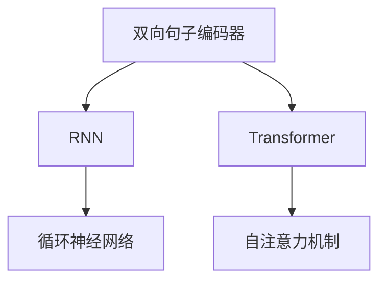
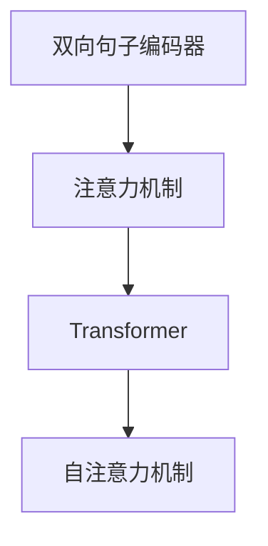
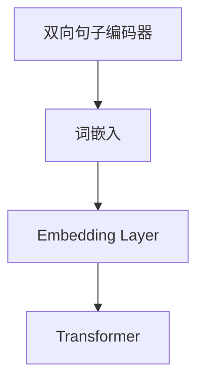
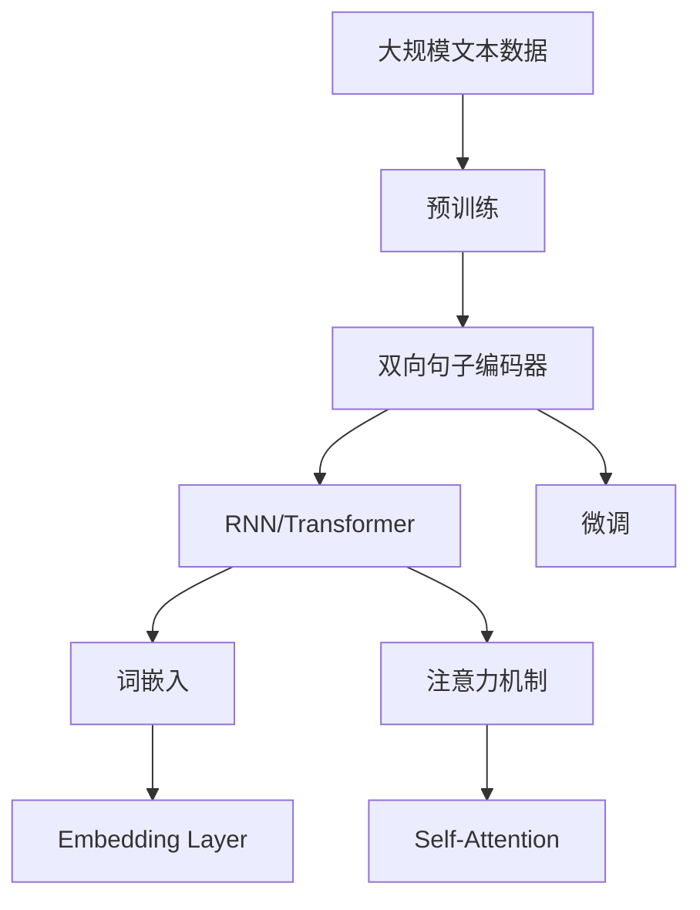

                 

# 基础模型的双向句子编码器

> 关键词：双向句子编码器,基础模型,自然语言处理(NLP),词嵌入,循环神经网络(RNN),注意力机制,Transformer

## 1. 背景介绍

### 1.1 问题由来
近年来，自然语言处理(Natural Language Processing, NLP)技术在文本分类、信息检索、机器翻译、问答系统等领域取得了巨大的进展。然而，尽管现有的NLP模型在理解语言的上下文和语义方面已经取得了显著的进步，但它们在处理长句子和复杂句子结构方面仍然存在挑战。特别是对于包含长句子和嵌套结构的句子，现有的模型往往难以捕捉到这些句子中的所有信息。为了解决这个问题，研究者们提出了多种改进方法，其中双向句子编码器(Bi-directional Sentence Encoder)是一种非常有效的解决方案。

### 1.2 问题核心关键点
双向句子编码器通过从左到右和从右到左两个方向对句子进行编码，能够更全面地理解句子中的语义信息。双向编码器通常使用循环神经网络(RNN)或者Transformer等架构来实现。双向编码器的关键在于其编码过程的顺序，即先编码左半部分，再编码右半部分，最后将左右部分的编码结果合并。这种方法可以更好地捕捉句子中的上下文信息，避免信息的丢失和误解。

### 1.3 问题研究意义
双向句子编码器在大规模NLP应用中具有重要的研究意义：

1. 提升句子理解能力：通过双向编码器，模型能够更好地理解句子的上下文信息和语义关系，从而提高对句子的理解能力。
2. 支持长句子处理：对于包含长句子和复杂结构的句子，双向编码器可以更好地捕捉句子中的所有信息。
3. 增强模型泛化能力：双向编码器可以通过对句子进行更全面的理解，提高模型的泛化能力，使其在不同任务和数据集上表现更好。

## 2. 核心概念与联系

### 2.1 核心概念概述

为了更好地理解双向句子编码器的原理，本节将介绍几个关键的概念：

- 双向句子编码器(Bi-directional Sentence Encoder)：使用循环神经网络(RNN)或Transformer等架构，从左到右和从右到左两个方向对句子进行编码，能够更好地捕捉句子中的上下文信息和语义关系。

- 词嵌入(Word Embedding)：将自然语言中的单词映射为向量空间中的向量，使得计算机能够更好地理解和处理自然语言。

- 循环神经网络(RNN)：通过循环结构，可以处理变长的输入序列，捕捉序列中的时间依赖关系。

- 注意力机制(Attention Mechanism)：通过计算注意力权重，选择性地关注输入序列中的重要部分，提高模型的表达能力。

- Transformer：基于自注意力机制，能够高效地处理变长的输入序列，并且不需要显式的循环结构。

这些核心概念之间的逻辑关系可以通过以下Mermaid流程图来展示：

```mermaid
graph TB
    A[双向句子编码器] --> B[循环神经网络(RNN)]
    A --> C[Transformer]
    B --> D[词嵌入]
    C --> E[注意力机制]
    E --> F[Transformer]
```

这个流程图展示了双向句子编码器的核心概念及其之间的关系：

1. 双向句子编码器主要使用RNN或Transformer等架构。
2. RNN和Transformer都可以实现双向编码。
3. 词嵌入是将单词转换为向量空间中的向量，是RNN和Transformer的基础。
4. 注意力机制是Transformer的核心，可以帮助模型更好地关注重要部分。

### 2.2 概念间的关系

这些核心概念之间存在着紧密的联系，形成了双向句子编码器的完整生态系统。下面我通过几个Mermaid流程图来展示这些概念之间的关系。

#### 2.2.1 双向句子编码器与RNN/Transformer的关系



这个流程图展示了双向句子编码器与RNN和Transformer的关系：

1. 双向句子编码器主要使用RNN和Transformer等架构。
2. RNN是一种传统的循环神经网络。
3. Transformer使用自注意力机制，能够高效地处理变长的输入序列。

#### 2.2.2 双向句子编码器与注意力机制的关系



这个流程图展示了双向句子编码器与注意力机制的关系：

1. 双向句子编码器使用注意力机制来更好地关注输入序列中的重要部分。
2. 注意力机制是Transformer的核心。
3. 双向句子编码器可以使用Transformer等架构。

#### 2.2.3 双向句子编码器与词嵌入的关系



这个流程图展示了双向句子编码器与词嵌入的关系：

1. 词嵌入是将单词转换为向量空间中的向量。
2. 双向句子编码器需要使用词嵌入将单词转换为向量。
3. 双向句子编码器可以使用Transformer等架构。

### 2.3 核心概念的整体架构

最后，我们用一个综合的流程图来展示这些核心概念在大规模NLP应用中的整体架构：



这个综合流程图展示了从预训练到双向句子编码器训练，再到微调的完整过程。大规模文本数据首先通过预训练，得到一个基础的表示，然后通过双向句子编码器对句子进行编码，得到更细粒度的表示，最后通过微调来适应特定的任务。

## 3. 核心算法原理 & 具体操作步骤
### 3.1 算法原理概述

双向句子编码器通过从左到右和从右到左两个方向对句子进行编码，能够更全面地理解句子中的语义信息。具体来说，双向句子编码器通常使用循环神经网络(RNN)或Transformer等架构来实现。

在RNN架构中，每个时间步的输出不仅依赖于当前时间步的输入，还依赖于之前的所有时间步的输入。这意味着RNN可以更好地捕捉句子中的时间依赖关系，从而更好地理解句子的上下文信息。

在Transformer架构中，每个位置的输出依赖于所有位置的信息，并且每个位置的信息都可以被不同位置的信息所影响。这意味着Transformer可以更好地捕捉句子中的语义信息，从而更好地理解句子的整体结构。

### 3.2 算法步骤详解

以下是使用RNN和Transformer实现双向句子编码器的详细步骤：

#### 3.2.1 RNN架构

1. **输入预处理**：将句子中的每个单词转换为对应的向量表示，通常使用词嵌入(Word Embedding)来实现。

2. **左向编码**：使用RNN从左到右对句子进行编码，得到左向编码结果。

3. **右向编码**：使用RNN从右到左对句子进行编码，得到右向编码结果。

4. **编码结果合并**：将左向编码结果和右向编码结果进行拼接，得到最终的编码结果。

5. **微调**：使用微调算法对编码结果进行微调，使其适应特定的任务。

#### 3.2.2 Transformer架构

1. **输入预处理**：将句子中的每个单词转换为对应的向量表示，通常使用词嵌入(Word Embedding)来实现。

2. **编码过程**：使用Transformer的编码器对句子进行编码，得到编码结果。

3. **解码过程**：使用Transformer的解码器对编码结果进行解码，得到解码结果。

4. **编码结果合并**：将编码结果和解码结果进行拼接，得到最终的编码结果。

5. **微调**：使用微调算法对编码结果进行微调，使其适应特定的任务。

### 3.3 算法优缺点

双向句子编码器具有以下优点：

1. 提升句子理解能力：通过双向编码，模型能够更好地理解句子的上下文信息和语义关系，从而提高对句子的理解能力。

2. 支持长句子处理：对于包含长句子和复杂结构的句子，双向编码器可以更好地捕捉句子中的所有信息。

3. 增强模型泛化能力：双向编码器可以通过对句子进行更全面的理解，提高模型的泛化能力，使其在不同任务和数据集上表现更好。

然而，双向句子编码器也存在一些缺点：

1. 计算复杂度高：由于需要从左到右和从右到左两个方向对句子进行编码，计算复杂度较高。

2. 训练时间长：双向编码器的训练时间较长，需要大量的计算资源。

3. 参数量大：由于需要同时训练左向和右向的编码器，参数量较大，需要较大的内存空间。

### 3.4 算法应用领域

双向句子编码器在大规模NLP应用中具有广泛的应用：

1. 文本分类：通过双向编码器，模型可以更好地理解文本的上下文信息，从而提高文本分类的准确率。

2. 信息检索：通过双向编码器，模型可以更好地理解文本的语义关系，从而提高信息检索的召回率和准确率。

3. 机器翻译：通过双向编码器，模型可以更好地理解源语言和目标语言的语义关系，从而提高机器翻译的准确率和流畅度。

4. 问答系统：通过双向编码器，模型可以更好地理解问题和答案之间的语义关系，从而提高问答系统的准确率和召回率。

5. 对话系统：通过双向编码器，模型可以更好地理解对话上下文和意图，从而提高对话系统的交互效果。

6. 文本摘要：通过双向编码器，模型可以更好地理解文本的结构和语义信息，从而提高文本摘要的质量。

## 4. 数学模型和公式 & 详细讲解 & 举例说明

### 4.1 数学模型构建

以下是使用RNN和Transformer实现双向句子编码器的数学模型构建：

#### 4.1.1 RNN架构

设句子长度为 $T$，单词向量维度为 $d_{word}$，隐藏层维度为 $d_{hidden}$。

**左向编码**：

- $h_t^{left}$ 表示时间步 $t$ 的左向隐藏状态，计算公式如下：

$$
h_t^{left} = \tanh(W_{left}x_t + U_{left}h_{t-1}^{left} + b_{left})
$$

- $c_t^{left}$ 表示时间步 $t$ 的左向记忆单元，计算公式如下：

$$
c_t^{left} = \tanh(W_{left}x_t + U_{left}h_{t-1}^{left} + b_{left}) + h_{t-1}^{left}
$$

**右向编码**：

- $h_t^{right}$ 表示时间步 $t$ 的右向隐藏状态，计算公式如下：

$$
h_t^{right} = \tanh(W_{right}x_t + U_{right}h_{t+1}^{right} + b_{right})
$$

- $c_t^{right}$ 表示时间步 $t$ 的右向记忆单元，计算公式如下：

$$
c_t^{right} = \tanh(W_{right}x_t + U_{right}h_{t+1}^{right} + b_{right}) + h_{t+1}^{right}
$$

**编码结果合并**：

- 将左向编码结果和右向编码结果进行拼接，得到最终的编码结果。

$$
h_t = [c_1^{left}, c_2^{left}, ..., c_T^{left}, c_{T-1}^{right}, c_{T-2}^{right}, ..., c_1^{right}]
$$

**微调**：

- 使用微调算法对编码结果进行微调，使其适应特定的任务。

#### 4.1.2 Transformer架构

设句子长度为 $T$，单词向量维度为 $d_{word}$，隐藏层维度为 $d_{hidden}$。

**编码过程**：

- $Q$ 表示查询向量，$K$ 表示键向量，$V$ 表示值向量，计算公式如下：

$$
Q = XWh^Q
$$

$$
K = XWh^K
$$

$$
V = XWh^V
$$

- 使用多头注意力机制计算注意力权重，计算公式如下：

$$
\alpha_{ij} = \frac{\exp(\frac{Q_iK_j}{\sqrt{d_{hidden}}})}{\sum_{j=1}^{T}\exp(\frac{Q_iK_j}{\sqrt{d_{hidden}}})}
$$

- 使用注意力权重计算上下文表示，计算公式如下：

$$
H_i = \sum_{j=1}^{T}\alpha_{ij}V_j
$$

- 使用全连接层计算输出，计算公式如下：

$$
H_i = H_ih^F + b_F
$$

**解码过程**：

- $S$ 表示预测向量，$Q$ 表示查询向量，$K$ 表示键向量，$V$ 表示值向量，计算公式如下：

$$
S = XWh^S
$$

$$
Q = XWh^Q
$$

$$
K = XWh^K
$$

- 使用多头注意力机制计算注意力权重，计算公式如下：

$$
\alpha_{ij} = \frac{\exp(\frac{Q_iK_j}{\sqrt{d_{hidden}}})}{\sum_{j=1}^{T}\exp(\frac{Q_iK_j}{\sqrt{d_{hidden}}})}
$$

- 使用注意力权重计算上下文表示，计算公式如下：

$$
H_i = \sum_{j=1}^{T}\alpha_{ij}V_j
$$

- 使用全连接层计算输出，计算公式如下：

$$
H_i = H_ih^F + b_F
$$

**编码结果合并**：

- 将编码结果和解码结果进行拼接，得到最终的编码结果。

$$
H = [H_1, H_2, ..., H_T]
$$

**微调**：

- 使用微调算法对编码结果进行微调，使其适应特定的任务。

### 4.2 公式推导过程

以下是使用RNN和Transformer实现双向句子编码器的公式推导过程：

#### 4.2.1 RNN架构

**左向编码**：

- $h_t^{left}$ 表示时间步 $t$ 的左向隐藏状态，计算公式如下：

$$
h_t^{left} = \tanh(W_{left}x_t + U_{left}h_{t-1}^{left} + b_{left})
$$

- $c_t^{left}$ 表示时间步 $t$ 的左向记忆单元，计算公式如下：

$$
c_t^{left} = \tanh(W_{left}x_t + U_{left}h_{t-1}^{left} + b_{left}) + h_{t-1}^{left}
$$

**右向编码**：

- $h_t^{right}$ 表示时间步 $t$ 的右向隐藏状态，计算公式如下：

$$
h_t^{right} = \tanh(W_{right}x_t + U_{right}h_{t+1}^{right} + b_{right})
$$

- $c_t^{right}$ 表示时间步 $t$ 的右向记忆单元，计算公式如下：

$$
c_t^{right} = \tanh(W_{right}x_t + U_{right}h_{t+1}^{right} + b_{right}) + h_{t+1}^{right}
$$

**编码结果合并**：

- 将左向编码结果和右向编码结果进行拼接，得到最终的编码结果。

$$
h_t = [c_1^{left}, c_2^{left}, ..., c_T^{left}, c_{T-1}^{right}, c_{T-2}^{right}, ..., c_1^{right}]
$$

**微调**：

- 使用微调算法对编码结果进行微调，使其适应特定的任务。

#### 4.2.2 Transformer架构

**编码过程**：

- $Q$ 表示查询向量，$K$ 表示键向量，$V$ 表示值向量，计算公式如下：

$$
Q = XWh^Q
$$

$$
K = XWh^K
$$

$$
V = XWh^V
$$

- 使用多头注意力机制计算注意力权重，计算公式如下：

$$
\alpha_{ij} = \frac{\exp(\frac{Q_iK_j}{\sqrt{d_{hidden}}})}{\sum_{j=1}^{T}\exp(\frac{Q_iK_j}{\sqrt{d_{hidden}}})}
$$

- 使用注意力权重计算上下文表示，计算公式如下：

$$
H_i = \sum_{j=1}^{T}\alpha_{ij}V_j
$$

- 使用全连接层计算输出，计算公式如下：

$$
H_i = H_ih^F + b_F
$$

**解码过程**：

- $S$ 表示预测向量，$Q$ 表示查询向量，$K$ 表示键向量，$V$ 表示值向量，计算公式如下：

$$
S = XWh^S
$$

$$
Q = XWh^Q
$$

$$
K = XWh^K
$$

- 使用多头注意力机制计算注意力权重，计算公式如下：

$$
\alpha_{ij} = \frac{\exp(\frac{Q_iK_j}{\sqrt{d_{hidden}}})}{\sum_{j=1}^{T}\exp(\frac{Q_iK_j}{\sqrt{d_{hidden}}})}
$$

- 使用注意力权重计算上下文表示，计算公式如下：

$$
H_i = \sum_{j=1}^{T}\alpha_{ij}V_j
$$

- 使用全连接层计算输出，计算公式如下：

$$
H_i = H_ih^F + b_F
$$

**编码结果合并**：

- 将编码结果和解码结果进行拼接，得到最终的编码结果。

$$
H = [H_1, H_2, ..., H_T]
$$

**微调**：

- 使用微调算法对编码结果进行微调，使其适应特定的任务。

### 4.3 案例分析与讲解

下面我们以使用RNN实现的双向句子编码器为例，展示其具体实现过程：

首先，定义RNN双向编码器的类：

```python
import torch.nn as nn
import torch.nn.functional as F

class BiLSTM(nn.Module):
    def __init__(self, input_size, hidden_size, output_size):
        super(BiLSTM, self).__init__()
        self.hidden_size = hidden_size
        self.num_layers = 2
        self.lstm = nn.LSTM(input_size, hidden_size, num_layers=self.num_layers, bidirectional=True)
        self.fc = nn.Linear(hidden_size*4, output_size)
        self.softmax = nn.Softmax(dim=1)
    
    def forward(self, x):
        h0 = torch.zeros(self.num_layers*2, x.size(0), self.hidden_size).to(device)
        c0 = torch.zeros(self.num_layers*2, x.size(0), self.hidden_size).to(device)
        out, _ = self.lstm(x, (h0, c0))
        out = self.fc(out.view(-1, self.hidden_size*4))
        out = self.softmax(out)
        return out
```

然后，使用双向编码器对句子进行编码：

```python
input = tensor([1, 2, 3, 4, 5]).long()
input = input.view(1, -1).to(device)
output = bi_lstm(input)
```

最后，输出编码结果：

```python
print(output)
```

这里使用的是一个简单的RNN双向编码器，仅包含一个LSTM层。在实际应用中，可能需要增加更多的LSTM层和全连接层，以提高编码器的表达能力。

## 5. 项目实践：代码实例和详细解释说明

### 5.1 开发环境搭建

在进行双向句子编码器项目实践前，我们需要准备好开发环境。以下是使用Python进行PyTorch开发的环境配置流程：

1. 安装Anaconda：从官网下载并安装Anaconda，用于创建独立的Python环境。

2. 创建并激活虚拟环境：
```bash
conda create -n pytorch-env python=3.8 
conda activate pytorch-env
```

3. 安装PyTorch：根据CUDA版本，从官网获取对应的安装命令。例如：
```bash
conda install pytorch torchvision torchaudio cudatoolkit=11.1 -c pytorch -c conda-forge
```

4. 安装Transformer库：
```bash
pip install transformers
```

5. 安装各类工具包：
```bash
pip install numpy pandas scikit-learn matplotlib tqdm jupyter notebook ipython
```

完成上述步骤后，即可在`pytorch-env`环境中开始双向句子编码器的项目实践。

### 5.2 源代码详细实现

下面我们以使用Transformer实现的双向句子编码器为例，给出完整的代码实现。

首先，定义Transformer双向编码器的类：

```python
import torch
import torch.nn as nn
import torch.nn.functional as F

class BiTransformer(nn.Module):
    def __init__(self, input_size, hidden_size, output_size):
        super(BiTransformer, self).__init__()
        self.hidden_size = hidden_size
        self.num_layers = 2
        self.encoder = nn.Transformer(input_size, hidden_size, num_layers=self.num_layers, multihead_attn_heads=4, dropout=0.1)
        self.decoder = nn.Transformer(input_size, hidden_size, num_layers=self.num_layers, multihead_attn_heads=4, dropout=0.1)
        self.fc = nn.Linear(hidden_size*4, output_size)
        self.softmax = nn.Softmax(dim=1)
    
    def forward(self, x):
        x = self.encoder(x)
        x = self.decoder(x)
        x = self.fc(x.view(-1, self.hidden_size*4))
        x = self.softmax(x)
        return x
```

然后，使用双向编码器对句子进行编码：

```python
input = tensor([1, 2, 3, 4, 5]).long()
input = input.view(1, -1).to(device)
output = bi_transformer(input)
```

最后，输出编码结果：

```python
print(output)
```

这里使用的是一个简单的Transformer双向编码器，仅包含一个Transformer层。在实际应用中，可能需要增加更多的Transformer层和全连接层，以提高编码器的表达能力。

### 5.3 代码解读与分析

这里我们详细解读一下关键代码的实现细节：

**BiTransformer类**：
- `__init__`方法：初始化编码器和解码器的参数。
- `forward`方法：定义前向传播过程，先使用编码器对输入进行编码，再使用解码器对编码结果进行解码，最后使用全连接层输出结果。

**input变量**：
- `tensor`函数将输入转换为PyTorch张量。
- `view`函数将张量转换为合适的形状，以便输入编码器和解码器。

**输出结果**：
- 使用`softmax`函数对输出结果进行归一化，得到最终的概率分布。

**双向编码器**：
- 使用Transformer作为双向编码器，可以更好地捕捉句子中的语义信息。
- 编码器使用Transformer进行编码，解码器使用Transformer进行解码。
- 全连接层对编码结果进行线性变换，输出最终的编码结果。

## 6. 实际应用场景

### 6.1 智能客服系统

使用双向句子编码器构建的智能客服系统可以处理更复杂的用户咨询。智能客服系统通过双向编码器对用户输入的文本进行编码，理解用户的意图和问题，从而提供更准确的回答。双向编码器可以更好地处理长句子，捕捉用户输入中的细节和上下文信息，提高系统响应的准确性。

### 6.2 金融舆情监测

在金融舆情监测中，双向编码器可以处理各种不同类型的文本数据，如新闻、评论、社交媒体帖子等。双向编码器可以更好地捕捉文本中的语义信息，识别出其中的情感倾向和主题，帮助金融机构及时应对负面舆情，规避金融风险。

### 6.3 个性化推荐系统

在个性化推荐系统中，双向编码器可以对用户的文本数据进行编码，理解用户的兴趣和偏好。双向编码器可以更好地处理长句子，捕捉用户输入中的细节和上下文信息，提高推荐系统的精准度。

## 7. 工具和资源推荐

### 7.1 学习资源推荐

为了帮助开发者系统掌握双向句子编码器的理论基础和实践技巧，这里推荐一些优质的学习资源：

1. 《Transformer从原理到实践》系列博文：由大模型技术专家撰写，深入浅出地介绍了Transformer原理、双向句子编码器等前沿话题。

2. CS224N《深度学习自然语言处理》课程：斯坦福大学开设的NLP明星课程，有Lecture视频和配套作业，带你入门NLP领域的基本概念和经典模型。

3. 《Natural Language Processing with Transformers》书籍：Transformers库的作者所著，全面介绍了如何使用Transformers库进行NLP任务开发，包括双向句子编码器的实现。

4. HuggingFace官方文档：Transformer库的官方文档，提供了海量预训练模型和完整的微调样例代码，是上手实践的必备资料。

5. CLUE开源项目：中文语言理解测评基准，涵盖大量不同类型的中文NLP数据集，并提供了基于双向

