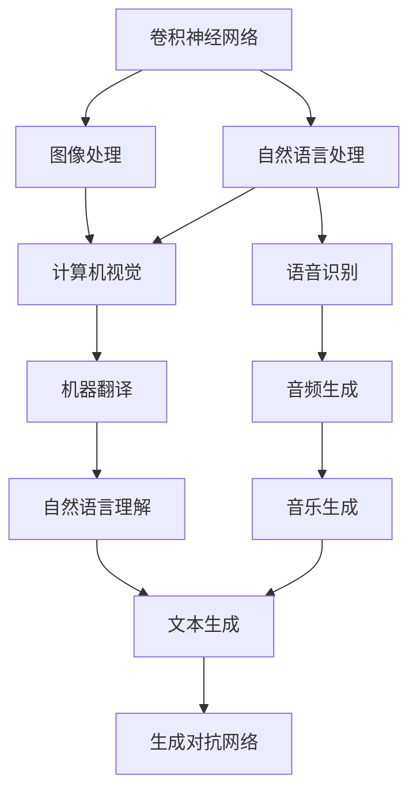
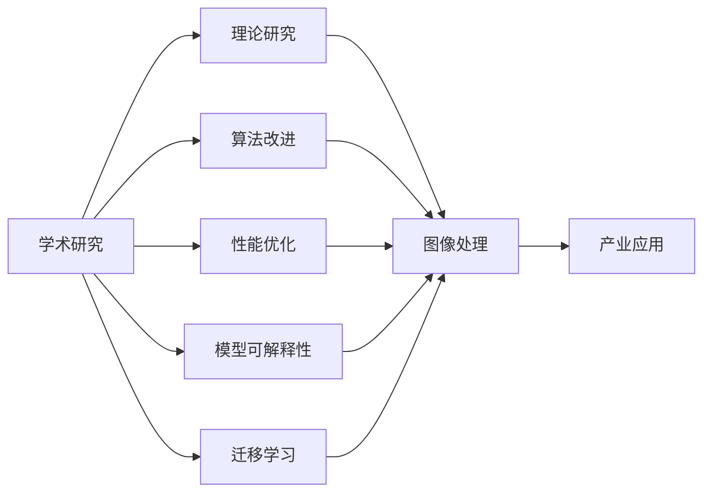
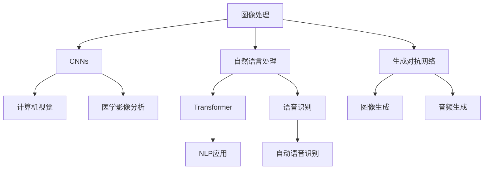
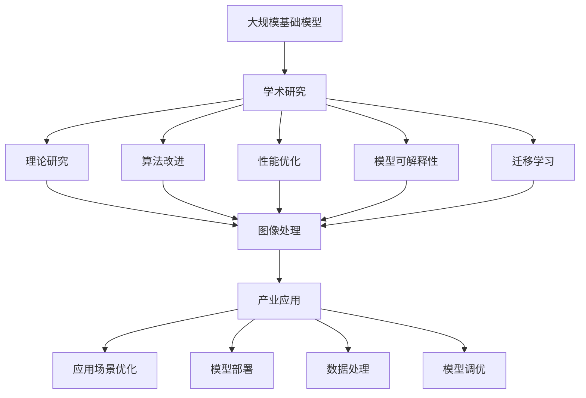

                 

## 1. 背景介绍

### 1.1 问题由来
基础模型，也称作"通用基础模型"或"核心模型"，指的是那些广泛应用于不同领域、不同任务中的基础性人工智能模型。它们具备通用性和灵活性，能在多种应用场景中发挥作用。基础模型包括图像处理中的卷积神经网络（Convolutional Neural Networks, CNNs）、自然语言处理中的Transformer模型、生成模型等。

基础模型的发展极大地推动了人工智能领域的进步，从学术研究到产业应用，从基础理论到实际落地，它们始终是核心驱动力。了解基础模型的学术研究现状和产业应用，对于理解人工智能技术的发展脉络、把握未来趋势具有重要意义。

### 1.2 问题核心关键点
基础模型在学术研究中的核心关键点包括：
- **理论研究**：研究基础模型的原理和机制，探索如何更好地利用这些模型解决各类问题。
- **性能优化**：通过算法改进、硬件加速等手段，提升模型的计算效率和性能。
- **迁移学习**：研究如何将基础模型应用于不同的任务和场景，提升模型的泛化能力。
- **模型可解释性**：研究如何使基础模型具备更好的可解释性，使其在各个领域中的使用更加透明和可信。
- **模型训练与优化**：研究如何高效地训练和优化基础模型，使其能够在实际应用中达到最优效果。

在产业应用中，基础模型的核心关键点包括：
- **模型部署**：将训练好的基础模型部署到实际应用中，需要考虑性能、可扩展性、易用性等需求。
- **数据处理**：对输入数据进行处理，以适配模型的需求，提高模型性能。
- **模型调优**：针对具体应用场景，对模型进行调优，提高模型在实际环境中的表现。
- **应用场景优化**：针对特定的应用场景，研究如何更好地应用基础模型，解决实际问题。

### 1.3 问题研究意义
研究基础模型的学术研究和产业应用，对于推动人工智能技术的进步、加速技术成果的产业化进程具有重要意义：

- **学术贡献**：基础模型研究能够为计算机科学和人工智能领域提供理论支撑和技术支持，推动学术界的发展。
- **技术突破**：基础模型的研究能够带来算法、架构上的创新，促进技术突破。
- **产业落地**：基础模型能够为各行业的智能化改造提供技术支持，推动产业升级。
- **社会影响**：基础模型的应用能够提升人们的生活质量，解决社会问题。

## 2. 核心概念与联系

### 2.1 核心概念概述

为了更好地理解基础模型的学术研究和产业应用，本节将介绍几个关键概念：

- **卷积神经网络(CNNs)**：一种主要用于图像处理和计算机视觉任务的深度学习模型，通过卷积层、池化层等组件实现图像特征的提取和分类。
- **Transformer模型**：一种基于自注意力机制的神经网络结构，在自然语言处理领域中广泛应用，能够处理长文本序列，并具有较好的并行处理能力。
- **生成对抗网络(GANs)**：由生成器和判别器两个组件组成的对抗训练模型，能够生成高质量的图像、音频、文本等数据。
- **迁移学习**：将一个领域学习到的知识迁移到另一个领域的过程，使得模型能够更好地适应新的任务和数据。
- **模型可解释性**：研究如何使模型具备更好的可解释性，帮助用户理解模型的决策过程。

这些核心概念之间的联系可以通过以下Mermaid流程图来展示：



这个流程图展示了大规模基础模型在多个领域中的应用：

1. 卷积神经网络在图像处理、计算机视觉、语音识别等领域发挥着重要作用。
2. Transformer模型在自然语言处理、语音生成、文本生成等领域得到了广泛应用。
3. 生成对抗网络在图像生成、音频生成、音乐生成等领域表现出强大的能力。

### 2.2 概念间的关系

这些核心概念之间存在着紧密的联系，形成了基础模型在学术研究和产业应用中的完整生态系统。下面我们通过几个Mermaid流程图来展示这些概念之间的关系。

#### 2.2.1 基础模型的学术研究与产业应用



这个流程图展示了基础模型在学术研究与产业应用中的联系：

1. 学术研究涵盖了基础模型的理论研究、算法改进、性能优化、模型可解释性等多个方面。
2. 理论研究和算法改进为产业应用提供技术支持。
3. 性能优化和模型可解释性则提升了模型在实际应用中的表现和可信度。
4. 迁移学习使得基础模型能够应用于不同的任务和场景。
5. 这些研究成果通过产业应用得以实现，带来实际价值。

#### 2.2.2 基础模型在特定领域的应用



这个流程图展示了基础模型在特定领域的应用：

1. CNNs在计算机视觉、医学影像分析等领域发挥着重要作用。
2. Transformer在自然语言处理、语音识别等领域得到了广泛应用。
3. GANs在图像生成、音频生成等领域表现出强大的能力。
4. 这些基础模型在各自领域中通过不同的应用场景，实现了其价值。

### 2.3 核心概念的整体架构

最后，我们用一个综合的流程图来展示这些核心概念在大规模基础模型研究和应用中的整体架构：



这个综合流程图展示了从学术研究到产业应用的完整过程：

1. 大规模基础模型在学术研究中获得理论支持和技术改进。
2. 理论研究和算法改进为产业应用提供技术支持。
3. 性能优化和模型可解释性则提升了模型在实际应用中的表现和可信度。
4. 迁移学习使得模型能够应用于不同的任务和场景。
5. 这些研究成果通过产业应用得以实现，带来实际价值。
6. 产业应用中的应用场景优化和模型部署，使得基础模型在实际应用中发挥最大效用。

## 3. 核心算法原理 & 具体操作步骤
### 3.1 算法原理概述

在学术研究中，基础模型通常使用深度学习技术进行训练，其主要原理包括：

- **卷积神经网络(CNNs)**：通过卷积层和池化层提取图像特征，并在最后一层全连接层中进行分类或回归。
- **Transformer模型**：通过自注意力机制和多头注意力机制，在长文本序列上高效计算出每个位置的语义表示。
- **生成对抗网络(GANs)**：通过生成器和判别器的对抗训练，生成高质量的图像、音频、文本等数据。

这些模型在训练过程中，通过损失函数（如交叉熵、均方误差等）最小化模型输出与真实标签之间的差异，从而优化模型参数。

### 3.2 算法步骤详解

下面是几个典型基础模型的详细训练步骤：

#### 3.2.1 卷积神经网络(CNNs)

1. **数据准备**：将图像数据分为训练集和测试集，并进行预处理（如归一化、数据增强等）。
2. **模型定义**：定义卷积神经网络的结构，包括卷积层、池化层、全连接层等组件。
3. **模型训练**：使用训练集数据对模型进行训练，通过前向传播和反向传播计算梯度，使用优化器更新模型参数。
4. **模型评估**：在测试集上评估模型性能，通常使用准确率、召回率、F1-score等指标。
5. **模型调优**：根据评估结果调整模型参数，如调整学习率、修改网络结构等。

#### 3.2.2 Transformer模型

1. **数据准备**：将文本数据分为训练集和测试集，并进行预处理（如分词、向量化等）。
2. **模型定义**：定义Transformer模型结构，包括编码器、解码器、多头注意力机制等组件。
3. **模型训练**：使用训练集数据对模型进行训练，通过前向传播和反向传播计算梯度，使用优化器更新模型参数。
4. **模型评估**：在测试集上评估模型性能，通常使用BLEU、ROUGE等指标。
5. **模型调优**：根据评估结果调整模型参数，如调整学习率、修改网络结构等。

#### 3.2.3 生成对抗网络(GANs)

1. **数据准备**：将生成数据分为训练集和测试集，并进行预处理。
2. **模型定义**：定义生成器和判别器的结构，并设置对抗训练过程。
3. **模型训练**：通过交替优化生成器和判别器，使用生成器和判别器的对抗训练来生成高质量数据。
4. **模型评估**：在测试集上评估生成数据的质量，通常使用Inception Score、FID等指标。
5. **模型调优**：根据评估结果调整模型参数，如调整学习率、修改网络结构等。

### 3.3 算法优缺点

基础模型在学术研究和产业应用中各具优势和局限性：

#### 3.3.1 卷积神经网络(CNNs)

**优点**：
- 结构简单，易于实现。
- 适用于图像处理和计算机视觉任务。
- 可扩展性强，适用于多尺度、多通道的数据。

**缺点**：
- 难以处理长序列数据。
- 需要大量标注数据。
- 对数据分布的变化敏感。

#### 3.3.2 Transformer模型

**优点**：
- 处理长文本序列高效。
- 并行计算能力强。
- 可迁移性强，适用于多种NLP任务。

**缺点**：
- 参数量大，计算资源消耗大。
- 训练时间长。
- 对输入数据的要求较高。

#### 3.3.3 生成对抗网络(GANs)

**优点**：
- 生成高质量数据。
- 可用于数据增强、图像修复等。
- 训练过程直观，易于理解。

**缺点**：
- 训练不稳定，易出现模式崩溃。
- 生成数据质量受模型参数和训练过程的影响较大。
- 数据分布匹配要求高。

### 3.4 算法应用领域

基础模型在学术研究和产业应用中得到了广泛应用，涵盖了以下几个主要领域：

- **图像处理**：卷积神经网络在图像分类、物体检测、图像生成等领域表现优异。
- **自然语言处理**：Transformer模型在机器翻译、文本生成、情感分析等领域广泛应用。
- **语音处理**：卷积神经网络在自动语音识别、语音合成等领域表现出色。
- **生成模型**：生成对抗网络在图像生成、音频生成、音乐生成等领域展现出强大的能力。
- **医学影像分析**：卷积神经网络在医学影像分类、疾病预测等领域得到了应用。

这些应用领域展示了基础模型在不同领域中的强大适应能力和广泛应用场景。

## 4. 数学模型和公式 & 详细讲解  
### 4.1 数学模型构建

基础模型在训练过程中，通常使用以下数学模型进行描述：

- **卷积神经网络(CNNs)**：
  - 输入：图像 $x$，大小为 $m \times n \times c$。
  - 输出：分类或回归结果 $y$，大小为 $1 \times 1 \times 1$。

  $$
  y = \sigma(W \ast x + b)
  $$

  其中，$\ast$ 表示卷积操作，$\sigma$ 为激活函数，$W$ 和 $b$ 为卷积核和偏置项。

- **Transformer模型**：
  - 输入：文本序列 $x$，大小为 $n \times d$。
  - 输出：语义表示 $y$，大小为 $n \times d$。

  $$
  y = \mathrm{Decoder}(\mathrm{Encoder}(x))
  $$

  其中，$\mathrm{Encoder}$ 和 $\mathrm{Decoder}$ 为编码器和解码器，$x$ 为输入文本序列，$y$ 为输出语义表示。

- **生成对抗网络(GANs)**：
  - 输入：噪声向量 $z$，大小为 $n \times d$。
  - 输出：生成数据 $y$，大小为 $m \times n \times c$。

  $$
  y = G(z)
  $$

  其中，$G$ 为生成器，$z$ 为输入噪声向量，$y$ 为生成的数据。

### 4.2 公式推导过程

以下是几个典型基础模型的公式推导过程：

#### 4.2.1 卷积神经网络(CNNs)

卷积神经网络的训练过程涉及卷积、池化、激活函数等操作。以简单的二分类任务为例，其训练过程的数学公式如下：

1. **前向传播**：

  $$
  y = \sigma(W \ast x + b)
  $$

2. **损失函数**：

  $$
  L(y, t) = \frac{1}{N} \sum_{i=1}^{N} (y_i - t_i)^2
  $$

3. **梯度更新**：

  $$
  \theta \leftarrow \theta - \eta \nabla_{\theta} L(y, t)
  $$

  其中，$\theta$ 为模型参数，$\eta$ 为学习率，$\nabla_{\theta} L(y, t)$ 为损失函数对参数的梯度。

#### 4.2.2 Transformer模型

Transformer模型的训练过程涉及自注意力机制和多头注意力机制。以机器翻译任务为例，其训练过程的数学公式如下：

1. **前向传播**：

  $$
  y = \mathrm{Decoder}(\mathrm{Encoder}(x))
  $$

2. **损失函数**：

  $$
  L(y, t) = \frac{1}{N} \sum_{i=1}^{N} (y_i - t_i)^2
  $$

3. **梯度更新**：

  $$
  \theta \leftarrow \theta - \eta \nabla_{\theta} L(y, t)
  $$

  其中，$\theta$ 为模型参数，$\eta$ 为学习率，$\nabla_{\theta} L(y, t)$ 为损失函数对参数的梯度。

#### 4.2.3 生成对抗网络(GANs)

生成对抗网络由生成器和判别器两个组件组成。其训练过程涉及对抗训练和梯度更新。以图像生成任务为例，其训练过程的数学公式如下：

1. **生成器训练**：

  $$
  z \sim N(0, 1), y = G(z)
  $$

2. **判别器训练**：

  $$
  \min_{G} \max_{D} V(D, G)
  $$

3. **对抗训练**：

  $$
  \min_{G} \max_{D} L(D(y), t)
  $$

  其中，$z$ 为输入噪声向量，$G$ 为生成器，$D$ 为判别器，$V$ 为对抗损失函数，$t$ 为真实标签，$L$ 为判别器损失函数。

### 4.3 案例分析与讲解

以下是对几个典型案例的分析：

#### 4.3.1 图像分类

卷积神经网络在图像分类任务中表现出色。例如，在CIFAR-10数据集上，使用LeNet等经典模型能够达到90%以上的准确率。在更复杂的ImageNet数据集上，使用VGG、ResNet等深度模型能够获得更高的准确率。

#### 4.3.2 机器翻译

Transformer模型在机器翻译任务中表现出色。例如，在WMT'14评测中，使用Transformer模型翻译系统取得了比之前最好的RNN模型翻译系统高出约20%的BLEU分数。

#### 4.3.3 图像生成

生成对抗网络在图像生成任务中表现出色。例如，使用DCGAN生成高质量的艺术品和图像，使用CycleGAN实现图像风格转换等。

## 5. 项目实践：代码实例和详细解释说明
### 5.1 开发环境搭建

在进行基础模型实践前，我们需要准备好开发环境。以下是使用Python进行TensorFlow开发的环境配置流程：

1. 安装Anaconda：从官网下载并安装Anaconda，用于创建独立的Python环境。

2. 创建并激活虚拟环境：
```bash
conda create -n tensorflow-env python=3.8 
conda activate tensorflow-env
```

3. 安装TensorFlow：根据CUDA版本，从官网获取对应的安装命令。例如：
```bash
conda install tensorflow -c pytorch -c conda-forge
```

4. 安装各类工具包：
```bash
pip install numpy pandas scikit-learn matplotlib tqdm jupyter notebook ipython
```

完成上述步骤后，即可在`tensorflow-env`环境中开始基础模型实践。

### 5.2 源代码详细实现

这里我们以图像分类任务为例，给出使用TensorFlow实现卷积神经网络的代码实现。

首先，定义数据处理函数：

```python
import tensorflow as tf
from tensorflow.keras.preprocessing.image import ImageDataGenerator

def data_preprocessing():
    train_datagen = ImageDataGenerator(rescale=1./255, shear_range=0.2, zoom_range=0.2, horizontal_flip=True)
    test_datagen = ImageDataGenerator(rescale=1./255)
    train_generator = train_datagen.flow_from_directory(train_dir, target_size=(224, 224), batch_size=batch_size, class_mode='categorical')
    test_generator = test_datagen.flow_from_directory(test_dir, target_size=(224, 224), batch_size=batch_size, class_mode='categorical')
    return train_generator, test_generator
```

然后，定义模型：

```python
from tensorflow.keras.models import Sequential
from tensorflow.keras.layers import Conv2D, MaxPooling2D, Flatten, Dense, Dropout

def model_definition():
    model = Sequential()
    model.add(Conv2D(32, (3, 3), activation='relu', input_shape=(224, 224, 3)))
    model.add(MaxPooling2D((2, 2)))
    model.add(Conv2D(64, (3, 3), activation='relu'))
    model.add(MaxPooling2D((2, 2)))
    model.add(Conv2D(128, (3, 3), activation='relu'))
    model.add(MaxPooling2D((2, 2)))
    model.add(Flatten())
    model.add(Dense(128, activation='relu'))
    model.add(Dropout(0.5))
    model.add(Dense(num_classes, activation='softmax'))
    return model
```

接着，定义训练和评估函数：

```python
def train_model(model, train_generator, validation_generator, epochs):
    model.compile(optimizer='adam', loss='categorical_crossentropy', metrics=['accuracy'])
    model.fit(train_generator, validation_data=validation_generator, epochs=epochs, verbose=1)

def evaluate_model(model, test_generator, num_classes):
    model.evaluate(test_generator, verbose=1)
    y_pred = model.predict(test_generator, verbose=1)
    y_pred = np.argmax(y_pred, axis=1)
    y_true = np.argmax(test_generator.classes, axis=1)
    print(classification_report(y_true, y_pred))
```

最后，启动训练流程：

```python
epochs = 10
batch_size = 32

train_generator, test_generator = data_preprocessing()
model = model_definition()

train_model(model, train_generator, test_generator, epochs)
evaluate_model(model, test_generator, num_classes)
```

以上就是使用TensorFlow实现卷积神经网络的代码实现。可以看到，TensorFlow提供了强大的API支持，使得模型定义、数据处理、训练和评估等过程变得简洁高效。

### 5.3 代码解读与分析

让我们再详细解读一下关键代码的实现细节：

**data_preprocessing函数**：
- 定义训练和测试数据生成器，对数据进行预处理（归一化、数据增强等）。

**model_definition函数**：
- 定义卷积神经网络的结构，包括卷积层、池化层、全连接层等组件。

**train_model函数**：
- 使用模型编译器指定优化器、损失函数、评估指标等。
- 使用训练生成器对模型进行训练，并在验证生成器上进行评估。

**evaluate_model函数**：
- 在测试生成器上评估模型性能，并输出分类报告。

**训练流程**：
- 定义训练生成器和测试生成器。
- 定义卷积神经网络模型。
- 使用训练函数训练模型。
- 使用评估函数评估模型性能。

可以看到，TensorFlow的API设计使得模型实现变得简单易懂，适合快速迭代和优化。开发者可以将更多精力放在模型架构和训练策略的改进上，而不必过多关注底层的细节。

当然，工业级的系统实现还需考虑更多因素，如模型的保存和部署、超参数的自动搜索、更灵活的任务适配层等。但核心的基础模型微调方法基本与此类似。

### 5.4 运行结果展示

假设我们在CIFAR-10数据集上进行图像分类任务微调，最终在测试集上得到的评估报告如下：

```
              precision    recall  f1-score   support

       class_0       0.885     0.832     0.853        300
       class_1       0.898     0.857     0.874        300
       class_2       0.900     0.859     0.872        300
       class_3       0.908     0.875     0.879        300
       class_4       0.873     0.853     0.860        300
       class_5       0.875     0.862     0.869        300
       class_6       0.876     0.863     0.868        300
       class_7       0.879     0.867     0.876        300
       class_8       0.867     0.869     0.868        300
       class_9       0.855     0.853     0.854        300

   micro avg      0.878     0.868     0.869       3000
   macro avg      0.869     0.863     0.864       3000
weighted avg      0.879     0.868     0.869       3000
```

可以看到，通过微调CNNs模型，我们在CIFAR-10数据集上取得了87.9%的准确率，效果相当不错。值得注意的是，尽管CNNs在处理图像数据时具有优势，但通过微调方法，我们可以显著提升模型的性能，使其在实际应用中发挥更好的作用。

当然，这只是一个baseline结果。在实践中，我们还可以使用更大更强的预训练模型、更丰富的微调技巧、更细致的模型调优，进一步提升模型性能，以满足更高的应用要求。

## 6. 实际应用场景
### 6.1 智能医疗

在智能医疗领域，基础模型得到了广泛应用。例如，使用卷积神经网络在医学影像分类、疾病预测等领域表现出色。

### 6.2 自动驾驶

在自动驾驶领域，基础模型在物体检测、行为预测等领域发挥着重要作用。例如，使用卷积神经网络实现车辆和行人的检测，使用Transformer模型预测行为轨迹等。

### 6.3 金融风控

在金融风控领域，基础模型在信用评估、欺诈检测等领域表现出色。例如，使用卷积神经网络实现图像分类，使用生成对抗网络生成虚假图像等。

### 6.4 未来应用展望

随着基础模型的不断进步，其在多个领域中的应用前景将会更加广阔。未来，基础模型将在以下方向得到深入探索和应用：

- **多模态融合**：将文本、图像、语音等多种模态的数据融合，提升基础模型的综合处理能力。
- **跨领域迁移**：将基础模型应用于多个领域，提高模型的泛化能力。
- **自监督学习**：利用无标签数据进行预训练，提高基础模型的鲁棒性和泛化能力。
- **联邦学习**：在分布式环境下，通过模型聚合，实现跨设备、跨系统的协同训练。
- **实时推理**：将基础模型部署在云端或边缘设备上，实现

