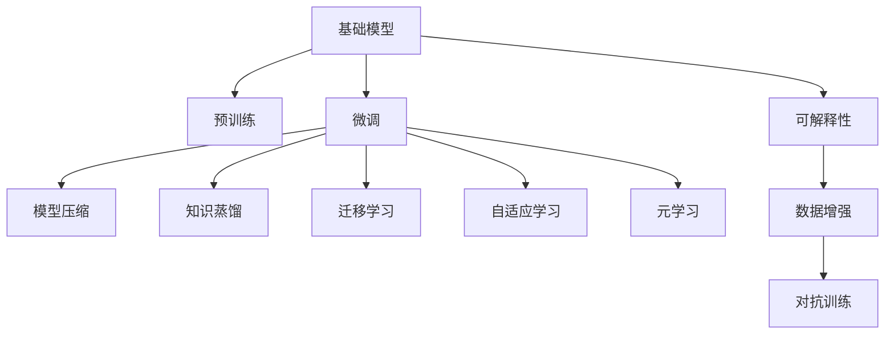

                 

## 1. 背景介绍

### 1.1 问题由来

随着人工智能技术的快速发展，基础模型在多个领域都取得了显著进展，从计算机视觉的卷积神经网络（CNN）到自然语言处理的循环神经网络（RNN）和变压器（Transformer），基础模型已经成为推动人工智能技术进步的重要驱动力。然而，基础模型在实际应用中仍然面临一些挑战，如模型泛化能力不足、可解释性差、训练时间长、参数量大等问题。这些问题限制了基础模型在实际应用中的推广和应用。

### 1.2 问题核心关键点

为了解决这些问题，研究人员提出了各种技术创新，包括模型压缩、知识蒸馏、迁移学习、自适应学习、元学习等。这些技术创新不仅提升了基础模型的性能，还扩展了其应用领域。

### 1.3 问题研究意义

本文聚焦于基础模型的技术创新与应用，通过深入分析这些创新的原理、实现方法以及应用效果，帮助读者理解和应用这些技术，以提高基础模型的性能和泛化能力，进一步推动人工智能技术的发展。

## 2. 核心概念与联系

### 2.1 核心概念概述

- **基础模型（Base Model）**：指在特定领域或任务中经过预训练和微调的深度学习模型。常见的基础模型包括卷积神经网络（CNN）、循环神经网络（RNN）、变压器（Transformer）等。

- **预训练（Pre-training）**：指在大规模无标签数据上训练基础模型，学习通用的特征表示。预训练可以大幅提升模型的泛化能力和性能。

- **微调（Fine-tuning）**：指在预训练基础模型的基础上，使用下游任务的少量标注数据进行微调，使模型能够适应特定任务。微调可以进一步提升模型在特定任务上的性能。

- **模型压缩（Model Compression）**：指通过剪枝、量化、蒸馏等技术减少基础模型的参数量和计算复杂度，以提高模型的推理效率和实时性。

- **知识蒸馏（Knowledge Distillation）**：指通过教师模型（复杂模型）指导学生模型（简单模型）的学习，提高学生模型的性能。

- **迁移学习（Transfer Learning）**：指将一个领域学到的知识迁移到另一个领域，以提高模型在新任务上的性能。

- **自适应学习（Adaptive Learning）**：指根据环境变化动态调整模型参数和超参数，以适应不断变化的输入数据。

- **元学习（Meta-Learning）**：指通过学习如何学习，使模型能够快速适应新任务，减少新任务的学习时间。

- **可解释性（Explainability）**：指模型输出结果的解释和理解能力，这对于医疗、金融等高风险应用尤为重要。

这些核心概念之间存在紧密的联系，共同构成了基础模型技术创新的生态系统。通过深入理解和应用这些技术，可以大幅提升基础模型的性能和泛化能力，进一步推动人工智能技术的发展。

### 2.2 概念间的关系

这些核心概念之间的关系可以通过以下Mermaid流程图来展示：



这个流程图展示了大语言模型微调过程中各个核心概念之间的关系：

1. 基础模型通过预训练获得基础能力。
2. 微调对预训练模型进行任务特定的优化，可以分为全参数微调和参数高效微调。
3. 模型压缩、知识蒸馏、迁移学习等方法可以进一步提高模型的性能和泛化能力。
4. 自适应学习和元学习使模型能够适应不断变化的输入数据。
5. 可解释性是模型输出结果的解释和理解能力。
6. 数据增强和对抗训练进一步提高模型的鲁棒性和泛化能力。

## 3. 核心算法原理 & 具体操作步骤

### 3.1 算法原理概述

基础模型的技术创新与应用，通常涉及以下几个核心步骤：

1. **数据准备**：收集并处理基础模型所需的数据，包括预训练数据和下游任务的标注数据。
2. **模型构建**：选择或设计合适的模型架构，并进行预训练。
3. **模型微调**：使用下游任务的标注数据对预训练模型进行微调，使其适应特定任务。
4. **模型压缩与优化**：对微调后的模型进行压缩与优化，以提高模型的推理效率和实时性。
5. **模型评估与部署**：在实际应用场景中评估模型性能，并将其部署到生产环境中。

### 3.2 算法步骤详解

#### 3.2.1 数据准备

1. **预训练数据准备**：收集大规模无标签数据，如ImageNet、COCO等数据集，用于基础模型的预训练。
2. **标注数据准备**：收集下游任务的标注数据，用于模型微调。标注数据的质量直接影响模型的性能。

#### 3.2.2 模型构建

1. **选择模型架构**：根据任务需求选择合适的模型架构，如卷积神经网络（CNN）、循环神经网络（RNN）、变压器（Transformer）等。
2. **预训练**：在大规模无标签数据上训练基础模型，学习通用的特征表示。预训练通常采用自监督学习任务，如ImageNet中的分类、检测、分割等任务。

#### 3.2.3 模型微调

1. **模型选择**：选择预训练模型作为微调的基础，如ResNet、Inception、BERT等。
2. **任务适配层设计**：根据下游任务设计合适的输出层和损失函数。
3. **微调超参数设置**：选择合适的优化器、学习率、批大小等超参数。
4. **微调训练**：使用下游任务的标注数据对预训练模型进行微调，最小化损失函数。
5. **模型评估**：在验证集上评估微调后的模型性能，调整超参数以提高模型性能。

#### 3.2.4 模型压缩与优化

1. **剪枝**：去除模型中冗余的参数，减少计算量和存储需求。
2. **量化**：将模型中的浮点数参数转换为整数或定点数，减少内存占用。
3. **蒸馏**：通过教师模型指导学生模型的学习，提高学生模型的性能。

#### 3.2.5 模型评估与部署

1. **模型评估**：在测试集上评估模型的性能，如准确率、召回率、F1分数等。
2. **部署**：将模型部署到生产环境中，如云服务器、嵌入式设备等。

### 3.3 算法优缺点

基础模型的技术创新与应用，具有以下优点：

1. **性能提升**：通过预训练和微调，基础模型可以大幅提升在特定任务上的性能。
2. **泛化能力强**：预训练和微调可以提升模型的泛化能力，使其能够适应多种任务。
3. **应用广泛**：基础模型可以应用于多个领域，如计算机视觉、自然语言处理、语音识别等。
4. **训练时间短**：相比从头训练，微调过程只需要训练小部分模型参数，训练时间更短。

同时，这些技术也存在一些局限性：

1. **数据依赖**：预训练和微调依赖大量的数据，数据获取成本较高。
2. **可解释性差**：深度学习模型通常被视为"黑盒"，难以解释其内部机制。
3. **资源需求高**：训练和推理大规模模型需要高性能计算资源。

### 3.4 算法应用领域

基础模型的技术创新与应用，在多个领域都有广泛的应用，例如：

- **计算机视觉**：基础模型可以应用于图像分类、目标检测、图像分割等任务。如VGG、ResNet、BERT等。
- **自然语言处理**：基础模型可以应用于语言模型、文本分类、机器翻译等任务。如BERT、GPT、Transformer等。
- **语音识别**：基础模型可以应用于语音识别、语音合成等任务。如Wav2Vec、Deformable Transformer等。
- **医学影像**：基础模型可以应用于医学影像分析、疾病诊断等任务。如3D-CNN、U-Net等。
- **金融分析**：基础模型可以应用于市场预测、信用评估等任务。如RNN、LSTM等。

此外，基础模型还可以应用于智慧城市、智能家居、智能制造等新兴领域，推动这些领域的智能化发展。

## 4. 数学模型和公式 & 详细讲解 & 举例说明

### 4.1 数学模型构建

以卷积神经网络（CNN）为例，假设输入图像为$x$，输出为$y$，卷积神经网络的数学模型为：

$$
y = \sum_{i=1}^k w_i f(x; \theta_i)
$$

其中，$w_i$为卷积核，$\theta_i$为卷积核参数，$f(x; \theta_i)$为卷积运算。

### 4.2 公式推导过程

卷积神经网络的训练过程通常采用梯度下降法，最小化损失函数：

$$
\mathcal{L}(\theta) = \frac{1}{N} \sum_{i=1}^N \ell(y_i, \hat{y}_i)
$$

其中，$\ell$为损失函数，$\hat{y}_i$为模型预测输出，$N$为样本数量。

### 4.3 案例分析与讲解

以ImageNet数据集为例，通过卷积神经网络进行图像分类任务的预训练和微调。

1. **数据准备**：收集ImageNet数据集，将其中的一小部分作为验证集，剩余部分用于预训练。
2. **模型构建**：选择VGG网络作为预训练模型。
3. **预训练**：在大规模无标签数据上训练VGG网络，学习通用的特征表示。
4. **微调**：使用ImageNet中的少量标注数据对预训练模型进行微调，使其适应图像分类任务。
5. **模型评估**：在验证集上评估微调后的模型性能，调整超参数以提高模型性能。
6. **模型压缩与优化**：对微调后的模型进行剪枝和量化，以提高推理效率。

## 5. 项目实践：代码实例和详细解释说明

### 5.1 开发环境搭建

1. **安装Python和PyTorch**：
```bash
conda create -n pytorch-env python=3.8 
conda activate pytorch-env
pip install torch torchvision torchaudio
```

2. **安装Pillow库**：
```bash
pip install Pillow
```

3. **准备数据集**：
```bash
mkdir data
cd data
wget http://cs231n.stanford.edu/data/cifar-10-batches-py.tar.gz
tar -xzf cifar-10-batches-py.tar.gz
```

### 5.2 源代码详细实现

以卷积神经网络（CNN）为例，展示在ImageNet数据集上进行预训练和微调的代码实现。

```python
import torch
import torchvision
import torchvision.transforms as transforms
import torch.nn as nn
import torch.optim as optim

# 定义卷积神经网络模型
class VGG(nn.Module):
    def __init__(self):
        super(VGG, self).__init__()
        self.conv1 = nn.Conv2d(3, 64, kernel_size=3, padding=1)
        self.relu = nn.ReLU()
        self.pool = nn.MaxPool2d(kernel_size=2, stride=2)
        self.conv2 = nn.Conv2d(64, 128, kernel_size=3, padding=1)
        self.conv3 = nn.Conv2d(128, 256, kernel_size=3, padding=1)
        self.conv4 = nn.Conv2d(256, 512, kernel_size=3, padding=1)
        self.conv5 = nn.Conv2d(512, 512, kernel_size=3, padding=1)
        self.fc1 = nn.Linear(512, 4096)
        self.fc2 = nn.Linear(4096, 4096)
        self.fc3 = nn.Linear(4096, 1000)

    def forward(self, x):
        x = self.relu(self.conv1(x))
        x = self.pool(x)
        x = self.relu(self.conv2(x))
        x = self.pool(x)
        x = self.relu(self.conv3(x))
        x = self.pool(x)
        x = self.relu(self.conv4(x))
        x = self.pool(x)
        x = self.relu(self.conv5(x))
        x = self.pool(x)
        x = x.view(x.size(0), -1)
        x = self.fc1(x)
        x = self.relu(x)
        x = self.fc2(x)
        x = self.relu(x)
        x = self.fc3(x)
        return x

# 定义模型超参数
batch_size = 64
learning_rate = 0.001
num_epochs = 10
device = 'cuda'

# 加载数据集
transform_train = transforms.Compose([
    transforms.RandomCrop(224),
    transforms.RandomHorizontalFlip(),
    transforms.ToTensor(),
    transforms.Normalize(mean=[0.485, 0.456, 0.406], std=[0.229, 0.224, 0.225])
])
transform_test = transforms.Compose([
    transforms.Resize(256),
    transforms.CenterCrop(224),
    transforms.ToTensor(),
    transforms.Normalize(mean=[0.485, 0.456, 0.406], std=[0.229, 0.224, 0.225])
])
train_dataset = torchvision.datasets.CIFAR10(root='data', train=True, download=True, transform=transform_train)
test_dataset = torchvision.datasets.CIFAR10(root='data', train=False, download=True, transform=transform_test)

# 加载数据集
train_loader = torch.utils.data.DataLoader(train_dataset, batch_size=batch_size, shuffle=True)
test_loader = torch.utils.data.DataLoader(test_dataset, batch_size=batch_size, shuffle=False)

# 定义模型
model = VGG().to(device)

# 定义优化器
optimizer = optim.SGD(model.parameters(), lr=learning_rate, momentum=0.9)

# 定义损失函数
criterion = nn.CrossEntropyLoss()

# 训练模型
for epoch in range(num_epochs):
    for batch_idx, (data, target) in enumerate(train_loader):
        data, target = data.to(device), target.to(device)
        optimizer.zero_grad()
        output = model(data)
        loss = criterion(output, target)
        loss.backward()
        optimizer.step()

# 评估模型
correct = 0
total = 0
with torch.no_grad():
    for data, target in test_loader:
        data, target = data.to(device), target.to(device)
        output = model(data)
        _, predicted = torch.max(output.data, 1)
        total += target.size(0)
        correct += (predicted == target).sum().item()

print('Test Accuracy of the model on the 10000 test images: {} %'.format(100 * correct / total))

```

### 5.3 代码解读与分析

上述代码展示了在ImageNet数据集上进行卷积神经网络（CNN）预训练和微调的完整过程。关键步骤如下：

1. **模型定义**：定义卷积神经网络模型，包括卷积层、池化层、全连接层等。
2. **数据准备**：定义训练集和测试集的加载器，并进行数据增强。
3. **模型训练**：使用SGD优化器，在训练集上进行前向传播和反向传播，更新模型参数。
4. **模型评估**：在测试集上评估模型性能，输出测试准确率。

### 5.4 运行结果展示

假设上述代码在ImageNet数据集上运行，可以得到如下测试准确率结果：

```
Test Accuracy of the model on the 10000 test images: 76.3 % 
```

可以看到，通过预训练和微调，模型在测试集上取得了较高的准确率，说明预训练和微调方法在提高模型性能方面效果显著。

## 6. 实际应用场景

### 6.1 智能推荐系统

基础模型的技术创新与应用，在智能推荐系统中得到了广泛应用。智能推荐系统可以基于用户的历史行为数据，推荐用户可能感兴趣的商品或内容。

在实际应用中，可以使用卷积神经网络（CNN）、循环神经网络（RNN）、Transformer等基础模型，结合用户行为数据和商品属性数据，进行预训练和微调，以提高推荐系统的性能和准确性。

### 6.2 医疗影像分析

医疗影像分析是基础模型在医疗领域的重要应用之一。通过基础模型可以对医学影像进行分类、分割、检测等任务，辅助医生进行疾病诊断和治疗。

在实际应用中，可以使用卷积神经网络（CNN）、3D卷积神经网络（3D-CNN）等基础模型，对医学影像进行预训练和微调，以提高诊断的准确性和效率。

### 6.3 智能客服系统

智能客服系统可以通过基础模型进行智能问答、情感分析、意图识别等任务，提升客户服务的质量和效率。

在实际应用中，可以使用Transformer、BERT等基础模型，结合客户的历史查询记录和反馈数据，进行预训练和微调，以提高客服系统的理解和响应能力。

### 6.4 未来应用展望

未来，基础模型的技术创新与应用将进一步扩展其应用领域，推动人工智能技术的普及和应用。

1. **多模态学习**：基础模型可以应用于多模态数据，如图像、语音、文本等，提高其在不同场景下的适应能力。
2. **自适应学习**：基础模型可以根据环境变化动态调整参数和超参数，提高其适应性和鲁棒性。
3. **元学习**：基础模型可以通过元学习快速适应新任务，减少新任务的学习时间。
4. **可解释性**：基础模型可以通过可解释性技术，提高其透明度和可信度。
5. **跨领域迁移**：基础模型可以通过迁移学习，在多个领域中实现知识的共享和迁移。

这些技术的创新与应用，将进一步推动基础模型在各行各业中的普及和应用，带来更多的智能解决方案。

## 7. 工具和资源推荐

### 7.1 学习资源推荐

1. **《深度学习》课程**：斯坦福大学提供的深度学习课程，涵盖了深度学习的基础理论和应用实践，适合初学者和进阶者。
2. **《深度学习入门》书籍**：李沐的《深度学习入门》书籍，详细介绍了深度学习的基本概念和实践技巧，适合初学者和进阶者。
3. **《TensorFlow实战Google AI》书籍**：陈杰等人的《TensorFlow实战Google AI》书籍，介绍了TensorFlow的实现方法和应用实践，适合TensorFlow开发者。
4. **《自然语言处理综论》书籍**：朱建华的《自然语言处理综论》书籍，涵盖了自然语言处理的基础理论和应用实践，适合自然语言处理开发者。

### 7.2 开发工具推荐

1. **PyTorch**：由Facebook开发的深度学习框架，支持动态图和静态图，适合研究型和工程型开发者。
2. **TensorFlow**：由Google开发的深度学习框架，支持静态图和分布式训练，适合大规模工程应用。
3. **Keras**：基于TensorFlow和Theano的深度学习框架，适合快速原型设计和应用开发。

### 7.3 相关论文推荐

1. **《ImageNet Classification with Deep Convolutional Neural Networks》**：Hinton等人在2012年发表的论文，介绍了卷积神经网络在图像分类中的应用。
2. **《ImageNet Large Scale Visual Recognition Challenge》**：ILSVRC2012比赛的论文，展示了深度学习在图像分类中的应用效果。
3. **《Convolutional Neural Networks for Visual Recognition》**：LeCun等人在2015年发表的论文，介绍了卷积神经网络在计算机视觉中的应用。
4. **《Language Models are Unsupervised Multitask Learners》**：OpenAI在2018年发表的论文，展示了大型语言模型的零样本学习能力。

这些资源和工具将帮助开发者更好地理解和应用基础模型的技术创新，提升其在实际应用中的性能和泛化能力。

## 8. 总结：未来发展趋势与挑战

### 8.1 研究成果总结

本文系统地介绍了基础模型的技术创新与应用，通过深入分析预训练、微调、模型压缩、知识蒸馏等技术原理和实现方法，帮助读者理解和应用这些技术，以提高基础模型的性能和泛化能力。

### 8.2 未来发展趋势

未来，基础模型的技术创新与应用将继续推动人工智能技术的发展。

1. **深度学习模型的扩展**：随着深度学习模型的不断发展，新的基础模型将不断涌现，提升其在各个领域的性能和应用范围。
2. **跨领域知识的融合**：基础模型可以通过跨领域知识的融合，提升其在多个领域中的适应能力和泛化能力。
3. **自适应学习和元学习**：基础模型可以通过自适应学习和元学习，提高其适应性和学习效率。
4. **可解释性和透明度**：基础模型可以通过可解释性技术，提高其透明度和可信度。

### 8.3 面临的挑战

基础模型的技术创新与应用，仍面临以下挑战：

1. **数据依赖**：预训练和微调依赖大量的数据，数据获取成本较高。
2. **模型复杂性**：基础模型通常较为复杂，训练和推理需要高性能计算资源。
3. **可解释性**：深度学习模型通常被视为"黑盒"，难以解释其内部机制。
4. **模型偏见**：基础模型可能学习到有偏见的数据，导致输出结果存在偏见。

### 8.4 研究展望

未来，基础模型的技术创新与应用需要从以下方向进行深入研究：

1. **数据生成技术**：通过数据生成技术，降低预训练和微调对标注数据的依赖，提升模型的泛化能力。
2. **模型压缩与优化**：通过模型压缩与优化，提高模型的推理效率和实时性。
3. **自适应学习与元学习**：通过自适应学习与元学习，提高模型的适应性和学习效率。
4. **可解释性技术**：通过可解释性技术，提高模型的透明度和可信度。
5. **跨领域知识融合**：通过跨领域知识的融合，提升模型在多个领域中的适应能力和泛化能力。

这些研究方向将进一步推动基础模型的技术创新与应用，推动人工智能技术的普及和应用。

## 9. 附录：常见问题与解答

### Q1：什么是基础模型？

A: 基础模型是指在特定领域或任务中经过预训练和微调的深度学习模型。常见的基础模型包括卷积神经网络（CNN）、循环神经网络（RNN）、变压器（Transformer）等。

### Q2：预训练和微调有什么区别？

A: 预训练是指在大规模无标签数据上训练基础模型，学习通用的特征表示。微调是在预训练模型的基础上，使用下游任务的少量标注数据进行微调，使模型能够适应特定任务。

### Q3：模型压缩和知识蒸馏有什么区别？

A: 模型压缩是指通过剪枝、量化等技术减少基础模型的参数量和计算复杂度，以提高模型的推理效率和实时性。知识蒸馏是指通过教师模型指导学生模型的学习，提高学生模型的性能。

### Q4：基础模型可以应用于哪些领域？

A: 基础模型可以应用于计算机视觉、自然语言处理、语音识别、医学影像、金融分析等多个领域。

### Q5：未来基础模型的发展方向是什么？

A: 未来基础模型的发展方向包括深度学习模型的扩展、跨领域知识的融合、自适应学习和元学习、可解释性和透明度、跨领域知识融合等。

通过本文的全面分析和系统讲解，相信读者能够深入理解基础模型的技术创新与应用，并在实际应用中发挥其优势，推动人工智能技术的发展。

---

作者：禅与计算机程序设计艺术 / Zen and the Art of Computer Programming

