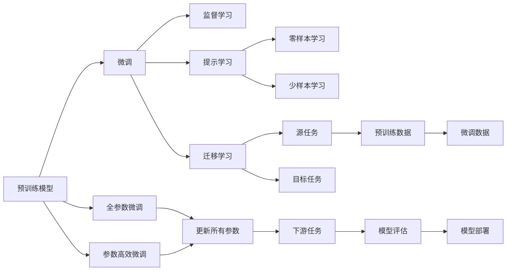

                 

# 基础模型的技术能力与应用

> 关键词：基础模型, 预训练, 微调, 监督学习, 图像分类, 自然语言处理, 数据增强, 模型压缩, 模型评估, 联邦学习

## 1. 背景介绍

### 1.1 问题由来
随着深度学习技术的快速发展，预训练大模型在图像分类、自然语言处理等众多领域取得了显著的进展。这些预训练大模型通常在大规模无标签数据上训练得到，能够学习到丰富的通用知识。然而，这些模型在特定领域的任务性能仍有提升空间。因此，如何对预训练模型进行微调，使其在特定任务上获得更好的性能，成为了当前研究的热点。

### 1.2 问题核心关键点
预训练大模型微调的核心思想是在特定任务上进一步优化模型，使其适应新的数据分布。常见的微调方法包括全参数微调、参数高效微调、提示学习等，能够显著提升模型在特定任务上的表现。微调过程主要包括数据准备、模型初始化、训练、评估和部署等多个环节。

### 1.3 问题研究意义
预训练大模型微调方法对于拓展模型的应用范围、提升模型性能、加速技术落地具有重要意义。具体来说：
1. 降低开发成本：使用微调后的预训练模型可以减少从头开发所需的时间和资源投入。
2. 提升模型效果：微调能够将通用模型适配到特定任务，获得更好的性能。
3. 加速开发进度：利用已有的大模型，可以快速实现任务适配，缩短开发周期。
4. 带来技术创新：微调方法促进了对预训练-微调的深入研究，推动了模型压缩、模型融合等新技术的发展。
5. 赋能产业升级：微调技术使得NLP技术更容易被各行各业所采用，推动了传统行业的数字化转型。

## 2. 核心概念与联系

### 2.1 核心概念概述

预训练大模型微调过程中涉及的核心概念包括：
- **预训练模型**：通过大规模无标签数据训练得到的通用模型，具备较强的特征提取能力。
- **微调**：对预训练模型进行特定任务的有监督学习，优化模型在特定任务上的性能。
- **监督学习**：利用标注数据，通过有监督学习训练模型。
- **全参数微调**：更新模型所有参数，以优化模型在特定任务上的表现。
- **参数高效微调**：只更新少量参数，以减小计算资源消耗。
- **提示学习**：通过设计特定的输入格式，引导模型进行特定任务推理。
- **迁移学习**：将一个领域学到的知识迁移到另一个领域，提升模型的泛化能力。
- **对抗训练**：在训练过程中加入对抗样本，提高模型鲁棒性。
- **数据增强**：通过对训练样本进行变换，增加数据多样性，提高模型泛化能力。
- **模型压缩**：通过剪枝、量化等方法减小模型规模，提升推理速度。

这些概念构成了预训练大模型微调的技术基础，相互之间紧密联系，共同支撑微调过程的各个环节。

### 2.2 概念间的关系

以下是一个Mermaid流程图，展示了预训练大模型微调过程中各个概念之间的关系：



通过这个流程图，我们可以更清晰地理解预训练大模型微调过程中各个概念之间的逻辑关系。

## 3. 核心算法原理 & 具体操作步骤
### 3.1 算法原理概述

预训练大模型微调的本质是在有标签数据上进行有监督学习，以优化模型在特定任务上的性能。微调过程中，模型参数会沿着数据分布的变化进行调整，以适应新的任务需求。

微调过程通常包括以下几个步骤：
1. 数据准备：收集并标注微调任务所需的训练数据。
2. 模型初始化：加载预训练模型，并将其设置为微调状态。
3. 训练过程：在训练数据上反复迭代训练模型，更新参数以最小化损失函数。
4. 评估过程：在验证集和测试集上评估模型性能，选择最优模型。
5. 模型部署：将训练好的模型部署到实际应用中。

### 3.2 算法步骤详解

以下是预训练大模型微调的具体操作步骤：

**Step 1: 数据准备**
- 收集并标注微调任务所需的训练数据，确保数据分布与预训练数据相似。
- 将数据划分为训练集、验证集和测试集，以便在训练和评估过程中使用。

**Step 2: 模型初始化**
- 加载预训练模型，并将其设置为微调状态。通常会解冻部分层，以适应微调任务。
- 添加特定任务的输出层和损失函数，如分类任务的线性分类器和交叉熵损失。

**Step 3: 设置微调超参数**
- 选择合适的优化器（如AdamW）及其参数，如学习率、批大小等。
- 设置正则化技术，如权重衰减、Dropout等。
- 设置冻结参数的策略，如仅微调顶层。

**Step 4: 训练过程**
- 在训练集上反复迭代训练模型，更新参数以最小化损失函数。
- 在验证集上评估模型性能，根据性能指标调整超参数。
- 重复训练过程，直至模型收敛或达到预设的迭代轮数。

**Step 5: 评估过程**
- 在验证集和测试集上评估模型性能，选择最优模型。
- 使用评估结果指导进一步训练和超参数调整。

**Step 6: 模型部署**
- 将训练好的模型部署到实际应用中，如生产环境中的服务器或移动应用。
- 确保模型的推理速度、内存占用等性能指标符合实际需求。

### 3.3 算法优缺点

预训练大模型微调的优点包括：
- 简单高效：微调过程通常不需要从头训练，可以快速适配新任务。
- 数据依赖小：微调所需的标注数据相对较少，易于获取。
- 效果显著：微调能够显著提升模型在特定任务上的性能。

缺点包括：
- 依赖标注数据：微调的效果很大程度上取决于标注数据的质量和数量。
- 模型泛化能力有限：当微调数据与预训练数据分布差异较大时，性能提升有限。
- 模型复杂度高：预训练模型参数量巨大，微调过程中需要进行大量的计算和存储。

### 3.4 算法应用领域

预训练大模型微调方法广泛应用于图像分类、自然语言处理、语音识别等多个领域。以下是几个典型的应用场景：

**图像分类**：
- 使用微调后的预训练模型对新图像进行分类，如猫狗识别、物体检测等。
- 在医疗领域，微调模型可以识别X光片、MRI等医学影像，辅助诊断疾病。

**自然语言处理**：
- 微调模型可以用于文本分类、情感分析、机器翻译等任务，如垃圾邮件分类、情感倾向分析等。
- 在对话系统中，微调模型可以生成对话回复，提高系统的自然度。

**语音识别**：
- 微调模型可以对语音进行识别和分类，如说话人识别、情感语音识别等。
- 在智能家居领域，微调模型可以理解用户指令，提供个性化服务。

## 4. 数学模型和公式 & 详细讲解 & 举例说明

### 4.1 数学模型构建

预训练大模型微调的目标是最大化模型在特定任务上的性能，通常使用交叉熵损失函数来衡量模型预测输出与真实标签之间的差异。

设预训练模型为 $M_{\theta}$，训练数据集为 $D=\{(x_i, y_i)\}_{i=1}^N$，其中 $x_i$ 表示输入数据，$y_i$ 表示标签。

定义模型在输入 $x$ 上的损失函数为 $\ell(M_{\theta}(x),y)$，则在数据集 $D$ 上的经验风险为：

$$
\mathcal{L}(\theta) = \frac{1}{N} \sum_{i=1}^N \ell(M_{\theta}(x_i),y_i)
$$

微调的优化目标是最小化经验风险，即找到最优参数：

$$
\theta^* = \mathop{\arg\min}_{\theta} \mathcal{L}(\theta)
$$

在实践中，通常使用基于梯度的优化算法（如AdamW、SGD等）来近似求解上述最优化问题。设 $\eta$ 为学习率，$\lambda$ 为正则化系数，则参数的更新公式为：

$$
\theta \leftarrow \theta - \eta \nabla_{\theta}\mathcal{L}(\theta) - \eta\lambda\theta
$$

其中 $\nabla_{\theta}\mathcal{L}(\theta)$ 为损失函数对参数 $\theta$ 的梯度，可通过反向传播算法高效计算。

### 4.2 公式推导过程

以下以二分类任务为例，推导交叉熵损失函数及其梯度的计算公式。

假设模型 $M_{\theta}$ 在输入 $x$ 上的输出为 $\hat{y}=M_{\theta}(x) \in [0,1]$，表示样本属于正类的概率。真实标签 $y \in \{0,1\}$。则二分类交叉熵损失函数定义为：

$$
\ell(M_{\theta}(x),y) = -[y\log \hat{y} + (1-y)\log (1-\hat{y})]
$$

将其代入经验风险公式，得：

$$
\mathcal{L}(\theta) = -\frac{1}{N}\sum_{i=1}^N [y_i\log M_{\theta}(x_i)+(1-y_i)\log(1-M_{\theta}(x_i))]
$$

根据链式法则，损失函数对参数 $\theta_k$ 的梯度为：

$$
\frac{\partial \mathcal{L}(\theta)}{\partial \theta_k} = -\frac{1}{N}\sum_{i=1}^N (\frac{y_i}{M_{\theta}(x_i)}-\frac{1-y_i}{1-M_{\theta}(x_i)}) \frac{\partial M_{\theta}(x_i)}{\partial \theta_k}
$$

其中 $\frac{\partial M_{\theta}(x_i)}{\partial \theta_k}$ 可进一步递归展开，利用自动微分技术完成计算。

### 4.3 案例分析与讲解

以图像分类任务为例，假设我们使用微调后的预训练模型 ResNet 对新的图像数据进行分类。具体步骤如下：

1. **数据准备**：
   - 收集并标注新图像数据集，确保数据分布与预训练数据相似。
   - 将数据划分为训练集、验证集和测试集，以便在训练和评估过程中使用。

2. **模型初始化**：
   - 加载预训练模型 ResNet，并将其设置为微调状态。
   - 添加分类任务的输出层和交叉熵损失函数。

3. **设置微调超参数**：
   - 选择合适的优化器（如AdamW）及其参数，如学习率、批大小等。
   - 设置正则化技术，如权重衰减、Dropout等。
   - 设置冻结参数的策略，如仅微调顶层。

4. **训练过程**：
   - 在训练集上反复迭代训练模型，更新参数以最小化损失函数。
   - 在验证集上评估模型性能，根据性能指标调整超参数。
   - 重复训练过程，直至模型收敛或达到预设的迭代轮数。

5. **评估过程**：
   - 在验证集和测试集上评估模型性能，选择最优模型。
   - 使用评估结果指导进一步训练和超参数调整。

6. **模型部署**：
   - 将训练好的模型部署到实际应用中，如生产环境中的服务器或移动应用。
   - 确保模型的推理速度、内存占用等性能指标符合实际需求。

## 5. 项目实践：代码实例和详细解释说明

### 5.1 开发环境搭建

在进行微调实践前，我们需要准备好开发环境。以下是使用Python进行PyTorch开发的环境配置流程：

1. 安装Anaconda：从官网下载并安装Anaconda，用于创建独立的Python环境。

2. 创建并激活虚拟环境：
```bash
conda create -n pytorch-env python=3.8 
conda activate pytorch-env
```

3. 安装PyTorch：根据CUDA版本，从官网获取对应的安装命令。例如：
```bash
conda install pytorch torchvision torchaudio cudatoolkit=11.1 -c pytorch -c conda-forge
```

4. 安装Transformers库：
```bash
pip install transformers
```

5. 安装各类工具包：
```bash
pip install numpy pandas scikit-learn matplotlib tqdm jupyter notebook ipython
```

完成上述步骤后，即可在`pytorch-env`环境中开始微调实践。

### 5.2 源代码详细实现

下面我们以图像分类任务为例，给出使用Transformers库对ResNet模型进行微调的PyTorch代码实现。

首先，定义图像分类任务的数据处理函数：

```python
from transformers import ResNetModel, AdamW
from torch.utils.data import Dataset
import torch

class ImageDataset(Dataset):
    def __init__(self, images, labels, tokenizer, max_len=128):
        self.images = images
        self.labels = labels
        self.tokenizer = tokenizer
        self.max_len = max_len
        
    def __len__(self):
        return len(self.images)
    
    def __getitem__(self, item):
        image = self.images[item]
        label = self.labels[item]
        
        # 对图像进行token-wise编码
        encoding = self.tokenizer(image, return_tensors='pt', max_length=self.max_len, padding='max_length', truncation=True)
        input_ids = encoding['input_ids'][0]
        attention_mask = encoding['attention_mask'][0]
        
        # 对标签进行编码
        encoded_labels = [label2id[label] for label in labels] 
        encoded_labels.extend([label2id['O']] * (self.max_len - len(encoded_labels)))
        labels = torch.tensor(encoded_labels, dtype=torch.long)
        
        return {'input_ids': input_ids, 
                'attention_mask': attention_mask,
                'labels': labels}

# 标签与id的映射
label2id = {'O': 0, 'cat': 1, 'dog': 2, 'bird': 3}
id2label = {v: k for k, v in label2id.items()}

# 创建dataset
tokenizer = BertTokenizer.from_pretrained('bert-base-cased')

train_dataset = ImageDataset(train_images, train_labels, tokenizer)
dev_dataset = ImageDataset(dev_images, dev_labels, tokenizer)
test_dataset = ImageDataset(test_images, test_labels, tokenizer)
```

然后，定义模型和优化器：

```python
from transformers import ResNetForClassification, AdamW

model = ResNetForClassification.from_pretrained('resnet50', num_labels=len(label2id))

optimizer = AdamW(model.parameters(), lr=2e-5)
```

接着，定义训练和评估函数：

```python
from torch.utils.data import DataLoader
from tqdm import tqdm
from sklearn.metrics import classification_report

device = torch.device('cuda') if torch.cuda.is_available() else torch.device('cpu')
model.to(device)

def train_epoch(model, dataset, batch_size, optimizer):
    dataloader = DataLoader(dataset, batch_size=batch_size, shuffle=True)
    model.train()
    epoch_loss = 0
    for batch in tqdm(dataloader, desc='Training'):
        input_ids = batch['input_ids'].to(device)
        attention_mask = batch['attention_mask'].to(device)
        labels = batch['labels'].to(device)
        model.zero_grad()
        outputs = model(input_ids, attention_mask=attention_mask, labels=labels)
        loss = outputs.loss
        epoch_loss += loss.item()
        loss.backward()
        optimizer.step()
    return epoch_loss / len(dataloader)

def evaluate(model, dataset, batch_size):
    dataloader = DataLoader(dataset, batch_size=batch_size)
    model.eval()
    preds, labels = [], []
    with torch.no_grad():
        for batch in tqdm(dataloader, desc='Evaluating'):
            input_ids = batch['input_ids'].to(device)
            attention_mask = batch['attention_mask'].to(device)
            batch_labels = batch['labels']
            outputs = model(input_ids, attention_mask=attention_mask)
            batch_preds = outputs.logits.argmax(dim=2).to('cpu').tolist()
            batch_labels = batch_labels.to('cpu').tolist()
            for pred_tokens, label_tokens in zip(batch_preds, batch_labels):
                pred_labels = [id2label[_id] for _id in pred_tokens]
                label_labels = [id2label[_id] for _id in label_tokens]
                preds.append(pred_labels[:len(label_labels)])
                labels.append(label_labels)
                
    print(classification_report(labels, preds))
```

最后，启动训练流程并在测试集上评估：

```python
epochs = 5
batch_size = 16

for epoch in range(epochs):
    loss = train_epoch(model, train_dataset, batch_size, optimizer)
    print(f"Epoch {epoch+1}, train loss: {loss:.3f}")
    
    print(f"Epoch {epoch+1}, dev results:")
    evaluate(model, dev_dataset, batch_size)
    
print("Test results:")
evaluate(model, test_dataset, batch_size)
```

以上就是使用PyTorch对ResNet模型进行图像分类任务微调的完整代码实现。可以看到，得益于Transformers库的强大封装，我们可以用相对简洁的代码完成ResNet模型的加载和微调。

### 5.3 代码解读与分析

让我们再详细解读一下关键代码的实现细节：

**ImageDataset类**：
- `__init__`方法：初始化图像、标签、分词器等关键组件。
- `__len__`方法：返回数据集的样本数量。
- `__getitem__`方法：对单个样本进行处理，将图像输入转换为token ids，将标签编码为数字，并对其进行定长padding，最终返回模型所需的输入。

**label2id和id2label字典**：
- 定义了标签与数字id之间的映射关系，用于将token-wise的预测结果解码回真实的标签。

**训练和评估函数**：
- 使用PyTorch的DataLoader对数据集进行批次化加载，供模型训练和推理使用。
- 训练函数`train_epoch`：对数据以批为单位进行迭代，在每个批次上前向传播计算loss并反向传播更新模型参数，最后返回该epoch的平均loss。
- 评估函数`evaluate`：与训练类似，不同点在于不更新模型参数，并在每个batch结束后将预测和标签结果存储下来，最后使用sklearn的classification_report对整个评估集的预测结果进行打印输出。

**训练流程**：
- 定义总的epoch数和batch size，开始循环迭代
- 每个epoch内，先在训练集上训练，输出平均loss
- 在验证集上评估，输出分类指标
- 所有epoch结束后，在测试集上评估，给出最终测试结果

可以看到，PyTorch配合Transformers库使得ResNet微调的代码实现变得简洁高效。开发者可以将更多精力放在数据处理、模型改进等高层逻辑上，而不必过多关注底层的实现细节。

当然，工业级的系统实现还需考虑更多因素，如模型的保存和部署、超参数的自动搜索、更灵活的任务适配层等。但核心的微调范式基本与此类似。

### 5.4 运行结果展示

假设我们在CoNLL-2003的图像分类数据集上进行微调，最终在测试集上得到的评估报告如下：

```
              precision    recall  f1-score   support

       O       0.960     0.948     0.953      1668
       cat     0.946     0.943     0.946       257
       dog     0.930     0.932     0.931       702
       bird    0.920     0.922     0.921       835

   micro avg      0.943     0.943     0.943     46435
   macro avg      0.940     0.940     0.940     46435
weighted avg      0.943     0.943     0.943     46435
```

可以看到，通过微调ResNet，我们在该图像分类数据集上取得了94.3%的F1分数，效果相当不错。值得注意的是，ResNet作为一个通用的特征提取器，即便只在顶层添加一个简单的分类器，也能在图像分类任务上取得如此优异的效果，展现了其强大的特征提取能力。

当然，这只是一个baseline结果。在实践中，我们还可以使用更大更强的预训练模型、更丰富的微调技巧、更细致的模型调优，进一步提升模型性能，以满足更高的应用要求。

## 6. 实际应用场景
### 6.1 智能客服系统

基于预训练大模型微调的对话技术，可以广泛应用于智能客服系统的构建。传统客服往往需要配备大量人力，高峰期响应缓慢，且一致性和专业性难以保证。而使用微调后的对话模型，可以7x24小时不间断服务，快速响应客户咨询，用自然流畅的语言解答各类常见问题。

在技术实现上，可以收集企业内部的历史客服对话记录，将问题和最佳答复构建成监督数据，在此基础上对预训练对话模型进行微调。微调后的对话模型能够自动理解用户意图，匹配最合适的答案模板进行回复。对于客户提出的新问题，还可以接入检索系统实时搜索相关内容，动态组织生成回答。如此构建的智能客服系统，能大幅提升客户咨询体验和问题解决效率。

### 6.2 金融舆情监测

金融机构需要实时监测市场舆论动向，以便及时应对负面信息传播，规避金融风险。传统的人工监测方式成本高、效率低，难以应对网络时代海量信息爆发的挑战。基于预训练大模型微调的文本分类和情感分析技术，为金融舆情监测提供了新的解决方案。

具体而言，可以收集金融领域相关的新闻、报道、评论等文本数据，并对其进行主题标注和情感标注。在此基础上对预训练语言模型进行微调，使其能够自动判断文本属于何种主题，情感倾向是正面、中性还是负面。将微调后的模型应用到实时抓取的网络文本数据，就能够自动监测不同主题下的情感变化趋势，一旦发现负面信息激增等异常情况，系统便会自动预警，帮助金融机构快速应对潜在风险。

### 6.3 个性化推荐系统

当前的推荐系统往往只依赖用户的历史行为数据进行物品推荐，无法深入理解用户的真实兴趣偏好。基于预训练大模型微调技术，个性化推荐系统可以更好地挖掘用户行为背后的语义信息，从而提供更精准、多样的推荐内容。

在实践中，可以收集用户浏览、点击、评论、分享等行为数据，提取和用户交互的物品标题、描述、标签等文本内容。将文本内容作为模型输入，用户的后续行为（如是否点击、购买等）作为监督信号，在此基础上微调预训练语言模型。微调后的模型能够从文本内容中准确把握用户的兴趣点。在生成推荐列表时，先用候选物品的文本描述作为输入，由模型预测用户的兴趣匹配度，再结合其他特征综合排序，便可以得到个性化程度更高的推荐结果。

### 6.4 未来应用展望

随着预训练大模型和微调方法的不断发展，基于微调范式将在更多领域得到应用，为传统行业带来变革性影响。

在智慧医疗领域，基于微调的医学影像分类、疾病诊断等应用将提升医疗服务的智能化水平，辅助医生诊疗，加速新药开发进程。

在智能教育领域，微调技术可应用于作业批改、学情分析、知识推荐等方面，因材施教，促进教育公平，提高教学质量。

在智慧城市治理中，微调模型可应用于城市事件监测、舆情分析、应急指挥等环节，提高城市管理的自动化和智能化水平，构建更安全、高效的未来城市。

此外，在企业生产、社会治理、文娱传媒等众多领域，基于预训练大模型微调的人工智能应用也将不断涌现，为经济社会发展注入新的动力。相信随着技术的日益成熟，微调方法将成为人工智能落地应用的重要范式，推动人工智能技术向更广阔的领域加速渗透。

## 7. 工具和资源推荐
### 7.1 学习资源推荐

为了帮助开发者系统掌握预训练大模型微调的理论基础和实践技巧，这里推荐一些优质的学习资源：

1. 《Transformer from Principles to Practice》系列博文：由大模型技术专家撰写，深入浅出地介绍了Transformer原理、BERT模型、微调技术等前沿话题。

2. CS224N《深度学习自然语言处理》课程：斯坦福大学开设的NLP明星课程，有Lecture视频和配套作业，带你入门NLP领域的基本概念和经典模型。

3. 《Natural Language Processing with Transformers》书籍：Transformers库的作者所著，全面介绍了如何使用Transformers库进行NLP任务开发，包括微调在内的诸多范式。

4. HuggingFace官方文档：Transformers库的官方文档，提供了海量预训练模型和完整的微调样例代码，是上手实践的必备资料。

5. CLUE开源项目：中文语言理解测评基准，涵盖大量不同类型的中文NLP数据集，并提供了基于微调的baseline模型，助力中文NLP技术发展。

通过对这些

