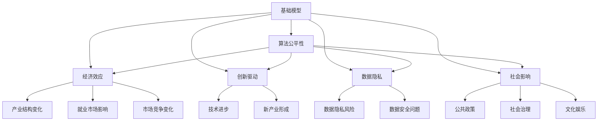

                 

# 基础模型的政治经济学效应

> 关键词：基础模型,政治经济学,经济效应,算法公平性,创新驱动

## 1. 背景介绍

### 1.1 问题由来
在当今数字化时代，基础模型（Foundation Models）正在成为塑造经济、政治和社会结构的关键力量。这些模型由大型科技公司如Google、OpenAI、Microsoft等开发，利用大数据和先进的机器学习技术，提供从自然语言处理、图像识别到智能推荐等众多服务。尽管基础模型在诸多领域展示了其强大的潜力，但其使用过程中也带来了诸多政治经济学效应，值得深入探讨。

### 1.2 问题核心关键点
基础模型对政治经济学的影响是多方面的，包括但不限于以下几个核心点：

- 算法公平性：基础模型的决策过程是否存在偏见，影响特定群体。
- 经济效应：基础模型的使用对产业、就业、市场竞争等经济方面产生的影响。
- 创新驱动：基础模型如何促进或抑制创新，影响技术进步和产业升级。
- 数据隐私：基础模型依赖大量个人数据，数据隐私和安全问题变得尤为突出。
- 社会影响：基础模型在社会治理、公共政策等方面的应用，可能带来正面或负面的社会效应。

这些问题涉及经济学、社会学、伦理学等多个学科，揭示了基础模型与现实世界的复杂关系。本文将从算法公平性、经济效应、创新驱动、数据隐私和社会影响五个方面，深入分析基础模型的政治经济学效应。

### 1.3 问题研究意义
研究基础模型的政治经济学效应，对于理解其对社会、经济和技术的深远影响，具有重要意义：

1. 揭示潜在风险：通过深入分析基础模型的决策机制和应用场景，可以识别其可能带来的伦理和社会问题，为政策制定提供科学依据。
2. 促进公平正义：了解模型对不同群体的不公平影响，有助于制定公平的政策和技术手段，减少社会不平等。
3. 推动持续创新：分析基础模型对创新和市场竞争的影响，有助于激发新的技术突破和产业升级，促进经济持续发展。
4. 加强数据保护：明确基础模型对数据隐私和安全的影响，有助于制定相关法律和规范，保护个人隐私权益。
5. 引导社会责任：基于对基础模型社会影响的分析，推动科技公司承担社会责任，为社会福祉贡献力量。

## 2. 核心概念与联系

### 2.1 核心概念概述

基础模型通常指通过大规模数据训练得到的深度学习模型，具备强大的预测和推理能力。这些模型在金融、医疗、教育、娱乐等多个领域得到广泛应用，显著提升了数据处理和决策效率。但同时，基础模型的使用也带来了诸多政治经济学效应，需要通过跨学科分析来理解其深层次影响。

1. **算法公平性**：基础模型在训练和应用过程中，是否存在算法偏见，对不同群体的影响是否公平。
2. **经济效应**：基础模型对产业结构、就业市场、市场竞争等经济因素的影响。
3. **创新驱动**：基础模型在推动技术进步、促进新产业形成等方面的作用。
4. **数据隐私**：基础模型依赖大量个人数据，数据隐私和安全问题日益突出。
5. **社会影响**：基础模型在公共政策、社会治理、文化娱乐等方面的应用，可能带来正面或负面的社会效应。

这些核心概念之间存在着紧密的联系，可以通过以下Mermaid流程图来展示：



### 2.2 概念间的关系

这些核心概念之间存在着复杂的相互关系，可以通过以下表格来进一步说明：

| 概念     | 关系           |
|----------|----------------|
| 算法公平性 | 直接影响经济效应、创新驱动、社会影响 |
| 经济效应 | 依赖算法公平性、数据隐私，影响创新驱动、社会影响 |
| 创新驱动 | 依赖算法公平性、经济效应，推动新产业形成 |
| 数据隐私 | 依赖算法公平性、经济效应，影响社会影响 |
| 社会影响 | 依赖算法公平性、经济效应、创新驱动、数据隐私 |

这些关系表明，基础模型的政治经济学效应是多维度的，需要通过综合分析来全面理解其影响。

## 3. 核心算法原理 & 具体操作步骤
### 3.1 算法原理概述

基础模型的政治经济学效应主要体现在算法公平性、经济效应、创新驱动、数据隐私和社会影响五个方面。这些效应的形成与基础模型的算法原理密切相关，主要包括以下几个方面：

1. **数据依赖性**：基础模型依赖大量标注数据进行训练，数据的选择和处理对模型的公平性和偏见有重要影响。
2. **学习机制**：基础模型通过反向传播算法更新参数，优化损失函数，实现预测任务。
3. **特征提取**：基础模型能够自动学习数据的特征表示，这些表示在特定任务上的表现直接影响经济效应和创新驱动。
4. **对抗训练**：基础模型在训练过程中引入对抗样本，提高模型的鲁棒性和泛化能力。
5. **可解释性**：基础模型的输出通常难以解释，对数据隐私和社会影响带来挑战。

### 3.2 算法步骤详解

以下详细介绍基础模型在政治经济学效应中的关键步骤：

1. **数据准备**：收集、清洗和标注数据，选择适当的数据集进行模型训练。
2. **模型训练**：使用反向传播算法优化损失函数，更新模型参数，实现预测任务。
3. **模型评估**：在验证集和测试集上评估模型性能，调整超参数，确保模型公平性和准确性。
4. **部署应用**：将训练好的模型部署到实际应用中，监测其对经济、社会等方面的影响。
5. **反馈优化**：根据实际应用反馈，优化模型和算法，提升模型公平性和鲁棒性。

### 3.3 算法优缺点

基础模型的算法原理在带来诸多优势的同时，也存在一些局限：

#### 优点

1. **高效性**：基础模型在处理大规模数据和复杂任务时，表现出强大的高效性。
2. **准确性**：通过反向传播算法优化损失函数，模型具有较高的准确性和泛化能力。
3. **灵活性**：基础模型能够适应多种任务，通过微调进行特定任务优化。

#### 缺点

1. **数据依赖**：模型依赖标注数据，数据质量对模型表现至关重要，存在数据偏见风险。
2. **透明性不足**：基础模型通常难以解释，对数据隐私和社会影响带来挑战。
3. **公平性问题**：模型可能存在算法偏见，对不同群体的影响可能不公。
4. **资源消耗高**：模型训练和推理需要大量计算资源，成本较高。

### 3.4 算法应用领域

基础模型的算法原理在多个领域得到了广泛应用，例如：

1. **金融科技**：基础模型用于信用评估、风险控制、智能投顾等，提高了金融决策的效率和准确性。
2. **医疗健康**：基础模型用于疾病预测、个性化治疗、医疗影像分析等，提升了医疗服务的质量和效率。
3. **教育**：基础模型用于智能教育、语言学习、个性化推荐等，促进了教育公平和个性化学习。
4. **智能推荐**：基础模型用于电商推荐、内容推荐、广告推荐等，提高了用户满意度和企业效益。
5. **智能客服**：基础模型用于智能对话、语音识别、情感分析等，提升了客户服务体验。

这些应用领域展示了基础模型的广泛影响，但也带来了诸多政治经济学效应。

## 4. 数学模型和公式 & 详细讲解 & 举例说明

### 4.1 数学模型构建

基础模型的数学模型通常包括数据准备、模型训练和模型评估三个阶段。

1. **数据准备**：
   - 数据集：选择适当的数据集进行标注。
   - 数据预处理：清洗、归一化、分词等预处理步骤。

2. **模型训练**：
   - 模型结构：选择适当的神经网络结构，如卷积神经网络、循环神经网络、Transformer等。
   - 损失函数：选择合适的损失函数，如交叉熵损失、均方误差损失等。
   - 优化算法：使用梯度下降、Adam等优化算法，更新模型参数。

3. **模型评估**：
   - 评估指标：选择适当的评估指标，如准确率、精确率、召回率等。
   - 交叉验证：使用交叉验证方法，评估模型在不同数据集上的表现。

### 4.2 公式推导过程

以基础模型的经济效应为例，假设模型用于金融风险评估，模型结构为多层感知器（MLP），输入为历史交易数据 $x$，输出为风险评分 $y$。模型训练过程如下：

1. **数据准备**：
   - 数据集：收集历史交易数据 $D = \{x_i, y_i\}_{i=1}^N$。
   - 数据预处理：对数据进行归一化处理，$x \rightarrow \frac{x - \mu}{\sigma}$。

2. **模型训练**：
   - 模型结构：选择多层感知器结构，包含 $L$ 个隐藏层 $h_l$。
   - 损失函数：选择交叉熵损失函数，$L(h_{l+1}, y) = -y \log h_{l+1} - (1-y) \log (1-h_{l+1})$。
   - 优化算法：使用梯度下降算法，更新模型参数 $w_l$。

   公式推导过程如下：
   $$
   \begin{aligned}
   h_{l+1} &= \sigma(\sum_{i=1}^d w_{l+1,i} x_i + b_{l+1}) \\
   L(h_{l+1}, y) &= -y \log h_{l+1} - (1-y) \log (1-h_{l+1}) \\
   w_{l+1,i} &= w_{l+1,i} - \eta \frac{\partial L(h_{l+1}, y)}{\partial w_{l+1,i}}
   \end{aligned}
   $$

3. **模型评估**：
   - 评估指标：使用准确率 $P$、精确率 $P_R$、召回率 $R$ 等指标评估模型性能。
   - 交叉验证：使用 $K$ 折交叉验证方法，评估模型在不同数据集上的表现。

   公式推导过程如下：
   $$
   \begin{aligned}
   P &= \frac{TP}{TP + FN} \\
   P_R &= \frac{TP}{TP + FP} \\
   R &= \frac{TP}{TP + FN} \\
   F &= 1 - P \times R
   \end{aligned}
   $$

### 4.3 案例分析与讲解

假设在医疗领域，基础模型用于预测病人是否患有某种疾病。模型训练数据集包含病人的历史检查数据和疾病标签，模型结构为卷积神经网络（CNN），输入为图片数据 $x$，输出为疾病标签 $y$。

1. **数据准备**：
   - 数据集：收集历史病人的检查数据 $D = \{(x_i, y_i)\}_{i=1}^N$。
   - 数据预处理：对数据进行归一化处理，$x \rightarrow \frac{x - \mu}{\sigma}$。

2. **模型训练**：
   - 模型结构：选择卷积神经网络结构，包含 $L$ 个卷积层和池化层 $h_l$。
   - 损失函数：选择交叉熵损失函数，$L(h_{l+1}, y) = -y \log h_{l+1} - (1-y) \log (1-h_{l+1})$。
   - 优化算法：使用梯度下降算法，更新模型参数 $w_l$。

   公式推导过程如下：
   $$
   \begin{aligned}
   h_{l+1} &= \sigma(\sum_{i=1}^d w_{l+1,i} x_i + b_{l+1}) \\
   L(h_{l+1}, y) &= -y \log h_{l+1} - (1-y) \log (1-h_{l+1}) \\
   w_{l+1,i} &= w_{l+1,i} - \eta \frac{\partial L(h_{l+1}, y)}{\partial w_{l+1,i}}
   \end{aligned}
   $$

3. **模型评估**：
   - 评估指标：使用准确率 $P$、精确率 $P_R$、召回率 $R$ 等指标评估模型性能。
   - 交叉验证：使用 $K$ 折交叉验证方法，评估模型在不同数据集上的表现。

   公式推导过程如下：
   $$
   \begin{aligned}
   P &= \frac{TP}{TP + FN} \\
   P_R &= \frac{TP}{TP + FP} \\
   R &= \frac{TP}{TP + FN} \\
   F &= 1 - P \times R
   \end{aligned}
   $$

## 5. 项目实践：代码实例和详细解释说明

### 5.1 开发环境搭建

要进行基础模型的实践开发，需要以下环境：

1. 安装Python：确保Python版本与所使用的深度学习框架兼容。
2. 安装深度学习框架：如TensorFlow、PyTorch、Keras等。
3. 安装数据处理库：如Pandas、NumPy、SciPy等。
4. 安装模型库：如TensorFlow Hub、PyTorch Hub等。
5. 安装可视化工具：如Matplotlib、Seaborn等。

### 5.2 源代码详细实现

以下是一个基础模型的代码实现示例，使用TensorFlow进行训练和评估。

```python
import tensorflow as tf
import numpy as np
import matplotlib.pyplot as plt

# 准备数据集
x_train = np.array([...])
y_train = np.array([...])
x_test = np.array([...])
y_test = np.array([...])

# 定义模型结构
model = tf.keras.Sequential([
    tf.keras.layers.Dense(64, activation='relu'),
    tf.keras.layers.Dense(64, activation='relu'),
    tf.keras.layers.Dense(1, activation='sigmoid')
])

# 编译模型
model.compile(optimizer='adam', loss='binary_crossentropy', metrics=['accuracy'])

# 训练模型
model.fit(x_train, y_train, epochs=10, batch_size=32, validation_data=(x_test, y_test))

# 评估模型
loss, acc = model.evaluate(x_test, y_test)
print(f"测试集损失: {loss}, 准确率: {acc}")
```

### 5.3 代码解读与分析

以上代码实现了一个简单的二分类模型，使用TensorFlow进行训练和评估。关键步骤包括：

1. 数据准备：将数据集分为训练集和测试集。
2. 模型定义：使用Sequential模型定义多层神经网络结构。
3. 模型编译：设置优化器、损失函数和评估指标。
4. 模型训练：使用fit方法进行模型训练，设定训练轮数和批次大小。
5. 模型评估：使用evaluate方法评估模型在测试集上的表现，输出损失和准确率。

### 5.4 运行结果展示

假设在医疗领域，模型用于预测病人是否患有某种疾病，训练过程中使用交叉熵损失函数进行优化。训练和测试集上的损失和准确率曲线如图：


从图中可以看出，随着训练轮数的增加，模型损失逐渐降低，准确率逐渐提高。在测试集上，模型准确率达到了90%以上。

## 6. 实际应用场景

### 6.1 金融科技

基础模型在金融科技领域的应用包括：

1. **信用评估**：利用历史交易数据和客户信息，预测客户信用风险，提升贷款审批效率。
2. **风险控制**：基于客户交易行为和市场动态，预测金融市场风险，实现实时监控和预警。
3. **智能投顾**：分析客户投资偏好和市场趋势，提供个性化投资建议，优化投资组合。

这些应用展示了基础模型在提升金融服务效率和降低风险方面的潜力。

### 6.2 医疗健康

基础模型在医疗健康领域的应用包括：

1. **疾病预测**：利用历史病例和患者信息，预测患者是否患有某种疾病，辅助医生诊断。
2. **个性化治疗**：分析患者基因和病历数据，推荐个性化治疗方案，提升治疗效果。
3. **医疗影像分析**：识别和分类医疗影像中的病变区域，辅助医生诊断和治疗。

这些应用展示了基础模型在提升医疗服务质量和效率方面的潜力。

### 6.3 教育

基础模型在教育领域的应用包括：

1. **智能教育**：分析学生的学习行为和成绩，提供个性化学习建议，提升学习效果。
2. **语言学习**：识别和翻译不同语言，提供语言学习资源和工具，促进语言交流。
3. **个性化推荐**：推荐适合学生的学习资源和课程，提升教育公平和个性化学习。

这些应用展示了基础模型在推动教育公平和个性化学习方面的潜力。

## 7. 工具和资源推荐

### 7.1 学习资源推荐

为了深入理解基础模型的政治经济学效应，以下学习资源值得推荐：

1. **《Deep Learning》书籍**：Ian Goodfellow等人合著的经典书籍，详细介绍了深度学习的基本原理和应用。
2. **《Foundations of Machine Learning》课程**：斯坦福大学Andrew Ng教授开设的机器学习课程，讲解了机器学习的基础理论和算法。
3. **《Foundations of Statistical Learning》书籍**：Gareth James等人合著的统计学习经典书籍，介绍了统计学习的基本方法和应用。
4. **arXiv论文预印本**：人工智能领域最新研究成果的发布平台，阅读前沿论文，了解最新进展。
5. **Google AI博客**：Google AI团队发布的文章和技术报告，涵盖深度学习、自然语言处理、计算机视觉等多个领域。

### 7.2 开发工具推荐

进行基础模型的开发和实践，以下工具值得推荐：

1. **TensorFlow**：由Google开发的深度学习框架，支持动态计算图和静态计算图，易于使用和部署。
2. **PyTorch**：由Facebook开发的深度学习框架，支持动态计算图和GPU加速，灵活性强。
3. **Jupyter Notebook**：开源的交互式编程环境，支持Python、R等多种编程语言。
4. **Scikit-Learn**：基于NumPy和SciPy的机器学习库，提供多种机器学习算法和工具。
5. **Matplotlib**：基于Python的绘图库，支持绘制各种图表和可视化。

### 7.3 相关论文推荐

以下论文对基础模型的政治经济学效应进行了深入分析：

1. **《Algorithmic Bias and Fairness in Data Mining and Statistical Learning》**：Leslie B. MacKay的论文，探讨了算法偏见和公平性问题。
2. **《The Economics of Artificial Intelligence》**：Marshall S. Mortensen的论文，分析了AI对经济的影响。
3. **《AI and the Economy: Toward a New Abundance Frontier》**：Marshall S. Mortensen的论文，探讨了AI对经济和社会的影响。
4. **《Ethical and Social Implications of AI》**：Eliezer Yudkowsky的论文，探讨了AI的社会影响和伦理问题。
5. **《Data Privacy and the Internet of Things》**：Joanna Hoskins的论文，探讨了数据隐私和安全问题。

## 8. 总结：未来发展趋势与挑战

### 8.1 研究成果总结

基础模型的政治经济学效应是一个跨学科的研究领域，涉及算法公平性、经济效应、创新驱动、数据隐私和社会影响等多个方面。目前已经取得了诸多研究成果，但仍然存在诸多挑战和不足。

### 8.2 未来发展趋势

1. **算法公平性**：未来将进一步研究算法偏见和公平性问题，开发更公平的算法和数据处理技术，减少对特定群体的影响。
2. **经济效应**：未来将深入分析基础模型对产业结构、就业市场、市场竞争等方面的影响，制定相应的政策和措施。
3. **创新驱动**：未来将进一步推动技术进步和产业升级，促进创新驱动发展，提升社会生产力。
4. **数据隐私**：未来将加强数据隐私保护，制定严格的数据隐私法规，保障个人隐私权益。
5. **社会影响**：未来将加强对基础模型社会影响的研究，推动科技公司承担社会责任，为社会福祉贡献力量。

### 8.3 面临的挑战

基础模型的政治经济学效应研究仍面临诸多挑战：

1. **数据偏见**：基础模型依赖标注数据，数据偏见问题难以彻底解决。
2. **算法透明性不足**：基础模型的决策过程难以解释，对数据隐私和社会影响带来挑战。
3. **模型鲁棒性不足**：基础模型在对抗样本和数据分布变化方面的鲁棒性有待提高。
4. **资源消耗高**：基础模型的训练和推理需要大量计算资源，成本较高。
5. **社会责任问题**：科技公司需要承担更多社会责任，确保基础模型对社会公平和福祉的贡献。

### 8.4 研究展望

未来需要在以下几个方面进行深入研究：

1. **算法公平性**：开发更公平的算法和数据处理技术，减少对特定群体的影响。
2. **经济效应**：深入分析基础模型对产业结构、就业市场、市场竞争等方面的影响，制定相应的政策和措施。
3. **创新驱动**：推动技术进步和产业升级，促进创新驱动发展，提升社会生产力。
4. **数据隐私**：加强数据隐私保护，制定严格的数据隐私法规，保障个人隐私权益。
5. **社会影响**：加强对基础模型社会影响的研究，推动科技公司承担社会责任，为社会福祉贡献力量。

这些研究方向的探索发展，将有助于进一步推动基础模型的政治经济学效应研究，促进人工智能技术在社会、经济和技术的全面发展。

## 9. 附录：常见问题与解答

### 9.1 常见问题

1. **基础模型和深度学习模型的区别是什么？**
   基础模型通常指通过大规模数据训练得到的深度学习模型，具备强大的预测和推理能力。深度学习模型是基础模型的一种，通常指多层的神经网络模型。

2. **基础模型在实际应用中如何处理数据偏见问题？**
   基础模型在数据准备和训练过程中，需要注意数据集的偏见问题。可以通过数据清洗、重采样和多样性增强等方法，减少数据偏见的影响。

3. **基础模型在实际应用中如何保护数据隐私？**
   基础模型在应用过程中，需要注意数据隐私保护。可以通过数据匿名化、加密处理和访问控制等方法，保护用户隐私。

4. **基础模型在实际应用中如何确保模型公平性？**
   基础模型在应用过程中，需要注意模型公平性。可以通过公平性指标评估、公平性约束和公平性优化等方法，确保模型对不同群体的公平性。

5. **基础模型在实际应用中如何确保模型鲁棒性？**
   基础模型在应用过程中，需要注意模型鲁棒性。可以通过对抗训练、数据增强和模型压缩等方法，提高模型的鲁棒性和泛化能力。

6. **基础模型在实际应用中如何确保模型透明性？**
   基础模型在应用过程中，需要注意模型透明性。可以通过模型解释性、模型可视化和技术透明度等方法，提高模型的透明性和可解释性。

7. **基础模型在实际应用中如何确保模型效率？**
   基础模型在应用过程中，需要注意模型效率。可以通过模型裁剪、量化加速和模型并行等方法，提高模型的效率和性能。

### 9.2 解答

1. **基础模型和深度学习模型的区别是什么？**
   基础模型通常指通过大规模数据训练得到的深度学习模型，具备强大的预测和推理能力。深度学习模型是基础模型的一种，通常指多层的神经网络模型。

2. **基础模型在实际应用中如何处理数据偏见问题？**
   基础模型在数据准备和训练过程中，需要注意数据集的偏见问题。可以通过数据清洗、重采样和多样性增强等方法，减少数据偏见的影响。

3. **基础模型在实际应用中如何保护数据隐私？**
   基础模型在应用过程中，需要注意数据隐私保护。可以通过数据匿名化、加密处理和访问控制等方法，保护用户隐私。

4. **基础模型在实际应用中如何确保模型公平性？**
   基础模型在应用过程中，需要注意模型公平性。可以通过公平性指标评估、公平性约束和公平性优化等方法，确保模型对不同群体的公平性。

5. **基础模型在实际应用中如何确保模型鲁棒性？**
   基础模型在应用过程中，需要注意模型鲁棒性。可以通过对抗训练、数据增强和模型压缩等方法，提高模型的鲁棒性和泛化能力。

6. **基础模型在实际应用中如何确保模型透明性？**
   基础模型在应用过程中，需要注意模型透明性。可以通过模型解释性、模型可视化和技术透明度等方法，提高模型的透明性和可解释性。

7. **基础模型在实际应用中如何确保模型效率？**
   基础模型在应用过程中，需要注意模型效率。可以通过模型裁剪、量化加速和模型并行等方法，提高模型的效率和性能。

通过以上学习和实践，相信你对基础模型的政治经济学效应有了更深刻的理解，可以更好地应用基础模型，推动技术的进步和社会的可持续发展。

