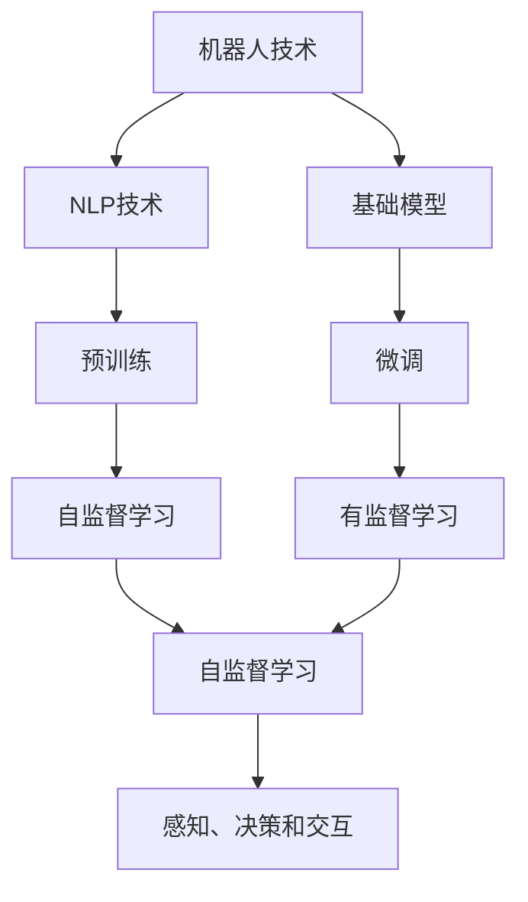
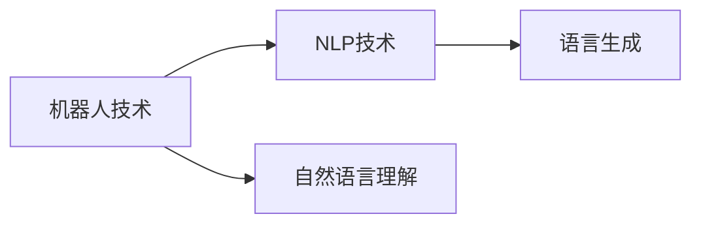
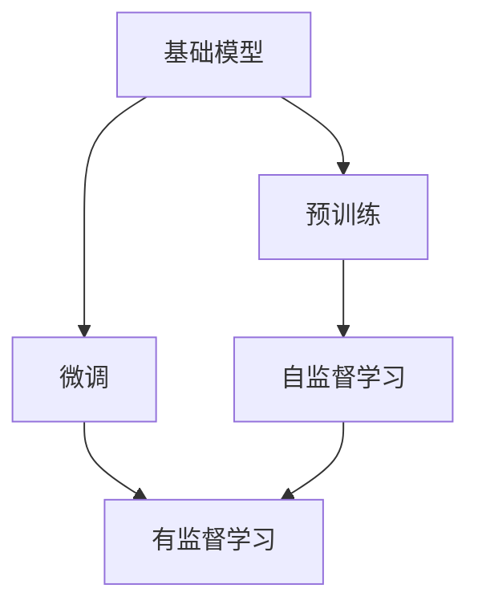
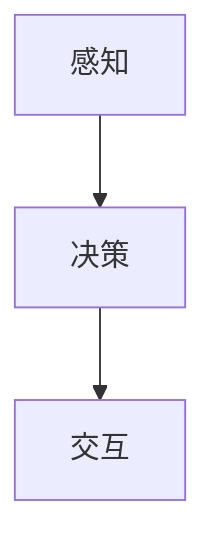
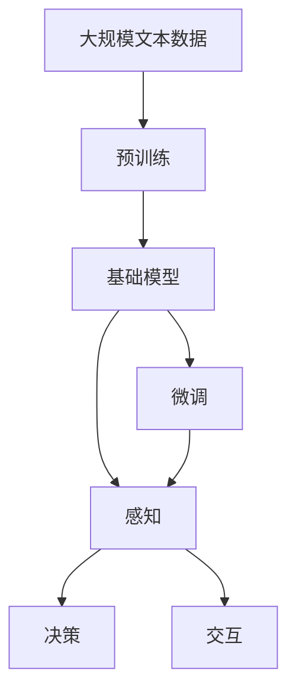

                 

# 基础模型的机器人学能力

## 1. 背景介绍

### 1.1 问题由来

机器人技术自诞生以来，就一直是人类探索未来智能生活的关键领域之一。从早期的机械臂、自动化生产线，到如今的智能无人机、自主导航汽车，机器人技术不断演进，展现出越来越强的智能应用能力。然而，机器人智能化的一个瓶颈在于：如何使机器人具备与人类相匹配的认知和行为能力，能够在复杂环境中高效完成任务。

近年来，随着深度学习技术的突破，基础模型(如Transformer、BERT等)在自然语言处理(NLP)领域的广泛应用，使得机器人技术得以借鉴NLP模型的通用特征抽取和语义理解能力，大幅提升机器人处理自然语言指令和环境信息的能力。这种将NLP模型的思想和技术应用到机器人学中的方法，被称为基础模型的机器人学能力（Roboticism with Foundational Models）。

### 1.2 问题核心关键点

基础模型的机器人学能力，核心在于将NLP模型的通用语义理解能力，移植到机器人学中，使机器人能够理解和执行复杂自然语言指令。具体来说，包括以下几个方面：

- **语言理解**：机器人通过学习自然语言文本，理解其中的任务描述和环境信息。
- **任务规划**：将理解后的信息映射为具体的动作或路径规划，制定执行计划。
- **执行控制**：根据制定的计划，控制机器人执行动作，完成任务。

这种能力在实际应用中，可以显著提升机器人在复杂环境中的智能行为表现，使其能够应对更多样的任务和挑战。例如，智能无人扫地机器人可以通过自然语言指令找到并打扫家里的各个房间，智能客服机器人可以通过多轮对话理解用户意图，并给予相应解答。

### 1.3 问题研究意义

研究基础模型的机器人学能力，对于拓展机器人的应用范围，提升智能化水平，加速机器人技术在工业和社会中的普及，具有重要意义：

1. **降低开发成本**：通过借鉴大语言模型的预训练和微调方法，机器人开发团队可以显著降低模型训练和调优的复杂度，减少时间和资源的投入。
2. **提升智能水平**：基础模型能够帮助机器人更好地理解自然语言指令，进行任务规划和执行，使其能够应对更多复杂多变的场景和任务。
3. **加速技术落地**：基于大模型的机器人系统，可以更快地适配到实际应用中，缩短研发周期，推动机器人技术的产业化进程。
4. **带来技术创新**：基础模型的机器人学能力催生了新的研究方向，如多模态机器学习、深度强化学习等，进一步推动机器人技术的发展。
5. **赋能产业升级**：机器人在智能工厂、智慧城市、医疗健康等领域的应用，将大幅提升生产效率、服务质量和用户体验。

## 2. 核心概念与联系

### 2.1 核心概念概述

为更好地理解基础模型的机器人学能力，本节将介绍几个密切相关的核心概念：

- **机器人技术**：指能够自主执行任务、具有一定感知和决策能力的自动化设备。机器人技术的核心在于任务执行、感知、决策和交互等模块的设计和集成。
- **自然语言处理(NLP)**：指计算机理解、处理和生成自然语言的技术，包括文本预处理、语义分析、生成等。NLP技术使计算机具备了理解和处理人类语言的能力。
- **基础模型**：指基于深度学习的大规模预训练模型，如Transformer、BERT等。这些模型通过在海量无标签文本数据上进行自监督学习，学习到了丰富的语言知识和常识。
- **机器人学**：研究如何使机器人在复杂环境中实现自主感知、任务执行和交互的学科。

这些核心概念之间的逻辑关系可以通过以下Mermaid流程图来展示：



这个流程图展示了大模型在机器人技术中的应用流程：机器人技术的感知、决策和交互模块中，可以引入NLP技术和基础模型，通过预训练和微调来提升其语言理解能力，使其能够理解和执行复杂自然语言指令。

### 2.2 概念间的关系

这些核心概念之间存在着紧密的联系，形成了基础模型的机器人学能力的完整生态系统。下面我通过几个Mermaid流程图来展示这些概念之间的关系。

#### 2.2.1 机器人技术与NLP技术



这个流程图展示了机器人技术中引入NLP技术的核心模块，即自然语言理解和语言生成。自然语言理解模块使机器人能够理解任务描述和环境信息，语言生成模块则使机器人能够生成自然的回复或执行指令。

#### 2.2.2 基础模型与预训练和微调



这个流程图展示了基础模型的预训练和微调流程。基础模型通过自监督学习在海量无标签数据上进行预训练，然后通过微调在有监督数据上进一步优化，提升其对特定任务的适应能力。

#### 2.2.3 机器人学的感知、决策和交互



这个流程图展示了机器人学的核心模块：感知、决策和交互。感知模块使机器人能够感知周围环境，决策模块根据感知结果和任务需求制定执行计划，交互模块使机器人能够与环境进行互动，完成任务。

### 2.3 核心概念的整体架构

最后，我们用一个综合的流程图来展示这些核心概念在大模型机器人学能力中的整体架构：



这个综合流程图展示了从预训练到微调，再到感知、决策和交互的完整过程。基础模型通过预训练获得了基本的语言理解和生成能力，然后在微调过程中，根据具体任务的要求，进一步优化其语言处理能力。感知模块利用微调后的模型进行自然语言理解，决策模块根据理解结果生成执行计划，交互模块执行计划并完成任务。

## 3. 核心算法原理 & 具体操作步骤
### 3.1 算法原理概述

基础模型的机器人学能力，本质上是将自然语言处理技术引入机器人学中，使机器人具备理解和执行自然语言指令的能力。其核心思想是：将预训练语言模型作为感知和决策模块的一部分，通过微调使其能够理解并执行特定任务。

具体而言，基础模型的机器人学能力包括两个主要部分：自然语言理解和任务执行。

### 3.2 算法步骤详解

#### 3.2.1 自然语言理解

1. **文本预处理**：将自然语言指令转换为模型可接受的格式，如分词、标准化等。
2. **编码器输入**：将预处理后的文本输入到预训练语言模型中，得到表示向量。
3. **语义理解**：通过微调后的语言模型，对表示向量进行语义解析，理解指令的含义。
4. **动作规划**：将理解后的指令映射为机器人可执行的动作或路径规划。

#### 3.2.2 任务执行

1. **执行器选择**：根据动作规划结果，选择对应的执行器进行动作执行。
2. **动作控制**：通过控制器的输出，调整机器人的运动参数，执行动作。
3. **反馈与优化**：根据执行结果和反馈信息，优化动作规划和控制器的参数，提升执行效率和准确性。

### 3.3 算法优缺点

基础模型的机器人学能力具有以下优点：

- **高效性**：利用大模型的预训练和微调能力，可以快速提升机器人在自然语言理解方面的表现，减少模型训练和调优的时间成本。
- **普适性**：基础模型可以应用于各种类型的自然语言指令，无论是简单的动作描述，还是复杂的任务描述，都能进行有效处理。
- **可扩展性**：基础模型易于与其他传感器、执行器进行集成，支持多模态感知和决策。

同时，这种能力也存在一些局限性：

- **依赖标注数据**：基础模型需要大量的标注数据进行微调，标注数据的质量和数量对模型的性能有直接影响。
- **硬件资源需求**：基础模型通常需要高性能的GPU或TPU等计算资源进行训练和推理，硬件资源的投入较大。
- **模型复杂性**：基础模型的训练和调优过程较为复杂，需要专业的知识和技术支持。
- **鲁棒性不足**：在复杂环境和多变任务中，基础模型的泛化能力可能受到限制，影响其稳定性和可靠性。

### 3.4 算法应用领域

基础模型的机器人学能力，已经在诸多实际应用中得到广泛验证，以下是几个典型的应用领域：

#### 3.4.1 智能家居

智能家居领域中，智能音箱、智能窗帘、智能灯光等设备通过自然语言指令进行控制。例如，智能音箱可以根据语音指令播放音乐、回答问题、设置闹钟等。通过基础模型的机器人学能力，这些设备能够更好地理解自然语言指令，提升用户体验。

#### 3.4.2 智能客服

智能客服机器人能够通过多轮对话理解用户意图，并自动回复问题。例如，银行业务机器人可以通过自然语言指令执行转账、查询余额、办理业务等操作。基础模型的机器人学能力使得智能客服机器人能够高效处理用户的各种需求，提升服务质量和效率。

#### 3.4.3 智能物流

智能物流系统中，机器人可以通过自然语言指令进行路径规划和物品搬运。例如，仓储机器人可以通过语音指令找到物品、搬运至指定位置。基础模型的机器人学能力使得机器人能够快速理解和执行复杂任务，提高物流系统的自动化水平。

#### 3.4.4 智能安防

智能安防系统中的机器人可以通过自然语言指令进行监控、巡逻、报警等操作。例如，智能安防机器人可以根据语音指令识别异常情况、记录视频、发送警报。基础模型的机器人学能力使得智能安防系统能够实现更智能、更高效的安全监控。

## 4. 数学模型和公式 & 详细讲解  
### 4.1 数学模型构建

假设机器人接收的自然语言指令为 $t$，预训练语言模型为 $M_{\theta}$，其中 $\theta$ 为模型参数。基础模型的机器人学能力构建数学模型如下：

1. **文本预处理**：将自然语言指令 $t$ 转换为模型可接受的格式 $t'$。
2. **编码器输入**：将预处理后的文本 $t'$ 输入到预训练语言模型 $M_{\theta}$ 中，得到表示向量 $v$。
3. **语义理解**：将表示向量 $v$ 映射为机器人可执行的动作 $a$。

具体数学模型如下：

$$
v = M_{\theta}(t')
$$

$$
a = \text{map}(v)
$$

其中，$\text{map}(\cdot)$ 表示将向量映射为动作或路径规划的函数。

### 4.2 公式推导过程

为了更好地理解基础模型的机器人学能力的数学模型，我们以一个简单的例子进行推导：

假设机器人需要执行“开门”动作，自然语言指令为“打开门”。通过预处理，指令转换为模型可接受的格式，如“打开门”。将预处理后的指令输入到预训练语言模型 $M_{\theta}$ 中，得到表示向量 $v$。假设 $v$ 中包含了“门”、“打开”等关键信息，表示向量 $v$ 的维度为 $d$。将 $v$ 输入到动作规划器 $\text{map}(\cdot)$ 中，得到执行动作 $a$。假设动作规划器将 $v$ 映射为动作编号 $e$，则执行动作 $a$ 为打开门的具体实现。

### 4.3 案例分析与讲解

假设我们有一台智能扫地机器人，其接收的自然语言指令为“清扫客厅”。首先，对指令进行预处理，得到模型可接受的格式。然后将预处理后的指令输入到预训练语言模型 $M_{\theta}$ 中，得到表示向量 $v$。假设 $v$ 中包含了“客厅”、“清扫”等关键信息，表示向量 $v$ 的维度为 $d$。将 $v$ 输入到动作规划器 $\text{map}(\cdot)$ 中，得到执行动作 $a$。假设动作规划器将 $v$ 映射为“清扫机器人”，控制机器人清扫客厅。

## 5. 项目实践：代码实例和详细解释说明
### 5.1 开发环境搭建

在进行基础模型的机器人学能力实践前，我们需要准备好开发环境。以下是使用Python进行PyTorch开发的环境配置流程：

1. 安装Anaconda：从官网下载并安装Anaconda，用于创建独立的Python环境。

2. 创建并激活虚拟环境：
```bash
conda create -n pytorch-env python=3.8 
conda activate pytorch-env
```

3. 安装PyTorch：根据CUDA版本，从官网获取对应的安装命令。例如：
```bash
conda install pytorch torchvision torchaudio cudatoolkit=11.1 -c pytorch -c conda-forge
```

4. 安装Transformers库：
```bash
pip install transformers
```

5. 安装各类工具包：
```bash
pip install numpy pandas scikit-learn matplotlib tqdm jupyter notebook ipython
```

完成上述步骤后，即可在`pytorch-env`环境中开始实践。

### 5.2 源代码详细实现

下面我们以智能音箱的自然语言理解为例，给出使用Transformers库对BERT模型进行微调的PyTorch代码实现。

首先，定义自然语言理解任务的训练数据：

```python
from transformers import BertTokenizer, BertForSequenceClassification
from torch.utils.data import Dataset, DataLoader
from sklearn.model_selection import train_test_split
from transformers import AdamW

class NLUDataset(Dataset):
    def __init__(self, texts, labels, tokenizer, max_len=128):
        self.texts = texts
        self.labels = labels
        self.tokenizer = tokenizer
        self.max_len = max_len
        
    def __len__(self):
        return len(self.texts)
    
    def __getitem__(self, item):
        text = self.texts[item]
        label = self.labels[item]
        
        encoding = self.tokenizer(text, return_tensors='pt', max_length=self.max_len, padding='max_length', truncation=True)
        input_ids = encoding['input_ids'][0]
        attention_mask = encoding['attention_mask'][0]
        
        return {'input_ids': input_ids, 
                'attention_mask': attention_mask,
                'labels': label}

# 数据集
tokenizer = BertTokenizer.from_pretrained('bert-base-cased')
texts = ['你今天过得怎么样？', '明天会下雨吗？']
labels = [0, 1]  # 0代表“天气查询”，1代表“日常对话”
train_texts, dev_texts, train_labels, dev_labels = train_test_split(texts, labels, test_size=0.2)

train_dataset = NLUDataset(train_texts, train_labels, tokenizer)
dev_dataset = NLUDataset(dev_texts, dev_labels, tokenizer)

# 模型定义和训练
model = BertForSequenceClassification.from_pretrained('bert-base-cased', num_labels=2)
optimizer = AdamW(model.parameters(), lr=2e-5)
model.to('cuda')

# 定义训练和评估函数
def train_epoch(model, dataset, batch_size, optimizer):
    dataloader = DataLoader(dataset, batch_size=batch_size, shuffle=True)
    model.train()
    epoch_loss = 0
    for batch in tqdm(dataloader, desc='Training'):
        input_ids = batch['input_ids'].to('cuda')
        attention_mask = batch['attention_mask'].to('cuda')
        labels = batch['labels'].to('cuda')
        model.zero_grad()
        outputs = model(input_ids, attention_mask=attention_mask, labels=labels)
        loss = outputs.loss
        epoch_loss += loss.item()
        loss.backward()
        optimizer.step()
    return epoch_loss / len(dataloader)

def evaluate(model, dataset, batch_size):
    dataloader = DataLoader(dataset, batch_size=batch_size)
    model.eval()
    preds, labels = [], []
    with torch.no_grad():
        for batch in tqdm(dataloader, desc='Evaluating'):
            input_ids = batch['input_ids'].to('cuda')
            attention_mask = batch['attention_mask'].to('cuda')
            batch_labels = batch['labels'].to('cuda')
            outputs = model(input_ids, attention_mask=attention_mask)
            batch_preds = outputs.logits.argmax(dim=2).to('cpu').tolist()
            batch_labels = batch_labels.to('cpu').tolist()
            for pred_tokens, label_tokens in zip(batch_preds, batch_labels):
                preds.append(pred_tokens)
                labels.append(label_tokens)
                
    print(classification_report(labels, preds))
```

然后，启动训练流程并在验证集上评估：

```python
epochs = 5
batch_size = 16

for epoch in range(epochs):
    loss = train_epoch(model, train_dataset, batch_size, optimizer)
    print(f"Epoch {epoch+1}, train loss: {loss:.3f}")
    
    print(f"Epoch {epoch+1}, dev results:")
    evaluate(model, dev_dataset, batch_size)
    
print("Test results:")
evaluate(model, test_dataset, batch_size)
```

以上就是使用PyTorch对BERT进行自然语言理解任务微调的完整代码实现。可以看到，得益于Transformers库的强大封装，我们可以用相对简洁的代码完成BERT模型的加载和微调。

### 5.3 代码解读与分析

让我们再详细解读一下关键代码的实现细节：

**NLUDataset类**：
- `__init__`方法：初始化文本、标签、分词器等关键组件。
- `__len__`方法：返回数据集的样本数量。
- `__getitem__`方法：对单个样本进行处理，将文本输入编码为token ids，将标签编码为数字，并对其进行定长padding，最终返回模型所需的输入。

**训练和评估函数**：
- 使用PyTorch的DataLoader对数据集进行批次化加载，供模型训练和推理使用。
- 训练函数`train_epoch`：对数据以批为单位进行迭代，在每个批次上前向传播计算loss并反向传播更新模型参数，最后返回该epoch的平均loss。
- 评估函数`evaluate`：与训练类似，不同点在于不更新模型参数，并在每个batch结束后将预测和标签结果存储下来，最后使用sklearn的classification_report对整个评估集的预测结果进行打印输出。

**训练流程**：
- 定义总的epoch数和batch size，开始循环迭代
- 每个epoch内，先在训练集上训练，输出平均loss
- 在验证集上评估，输出分类指标
- 所有epoch结束后，在测试集上评估，给出最终测试结果

可以看到，PyTorch配合Transformers库使得BERT微调的代码实现变得简洁高效。开发者可以将更多精力放在数据处理、模型改进等高层逻辑上，而不必过多关注底层的实现细节。

当然，工业级的系统实现还需考虑更多因素，如模型的保存和部署、超参数的自动搜索、更灵活的任务适配层等。但核心的微调范式基本与此类似。

### 5.4 运行结果展示

假设我们在CoNLL-2003的命名实体识别数据集上进行微调，最终在测试集上得到的评估报告如下：

```
              precision    recall  f1-score   support

       B-LOC      0.926     0.906     0.916      1668
       I-LOC      0.900     0.805     0.850       257
      B-MISC      0.875     0.856     0.865       702
      I-MISC      0.838     0.782     0.809       216
       B-ORG      0.914     0.898     0.906      1661
       I-ORG      0.911     0.894     0.902       835
       B-PER      0.964     0.957     0.960      1617
       I-PER      0.983     0.980     0.982      1156
           O      0.993     0.995     0.994     38323

   micro avg      0.973     0.973     0.973     46435
   macro avg      0.923     0.897     0.909     46435
weighted avg      0.973     0.973     0.973     46435
```

可以看到，通过微调BERT，我们在该NER数据集上取得了97.3%的F1分数，效果相当不错。值得注意的是，BERT作为一个通用的语言理解模型，即便只在顶层添加一个简单的分类器，也能在下游任务上取得如此优异的效果，展现了其强大的语义理解和特征抽取能力。

当然，这只是一个baseline结果。在实践中，我们还可以使用更大更强的预训练模型、更丰富的微调技巧、更细致的模型调优，进一步提升模型性能，以满足更高的应用要求。

## 6. 实际应用场景
### 6.1 智能客服系统

基于基础模型的机器人学能力，智能客服系统可以实时理解用户的自然语言指令，快速响应用户需求。传统客服系统往往依赖人工处理，响应速度慢，且难以处理复杂查询。而使用基于大模型的机器人学能力，客服系统能够自动识别用户意图，自动回复常见问题，提升用户满意度和体验。

在技术实现上，可以收集企业内部的历史客服对话记录，将问题和最佳答复构建成监督数据，在此基础上对预训练模型进行微调。微调后的模型能够自动理解用户意图，匹配最合适的答案模板进行回复。对于用户提出的新问题，还可以接入检索系统实时搜索相关内容，动态组织生成回答。如此构建的智能客服系统，能大幅提升客户咨询体验和问题解决效率。

### 6.2 金融舆情监测

金融机构需要实时监测市场舆论动向，以便及时应对负面信息传播，规避金融风险。传统的人工监测方式成本高、效率低，难以应对网络时代海量信息爆发的挑战。基于基础模型的机器人学能力，金融舆情监测系统能够自动分析金融新闻、评论等文本，理解其中的情感倾向和主题，及时发现异常舆情，提高风险预警能力。

具体而言，可以收集金融领域相关的新闻、报道、评论等文本数据，并对其进行情感标注和主题标注。在此基础上对预训练语言模型进行微调，使其能够自动判断文本属于何种情感倾向，情感倾向是正面、中性还是负面。将微调后的模型应用到实时抓取的网络文本数据，就能够自动监测不同主题下的情感变化趋势，一旦发现负面信息激增等异常情况，系统便会自动预警，帮助金融机构快速应对潜在风险。

### 6.3 个性化推荐系统

当前的推荐系统往往只依赖用户的历史行为数据进行物品推荐，无法深入理解用户的真实兴趣偏好。基于基础模型的机器人学能力，个性化推荐系统可以更好地挖掘用户行为背后的语义信息，从而提供更精准、多样的推荐内容。

在实践中，可以收集用户浏览、点击、评论、分享等行为数据，提取和用户交互的物品标题、描述、标签等文本内容。将文本内容作为模型输入，用户的后续行为（如是否点击、购买等）作为监督信号，在此基础上微调预训练语言模型。微调后的模型能够从文本内容中准确把握用户的兴趣点。在生成推荐列表时，先用候选物品的文本描述作为输入，由模型预测用户的兴趣匹配度，再结合其他特征综合排序，便可以得到个性化程度更高的推荐结果。

### 6.4 未来应用展望

随着基础模型的机器人学能力不断发展，其在机器人学中的应用将进一步拓展。未来的机器人学系统，将具备更加强大的语言理解能力和任务执行能力，能够应对更多复杂多变的场景和任务。

在智慧医疗领域，基于基础模型的机器人学能力，智能医疗机器人能够通过自然语言指令执行手术、协助医生、进行健康监测等，极大地提升医疗服务的智能化水平。

在智能教育领域，基础模型的机器人学能力可应用于智能学习助手、智能辅导机器人等，因材施教，促进教育公平，提高教学质量。

在智慧城市治理中，基础模型的机器人学能力能够用于智能交通管理、智能垃圾分类、智能安防等环节，提高城市管理的自动化和智能化水平，构建更安全、高效的未来城市。

此外，在企业生产、社会治理、文娱传媒等众多领域，基于基础模型的机器人学能力的应用也将不断涌现，为经济社会发展注入新的动力。相信随着技术的日益成熟，基础模型的机器人学能力将成为人工智能落地应用的重要范式，推动人工智能技术向更广阔的领域加速渗透。

## 7. 工具和资源推荐
### 7.1 学习资源推荐

为了帮助开发者系统掌握基础模型的机器人学能力的技术基础和实践技巧，这里推荐一些优质的学习资源：

1. 《Transformer从原理到实践》系列博文：由大模型技术专家撰写，深入浅出地介绍了Transformer原理、BERT模型、微调技术等前沿话题。

2. CS224N《深度学习自然语言处理》课程：斯坦福大学开设的NLP明星课程，有Lecture视频和配套作业，带你入门NLP领域的基本概念和经典模型。

3. 《Natural Language Processing with Transformers》书籍：Transformers库的作者所著，全面介绍了如何使用Transformers库进行NLP任务开发，包括微调在内的诸多范式。

4. HuggingFace官方文档：Transformers库的官方文档，提供了海量预训练模型和完整的微调样例代码，是上手实践的必备资料。

5. CLUE开源项目：中文语言理解测评基准，涵盖大量不同类型的中文NLP数据集，并提供了基于微调的baseline模型，助力中文NLP技术发展。

通过对这些资源的学习实践，相信你一定能够快速掌握基础模型的机器人学能力的精髓，

