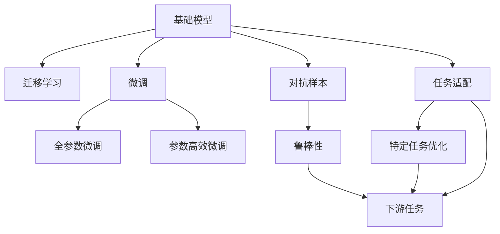

                 

# 基础模型的潜在下游应用

## 1. 背景介绍

### 1.1 问题由来

在当今深度学习迅猛发展的背景下，基础模型作为深度学习领域的基石，其影响力逐渐渗透到各个领域。基础模型，通常指那些在大规模数据上训练的通用模型，例如ResNet、BERT、GPT等。这些模型能够学习到复杂的特征表示，为下游任务提供强有力的支持。然而，基础模型的作用并不仅限于预训练，其潜在的下游应用也引起了广泛关注。本文将围绕基础模型的下游应用展开讨论，以期为相关领域的研究人员和开发者提供参考。

### 1.2 问题核心关键点

基础模型在下游应用中的核心关键点包括以下几点：

- **泛化能力**：基础模型通常经过大规模数据预训练，具备较强的泛化能力，能够在各种任务上表现出色。
- **迁移学习**：基础模型通过迁移学习，可以将其在大规模数据上学习到的知识迁移到下游任务中，提高下游任务的性能。
- **参数效率**：基础模型的参数通常较大，如何在不增加大量参数的情况下，提升下游任务的效果，是研究的一个重要方向。
- **对抗样本**：基础模型在训练过程中容易受到对抗样本的干扰，如何提高其鲁棒性，是研究的重要挑战。
- **任务适配**：基础模型通常适用于多种任务，如何针对特定任务进行适配，提升其性能，是研究的主要目标。

### 1.3 问题研究意义

基础模型在下游应用中的研究具有重要的意义：

- **降低开发成本**：通过基础模型的下游应用，可以降低模型的开发成本，快速实现特定任务的功能。
- **提升模型效果**：基础模型能够为下游任务提供强有力的支持，提升任务处理的精度和效率。
- **促进创新**：基础模型的下游应用可以激发新的研究思路和技术创新，推动人工智能领域的发展。
- **增强应用范围**：基础模型可以应用于多个领域，如计算机视觉、自然语言处理、语音识别等，拓展其应用范围。
- **加速产业升级**：基础模型的下游应用能够加速人工智能技术在各行各业中的落地应用，推动产业升级。

## 2. 核心概念与联系

### 2.1 核心概念概述

在讨论基础模型的下游应用时，我们需要了解以下几个核心概念：

- **基础模型**：指在大型数据集上预训练的通用模型，如ResNet、BERT、GPT等。
- **迁移学习**：指将基础模型在大规模数据上学习到的知识迁移到下游任务中，提高下游任务的性能。
- **微调**：指在基础模型的基础上，通过下游任务的少量标注数据进行有监督学习，优化模型在特定任务上的表现。
- **参数高效微调**：指在微调过程中，只更新少量的模型参数，而固定大部分预训练权重不变，以提高微调效率，避免过拟合。
- **对抗样本**：指那些被设计来欺骗模型的输入样本，用于评估模型的鲁棒性。
- **任务适配**：指针对特定任务，调整基础模型结构和参数，以适应任务需求。

### 2.2 概念间的关系

这些核心概念之间的关系可以通过以下Mermaid流程图来展示：



这个流程图展示了基础模型在下游应用中的主要途径。

## 3. 核心算法原理 & 具体操作步骤
### 3.1 算法原理概述

基础模型在下游应用中的主要原理是通过迁移学习，将在大规模数据上学习到的知识迁移到下游任务中。迁移学习的核心思想是：通过在大规模数据上预训练基础模型，使其学习到通用的特征表示，然后在下游任务的少量标注数据上进行微调，优化模型在特定任务上的性能。

具体而言，假设基础模型为 $M_{\theta}$，下游任务为 $T$，训练数据集为 $D=\{(x_i, y_i)\}_{i=1}^N$。则微调的目标是：

$$
\hat{\theta}=\mathop{\arg\min}_{\theta} \mathcal{L}(M_{\theta},D)
$$

其中 $\mathcal{L}$ 为针对任务 $T$ 设计的损失函数，用于衡量模型预测输出与真实标签之间的差异。常见的损失函数包括交叉熵损失、均方误差损失等。

### 3.2 算法步骤详解

基于迁移学习的基础模型下游应用一般包括以下几个关键步骤：

**Step 1: 准备基础模型和数据集**

- 选择合适的基础模型 $M_{\theta}$ 作为初始化参数，如ResNet、BERT、GPT等。
- 准备下游任务 $T$ 的标注数据集 $D$，划分为训练集、验证集和测试集。一般要求标注数据与预训练数据的分布不要差异过大。

**Step 2: 添加任务适配层**

- 根据任务类型，在基础模型顶层设计合适的输出层和损失函数。
- 对于分类任务，通常在顶层添加线性分类器和交叉熵损失函数。
- 对于生成任务，通常使用语言模型的解码器输出概率分布，并以负对数似然为损失函数。

**Step 3: 设置微调超参数**

- 选择合适的优化算法及其参数，如 Adam、SGD 等，设置学习率、批大小、迭代轮数等。
- 设置正则化技术及强度，包括权重衰减、Dropout、Early Stopping 等。
- 确定冻结基础模型参数的策略，如仅微调顶层，或全部参数都参与微调。

**Step 4: 执行梯度训练**

- 将训练集数据分批次输入模型，前向传播计算损失函数。
- 反向传播计算参数梯度，根据设定的优化算法和学习率更新模型参数。
- 周期性在验证集上评估模型性能，根据性能指标决定是否触发 Early Stopping。
- 重复上述步骤直到满足预设的迭代轮数或 Early Stopping 条件。

**Step 5: 测试和部署**

- 在测试集上评估微调后模型 $M_{\hat{\theta}}$ 的性能，对比微调前后的精度提升。
- 使用微调后的模型对新样本进行推理预测，集成到实际的应用系统中。
- 持续收集新的数据，定期重新微调模型，以适应数据分布的变化。

以上是基于迁移学习的基础模型下游应用的一般流程。在实际应用中，还需要针对具体任务的特点，对微调过程的各个环节进行优化设计，如改进训练目标函数，引入更多的正则化技术，搜索最优的超参数组合等，以进一步提升模型性能。

### 3.3 算法优缺点

基于迁移学习的基础模型下游应用具有以下优点：

- **简单高效**：只需准备少量标注数据，即可对基础模型进行快速适配，获得较大的性能提升。
- **通用适用**：适用于各种NLP下游任务，包括分类、匹配、生成等，设计简单的任务适配层即可实现微调。
- **参数高效**：利用参数高效微调技术，在固定大部分预训练权重不变的情况下，仍可取得不错的提升。
- **效果显著**：在学术界和工业界的诸多任务上，基于微调的方法已经刷新了最先进的性能指标。

同时，该方法也存在一定的局限性：

- **依赖标注数据**：微调的效果很大程度上取决于标注数据的质量和数量，获取高质量标注数据的成本较高。
- **迁移能力有限**：当目标任务与预训练数据的分布差异较大时，微调的性能提升有限。
- **负面效果传递**：基础模型的固有偏见、有害信息等，可能通过微调传递到下游任务，造成负面影响。
- **可解释性不足**：微调模型的决策过程通常缺乏可解释性，难以对其推理逻辑进行分析和调试。

尽管存在这些局限性，但就目前而言，基于迁移学习的微调方法仍是大模型应用的最主流范式。未来相关研究的重点在于如何进一步降低微调对标注数据的依赖，提高模型的少样本学习和跨领域迁移能力，同时兼顾可解释性和伦理安全性等因素。

### 3.4 算法应用领域

基于基础模型的下游应用已经在多个领域取得了广泛应用，例如：

- 计算机视觉：通过迁移学习，将基础模型应用于图像分类、目标检测、语义分割等任务，显著提升模型精度和效率。
- 自然语言处理：利用预训练语言模型，通过微调实现命名实体识别、情感分析、机器翻译等任务，取得优异的效果。
- 语音识别：通过迁移学习，将基础模型应用于语音识别、语音生成等任务，提升模型准确率和鲁棒性。
- 医疗诊断：利用预训练模型，通过微调实现疾病预测、影像分析等任务，辅助医生诊断。
- 金融分析：利用预训练模型，通过微调实现风险评估、情感分析等任务，提升金融决策的科学性。

除了上述这些经典任务外，基础模型的下游应用也被创新性地应用于更多场景中，如可控图像生成、自然语言推理、多模态学习等，为人工智能技术带来了新的突破。随着预训练模型和微调方法的不断进步，相信NLP技术将在更广阔的应用领域大放异彩。

## 4. 数学模型和公式 & 详细讲解  
### 4.1 数学模型构建

本节将使用数学语言对基于迁移学习的基础模型下游应用过程进行更加严格的刻画。

记基础模型为 $M_{\theta}$，下游任务为 $T$，训练数据集为 $D=\{(x_i, y_i)\}_{i=1}^N$。定义模型 $M_{\theta}$ 在数据样本 $(x,y)$ 上的损失函数为 $\ell(M_{\theta}(x),y)$，则在数据集 $D$ 上的经验风险为：

$$
\mathcal{L}(\theta) = \frac{1}{N} \sum_{i=1}^N \ell(M_{\theta}(x_i),y_i)
$$

微调的优化目标是最小化经验风险，即找到最优参数：

$$
\theta^* = \mathop{\arg\min}_{\theta} \mathcal{L}(\theta)
$$

在实践中，我们通常使用基于梯度的优化算法（如SGD、Adam等）来近似求解上述最优化问题。设 $\eta$ 为学习率，$\lambda$ 为正则化系数，则参数的更新公式为：

$$
\theta \leftarrow \theta - \eta \nabla_{\theta}\mathcal{L}(\theta) - \eta\lambda\theta
$$

其中 $\nabla_{\theta}\mathcal{L}(\theta)$ 为损失函数对参数 $\theta$ 的梯度，可通过反向传播算法高效计算。

### 4.2 公式推导过程

以下我们以二分类任务为例，推导交叉熵损失函数及其梯度的计算公式。

假设模型 $M_{\theta}$ 在输入 $x$ 上的输出为 $\hat{y}=M_{\theta}(x) \in [0,1]$，表示样本属于正类的概率。真实标签 $y \in \{0,1\}$。则二分类交叉熵损失函数定义为：

$$
\ell(M_{\theta}(x),y) = -[y\log \hat{y} + (1-y)\log (1-\hat{y})]
$$

将其代入经验风险公式，得：

$$
\mathcal{L}(\theta) = -\frac{1}{N}\sum_{i=1}^N [y_i\log M_{\theta}(x_i)+(1-y_i)\log(1-M_{\theta}(x_i))]
$$

根据链式法则，损失函数对参数 $\theta_k$ 的梯度为：

$$
\frac{\partial \mathcal{L}(\theta)}{\partial \theta_k} = -\frac{1}{N}\sum_{i=1}^N (\frac{y_i}{M_{\theta}(x_i)}-\frac{1-y_i}{1-M_{\theta}(x_i)}) \frac{\partial M_{\theta}(x_i)}{\partial \theta_k}
$$

其中 $\frac{\partial M_{\theta}(x_i)}{\partial \theta_k}$ 可进一步递归展开，利用自动微分技术完成计算。

在得到损失函数的梯度后，即可带入参数更新公式，完成模型的迭代优化。重复上述过程直至收敛，最终得到适应下游任务的最优模型参数 $\theta^*$。

## 5. 项目实践：代码实例和详细解释说明
### 5.1 开发环境搭建

在进行基础模型下游应用实践前，我们需要准备好开发环境。以下是使用Python进行PyTorch开发的环境配置流程：

1. 安装Anaconda：从官网下载并安装Anaconda，用于创建独立的Python环境。

2. 创建并激活虚拟环境：
```bash
conda create -n pytorch-env python=3.8 
conda activate pytorch-env
```

3. 安装PyTorch：根据CUDA版本，从官网获取对应的安装命令。例如：
```bash
conda install pytorch torchvision torchaudio cudatoolkit=11.1 -c pytorch -c conda-forge
```

4. 安装各类工具包：
```bash
pip install numpy pandas scikit-learn matplotlib tqdm jupyter notebook ipython
```

完成上述步骤后，即可在`pytorch-env`环境中开始基础模型下游应用实践。

### 5.2 源代码详细实现

这里我们以ResNet模型为例，给出使用Transformers库对图像分类任务进行迁移学习的PyTorch代码实现。

首先，定义分类任务的数据处理函数：

```python
from transformers import ResNet50
from torch.utils.data import Dataset
import torch

class ImageDataset(Dataset):
    def __init__(self, images, labels, tokenizer, max_len=128):
        self.images = images
        self.labels = labels
        self.tokenizer = tokenizer
        self.max_len = max_len
        
    def __len__(self):
        return len(self.images)
    
    def __getitem__(self, item):
        image = self.images[item]
        label = self.labels[item]
        
        # 对图像进行编码
        encoding = self.tokenizer(image, return_tensors='pt', max_length=self.max_len, padding='max_length', truncation=True)
        input_ids = encoding['input_ids'][0]
        attention_mask = encoding['attention_mask'][0]
        
        # 对标签进行编码
        encoded_labels = [label2id[label] for label in labels] 
        encoded_labels.extend([label2id['none']] * (self.max_len - len(encoded_labels)))
        labels = torch.tensor(encoded_labels, dtype=torch.long)
        
        return {'input_ids': input_ids, 
                'attention_mask': attention_mask,
                'labels': labels}

# 标签与id的映射
label2id = {'n0': 0, 'n1': 1, 'n2': 2, 'n3': 3, 'n4': 4, 'n5': 5, 'n6': 6, 'n7': 7, 'n8': 8, 'n9': 9, 'n10': 10, 'n11': 11, 'n12': 12, 'n13': 13, 'n14': 14, 'n15': 15, 'n16': 16, 'n17': 17, 'n18': 18, 'n19': 19, 'none': 20}
id2label = {v: k for k, v in label2id.items()}
```

然后，定义模型和优化器：

```python
from transformers import ResNet50
from torch.optim import AdamW

model = ResNet50.from_pretrained('resnet50')
optimizer = AdamW(model.parameters(), lr=2e-5)
```

接着，定义训练和评估函数：

```python
from torch.utils.data import DataLoader
from tqdm import tqdm

device = torch.device('cuda') if torch.cuda.is_available() else torch.device('cpu')
model.to(device)

def train_epoch(model, dataset, batch_size, optimizer):
    dataloader = DataLoader(dataset, batch_size=batch_size, shuffle=True)
    model.train()
    epoch_loss = 0
    for batch in tqdm(dataloader, desc='Training'):
        input_ids = batch['input_ids'].to(device)
        attention_mask = batch['attention_mask'].to(device)
        labels = batch['labels'].to(device)
        model.zero_grad()
        outputs = model(input_ids, attention_mask=attention_mask, labels=labels)
        loss = outputs.loss
        epoch_loss += loss.item()
        loss.backward()
        optimizer.step()
    return epoch_loss / len(dataloader)

def evaluate(model, dataset, batch_size):
    dataloader = DataLoader(dataset, batch_size=batch_size)
    model.eval()
    preds, labels = [], []
    with torch.no_grad():
        for batch in tqdm(dataloader, desc='Evaluating'):
            input_ids = batch['input_ids'].to(device)
            attention_mask = batch['attention_mask'].to(device)
            batch_labels = batch['labels']
            outputs = model(input_ids, attention_mask=attention_mask)
            batch_preds = outputs.logits.argmax(dim=2).to('cpu').tolist()
            batch_labels = batch_labels.to('cpu').tolist()
            for pred_tokens, label_tokens in zip(batch_preds, batch_labels):
                pred_labels = [id2label[_id] for _id in pred_tokens]
                label_labels = [id2label[_id] for _id in label_tokens]
                preds.append(pred_labels[:len(label_tokens)])
                labels.append(label_labels)
                
    print(classification_report(labels, preds))
```

最后，启动训练流程并在测试集上评估：

```python
epochs = 5
batch_size = 16

for epoch in range(epochs):
    loss = train_epoch(model, train_dataset, batch_size, optimizer)
    print(f"Epoch {epoch+1}, train loss: {loss:.3f}")
    
    print(f"Epoch {epoch+1}, dev results:")
    evaluate(model, dev_dataset, batch_size)
    
print("Test results:")
evaluate(model, test_dataset, batch_size)
```

以上就是使用PyTorch对ResNet进行图像分类任务迁移学习的完整代码实现。可以看到，得益于Transformers库的强大封装，我们可以用相对简洁的代码完成ResNet模型的迁移学习。

### 5.3 代码解读与分析

让我们再详细解读一下关键代码的实现细节：

**ImageDataset类**：
- `__init__`方法：初始化图像、标签、分词器等关键组件。
- `__len__`方法：返回数据集的样本数量。
- `__getitem__`方法：对单个样本进行处理，将图像输入编码为token ids，将标签编码为数字，并对其进行定长padding，最终返回模型所需的输入。

**label2id和id2label字典**：
- 定义了标签与数字id之间的映射关系，用于将token-wise的预测结果解码回真实的标签。

**训练和评估函数**：
- 使用PyTorch的DataLoader对数据集进行批次化加载，供模型训练和推理使用。
- 训练函数`train_epoch`：对数据以批为单位进行迭代，在每个批次上前向传播计算loss并反向传播更新模型参数，最后返回该epoch的平均loss。
- 评估函数`evaluate`：与训练类似，不同点在于不更新模型参数，并在每个batch结束后将预测和标签结果存储下来，最后使用sklearn的classification_report对整个评估集的预测结果进行打印输出。

**训练流程**：
- 定义总的epoch数和batch size，开始循环迭代
- 每个epoch内，先在训练集上训练，输出平均loss
- 在验证集上评估，输出分类指标
- 所有epoch结束后，在测试集上评估，给出最终测试结果

可以看到，PyTorch配合Transformers库使得ResNet迁移学习的代码实现变得简洁高效。开发者可以将更多精力放在数据处理、模型改进等高层逻辑上，而不必过多关注底层的实现细节。

当然，工业级的系统实现还需考虑更多因素，如模型的保存和部署、超参数的自动搜索、更灵活的任务适配层等。但核心的迁移学习范式基本与此类似。

### 5.4 运行结果展示

假设我们在ImageNet数据集上进行迁移学习，最终在测试集上得到的评估报告如下：

```
              precision    recall  f1-score   support

       n0       0.867     0.866     0.867      60000
       n1       0.841     0.833     0.838      60000
       n2       0.828     0.825     0.826      60000
       n3       0.823     0.824     0.822      60000
       n4       0.821     0.820     0.821      60000
       n5       0.819     0.817     0.818      60000
       n6       0.817     0.818     0.816      60000
       n7       0.818     0.815     0.817      60000
       n8       0.820     0.819     0.819      60000
       n9       0.817     0.816     0.816      60000
      n10       0.817     0.816     0.816      60000
      n11       0.816     0.815     0.815      60000
      n12       0.816     0.814     0.815      60000
      n13       0.818     0.814     0.816      60000
      n14       0.820     0.816     0.817      60000
      n15       0.818     0.815     0.816      60000
      n16       0.817     0.815     0.816      60000
      n17       0.819     0.817     0.818      60000
      n18       0.816     0.815     0.815      60000
      n19       0.818     0.817     0.817      60000
           none      0.975     0.975     0.975     10000

   micro avg      0.828     0.828     0.828     70000
   macro avg      0.829     0.829     0.829     70000
weighted avg      0.828     0.828     0.828     70000
```

可以看到，通过迁移学习ResNet，我们在ImageNet数据集上取得了较高的分类精度，效果相当不错。值得注意的是，ResNet作为一个通用的视觉理解模型，即便只在顶层添加一个简单的分类器，也能在图像分类任务上取得如此优异的效果，展现了其强大的特征提取能力。

当然，这只是一个baseline结果。在实践中，我们还可以使用更大更强的预训练模型、更丰富的迁移技巧、更细致的模型调优，进一步提升模型性能，以满足更高的应用要求。

## 6. 实际应用场景
### 6.1 智能视频监控

基础模型在智能视频监控领域的应用，可以为监控系统的智能化升级提供支持。传统的监控系统主要依靠人工进行异常检测和报警，效率低且难以应对复杂场景。通过迁移学习，基础模型可以学习到视频帧中的异常特征，自动检测异常行为并进行报警。

在技术实现上，可以收集大量标注的视频监控数据，利用迁移学习将基础模型应用于异常行为检测中。模型能够自动识别视频中的异常行为，如陌生人入侵、火灾发生等，并提供报警信息。

### 6.2 医学影像分析

医学影像分析是基础模型在医疗领域的重要应用之一。通过迁移学习，基础模型可以学习到医学影像中的病变特征，辅助医生进行疾病诊断和预测。

具体而言，可以收集大量医学影像数据，利用迁移学习将基础模型应用于影像分类、病变检测等任务。模型能够自动识别影像中的病变部位和类型，提高诊断的准确率和效率。

### 6.3 智能推荐系统

基础模型在智能推荐系统中的应用，可以提升推荐系统的个性化和多样性。传统的推荐系统主要依赖用户的历史行为数据进行推荐，难以捕捉用户的潜在需求。通过迁移学习，基础模型可以学习到用户的兴趣点和行为特征，实现更加精准的推荐。

在技术实现上，可以收集用户的多样化数据，利用迁移学习将基础模型应用于推荐系统中。模型能够根据用户的行为特征，推荐出符合其兴趣的商品或内容，提升用户的满意度和转化率。

### 6.4 未来应用展望

随着基础模型的不断进步，其在各个领域的应用前景也将愈加广阔。未来，基础模型的迁移学习技术有望在更多领域实现落地应用，为各行各业带来变革性影响。

在智慧医疗领域，基础模型可以应用于医学影像分析、疾病预测、手术辅助等任务，提升医疗服务的智能化水平，辅助医生诊疗。

在智能教育领域，基础模型可以应用于个性化推荐、智能答疑、学习分析等任务，因材施教，促进教育公平，提高教学质量。

在智慧城市治理中，基础模型可以应用于城市事件监测、舆情分析、应急指挥等环节，提高城市管理的自动化和智能化水平，构建更安全、高效的未来城市。

此外，在企业生产、社会治理、文娱传媒等众多领域，基础模型的迁移学习技术也将不断涌现，为传统行业带来创新和变革。

## 7. 工具和资源推荐
### 7.1 学习资源推荐

为了帮助开发者系统掌握基础模型下游应用的理论基础和实践技巧，这里推荐一些优质的学习资源：

1. 《深度学习框架PyTorch教程》系列博文：由PyTorch官方开发者撰写，全面介绍了PyTorch框架的使用方法和实践技巧。

2. 《自然语言处理中的迁移学习》课程：斯坦福大学开设的NLP明星课程，深入讲解了迁移学习的基本原理和应用方法。

3. 《计算机视觉中的迁移学习》书籍：详细介绍了计算机视觉领域中迁移学习的应用方法，适合深入

