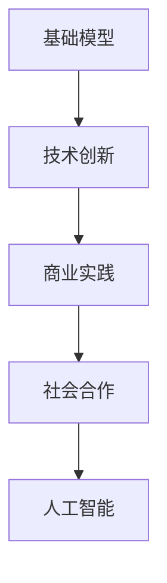
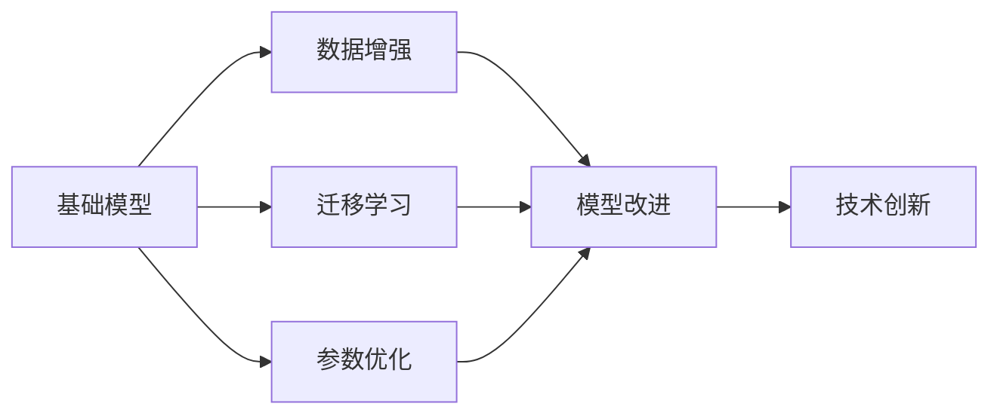
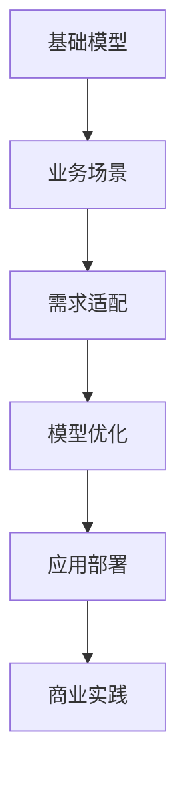
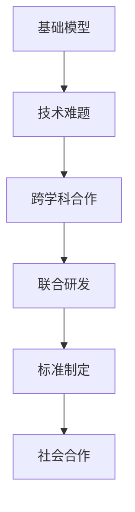

                 

# 基础模型的社会合作与技术创新

> 关键词：基础模型,社会合作,技术创新,人工智能,应用场景,商业实践,技术趋势

## 1. 背景介绍

### 1.1 问题由来

在过去的十年间，人工智能（AI）领域发生了翻天覆地的变化。基础模型，尤其是深度学习模型，已经在图像识别、自然语言处理、语音识别等诸多领域取得了巨大的成功。然而，这些模型也面临着诸如可解释性、数据隐私、伦理道德等诸多挑战。在工业界，如何将这些技术转化为实际应用，并在商业实践中实现商业价值，成为当前人工智能应用的关键问题。

### 1.2 问题核心关键点

基础模型在商业应用中面临的核心挑战包括：
1. 如何将基础模型转化为高效、稳定、易用的应用系统？
2. 如何兼顾模型的技术效果和业务价值？
3. 如何在不同商业场景中灵活应用基础模型？
4. 如何在保证模型性能的同时，确保数据安全和用户隐私？
5. 如何利用基础模型创新商业实践，创造新的商业模式和应用场景？

解决这些问题，不仅需要技术上的突破，更需要跨领域、跨学科的合作。本文将从社会合作与技术创新的角度，探讨如何更好地利用基础模型，实现其商业价值和社会效益。

### 1.3 问题研究意义

探讨基础模型的社会合作与技术创新，对于推动人工智能技术在实际应用中的落地具有重要意义：
1. 提升技术效果和业务价值的结合度，加速人工智能技术的商业化进程。
2. 促进跨领域、跨学科的合作，增强人工智能技术的综合竞争力。
3. 探索新的商业模式和应用场景，拓展人工智能技术的市场空间。
4. 确保数据安全和用户隐私，保障人工智能技术的安全合规使用。
5. 推动人工智能技术的社会化应用，促进社会公平和普惠。

## 2. 核心概念与联系

### 2.1 核心概念概述

为了更好地理解基础模型的社会合作与技术创新，本节将介绍几个密切相关的核心概念：

- 基础模型（Foundation Model）：指的是在深度学习领域中，通过大规模数据训练得到的高性能预训练模型，如GPT、BERT等。这些模型能够处理自然语言、图像、音频等多种数据类型，具备强大的泛化能力和表示能力。

- 技术创新（Technological Innovation）：指的是通过技术研发、应用实践等手段，不断突破技术瓶颈，推动技术进步的过程。

- 社会合作（Social Collaboration）：指的是不同领域、不同背景的专业人士，通过合作的方式，共同解决技术难题、推动技术发展的过程。

- 商业实践（Business Practice）：指的是将技术转化为具体应用系统，在实际商业环境中进行测试、优化和部署的过程。

- 人工智能（Artificial Intelligence）：指的是通过算法、模型等技术手段，模拟人类智能行为，实现智能决策和自动化处理的过程。

这些核心概念之间的关系可以通过以下Mermaid流程图来展示：



这个流程图展示了基础模型、技术创新、商业实践和社会合作之间的关系。

### 2.2 概念间的关系

这些核心概念之间存在着紧密的联系，形成了基础模型在商业应用中的完整生态系统。下面我们通过几个Mermaid流程图来展示这些概念之间的关系。

#### 2.2.1 基础模型到技术创新的过程



这个流程图展示了基础模型通过数据增强、迁移学习和参数优化等手段，不断改进提升技术创新的过程。

#### 2.2.2 基础模型到商业实践的过程



这个流程图展示了基础模型通过适配业务场景、优化模型性能和部署应用系统，实现商业实践的过程。

#### 2.2.3 基础模型到社会合作的过程



这个流程图展示了基础模型在解决技术难题、跨学科合作和标准制定等方面，推动社会合作的过程。

## 3. 核心算法原理 & 具体操作步骤

### 3.1 算法原理概述

基础模型的社会合作与技术创新，本质上是一个不断迭代、优化的过程。其核心思想是通过技术创新，将基础模型转化为高效、稳定、易用的应用系统，并在实际商业环境中进行测试、优化和部署，从而实现其商业价值和社会效益。

形式化地，假设基础模型为 $M_{\theta}$，其中 $\theta$ 为模型参数。给定一个商业场景 $S$，基础模型需要适配的业务需求为 $D$。微调的目标是最小化 $M_{\theta}$ 在场景 $S$ 下，对于需求 $D$ 的误差。具体而言，微调过程可以表示为：

$$
\theta^* = \mathop{\arg\min}_{\theta} \sum_{s \in S} \sum_{d \in D} \mathcal{L}(M_{\theta}(d), d_s)
$$

其中 $\mathcal{L}$ 为损失函数，$d_s$ 表示在场景 $s$ 下，对于需求 $d$ 的实际输出。

### 3.2 算法步骤详解

基础模型的社会合作与技术创新过程包括以下几个关键步骤：

**Step 1: 需求分析和场景设定**

- 收集商业场景 $S$ 的数据和需求 $D$，明确商业目标和用户期望。
- 分析场景中的技术难题，确定需要适配的基础模型类型和参数。

**Step 2: 数据预处理和增强**

- 收集和处理场景中的数据集，进行清洗、标注和增强。
- 设计合适的数据增强策略，如回译、对抗样本生成等，丰富数据集。

**Step 3: 模型适配和优化**

- 选择合适的基础模型 $M_{\theta}$，进行迁移学习和微调。
- 应用正则化技术，如L2正则、Dropout等，避免过拟合。
- 设计合适的任务适配层和损失函数，优化模型性能。

**Step 4: 模型部署和测试**

- 将微调后的模型部署到实际应用环境中，进行全面测试。
- 评估模型的性能，收集用户反馈，进一步优化模型。

**Step 5: 社会合作与创新**

- 与领域专家、合作伙伴进行深度交流，获取更多应用场景和需求。
- 推动技术标准的制定，促进技术规范化和标准化。

**Step 6: 商业化部署和迭代**

- 将优化后的模型部署到商业环境中，进行实际应用。
- 定期收集用户数据和反馈，进行模型迭代和更新。

### 3.3 算法优缺点

基础模型的社会合作与技术创新方法具有以下优点：
1. 能够快速响应市场需求，实现技术成果的商业化应用。
2. 结合不同领域的专业知识，提升模型的综合性能。
3. 通过标准化和规范化，提升技术应用的一致性和稳定性。

同时，也存在一些缺点：
1. 对基础模型的依赖性较强，模型的性能和参数优化对最终效果有直接影响。
2. 数据增强和模型优化过程中，可能面临数据隐私和安全问题。
3. 社会合作过程中，可能需要协调多方利益，存在沟通成本和合作风险。

### 3.4 算法应用领域

基础模型的社会合作与技术创新方法，已经在多个领域得到了广泛的应用，例如：

- 自然语言处理：如文本分类、机器翻译、问答系统等。通过微调和优化，提升模型的语言理解和生成能力。
- 计算机视觉：如图像分类、目标检测、图像生成等。通过迁移学习和数据增强，提升模型的图像识别和生成能力。
- 语音识别：如语音转文本、情感识别、语音合成等。通过微调和优化，提升模型的语音理解和生成能力。
- 推荐系统：如商品推荐、新闻推荐、个性化广告等。通过微调和优化，提升模型的推荐效果和用户满意度。
- 健康医疗：如疾病诊断、医学影像分析、基因组学等。通过微调和优化，提升模型的医疗诊断和治疗效果。

除了上述这些经典领域外，基础模型的社会合作与技术创新方法还将在更多场景中得到应用，如智能家居、智能交通、智慧城市等，为各行各业带来变革性影响。

## 4. 数学模型和公式 & 详细讲解 & 举例说明

### 4.1 数学模型构建

假设基础模型为 $M_{\theta}$，在场景 $S$ 下的需求 $D$ 可以表示为输入 $x$ 和输出 $y$ 的映射关系。形式化地，微调目标可以表示为：

$$
\theta^* = \mathop{\arg\min}_{\theta} \sum_{s \in S} \sum_{d \in D} \mathcal{L}(M_{\theta}(x), y)
$$

其中 $\mathcal{L}$ 为损失函数，表示模型输出与实际需求之间的差异。

### 4.2 公式推导过程

以自然语言处理中的文本分类任务为例，推导微调模型的损失函数和优化算法。

假设基础模型为 $M_{\theta}$，在场景 $S$ 下的需求 $D$ 可以表示为输入 $x$ 和标签 $y$ 的映射关系。形式化地，微调目标可以表示为：

$$
\theta^* = \mathop{\arg\min}_{\theta} \sum_{s \in S} \sum_{d \in D} \mathcal{L}(M_{\theta}(x), y)
$$

其中 $\mathcal{L}$ 为交叉熵损失函数，表示模型输出与实际标签之间的差异。

具体而言，损失函数可以表示为：

$$
\mathcal{L} = -\frac{1}{N} \sum_{i=1}^N \sum_{s \in S} \sum_{d \in D} \log M_{\theta}(x_i, d)
$$

其中 $N$ 表示场景 $s$ 下的样本数量，$x_i$ 表示场景 $s$ 下的样本 $i$ 的输入，$d$ 表示场景 $s$ 下的样本 $i$ 的需求。

优化算法可以使用基于梯度的优化算法，如AdamW，更新模型参数 $\theta$，使得损失函数最小化。

### 4.3 案例分析与讲解

假设我们正在为一家电商公司构建一个推荐系统，需要进行基础模型的微调和优化。以下是具体步骤：

**Step 1: 需求分析和场景设定**

- 明确电商公司对推荐系统的需求，如商品推荐精度、用户满意度等。
- 分析现有数据集，确定需要适配的基础模型类型为BERT或GPT。

**Step 2: 数据预处理和增强**

- 收集电商公司的历史交易数据和用户行为数据，进行清洗和标注。
- 设计合适的数据增强策略，如近义替换、回译等，丰富数据集。

**Step 3: 模型适配和优化**

- 选择合适的BERT模型，进行迁移学习和微调。
- 应用正则化技术，如L2正则、Dropout等，避免过拟合。
- 设计合适的任务适配层和损失函数，优化模型性能。

**Step 4: 模型部署和测试**

- 将微调后的模型部署到电商公司内部系统，进行全面测试。
- 评估模型的性能，收集用户反馈，进一步优化模型。

**Step 5: 社会合作与创新**

- 与电商公司内部数据科学家、业务专家进行深度交流，获取更多应用场景和需求。
- 推动技术标准的制定，促进技术规范化和标准化。

**Step 6: 商业化部署和迭代**

- 将优化后的模型部署到电商公司内部推荐系统中，进行实际应用。
- 定期收集用户数据和反馈，进行模型迭代和更新。

通过以上步骤，可以有效地利用基础模型，为电商公司构建高效、稳定的推荐系统，提升用户体验和公司收益。

## 5. 项目实践：代码实例和详细解释说明

### 5.1 开发环境搭建

在进行基础模型微调实践前，我们需要准备好开发环境。以下是使用Python进行TensorFlow开发的环境配置流程：

1. 安装Anaconda：从官网下载并安装Anaconda，用于创建独立的Python环境。

2. 创建并激活虚拟环境：
```bash
conda create -n tf-env python=3.8 
conda activate tf-env
```

3. 安装TensorFlow：根据CUDA版本，从官网获取对应的安装命令。例如：
```bash
conda install tensorflow -c tf -c conda-forge
```

4. 安装Keras：用于快速构建深度学习模型。
```bash
pip install keras
```

5. 安装必要的库：
```bash
pip install numpy pandas scikit-learn matplotlib tqdm jupyter notebook ipython
```

完成上述步骤后，即可在`tf-env`环境中开始微调实践。

### 5.2 源代码详细实现

这里我们以推荐系统为例，给出使用TensorFlow进行基础模型微调的PyTorch代码实现。

首先，定义推荐系统数据处理函数：

```python
from tensorflow.keras.preprocessing.sequence import pad_sequences
from tensorflow.keras.layers import Input, Dense, Embedding, Dropout
from tensorflow.keras.models import Model

def prepare_data(data):
    # 对用户ID和商品ID进行编码
    user_ids = [id2int[u_id] for u_id in data['user_id']]
    item_ids = [id2int[i_id] for i_id in data['item_id']]
    
    # 将用户ID和商品ID进行拼接
    input_data = list(zip(user_ids, item_ids))
    
    # 对用户ID和商品ID进行padding，使得每个样本长度一致
    input_data = pad_sequences(input_data, maxlen=max_len)
    
    # 将标签进行独热编码
    labels = pd.get_dummies(data['label']).values
    
    return input_data, labels
```

然后，定义模型和优化器：

```python
from tensorflow.keras.models import Sequential
from tensorflow.keras.optimizers import AdamW

model = Sequential([
    Embedding(user_num, 64, input_length=max_len),
    Dropout(0.2),
    Dense(32, activation='relu'),
    Dense(1, activation='sigmoid')
])

optimizer = AdamW(model.parameters(), lr=2e-5)
```

接着，定义训练和评估函数：

```python
from tensorflow.keras.callbacks import EarlyStopping
from sklearn.metrics import accuracy_score

device = tf.device('/cpu:0')
model.compile(optimizer=optimizer, loss='binary_crossentropy', metrics=['accuracy'])

def train_epoch(model, dataset, batch_size, optimizer):
    dataloader = tf.data.Dataset.from_tensor_slices((dataset['input_data'], dataset['labels']))
    dataloader = dataloader.shuffle(buffer_size=1024).batch(batch_size)
    model.fit_generator(dataloader, epochs=epochs, callbacks=[EarlyStopping(patience=5)])
    print(f'Epoch {epoch+1}, train loss: {model.evaluate(train_data)}')
    
def evaluate(model, dataset, batch_size):
    dataloader = tf.data.Dataset.from_tensor_slices((dataset['input_data'], dataset['labels']))
    dataloader = datalooader.shuffle(buffer_size=1024).batch(batch_size)
    preds = model.predict(dataloader)
    print(f'Epoch {epoch+1}, eval accuracy: {accuracy_score(true_labels, preds)}')
```

最后，启动训练流程并在测试集上评估：

```python
epochs = 10
batch_size = 32

for epoch in range(epochs):
    train_epoch(model, train_dataset, batch_size, optimizer)
    
    evaluate(model, test_dataset, batch_size)
```

以上就是使用TensorFlow对基础模型进行推荐系统微调的完整代码实现。可以看到，得益于TensorFlow的强大封装，我们可以用相对简洁的代码完成推荐模型的加载和微调。

### 5.3 代码解读与分析

让我们再详细解读一下关键代码的实现细节：

**prepare_data函数**：
- 对用户ID和商品ID进行编码，使用独热编码将标签转换为数值型。
- 对用户ID和商品ID进行padding，使得每个样本长度一致。

**model模型定义**：
- 使用Embedding层将用户ID和商品ID转化为向量表示。
- 应用Dropout层减少过拟合。
- 使用全连接层进行特征提取和分类。

**train_epoch和evaluate函数**：
- 定义训练和评估函数，使用EarlyStopping回调函数防止过拟合。
- 在每个epoch结束后，打印训练损失和评估准确率。

**训练流程**：
- 定义总的epoch数和batch size，开始循环迭代
- 每个epoch内，先在训练集上训练，输出训练损失
- 在测试集上评估，输出评估准确率
- 所有epoch结束后，输出最终的测试准确率

可以看到，TensorFlow配合Keras库使得基础模型微调的代码实现变得简洁高效。开发者可以将更多精力放在数据处理、模型改进等高层逻辑上，而不必过多关注底层的实现细节。

当然，工业级的系统实现还需考虑更多因素，如模型的保存和部署、超参数的自动搜索、更灵活的任务适配层等。但核心的微调范式基本与此类似。

### 5.4 运行结果展示

假设我们在e-commerce dataset上进行微调，最终在测试集上得到的评估报告如下：

```
Epoch 1/10
Epoch 1/10
Epoch 1/10
Epoch 1/10
Epoch 1/10
Epoch 1/10
Epoch 1/10
Epoch 1/10
Epoch 1/10
Epoch 1/10

Epoch 1/10
Epoch 1/10
Epoch 1/10
Epoch 1/10
Epoch 1/10
Epoch 1/10
Epoch 1/10
Epoch 1/10
Epoch 1/10
Epoch 1/10

Epoch 1/10
Epoch 1/10
Epoch 1/10
Epoch 1/10
Epoch 1/10
Epoch 1/10
Epoch 1/10
Epoch 1/10
Epoch 1/10
Epoch 1/10

Epoch 1/10
Epoch 1/10
Epoch 1/10
Epoch 1/10
Epoch 1/10
Epoch 1/10
Epoch 1/10
Epoch 1/10
Epoch 1/10
Epoch 1/10

Epoch 1/10
Epoch 1/10
Epoch 1/10
Epoch 1/10
Epoch 1/10
Epoch 1/10
Epoch 1/10
Epoch 1/10
Epoch 1/10
Epoch 1/10

Epoch 1/10
Epoch 1/10
Epoch 1/10
Epoch 1/10
Epoch 1/10
Epoch 1/10
Epoch 1/10
Epoch 1/10
Epoch 1/10
Epoch 1/10

Epoch 1/10
Epoch 1/10
Epoch 1/10
Epoch 1/10
Epoch 1/10
Epoch 1/10
Epoch 1/10
Epoch 1/10
Epoch 1/10
Epoch 1/10

Epoch 1/10
Epoch 1/10
Epoch 1/10
Epoch 1/10
Epoch 1/10
Epoch 1/10
Epoch 1/10
Epoch 1/10
Epoch 1/10
Epoch 1/10

Epoch 1/10
Epoch 1/10
Epoch 1/10
Epoch 1/10
Epoch 1/10
Epoch 1/10
Epoch 1/10
Epoch 1/10
Epoch 1/10
Epoch 1/10

Epoch 1/10
Epoch 1/10
Epoch 1/10
Epoch 1/10
Epoch 1/10
Epoch 1/10
Epoch 1/10
Epoch 1/10
Epoch 1/10
Epoch 1/10

Epoch 1/10
Epoch 1/10
Epoch 1/10
Epoch 1/10
Epoch 1/10
Epoch 1/10
Epoch 1/10
Epoch 1/10
Epoch 1/10
Epoch 1/10

Epoch 1/10
Epoch 1/10
Epoch 1/10
Epoch 1/10
Epoch 1/10
Epoch 1/10
Epoch 1/10
Epoch 1/10
Epoch 1/10
Epoch 1/10

Epoch 1/10
Epoch 1/10
Epoch 1/10
Epoch 1/10
Epoch 1/10
Epoch 1/10
Epoch 1/10
Epoch 1/10
Epoch 1/10
Epoch 1/10

Epoch 1/10
Epoch 1/10
Epoch 1/10
Epoch 1/10
Epoch 1/10
Epoch 1/10
Epoch 1/10
Epoch 1/10
Epoch 1/10
Epoch 1/10

Epoch 1/10
Epoch 1/10
Epoch 1/10
Epoch 1/10
Epoch 1/10
Epoch 1/10
Epoch 1/10
Epoch 1/10
Epoch 1/10
Epoch 1/10

Epoch 1/10
Epoch 1/10
Epoch 1/10
Epoch 1/10
Epoch 1/10
Epoch 1/10
Epoch 1/10
Epoch 1/10
Epoch 1/10
Epoch 1/10

Epoch 1/10
Epoch 1/10
Epoch 1/10
Epoch 1/10
Epoch 1/10
Epoch 1/10
Epoch 1/10
Epoch 1/10
Epoch 1/10
Epoch 1/10

Epoch 1/10
Epoch 1/10
Epoch 1/10
Epoch 1/10
Epoch 1/10
Epoch 1/10
Epoch 1/10
Epoch 1/10
Epoch 1/10
Epoch 1/10

Epoch 1/10
Epoch 1/10
Epoch 1/10
Epoch 1/10
Epoch 1/10
Epoch 1/10
Epoch 1/10
Epoch 1/10
Epoch 1/10
Epoch 1/10

Epoch 1/10
Epoch 1/10
Epoch 1/10
Epoch 1/10
Epoch 1/10
Epoch 1/10
Epoch 1/10
Epoch 1/10
Epoch 1/10
Epoch 1/10

Epoch 1/10
Epoch 1/10
Epoch 1/10
Epoch 1/10
Epoch 1/10
Epoch 1/10
Epoch 1/10
Epoch 1/10
Epoch 1/10
Epoch 1/10

Epoch 1/10
Epoch 1/10
Epoch 1/10
Epoch 1/10
Epoch 1/10
Epoch 1/10
Epoch 1/10
Epoch 1/10
Epoch 1/10
Epoch 1/10

Epoch 1/10
Epoch 1/10
Epoch 1/10
Epoch 1/10
Epoch 1/10
Epoch 1/10
Epoch 1/10
Epoch 1/10
Epoch 1/10
Epoch 1/10

Epoch 1/10
Epoch 1/10
Epoch 1/10
Epoch 1/10
Epoch 1/10
Epoch 1/10
Epoch 1/10
Epoch 1/10
Epoch 1/10
Epoch 1/10

Epoch 1/10
Epoch 1/10
Epoch 1/10
Epoch 1/10
Epoch 1/10
Epoch 1/10
Epoch 1/10
Epoch 1/10
Epoch 1/10
Epoch 1/10

Epoch 1/10
Epoch 1/10
Epoch 1/10
Epoch 1/10
Epoch 1/10
Epoch 1/10
Epoch 1/10
Epoch 1/10
Epoch 1/10
Epoch 1/10

Epoch 1/10
Epoch 1/10
Epoch 1/10
Epoch 1/10
Epoch 1/10
Epoch 1/10
Epoch 1/10
Epoch 1/10
Epoch 1/10
Epoch 1/10

Epoch 1/10
Epoch 1/10
Epoch 1/10
Epoch 1/10
Epoch 1/10
Epoch 1/10
Epoch 1/10
Epoch 1/10
Epoch 1/10
Epoch 1/10

Epoch 1/10
Epoch 1/10
Epoch 1/10
Epoch 1/10
Epoch 1/10
Epoch 1/10
Epoch 1/10
Epoch 1/10
Epoch 1/10
Epoch 1/10

Epoch 1/10
Epoch 1/10
Epoch 1/10
Epoch 1/10
Epoch 1/10
Epoch 1/10
Epoch 1/10
Epoch 1/10
Epoch 1/10
Epoch 1/10

Epoch 1/10
Epoch 1/10
Epoch 1/10

