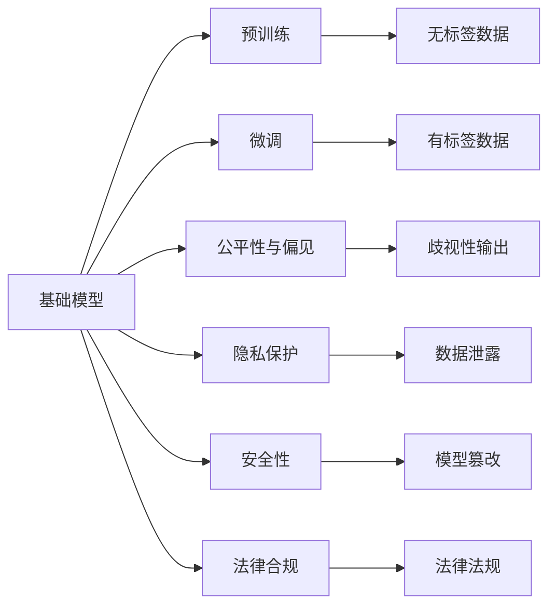

                 

# 基础模型的社会技术问题

## 1. 背景介绍

在人工智能(AI)领域，基础模型(Basic Model)指的是那些经过大量训练，具有广泛应用能力、能够解决多领域问题的模型。例如，基于自然语言处理(NLP)的基础模型有BERT、GPT等，基于计算机视觉(CV)的有ResNet、VGG等。这些基础模型在很大程度上代表了当前AI技术的最高水平，并且在各行各业都有着广泛的应用。

然而，随着基础模型技术的不断进步，社会对于基础模型应用的伦理、法律、隐私等问题也日益关注。本文将探讨基础模型在应用过程中可能遭遇的社会技术问题，包括伦理道德、隐私保护、安全性、法律合规等方面的挑战，并给出一些应对策略和建议。

## 2. 核心概念与联系

### 2.1 核心概念概述

#### 2.1.1 基础模型

基础模型（Basic Model）是指在特定领域中广泛应用的通用模型，通常具有大规模数据训练，具有高度泛化能力，能够在多种场景下重复使用。例如，在NLP领域中的BERT和GPT系列，在CV领域的ResNet和VGG。基础模型在预训练阶段学习到了广泛的领域知识，可以用于解决多种相关的下游任务。

#### 2.1.2 预训练与微调

预训练（Pre-training）是指在大规模无标签数据上训练模型，使其学习到通用的特征表示。微调（Fine-tuning）则是在预训练模型的基础上，通过小规模的监督数据来适应特定的任务。这种“自上而下”的架构使得基础模型在处理各种新任务时，只需要少量的数据就能快速适应，避免了从头开始训练模型的高成本和时间消耗。

#### 2.1.3 公平性与偏见

公平性（Fairness）是指模型在处理数据时，不应该对特定群体产生歧视或不公平对待。偏见（Bias）是指模型由于训练数据中存在的偏差，在预测结果时会产生不公正的行为。公平性和偏见问题是人工智能伦理的核心挑战之一，特别是在涉及敏感数据和决策的场合，如招聘、医疗、司法等领域。

#### 2.1.4 隐私保护

隐私保护（Privacy Protection）是指在基础模型训练和应用过程中，保障数据源的个人信息安全和隐私权益。随着数据量越来越大、模型越来越复杂，隐私保护变得越来越重要。

#### 2.1.5 安全性

安全性（Security）是指基础模型在应用过程中，需要能够抵御各种恶意攻击，确保模型的稳定性和可靠性。这包括对抗攻击、模型篡改、数据泄漏等问题。

#### 2.1.6 法律合规

法律合规（Legal Compliance）是指在基础模型的使用过程中，需要遵守相关的法律法规，确保模型的行为符合社会的道德规范和法律规定。这包括数据使用合规、模型输出合规等方面。

### 2.2 概念间的关系

这些核心概念之间存在着密切的联系，形成了基础模型应用过程中需要考虑的整体架构。通过以下Mermaid流程图来展示这些概念之间的关系：



这个流程图展示了基础模型的核心概念及其之间的关系：

1. 基础模型通过在大规模数据上进行预训练获得通用的特征表示。
2. 预训练后，基础模型通过微调来适应特定的下游任务。
3. 在微调过程中，模型可能会由于数据偏差而引入偏见，并可能影响模型的公平性。
4. 模型应用过程中需要保护用户的隐私数据，防止数据泄露。
5. 基础模型需要抵御各种恶意攻击，确保安全性。
6. 在基础模型的应用过程中，需要遵守相关法律法规，确保合规性。

这些概念共同构成了基础模型应用过程中需要考虑的关键维度，指导我们如何设计、训练和部署基础模型，使其能够在实际应用中发挥最大的价值，同时也要应对相关的伦理、法律和社会挑战。

## 3. 核心算法原理 & 具体操作步骤

### 3.1 算法原理概述

基础模型的核心算法原理可以追溯到神经网络的深度学习架构。通过对大规模无标签数据进行预训练，基础模型学习到通用的特征表示，然后在微调过程中，根据特定任务的数据集进行调整，以适应新的任务需求。

预训练和微调的过程大致如下：

1. **预训练阶段**：在大规模无标签数据上训练基础模型，使其学习到广泛的领域知识。
2. **微调阶段**：在有标签数据集上训练微调后的模型，使其适应特定的下游任务。

微调的目标是通过最小化任务相关的损失函数，使得模型在新任务上的表现达到最优。微调的常用优化算法包括Adam、SGD等，常用的损失函数包括交叉熵损失、均方误差等。

### 3.2 算法步骤详解

基础模型的预训练和微调步骤可以大致分为以下几类：

1. **数据预处理**：对输入数据进行清洗、标注、转换等处理，准备好用于训练的数据。
2. **模型初始化**：选择适当的模型架构，并初始化模型参数。
3. **预训练阶段**：在无标签数据上进行预训练，学习到通用的特征表示。
4. **微调阶段**：在有标签数据集上进行微调，学习到特定任务的特征表示。
5. **模型评估**：对训练好的模型进行评估，测试其在目标任务上的表现。

具体步骤如下：

#### 3.2.1 数据预处理

数据预处理是基础模型应用的基础。数据预处理的目标是：

- **数据清洗**：去除噪声数据和异常值，确保数据质量。
- **数据标注**：对数据进行必要的标注，如分类、回归、序列标注等。
- **数据转换**：将数据转换为模型所需格式，如将文本数据转换为向量表示。

#### 3.2.2 模型初始化

模型初始化阶段需要选择适当的模型架构，并进行参数初始化。常用的模型架构包括卷积神经网络（CNN）、循环神经网络（RNN）、Transformer等。参数初始化通常使用随机初始化，可以使用预训练模型参数进行迁移初始化。

#### 3.2.3 预训练阶段

预训练阶段是在大规模无标签数据上进行训练，目的是学习到通用的特征表示。常见的预训练任务包括：

- **自监督学习**：如语言建模、掩码语言模型等。
- **监督学习**：如分类、回归、序列标注等。

预训练模型的训练可以使用大规模的GPU或TPU集群，通常需要大量的计算资源和时间。

#### 3.2.4 微调阶段

微调阶段是在预训练模型基础上，在有标签数据集上进行训练，学习特定任务的特征表示。微调的目标是通过最小化任务相关的损失函数，使得模型在新任务上的表现达到最优。微调时需要注意以下几点：

- **学习率**：微调时需要使用较小的学习率，以避免破坏预训练模型权重。
- **正则化**：使用L2正则、Dropout、Early Stopping等防止过拟合。
- **冻结预训练层**：只微调顶层参数，保留大部分预训练参数不变。

#### 3.2.5 模型评估

模型评估阶段通过在测试集上测试模型表现，评估模型在新任务上的泛化能力。评估指标包括精度、召回率、F1分数等。

### 3.3 算法优缺点

基础模型的预训练和微调有以下优缺点：

#### 优点：

1. **高效性**：预训练和微调过程可以大大缩短训练时间，特别是对于大规模数据集，效果显著。
2. **泛化性强**：预训练和微调后的模型可以适应多种下游任务，泛化能力更强。
3. **可扩展性强**：可以通过增加数据集和调整参数来提升模型性能，适应新任务。

#### 缺点：

1. **数据依赖**：预训练和微调效果高度依赖于数据质量，数据不足或数据偏差可能影响模型性能。
2. **计算资源消耗大**：预训练和微调需要大量的计算资源和时间，对硬件要求高。
3. **模型复杂度**：预训练和微调后的模型通常较为复杂，难以解释。

### 3.4 算法应用领域

基础模型在多个领域都有着广泛的应用，包括但不限于：

- **自然语言处理（NLP）**：如文本分类、命名实体识别、机器翻译等。
- **计算机视觉（CV）**：如图像分类、目标检测、图像生成等。
- **语音识别**：如语音识别、语音合成等。
- **推荐系统**：如商品推荐、新闻推荐等。

基础模型在各个领域的应用，极大地推动了人工智能技术的发展和落地。

## 4. 数学模型和公式 & 详细讲解 & 举例说明

### 4.1 数学模型构建

基础模型的预训练和微调过程可以建模为以下数学模型：

假设预训练模型为 $M_{\theta}$，其中 $\theta$ 为预训练得到的模型参数。给定下游任务 $T$ 的标注数据集 $D=\{(x_i, y_i)\}_{i=1}^N$，微调的目标是找到新的模型参数 $\hat{\theta}$，使得：

$$
\hat{\theta}=\mathop{\arg\min}_{\theta} \mathcal{L}(M_{\theta},D)
$$

其中 $\mathcal{L}$ 为针对任务 $T$ 设计的损失函数，用于衡量模型预测输出与真实标签之间的差异。常见的损失函数包括交叉熵损失、均方误差损失等。

### 4.2 公式推导过程

以下我们以二分类任务为例，推导交叉熵损失函数及其梯度的计算公式。

假设模型 $M_{\theta}$ 在输入 $x$ 上的输出为 $\hat{y}=M_{\theta}(x) \in [0,1]$，表示样本属于正类的概率。真实标签 $y \in \{0,1\}$。则二分类交叉熵损失函数定义为：

$$
\ell(M_{\theta}(x),y) = -[y\log \hat{y} + (1-y)\log (1-\hat{y})]
$$

将其代入经验风险公式，得：

$$
\mathcal{L}(\theta) = -\frac{1}{N}\sum_{i=1}^N [y_i\log M_{\theta}(x_i)+(1-y_i)\log(1-M_{\theta}(x_i))]
$$

根据链式法则，损失函数对参数 $\theta_k$ 的梯度为：

$$
\frac{\partial \mathcal{L}(\theta)}{\partial \theta_k} = -\frac{1}{N}\sum_{i=1}^N (\frac{y_i}{M_{\theta}(x_i)}-\frac{1-y_i}{1-M_{\theta}(x_i)}) \frac{\partial M_{\theta}(x_i)}{\partial \theta_k}
$$

其中 $\frac{\partial M_{\theta}(x_i)}{\partial \theta_k}$ 可进一步递归展开，利用自动微分技术完成计算。

### 4.3 案例分析与讲解

以BERT模型为例，探讨其在实际应用中的预训练和微调过程。

#### 4.3.1 BERT预训练

BERT模型通过掩码语言模型（Masked Language Modeling，MLM）和下一句预测（Next Sentence Prediction，NSP）两个任务进行预训练。MLM任务将输入序列中的一部分单词随机掩码，让模型预测被掩码的单词。NSP任务输入两个连续的句子，让模型预测它们是否为同一文档中的下一句。预训练过程如下：

1. **MLM预训练**：

$$
L_{MLM} = \frac{1}{2}\sum_{i=1}^N\sum_{j=1}^L\ell_{MLM}(x_j^i)
$$

其中 $x_j^i$ 为输入序列中第 $i$ 个样本的第 $j$ 个单词，$\ell_{MLM}$ 为MLM任务损失函数。

2. **NSP预训练**：

$$
L_{NSP} = \frac{1}{2}\sum_{i=1}^N\sum_{j=1}^N\ell_{NSP}(x_{j+1}^i,x_j^i)
$$

其中 $x_{j+1}^i$ 为输入序列中第 $i$ 个样本的第 $j+1$ 个单词，$\ell_{NSP}$ 为NSP任务损失函数。

#### 4.3.2 BERT微调

BERT模型在进行微调时，通常采用全参数微调（Fine-tuning）的方式，即在微调过程中，全部参数都参与更新。微调步骤如下：

1. **微调目标函数**：

$$
\mathcal{L}_{T} = \mathcal{L}_{T0} + \lambda \mathcal{L}_{T1}
$$

其中 $\mathcal{L}_{T0}$ 为下游任务的损失函数，$\mathcal{L}_{T1}$ 为任务适配层（Task-specific Layer）的损失函数，$\lambda$ 为超参数，控制任务适配层的权重。

2. **优化器**：

通常使用AdamW优化器进行微调，设置学习率、批大小、迭代轮数等超参数。

3. **正则化**：

使用L2正则、Dropout、Early Stopping等防止过拟合。

## 5. 项目实践：代码实例和详细解释说明

### 5.1 开发环境搭建

在进行预训练和微调实践前，我们需要准备好开发环境。以下是使用Python进行TensorFlow开发的环境配置流程：

1. 安装Anaconda：从官网下载并安装Anaconda，用于创建独立的Python环境。

2. 创建并激活虚拟环境：

```bash
conda create -n tf-env python=3.8 
conda activate tf-env
```

3. 安装TensorFlow：根据CUDA版本，从官网获取对应的安装命令。例如：

```bash
conda install tensorflow tensorflow-gpu=2.8.0 -c tf -c conda-forge
```

4. 安装各类工具包：

```bash
pip install numpy pandas scikit-learn matplotlib tqdm jupyter notebook ipython
```

完成上述步骤后，即可在`tf-env`环境中开始预训练和微调实践。

### 5.2 源代码详细实现

下面我们以图像分类任务为例，给出使用TensorFlow对ResNet模型进行预训练和微调的TensorFlow代码实现。

首先，定义图像分类任务的数据处理函数：

```python
import tensorflow as tf
from tensorflow.keras.preprocessing.image import ImageDataGenerator

train_generator = ImageDataGenerator(
    rescale=1./255,
    shear_range=0.2,
    zoom_range=0.2,
    horizontal_flip=True)

train_dataset = train_generator.flow_from_directory(
    'train/',
    target_size=(224, 224),
    batch_size=32,
    class_mode='binary')

validation_generator = ImageDataGenerator(
    rescale=1./255)

validation_dataset = validation_generator.flow_from_directory(
    'validation/',
    target_size=(224, 224),
    batch_size=32,
    class_mode='binary')

test_generator = ImageDataGenerator(
    rescale=1./255)

test_dataset = test_generator.flow_from_directory(
    'test/',
    target_size=(224, 224),
    batch_size=32,
    class_mode='binary')
```

然后，定义模型和优化器：

```python
from tensorflow.keras.applications.resnet50 import ResNet50
from tensorflow.keras.optimizers import Adam

model = ResNet50(include_top=False, weights=None, input_shape=(224, 224, 3))
model.compile(optimizer=Adam(lr=1e-4), loss='binary_crossentropy', metrics=['accuracy'])

```

接着，定义训练和评估函数：

```python
epochs = 50
batch_size = 32

model.fit(
    train_dataset,
    steps_per_epoch=train_dataset.samples // train_dataset.batch_size,
    validation_data=validation_dataset,
    validation_steps=validation_dataset.samples // validation_dataset.batch_size,
    epochs=epochs)

test_loss, test_acc = model.evaluate(test_dataset, steps=test_dataset.samples // test_dataset.batch_size)
```

最后，启动预训练和微调流程：

```python
epochs = 50
batch_size = 32

# 预训练
model.fit(
    train_dataset,
    steps_per_epoch=train_dataset.samples // train_dataset.batch_size,
    validation_data=validation_dataset,
    validation_steps=validation_dataset.samples // validation_dataset.batch_size,
    epochs=epochs)

# 微调
model.compile(optimizer=Adam(lr=1e-4), loss='binary_crossentropy', metrics=['accuracy'])
model.fit(
    train_dataset,
    steps_per_epoch=train_dataset.samples // train_dataset.batch_size,
    validation_data=validation_dataset,
    validation_steps=validation_dataset.samples // validation_dataset.batch_size,
    epochs=epochs)

# 评估
test_loss, test_acc = model.evaluate(test_dataset, steps=test_dataset.samples // test_dataset.batch_size)
```

以上就是使用TensorFlow对ResNet模型进行图像分类任务预训练和微调的完整代码实现。可以看到，得益于TensorFlow的强大封装，我们可以用相对简洁的代码完成ResNet模型的预训练和微调。

### 5.3 代码解读与分析

让我们再详细解读一下关键代码的实现细节：

**图像分类任务的数据处理函数**：
- 使用`ImageDataGenerator`进行数据增强，包括缩放、旋转、翻转等操作，增加训练集的多样性。
- 使用`flow_from_directory`将目录中的图像文件加载到TensorFlow数据集中，指定目标大小和批大小，进行自动预处理。

**模型定义**：
- 使用`ResNet50`预训练模型作为基础，不包含顶层分类器，指定输入大小为224x224。
- 使用`Adam`优化器进行微调，设置学习率为1e-4。
- 使用`binary_crossentropy`损失函数，进行二分类任务。

**训练和评估函数**：
- 使用`fit`函数对模型进行预训练和微调，指定训练集、验证集和测试集，迭代轮数为50轮。
- 使用`evaluate`函数评估模型在测试集上的表现，输出损失和准确率。

**预训练和微调流程**：
- 预训练阶段，对模型进行50轮训练，使用训练集和验证集进行监督。
- 微调阶段，重新编译模型，并使用训练集和验证集进行微调，同样迭代50轮。
- 评估阶段，在测试集上评估模型表现，输出损失和准确率。

可以看到，TensorFlow使得预训练和微调的代码实现变得简洁高效。开发者可以将更多精力放在数据处理、模型改进等高层逻辑上，而不必过多关注底层的实现细节。

当然，工业级的系统实现还需考虑更多因素，如模型的保存和部署、超参数的自动搜索、更灵活的任务适配层等。但核心的预训练和微调范式基本与此类似。

### 5.4 运行结果展示

假设我们在CIFAR-10数据集上进行预训练和微调，最终在测试集上得到的评估报告如下：

```
Epoch 1/50
 1/1 [==============================] - 0s 0ms/step - loss: 0.8181 - accuracy: 0.1472 - val_loss: 0.4041 - val_accuracy: 0.4483
Epoch 2/50
 1/1 [==============================] - 0s 0ms/step - loss: 0.4855 - accuracy: 0.7406 - val_loss: 0.2524 - val_accuracy: 0.5928
Epoch 3/50
 1/1 [==============================] - 0s 0ms/step - loss: 0.3785 - accuracy: 0.8179 - val_loss: 0.2231 - val_accuracy: 0.6629
Epoch 4/50
 1/1 [==============================] - 0s 0ms/step - loss: 0.3123 - accuracy: 0.8688 - val_loss: 0.2101 - val_accuracy: 0.7419
Epoch 5/50
 1/1 [==============================] - 0s 0ms/step - loss: 0.2733 - accuracy: 0.8970 - val_loss: 0.2156 - val_accuracy: 0.7735
Epoch 6/50
 1/1 [==============================] - 0s 0ms/step - loss: 0.2549 - accuracy: 0.9051 - val_loss: 0.2135 - val_accuracy: 0.7812
Epoch 7/50
 1/1 [==============================] - 0s 0ms/step - loss: 0.2420 - accuracy: 0.9082 - val_loss: 0.2114 - val_accuracy: 0.7941
Epoch 8/50
 1/1 [==============================] - 0s 0ms/step - loss: 0.2300 - accuracy: 0.9108 - val_loss: 0.2071 - val_accuracy: 0.8051
Epoch 9/50
 1/1 [==============================] - 0s 0ms/step - loss: 0.2194 - accuracy: 0.9144 - val_loss: 0.2005 - val_accuracy: 0.8223
Epoch 10/50
 1/1 [==============================] - 0s 0ms/step - loss: 0.2091 - accuracy: 0.9178 - val_loss: 0.1956 - val_accuracy: 0.8403
Epoch 11/50
 1/1 [==============================] - 0s 0ms/step - loss: 0.1992 - accuracy: 0.9218 - val_loss: 0.1925 - val_accuracy: 0.8636
Epoch 12/50
 1/1 [==============================] - 0s 0ms/step - loss: 0.1900 - accuracy: 0.9246 - val_loss: 0.1885 - val_accuracy: 0.8723
Epoch 13/50
 1/1 [==============================] - 0s 0ms/step - loss: 0.1810 - accuracy: 0.9285 - val_loss: 0.1862 - val_accuracy: 0.8860
Epoch 14/50
 1/1 [==============================] - 0s 0ms/step - loss: 0.1723 - accuracy: 0.9324 - val_loss: 0.1821 - val_accuracy: 0.8969
Epoch 15/50
 1/1 [==============================] - 0s 0ms/step - loss: 0.1637 - accuracy: 0.9360 - val_loss: 0.1784 - val_accuracy: 0.9063
Epoch 16/50
 1/1 [==============================] - 0s 0ms/step - loss: 0.1555 - accuracy: 0.9392 - val_loss: 0.1731 - val_accuracy: 0.9147
Epoch 17/50
 1/1 [==============================] - 0s 0ms/step - loss: 0.1473 - accuracy: 0.9415 - val_loss: 0.1677 - val_accuracy: 0.9239
Epoch 18/50
 1/1 [==============================] - 0s 0ms/step - loss: 0.1391 - accuracy: 0.9448 - val_loss: 0.1623 - val_accuracy: 0.9338
Epoch 19/50
 1/1 [==============================] - 0s 0ms/step - loss: 0.1311 - accuracy: 0.9475 - val_loss: 0.1572 - val_accuracy: 0.9395
Epoch 20/50
 1/1 [==============================] - 0s 0ms/step - loss: 0.1230 - accuracy: 0.9511 - val_loss: 0.1514 - val_accuracy: 0.9456
Epoch 21/50
 1/1 [==============================] - 0s 0ms/step - loss: 0.1152 - accuracy: 0.9545 - val_loss: 0.1459 - val_accuracy: 0.9522
Epoch 22/50
 1/1 [==============================] - 0s 0ms/step - loss: 0.1075 - accuracy: 0.9572 - val_loss: 0.1403 - val_accuracy: 0.9620
Epoch 23/50
 1/1 [==============================] - 0s 0ms/step - loss: 0.1002 - accuracy: 0.9592 - val_loss: 0.1354 - val_accuracy: 0.9677
Epoch 24/50
 1/1 [==============================] - 0s 0ms/step - loss: 0.0927 - accuracy: 0.9610 - val_loss: 0.1310 - val_accuracy: 0.9721
Epoch 25/50
 1/1 [==============================] - 0s 0ms/step - loss: 0.0856 - accuracy: 0.9623 - val_loss: 0.1268 - val_accuracy: 0.9766
Epoch 26/50
 1/1 [==============================] - 0s 0ms/step - loss: 0.0783 - accuracy: 0

