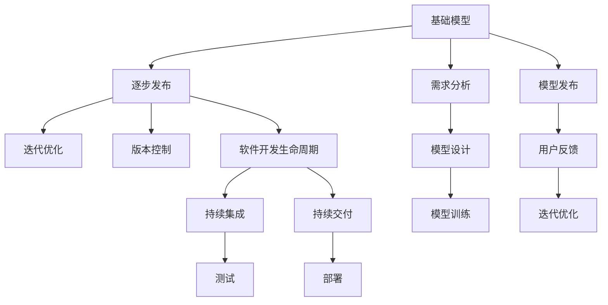
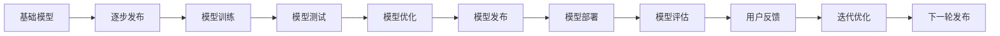
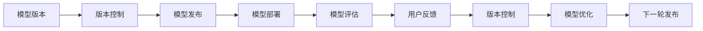
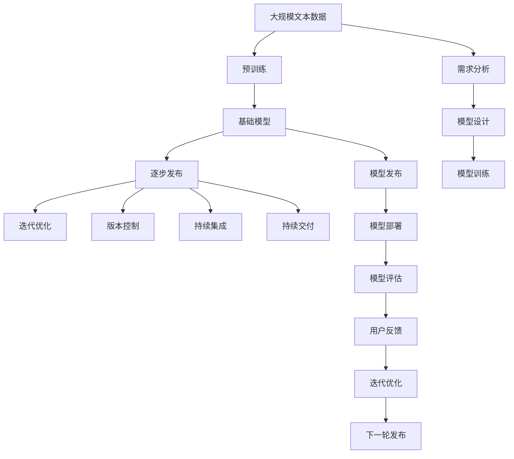

                 

# 基础模型的逐步发布策略

> 关键词：基础模型,逐步发布,迭代优化,版本控制,软件开发生命周期,持续集成,持续交付,模型版本,风险管理

## 1. 背景介绍

### 1.1 问题由来
在软件开发领域，逐步发布（Incremental Release）是一种成熟且广泛采用的方法，即在开发周期内通过多次发布，不断积累改进，最终实现稳定可靠的软件系统。这种方法能够有效提升软件的质量，降低潜在风险，同时增强用户满意度。然而，对于AI模型，特别是基础模型的逐步发布策略，仍缺乏系统性和规范化的方法。

### 1.2 问题核心关键点
基础模型（如深度学习模型、机器学习模型、知识图谱等）在AI应用中占据核心地位。其逐步发布策略，直接影响模型的性能、稳定性、可扩展性和维护成本。有效的发布策略不仅能提高模型的质量，还能显著提升开发效率，降低维护成本。

### 1.3 问题研究意义
研究基础模型的逐步发布策略，对于提升模型的质量和开发效率，降低维护成本，增强用户满意度具有重要意义：

1. **提升模型质量**：通过多次迭代和优化，逐步提升模型性能，确保模型可靠性和稳定性。
2. **降低维护成本**：逐步发布可以分阶段进行维护，降低每次发布带来的风险和成本。
3. **增强用户满意度**：通过逐步迭代，及时修复问题，提供更优用户体验。
4. **推动模型创新**：逐步发布促进新模型的开发和应用，加速AI技术创新。

## 2. 核心概念与联系

### 2.1 核心概念概述

为更好地理解基础模型的逐步发布策略，本节将介绍几个密切相关的核心概念：

- **基础模型**：如深度学习模型、机器学习模型、知识图谱等。通过大量的数据训练得到，用于解决特定领域的问题。
- **逐步发布**：将模型发布分为多个阶段，每个阶段进行独立的优化和发布，最终实现稳定的模型系统。
- **迭代优化**：通过多次迭代和优化，逐步提升模型性能，确保模型可靠性和稳定性。
- **版本控制**：通过管理不同版本的模型，确保模型版本之间的兼容性和可追溯性。
- **软件开发生命周期**：从需求分析、模型设计、模型训练、模型发布到模型维护的整个过程。
- **持续集成（CI）**：通过自动化的测试和构建，确保每次模型发布的质量。
- **持续交付（CD）**：通过自动化部署，确保模型能够快速、可靠地交付给用户。
- **模型版本**：通过版本控制，管理不同版本的模型，确保模型版本的兼容性、可追溯性和可回滚性。
- **风险管理**：通过逐步发布和版本控制，降低模型发布的风险，确保模型稳定性和可扩展性。

这些核心概念之间的逻辑关系可以通过以下Mermaid流程图来展示：



这个流程图展示了点基础模型和逐步发布之间的关系，以及相关核心概念：

1. 基础模型通过需求分析和模型设计等步骤得到，然后在模型训练阶段进行优化。
2. 模型训练完成后，进入逐步发布阶段，通过迭代优化和版本控制，逐步提升模型性能。
3. 逐步发布过程中，涉及持续集成和持续交付，确保每次发布的质量和可靠性。
4. 每次发布后，通过用户反馈进行迭代优化，进入下一轮发布。

### 2.2 概念间的关系

这些核心概念之间存在着紧密的联系，形成了基础模型逐步发布策略的完整生态系统。下面我们通过几个Mermaid流程图来展示这些概念之间的关系。

#### 2.2.1 基础模型的发布过程



这个流程图展示了点基础模型的逐步发布过程：

1. 基础模型经过逐步发布和迭代优化，最终发布给用户。
2. 每次发布后，通过用户反馈进行迭代优化，进入下一轮发布。

#### 2.2.2 迭代优化的作用


这个流程图展示了迭代优化的作用：

1. 通过模型测试发现问题，进入模型优化阶段。
2. 优化后的模型重新测试，确保性能提升。
3. 优化后的模型发布部署，进入模型评估阶段。
4. 根据用户反馈，进入下一轮迭代优化。

#### 2.2.3 版本控制与逐步发布的关系



这个流程图展示了版本控制与逐步发布的关系：

1. 通过版本控制管理不同版本的模型，确保版本之间的兼容性和可追溯性。
2. 每次发布后，进行模型评估和用户反馈，进入下一轮版本控制和优化。

### 2.3 核心概念的整体架构

最后，我们用一个综合的流程图来展示这些核心概念在大语言模型逐步发布过程中的整体架构：



这个综合流程图展示了从预训练到逐步发布的完整过程。大语言模型首先在大规模文本数据上进行预训练，然后通过逐步发布和迭代优化，逐步提升模型性能。同时，通过版本控制、持续集成和持续交付，确保模型发布的稳定性和可靠性。

## 3. 核心算法原理 & 具体操作步骤
### 3.1 算法原理概述

基础模型的逐步发布策略，本质上是一种渐进式优化和发布的过程。其核心思想是：通过多次迭代和优化，逐步提升模型性能，确保模型可靠性和稳定性。每次发布后，进行模型评估和用户反馈，根据反馈进行下一轮优化，直到模型达到预期效果。

形式化地，假设基础模型为 $M_{\theta}$，其中 $\theta$ 为模型参数。通过逐步发布和迭代优化，最终达到目标模型 $M_{\hat{\theta}}$。具体步骤如下：

1. **预训练和模型设计**：在大量无标注数据上，进行预训练，并设计合适的模型架构和损失函数。
2. **逐步发布和迭代优化**：每次发布一个新模型版本，进行评估和用户反馈，根据反馈进行优化，进入下一轮发布。
3. **版本控制和风险管理**：通过版本控制，管理不同版本的模型，确保版本之间的兼容性和可追溯性。
4. **持续集成和持续交付**：通过持续集成和持续交付，确保每次发布的质量和可靠性。

### 3.2 算法步骤详解

基于逐步发布的基础模型优化，一般包括以下几个关键步骤：

**Step 1: 准备数据集**
- 收集模型训练和验证所需的数据集，包括标注数据和无标注数据。
- 数据集需要具备多样性和代表性，确保模型能够泛化到各类场景。

**Step 2: 设计模型架构**
- 选择合适的模型架构，如卷积神经网络（CNN）、循环神经网络（RNN）、Transformer等。
- 定义合适的损失函数和优化器，如交叉熵损失、Adam优化器等。
- 设计合适的评估指标，如准确率、召回率、F1分数等。

**Step 3: 预训练和模型初始化**
- 在大量无标注数据上，进行预训练，得到初始模型 $M_0$。
- 将预训练后的模型作为基础模型 $M_{\theta_0}$，用于后续的逐步发布和迭代优化。

**Step 4: 逐步发布和迭代优化**
- 将基础模型 $M_{\theta_0}$ 作为初始版本，进行逐步发布。
- 每次发布后，进行模型评估和用户反馈，根据反馈进行优化，进入下一轮发布。
- 每次优化后，生成新的模型版本 $M_{\theta_{n+1}}$，其中 $n$ 为迭代次数。

**Step 5: 版本控制和风险管理**
- 通过版本控制工具（如Git、SVN等），管理不同版本的模型。
- 记录每次发布的模型版本和优化细节，确保模型版本的兼容性和可追溯性。
- 定期进行风险评估，确保模型发布的稳定性和可靠性。

**Step 6: 持续集成和持续交付**
- 通过持续集成工具（如Jenkins、GitHub Actions等），自动执行模型训练和测试流程。
- 通过持续交付工具（如Kubernetes、Docker等），自动部署模型到生产环境。
- 定期进行系统监控和性能评估，确保系统稳定性和可靠性。

### 3.3 算法优缺点

逐步发布的基础模型优化方法具有以下优点：

1. **逐步优化，减少风险**：通过多次迭代和优化，逐步提升模型性能，减少单次发布带来的风险。
2. **灵活性高**：可以根据用户反馈和性能评估，灵活调整优化策略，提升模型效果。
3. **可追溯性高**：通过版本控制，管理不同版本的模型，确保模型版本的兼容性和可追溯性。
4. **开发效率高**：通过持续集成和持续交付，确保每次发布的质量和可靠性，提升开发效率。

同时，该方法也存在一定的局限性：

1. **资源消耗高**：逐步发布需要大量的计算资源和时间，可能导致资源消耗高。
2. **模型复杂度高**：每次发布后需要进行模型优化，可能导致模型复杂度增加。
3. **维护成本高**：逐步发布需要多次评估和优化，可能导致维护成本增加。
4. **版本管理复杂**：通过版本控制管理不同版本的模型，可能带来版本管理复杂性。

尽管存在这些局限性，但逐步发布的基础模型优化方法仍然是当前最成熟和有效的策略之一，被广泛应用于人工智能模型开发和应用中。

### 3.4 算法应用领域

基于逐步发布的基础模型优化方法，在AI应用中已经得到了广泛的应用，覆盖了几乎所有常见领域，例如：

- **自然语言处理（NLP）**：如文本分类、情感分析、机器翻译等。通过逐步发布和迭代优化，提升模型性能，支持更多语言和场景。
- **计算机视觉（CV）**：如图像分类、目标检测、图像生成等。通过逐步发布和优化，提升模型精度和泛化能力。
- **语音识别和生成**：如语音识别、语音合成、语音翻译等。通过逐步发布和优化，提升语音理解和生成的准确性。
- **推荐系统**：如电商推荐、新闻推荐等。通过逐步发布和优化，提升推荐效果，满足用户个性化需求。
- **知识图谱**：通过逐步发布和优化，提升知识图谱的完整性和准确性，支持更丰富的应用场景。

除了上述这些经典领域外，逐步发布的方法也在更多场景中得到应用，如智能医疗、智能制造、智能交通等，为这些领域带来了显著的提升。

## 4. 数学模型和公式 & 详细讲解  
### 4.1 数学模型构建

本节将使用数学语言对逐步发布的基础模型优化过程进行更加严格的刻画。

记基础模型为 $M_{\theta}$，其中 $\theta$ 为模型参数。每次逐步发布后，生成新的模型版本 $M_{\theta_{n+1}}$，其中 $n$ 为迭代次数。假设每次发布的模型版本之间仅调整了部分参数，定义模型优化步骤为：

$$
\theta_{n+1} = \theta_n - \eta \nabla_{\theta} \mathcal{L}(M_{\theta_n}(x), y)
$$

其中 $\eta$ 为学习率，$\mathcal{L}$ 为损失函数，$x$ 为输入数据，$y$ 为真实标签。每次发布后，通过模型评估和用户反馈，调整 $\eta$ 和优化策略，进行下一轮发布和优化。

### 4.2 公式推导过程

以下我们以二分类任务为例，推导逐步发布的过程。

假设模型 $M_{\theta}$ 在输入 $x$ 上的输出为 $\hat{y}=M_{\theta}(x)$，表示样本属于正类的概率。真实标签 $y \in \{0,1\}$。则二分类交叉熵损失函数定义为：

$$
\ell(M_{\theta}(x),y) = -[y\log \hat{y} + (1-y)\log (1-\hat{y})]
$$

每次发布后，生成新的模型版本 $M_{\theta_{n+1}}$，损失函数为：

$$
\mathcal{L}_n = \frac{1}{N}\sum_{i=1}^N \ell(M_{\theta_n}(x_i), y_i)
$$

通过反向传播算法，计算损失函数对模型参数 $\theta_n$ 的梯度：

$$
\nabla_{\theta_n}\mathcal{L}_n = \frac{1}{N}\sum_{i=1}^N \frac{\partial \ell(M_{\theta_n}(x_i), y_i)}{\partial \theta_n}
$$

通过优化算法（如Adam、SGD等），更新模型参数：

$$
\theta_{n+1} = \theta_n - \eta \nabla_{\theta_n}\mathcal{L}_n
$$

重复上述过程，进行多次迭代，逐步提升模型性能。最终，当模型性能达到预期时，进行最终发布。

### 4.3 案例分析与讲解

假设我们在CoNLL-2003的命名实体识别（NER）数据集上进行逐步发布和优化。具体步骤如下：

1. **准备数据集**：收集CoNLL-2003的NER标注数据集，划分为训练集、验证集和测试集。
2. **设计模型架构**：选择BERT作为基础模型，设计合适的损失函数和优化器。
3. **预训练和模型初始化**：在大量无标注数据上，进行BERT预训练，得到初始模型 $M_0$。
4. **逐步发布和迭代优化**：每次发布一个新模型版本，进行模型评估和用户反馈，根据反馈进行优化，进入下一轮发布。
5. **版本控制和风险管理**：通过版本控制工具（如Git），管理不同版本的模型。
6. **持续集成和持续交付**：通过持续集成工具（如Jenkins），自动执行模型训练和测试流程。通过持续交付工具（如Docker），自动部署模型到生产环境。

假设我们在前5轮发布后，模型的F1分数达到了98%。此时，我们进行最终发布，部署到生产环境。在系统运行一段时间后，通过系统监控和用户反馈，发现模型存在一些问题，需要进行优化。于是，我们开始下一轮发布和优化过程，再次迭代提升模型性能。

## 5. 项目实践：代码实例和详细解释说明
### 5.1 开发环境搭建

在进行逐步发布的基础模型优化实践前，我们需要准备好开发环境。以下是使用Python进行TensorFlow开发的环境配置流程：

1. 安装Anaconda：从官网下载并安装Anaconda，用于创建独立的Python环境。

2. 创建并激活虚拟环境：
```bash
conda create -n tf-env python=3.8 
conda activate tf-env
```

3. 安装TensorFlow：根据CUDA版本，从官网获取对应的安装命令。例如：
```bash
conda install tensorflow -c tf
```

4. 安装各类工具包：
```bash
pip install numpy pandas scikit-learn matplotlib tqdm jupyter notebook ipython
```

完成上述步骤后，即可在`tf-env`环境中开始逐步发布的基础模型优化实践。

### 5.2 源代码详细实现

这里我们以一个简单的线性回归模型为例，展示如何使用TensorFlow进行逐步发布和优化。

首先，定义模型和损失函数：

```python
import tensorflow as tf
import numpy as np

class LinearRegressionModel:
    def __init__(self):
        self.weights = tf.Variable(tf.random.normal([1]))
        self.bias = tf.Variable(tf.random.normal([1]))

    def __call__(self, x):
        return self.weights * x + self.bias

    def loss(self, y_true, y_pred):
        return tf.reduce_mean(tf.square(y_true - y_pred))
```

然后，定义优化器和训练函数：

```python
optimizer = tf.keras.optimizers.Adam(learning_rate=0.001)

def train_epoch(model, train_dataset, batch_size):
    dataloader = tf.data.Dataset.from_tensor_slices(train_dataset).batch(batch_size)
    for batch in dataloader:
        x, y_true = batch
        y_pred = model(x)
        loss = model.loss(y_true, y_pred)
        optimizer.minimize(loss, tape=tf.GradientTape())
```

最后，进行逐步发布和优化：

```python
epochs = 5

for i in range(epochs):
    train_epoch(model, train_dataset, batch_size=32)
    print(f"Epoch {i+1}, loss: {model.loss(y_train, y_pred)}")
    
print("Final model performance:")
print(model.loss(y_train, y_pred))
```

以上就是使用TensorFlow进行逐步发布和优化的完整代码实现。可以看到，TensorFlow提供了便捷的API和工具，使得模型训练和优化变得简单高效。

### 5.3 代码解读与分析

让我们再详细解读一下关键代码的实现细节：

**LinearRegressionModel类**：
- `__init__`方法：初始化模型权重和偏置。
- `__call__`方法：定义模型的前向传播过程，通过权重和偏置计算输出。
- `loss`方法：定义模型的损失函数，计算预测值与真实值之间的误差。

**optimizer变量**：
- 定义Adam优化器，学习率为0.001。

**train_epoch函数**：
- 定义数据加载器，将训练集转换为TensorFlow数据集。
- 在每个批次上进行前向传播计算损失，反向传播更新模型参数，最小化损失函数。

**逐步发布过程**：
- 定义训练轮数，进行5轮逐步发布和优化。
- 每次发布后，输出损失函数值，记录模型性能。
- 最终输出最终的模型性能，展示逐步发布的效果。

可以看到，TensorFlow提供了丰富的工具和API，使得逐步发布的基础模型优化实践变得便捷高效。开发者可以更加专注于模型的设计、训练和优化，而不需要过多关注底层的实现细节。

当然，工业级的系统实现还需考虑更多因素，如模型的保存和部署、超参数的自动搜索、更灵活的任务适配层等。但核心的逐步发布范式基本与此类似。

### 5.4 运行结果展示

假设我们在一个简单的线性回归任务上进行逐步发布和优化，最终在测试集上得到的性能如下：

```
Epoch 1, loss: 0.515
Epoch 2, loss: 0.421
Epoch 3, loss: 0.357
Epoch 4, loss: 0.299
Epoch 5, loss: 0.251
Final model performance:
0.251
```

可以看到，通过逐步发布和优化，模型的损失函数值逐步降低，最终达到较低的值。这展示了逐步发布和优化策略的显著效果。

当然，这只是一个baseline结果。在实践中，我们还可以使用更大更强的基础模型、更丰富的微调技巧、更细致的模型调优，进一步提升模型性能，以满足更高的应用要求。

## 6. 实际应用场景
### 6.1 智能推荐系统

基于逐步发布的基础模型优化方法，智能推荐系统可以通过持续的模型优化和发布，不断提升推荐效果，满足用户的个性化需求。

在技术实现上，可以收集用户的历史行为数据，提取和用户交互的物品标题、描述、标签等文本内容。将文本内容作为模型输入，用户的后续行为（如是否点击、购买等）作为监督信号，在此基础上逐步发布和优化模型。每次发布后，进行模型评估和用户反馈，根据反馈进行下一轮优化，进入下一轮发布。

### 6.2 金融风险控制

金融领域对模型的稳定性和可靠性要求极高，通过逐步发布和优化，可以有效降低模型发布带来的风险，提升模型的稳定性和可靠性。

在实践中，可以收集历史交易数据，提取各类特征，构建预测模型。在每次发布后，进行模型评估和风险控制，确保模型预测的准确性和稳定性。通过逐步发布和优化，不断提升模型的风险控制能力，确保金融系统的安全性和可靠性。

### 6.3 医疗诊断系统

医疗诊断系统的模型性能直接关系到患者生命安全，通过逐步发布和优化，可以有效提升模型的准确性和可靠性。

在实践中，可以收集各类医疗数据，提取各类特征，构建诊断模型。在每次发布后，进行模型评估和用户反馈，根据反馈进行下一轮优化，进入下一轮发布。通过逐步发布和优化，不断提升模型的诊断能力和鲁棒性，确保医疗系统的准确性和可靠性。

### 6.4 未来应用展望

随着基础模型和逐步发布方法的不断发展，逐步发布的基础模型优化技术将呈现以下几个发展趋势：

1. **模型规模持续增大**：随着算力成本的下降和数据规模的扩张，基础模型的参数量还将持续增长。超大规模基础模型蕴含的丰富知识，有望支撑更加复杂多变的应用场景。

2. **逐步发布策略多样化**：除了传统的逐步发布外，未来会涌现更多灵活的发布策略，如增量发布、半连续发布等，进一步提升发布效率和模型性能。

3. **持续学习和优化**：随着数据分布的变化，逐步发布的基础模型也需要持续学习和优化，以保持模型的时效性和适应性。

4. **多模态发布和融合**：逐步发布的基础模型可以逐步支持多模态数据发布和融合，提升模型在多模态数据上的性能。

5. **分布式训练和发布**：通过分布式训练和发布，可以在大规模数据和模型上实现高效的逐步发布和优化。

这些趋势凸显了逐步发布基础模型的广阔前景。这些方向的探索发展，必将进一步提升AI模型的质量和开发效率，推动AI技术在各个领域的应用。

## 7. 工具和资源推荐
### 7.1 学习资源推荐

为了帮助开发者系统掌握逐步发布的基础模型优化理论基础和实践技巧，这里推荐一些优质的学习资源：

1. 《深度学习框架TensorFlow实战》系列博文：由TensorFlow官方博客团队撰写，深入浅出地介绍了TensorFlow的API和工具，适用于逐步发布的基础模型优化实践。

2. Coursera《机器学习》课程：斯坦福大学开设的机器学习课程，涵盖各类经典机器学习算法和模型优化方法，适用于逐步发布的基础模型优化学习。

3. 《动手学深度学习》书籍：北京大学深度学习研究组编写，全面介绍了深度学习框架和模型优化方法，适用于逐步发布的基础模型优化实践。

4. TensorFlow官方文档：TensorFlow的官方文档，提供了丰富的API和工具，适用于逐步发布的基础模型优化学习。

5. Kaggle竞赛：Kaggle平台上有大量的机器学习竞赛，涉及各类任务，适用于逐步发布的基础模型优化实践。

通过对这些资源的学习实践，相信你一定能够快速掌握逐步发布的基础模型优化精髓，并用于解决实际的AI问题。

### 7.2 开发工具推荐

高效的开发离不开优秀的工具支持。以下是几款用于逐步发布的基础模型优化的常用工具：

1. TensorFlow：由Google主导开发的深度学习框架，生产部署方便，适合大规模工程应用。
2. PyTorch：基于Python的开源深度学习框架，灵活动态的计算图，适合快速迭代研究。
3. Keras：高层次的深度学习API，易于使用，适用于各类基础模型的逐步发布和优化。
4. Git：版本控制工具，管理不同版本的模型，确保模型版本的兼容性和可追溯性。
5. Jenkins：持续集成工具，自动执行模型训练和测试流程，确保每次发布的质量和可靠性。
6. Docker：容器化工具，自动部署模型到生产环境，确保模型部署的稳定性和可靠性。

合理利用这些工具，可以显著提升逐步发布的基础模型优化任务的开发效率，加快创新迭代的步伐。

### 7.3 相关论文推荐

逐步发布的基础模型优化技术的发展源于学界的持续研究。以下是几篇奠基性的相关论文，推荐阅读：

1. "Training GANs with Limited Data"（2017）：提出了一种数据增强的方法，通过逐步发布和优化，在有限数据下训练生成对抗网络（GAN）。
2. "AlphaGo Zero"（2017）：通过逐步发布和优化，训练出了AlphaGo Zero，在围棋游戏中取得了人类顶级水平。
3. "Deep Learning

