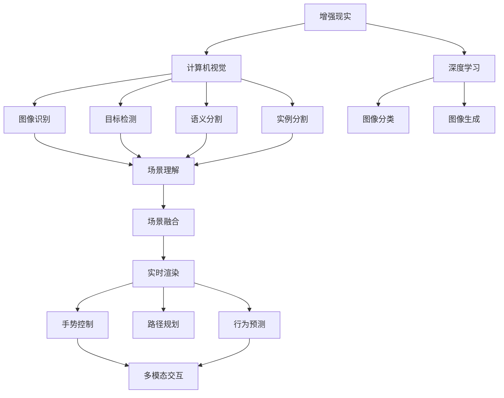
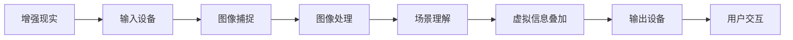
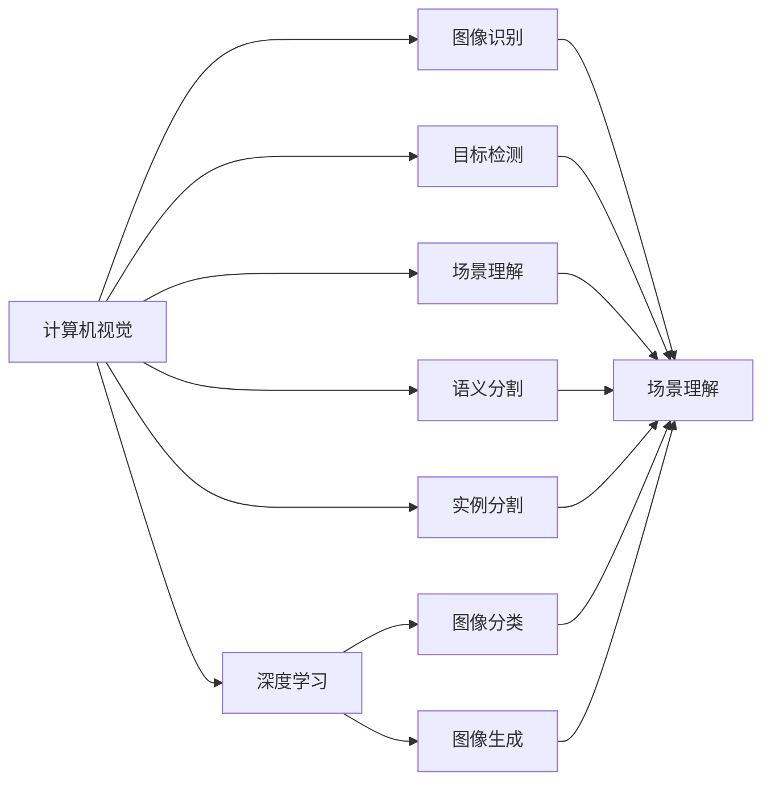
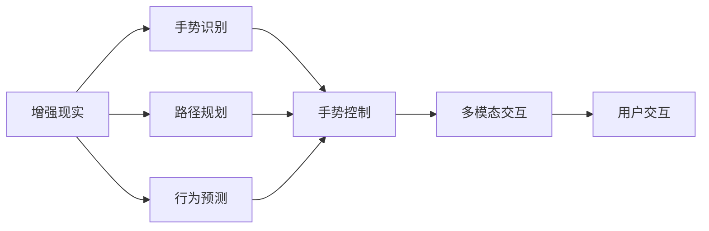
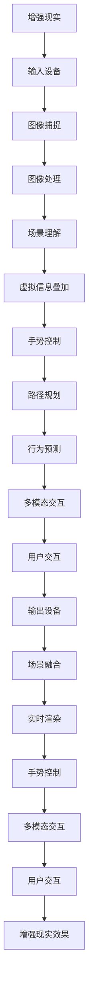

                 

# 增强现实 (Augmented Reality)

## 1. 背景介绍

### 1.1 问题由来
增强现实（Augmented Reality, AR）技术通过将数字信息叠加到真实世界中，扩展了人类与物理世界的交互方式。随着移动互联网和硬件设备的进步，AR技术得到了广泛的应用，从游戏娱乐到教育培训，再到工业制造，AR技术正逐渐渗透到各行各业。

近年来，随着深度学习、计算机视觉等技术的迅猛发展，增强现实系统逐渐从简单的图像叠加转向更加智能、互动性强的功能实现，如图像识别、手势控制、场景理解等。同时，随着设备的普及，增强现实技术也从专业实验室走入了普通消费者的生活，成为提升用户体验的重要工具。

### 1.2 问题核心关键点
增强现实技术的核心在于如何高效地将虚拟信息与现实世界融合，并提升用户交互体验。目前主流的做法包括：

- 实时图像识别：通过计算机视觉算法，将图像中的物体、场景等信息实时识别，并与虚拟信息进行融合。
- 场景理解：通过语义分割、实例分割等技术，对场景进行细粒度的理解，实现更加精细的虚拟信息叠加。
- 手势控制：通过深度学习算法，实现对用户手势的准确识别和响应，提升交互自然度。
- 虚拟导航：通过路径规划和行为预测，引导用户在现实世界中进行导航，提升用户体验。
- 多模态交互：结合语音、手势、眼动等多种输入方式，实现更加自然和丰富的用户交互。

增强现实技术的这些核心问题，均需要通过深度学习和计算机视觉算法来解决，因此本文将重点介绍这些核心算法的原理和实践。

### 1.3 问题研究意义
增强现实技术在提升用户交互体验、推动各行各业数字化转型等方面具有重要意义：

1. **提升用户体验**：AR技术通过将虚拟信息与现实世界结合，实现了更加沉浸、自然的用户交互方式，提升用户的感知体验。
2. **推动行业数字化**：AR技术可以应用于医疗、教育、工业等多个行业，通过数字信息的辅助，提升了工作效率和精度。
3. **促进新兴产业的发展**：增强现实技术的发展催生了新的行业和应用场景，如虚拟现实游戏、智能家居等，推动了相关产业的快速成长。
4. **加速科技创新**：增强现实技术的不断迭代和升级，推动了计算机视觉、深度学习等前沿技术的发展，加速了科技创新的进程。

增强现实技术已成为当前AI应用的重要前沿领域，具有广阔的发展前景和深远的影响力。

## 2. 核心概念与联系

### 2.1 核心概念概述

为更好地理解增强现实技术，本节将介绍几个关键概念：

- 增强现实（AR）：通过将数字信息叠加到真实世界中，扩展人类与物理世界的交互方式。
- 计算机视觉（CV）：使计算机能够“看懂”和“理解”图像和视频中的内容，实现图像识别、目标检测、场景理解等功能。
- 深度学习（DL）：一种基于人工神经网络的学习范式，通过大量数据训练模型，实现对复杂模式的高效学习。
- 语义分割：将图像中的像素分类到不同的语义类别，实现对场景的细粒度理解。
- 实例分割：不仅分类像素，还对实例进行区分和跟踪，提升场景理解的能力。
- 手势识别：通过深度学习算法，实现对手势的准确识别和响应，提升交互的自然度。
- 路径规划：通过算法设计，引导用户在现实世界中进行导航，提升用户体验。
- 行为预测：通过对用户行为数据的分析，预测用户的行为意图，实现更加智能的交互。

这些核心概念之间存在着紧密的联系，形成了增强现实技术的基础框架。下面通过Mermaid流程图来展示这些概念之间的关系：



这个流程图展示了增强现实技术的核心概念及其之间的关系：

1. 增强现实技术依赖计算机视觉和深度学习算法，实现对图像和视频的理解。
2. 计算机视觉中的图像识别、目标检测、语义分割、实例分割等技术，提升了场景理解的精细度。
3. 深度学习算法能够处理复杂的视觉信息，实现图像分类、图像生成等功能。
4. 场景理解、手势控制、路径规划、行为预测等技术，实现了更加自然、智能的增强现实体验。
5. 多模态交互技术，结合语音、手势、眼动等多种输入方式，提升了用户的交互自然度。

通过理解这些核心概念，我们可以更好地把握增强现实技术的工作原理和优化方向。

### 2.2 概念间的关系

这些核心概念之间存在着紧密的联系，形成了增强现实技术的完整生态系统。下面通过几个Mermaid流程图来展示这些概念之间的关系。

#### 2.2.1 增强现实的基本架构



这个流程图展示了增强现实技术的基本架构：

1. 输入设备捕获现实世界的图像，并转化为数字信号。
2. 图像处理模块对图像进行预处理，提升图像质量，减少噪声。
3. 场景理解模块对图像中的物体、场景等信息进行分类、识别和理解。
4. 虚拟信息叠加模块将虚拟信息与现实场景融合，实现增强现实效果。
5. 输出设备将增强现实信息呈现给用户，完成用户交互。

#### 2.2.2 计算机视觉与深度学习的关系



这个流程图展示了计算机视觉与深度学习的关系：

1. 计算机视觉中的图像识别、目标检测、场景理解、语义分割、实例分割等功能，依赖深度学习算法实现。
2. 深度学习算法通过大量数据训练模型，提升了计算机视觉系统的精度和效率。
3. 图像分类、图像生成等技术，进一步扩展了深度学习算法在计算机视觉中的应用。

#### 2.2.3 增强现实技术与多模态交互



这个流程图展示了增强现实技术与多模态交互的关系：

1. 手势识别、路径规划、行为预测等技术，提升了增强现实系统的交互自然度。
2. 多模态交互技术，结合语音、手势、眼动等多种输入方式，提升了用户的交互自然度。
3. 用户交互模块将增强现实信息呈现给用户，完成最终交互。

### 2.3 核心概念的整体架构

最后，我们用一个综合的流程图来展示这些核心概念在增强现实技术中的整体架构：



这个综合流程图展示了从输入到输出的增强现实技术完整流程：

1. 输入设备捕获现实世界的图像，并转化为数字信号。
2. 图像处理模块对图像进行预处理，提升图像质量，减少噪声。
3. 场景理解模块对图像中的物体、场景等信息进行分类、识别和理解。
4. 虚拟信息叠加模块将虚拟信息与现实场景融合，实现增强现实效果。
5. 手势控制、路径规划、行为预测等技术，提升了增强现实系统的交互自然度。
6. 多模态交互技术，结合语音、手势、眼动等多种输入方式，提升了用户的交互自然度。
7. 用户交互模块将增强现实信息呈现给用户，完成最终交互。

通过这些流程图，我们可以更清晰地理解增强现实技术的工作原理和优化方向。

## 3. 核心算法原理 & 具体操作步骤
### 3.1 算法原理概述

增强现实技术依赖于计算机视觉和深度学习算法，其核心算法原理主要包括图像识别、目标检测、场景理解、语义分割、实例分割、手势识别、路径规划、行为预测等多项技术。这些技术在增强现实系统中相互配合，实现了虚拟信息与现实世界的深度融合。

### 3.2 算法步骤详解

增强现实技术的实现一般包括以下几个关键步骤：

**Step 1: 输入图像获取**
- 使用摄像头、AR眼镜等设备捕捉现实世界的图像。
- 将图像转化为数字信号，并进行预处理，如噪声去除、颜色校正等。

**Step 2: 图像识别与特征提取**
- 使用深度学习算法对图像进行特征提取，识别出图像中的物体、场景等信息。
- 使用卷积神经网络（CNN）进行特征提取，通过卷积、池化等操作，提取图像的关键特征。

**Step 3: 目标检测与定位**
- 使用目标检测算法，识别并定位图像中的物体，如人脸、车辆、建筑等。
- 使用深度学习算法，如Faster R-CNN、YOLO等，实现目标的精确检测和定位。

**Step 4: 场景理解与语义分割**
- 使用语义分割算法，将图像中的像素分类到不同的语义类别，实现对场景的细粒度理解。
- 使用U-Net、FCN等语义分割算法，实现对场景中不同对象的分类和定位。

**Step 5: 实例分割与物体跟踪**
- 使用实例分割算法，对场景中的物体进行分割和跟踪，实现对实例的区分和识别。
- 使用Mask R-CNN等实例分割算法，实现对场景中不同实例的区分和跟踪。

**Step 6: 手势识别与行为预测**
- 使用深度学习算法，如3D-CNN、深度学习网络（DLN）等，实现对手势的准确识别和响应。
- 使用行为预测算法，通过用户行为数据，预测用户的行为意图，实现更加智能的交互。

**Step 7: 路径规划与导航**
- 使用路径规划算法，设计智能导航路径，引导用户在现实世界中进行导航。
- 使用A*算法、Dijkstra算法等路径规划算法，实现路径的优化和规划。

**Step 8: 实时渲染与输出**
- 将虚拟信息与现实场景进行融合，实现增强现实效果。
- 使用GPU进行实时渲染，将增强现实信息呈现给用户，完成用户交互。

以上是增强现实技术的一般流程，其中每一步都需要使用相应的深度学习算法来实现。通过这些算法的相互配合，实现了虚拟信息与现实世界的深度融合。

### 3.3 算法优缺点

增强现实技术的核心算法原理具有以下优点：

1. **高效性**：通过深度学习算法，能够高效地实现图像识别、目标检测、语义分割等任务，提升了系统的处理速度和精度。
2. **鲁棒性**：深度学习算法能够适应不同的场景和噪声，提升了系统的鲁棒性和泛化能力。
3. **可扩展性**：增强现实技术能够结合多种输入方式，如手势、语音、眼动等，提升了系统的交互自然度和用户体验。

但同时，增强现实技术的核心算法原理也存在以下缺点：

1. **计算成本高**：深度学习算法需要大量的计算资源和数据，在大规模应用时，可能面临计算成本高昂的问题。
2. **模型复杂**：深度学习算法模型复杂，训练和推理过程中需要大量的计算资源和时间。
3. **数据需求大**：深度学习算法需要大量的标注数据进行训练，标注数据的获取和处理成本较高。

尽管存在这些缺点，但深度学习算法在增强现实技术中的广泛应用，已经证明了其在提升系统性能和用户体验方面的巨大潜力。未来，随着计算能力的提升和数据量的增加，增强现实技术将进一步普及和应用。

### 3.4 算法应用领域

增强现实技术已经广泛应用于多个领域，具体包括：

- **游戏娱乐**：增强现实游戏通过将虚拟信息与现实场景结合，提供了更加沉浸、丰富的游戏体验。
- **教育培训**：增强现实技术在教育领域得到了广泛应用，如虚拟实验室、三维可视化教学等。
- **医疗健康**：增强现实技术可以用于手术辅助、患者指导、康复训练等，提升了医疗服务的质量和效率。
- **工业制造**：增强现实技术可以用于设备维护、质量检测、生产监控等，提升了工业生产的智能化水平。
- **智能家居**：增强现实技术可以用于家居环境控制、家庭安防、信息展示等，提升了家居生活的智能化水平。
- **营销广告**：增强现实技术可以用于产品展示、互动广告、用户调研等，提升了广告的互动性和效果。
- **社交娱乐**：增强现实技术可以用于社交互动、游戏竞技、虚拟旅游等，提供了更加沉浸、互动的社交体验。

除了上述这些应用场景外，增强现实技术还在更多领域得到创新性应用，如交通导航、文物保护、灾害预警等，为各行各业带来了新的变革和机遇。

## 4. 数学模型和公式 & 详细讲解  
### 4.1 数学模型构建

增强现实技术的核心算法原理涉及图像识别、目标检测、场景理解、语义分割、实例分割、手势识别、路径规划、行为预测等多项技术，其中最核心的算法是基于深度学习的计算机视觉算法。以下我们以图像分类和目标检测为例，介绍其数学模型和公式。

### 4.2 公式推导过程

#### 4.2.1 图像分类

图像分类的目标是将输入的图像分为不同的类别，常用的算法包括卷积神经网络（CNN）、支持向量机（SVM）等。这里以CNN为例，介绍其公式推导过程。

假设输入图像为 $x \in \mathbb{R}^{H\times W\times C}$，其中 $H$ 和 $W$ 为图像的高和宽，$C$ 为输入通道数（如RGB图像中为3）。输出为 $y \in \{0, 1\}^C$，表示图像属于每个类别的概率。

CNN模型的基本结构包括卷积层、池化层、全连接层等。卷积层通过卷积运算提取图像特征，池化层对特征进行降维，全连接层将特征映射到类别空间。设卷积核大小为 $k \times k$，步幅为 $s$，则卷积操作的公式为：

$$
y_{i,j} = \sum_{m,n=1}^{k\times k} w_{m,n} x_{i-s\times m, j-s\times n}
$$

其中 $w_{m,n}$ 为卷积核，$x_{i-s\times m, j-s\times n}$ 为输入图像的像素值，$y_{i,j}$ 为卷积操作的结果。

卷积层输出的特征图大小为 $\frac{H-k+1}{s} \times \frac{W-k+1}{s}$，通过多次卷积操作，提取不同尺度和不同层次的特征。

池化层对特征图进行降维，常用的池化操作包括最大池化和平均池化。设池化窗口大小为 $k$，步幅为 $s$，则最大池化的公式为：

$$
y_{i,j} = \max_{m,n=1}^{k\times k} x_{i-s\times m+1, j-s\times n+1}
$$

其中 $x_{i-s\times m+1, j-s\times n+1}$ 为特征图的像素值，$y_{i,j}$ 为池化操作的结果。

池化层的输出大小为 $\frac{H-k+1}{s} \times \frac{W-k+1}{s}$，通过多次池化操作，将特征图的空间大小逐步缩小，提高特征的可解释性。

全连接层将池化后的特征映射到类别空间，常用的激活函数包括ReLU、Sigmoid等。设池化后的特征图大小为 $H_p \times W_p$，则全连接层的公式为：

$$
y = \text{softmax}(\mathbf{W}^T \mathbf{h} + b)
$$

其中 $\mathbf{W}$ 为全连接层的权重矩阵，$\mathbf{h}$ 为池化后的特征图，$b$ 为偏置项，$\text{softmax}$ 为激活函数。

通过多层卷积、池化、全连接操作，CNN模型能够高效地学习图像特征，实现图像分类任务。

#### 4.2.2 目标检测

目标检测的目标是检测图像中的物体，并定位其在图像中的位置，常用的算法包括Faster R-CNN、YOLO等。这里以Faster R-CNN为例，介绍其公式推导过程。

Faster R-CNN模型由RPN（Region Proposal Network）和Fast R-CNN组成。RPN负责生成候选区域，Fast R-CNN负责检测和分类候选区域。

设输入图像为 $x \in \mathbb{R}^{H\times W\times C}$，输出为 $y \in \{0, 1\}^N \times \mathbb{R}^4$，其中 $N$ 为候选区域的数量，$\mathbb{R}^4$ 为候选区域的位置和大小。

RPN的输出包括候选区域的类别概率 $p$ 和位置偏移 $r$，其中 $p \in [0, 1]^N$，$r \in \mathbb{R}^{N\times 4}$。设RPN的卷积核大小为 $k \times k$，步幅为 $s$，则RPN的输出公式为：

$$
p_{i,j} = \sigma(W_p \mathbf{h}_{i,j} + b_p)
$$

$$
r_{i,j} = \tanh(W_r \mathbf{h}_{i,j} + b_r)
$$

其中 $W_p$ 和 $W_r$ 为RPN的权重矩阵，$\mathbf{h}_{i,j}$ 为RPN的特征图，$\sigma$ 为Sigmoid激活函数，$\tanh$ 为双曲正切函数。

Fast R-CNN的输出包括候选区域的类别概率 $p$ 和目标的位置 $b$，其中 $p \in [0, 1]^N$，$b \in \mathbb{R}^{N\times 4}$。设Fast R-CNN的卷积核大小为 $k \times k$，步幅为 $s$，则Fast R-CNN的输出公式为：

$$
p_{i,j} = \sigma(W_p \mathbf{h}_{i,j} + b_p)
$$

$$
b_{i,j} = \text{RoIAlign}(\mathbf{H}^T \mathbf{h}_{i,j} + b_H)
$$

其中 $W_p$ 为Fast R-CNN的权重矩阵，$\mathbf{h}_{i,j}$ 为Fast R-CNN的特征图，$\text{RoIAlign}$ 为RoI池化操作。

通过RPN生成候选区域，Fast R-CNN对候选区域进行检测和分类，实现目标检测任务。

### 4.3 案例分析与讲解

#### 4.3.1 图像分类

以ImageNet数据集为例，展示基于CNN的图像分类算法。

ImageNet数据集包含1000个类别，共约1400万张图像。CNN模型通过在大规模ImageNet数据集上进行训练，学习到不同类别的特征表示，从而实现图像分类任务。

假设模型在ImageNet数据集上进行了训练，得到了分类器 $\text{softmax}(\mathbf{W}^T \mathbf{h} + b)$，其中 $\mathbf{W}$ 和 $b$ 为模型参数。

对于输入图像 $x \in \mathbb{R}^{H\times W\times C}$，通过CNN模型处理，得到特征图 $\mathbf{h} \in \mathbb{R}^{H_p \times W_p \times C_p}$，其中 $H_p$ 和 $W_p$ 为特征图的大小，$C_p$ 为特征图通道数。

通过分类器 $\text{softmax}(\mathbf{W}^T \mathbf{h} + b)$，模型能够计算输入图像属于每个类别的概率 $y \in \{0, 1\}^{1000}$。

例如，假设输入图像属于类别 "cat"，则模型输出的概率分布为：

$$
y = [0, 0, 0, ..., 0.99, 0.01, 0, ...]
$$

其中 "cat" 对应概率为0.99，表示模型高度确信该图像属于 "cat" 类别。

#### 4.3.2 目标检测

以COCO数据集为例，展示基于Faster R-CNN的目标检测算法。

COCO数据集包含80个类别，约330k张图像，每个图像标注有多个物体和位置信息。Faster R-CNN模型通过在大规模COCO数据集上进行训练，学习到目标的检测和分类能力，从而实现目标检测任务。

假设模型在COCO数据集上进行了训练，得到了检测器 $\text{softmax}(\mathbf{W}^T \mathbf{h} + b)$ 和定位器 $\text{RoIAlign}(\mathbf{H}^T \mathbf{h} + b_H)$，其中 $\mathbf{W}$ 和 $b$ 为检测器参数，$\mathbf{H}$ 和 $b_H$ 为定位器参数。

对于输入图像 $x \in \mathbb{R}^{H\times W\times C}$，通过RPN生成候选区域 $p_{i,j} \in [0, 1]^N$ 和位置偏移 $r_{i,j} \in \mathbb{R}^{N\times 4}$，其中 $N$ 为候选区域的数量。

Fast R-CNN对每个候选区域进行检测和分类，得到目标的类别概率 $p_{i,j} \in [0, 1]^N$ 和位置 $b_{i,j} \in \mathbb{R}^{N\times 4}$。

例如，假设输入图像包含一个 "dog"，模型检测并定位到该 "dog" 的位置，则模型输出的概率分布为：

$$
p = [0.8, 0, 0, ..., 0.2, 0, 0, ...]
$$

其中 "dog" 对应概率为0.8，表示模型高度确信该图像属于 "dog" 类别。

同时，模型输出该 "dog" 的位置为：

$$
b = [x_1, y_1, w_1, h_1]
$$

其中 $x_1$ 和 $y_1$ 为 "dog" 的位置，$w_1$ 和 $h_1$ 为 "dog" 的大小。

通过Faster R-CNN模型，能够高效地检测并定位图像中的目标，提升增强现实系统的交互自然度和用户体验。

## 5. 项目实践：代码实例和详细解释说明
### 5.1 开发环境搭建

在进行增强现实项目开发前，我们需要准备好开发环境。以下是使用Python进行TensorFlow开发的环境配置流程：

1. 安装Anaconda：从官网下载并安装Anaconda，用于创建独立的Python环境。

2. 创建并激活虚拟环境：
```bash
conda create -n tf-env python=3.8 
conda activate tf-env
```

3. 安装TensorFlow：从官网获取对应的安装命令。例如：
```bash
pip install tensorflow-gpu==2.6.0
```

4. 安装相关的库：
```bash
pip install opencv-python numpy scipy matplotlib
```

完成上述步骤后，即可在`tf-env`环境中开始增强现实项目的开发。

### 5.2 源代码详细实现

这里以增强现实游戏中的目标检测为例，给出使用TensorFlow实现目标检测的Python代码。

首先，定义目标检测的数据集类：

```python
import tensorflow as tf
import cv2
import numpy as np

class ObjectDetectionDataset(tf.data.Dataset):
    def __init__(self, filenames, annotations):
        self.filenames = filenames
        self.annotations = annotations
        
    def __len__(self):


