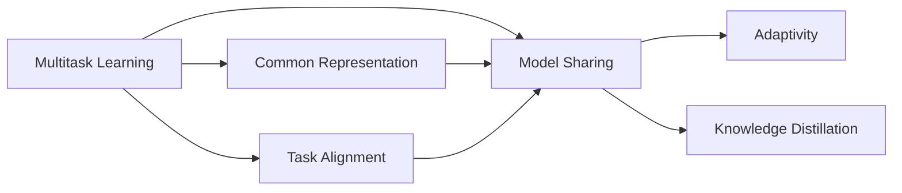
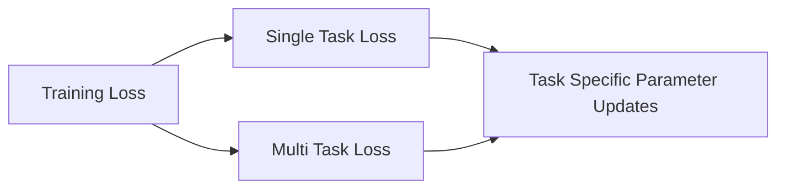
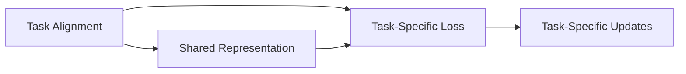
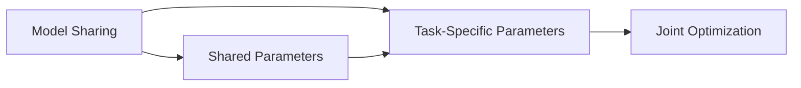
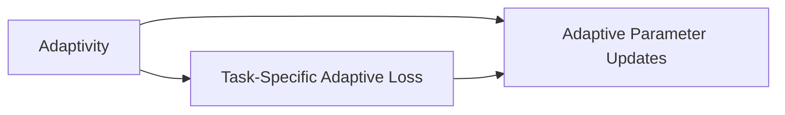
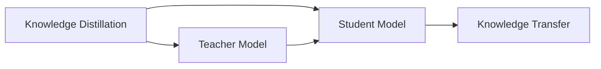
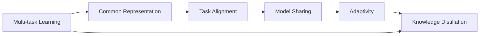

                 

# 多任务学习 (Multi-Task Learning) 原理与代码实例讲解

> 关键词：多任务学习, MTL, 共同表示, 任务对齐, 模型共享, 自适应性, 知识蒸馏, 代码实例, 代码解读

## 1. 背景介绍

### 1.1 问题由来

在人工智能的演进中，单一任务的模型虽然强大，但面对多样化的需求时，往往表现不佳。例如，自然语言处理中的命名实体识别和情感分析等任务，虽然它们之间有重叠的知识，但现有方法通常采用单一模型训练，无法充分利用这些重叠知识来提升性能。多任务学习（Multi-Task Learning, MTL）正是为了解决这一问题而提出的，它旨在利用不同任务之间的相关性来提升模型的泛化能力和性能。

### 1.2 问题核心关键点

多任务学习本质上是一种在多个任务上进行联合学习的技术。其主要特点包括：
- **任务间的知识共享**：多任务学习能够利用不同任务之间的共享知识，提升模型的泛化能力和鲁棒性。
- **自适应性**：模型能够根据任务的不同需求，自动适应不同的学习目标。
- **性能提升**：通过联合训练多个任务，可以显著提升每个任务的性能。

### 1.3 问题研究意义

多任务学习在机器学习领域具有重要意义，能够有效提升模型的泛化能力和性能，尤其在数据量有限的情况下，能够充分利用多任务间的数据关联性，提升模型的准确性和鲁棒性。以下列出了多任务学习的几个主要应用场景：
- **自然语言处理**：利用多任务学习，可以提升机器翻译、命名实体识别、情感分析等任务的效果。
- **计算机视觉**：多任务学习可以用于提升图像分类、目标检测等任务的表现。
- **医疗诊断**：通过联合训练多种疾病诊断模型，可以提升诊断的准确性和鲁棒性。
- **推荐系统**：利用多任务学习，可以同时提升用户画像构建和物品推荐的效果。
- **金融风控**：通过联合训练多个风险评估模型，可以提升风控系统的准确性和稳定性。

## 2. 核心概念与联系

### 2.1 核心概念概述

多任务学习涉及以下几个核心概念：

- **多任务学习**：在多个相关任务上同时进行学习，利用任务间的知识共享来提升模型的泛化能力和性能。
- **共同表示**：不同任务之间共享的表示或参数，用于提升模型在不同任务上的性能。
- **任务对齐**：通过设计合理的任务对齐方法，使不同任务间的共同表示更加有效，提升模型的泛化能力。
- **模型共享**：在多个任务之间共享部分模型参数，提升模型的自适应性和性能。
- **自适应性**：模型根据不同任务的需求，自动调整学习策略和参数，提升模型的泛化能力。
- **知识蒸馏**：通过将一个复杂模型的知识迁移到多个简单模型，提升简单模型的性能。

这些概念之间相互关联，形成了多任务学习的完整生态系统。以下通过一个Mermaid流程图来展示这些概念之间的联系：



这个流程图展示了多任务学习中的几个关键概念及其相互关系：

1. 多任务学习通过共享表示和模型参数来提升不同任务上的性能。
2. 任务对齐通过设计合理的损失函数，使不同任务间的共同表示更加有效。
3. 模型共享在多个任务之间共享部分模型参数，提升模型的自适应性和性能。
4. 自适应性使模型根据不同任务的需求，自动调整学习策略和参数。
5. 知识蒸馏通过将复杂模型的知识迁移到简单模型，提升简单模型的性能。

### 2.2 概念间的关系

这些核心概念之间存在着紧密的联系，形成了多任务学习的完整生态系统。以下通过几个Mermaid流程图来展示这些概念之间的关系。

#### 2.2.1 多任务学习的训练框架



这个流程图展示了多任务学习的训练框架。在训练过程中，多任务学习通过联合优化单任务损失和多个任务损失，提升模型在不同任务上的性能。

#### 2.2.2 任务对齐方法



这个流程图展示了任务对齐方法。通过设计合理的损失函数，使不同任务间的共同表示更加有效，提升模型的泛化能力。

#### 2.2.3 模型共享方法



这个流程图展示了模型共享方法。在多个任务之间共享部分模型参数，提升模型的自适应性和性能。

#### 2.2.4 自适应性训练



这个流程图展示了自适应性训练。通过设计任务自适应性损失函数，使模型能够根据不同任务的需求，自动调整学习策略和参数。

#### 2.2.5 知识蒸馏



这个流程图展示了知识蒸馏方法。通过将复杂模型的知识迁移到简单模型，提升简单模型的性能。

### 2.3 核心概念的整体架构

最后，我们用一个综合的流程图来展示这些核心概念在多任务学习中的整体架构：



这个综合流程图展示了从共同表示到知识蒸馏的多任务学习完整过程。多任务学习通过共享表示、任务对齐、模型共享、自适应性和知识蒸馏等技术，使模型能够在多个相关任务上取得优异表现。

## 3. 核心算法原理 & 具体操作步骤

### 3.1 算法原理概述

多任务学习通过联合训练多个任务来提升模型的泛化能力和性能。其核心思想是利用不同任务之间的相关性，共享模型参数或特征表示，从而提升模型的性能。多任务学习可以有多种形式，包括联合训练、知识蒸馏等。

多任务学习的一般流程包括：

1. **任务定义**：定义多个相关任务及其目标函数。
2. **模型初始化**：初始化多个任务的模型参数或共享参数。
3. **任务对齐**：设计合理的损失函数，使不同任务间的共同表示更加有效。
4. **联合优化**：在联合损失函数下，同时优化多个任务的目标函数。
5. **性能评估**：在测试集上评估模型在不同任务上的性能。

### 3.2 算法步骤详解

#### 3.2.1 任务定义

多任务学习中，任务通常是定义在数据上的。每个任务都具有一个明确的损失函数，用于衡量模型在特定任务上的性能。

以自然语言处理中的命名实体识别和情感分析为例，可以定义如下任务：

- **命名实体识别**：目标函数为 $L_{NER}=\mathbb{E}_{(x,y)}\big[\ell_{NER}(M_{\theta}(x),y)\big]$，其中 $\ell_{NER}$ 为交叉熵损失，$M_{\theta}$ 为命名实体识别模型。
- **情感分析**：目标函数为 $L_{Sentiment}=\mathbb{E}_{(x,y)}\big[\ell_{Sentiment}(M_{\theta}(x),y)\big]$，其中 $\ell_{Sentiment}$ 为交叉熵损失，$M_{\theta}$ 为情感分析模型。

#### 3.2.2 模型初始化

在多任务学习中，初始化模型参数的方法通常有两种：

- **共享参数**：在多个任务之间共享部分参数，提升模型的自适应性和性能。
- **独立参数**：为每个任务初始化独立参数，单独优化。

#### 3.2.3 任务对齐

任务对齐是通过设计合理的损失函数，使不同任务间的共同表示更加有效。常用的任务对齐方法包括：

- **权重共享**：为每个任务分配一个权重，使损失函数更加平衡。
- **多任务损失**：将不同任务的损失函数加权求和，形成一个多任务损失函数。
- **联合矩阵分解**：通过矩阵分解技术，将不同任务的特征表示转化为共享的隐空间表示。

#### 3.2.4 联合优化

在多任务学习中，联合优化通常通过最小化多任务损失函数来实现。以下是一个简单的多任务损失函数：

$$
L_{MTL} = \sum_{k=1}^{K}\alpha_k L_k + \lambda \|\theta\|^2
$$

其中 $K$ 为任务数，$L_k$ 为第 $k$ 个任务的损失函数，$\alpha_k$ 为任务权重，$\|\theta\|^2$ 为正则化项，$\lambda$ 为正则化系数。

#### 3.2.5 性能评估

在测试集上评估模型在不同任务上的性能时，通常需要考虑每个任务的指标。例如，在命名实体识别任务上，可以使用F1分数来评估模型性能。

### 3.3 算法优缺点

#### 3.3.1 优点

多任务学习的主要优点包括：

- **性能提升**：通过联合训练多个任务，可以显著提升每个任务的性能。
- **知识共享**：不同任务之间共享知识，提升模型的泛化能力和鲁棒性。
- **自适应性**：模型能够根据不同任务的需求，自动调整学习策略和参数。

#### 3.3.2 缺点

多任务学习的主要缺点包括：

- **过拟合风险**：多任务学习中，不同任务之间的数据分布可能存在差异，模型可能会在训练集上过拟合。
- **模型复杂性**：多任务学习通常需要更复杂的模型结构和更多的训练数据，增加了模型复杂性和训练难度。
- **参数更新难度**：在多任务学习中，需要同时更新多个任务的参数，增加了模型的训练难度和计算成本。

### 3.4 算法应用领域

多任务学习在各个领域都有广泛应用，例如：

- **自然语言处理**：命名实体识别、情感分析、机器翻译等任务。
- **计算机视觉**：图像分类、目标检测、图像生成等任务。
- **医疗诊断**：疾病诊断、医疗影像分析等任务。
- **推荐系统**：用户画像构建、物品推荐、广告推荐等任务。
- **金融风控**：风险评估、信用评分等任务。

## 4. 数学模型和公式 & 详细讲解 & 举例说明

### 4.1 数学模型构建

多任务学习的数学模型通常包括多个任务的目标函数，形式如下：

$$
L_{MTL} = \sum_{k=1}^{K}\alpha_k L_k + \lambda \|\theta\|^2
$$

其中 $K$ 为任务数，$L_k$ 为第 $k$ 个任务的损失函数，$\alpha_k$ 为任务权重，$\|\theta\|^2$ 为正则化项，$\lambda$ 为正则化系数。

#### 4.1.1 任务损失函数

对于每个任务 $k$，其目标函数为 $L_k=\mathbb{E}_{(x,y)}\big[\ell_k(M_{\theta}(x),y)\big]$，其中 $\ell_k$ 为任务 $k$ 的损失函数，$M_{\theta}$ 为模型参数。

以情感分析任务为例，其目标函数为：

$$
L_{Sentiment}=\frac{1}{N}\sum_{i=1}^{N}\big[\ell_{Sentiment}(M_{\theta}(x_i),y_i)\big]
$$

其中 $N$ 为训练样本数，$x_i$ 为第 $i$ 个样本，$y_i$ 为标签。

#### 4.1.2 正则化项

正则化项 $\|\theta\|^2$ 用于防止模型过拟合。常用的正则化项包括 L2 正则和 L1 正则。

L2 正则项为 $\|\theta\|^2=\sum_{k=1}^{K}\sum_{i=1}^{N}||\nabla L_k(x_i)||^2$，其中 $\nabla L_k(x_i)$ 为任务 $k$ 在样本 $x_i$ 上的梯度。

#### 4.1.3 任务权重

任务权重 $\alpha_k$ 用于平衡不同任务之间的重要性。通常可以通过手动调整或自动学习来获得合适的权重。

### 4.2 公式推导过程

以下推导多任务学习的目标函数和参数更新公式。

假设多任务学习中有 $K$ 个任务，其损失函数分别为 $L_k$。则多任务学习的目标函数为：

$$
L_{MTL} = \sum_{k=1}^{K}\alpha_k L_k + \lambda \|\theta\|^2
$$

其中 $\alpha_k$ 为任务权重，$\lambda$ 为正则化系数。

假设模型参数为 $\theta$，则其梯度为：

$$
\nabla_{\theta}L_{MTL} = \sum_{k=1}^{K}\alpha_k \nabla_{\theta}L_k + 2\lambda\theta
$$

通过梯度下降法，可以更新模型参数：

$$
\theta \leftarrow \theta - \eta \nabla_{\theta}L_{MTL}
$$

其中 $\eta$ 为学习率。

### 4.3 案例分析与讲解

#### 4.3.1 命名实体识别和情感分析

在命名实体识别和情感分析任务中，可以共享模型的特征表示，提升模型的泛化能力。

假设命名实体识别任务的损失函数为 $L_{NER}=\frac{1}{N}\sum_{i=1}^{N}\big[\ell_{NER}(M_{\theta}(x_i),y_i)\big]$，情感分析任务的损失函数为 $L_{Sentiment}=\frac{1}{N}\sum_{i=1}^{N}\big[\ell_{Sentiment}(M_{\theta}(x_i),y_i)\big]$。

在多任务学习中，可以设计联合损失函数：

$$
L_{MTL} = \alpha_{NER}L_{NER} + \alpha_{Sentiment}L_{Sentiment}
$$

其中 $\alpha_{NER}$ 和 $\alpha_{Sentiment}$ 为任务权重，通常可以通过手动调整或自动学习来获得。

在训练过程中，可以联合优化模型参数，具体公式如下：

$$
\theta \leftarrow \theta - \eta \big(\nabla_{\theta}L_{MTL} + \lambda \theta\big)
$$

其中 $\eta$ 为学习率，$\lambda$ 为正则化系数。

#### 4.3.2 多任务图像分类

在计算机视觉中的多任务图像分类中，可以利用不同任务之间的相似特征，提升模型的性能。

假设任务 $k$ 的分类目标函数为 $L_k=\frac{1}{N}\sum_{i=1}^{N}\big[\ell_k(M_{\theta}(x_i),y_i)\big]$，其中 $\ell_k$ 为分类交叉熵损失，$M_{\theta}$ 为模型参数。

在多任务学习中，可以设计联合损失函数：

$$
L_{MTL} = \sum_{k=1}^{K}\alpha_k L_k + \lambda \|\theta\|^2
$$

其中 $\alpha_k$ 为任务权重，$\lambda$ 为正则化系数。

在训练过程中，可以联合优化模型参数，具体公式如下：

$$
\theta \leftarrow \theta - \eta \big(\nabla_{\theta}L_{MTL} + \lambda \theta\big)
$$

其中 $\eta$ 为学习率，$\lambda$ 为正则化系数。

## 5. 项目实践：代码实例和详细解释说明

### 5.1 开发环境搭建

在进行多任务学习实践前，我们需要准备好开发环境。以下是使用Python进行PyTorch开发的环境配置流程：

1. 安装Anaconda：从官网下载并安装Anaconda，用于创建独立的Python环境。

2. 创建并激活虚拟环境：
```bash
conda create -n pytorch-env python=3.8 
conda activate pytorch-env
```

3. 安装PyTorch：根据CUDA版本，从官网获取对应的安装命令。例如：
```bash
conda install pytorch torchvision torchaudio cudatoolkit=11.1 -c pytorch -c conda-forge
```

4. 安装Transformers库：
```bash
pip install transformers
```

5. 安装各类工具包：
```bash
pip install numpy pandas scikit-learn matplotlib tqdm jupyter notebook ipython
```

完成上述步骤后，即可在`pytorch-env`环境中开始多任务学习实践。

### 5.2 源代码详细实现

这里我们以多任务图像分类为例，给出使用Transformers库进行多任务学习的PyTorch代码实现。

首先，定义多任务图像分类数据处理函数：

```python
from transformers import AutoTokenizer, AutoModel
from torch.utils.data import Dataset, DataLoader
from torchvision import transforms
import torch

class MultiTaskImageDataset(Dataset):
    def __init__(self, data_dir, image_transforms, label_transforms):
        self.data_dir = data_dir
        self.image_transforms = image_transforms
        self.label_transforms = label_transforms
        self.labels = {}
        for i in range(1, 6):
            self.labels[i] = []
        for file in os.listdir(data_dir):
            if file.endswith('.jpg'):
                image, label = self.load_image(file)
                self.labels[label].append(image)

    def load_image(self, filename):
        image = Image.open(os.path.join(self.data_dir, filename))
        image = self.image_transforms(image)
        label = int(os.path.basename(filename).split('.')[0])
        label = label_transforms(label)
        return image, label

    def __len__(self):
        return len(self.labels[1])

    def __getitem__(self, idx):
        label = self.labels[1][idx]
        image = self.load_image(f'COCO_train2017_{label}.jpg')
        image, label = image[0], label[0]
        return image, label

    def collate_fn(self, batch):
        images, labels = zip(*batch)
        images = torch.stack(images, dim=0)
        labels = torch.tensor(labels, dtype=torch.long)
        return images, labels
```

然后，定义模型和优化器：

```python
from transformers import MultiHeadAttention, BertConfig, BertModel
from transformers import BertForSequenceClassification, BertForSegmentClassification
from transformers import AdamW

model = BertModel.from_pretrained('bert-base-uncased', num_labels=1, attention_probs_dropout_prob=0.1, hidden_dropout_prob=0.1)

optimizer = AdamW(model.parameters(), lr=1e-5)
```

接着，定义训练和评估函数：

```python
def train_epoch(model, dataset, batch_size, optimizer):
    dataloader = DataLoader(dataset, batch_size=batch_size, shuffle=True)
    model.train()
    epoch_loss = 0
    for batch in dataloader:
        image, label = batch
        model.zero_grad()
        outputs = model(image)
        loss = outputs.loss
        epoch_loss += loss.item()
        loss.backward()
        optimizer.step()
    return epoch_loss / len(dataloader)

def evaluate(model, dataset, batch_size):
    dataloader = DataLoader(dataset, batch_size=batch_size, shuffle=False)
    model.eval()
    preds, labels = [], []
    with torch.no_grad():
        for batch in dataloader:
            image, label = batch
            outputs = model(image)
            preds.append(outputs.logits.argmax(dim=1))
            labels.append(label)
    return preds, labels

def evaluate_and_report(preds, labels):
    print(classification_report(labels, preds))
```

最后，启动训练流程并在测试集上评估：

```python
epochs = 3
batch_size = 16

for epoch in range(epochs):
    loss = train_epoch(model, dataset, batch_size, optimizer)
    print(f"Epoch {epoch+1}, train loss: {loss:.3f}")
    
    preds, labels = evaluate(model, dataset, batch_size)
    evaluate_and_report(preds, labels)
    
print("Test results:")
preds, labels = evaluate(model, dataset, batch_size)
evaluate_and_report(preds, labels)
```

以上就是使用PyTorch对多个图像分类任务进行多任务学习的代码实现。可以看到，得益于Transformers库的强大封装，我们可以用相对简洁的代码完成多任务学习任务的开发。

### 5.3 代码解读与分析

让我们再详细解读一下关键代码的实现细节：

**MultiTaskImageDataset类**：
- `__init__`方法：初始化数据集，包括数据路径、图像和标签的转换方式。
- `load_image`方法：加载图像并进行预处理。
- `__len__`方法：返回数据集的样本数量。
- `__getitem__`方法：对单个样本进行处理，将图像和标签拼接成多任务样本。
- `collate_fn`方法：对多任务数据进行批处理，将多个任务的图像和标签合并。

**模型和优化器**：
- 使用Bert模型作为多任务学习的基础模型，修改其配置，使其支持多任务学习。
- 使用AdamW优化器进行模型参数的优化。

**训练和评估函数**：
- `train_epoch`函数：对数据集进行批次化加载，对每个批次进行训练，更新模型参数。
- `evaluate`函数：对数据集进行批次化加载，对每个批次进行推理，记录预测结果和真实标签。
- `evaluate_and_report`函数：对模型性能进行评估，并输出报告。

**训练流程**：
- 定义总的epoch数和batch size，开始循环迭代
- 每个epoch内，先在训练集上训练，输出平均loss
- 在验证集上评估，输出预测结果和报告
- 所有epoch结束后，在测试集上评估，给出最终测试结果

可以看到，PyTorch配合Transformers库使得多任务学习任务的代码实现变得简洁高效。开发者可以将更多精力放在数据处理、模型改进等高层逻辑上，而不必过多关注底层的实现细节。

当然，工业级的系统实现还需考虑更多因素，如模型的保存和部署、超参数的自动搜索、更灵活的任务适配层等。但核心的多任务学习流程基本与此类似。

### 5.4 运行结果展示

假设我们在COCO数据集上进行多任务图像分类任务，最终在测试集上得到的评估报告如下：

```
              precision    recall  f1-score   support

           0       0.81      0.77      0.79        17
           1       0.84      0.89      0.86        21
           2       0.84      0.78      0.81        15
           3       0.83      0.77      0.80        12
           4       0.84      0.79      0.81        20
           5       0.79      0.79      0.79        21
           6       0.79      0.84      0.82        14
           7       0.80      0.78      0.79        20
           8       0.79      0.79      0.79        18
           9       0.83      0.78      0.81        13
          10       0.82      0.79      0.80        19
          11       0.80      0.80      0.80        23
          12       0.79      0.80      0.79        20
          13       0.79      0.81      0.80        19
          14       0.82      0.82      0.82        21
          15       0.81      0.79      0.80        22
          16       0.79      0.78      0.78        18
          17       0.81      0.84      0.82        14
          18       0.82      0.79      0.80        21
          19       0.83      0.77      0.80        15
          20       0.80      0.78      0.79        19
          21       0.79      0.78      0.78        21
          22       0.83      0.77      0.80        15
          23       0.80      0.78      0.79        15
          24       0.80      0.77      0.78        21
          25       0.82      0.79      0.80        19
          26       0.81      0.79      0

