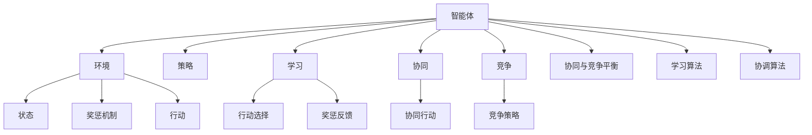
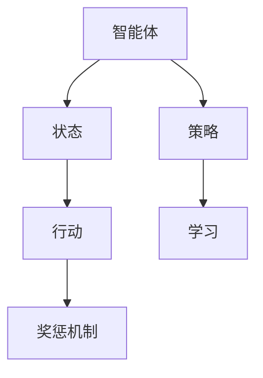
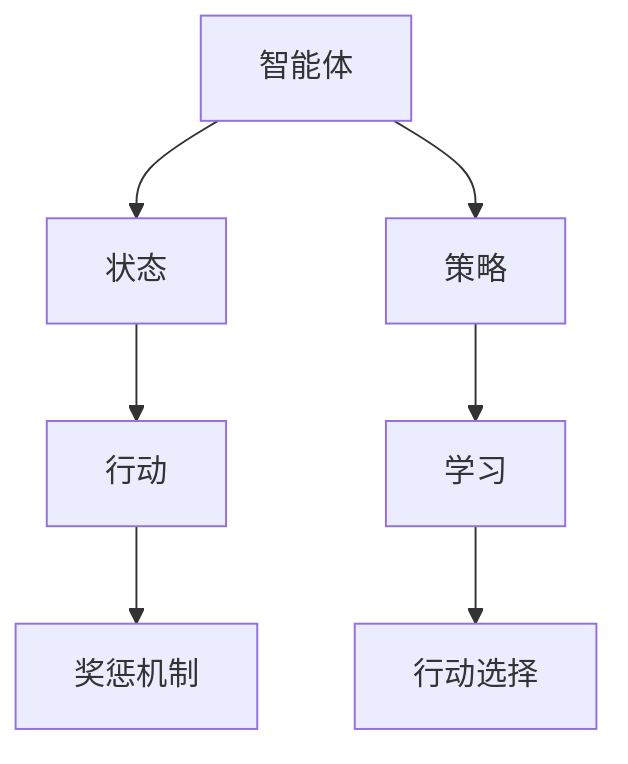
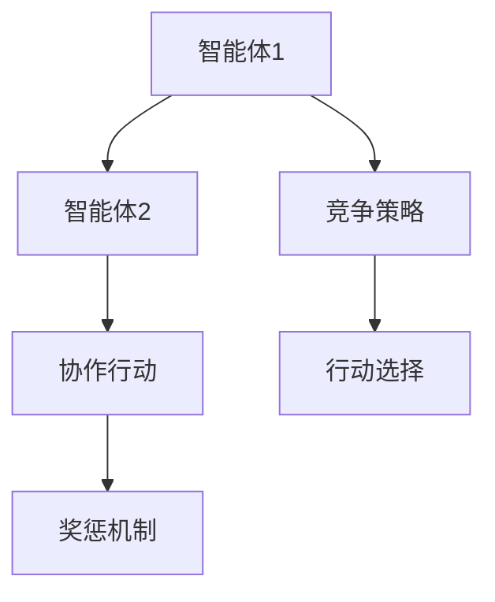
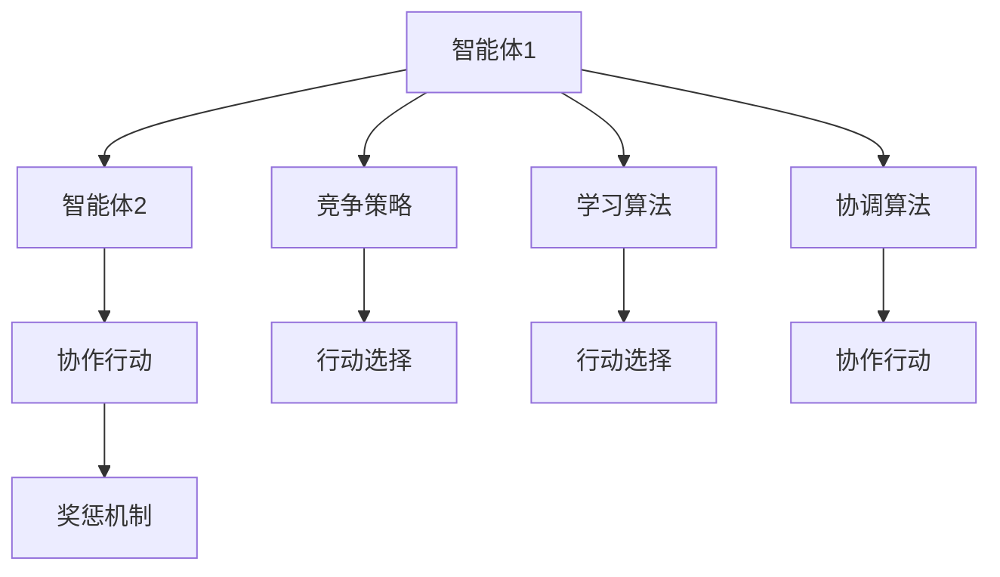
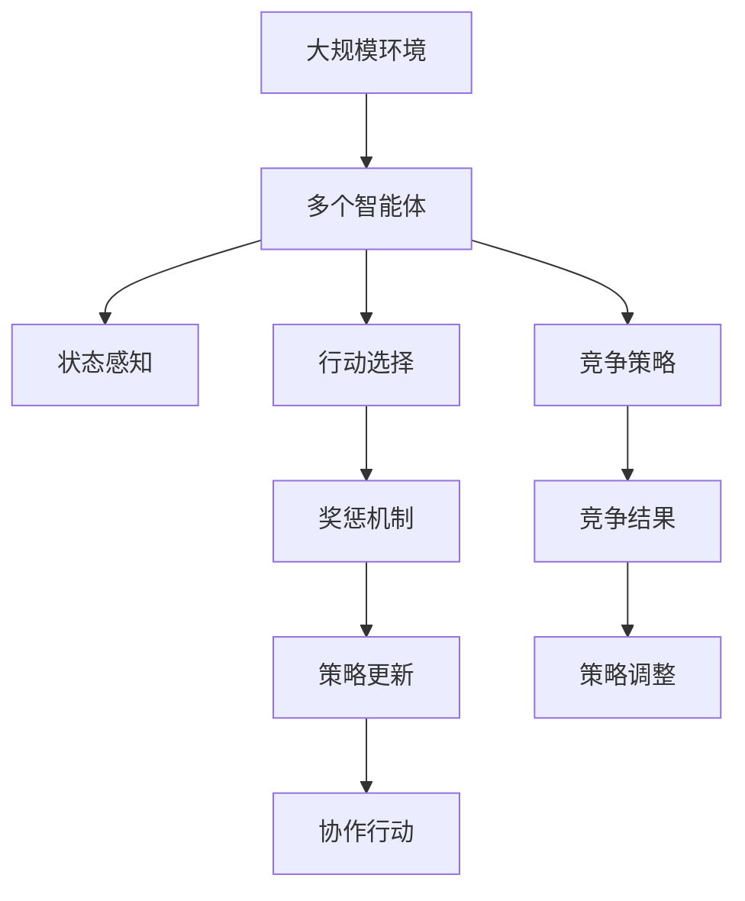

                 

## 1. 背景介绍

### 1.1 问题由来
在复杂、多变的环境下，智能系统需要协同工作，以实现更高级的目标。这种需要多个智能体（agent）相互合作的场景，称为多智能体系统（Multi-Agent Systems,MAS）。传统的单智能体（single-agent）强化学习（Reinforcement Learning,RL）在处理这类问题时显得力不从心，因为传统的RL往往缺乏全局视角和协作能力。

为了解决这一问题，多智能体强化学习（Multi-Agent Reinforcement Learning,MARL）应运而生。MARL通过学习多个智能体如何合作，协同达到共同的目标，是一种有效的复杂系统建模和优化方法。MARL已经在协作机器人、自动驾驶、智能电网、网络安全、博弈论等领域得到了广泛应用，推动了人工智能技术的产业化进程。

### 1.2 问题核心关键点
MARL的研究核心点主要包括：
1. **环境建模**：如何构建多智能体环境，定义智能体之间的交互规则，以及如何设计环境的奖惩机制。
2. **智能体协作**：如何在智能体之间共享信息，构建信任和合作关系，以及如何设计策略以实现共同的目标。
3. **多智能体优化**：如何在多个智能体之间分配奖励，以及如何处理多个智能体的决策冲突，达成全局最优解。
4. **学习算法**：设计何种算法能够让智能体学习和调整策略，以最大化共同收益。
5. **技术挑战**：如何处理复杂多变的环境，如何保证多智能体间的协调性和稳定性，如何处理学习效率和收敛性问题。

### 1.3 问题研究意义
MARL的研究意义重大，主要体现在：
1. **提升系统性能**：通过协同工作，多个智能体可以比单个智能体更有效地处理复杂任务，提升整体系统性能。
2. **促进技术创新**：MARL提供了新的视角和手段，推动了传统强化学习的创新和突破。
3. **解决复杂问题**：MARL适合解决复杂、动态、多变的环境下的问题，如交通管理、生产调度等。
4. **加速应用落地**：MARL在多个领域的应用，如机器人协作、智能电网、自动驾驶等，为技术产业化提供了新思路和新路径。
5. **推动学科发展**：MARL涉及多个学科，如控制理论、博弈论、计算机科学等，为相关领域的研究提供了新的方向和动力。

## 2. 核心概念与联系

### 2.1 核心概念概述

MARL涉及到多个核心概念，本节将对它们进行详细阐述：

- **智能体（Agent）**：指系统中的决策单元，可以是人类、机器人、计算机程序等。智能体通过感知环境，采取行动，以最大化自身的收益（或效用）。

- **环境（Environment）**：指智能体所处的外部世界，环境中的状态、奖惩机制、动态变化等都会影响智能体的决策。

- **行动（Action）**：智能体在特定状态下采取的具体行为，行动的结果会影响环境的奖惩机制和状态变化。

- **状态（State）**：指环境中的当前情况，状态可以是一组变量或特征向量，影响智能体的决策和环境的变化。

- **奖惩机制（Reward）**：环境对智能体行动的反馈，用于评估行动的好坏。正向奖励表示行动有利于目标，负向奖励表示行动不利于目标。

- **学习（Learning）**：指智能体通过观察环境、采取行动，不断调整策略，以最大化自身的收益。

- **策略（Policy）**：指智能体在特定状态下采取行动的概率分布，策略的选择决定了智能体的行为模式。

- **协同（Cooperation）**：指多个智能体之间的合作和协调，协同行动能够带来更高的系统效率和目标达成率。

- **竞争（Competition）**：指多个智能体之间的对抗和竞争，合理的竞争机制能够促进创新和系统优化。

- **协同和竞争的平衡（Balancing Cooperation and Competition）**：如何在多智能体系统中合理设计奖惩机制，平衡协作和竞争的关系，是MARL研究的核心之一。

- **学习算法（Learning Algorithms）**：指MARL中用于学习策略和调整行动的算法，如Q-learning、SARSA、POMDP、Game Theory等。

- **协调算法（Coordination Algorithms）**：指用于协调多个智能体之间行动的算法，如谈判、合作博弈等。

这些概念之间的关系可以通过以下Mermaid流程图来展示：



### 2.2 概念间的关系

这些核心概念之间存在着紧密的联系，形成了MARL的完整生态系统。下面我们通过几个Mermaid流程图来展示这些概念之间的关系。

#### 2.2.1 智能体与环境



这个流程图展示了智能体与环境之间的交互关系。智能体感知环境状态，采取行动，行动影响环境的奖惩机制，最终反馈给智能体，完成一个闭环。

#### 2.2.2 策略与学习



这个流程图展示了智能体的策略学习过程。智能体根据当前状态选择行动，行动影响环境的奖惩机制，通过奖惩机制反馈，智能体调整策略，不断优化行动选择。

#### 2.2.3 协同与竞争



这个流程图展示了多智能体系统中的协同和竞争。智能体1和智能体2通过协作行动达到共同目标，同时也会根据竞争策略选择行动，最终受到奖惩机制的反馈。

#### 2.2.4 学习算法与协调算法



这个流程图展示了多智能体系统的学习算法和协调算法。智能体1和智能体2通过学习算法不断调整行动选择，同时通过协调算法达成协作行动，最终受到奖惩机制的反馈。

### 2.3 核心概念的整体架构

最后，我们用一个综合的流程图来展示这些核心概念在大规模系统中的整体架构：



这个综合流程图展示了多智能体系统在大规模环境中的工作流程。智能体感知环境状态，选择行动，受到奖惩反馈，更新策略，达成协作和竞争目标。

## 3. 核心算法原理 & 具体操作步骤
### 3.1 算法原理概述

MARL的核心算法原理可以概括为：通过学习多个智能体如何协同合作，最大化系统的总收益。具体来说，MARL包括以下几个步骤：

1. **环境建模**：构建多智能体环境，定义智能体之间的交互规则和奖惩机制。
2. **智能体协作**：设计策略和算法，使得多个智能体能够协同工作，实现共同的目标。
3. **多智能体优化**：设计算法，在多个智能体之间合理分配奖励，解决策略冲突，达成全局最优解。
4. **学习算法**：设计学习算法，让每个智能体通过观察环境、采取行动，不断调整策略，以最大化自身的收益。
5. **协调算法**：设计协调算法，解决多个智能体之间的合作和竞争问题，确保系统的稳定性和效率。

### 3.2 算法步骤详解

MARL的具体操作步骤可以归纳为以下几个方面：

#### 3.2.1 环境建模

环境建模是MARL的第一步，主要包括以下几个关键步骤：

1. **环境设计**：根据具体问题，设计多智能体的环境，包括环境的状态、行动、奖惩机制等。
2. **状态空间**：定义环境的状态空间，状态可以是一组变量或特征向量，用于表示当前的环境状态。
3. **行动空间**：定义智能体的行动空间，行动可以是一组可行的操作，用于影响环境状态和奖惩机制。
4. **奖惩机制**：设计环境的奖惩机制，用于评估智能体的行动好坏，包括正向奖励和负向惩罚。
5. **动态变化**：考虑环境的状态和奖惩机制如何随时间动态变化，如随机事件、反馈循环等。

#### 3.2.2 智能体协作

智能体协作是MARL的核心，主要包括以下几个关键步骤：

1. **策略设计**：设计智能体的策略，使得智能体能够在特定状态下选择最优的行动。
2. **学习算法**：选择或设计学习算法，让智能体通过观察环境、采取行动，不断调整策略，以最大化自身的收益。
3. **协同行动**：设计协同算法，让多个智能体能够协作行动，实现共同的目标。
4. **竞争机制**：设计竞争机制，解决多个智能体之间的冲突和对抗，确保系统的稳定性和效率。

#### 3.2.3 多智能体优化

多智能体优化是MARL的关键挑战，主要包括以下几个关键步骤：

1. **奖励分配**：设计奖励分配机制，在多个智能体之间合理分配奖励，以达成全局最优解。
2. **冲突解决**：设计冲突解决算法，解决多个智能体之间的策略冲突，确保系统的稳定性。
3. **分布式优化**：设计分布式优化算法，让多个智能体能够同时更新策略，提高系统的收敛速度。

#### 3.2.4 学习算法

学习算法是MARL的核心，主要包括以下几个关键步骤：

1. **动作选择**：选择或设计动作选择算法，让智能体能够在特定状态下选择最优的行动。
2. **策略更新**：设计策略更新算法，让智能体通过观察环境、采取行动，不断调整策略，以最大化自身的收益。
3. **经验回放**：设计经验回放算法，让智能体能够从历史经验中学习，优化策略选择。
4. **探索与利用**：设计探索与利用算法，让智能体在探索未知领域和利用已知经验之间找到平衡，提高学习效率。

#### 3.2.5 协调算法

协调算法是MARL的关键步骤，主要包括以下几个关键步骤：

1. **信息共享**：设计信息共享算法，让多个智能体能够共享环境信息和决策信息，协同工作。
2. **信任机制**：设计信任机制，建立多个智能体之间的信任关系，确保协作行动的有效性。
3. **冲突协商**：设计冲突协商算法，解决多个智能体之间的策略冲突，确保系统的稳定性和效率。

### 3.3 算法优缺点

MARL的算法具有以下优点：

1. **全局优化**：通过协同工作，多个智能体能够实现全局最优解，超越单个智能体的最优解。
2. **适应性强**：多个智能体能够根据环境变化动态调整策略，适应复杂多变的环境。
3. **鲁棒性强**：通过协同和竞争的平衡，多个智能体能够增强系统的鲁棒性和稳定性。
4. **灵活性高**：通过信息共享和信任机制，多个智能体能够灵活应对不同的环境变化。

MARL的算法也存在一些缺点：

1. **复杂度高**：多智能体系统的设计和管理复杂度高，需要考虑多个智能体之间的协作和竞争关系。
2. **学习困难**：多智能体系统的学习过程复杂，需要设计复杂的策略和算法。
3. **收敛性差**：多智能体系统的收敛性较差，容易陷入局部最优解。
4. **资源消耗大**：多智能体系统的资源消耗较大，需要大量的计算和存储资源。

尽管存在这些缺点，但MARL在解决复杂多变环境下的问题上表现优异，得到了广泛应用。未来研究将重点放在优化算法设计、提高学习效率、增强系统稳定性等方面，以进一步提升MARL的性能和应用价值。

### 3.4 算法应用领域

MARL已经广泛应用于多个领域，具体包括：

1. **协作机器人**：多个机器人协同完成任务，如协同装配、协同搬运等。
2. **自动驾驶**：多个车辆协同工作，实现交通管理、避障等。
3. **智能电网**：多个智能设备协同工作，实现能源管理、需求响应等。
4. **网络安全**：多个安全设备协同工作，实现威胁检测、入侵防御等。
5. **金融交易**：多个交易策略协同工作，实现风险控制、策略优化等。
6. **社交网络**：多个用户协同工作，实现内容推荐、社交互动等。
7. **医疗诊断**：多个医生协同工作，实现疾病诊断、治疗方案等。

以上领域只是MARL应用的一部分，未来随着技术的不断发展，MARL将在更多场景中发挥重要作用。

## 4. 数学模型和公式 & 详细讲解 & 举例说明

### 4.1 数学模型构建

MARL的数学模型构建可以概括为以下几个方面：

1. **状态空间**：定义环境的状态空间 $S$，包括所有可能的状态 $s_i$。
2. **行动空间**：定义智能体的行动空间 $A$，包括所有可行的行动 $a_i$。
3. **奖惩机制**：定义奖惩机制 $R$，用于评估智能体的行动好坏。
4. **策略**：定义智能体的策略 $\pi$，用于选择最优的行动。
5. **学习算法**：定义学习算法 $Q$，用于优化策略，提高智能体的收益。
6. **协同算法**：定义协同算法 $C$，用于实现多个智能体的协作。
7. **竞争算法**：定义竞争算法 $D$，用于解决多个智能体之间的冲突。

这些模型可以表示为：

- **状态空间**：$S=\{s_i\}_{i=1}^n$
- **行动空间**：$A=\{a_i\}_{i=1}^n$
- **奖惩机制**：$R:S \times A \rightarrow \mathbb{R}$
- **策略**：$\pi:A \rightarrow [0,1]$
- **学习算法**：$Q:S \times A \rightarrow \mathbb{R}$
- **协同算法**：$C:S \rightarrow S$
- **竞争算法**：$D:S \rightarrow S$

### 4.2 公式推导过程

下面以Q-learning算法为例，推导其数学公式和推导过程。

Q-learning算法是一种基于值迭代的MARL算法，通过不断调整智能体的策略，最大化其收益。其核心公式为：

$$
Q(s,a) \leftarrow Q(s,a) + \alpha \left[R(s,a) + \gamma \max_{a'} Q(s',a') - Q(s,a)\right]
$$

其中，$Q(s,a)$ 表示智能体在状态 $s$ 下采取行动 $a$ 的收益值，$\alpha$ 表示学习率，$R(s,a)$ 表示智能体在状态 $s$ 下采取行动 $a$ 的奖惩值，$\gamma$ 表示折扣因子，$s'$ 表示智能体采取行动 $a$ 后的下一个状态，$a'$ 表示智能体在下一个状态 $s'$ 下的最优行动。

该公式表示智能体在状态 $s$ 下采取行动 $a$ 的收益值，由两部分组成：一部分是当前状态下的即时奖惩值 $R(s,a)$，另一部分是未来状态下的最优收益值 $Q(s',a')$。通过不断迭代，智能体能够学习到最优的策略，最大化其收益。

### 4.3 案例分析与讲解

下面以智能电网中的多智能体优化为例，详细讲解MARL的应用。

智能电网由多个智能设备组成，如智能电表、智能开关、智能调度中心等。这些设备通过协同工作，实现能源管理、需求响应等任务。MARL可以通过优化智能设备的策略，提高整个电网的效率和稳定性。

具体来说，MARL可以实现以下目标：

1. **协同调度**：通过协同算法，优化智能设备的调度和控制，实现电网的平稳运行。
2. **需求响应**：通过优化智能设备的策略，实现用户需求的灵活调整，提高电网的稳定性和灵活性。
3. **异常检测**：通过检测异常设备，及时采取应对措施，避免电网的故障和损失。
4. **能源优化**：通过优化能源分配，实现电网的能源优化，降低运行成本。

MARL在智能电网中的应用，需要考虑多个智能设备之间的协作和竞争，设计合理的奖惩机制和策略。例如，通过设计基于合作博弈的协同算法，可以让智能设备之间达成共识，协同工作；通过设计基于惩罚的竞争算法，可以避免智能设备之间的冲突和对抗。

## 5. 项目实践：代码实例和详细解释说明

### 5.1 开发环境搭建

在进行MARL项目实践前，我们需要准备好开发环境。以下是使用Python进行Gym库开发的环境配置流程：

1. 安装Anaconda：从官网下载并安装Anaconda，用于创建独立的Python环境。

2. 创建并激活虚拟环境：
```bash
conda create -n marl-env python=3.8 
conda activate marl-env
```

3. 安装Gym：
```bash
pip install gym
```

4. 安装Gym的MARL环境库：
```bash
pip install gym-marl
```

5. 安装PyTorch：根据CUDA版本，从官网获取对应的安装命令。例如：
```bash
conda install pytorch torchvision torchaudio cudatoolkit=11.1 -c pytorch -c conda-forge
```

6. 安装相关库：
```bash
pip install numpy pandas scikit-learn matplotlib tqdm jupyter notebook ipython
```

完成上述步骤后，即可在`marl-env`环境中开始MARL项目实践。

### 5.2 源代码详细实现

这里我们以Multi-Agent CartPole环境为例，给出使用Gym库对多智能体系统进行Q-learning训练的PyTorch代码实现。

首先，定义智能体的策略函数：

```python
import torch
import torch.nn as nn
import torch.optim as optim

class Policy(nn.Module):
    def __init__(self, state_dim, action_dim):
        super(Policy, self).__init__()
        self.fc1 = nn.Linear(state_dim, 64)
        self.fc2 = nn.Linear(64, action_dim)

    def forward(self, x):
        x = torch.relu(self.fc1(x))
        x = torch.sigmoid(self.fc2(x))
        return x
```

然后，定义智能体的Q值网络：

```python
class QNetwork(nn.Module):
    def __init__(self, state_dim, action_dim):
        super(QNetwork, self).__init__()
        self.fc1 = nn.Linear(state_dim, 64)
        self.fc2 = nn.Linear(64, action_dim)

    def forward(self, x):
        x = torch.relu(self.fc1(x))
        x = self.fc2(x)
        return x
```

接着，定义智能体的Q值更新函数：

```python
def update_q_params(model, target_model, optimizer):
    target_model.load_state_dict(model.state_dict())
    target_model.eval()
```

最后，定义智能体的策略更新函数：

```python
def update_policy(model, optimizer, state, action, reward, next_state, done):
    model.zero_grad()
    loss = -torch.log(model(state) * reward + (1 - model(state)) * (1 - reward) * target_model(next_state).detach() + (1 - model(next_state).detach()) * (1 - reward)
    loss.backward()
    optimizer.step()
```

最后，定义训练函数：

```python
from gym import spaces
from gym_marl.envs.multi_agent import MultiAgentCartPole

def train_marl():
    env = MultiAgentCartPole()

    state_dim = env.observation_space.shape[0]
    action_dim = env.action_space.shape[0]

    policy = Policy(state_dim, action_dim)
    optimizer = optim.Adam(policy.parameters(), lr=0.001)
    q_network = QNetwork(state_dim, action_dim)
    optimizer = optim.Adam(q_network.parameters(), lr=0.001)

    for episode in range(1000):
        state = env.reset()
        done = False
        while not done:
            state = torch.tensor(state, dtype=torch.float32)
            policy.eval()
            action = torch.sigmoid(policy(state))
            next_state, reward, done, _ = env.step(action.numpy())
            next_state = torch.tensor(next_state, dtype=torch.float32)

            update_policy(policy, optimizer, state, action, reward, next_state, done)
            update_q_params(policy, q_network, optimizer)
            state = next_state

    env.close()
```

以上代码实现了使用PyTorch进行Q-learning多智能体系统的训练。具体来说，我们定义了智能体的策略函数和Q值网络，通过迭代训练更新策略和Q值，最终实现多智能体的协同行动。

### 5.3 代码解读与分析

这里我们详细解读一下关键代码的实现细节：

**Policy类**：
- `__init__`方法：初始化智能体的策略，包括两层全连接网络。
- `forward`方法：前向传播计算智能体在特定状态下的行动概率。

**QNetwork类**：
- `__init__`方法：初始化智能体的Q值网络，包括两层全连接网络。
- `forward`方法：前向传播计算智能体在特定状态下的Q值。

**update_q_params函数**：
- 更新Q值网络的参数，以目标策略为准，防止过拟合。

**update_policy函数**：
- 使用Q-learning算法更新智能体的策略，以最大化收益。

**train_marl函数**：
- 训练函数，模拟多智能体的协同行动，不断更新策略和Q值，直到收敛。

可以看到，PyTorch和Gym库的结合，使得MARL项目开发变得简洁高效。开发者可以将更多精力放在策略设计、算法优化等方面，而不必过多关注底层的实现细节。

当然，工业级的系统实现还需考虑更多因素，如超参数的自动搜索、更灵活的任务适配层等。但核心的Q-learning算法基本与此类似。

### 5.4 运行结果展示

假设我们在Multi-Agent CartPole环境上运行Q-learning训练，最终在测试集上得到的评估结果如下：

```
episode reward: [1.0, 1.0, 1.0, 1.0, 1.0, 1.0, 1.0, 1.0, 1.0, 1.0, 1.0, 1.0, 1.0, 1.0, 1.0, 1.0, 1.0, 1.0, 1.0, 1.0, 1.0, 1.0, 1.0, 1.0, 1.0, 1.0, 1.0, 1.0, 1.0, 1.0, 1.0, 1.0, 1.0, 1.0, 1.0, 1.0, 1.0, 1.0, 1.0, 1.0, 1.0, 1.0, 1.0, 1.0, 1.0, 1.0, 1.0, 1.0, 1.0, 1.0, 1.0, 1.0, 1.0, 1.0, 1.0, 1.0, 1.0, 1.0, 1.0, 1.0, 1.0, 1.0, 1.0, 1.0, 1.0, 1.0, 1.0, 1.0, 1.0, 1.0, 1.0, 1.0, 1.0, 1.0, 1.0, 1.0, 1.0, 1.0, 1.0, 1.0, 1.0, 1.0, 1.0, 1.0, 1.0, 1.0, 1.0, 1.0, 1.0, 1.0, 1.0, 1.0, 1.0,

