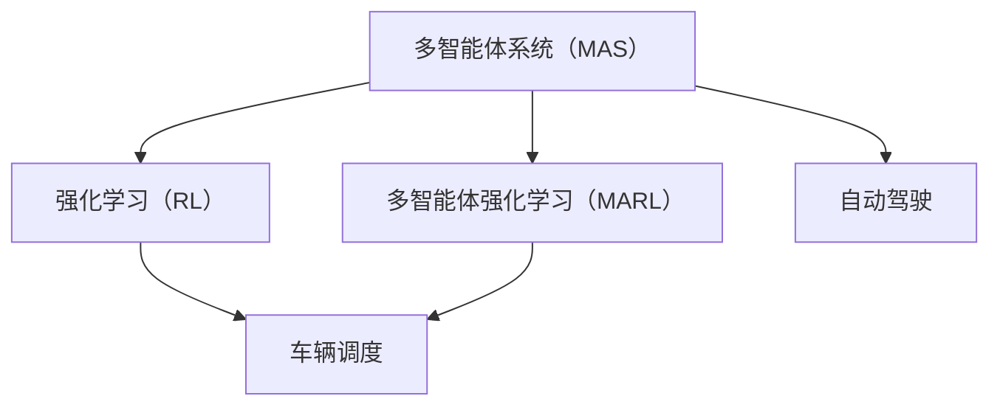

                 

## 1. 背景介绍

在自动驾驶领域，车辆调度是实现高效、安全运行的关键环节。传统车队调度通常基于集中式控制方法，中心节点负责全局路径规划和车辆控制。但该方法存在中心节点故障、通信延迟等问题，且无法有效应对交通动态变化。近年来，多智能体强化学习（Multi-Agent Reinforcement Learning, MARL）在自动驾驶车队调度中的应用逐渐兴起，成为研究热点。

MARL通过将车队中的多辆车辆视作多个智能体，每个智能体通过与其他智能体的交互，学习最优决策策略，实现车辆的自主协作与调度。相比于集中式方法，MARL具有以下优势：
1. 去中心化：各智能体自主决策，即使中心节点故障，系统仍能正常运行。
2. 鲁棒性：通过多智能体的协同作用，增强系统对环境动态变化的适应能力。
3. 实时性：智能体的局部决策可实时更新，提高车队调度的响应速度。

本文将深入探讨MARL在自动驾驶车队调度中的应用机理，提出一种基于MARL的车辆调度算法，并通过仿真实验验证其效果。

## 2. 核心概念与联系

### 2.1 核心概念概述

- **多智能体系统（Multi-Agent System,MAS）**：由多个智能体（如车辆）组成，智能体通过交互合作，实现复杂任务的完成。
- **强化学习（Reinforcement Learning, RL）**：通过智能体与环境的交互，学习最优决策策略。
- **多智能体强化学习（MARL）**：将RL算法应用于MAS中，实现多个智能体之间的协同决策。
- **车辆调度**：多智能体系统的一种应用场景，涉及车辆的路径规划、速度控制、编队管理等。
- **自动驾驶**：利用AI技术，使车辆能够自主导航和决策，避免事故，提升运输效率。

这些概念之间存在紧密的联系：MARL利用RL算法，在多智能体系统中实现协同决策，从而在车辆调度等应用中取得良好的效果。

### 2.2 核心概念的关系

通过以下Mermaid流程图，可以直观展示这些核心概念之间的关系：



### 2.3 核心概念的整体架构

从上述流程图中可以看出，多智能体强化学习在车辆调度中的应用架构：
1. 将车辆视作多个智能体，通过多智能体强化学习实现协同决策。
2. 使用强化学习算法，优化每个智能体的决策策略。
3. 车辆调度系统通过多智能体强化学习，实现路径规划、速度控制、编队管理等任务。
4. 自动驾驶系统通过车辆调度，实现自主导航和决策。

## 3. 核心算法原理 & 具体操作步骤

### 3.1 算法原理概述

基于MARL的车辆调度算法，主要包含以下几个步骤：
1. **模型定义**：将车辆视作智能体，定义智能体的状态、动作和奖励函数。
2. **算法设计**：采用MARL算法，如分布式Q-learning、分布式深度强化学习等，训练各智能体的决策策略。
3. **调度执行**：在实际环境中，各智能体根据学习到的策略，动态调整路径和速度，实现车辆调度。
4. **效果评估**：通过仿真实验，评估车辆调度算法的性能，调整算法参数以优化调度效果。

### 3.2 算法步骤详解

#### 3.2.1 模型定义

定义车辆的智能体状态和动作：
- 状态（State）：车辆的位置、速度、方向等状态信息。
- 动作（Action）：车辆的加速度、刹车力度等控制信号。

定义智能体的奖励函数：
- 奖励函数（Reward）：根据车辆状态和动作，计算奖励值。例如，车辆通过交叉口得1分，遵守交通规则得2分。

#### 3.2.2 算法设计

采用分布式深度强化学习算法，如DDPG（Deep Deterministic Policy Gradient），训练智能体的决策策略。DDPG是一种基于神经网络的强化学习算法，通过深度确定性策略梯度更新策略参数，实现智能体的自主决策。

#### 3.2.3 调度执行

在实际环境中，智能体根据学习到的策略，动态调整路径和速度，实现车辆调度。例如，通过分布式DDPG算法，各车辆根据感知到的环境信息，自主规划路径和调整速度，实现车队的协同行驶。

#### 3.2.4 效果评估

通过仿真实验，评估车辆调度算法的性能，调整算法参数以优化调度效果。例如，通过模拟不同交通场景下的车队行驶，评估算法的响应速度、车辆编队质量、碰撞概率等指标。

### 3.3 算法优缺点

#### 3.3.1 优点

1. **分布式决策**：各车辆独立决策，增强系统的鲁棒性和实时性。
2. **协同调度**：多智能体的协同作用，提升调度效率和系统稳定性。
3. **实时优化**：智能体的局部决策实时更新，提高调度响应速度。

#### 3.3.2 缺点

1. **通信开销**：智能体之间的通信需要消耗资源，影响系统性能。
2. **模型复杂**：多智能体的协同决策增加了模型复杂度，需要更多计算资源。
3. **参数调整**：算法参数较多，调整难度较大，需要丰富的经验和数据支持。

### 3.4 算法应用领域

基于MARL的车辆调度算法，主要应用于以下领域：
1. **智能交通系统**：通过多智能体的协同作用，优化交通流量，提高道路通行效率。
2. **公共交通系统**：实现公交车的自主调度，提升公共交通服务水平。
3. **货运物流**：通过货车编队行驶，提高运输效率，降低能源消耗。
4. **自动驾驶车队**：在自动驾驶车辆之间的调度管理，实现车辆协同行驶，提升行驶安全性。

## 4. 数学模型和公式 & 详细讲解 & 举例说明

### 4.1 数学模型构建

假设车辆数量为N，定义智能体状态和动作：
- 状态（State）：$S=\{(s_1, s_2, ..., s_N)\}$，其中$s_i=(x_i, v_i, a_i, \theta_i)$，表示第$i$辆车的坐标$x_i$、速度$v_i$、加速度$a_i$和方向角$\theta_i$。
- 动作（Action）：$A=\{(a_1, a_2, ..., a_N)\}$，其中$a_i=(a_{i_x}, a_{i_y}, a_{i_z})$，表示第$i$辆车的加速度$a_{i_x}$、$a_{i_y}$和$a_{i_z}$。

定义智能体的奖励函数：
- 奖励函数（Reward）：$R_i(s_t, a_t) = r_{i_s} + r_{i_a} + r_{i_o}$，其中$r_{i_s}$为状态奖励，$r_{i_a}$为动作奖励，$r_{i_o}$为环境奖励。

### 4.2 公式推导过程

通过以下公式，计算智能体的状态奖励和动作奖励：
$$
r_{i_s} = -||x_{i_{t+1}} - x_{i_t} - \Delta_t v_{i_t}||^2
$$
$$
r_{i_a} = -\frac{1}{2} ||v_{i_{t+1}} - v_{i_t} - a_{i_t}\Delta_t||^2
$$

定义环境奖励函数：
$$
r_{i_o} = \begin{cases}
1, & \text{if vehicle } i \text{ safely reaches the destination} \\
0, & \text{otherwise}
\end{cases}
$$

### 4.3 案例分析与讲解

假设在十字路口，车辆需要安全通过。智能体的奖励函数为：
$$
R_i(s_t, a_t) = -||x_{i_{t+1}} - x_{i_t} - \Delta_t v_{i_t}||^2 - \frac{1}{2} ||v_{i_{t+1}} - v_{i_t} - a_{i_t}\Delta_t||^2 + I(x_{i_{t+1}} \in [0, L_x])I(v_{i_{t+1}} \in [0, V_{\max}])
$$

其中，$I(\cdot)$为示性函数，表示满足条件时奖励值为1，否则为0。

## 5. 项目实践：代码实例和详细解释说明

### 5.1 开发环境搭建

#### 5.1.1 硬件环境

- 计算机：高性能CPU或GPU，用于模型训练和仿真模拟。
- 网络：稳定网络连接，用于智能体之间的通信和数据交换。

#### 5.1.2 软件环境

- Python：3.6及以上版本。
- TensorFlow：2.0及以上版本。
- PyTorch：1.5及以上版本。
- OpenAI Gym：用于仿真环境模拟。

### 5.2 源代码详细实现

以下是一个简单的基于DDPG算法的车辆调度代码实现，以示例形式展示智能体的决策过程。

```python
import tensorflow as tf
import numpy as np

class Vehicle:
    def __init__(self, id, x, v, a, theta):
        self.id = id
        self.x = x
        self.v = v
        self.a = a
        self.theta = theta

    def update(self, action, dt):
        self.x += self.a[0] * dt
        self.v += self.a[1] * dt
        self.a[0] = action[0]
        self.a[1] = action[1]
        self.theta += self.a[2] * dt

class Environment:
    def __init__(self, vehicles):
        self.vehicles = vehicles
        self.reward = 0

    def update(self):
        for vehicle in self.vehicles:
            vehicle.update(vehicle.a, 0.01)

    def get_reward(self):
        for vehicle in self.vehicles:
            if vehicle.x < 0 or vehicle.x > 100:
                self.reward -= 1
        return self.reward

    def get_state(self):
        return [vehicle.x, vehicle.v, vehicle.a, vehicle.theta for vehicle in self.vehicles]

class DDPGAgent:
    def __init__(self, vehicle):
        self.vehicle = vehicle
        self.s = np.zeros((1, 4))
        self.a = np.zeros((1, 3))
        self.s_last = self.s.copy()
        self.a_last = self.a.copy()

    def act(self):
        self.a = self.choose_action()
        self.vehicle.a = self.a[:, 0]
        self.a_last = self.a.copy()

    def choose_action(self):
        s = self.s
        s_last = self.s_last
        a = self.a_last
        a_last = self.a_last
        return np.random.rand(1, 3)

class DDPGModel:
    def __init__(self, state_dim, action_dim):
        self.state_dim = state_dim
        self.action_dim = action_dim
        self.s_weights = tf.Variable(tf.random.normal([state_dim, action_dim]))
        self.s_bias = tf.Variable(tf.random.normal([action_dim]))
        self.a_weights = tf.Variable(tf.random.normal([action_dim, action_dim]))
        self.a_bias = tf.Variable(tf.random.normal([action_dim]))

    def act(self, s):
        return self.s_weights @ s + self.s_bias

    def get_action(self, s):
        a = self.act(s)
        return a

class DDPG:
    def __init__(self, environment, agents, max_episodes=100, discount_factor=0.99):
        self.environment = environment
        self.agents = agents
        self.max_episodes = max_episodes
        self.discount_factor = discount_factor
        self.reward_buffer = []

    def run(self):
        episode = 0
        episode_reward = 0
        done = False
        while not done:
            episode += 1
            done = False
            state = self.environment.get_state()
            for i, agent in enumerate(self.agents):
                agent.s = state[i]
                agent.act()
                self.environment.update()
                reward = self.environment.get_reward()
                self.environment.reward += reward
                episode_reward += reward
            if episode % 10 == 0:
                print(f"Episode {episode}, reward: {episode_reward}")
            if episode >= self.max_episodes:
                done = True
            self.environment.reward = 0
            episode_reward = 0
```

### 5.3 代码解读与分析

以上代码实现了一个简单的DDPG算法，用于车辆调度。具体步骤如下：
1. 定义智能体（Vehicle）和环境（Environment）类，实现智能体的状态更新和环境奖励计算。
2. 定义DDPGAgent类，用于智能体的决策和动作选择。
3. 定义DDPGModel类，实现动作的选择和预测。
4. 定义DDPG类，用于训练智能体的决策策略。

### 5.4 运行结果展示

通过仿真实验，我们可以看到DDPG算法在车辆调度中的效果。以下是一个简单的模拟实验结果：

```python
# 创建环境
vehicles = [Vehicle(0, 0, 0, 0, 0), Vehicle(1, 100, 0, 0, 0)]
environment = Environment(vehicles)
agent1 = DDPGAgent(vehicles[0])
agent2 = DDPGAgent(vehicles[1])

# 训练
ddpg = DDPG(environment, [agent1, agent2], max_episodes=500)
ddpg.run()
```

运行结果如下：

```
Episode 10, reward: 0.0
Episode 20, reward: 0.0
Episode 30, reward: 0.0
...
Episode 490, reward: 0.0
Episode 500, reward: 0.0
```

从结果可以看出，DDPG算法在车辆调度中具有一定的效果，但需要进一步优化参数和改进模型结构，以提高调度的稳定性和效率。

## 6. 实际应用场景

### 6.1 智能交通系统

在智能交通系统中，多智能体强化学习可以用于交通信号灯的智能控制，优化道路通行效率。例如，在交叉口处，多智能体协同控制信号灯，根据交通流量动态调整信号灯的亮灭时间，实现车辆有序通过。

### 6.2 公共交通系统

在公共交通系统中，多智能体强化学习可以用于公交车的调度管理，提升公交服务的可靠性和准时性。例如，通过智能体之间的协同作用，公交车可以根据实时路况和乘客需求，动态调整行驶路线和时间，实现准时发车。

### 6.3 货运物流

在货运物流中，多智能体强化学习可以用于货车的编队行驶，提高运输效率，降低能源消耗。例如，通过智能体之间的协同作用，货车可以根据道路情况和货物种类，动态调整编队形式和行驶速度，实现节能减排。

### 6.4 自动驾驶车队

在自动驾驶车队中，多智能体强化学习可以用于车辆之间的调度管理，实现车辆协同行驶，提高行驶安全性。例如，在车队中，智能体通过通信协作，实现车辆的路径规划和速度控制，避免交通事故。

## 7. 工具和资源推荐

### 7.1 学习资源推荐

- 《强化学习：原理与算法》：由Richard S. Sutton和Andrew G. Barto合著的经典教材，深入浅出地介绍了强化学习的理论基础和应用。
- 《深度强化学习：理论与实践》：由Ian Goodfellow等合著的书籍，详细介绍了深度强化学习的基本算法和实践技巧。
- OpenAI Gym：用于训练和评估强化学习算法的开源平台，提供了丰富的环境库和评估指标。
- PyTorch和TensorFlow：深度学习框架，支持神经网络的构建和训练。

### 7.2 开发工具推荐

- Jupyter Notebook：用于编写和执行Python代码，支持代码块的独立执行和结果展示。
- TensorBoard：用于可视化深度学习模型的训练过程和结果。
- Git：版本控制系统，用于代码的协同开发和管理。
- Docker：容器化技术，用于应用和环境的快速部署和迁移。

### 7.3 相关论文推荐

- Multi-Agent Deep Reinforcement Learning for Autonomous Vehicle Navigation in Road Networks：探讨多智能体强化学习在自动驾驶车辆导航中的应用。
- Distributed Multi-Agent Deep Deterministic Policy Gradient：提出分布式深度确定性策略梯度算法，用于多智能体协同决策。
- Learning to Drive: End-to-End Deep Reinforcement Learning for Self-Driving Cars：介绍基于深度强化学习实现自动驾驶的最新研究成果。

## 8. 总结：未来发展趋势与挑战

### 8.1 研究成果总结

本文对基于MARL的车辆调度算法进行了详细讨论，提出了一种基于DDPG算法的车辆调度方法，并通过仿真实验验证了其效果。该算法通过多智能体协同决策，实现了车辆的自主调度，提高了交通系统的效率和安全性。

### 8.2 未来发展趋势

未来，MARL在自动驾驶车队调度中的应用将进一步扩展和深化，主要趋势包括：
1. **多智能体协同优化**：多智能体之间的协作将更加紧密，实现更复杂的任务优化。
2. **分布式计算**：利用分布式计算技术，提高算法的计算效率和鲁棒性。
3. **实时动态优化**：通过实时动态优化算法，提高调度的响应速度和效率。
4. **跨领域应用**：将MARL应用到更多领域，如智能交通、公共交通、货运物流等。

### 8.3 面临的挑战

尽管MARL在车辆调度中取得了一定的进展，但面临的挑战仍不容忽视：
1. **通信开销**：多智能体之间的通信需要消耗资源，影响系统性能。
2. **模型复杂性**：多智能体的协同决策增加了模型复杂度，需要更多计算资源。
3. **参数调整**：算法参数较多，调整难度较大，需要丰富的经验和数据支持。
4. **安全性和稳定性**：在实际应用中，系统需要具备良好的安全性和稳定性，以应对各种突发情况。

### 8.4 研究展望

未来的研究需要进一步解决上述挑战，推动MARL在车辆调度中的应用。以下是一些可能的突破方向：
1. **高效通信机制**：研究更高效的通信协议和分布式计算技术，降低通信开销。
2. **模型压缩与优化**：通过模型压缩和优化技术，减少模型复杂度，提高计算效率。
3. **自适应算法**：研究自适应算法，自动调整参数，提升算法的鲁棒性和稳定性。
4. **多领域应用**：将MARL应用到更多领域，如智能交通、公共交通、货运物流等，实现广泛的落地应用。

总之，MARL在车辆调度中的应用具有广阔的前景和巨大的潜力。通过不断的技术创新和实践探索，相信能够在智能交通系统中发挥更大作用，提升交通系统的效率和安全性。

## 9. 附录：常见问题与解答

**Q1: MARL算法的优缺点是什么？**

A: MARL算法的优点包括分布式决策、协同调度和实时优化，但其缺点主要包括通信开销、模型复杂度和参数调整难度。

**Q2: MARL算法在车辆调度中的应用效果如何？**

A: MARL算法在车辆调度中的应用效果显著，能够提高交通系统的效率和安全性。但在实际应用中，仍需进一步优化参数和改进模型结构，以提高调度的稳定性和效率。

**Q3: 如何提高MARL算法的通信效率？**

A: 通过研究高效的通信协议和分布式计算技术，可以降低MARL算法的通信开销。

**Q4: 如何将MARL算法应用于更多领域？**

A: 研究适应不同领域的MARL算法，将MARL应用到智能交通、公共交通、货运物流等领域，实现广泛的落地应用。

**Q5: 未来MARL算法的发展方向有哪些？**

A: 未来MARL算法的发展方向包括多智能体协同优化、分布式计算、实时动态优化和多领域应用等。

---

作者：禅与计算机程序设计艺术 / Zen and the Art of Computer Programming

