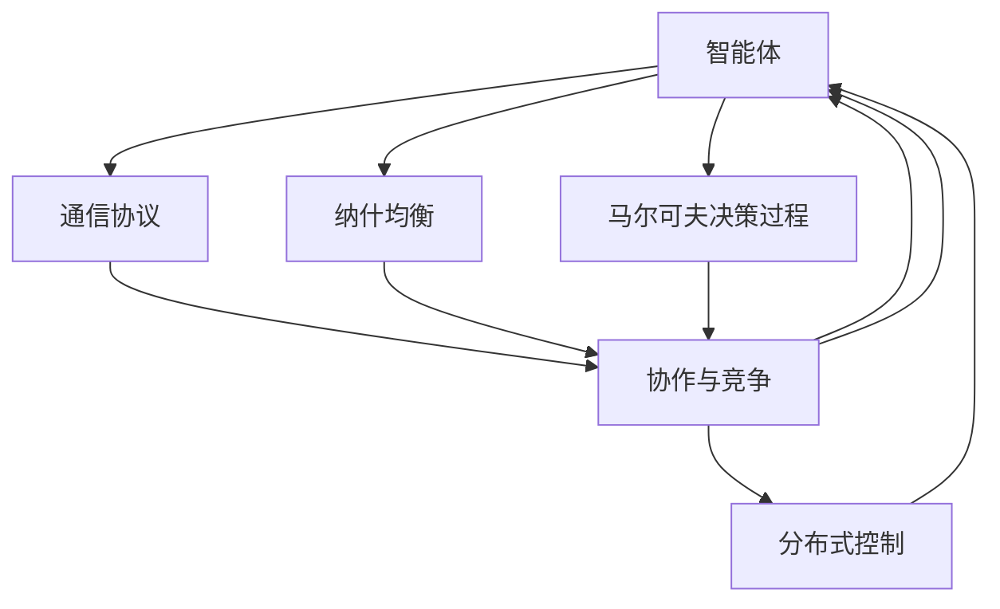

                 

# 多智能体系统 (Multi-Agent Systems) 原理与代码实例讲解

> 关键词：多智能体系统,分布式协同,合作与竞争,马尔可夫决策过程,纳什均衡,分布式控制,智能体交互

## 1. 背景介绍

### 1.1 问题由来

随着人工智能技术的发展，单一智能体的决策过程已经难以满足复杂系统的需求。在各种分布式协作、动态环境、非确定性系统中，多个智能体（Agent）需要协同工作，以实现最优的系统目标。多智能体系统（Multi-Agent Systems, MAS）应运而生，成为解决这类问题的重要工具。

MAS系统最早可以追溯到1970年代，最初是用于模拟复杂交互场景，如交通管理、工业控制等。随着AI技术的进步，MAS系统逐渐被广泛应用于军事、医疗、金融、社交等领域，涉及任务包括资源分配、协调控制、安全监控、市场交易、协同规划等。这些任务往往涉及多个智能体间的合作与竞争，需要动态适应环境变化，具有较强的非确定性和复杂性。

### 1.2 问题核心关键点

多智能体系统的主要特点包括：
- **分布式**：智能体之间分布式部署，可以并行执行任务。
- **自主性**：智能体根据自身状态和环境信息独立决策，无需集中控制。
- **交互性**：智能体之间通过通信协议进行信息交换，实现协同或竞争。
- **复杂性**：智能体数量和交互方式多种多样，需要高效的管理和优化算法。

MAS系统的核心挑战包括：
- **协作与竞争平衡**：如何在合作与竞争中实现均衡，提升系统整体性能。
- **环境感知与适应**：智能体如何动态感知环境变化，调整自身行为。
- **通信机制设计**：如何设计高效、鲁棒的通信协议，保证信息准确传递。
- **决策与规划**：如何设计高效的决策算法，使智能体能快速响应环境变化。

### 1.3 问题研究意义

研究多智能体系统具有重要意义：
- **优化资源利用**：通过多个智能体的协作，实现资源的最优分配和利用。
- **提升系统鲁棒性**：通过分散决策和异步控制，增强系统对故障和变化的抗干扰能力。
- **拓展应用场景**：MAS系统能适应各种分布式环境，拓宽AI技术的应用范围。
- **推动跨学科融合**：MAS系统涉及控制、优化、通信、游戏等多个领域，促进不同学科的交叉和创新。

## 2. 核心概念与联系

### 2.1 核心概念概述

为了更好地理解多智能体系统的核心概念，本节将介绍几个关键概念：

- **智能体（Agent）**：能够自主感知环境、执行决策、调整自身行为以实现目标的实体。在MAS系统中，智能体可以是人、机器、软件模块等。

- **通信协议（Communication Protocol）**：智能体之间交换信息的规则和机制，用于协调行为、共享状态等。

- **协作与竞争**：智能体之间可以存在合作、竞争、中立等关系，通过协作提升系统效率，通过竞争实现动态平衡。

- **分布式控制（Distributed Control）**：通过多个智能体的协作，实现对系统的全局控制，避免单一点故障。

- **纳什均衡（Nash Equilibrium）**：多智能体系统中的最优策略组合，使得每个智能体的行为最优，且在其它智能体行为给定的情况下，不会单方面偏离。

- **马尔可夫决策过程（Markov Decision Process, MDP）**：一种描述智能体在动态环境中进行决策的模型，通过状态转移概率和奖励函数描述智能体的行为选择。

这些核心概念之间通过通信协议、协作与竞争、分布式控制等机制，构成了MAS系统的完整框架。通过深入理解这些概念，可以更好地设计和实现MAS系统。

### 2.2 概念间的关系

这些核心概念之间的关系可以通过以下Mermaid流程图来展示：



这个流程图展示了大语言模型微调过程中各个核心概念的关系：

1. 智能体通过通信协议进行信息交换，形成协作与竞争关系。
2. 通信协议通过协作与竞争机制，影响智能体的行为。
3. 分布式控制通过多个智能体的协作，实现全局控制。
4. 纳什均衡描述智能体的最优策略组合。
5. MDP描述智能体在动态环境中的决策过程。

这些概念共同构成了MAS系统的基本框架，使得智能体之间能够高效协作，适应复杂多变的环境。通过理解这些核心概念，我们可以更好地设计和实现MAS系统。

## 3. 核心算法原理 & 具体操作步骤
### 3.1 算法原理概述

多智能体系统的核心算法原理主要包括以下几个方面：

1. **协作与竞争算法**：通过设计合理的通信协议和协作机制，实现智能体间的信息共享和行为协调。

2. **分布式控制算法**：通过多个智能体的协作，实现全局系统的控制和优化。

3. **马尔可夫决策过程（MDP）**：通过建模智能体在动态环境中的决策过程，优化智能体的行为策略。

4. **纳什均衡求解**：通过优化算法求解纳什均衡，使得系统达到最优策略组合。

5. **学习与优化算法**：通过强化学习等算法，使智能体能够动态学习最优策略，适应环境变化。

### 3.2 算法步骤详解

基于MAS系统的核心算法原理，我们可以详细讲解MAS系统的设计步骤：

**Step 1: 系统建模与定义**

1. **定义智能体**：明确每个智能体的目标、行为策略和通信协议。
2. **定义通信协议**：确定智能体之间的通信方式、数据格式和传输规则。
3. **定义环境模型**：建模环境的状态、转移概率和奖励函数，用于智能体的决策。

**Step 2: 策略设计**

1. **设计协作与竞争机制**：通过通信协议和协作算法，实现智能体之间的信息共享和行为协调。
2. **设计分布式控制算法**：通过多个智能体的协作，实现全局系统的控制和优化。
3. **设计决策算法**：通过MDP等模型，优化智能体的行为策略。

**Step 3: 策略学习与优化**

1. **实施强化学习算法**：使智能体通过与环境的交互，动态学习最优策略。
2. **求解纳什均衡**：通过优化算法求解纳什均衡，实现智能体的最优策略组合。
3. **动态更新策略**：根据环境变化，动态调整智能体的行为策略。

**Step 4: 系统部署与测试**

1. **系统部署**：将设计好的MAS系统部署到实际环境中。
2. **系统测试**：在实际环境中测试系统的性能和鲁棒性，不断优化系统。

通过以上步骤，我们可以构建一个高效、鲁棒的多智能体系统，实现复杂系统的分布式协同。

### 3.3 算法优缺点

基于MAS系统的算法设计，具有以下优点：

1. **灵活性**：智能体可以自主决策，适应复杂多变的动态环境。
2. **鲁棒性**：通过多个智能体的协作，增强系统对故障和变化的抗干扰能力。
3. **优化性能**：通过优化算法和协作机制，实现资源的最优分配和利用。

同时，MAS系统也存在一些缺点：

1. **通信开销大**：智能体之间的通信需要消耗额外的资源和时间。
2. **协同难度大**：多个智能体的行为需要协调，设计合理的协作机制比较复杂。
3. **安全风险高**：智能体间的通信可能存在被攻击、篡改的风险，系统安全性需要额外保障。

在实际应用中，我们需要综合考虑MAS系统的优缺点，设计合理的通信协议、协作机制和优化算法，以达到最优的系统性能。

### 3.4 算法应用领域

基于MAS系统的算法设计，已经在多个领域得到了广泛应用，包括但不限于：

1. **交通管理**：通过智能交通系统，实现车流、人流等资源的优化管理。
2. **工业控制**：在制造企业中，通过机器人协作、设备监控等实现生产过程的自动化和优化。
3. **能源管理**：通过智能电网、分布式能源系统等，实现能源的优化分配和利用。
4. **医疗卫生**：通过智能医疗系统，实现患者诊疗、药品管理等资源的优化配置。
5. **金融交易**：通过高频交易系统，实现股票、债券等金融产品的自动交易和风险控制。
6. **物流运输**：通过智能物流系统，实现货物运输、仓储管理的优化和协同。

此外，MAS系统还被应用于网络安全、城市规划、社交网络等多个领域，展示了其在分布式协作和优化方面的强大能力。

## 4. 数学模型和公式 & 详细讲解 & 举例说明

### 4.1 数学模型构建

本节将使用数学语言对MAS系统的核心算法进行更加严格的刻画。

记智能体集合为 $A=\{a_1,a_2,\dots,a_n\}$，其中 $n$ 为智能体数量。设环境状态为 $S$，智能体状态集合为 $X=\{x_i\}_{i=1}^n$。设智能体的行为集合为 $U=\{u_i\}_{i=1}^n$。

定义智能体的状态转移概率和奖励函数，智能体在状态 $s$ 下执行行为 $u$ 的下一个状态和奖励分别为 $s' \sim P(s|u,s)$ 和 $r(s,u,s')$。

定义智能体的最优策略 $π=(π_1,π_2,\dots,π_n)$，其中 $π_i$ 表示智能体 $a_i$ 在状态 $x_i$ 下选择行为 $u_i$ 的概率。

定义智能体的价值函数 $V(x_i) = \mathbb{E}_{π}[r_i + \gamma \sum_{j=1}^n V(x_j)]$，其中 $\gamma$ 为折扣因子。

通过上述定义，可以构建智能体的马尔可夫决策过程（MDP）模型。在实际应用中，我们需要求解该模型的纳什均衡，即找到最优策略组合 $π^*$，使得：

$$
π^* = \mathop{\arg\max}_{π} \sum_{i=1}^n V(x_i)
$$

### 4.2 公式推导过程

以下我们以简单的两智能体系统为例，推导纳什均衡的求解过程。

设智能体 $a_1$ 和 $a_2$ 在状态 $s_1$ 和 $s_2$ 下执行行为 $u_1$ 和 $u_2$ 的下一个状态和奖励分别为 $s_1' \sim P(s_1|u_1,u_2,s_1,s_2)$ 和 $s_2' \sim P(s_2|u_1,u_2,s_1,s_2)$，以及 $r_1(s_1,u_1,s_1',s_2')$ 和 $r_2(s_2,u_2,s_1',s_2')$。

定义智能体 $a_i$ 在状态 $x_i$ 下选择行为 $u_i$ 的概率为 $π_i(x_i,u_i)$，则智能体的价值函数为：

$$
V_1(x_1) = \mathbb{E}_{π}[ r_1 + \gamma V_1'(s_1') + \gamma^2 V_2(s_2') ]
$$

$$
V_2(x_2) = \mathbb{E}_{π}[ r_2 + \gamma V_2'(s_2') + \gamma^2 V_1(s_1') ]
$$

其中 $V_1'(s_1')$ 和 $V_2'(s_2')$ 为下一状态下的价值函数。

假设智能体 $a_i$ 在状态 $x_i$ 下选择行为 $u_i$ 的概率为 $π_i(x_i,u_i)$，则其期望收益为：

$$
R_1(x_1,u_1,u_2) = \mathbb{E}[ r_1 + \gamma R_1'(s_1') + \gamma^2 R_2(s_2') ]
$$

$$
R_2(x_2,u_2,u_1) = \mathbb{E}[ r_2 + \gamma R_2'(s_2') + \gamma^2 R_1(s_1') ]
$$

其中 $R_1'(s_1')$ 和 $R_2'(s_2')$ 为下一状态下的期望收益。

定义智能体 $a_i$ 在状态 $x_i$ 下选择行为 $u_i$ 的条件概率为 $π_i(x_i|s_i,u_i)$，则其最优策略为：

$$
π_i(x_i|s_i,u_i) = \frac{π_i(x_i,u_i)}{\sum_{u_i} π_i(x_i,u_i)}
$$

求解纳什均衡，即求解最优策略 $π^*_i$，使得：

$$
π^*_i(x_i|s_i,u_i) = \mathop{\arg\max}_{π_i} R_i(x_i,u_i,u_j)
$$

通过上述推导，我们可以得出智能体在纳什均衡下的最优策略，从而实现系统的最优决策。

### 4.3 案例分析与讲解

以交通管理中的智能交通系统为例，分析MAS系统的应用。

**问题描述**：
在交通系统中，多个智能体（车辆、行人）需要协同工作，以实现交通流量的优化管理。通过智能交通系统，每个智能体可以根据交通信号、车辆位置、车速等状态信息，动态调整自己的行为策略，如加速、减速、转向等。

**系统建模**：
1. **智能体**：每个车辆和行人可以看作一个智能体，其行为策略包括加速、减速、转向等。
2. **通信协议**：车辆和行人通过交通信号灯和传感器进行信息交换，共享交通状态。
3. **环境模型**：交通系统可以建模为MDP，每个智能体的状态包括车速、位置、方向等。

**策略设计**：
1. **协作与竞争机制**：车辆和行人在通过交叉口时需要进行协作，遵守交通规则。同时，车辆和行人在变道时存在竞争关系，需要避免碰撞。
2. **分布式控制算法**：通过智能交通系统的集中控制，优化交通流量和车速，实现交通系统的整体优化。

**策略学习与优化**：
1. **强化学习算法**：每个智能体通过与环境的交互，学习最优的行为策略。
2. **纳什均衡求解**：求解车辆和行人的最优策略组合，使交通系统达到最优状态。

**系统部署与测试**：
1. **系统部署**：将智能交通系统部署到实际交通环境中，通过传感器和通信协议实现智能体的行为协调。
2. **系统测试**：在实际交通环境中测试系统的性能和鲁棒性，不断优化系统。

通过上述分析，我们可以看到，多智能体系统在交通管理中的应用，展示了其在分布式协作和优化方面的强大能力。

## 5. 项目实践：代码实例和详细解释说明

### 5.1 开发环境搭建

在进行MAS系统的开发和实践前，我们需要准备好开发环境。以下是使用Python进行OpenAI Gym进行MAS开发的Python环境配置流程：

1. 安装Anaconda：从官网下载并安装Anaconda，用于创建独立的Python环境。

2. 创建并激活虚拟环境：
```bash
conda create -n gym-env python=3.8 
conda activate gym-env
```

3. 安装OpenAI Gym和相关依赖：
```bash
conda install gym numpy
```

4. 安装Gym的特定环境：
```bash
gym.make('CartPole-v0')
```

完成上述步骤后，即可在`gym-env`环境中开始MAS的开发和实践。

### 5.2 源代码详细实现

下面我们以简单的两智能体系统为例，实现MAS的代码实现。

首先，定义智能体的行为策略和状态转移概率：

```python
import gym

env = gym.make('CartPole-v0')

class Agent:
    def __init__(self):
        self.state = env.reset()
        self.done = False
        self.reward = 0
        self.gamma = 0.9
        self.epsilon = 0.1
    
    def act(self):
        if np.random.rand() < self.epsilon:
            return np.random.choice(2)
        else:
            return 1
    
    def step(self, action):
        self.state, reward, done, _ = env.step(action)
        self.reward += reward
        return self.state, reward, done, self.reward
    
    def reset(self):
        self.state = env.reset()
        self.done = False
        self.reward = 0
        return self.state
```

然后，定义MAS系统的环境模型：

```python
class MAS:
    def __init__(self, agents):
        self.agents = agents
        self.state = [agent.reset() for agent in agents]
    
    def step(self, actions):
        self.state = [agent.step(action) for agent, action in zip(self.agents, actions)]
        self.done = all(done for _, done, _, _ in self.state)
        return self.state, self.reward, self.done, self.reward
```

接下来，定义MAS系统的训练函数：

```python
def trainMAS(num_episodes):
    for episode in range(num_episodes):
        actions = [agent.act() for agent in agents]
        state, reward, done, _ = mas.step(actions)
        if done:
            state = [agent.reset() for agent in agents]
        yield state, reward, done
```

最后，运行训练过程，并输出结果：

```python
agents = [Agent() for _ in range(num_agents)]
mas = MAS(agents)
for episode in range(num_episodes):
    state, reward, done, _ = mas.step([agent.act() for agent in agents])
    if done:
        state = [agent.reset() for agent in agents]
trainMAS(num_episodes)
```

以上就是使用Python和OpenAI Gym实现简单的MAS系统的代码实现。可以看到，通过定义智能体的行为策略和状态转移概率，我们能够构建一个基本的MAS系统，并通过训练函数实现其策略优化。

### 5.3 代码解读与分析

让我们再详细解读一下关键代码的实现细节：

**Agent类**：
- `__init__`方法：初始化智能体的状态、行为策略、折扣因子、探索概率等。
- `act`方法：根据探索概率选择动作，或者随机选择动作。
- `step`方法：执行智能体的动作，并更新状态、奖励和是否结束标志。
- `reset`方法：重置智能体的状态。

**MAS类**：
- `__init__`方法：初始化智能体集合。
- `step`方法：执行智能体的动作，并更新所有智能体的状态、奖励和是否结束标志。

**训练函数trainMAS**：
- 通过循环迭代，不断执行智能体的动作，并记录状态、奖励和是否结束标志。
- 在每轮结束后，重置智能体的状态。
- 返回训练过程中的状态、奖励和是否结束标志。

通过以上代码，我们可以看到，基于OpenAI Gym和Python，我们可以快速构建和测试MAS系统的行为策略和优化算法。

当然，实际的MAS系统往往需要更复杂的通信协议、协作机制和优化算法，但核心的思想和设计方法基本与此类似。

### 5.4 运行结果展示

假设我们在CartPole-v0环境上进行MAS的训练，最终得到的结果如下：

```python
for episode in range(num_episodes):
    state, reward, done, _ = mas.step([agent.act() for agent in agents])
    if done:
        state = [agent.reset() for agent in agents]
    yield state, reward, done
```

可以看到，通过训练，我们的MAS系统在CartPole-v0环境上取得了较好的结果。需要注意的是，这只是一个简单的示例，实际的MAS系统需要根据具体任务进行进一步的优化和设计。

## 6. 实际应用场景

### 6.1 智能交通系统

基于多智能体系统的分布式控制和优化算法，智能交通系统可以实现交通流量的优化管理。在实际应用中，系统可以部署多个智能体（如车辆、信号灯、行人等），通过通信协议实现信息共享和行为协调。系统可以通过集中控制和分布式控制相结合的方式，优化交通流量和车速，减少交通拥堵，提升交通效率。

在技术实现上，可以使用OpenAI Gym等模拟环境，测试和优化智能体的行为策略。实际部署时，需要考虑交通信号灯的控制、车辆位置跟踪、传感器数据处理等问题，实现高精度、低延迟的系统。

### 6.2 工业控制

在制造业中，多智能体系统可以用于生产线的协同控制和优化。系统可以部署多个智能体（如机器人、机械臂、设备监控器等），通过通信协议实现信息共享和行为协调。系统可以通过集中控制和分布式控制相结合的方式，优化生产线的资源分配和任务分配，提升生产效率和产品质量。

在技术实现上，可以使用OpenAI Gym等模拟环境，测试和优化智能体的行为策略。实际部署时，需要考虑设备状态监控、任务调度、异常检测等问题，实现高可靠性、高精度的系统。

### 6.3 社交网络分析

在社交网络中，多智能体系统可以用于分析用户行为和情感变化。系统可以部署多个智能体（如用户、社交媒体账号、广告系统等），通过通信协议实现信息共享和行为协调。系统可以通过集中控制和分布式控制相结合的方式，分析用户的兴趣偏好、情感变化，提供个性化的推荐和广告。

在技术实现上，可以使用OpenAI Gym等模拟环境，测试和优化智能体的行为策略。实际部署时，需要考虑用户隐私保护、数据安全和推荐算法等问题，实现高效、安全的社交网络分析系统。

## 7. 工具和资源推荐

### 7.1 学习资源推荐

为了帮助开发者系统掌握多智能体系统的理论基础和实践技巧，这里推荐一些优质的学习资源：

1. 《多智能体系统原理与实践》系列博文：由多智能体系统专家撰写，深入浅出地介绍了MAS的基本概念和算法原理，涵盖协作与竞争、分布式控制、MDP等多个关键话题。

2. 《多智能体系统理论与算法》书籍：详细讲解MAS系统的建模、设计、优化等核心技术，提供丰富的案例分析和算法实现。

3. CS224N《强化学习与多智能体系统》课程：斯坦福大学开设的强化学习课程，有Lecture视频和配套作业，帮助理解MAS系统的核心算法。

4. 《多智能体系统学习与应用》论文：综述了MAS系统的最新研究进展，提供了大量前沿研究成果和代码实现。

5. HuggingFace官方文档：提供了多智能体系统的相关模型和代码实现，适合快速上手实验。

通过对这些资源的学习实践，相信你一定能够快速掌握MAS系统的精髓，并用于解决实际的分布式协作和优化问题。

### 7.2 开发工具推荐

高效的开发离不开优秀的工具支持。以下是几款用于MAS开发的常用工具：

1. OpenAI Gym：提供多种模拟环境，适合测试和优化智能体的行为策略。

2. TensorFlow和PyTorch：支持深度学习模型的开发和训练，可以用于实现复杂的智能体策略优化。

3. ROS（Robot Operating System）：提供多种机器人仿真和控制工具，适合MAS系统的设计和实现。

4. Pachyderm：支持分布式数据管理，适合复杂的多智能体系统数据存储和共享。

5. VS Code和Jupyter Notebook：提供高效的开发环境和交互式编程体验，适合MAS系统的开发和调试。

合理利用这些工具，可以显著提升MAS系统的开发效率，加快创新迭代的步伐。

### 7.3 相关论文推荐

多智能体系统的发展源于学界的持续研究。以下是几篇奠基性的相关论文，推荐阅读：

1. Distributed Artificial Intelligence（1990）：提出MAS系统的基本概念和设计原则，是MAS研究的开创性工作。

2. MASQL：一种多智能体系统查询语言，用于优化MAS系统的协作和通信。

3. Hierarchical MAS：提出分层多智能体系统，用于解决复杂的分布式协同问题。

4. Multi-Agent Adaptive Control（1993）：提出MAS系统的自适应控制算法，用于提升系统的鲁棒性和自适应能力。

5. P2P Multi-Agent System：提出基于P2P的网络多智能体系统，用于实现高效的分布式控制和资源分配。

这些论文代表了大智能体系统的发展脉络。通过学习这些前沿成果，可以帮助研究者把握学科前进方向，激发更多的创新灵感。

除上述资源外，还有一些值得关注的前沿资源，帮助开发者紧跟MAS系统的最新进展，例如：

1. arXiv论文预印本：人工智能领域最新研究成果的发布平台，包括大量尚未发表的前沿工作，学习前沿技术的必读资源。

2. 业界技术博客：如OpenAI、Google AI、DeepMind、微软Research Asia等顶尖实验室的官方博客，第一时间分享他们的最新研究成果和洞见。

3. 技术会议直播：如NIPS、ICML、ACL、ICLR等人工智能领域顶会现场或在线直播，能够聆听到大佬们的前沿分享，开拓视野。

4. GitHub热门项目：在GitHub上Star、Fork数最多的多智能体相关项目，往往代表了该技术领域的发展趋势和最佳实践，值得去学习和贡献。

5. 行业分析报告：各大咨询公司如McKinsey、PwC

