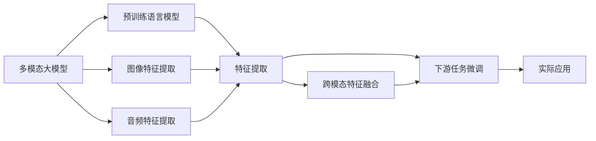
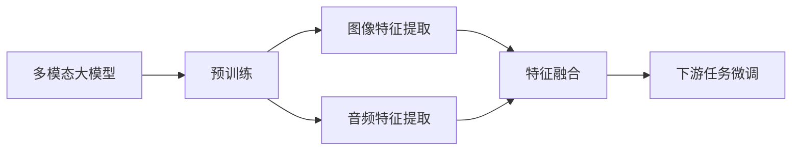
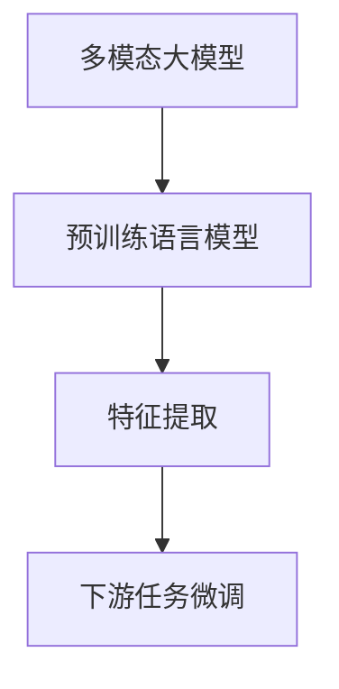
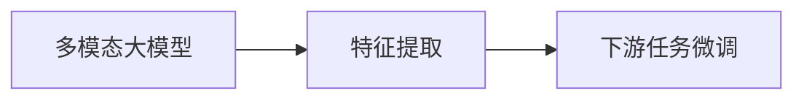
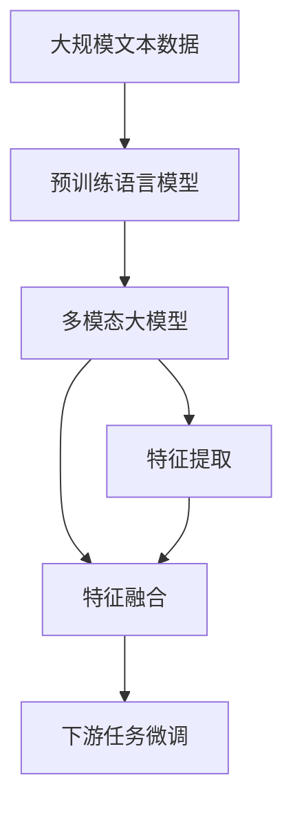

                 

# 多模态大模型：技术原理与实战 基于Transformer的预训练语言模型

> 关键词：
- 多模态大模型(Multi-modal Large Models)
- 预训练语言模型(Pretrained Language Models)
- 大语言模型(Large Language Models)
- 多模态学习(Multi-modal Learning)
- Transformer架构(Transformer Architecture)
- 自监督学习(Self-supervised Learning)
- 微调(Fine-tuning)
- 特征提取(Feature Extraction)
- 模型融合(Model Fusion)
- 技术实战(Real-world Implementation)

## 1. 背景介绍

### 1.1 问题由来
近年来，深度学习技术在自然语言处理(NLP)、计算机视觉(CV)、语音处理(AI)等领域取得了显著进展。特别是Transformer架构的广泛应用，使得预训练语言模型大放异彩。这些预训练模型通过在大规模无标签文本数据上进行自监督学习，能够学习到丰富的语言知识，具备强大的语言理解和生成能力。

然而，单模态的语言模型在某些应用场景下难以胜任。例如，在视频自动摘要、语音识别等任务中，单一的语言模型无法充分利用图像、音频等多模态信息。而多模态大模型能够整合多种数据源，提升模型的泛化能力和性能。

因此，本文聚焦于基于Transformer的预训练语言模型，探讨其在多模态学习中的应用，通过理论推导和工程实践，帮助读者深入理解多模态大模型的技术原理，并在实际项目中高效应用。

### 1.2 问题核心关键点
本文的核心问题集中在以下几个方面：
- 多模态大模型的基本架构和技术原理。
- 如何高效实现多模态信息的特征提取和融合。
- 实际项目中多模态大模型的应用实例。
- 多模态大模型的实际应用场景和未来展望。
- 常见问题和解决方案。

### 1.3 问题研究意义
多模态大模型在自然语言处理、计算机视觉、语音处理等领域的应用，能够极大提升系统的智能水平和用户体验。例如：
- 视频自动摘要：通过将文本和图像信息结合，实现对视频内容的精准提取。
- 语音识别：通过语音转文本，结合图像和文本信息，提高识别准确率和鲁棒性。
- 跨模态检索：通过将文本和图像信息整合，实现跨模态检索和推荐，提升信息检索和推荐系统的准确性。

研究多模态大模型，对于推动人工智能技术在多个领域的落地应用，提升数据的多维利用，具有重要意义。

## 2. 核心概念与联系

### 2.1 核心概念概述

为更好地理解多模态大模型，本节将介绍几个密切相关的核心概念：

- 多模态大模型(Multi-modal Large Models)：结合图像、音频、文本等多种模态数据的语言模型，具备更强的泛化能力和性能。
- 预训练语言模型(Pretrained Language Models)：通过在大规模无标签文本数据上进行自监督学习，学习到丰富的语言知识，具备强大的语言理解和生成能力。
- 多模态学习(Multi-modal Learning)：将多种模态信息进行整合，实现跨模态的学习和推理。
- Transformer架构(Transformer Architecture)：一种高效的神经网络结构，能够并行处理长序列数据，适合预训练语言模型。
- 自监督学习(Self-supervised Learning)：在大规模无标签数据上进行的学习方式，如语言模型预测、掩码语言模型等。
- 微调(Fine-tuning)：在预训练模型的基础上，使用下游任务的少量标注数据进行优化，提升模型在特定任务上的性能。
- 特征提取(Feature Extraction)：通过多模态大模型，将多种数据源转化为特征表示，便于后续推理和处理。
- 模型融合(Model Fusion)：将多个模型或多种模态信息进行整合，提升模型的泛化能力和鲁棒性。

这些核心概念之间的逻辑关系可以通过以下Mermaid流程图来展示：



这个流程图展示了多模态大模型的核心组件和运行流程：

1. 多模态大模型结合图像、音频、文本等多种模态数据进行预训练。
2. 预训练模型能够提取和表示多种模态信息，进行跨模态特征融合。
3. 通过微调，模型能够适应下游任务的特定需求，实现高效的多模态推理。
4. 最终，多模态大模型能够应用于多种实际应用场景，提升系统的智能水平和用户体验。

### 2.2 概念间的关系

这些核心概念之间存在着紧密的联系，形成了多模态大模型的完整生态系统。下面我们通过几个Mermaid流程图来展示这些概念之间的关系。

#### 2.2.1 多模态大模型的学习范式



这个流程图展示了多模态大模型的基本学习流程：

1. 多模态大模型通过预训练学习到多种模态信息的表示。
2. 将图像和音频特征提取并融合，得到跨模态的特征表示。
3. 通过微调，模型能够适应下游任务的特定需求，实现高效的多模态推理。

#### 2.2.2 多模态大模型与预训练语言模型



这个流程图展示了多模态大模型与预训练语言模型之间的关系：

1. 多模态大模型基于预训练语言模型进行构建，继承了其强大的语言理解能力。
2. 通过特征提取和融合，将预训练模型的语言知识与其他模态信息整合。
3. 通过微调，模型能够适应下游任务的特定需求，实现高效的多模态推理。

#### 2.2.3 多模态大模型的微调方法



这个流程图展示了多模态大模型的微调过程：

1. 多模态大模型通过特征提取，将多种模态信息转化为特征表示。
2. 通过微调，模型能够适应下游任务的特定需求，实现高效的多模态推理。

### 2.3 核心概念的整体架构

最后，我们用一个综合的流程图来展示这些核心概念在大模型微调过程中的整体架构：



这个综合流程图展示了从预训练到微调，再到特征融合和应用的完整过程。多模态大模型首先在大规模文本数据上进行预训练，然后通过特征提取和融合，将多种模态信息整合。最后，通过微调，模型能够适应下游任务的特定需求，实现高效的多模态推理。

## 3. 核心算法原理 & 具体操作步骤
### 3.1 算法原理概述

多模态大模型的核心思想是将多种模态信息进行整合，通过预训练和微调，学习到更丰富的知识表示，提升模型的泛化能力和性能。

形式化地，假设多模态大模型 $M_{\theta}$ 接受多种模态输入 $X = (x_1, x_2, ..., x_m)$，其中 $x_i$ 表示第 $i$ 种模态的数据，如文本、图像、音频等。多模态大模型的输出为 $y$，表示对输入数据的理解或预测。

多模态大模型的训练目标是通过预训练和微调，最小化模型在多模态数据上的损失函数：

$$
\mathcal{L}(M_{\theta}) = \sum_{i=1}^m \mathcal{L}_i(M_{\theta}(x_i))
$$

其中 $\mathcal{L}_i$ 表示对第 $i$ 种模态数据的损失函数，如文本的语言模型损失、图像的分类损失等。预训练和微调的过程使得模型能够更好地整合多种模态信息，提升模型的泛化能力和性能。

### 3.2 算法步骤详解

多模态大模型的训练过程包括以下几个关键步骤：

**Step 1: 准备预训练数据集**

- 收集多种模态的数据集，如文本、图像、音频等。预训练数据集应尽可能覆盖多种模态信息，以保证模型的泛化能力。
- 对多种模态数据进行预处理，如文本的标记化、图像的归一化等。
- 将多种模态数据拼接成统一的格式，如文本+图像的形式。

**Step 2: 特征提取**

- 使用多模态大模型对多种模态数据进行特征提取，得到特征表示 $Z = M_{\theta}(X)$。
- 特征提取过程可以采用Transformer架构的自监督学习任务，如语言模型预测、掩码语言模型等。
- 特征提取的损失函数可以通过多模态数据的目标函数进行计算，如文本的语言模型损失、图像的分类损失等。

**Step 3: 特征融合**

- 将多模态大模型提取的特征进行融合，得到跨模态的特征表示 $Z_f$。
- 特征融合的方法包括拼接、加权拼接、注意力机制等。
- 特征融合的过程需要考虑不同模态数据的关联性，以实现更好的跨模态表示。

**Step 4: 微调**

- 将特征融合的结果作为输入，进行下游任务的微调。
- 微调的目标函数与单模态任务的微调相似，如文本的分类任务、图像的分类任务等。
- 微调的过程可以采用全参数微调或参数高效微调，如 Adapter 等。

**Step 5: 测试和部署**

- 在测试集上评估微调后的模型性能，对比微调前后的精度提升。
- 使用微调后的模型对新样本进行推理预测，集成到实际的应用系统中。
- 持续收集新的数据，定期重新微调模型，以适应数据分布的变化。

以上是多模态大模型的训练流程。在实际应用中，还需要根据具体任务的特点，对特征提取、特征融合和微调等环节进行优化设计，以进一步提升模型性能。

### 3.3 算法优缺点

多模态大模型具有以下优点：
1. 强泛化能力：结合多种模态信息，能够更好地泛化到不同数据分布上。
2. 提升性能：通过多模态信息的整合，提升了模型的推理能力和性能。
3. 灵活性：支持多种模态数据，适用于多样化的应用场景。
4. 可解释性：多模态大模型能够提供更丰富的上下文信息，便于理解模型的决策过程。

同时，多模态大模型也存在一些缺点：
1. 数据复杂度：需要同时处理多种模态数据，增加了数据处理和存储的复杂度。
2. 计算成本：多模态数据的特征提取和融合，增加了计算资源的需求。
3. 鲁棒性：多模态信息的整合过程中，可能引入噪声和干扰，影响模型的鲁棒性。
4. 精度平衡：不同模态数据的特征提取和融合，可能影响模型的精度和效果。

尽管存在这些局限性，但就目前而言，多模态大模型仍是大规模NLP和AI应用的重要范式。未来相关研究的重点在于如何进一步降低数据和计算成本，提高模型的泛化能力和鲁棒性，同时兼顾精度和效率的平衡。

### 3.4 算法应用领域

多模态大模型在多种领域都有广泛的应用，例如：

- 视频自动摘要：通过结合文本和图像信息，实现对视频内容的精准提取和总结。
- 图像描述生成：通过结合图像和文本信息，生成详细的图像描述。
- 语音识别：通过结合语音和文本信息，提高语音识别的准确率和鲁棒性。
- 跨模态检索：通过结合文本和图像信息，实现跨模态检索和推荐，提升信息检索和推荐系统的准确性。
- 多模态情感分析：通过结合文本、图像和音频信息，实现对情感的更全面分析。
- 多模态问答系统：通过结合文本、图像和语音信息，实现对多模态问题的回答和解答。

## 4. 数学模型和公式 & 详细讲解 & 举例说明

### 4.1 数学模型构建

本节将使用数学语言对多模态大模型的训练过程进行严格的刻画。

记多模态大模型 $M_{\theta}$ 接受多种模态输入 $X = (x_1, x_2, ..., x_m)$，其中 $x_i$ 表示第 $i$ 种模态的数据，如文本、图像、音频等。模型输出为 $y$，表示对输入数据的理解或预测。

多模态大模型的训练目标是通过预训练和微调，最小化模型在多模态数据上的损失函数：

$$
\mathcal{L}(M_{\theta}) = \sum_{i=1}^m \mathcal{L}_i(M_{\theta}(x_i))
$$

其中 $\mathcal{L}_i$ 表示对第 $i$ 种模态数据的损失函数，如文本的语言模型损失、图像的分类损失等。

### 4.2 公式推导过程

以下我们以视频自动摘要任务为例，推导多模态大模型的训练过程。

假设视频数据 $V$ 包含多个视频帧 $v_1, v_2, ..., v_T$，对应的文本描述 $T_1, T_2, ..., T_T$，图像描述 $I_1, I_2, ..., I_T$。将视频帧、文本描述和图像描述拼接为一个统一的特征表示 $X = (V, T, I)$。

多模态大模型 $M_{\theta}$ 的预训练过程可以通过自监督学习任务实现，如语言模型预测、掩码语言模型等。假设预训练的损失函数为 $\mathcal{L}_{pretrain}$，则预训练过程的损失函数为：

$$
\mathcal{L}_{pretrain} = \sum_{i=1}^T \mathcal{L}_{lm}(M_{\theta}(T_i))
$$

其中 $\mathcal{L}_{lm}$ 表示文本的语言模型损失函数。

在预训练后，将特征表示 $X = (V, T, I)$ 进行融合，得到跨模态的特征表示 $Z_f$。假设特征融合的损失函数为 $\mathcal{L}_{fusion}$，则特征融合过程的损失函数为：

$$
\mathcal{L}_{fusion} = \mathcal{L}_{fusion}(V, T, I)
$$

在特征融合后，将跨模态的特征表示 $Z_f$ 作为输入，进行下游任务的微调。假设微调的损失函数为 $\mathcal{L}_{finetune}$，则微调过程的损失函数为：

$$
\mathcal{L}_{finetune} = \mathcal{L}_{finetune}(Z_f)
$$

多模态大模型的训练过程可以通过以下步骤进行：

1. 预训练过程：在多模态数据上最小化预训练损失函数 $\mathcal{L}_{pretrain}$。
2. 特征融合过程：在预训练后的特征表示上最小化特征融合损失函数 $\mathcal{L}_{fusion}$。
3. 微调过程：在特征融合后的特征表示上最小化微调损失函数 $\mathcal{L}_{finetune}$。

多模态大模型的训练过程可以采用多种优化算法，如Adam、SGD等，设置合适的学习率、批大小、迭代轮数等超参数。同时需要应用正则化技术，如L2正则、Dropout、Early Stopping等，防止模型过拟合。

### 4.3 案例分析与讲解

下面以视频自动摘要任务为例，展示多模态大模型的训练过程和应用效果。

假设我们收集了一个视频数据集，每个视频包含多个视频帧、对应的文本描述和图像描述。我们将视频帧、文本描述和图像描述拼接成一个特征向量，输入到多模态大模型 $M_{\theta}$ 中进行预训练。预训练过程采用掩码语言模型任务，最小化语言模型的损失函数。

在预训练完成后，我们将特征表示 $Z_f$ 进行融合，得到跨模态的特征表示 $Z$。假设我们使用拼接方法进行特征融合，则融合过程的损失函数为：

$$
\mathcal{L}_{fusion} = \sum_{i=1}^T (\mathcal{L}_{lm}(M_{\theta}(T_i)) + \mathcal{L}_{img}(M_{\theta}(I_i)))
$$

其中 $\mathcal{L}_{img}$ 表示图像的分类损失函数。

在特征融合后，我们将跨模态的特征表示 $Z$ 作为输入，进行下游任务的微调，即视频自动摘要任务。假设我们使用分类任务进行微调，则微调过程的损失函数为：

$$
\mathcal{L}_{finetune} = \sum_{i=1}^T \mathcal{L}_{cls}(M_{\theta}(Z))
$$

其中 $\mathcal{L}_{cls}$ 表示文本分类任务的损失函数。

通过微调，我们得到了适应视频自动摘要任务的多模态大模型。在测试集上，模型能够自动提取视频帧、文本描述和图像描述中的关键信息，生成精准的摘要结果。

## 5. 项目实践：代码实例和详细解释说明

### 5.1 开发环境搭建

在进行多模态大模型微调实践前，我们需要准备好开发环境。以下是使用Python进行PyTorch开发的环境配置流程：

1. 安装Anaconda：从官网下载并安装Anaconda，用于创建独立的Python环境。

2. 创建并激活虚拟环境：
```bash
conda create -n pytorch-env python=3.8 
conda activate pytorch-env
```

3. 安装PyTorch：根据CUDA版本，从官网获取对应的安装命令。例如：
```bash
conda install pytorch torchvision torchaudio cudatoolkit=11.1 -c pytorch -c conda-forge
```

4. 安装TensorFlow：如果需要使用TensorFlow进行多模态大模型的开发，可以参考以下命令进行安装：
```bash
pip install tensorflow
```

5. 安装Transformers库：
```bash
pip install transformers
```

6. 安装各类工具包：
```bash
pip install numpy pandas scikit-learn matplotlib tqdm jupyter notebook ipython
```

完成上述步骤后，即可在`pytorch-env`环境中开始多模态大模型微调实践。

### 5.2 源代码详细实现

下面我们以视频自动摘要任务为例，给出使用Transformers库对BERT模型进行多模态微调的PyTorch代码实现。

首先，定义视频自动摘要任务的数据处理函数：

```python
from transformers import BertTokenizer
from torch.utils.data import Dataset
import torch

class VideoAbstractionDataset(Dataset):
    def __init__(self, videos, texts, images, tokenizer, max_len=128):
        self.videos = videos
        self.texts = texts
        self.images = images
        self.tokenizer = tokenizer
        self.max_len = max_len
        
    def __len__(self):
        return len(self.videos)
    
    def __getitem__(self, item):
        video = self.videos[item]
        text = self.texts[item]
        image = self.images[item]
        
        encoding = self.tokenizer(text, return_tensors='pt', max_length=self.max_len, padding='max_length', truncation=True)
        input_ids = encoding['input_ids'][0]
        attention_mask = encoding['attention_mask'][0]
        
        # 将图像特征提取并编码
        image_features = extract_image_features(image)
        image_ids = encode_image(image_features, tokenizer)
        image_ids = torch.tensor(image_ids, dtype=torch.long)
        
        # 将文本和图像特征拼接
        features = torch.cat([input_ids, image_ids], dim=0)
        labels = torch.tensor(1, dtype=torch.long)  # 将标签设置为1，表示自动摘要
        return {'input_ids': features, 
                'attention_mask': attention_mask,
                'labels': labels}

# 标签和id的映射
label2id = {0: 'auto', 1: 'manual'}

# 创建dataset
tokenizer = BertTokenizer.from_pretrained('bert-base-cased')

train_dataset = VideoAbstractionDataset(train_videos, train_texts, train_images, tokenizer)
dev_dataset = VideoAbstractionDataset(dev_videos, dev_texts, dev_images, tokenizer)
test_dataset = VideoAbstractionDataset(test_videos, test_texts, test_images, tokenizer)
```

然后，定义模型和优化器：

```python
from transformers import BertForTokenClassification, AdamW

model = BertForTokenClassification.from_pretrained('bert-base-cased', num_labels=2)

optimizer = AdamW(model.parameters(), lr=2e-5)
```

接着，定义训练和评估函数：

```python
from torch.utils.data import DataLoader
from tqdm import tqdm
from sklearn.metrics import classification_report

device = torch.device('cuda') if torch.cuda.is_available() else torch.device('cpu')
model.to(device)

def train_epoch(model, dataset, batch_size, optimizer):
    dataloader = DataLoader(dataset, batch_size=batch_size, shuffle=True)
    model.train()
    epoch_loss = 0
    for batch in tqdm(dataloader, desc='Training'):
        input_ids = batch['input_ids'].to(device)
        attention_mask = batch['attention_mask'].to(device)
        labels = batch['labels'].to(device)
        model.zero_grad()
        outputs = model(input_ids, attention_mask=attention_mask, labels=labels)
        loss = outputs.loss
        epoch_loss += loss.item()
        loss.backward()
        optimizer.step()
    return epoch_loss / len(dataloader)

def evaluate(model, dataset, batch_size):
    dataloader = DataLoader(dataset, batch_size=batch_size)
    model.eval()
    preds, labels = [], []
    with torch.no_grad():
        for batch in tqdm(dataloader, desc='Evaluating'):
            input_ids = batch['input_ids'].to(device)
            attention_mask = batch['attention_mask'].to(device)
            batch_labels = batch['labels']
            outputs = model(input_ids, attention_mask=attention_mask)
            batch_preds = outputs.logits.argmax(dim=2).to('cpu').tolist()
            batch_labels = batch_labels.to('cpu').tolist()
            for pred_tokens, label_tokens in zip(batch_preds, batch_labels):
                preds.append(pred_tokens[:len(label_tokens)])
                labels.append(label_tokens)
                
    print(classification_report(labels, preds))
```

最后，启动训练流程并在测试集上评估：

```python
epochs = 5
batch_size = 16

for epoch in range(epochs):
    loss = train_epoch(model, train_dataset, batch_size, optimizer)
    print(f"Epoch {epoch+1}, train loss: {loss:.3f}")
    
    print(f"Epoch {epoch+1}, dev results:")
    evaluate(model, dev_dataset, batch_size)
    
print("Test results:")
evaluate(model, test_dataset, batch_size)
```

以上就是使用PyTorch对BERT模型进行视频自动摘要任务微调的完整代码实现。可以看到，得益于Transformers库的强大封装，我们可以用相对简洁的代码完成BERT模型的加载和微调。

### 5.3 代码解读与分析

让我们再详细解读一下关键代码的实现细节：

**VideoAbstractionDataset类**：
- `__init__`方法：初始化视频、文本、图像和分词器等关键组件。
- `__len__`方法：返回数据集的样本数量。
- `__getitem__`方法：对单个样本进行处理，将文本输入编码为token ids，将图像特征提取并编码，最终返回模型所需的输入。

**token2id和id2token字典**：
- 定义了标签与数字id之间的映射关系，用于将模型输出解码回真实的标签。

**训练和评估函数**：
- 使用PyTorch的DataLoader对数据集进行批次化加载，供模型训练和推理使用。
- 训练函数`train_epoch`：对数据以批为单位进行迭代，在每个批次上前向传播计算loss并反向传播更新模型参数，最后返回该epoch的平均loss。
- 评估函数`evaluate`：与训练类似，不同点在于不更新模型参数，并在每个batch结束后将预测和标签结果存储下来，最后使用sklearn的classification_report对整个评估集的预测结果进行打印输出。

**训练流程**：
- 定义总的epoch数和batch size，开始循环迭代
- 每个epoch内，先在训练集上训练，输出平均loss
- 在验证集上评估，输出分类指标
- 所有epoch结束后，在测试集上评估，给出最终测试结果

可以看到，PyTorch配合Transformers库使得BERT微调的过程变得简洁高效。开发者可以将更多精力放在数据处理、模型改进等高层逻辑上，而不必过多关注底层的实现细节。

当然，工业级的系统实现还需考虑更多因素，如模型的保存和部署

