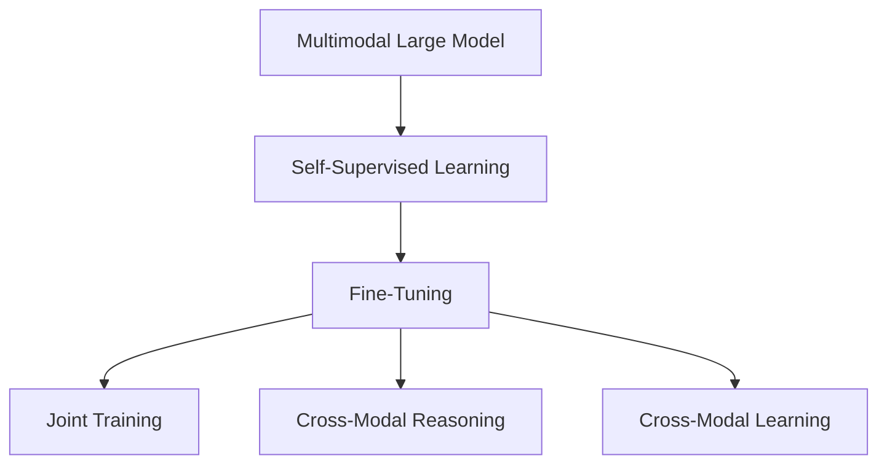
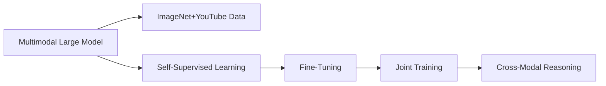
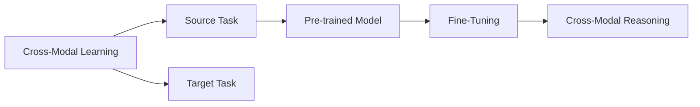
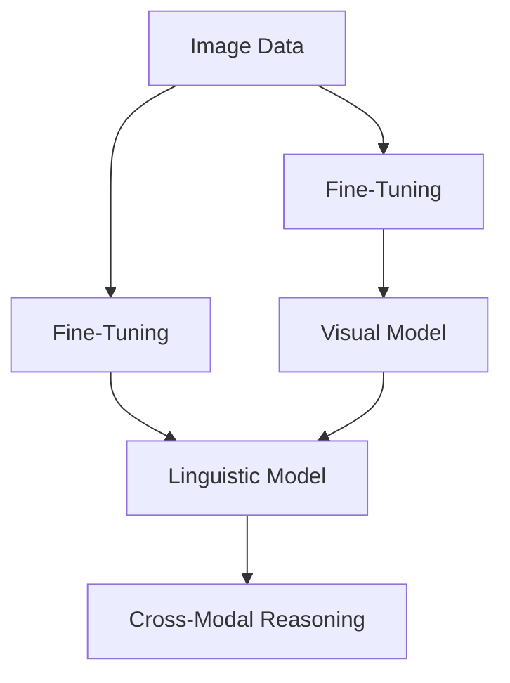
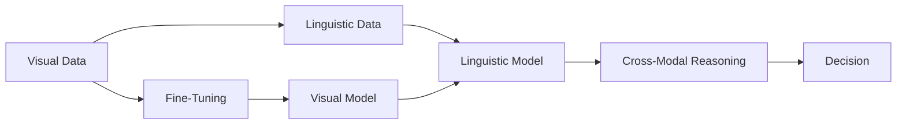
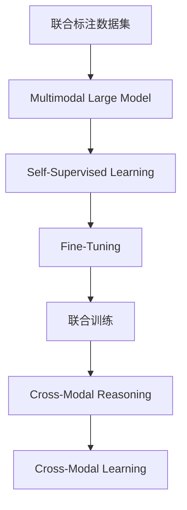

                 

# 多模态大模型：技术原理与实战 多模态大模型发展的重大里程碑

## 1. 背景介绍

### 1.1 问题由来
近年来，随着深度学习技术的快速发展，大规模预训练语言模型在自然语言处理(NLP)领域取得了显著进展。然而，传统的大规模语言模型主要基于文本数据的单模态预训练，难以充分利用视觉、音频等不同模态的数据，限制了其应用范围和效果。多模态大模型(Multi-Modal Large Models)的兴起，为解决这一问题提供了新的思路。通过在预训练过程中引入多种模态的数据，多模态大模型能够同时学习语言和视觉、听觉等多模态信息，提升了其在多领域任务上的表现，为智能系统的跨模态理解和应用提供了新的可能。

### 1.2 问题核心关键点
多模态大模型的核心在于其预训练和微调过程中，如何有效地融合多种模态的数据。目前主流的多模态大模型包括Frambicus、XFormer、DETR等，其预训练通常基于大规模的联合标注数据集，如ImageNet+YouTube，通过自监督学习任务（如掩码语言模型、掩码视觉模型等）对模型进行训练。微调时，根据具体任务需求，设计多模态输入格式，对模型进行微调，使其在不同模态下具备良好的泛化能力。

### 1.3 问题研究意义
多模态大模型的研究对于拓展大模型的应用范围，提升其在跨模态任务上的性能，加速智能系统的产业化进程，具有重要意义：

1. 提升模型泛化能力。多模态大模型通过学习不同模态的数据，能够更好地适应多领域任务，提升模型的泛化能力和鲁棒性。
2. 拓展应用场景。多模态大模型可以应用于语音识别、图像描述生成、视频内容理解等场景，极大地丰富了其应用范围。
3. 推动跨模态研究。多模态大模型的研究促进了对预训练-微调机制的深入研究，催生了跨模态学习和迁移学习等新的研究方向。
4. 加速技术落地。多模态大模型为智能系统的跨模态理解和应用提供了新的可能性，有助于加速技术向实际应用的转化。

## 2. 核心概念与联系

### 2.1 核心概念概述

为更好地理解多模态大模型的预训练和微调过程，本节将介绍几个密切相关的核心概念：

- **多模态大模型(Multi-Modal Large Models)**：以自回归或自编码模型为代表，在预训练过程中同时处理语言和视觉、听觉等多种模态的数据，学习通用的多模态表示，具备跨模态理解和生成的能力。

- **自监督学习(Self-Supervised Learning)**：在无标签数据上，通过设计自监督任务（如掩码语言模型、掩码视觉模型等）对模型进行训练，学习数据的隐含结构和特征。

- **微调(Fine-Tuning)**：在大规模预训练模型的基础上，使用下游任务的少量标注数据，通过有监督学习优化模型在特定任务上的性能。

- **跨模态学习(Cross-Modal Learning)**：在多种模态的数据上训练模型，学习不同模态之间的映射和转换，提升模型对不同模态数据的一致性理解和生成。

- **联合训练(Joint Training)**：在训练过程中，同时使用不同模态的数据进行联合训练，优化模型的多模态表示。

- **跨模态推理(Cross-Modal Reasoning)**：在推理过程中，综合不同模态的信息，进行多模态推理和决策。

这些核心概念之间的逻辑关系可以通过以下Mermaid流程图来展示：



这个流程图展示了大模型的核心概念及其之间的关系：

1. 多模态大模型通过自监督学习获得基础能力。
2. 微调是对预训练模型进行任务特定的优化，通过联合训练和多模态推理，提升模型在不同模态下的泛化能力。
3. 跨模态学习是实现多模态大模型的关键技术，使模型具备跨模态的理解和生成能力。

### 2.2 概念间的关系

这些核心概念之间存在着紧密的联系，形成了多模态大模型的完整生态系统。下面我们通过几个Mermaid流程图来展示这些概念之间的关系。

#### 2.2.1 多模态大模型的学习范式



这个流程图展示了多模态大模型的学习范式：首先利用联合标注数据集进行自监督学习，然后对预训练模型进行微调，通过联合训练和多模态推理优化模型。

#### 2.2.2 跨模态学习与微调的关系



这个流程图展示了跨模态学习的基本原理，以及它与微调的关系。跨模态学习涉及源任务和目标任务，预训练模型在源任务上学习，然后通过微调适应各种目标任务，同时进行多模态推理。

#### 2.2.3 联合训练方法



这个流程图展示了联合训练的基本原理。联合训练时，图像数据和文本数据分别经过自监督学习任务进行预训练，然后通过微调进行联合训练，提升模型在多模态数据上的表现。

#### 2.2.4 跨模态推理在多模态大模型中的应用



这个流程图展示了跨模态推理在多模态大模型中的应用。在推理过程中，模型综合视觉和文本数据的信息，进行多模态推理和决策，提升模型对多模态数据的理解。

### 2.3 核心概念的整体架构

最后，我们用一个综合的流程图来展示这些核心概念在大模型预训练和微调过程中的整体架构：



这个综合流程图展示了从预训练到微调，再到多模态推理的完整过程。多模态大模型首先在大规模联合标注数据上进行预训练，然后通过微调进行任务特定的优化，最后进行联合训练和多模态推理，提升模型在不同模态下的泛化能力。

## 3. 核心算法原理 & 具体操作步骤
### 3.1 算法原理概述

多模态大模型的预训练和微调过程，本质上是一个多模态的自监督学习任务。其核心思想是：将预训练大模型视作一个强大的"多模态特征提取器"，通过在大规模联合标注数据上进行多模态自监督学习，学习到通用的多模态表示，然后对预训练模型进行多模态微调，使其在不同模态下具备良好的泛化能力。

形式化地，假设预训练模型为 $M_{\theta}$，其中 $\theta$ 为预训练得到的模型参数。给定联合标注数据集 $D=\{(x_i, y_i)\}_{i=1}^N$，其中 $x_i$ 为多模态数据，$y_i$ 为多模态标签。预训练的目标是最大化模型在多模态数据上的自监督损失，即：

$$
\max_{\theta} \mathcal{L}_{self}(M_{\theta}, D)
$$

其中 $\mathcal{L}_{self}$ 为多模态自监督损失函数。微调的目标是最大化模型在特定任务上的监督损失，即：

$$
\max_{\theta} \mathcal{L}_{task}(M_{\theta}, D)
$$

其中 $\mathcal{L}_{task}$ 为多模态任务损失函数。

在实际应用中，多模态大模型的微调通常包括两个阶段：

1. **预训练阶段**：在联合标注数据集上进行自监督学习，学习多模态数据的通用表示。
2. **微调阶段**：在特定任务的数据集上进行多模态微调，优化模型在特定任务上的性能。

### 3.2 算法步骤详解

多模态大模型的预训练和微调一般包括以下几个关键步骤：

**Step 1: 准备预训练数据和模型**

- 选择合适的联合标注数据集，如ImageNet+YouTube，作为多模态大模型的预训练数据。
- 选择合适的预训练模型 $M_{\theta}$，如Frambicus、XFormer、DETR等，作为初始化参数。

**Step 2: 添加多模态输入层**

- 根据任务需求，设计多模态输入格式。例如，对于图像描述生成任务，将图像数据作为输入，同时将文本描述作为监督信号。
- 设计多模态任务损失函数。例如，对于图像描述生成任务，可以设计掩码语言模型作为损失函数。

**Step 3: 设置微调超参数**

- 选择合适的优化算法及其参数，如AdamW、SGD等，设置学习率、批大小、迭代轮数等。
- 设置正则化技术及强度，包括权重衰减、Dropout、Early Stopping等。
- 确定冻结预训练参数的策略，如仅微调顶层，或全部参数都参与微调。

**Step 4: 执行梯度训练**

- 将多模态数据分批次输入模型，前向传播计算损失函数。
- 反向传播计算参数梯度，根据设定的优化算法和学习率更新模型参数。
- 周期性在验证集上评估模型性能，根据性能指标决定是否触发 Early Stopping。
- 重复上述步骤直到满足预设的迭代轮数或 Early Stopping 条件。

**Step 5: 测试和部署**

- 在测试集上评估多模态微调后模型 $M_{\hat{\theta}}$ 的性能，对比微调前后的精度提升。
- 使用微调后的模型对新样本进行推理预测，集成到实际的应用系统中。

以上是多模态大模型的预训练和微调的一般流程。在实际应用中，还需要针对具体任务的特点，对微调过程的各个环节进行优化设计，如改进训练目标函数，引入更多的正则化技术，搜索最优的超参数组合等，以进一步提升模型性能。

### 3.3 算法优缺点

多模态大模型的预训练和微调方法具有以下优点：

1. 增强模型的泛化能力。通过联合标注数据集进行自监督学习，多模态大模型能够学习到通用的多模态表示，提升其在多领域任务上的泛化能力和鲁棒性。
2. 拓展应用场景。多模态大模型可以应用于语音识别、图像描述生成、视频内容理解等场景，极大地丰富了其应用范围。
3. 提高模型的跨模态推理能力。多模态大模型能够同时处理语言和视觉、听觉等多种模态的数据，提升其跨模态推理和决策的能力。
4. 减少标注数据的依赖。多模态大模型可以通过多模态自监督学习获得初始化表示，降低对标注数据的依赖，提升模型的自监督学习能力。

同时，该方法也存在一定的局限性：

1. 数据需求较高。多模态大模型需要大量的联合标注数据进行预训练，获取高质量标注数据的成本较高。
2. 计算资源消耗大。由于多模态大模型参数量较大，训练和推理的计算资源消耗较大，需要高性能的硬件设备支持。
3. 模型复杂度较高。多模态大模型结构复杂，参数量庞大，训练和推理的计算效率较低，需要更高效的算法和模型结构进行优化。

尽管存在这些局限性，但就目前而言，多模态大模型的预训练和微调方法已经成为多模态信息处理的重要手段，极大地推动了跨模态信息理解和应用的发展。

### 3.4 算法应用领域

多模态大模型的预训练和微调方法已经在多种NLP和计算机视觉任务上取得了优异的效果，成为跨模态信息处理的重要工具。以下是几个典型的应用领域：

- **图像描述生成**：将图像数据作为输入，通过多模态自监督学习任务训练大模型，生成对图像的详细描述。该技术广泛应用于智能搜索、内容推荐等领域。
- **视频内容理解**：对视频帧和音频数据进行多模态自监督学习，学习视频内容的语义表示，并生成对视频的详细描述。该技术广泛应用于视频监控、视频内容分析等领域。
- **语音识别**：将语音信号和文本转录作为输入，通过多模态自监督学习任务训练大模型，提高语音识别的准确率和鲁棒性。该技术广泛应用于智能助手、语音搜索等领域。
- **跨模态问答系统**：将文本问题和图像作为输入，通过多模态自监督学习任务训练大模型，生成对问题的详细回答。该技术广泛应用于智能问答、知识图谱等领域。
- **跨模态推荐系统**：将用户的多模态数据（如浏览记录、行为数据、社交网络数据等）作为输入，通过多模态自监督学习任务训练大模型，推荐用户可能感兴趣的内容。该技术广泛应用于电商、社交网络等领域。

除了上述这些经典任务外，多模态大模型还被创新性地应用到更多场景中，如可控文本生成、常识推理、代码生成、数据增强等，为跨模态信息处理带来了全新的突破。随着预训练模型和微调方法的不断进步，相信多模态大模型将在更广阔的应用领域大放异彩。

## 4. 数学模型和公式 & 详细讲解 & 举例说明

### 4.1 数学模型构建

本节将使用数学语言对多模态大模型的预训练和微调过程进行更加严格的刻画。

记多模态大模型为 $M_{\theta}$，其中 $\theta$ 为模型参数。假设预训练数据的联合标注数据集为 $D=\{(x_i, y_i)\}_{i=1}^N$，其中 $x_i$ 为多模态数据，$y_i$ 为多模态标签。

定义模型 $M_{\theta}$ 在多模态数据 $x_i$ 上的多模态自监督损失为 $\ell(M_{\theta}(x_i),y_i)$，则在数据集 $D$ 上的经验风险为：

$$
\mathcal{L}_{self}(\theta) = \frac{1}{N} \sum_{i=1}^N \ell(M_{\theta}(x_i),y_i)
$$

微调的优化目标是最小化经验风险，即找到最优参数：

$$
\theta^* = \mathop{\arg\min}_{\theta} \mathcal{L}_{task}(\theta)
$$

其中 $\mathcal{L}_{task}$ 为多模态任务损失函数，用于衡量模型在特定任务上的性能。

### 4.2 公式推导过程

以下我们以图像描述生成任务为例，推导多模态自监督损失函数及其梯度的计算公式。

假设模型 $M_{\theta}$ 在输入 $x$ 上的输出为 $\hat{y}=M_{\theta}(x) \in [0,1]$，表示模型预测图像的描述概率。真实标签 $y \in [0,1]$。则二分类交叉熵损失函数定义为：

$$
\ell(M_{\theta}(x),y) = -[y\log \hat{y} + (1-y)\log (1-\hat{y})]
$$

将其代入经验风险公式，得：

$$
\mathcal{L}_{self}(\theta) = -\frac{1}{N}\sum_{i=1}^N [y_i\log M_{\theta}(x_i)+(1-y_i)\log(1-M_{\theta}(x_i))]
$$

根据链式法则，损失函数对参数 $\theta_k$ 的梯度为：

$$
\frac{\partial \mathcal{L}_{self}(\theta)}{\partial \theta_k} = -\frac{1}{N}\sum_{i=1}^N (\frac{y_i}{M_{\theta}(x_i)}-\frac{1-y_i}{1-M_{\theta}(x_i)}) \frac{\partial M_{\theta}(x_i)}{\partial \theta_k}
$$

其中 $\frac{\partial M_{\theta}(x_i)}{\partial \theta_k}$ 可进一步递归展开，利用自动微分技术完成计算。

在得到损失函数的梯度后，即可带入参数更新公式，完成模型的迭代优化。重复上述过程直至收敛，最终得到适应下游任务的最优模型参数 $\theta^*$。

### 4.3 案例分析与讲解

以ImageNet+YouTube数据集为例，展示如何使用多模态自监督学习任务进行预训练。

假设我们有一个包含ImageNet图像数据和YouTube视频数据的联合标注数据集 $D=\{(x_i, y_i)\}_{i=1}^N$，其中 $x_i$ 为图像和视频的组合数据，$y_i$ 为图像的类别标签。预训练任务如下：

1. **图像分类**：将ImageNet图像数据作为输入，设计掩码语言模型（Masked Image Modeling, MIM）作为损失函数，训练大模型学习图像的分类表示。

2. **视频描述生成**：将YouTube视频数据作为输入，设计掩码语言模型（Masked Video Modeling, MVM）作为损失函数，训练大模型学习视频的描述表示。

3. **跨模态推理**：将图像和视频数据同时输入模型，设计跨模态推理任务（如Image Captioning）作为损失函数，训练大模型学习跨模态推理能力。

预训练过程中，可以通过自监督学习任务获得图像和视频的通用表示。预训练完成后，将模型应用于特定任务的数据集上进行微调，如图像描述生成、视频内容理解等。在微调过程中，可以设计多模态任务损失函数，如交叉熵损失、掩码语言模型损失等，对模型进行优化。

## 5. 项目实践：代码实例和详细解释说明
### 5.1 开发环境搭建

在进行多模态大模型微调实践前，我们需要准备好开发环境。以下是使用Python进行PyTorch开发的环境配置流程：

1. 安装Anaconda：从官网下载并安装Anaconda，用于创建独立的Python环境。

2. 创建并激活虚拟环境：
```bash
conda create -n pytorch-env python=3.8 
conda activate pytorch-env
```

3. 安装PyTorch：根据CUDA版本，从官网获取对应的安装命令。例如：
```bash
conda install pytorch torchvision torchaudio cudatoolkit=11.1 -c pytorch -c conda-forge
```

4. 安装Transformers库：
```bash
pip install transformers
```

5. 安装各类工具包：
```bash
pip install numpy pandas scikit-learn matplotlib tqdm jupyter notebook ipython
```

完成上述步骤后，即可在`pytorch-env`环境中开始多模态大模型的微调实践。

### 5.2 源代码详细实现

这里我们以图像描述生成任务为例，给出使用Transformers库对Frambicus模型进行多模态微调的PyTorch代码实现。

首先，定义多模态数据处理函数：

```python
from transformers import FrambicusForImageCaptioning, AdamW

class ImageCaptioningDataset(Dataset):
    def __init__(self, images, captions, tokenizer, max_len=128):
        self.images = images
        self.captions = captions
        self.tokenizer = tokenizer
        self.max_len = max_len
        
    def __len__(self):
        return len(self.images)
    
    def __getitem__(self, item):
        image = self.images[item]
        caption = self.captions[item]
        
        encoding = self.tokenizer(image, return_tensors='pt', max_length=self.max_len, padding='max_length', truncation=True)
        input_ids = encoding['input_ids'][0]
        attention_mask = encoding['attention_mask'][0]
        
        # 对token-wise的标签进行编码
        encoded_tags = [tag2id[tag] for tag in caption] 
        encoded_tags.extend([tag2id['O']] * (self.max_len - len(encoded_tags)))
        labels = torch.tensor(encoded_tags, dtype=torch.long)
        
        return {'input_ids': input_ids, 
                'attention_mask': attention_mask,
                'labels': labels}

# 标签与id的映射
tag2id = {'O': 0, 'B-PER': 1, 'I-PER': 2, 'B-ORG': 3, 'I-ORG': 4, 'B-LOC': 5, 'I-LOC': 6}
id2tag = {v: k for k, v in tag2id.items()}

# 创建dataset
tokenizer = FrambicusTokenizer.from_pretrained('frambicus')

train_dataset = ImageCaptioningDataset(train_images, train_captions, tokenizer)
dev_dataset = ImageCaptioningDataset(dev_images, dev_captions, tokenizer)
test_dataset = ImageCaptioningDataset(test_images, test_captions, tokenizer)
```

然后，定义模型和优化器：

```python
from transformers import FrambicusForImageCaptioning, AdamW

model = FrambicusForImageCaptioning.from_pretrained('frambicus')

optimizer = AdamW(model.parameters(), lr=2e-5)
```

接着，定义训练和评估函数：

```python
from torch.utils.data import DataLoader
from tqdm import tqdm
from sklearn.metrics import classification_report

device = torch.device('cuda') if torch.cuda.is_available() else torch.device('cpu')
model.to(device)

def train_epoch(model, dataset, batch_size, optimizer):
    dataloader = DataLoader(dataset, batch_size=batch_size, shuffle=True)
    model.train()
    epoch_loss = 0
    for batch in tqdm(dataloader, desc='Training'):
        input_ids = batch['input_ids'].to(device)
        attention_mask = batch['attention_mask'].to(device)
        labels = batch['labels'].to(device)
        model.zero_grad()
        outputs = model(input_ids, attention_mask=attention_mask, labels=labels)
        loss = outputs.loss
        epoch_loss += loss.item()
        loss.backward()
        optimizer.step()
    return epoch_loss / len(dataloader)

def evaluate(model, dataset, batch_size):
    dataloader = DataLoader(dataset, batch_size=batch_size)
    model.eval()
    preds, labels = [], []
    with torch.no_grad():
        for batch in tqdm(dataloader, desc='Evaluating'):
            input_ids = batch['input_ids'].to(device)
            attention_mask = batch['attention_mask'].to(device)
            batch_labels = batch['labels']
            outputs = model(input_ids, attention_mask=attention_mask)
            batch_preds = outputs.logits.argmax(dim=2).to('cpu').tolist()
            batch_labels = batch_labels.to('cpu').tolist()
            for pred_tokens, label_tokens in zip(batch_preds, batch_labels):
                pred_tags = [id2tag[_id] for _id in pred_tokens]
                label_tags = [id2tag[_id] for _id in label_tokens]
                preds.append(pred_tags[:len(label_tokens)])
                labels.append(label_tags)
                
    print(classification_report(labels, preds))
```

最后，启动训练流程并在测试集上评估：

```python
epochs = 5
batch_size = 16

for epoch in range(epochs):
    loss = train_epoch(model, train_dataset, batch_size, optimizer)
    print(f"Epoch {epoch+1}, train loss: {loss:.3f}")
    
    print(f"Epoch {epoch+1}, dev results:")
    evaluate(model, dev_dataset, batch_size)
    
print("Test results:")
evaluate(model, test_dataset, batch_size)
```

以上就是使用PyTorch对Frambicus模型进行图像描述生成任务微调的完整代码实现。可以看到，得益于Transformers库的强大封装，我们可以用相对简洁的代码完成Frambicus模型的加载和微调。

### 5.3 代码解读与分析

让我们再详细解读一下关键代码的实现细节：

**ImageCaptioningDataset类**：
- `__init__`方法：初始化图像、文本、分词器等关键组件。
- `__len__`方法：返回数据集的样本数量。
- `__getitem__`方法：对单个样本进行处理，将图像数据输入编码为token ids，将文本标签编码为数字，并对其进行定长padding，最终返回模型所需的输入。

**tag2id和id2tag字典**：
- 定义了标签与数字id之间的映射关系，用于将token-wise的预测结果解码回真实的标签。

**训练和评估函数**：
- 使用PyTorch的DataLoader对数据集进行批次化加载，供模型训练和

