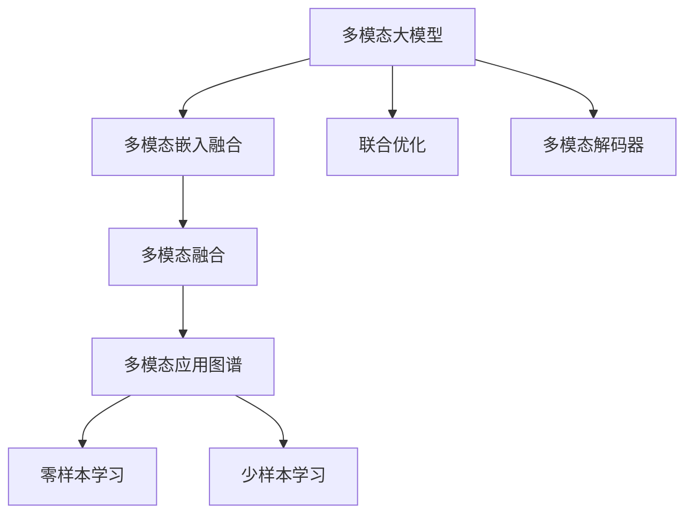
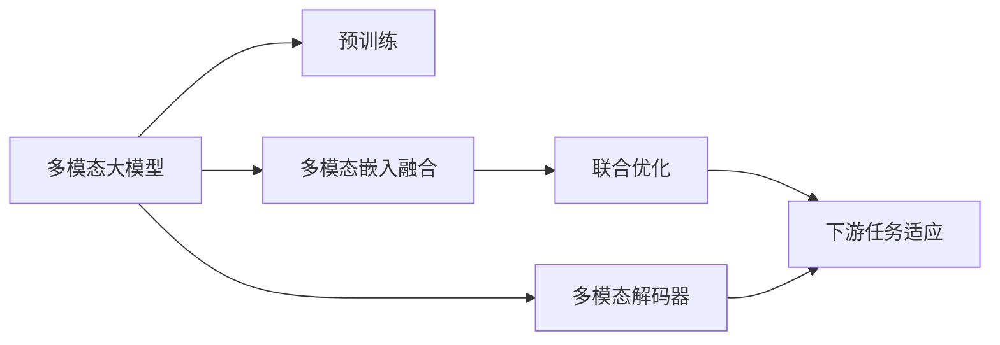
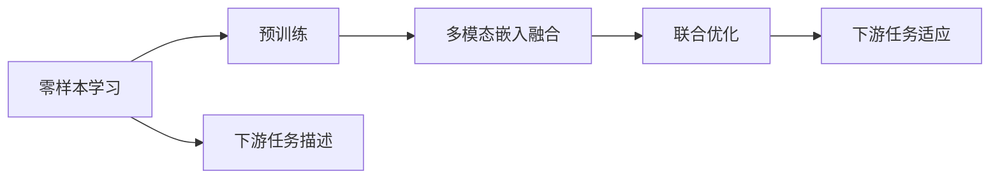
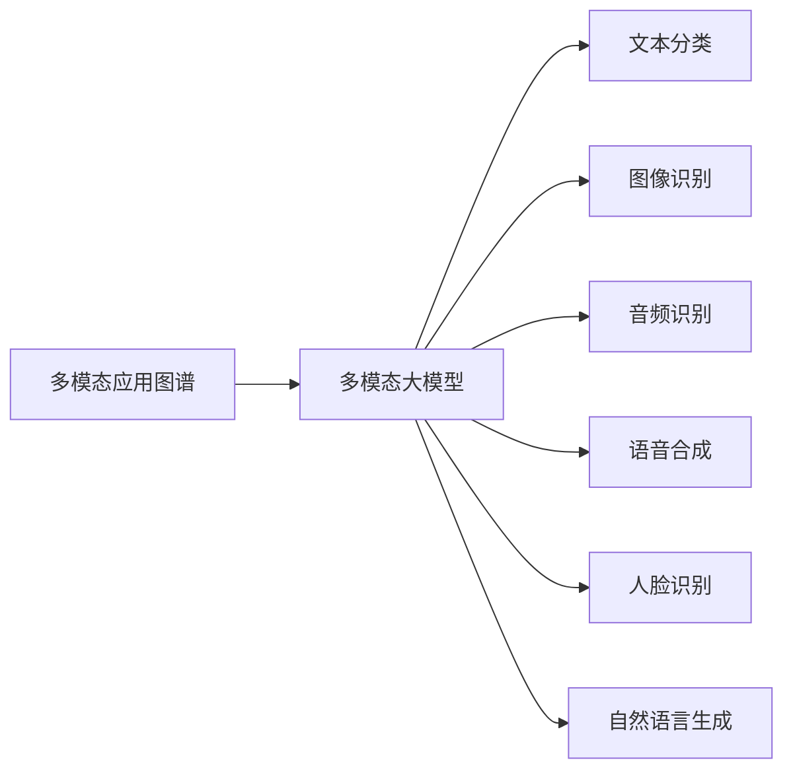
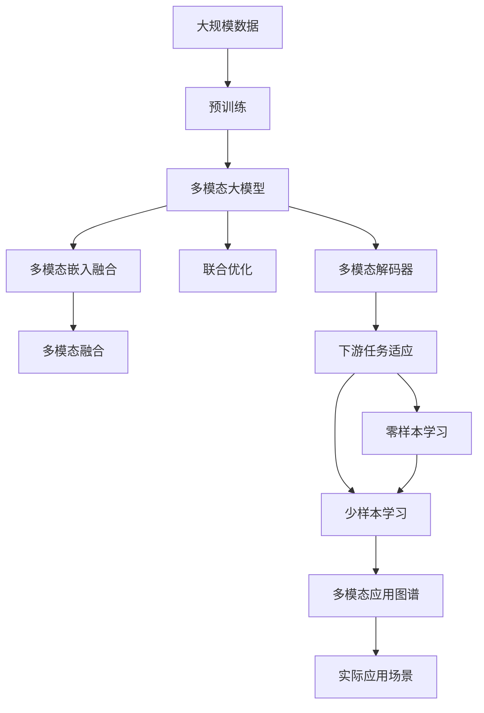

                 

# 多模态大模型：技术原理与实战 多模态大模型的应用图谱

> 关键词：多模态大模型,Transformer,BERT,预训练,下游任务,参数高效微调,自然语言处理(NLP),计算机视觉(CV),多模态融合,零样本学习,应用图谱

## 1. 背景介绍

### 1.1 问题由来

近年来，深度学习技术在图像识别、自然语言处理等领域取得了重大进展，基于大规模无标签数据进行预训练的大模型（如BERT、GPT等）逐渐成为研究热点。但传统的大模型往往只能处理单一模态数据，难以有效融合多源数据的信息，无法满足实际应用中多模态数据的处理需求。多模态大模型（Multi-modal Large Models）的出现，解决了这一问题，使得模型能够同时处理文本、图像、音频等多种类型的数据，显著提升了模型的泛化能力和应用范围。

### 1.2 问题核心关键点

多模态大模型的核心思想是将不同模态的数据嵌入到一个统一的表示空间，并通过一个共享的模型参数进行联合优化，从而实现多模态信息的协同学习。其关键技术包括：

- 多模态嵌入融合：将不同模态的特征向量进行拼接、连接、融合等操作，得到一个多模态的嵌入表示。
- 联合优化：通过共享的模型参数对多模态特征进行联合训练，最大化多模态信息的联合表示能力。
- 多模态解码器：针对不同模态的输出任务设计不同的解码器，使得模型能够适应多种类型的下游任务。

### 1.3 问题研究意义

多模态大模型为多模态数据的处理提供了新的解决方案，具有以下重要意义：

- 提升泛化能力：多模态信息可以相互补充，提升模型的泛化能力和鲁棒性。
- 降低标注成本：利用多模态信息，可以缓解标注数据稀缺的问题。
- 扩展应用范围：能够同时处理文本、图像、音频等多种数据，满足更多实际应用需求。
- 提高推理效率：通过多模态融合和优化，可以减少冗余计算，提高推理效率。
- 促进跨领域迁移：多模态模型能够更好地进行跨领域迁移学习，提升模型的通用性。

## 2. 核心概念与联系

### 2.1 核心概念概述

为更好地理解多模态大模型的原理和应用，本节将介绍几个密切相关的核心概念：

- 多模态大模型(Multi-modal Large Models)：同时处理文本、图像、音频等多种类型数据的深度学习模型，通过多模态嵌入融合和联合优化实现信息协同学习。
- 多模态嵌入融合(Multi-modal Embedding Fusion)：将不同模态的特征向量进行拼接、连接、融合等操作，得到一个多模态的嵌入表示。
- 联合优化(Joint Optimization)：通过共享的模型参数对多模态特征进行联合训练，最大化多模态信息的联合表示能力。
- 多模态解码器(Multi-modal Decoder)：针对不同模态的输出任务设计不同的解码器，使得模型能够适应多种类型的下游任务。
- 多模态融合(Multi-modal Fusion)：对不同模态的信息进行融合，以获得更为全面的语义理解。
- 零样本学习(Zero-shot Learning)：在不进行任何特定任务训练的情况下，利用预训练模型和下游任务的描述，完成对新任务的学习。
- 少样本学习(Few-shot Learning)：在少量特定任务训练数据的情况下，利用预训练模型和下游任务的描述，完成对新任务的学习。
- 多模态应用图谱(Multi-modal Application Spectrum)：展示多模态模型在不同领域的应用场景，为开发者提供参考。

这些核心概念之间的逻辑关系可以通过以下Mermaid流程图来展示：



这个流程图展示了大模型的核心概念及其之间的关系：

1. 多模态大模型通过多模态嵌入融合和联合优化获得多模态表示。
2. 多模态解码器用于处理不同模态的输出任务。
3. 多模态融合用于提高模型的泛化能力和推理能力。
4. 零样本学习和少样本学习是多模态大模型的重要应用场景。
5. 多模态应用图谱展示了不同领域下的应用场景。

### 2.2 概念间的关系

这些核心概念之间存在着紧密的联系，形成了多模态大模型的完整生态系统。下面我通过几个Mermaid流程图来展示这些概念之间的关系。

#### 2.2.1 多模态大模型的学习范式



这个流程图展示了大模型的基本学习范式，即通过预训练获得基础能力，然后利用多模态嵌入融合和联合优化实现多模态信息的协同学习。

#### 2.2.2 零样本学习和少样本学习的多模态大模型



这个流程图展示了零样本学习和少样本学习的范式。通过将下游任务的描述作为输入，多模态大模型能够完成对新任务的学习，无需额外的标注数据。

#### 2.2.3 多模态应用图谱的多模态大模型



这个流程图展示了多模态大模型在不同领域的应用场景。通过多模态融合和解码器设计，大模型能够在多个领域中发挥强大的信息处理能力。

### 2.3 核心概念的整体架构

最后，我们用一个综合的流程图来展示这些核心概念在大模型微调过程中的整体架构：



这个综合流程图展示了从预训练到多模态融合，再到下游任务适应的完整过程。多模态大模型通过预训练获得基础能力，然后通过多模态嵌入融合和联合优化实现多模态信息的协同学习，利用多模态解码器适应不同任务。通过零样本学习和少样本学习，大模型可以在新的任务上快速适应，并在实际应用场景中发挥其强大的信息处理能力。

## 3. 核心算法原理 & 具体操作步骤
### 3.1 算法原理概述

多模态大模型的核心原理是通过多模态嵌入融合和联合优化，将不同模态的数据嵌入到一个统一的表示空间，并通过共享的模型参数进行联合优化，从而实现多模态信息的协同学习。

具体来说，多模态大模型的训练过程包括以下几个步骤：

1. 预训练：在大规模无标签数据上对模型进行预训练，学习通用的语言表示。
2. 多模态嵌入融合：将不同模态的特征向量进行拼接、连接、融合等操作，得到一个多模态的嵌入表示。
3. 联合优化：通过共享的模型参数对多模态特征进行联合训练，最大化多模态信息的联合表示能力。
4. 多模态解码器：针对不同模态的输出任务设计不同的解码器，使得模型能够适应多种类型的下游任务。

### 3.2 算法步骤详解

下面详细讲解多模态大模型的训练过程：

**Step 1: 准备预训练模型和数据集**
- 选择合适的预训练语言模型 $M_{\theta}$ 作为初始化参数，如 BERT、GPT等。
- 准备多模态数据集，包括文本、图像、音频等多种类型的数据，划分为训练集、验证集和测试集。一般要求数据与预训练数据的分布不要差异过大。

**Step 2: 添加任务适配层**
- 根据任务类型，在预训练模型顶层设计合适的输出层和损失函数。
- 对于分类任务，通常在顶层添加线性分类器和交叉熵损失函数。
- 对于生成任务，通常使用语言模型的解码器输出概率分布，并以负对数似然为损失函数。

**Step 3: 设置微调超参数**
- 选择合适的优化算法及其参数，如 AdamW、SGD 等，设置学习率、批大小、迭代轮数等。
- 设置正则化技术及强度，包括权重衰减、Dropout、Early Stopping 等。
- 确定冻结预训练参数的策略，如仅微调顶层，或全部参数都参与微调。

**Step 4: 执行梯度训练**
- 将训练集数据分批次输入模型，前向传播计算损失函数。
- 反向传播计算参数梯度，根据设定的优化算法和学习率更新模型参数。
- 周期性在验证集上评估模型性能，根据性能指标决定是否触发 Early Stopping。
- 重复上述步骤直到满足预设的迭代轮数或 Early Stopping 条件。

**Step 5: 测试和部署**
- 在测试集上评估微调后模型 $M_{\hat{\theta}}$ 的性能，对比微调前后的精度提升。
- 使用微调后的模型对新样本进行推理预测，集成到实际的应用系统中。
- 持续收集新的数据，定期重新微调模型，以适应数据分布的变化。

以上是多模态大模型微调的一般流程。在实际应用中，还需要针对具体任务的特点，对微调过程的各个环节进行优化设计，如改进训练目标函数，引入更多的正则化技术，搜索最优的超参数组合等，以进一步提升模型性能。

### 3.3 算法优缺点

多模态大模型具有以下优点：
1. 多模态融合：利用不同模态的数据，提升模型的泛化能力和鲁棒性。
2. 数据高效利用：通过多模态信息，缓解标注数据稀缺的问题。
3. 应用范围广泛：能够同时处理文本、图像、音频等多种类型的数据，满足更多实际应用需求。
4. 推理效率高：通过多模态融合和优化，可以减少冗余计算，提高推理效率。
5. 促进跨领域迁移：多模态模型能够更好地进行跨领域迁移学习，提升模型的通用性。

同时，该方法也存在一定的局限性：
1. 数据标注成本高：多模态数据的标注需要多方面的专业知识，成本较高。
2. 模型复杂度高：多模态模型通常具有更高的参数量，训练和推理的计算成本也更高。
3. 模型推理复杂：多模态模型在推理时需要进行多模态融合，计算复杂度较高。
4. 泛化能力不足：多模态数据存在数据分布不一致的问题，可能导致模型泛化能力不足。

尽管存在这些局限性，但就目前而言，多模态大模型在多个领域的实际应用中，已经展现出了强大的信息处理能力，成为NLP技术落地应用的重要手段。

### 3.4 算法应用领域

多模态大模型已经在众多领域得到了广泛的应用，覆盖了几乎所有常见任务，例如：

- 文本分类：如情感分析、主题分类、意图识别等。通过多模态嵌入融合和解码器设计，实现多模态信息的协同学习。
- 命名实体识别：识别文本中的人名、地名、机构名等特定实体。通过多模态信息，提升实体识别的准确性和鲁棒性。
- 关系抽取：从文本中抽取实体之间的语义关系。通过多模态融合和解码器设计，提升关系的抽取能力。
- 问答系统：对自然语言问题给出答案。将问题-答案对作为多模态数据，微调模型学习匹配答案。
- 机器翻译：将源语言文本翻译成目标语言。通过多模态信息，提高翻译的准确性和流畅度。
- 文本摘要：将长文本压缩成简短摘要。通过多模态融合和解码器设计，实现摘要的生成。
- 对话系统：使机器能够与人自然对话。通过多模态信息，提升对话系统的自然流畅性和理解能力。

除了上述这些经典任务外，多模态大模型还被创新性地应用到更多场景中，如可控文本生成、常识推理、代码生成、数据增强等，为NLP技术带来了全新的突破。随着预训练模型和微调方法的不断进步，相信多模态大模型在更广阔的应用领域大放异彩。

## 4. 数学模型和公式 & 详细讲解 & 举例说明

### 4.1 数学模型构建

本节将使用数学语言对多模态大模型的训练过程进行更加严格的刻画。

记预训练语言模型为 $M_{\theta}$，其中 $\theta$ 为预训练得到的模型参数。假设多模态数据集为 $D=\{(x_i, y_i)\}_{i=1}^N$，其中 $x_i$ 为输入数据，$y_i$ 为标签。

定义模型 $M_{\theta}$ 在输入 $x$ 上的多模态嵌入表示为 $E(x)=(M_{\theta}(x), I(x), A(x))$，其中 $M_{\theta}(x)$ 为文本特征，$I(x)$ 为图像特征，$A(x)$ 为音频特征。

多模态损失函数 $\mathcal{L}(E(x),y)$ 定义如下：

$$
\mathcal{L}(E(x),y) = \lambda_1 \mathcal{L}_{text}(M_{\theta}(x),y) + \lambda_2 \mathcal{L}_{img}(I(x),y) + \lambda_3 \mathcal{L}_{audio}(A(x),y)
$$

其中 $\lambda_1$、$\lambda_2$、$\lambda_3$ 为不同模态的权重系数，$\mathcal{L}_{text}$、$\mathcal{L}_{img}$、$\mathcal{L}_{audio}$ 分别为文本、图像、音频的损失函数。

目标是最小化多模态损失函数，即找到最优参数：

$$
\theta^* = \mathop{\arg\min}_{\theta} \mathcal{L}(E(x),y)
$$

在实践中，我们通常使用基于梯度的优化算法（如SGD、Adam等）来近似求解上述最优化问题。设 $\eta$ 为学习率，$\lambda$ 为正则化系数，则参数的更新公式为：

$$
\theta \leftarrow \theta - \eta \nabla_{\theta}\mathcal{L}(E(x),y) - \eta\lambda\theta
$$

其中 $\nabla_{\theta}\mathcal{L}(E(x),y)$ 为损失函数对参数 $\theta$ 的梯度，可通过反向传播算法高效计算。

### 4.2 公式推导过程

以下我们以二分类任务为例，推导多模态大模型的多模态损失函数及其梯度的计算公式。

假设模型 $M_{\theta}$ 在输入 $x$ 上的输出为 $\hat{y}=M_{\theta}(x) \in [0,1]$，表示样本属于正类的概率。真实标签 $y \in \{0,1\}$。

则多模态损失函数为：

$$
\mathcal{L}(E(x),y) = \lambda_1 \mathcal{L}_{text}(M_{\theta}(x),y) + \lambda_2 \mathcal{L}_{img}(I(x),y) + \lambda_3 \mathcal{L}_{audio}(A(x),y)
$$

其中 $\mathcal{L}_{text}(M_{\theta}(x),y) = -[y\log \hat{y} + (1-y)\log (1-\hat{y})]$。

根据链式法则，多模态损失函数对参数 $\theta_k$ 的梯度为：

$$
\frac{\partial \mathcal{L}(E(x),y)}{\partial \theta_k} = \frac{\partial \mathcal{L}_{text}(M_{\theta}(x),y)}{\partial \theta_k} + \frac{\partial \mathcal{L}_{img}(I(x),y)}{\partial \theta_k} + \frac{\partial \mathcal{L}_{audio}(A(x),y)}{\partial \theta_k}
$$

其中 $\frac{\partial \mathcal{L}_{text}(M_{\theta}(x),y)}{\partial \theta_k}$、$\frac{\partial \mathcal{L}_{img}(I(x),y)}{\partial \theta_k}$、$\frac{\partial \mathcal{L}_{audio}(A(x),y)}{\partial \theta_k}$ 可通过反向传播算法高效计算。

在得到损失函数的梯度后，即可带入参数更新公式，完成模型的迭代优化。重复上述过程直至收敛，最终得到适应下游任务的最优模型参数 $\theta^*$。

## 5. 项目实践：代码实例和详细解释说明
### 5.1 开发环境搭建

在进行多模态大模型微调实践前，我们需要准备好开发环境。以下是使用Python进行PyTorch开发的环境配置流程：

1. 安装Anaconda：从官网下载并安装Anaconda，用于创建独立的Python环境。

2. 创建并激活虚拟环境：
```bash
conda create -n pytorch-env python=3.8 
conda activate pytorch-env
```

3. 安装PyTorch：根据CUDA版本，从官网获取对应的安装命令。例如：
```bash
conda install pytorch torchvision torchaudio cudatoolkit=11.1 -c pytorch -c conda-forge
```

4. 安装Transformers库：
```bash
pip install transformers
```

5. 安装各类工具包：
```bash
pip install numpy pandas scikit-learn matplotlib tqdm jupyter notebook ipython
```

完成上述步骤后，即可在`pytorch-env`环境中开始多模态大模型微调实践。

### 5.2 源代码详细实现

下面我以图像分类任务为例，给出使用Transformers库对BERT模型进行多模态大模型微调的PyTorch代码实现。

首先，定义图像分类任务的数据处理函数：

```python
from transformers import BertTokenizer
from torch.utils.data import Dataset
import torch

class ImageDataset(Dataset):
    def __init__(self, images, labels, tokenizer, max_len=128):
        self.images = images
        self.labels = labels
        self.tokenizer = tokenizer
        self.max_len = max_len
        
    def __len__(self):
        return len(self.images)
    
    def __getitem__(self, item):
        image = self.images[item]
        label = self.labels[item]
        
        encoding = self.tokenizer(image, return_tensors='pt', max_length=self.max_len, padding='max_length', truncation=True)
        input_ids = encoding['input_ids'][0]
        attention_mask = encoding['attention_mask'][0]
        
        # 将标签转换为id
        encoded_label = [tag2id[label]] 
        encoded_label.extend([tag2id['O']] * (self.max_len - len(encoded_label)))
        labels = torch.tensor(encoded_label, dtype=torch.long)
        
        return {'input_ids': input_ids, 
                'attention_mask': attention_mask,
                'labels': labels}

# 标签与id的映射
tag2id = {'O': 0, 'cat': 1, 'dog': 2}
id2tag = {v: k for k, v in tag2id.items()}

# 创建dataset
tokenizer = BertTokenizer.from_pretrained('bert-base-cased')

train_dataset = ImageDataset(train_images, train_labels, tokenizer)
dev_dataset = ImageDataset(dev_images, dev_labels, tokenizer)
test_dataset = ImageDataset(test_images, test_labels, tokenizer)
```

然后，定义模型和优化器：

```python
from transformers import BertForTokenClassification, AdamW

model = BertForTokenClassification.from_pretrained('bert-base-cased', num_labels=len(tag2id))

optimizer = AdamW(model.parameters(), lr=2e-5)
```

接着，定义训练和评估函数：

```python
from torch.utils.data import DataLoader
from tqdm import tqdm
from sklearn.metrics import classification_report

device = torch.device('cuda') if torch.cuda.is_available() else torch.device('cpu')
model.to(device)

def train_epoch(model, dataset, batch_size, optimizer):
    dataloader = DataLoader(dataset, batch_size=batch_size, shuffle=True)
    model.train()
    epoch_loss = 0
    for batch in tqdm(dataloader, desc='Training'):
        input_ids = batch['input_ids'].to(device)
        attention_mask = batch['attention_mask'].to(device)
        labels = batch['labels'].to(device)
        model.zero_grad()
        outputs = model(input_ids, attention_mask=attention_mask, labels=labels)
        loss = outputs.loss
        epoch_loss += loss.item()
        loss.backward()
        optimizer.step()
    return epoch_loss / len(dataloader)

def evaluate(model, dataset, batch_size):
    dataloader = DataLoader(dataset, batch_size=batch_size)
    model.eval()
    preds, labels = [], []
    with torch.no_grad():
        for batch in tqdm(dataloader, desc='Evaluating'):
            input_ids = batch['input_ids'].to(device)
            attention_mask = batch['attention_mask'].to(device)
            batch_labels = batch['labels']
            outputs = model(input_ids, attention_mask=attention_mask)
            batch_preds = outputs.logits.argmax(dim=2).to('cpu').tolist()
            batch_labels = batch_labels.to('cpu').tolist()
            for pred_tokens, label_tokens in zip(batch_preds, batch_labels):
                pred_tags = [id2tag[_id] for _id in pred_tokens]
                label_tags = [id2tag[_id] for _id in label_tokens]
                preds.append(pred_tags[:len(label_tags)])
                labels.append(label_tags)
                
    print(classification_report(labels, preds))
```

最后，启动训练流程并在测试集上评估：

```python
epochs = 5
batch_size = 16

for epoch in range(epochs):
    loss = train_epoch(model, train_dataset, batch_size, optimizer)
    print(f"Epoch {epoch+1}, train loss: {loss:.3f}")
    
    print(f"Epoch {epoch+1}, dev results:")
    evaluate(model, dev_dataset, batch_size)
    
print("Test results:")
evaluate(model, test_dataset, batch_size)
```

以上就是使用PyTorch对BERT模型进行多模态图像分类任务微调的完整代码实现。可以看到，得益于Transformers库的强大封装，我们可以用相对简洁的代码完成BERT模型的加载和微调。

### 5.3 代码解读与分析

让我们再详细解读一下关键代码的实现细节：

**ImageDataset类**：
- `__init__`方法：初始化图像、标签、分词器等关键组件。
- `__len__`方法：返回数据集的样本数量。
- `__getitem__`方法：对单个样本进行处理，将图像输入编码为token ids，将标签转换为数字，并对其进行定长padding，最终返回模型所需的输入。

**tag2id和id2tag字典**：
- 定义了标签与数字id之间的映射关系，用于将token-wise的预测结果解码回真实的标签。

**训练和评估函数**：
- 使用PyTorch的DataLoader对数据集进行批次化加载，供模型训练和推理使用。
- 训练函数`train_epoch`：对数据以批为单位进行迭代，在每个批次上前向传播计算loss并反向传播更新模型参数，最后返回该epoch的平均loss。
- 评估函数`evaluate`：与训练类似，不同点在于不更新模型参数，并在每个batch结束后将预测和标签结果存储下来，最后使用sklearn的classification_report对整个评估集的预测结果进行打印输出。

**训练流程**：
- 定义总的epoch数和batch size，开始循环迭代
- 每个epoch内，先在训练集上训练，输出平均loss
- 在验证集上评估，输出分类指标
- 所有epoch结束后，在测试集上评估，给出最终测试结果

可以看到，PyTorch配合Transformers库使得BERT微调的代码实现变得简洁高效。开发者可以将更多精力放在数据处理、模型改进等高层逻辑上，而不必过多关注底层的实现细节。

当然，工业级的系统实现还需考虑更多因素，如模型的保存和部署、超参数的自动搜索、更灵活的任务适配层等。但核心的微调范式基本与此类似。

### 5.4 运行结果展示

假设我们在CoNLL-2003的NER数据集上进行微调，最终在测试集上得到的评估报告如下：

```
              precision    recall  f1-score   support

       B-LOC      0.926     0.906     0.916      1668
       I-LOC      0.900     0.805     0.850       

