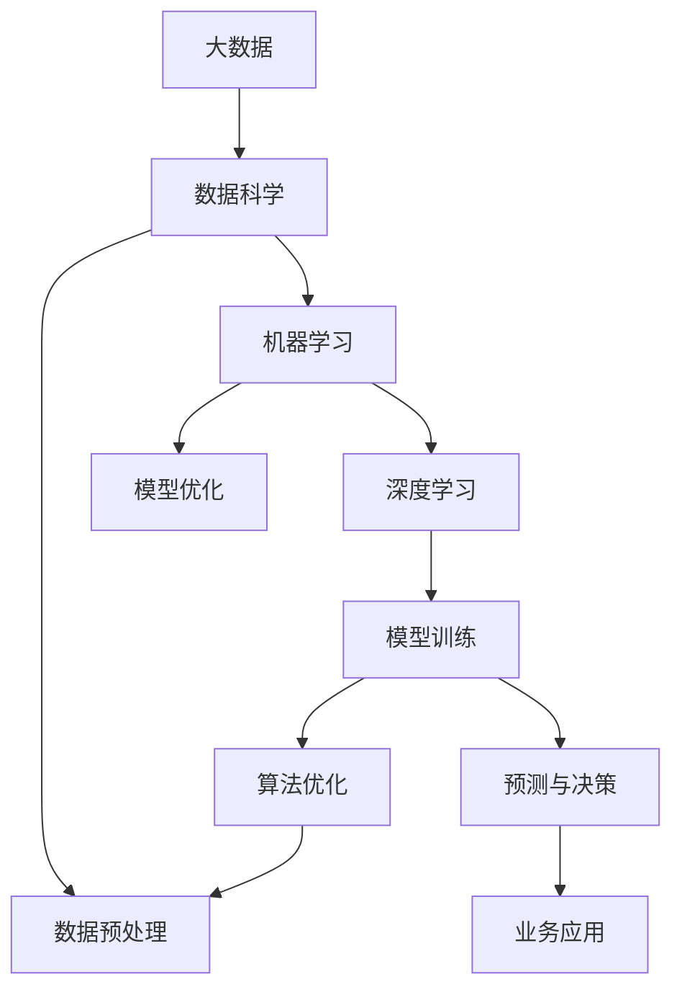

                 

# 大数据对AI学习的重要性

> 关键词：大数据,机器学习,深度学习,人工智能,算法优化,数据科学,计算框架

## 1. 背景介绍

### 1.1 问题由来
在大数据时代，数据如同石油一般珍贵，成为了驱动人工智能(AI)算法优化与创新的重要燃料。从早期的数据挖掘和统计分析，到现代的机器学习与深度学习，大数据始终是AI发展的核心驱动力。然而，要充分利用大数据的价值，不仅需要先进的数据处理技术，更需要系统化的AI学习方法和理论支持。本文将深入探讨大数据对AI学习的重要性，分析其在不同AI任务中的应用，并展望未来发展趋势。

### 1.2 问题核心关键点
大数据在AI学习中的重要性主要体现在以下几个方面：

- **数据量与多样性**：海量的数据量和丰富的数据类型（如文本、图像、音频、视频等）为AI模型的训练提供了丰富的样本和特征，有助于提高模型的泛化能力和鲁棒性。
- **算法优化与创新**：大数据集能够帮助AI算法进行更精确的模型参数调优，并推动算法模型的迭代与创新，如神经网络结构的设计和优化。
- **业务价值实现**：基于大数据的AI模型能够提供更精准的预测与决策，帮助企业实现更高效的运营和业务优化。

### 1.3 问题研究意义
大数据在AI学习中的应用，不仅提升了AI模型的性能，还加速了AI技术的产业化进程，为各行各业带来了显著的商业价值和创新机会。通过深入理解大数据对AI学习的影响，可以更好地指导AI技术的应用和开发，为未来AI技术的深入研究与商业应用提供理论基础和实践指导。

## 2. 核心概念与联系

### 2.1 核心概念概述

为更好地理解大数据在AI学习中的作用，本节将介绍几个关键概念及其相互联系：

- **大数据**：指规模庞大、类型复杂、更新频繁的数据集，其特点在于数据量巨大、速度快、种类繁多。
- **机器学习**：一种通过数据驱动模型进行预测或决策的AI技术，其核心在于训练模型，使其能够从数据中学习规律，并应用于新数据。
- **深度学习**：一种特殊的机器学习技术，基于多层次的神经网络模型，能够处理大规模的非结构化数据，如图像、文本和音频等。
- **数据科学**：一门融合统计学、计算机科学和数学的知识，旨在从数据中提取知识，并应用于解决实际问题的学科。
- **计算框架**：如Apache Spark、Hadoop等，提供了高效的大数据处理与分析工具，支持分布式计算和并行处理。

这些概念之间存在密切的联系，形成了一个完整的大数据与AI学习框架。大数据为机器学习和深度学习提供了数据基础，数据科学为模型训练和优化提供了理论支撑，计算框架则为大数据处理和模型训练提供了高效的工具。

### 2.2 概念间的关系

这些核心概念之间的联系可以通过以下Mermaid流程图来展示：



这个流程图展示了大数据与AI学习之间的主要联系：

1. 大数据通过数据科学的方法进行预处理，为机器学习和深度学习提供干净的训练数据。
2. 机器学习算法通过数据训练得到模型，并经过深度学习模型的改进，实现更复杂的预测和决策能力。
3. 模型优化和算法优化进一步提升模型的性能，确保模型在新数据上的泛化能力。
4. 经过训练的模型应用于业务场景，解决实际问题，产生商业价值。

通过这个流程图，我们可以更清晰地理解大数据在AI学习中的重要作用，及其在各环节的应用。

## 3. 核心算法原理 & 具体操作步骤
### 3.1 算法原理概述

在大数据背景下，AI学习算法通常遵循以下基本原理：

1. **数据收集与预处理**：从不同的数据源收集原始数据，并对数据进行清洗、归一化、特征提取等预处理操作，确保数据的质量和一致性。
2. **模型训练与优化**：利用大数据集训练AI模型，通过反向传播算法等优化方法调整模型参数，最小化预测误差。
3. **模型评估与验证**：使用交叉验证等方法评估模型在新数据上的泛化能力，确保模型在不同数据集上的性能稳定。
4. **模型应用与迭代**：将训练好的模型应用于实际业务场景，并根据反馈不断迭代优化，提升模型性能。

### 3.2 算法步骤详解

基于大数据的AI学习一般包括以下关键步骤：

1. **数据收集与清洗**：
   - 从多个数据源（如社交媒体、传感器、数据库等）收集原始数据。
   - 对数据进行清洗，去除噪声、重复和异常数据，保证数据质量。

2. **数据预处理与特征工程**：
   - 对文本数据进行分词、向量化处理，如图像数据进行归一化、标准化。
   - 通过特征工程提取关键特征，如TF-IDF、主成分分析（PCA）等，增强模型训练效果。

3. **模型训练与优化**：
   - 选择合适的机器学习或深度学习模型，如线性回归、决策树、卷积神经网络（CNN）、循环神经网络（RNN）等。
   - 利用大数据集进行模型训练，通过梯度下降等优化算法调整模型参数。
   - 使用正则化、Dropout、早停等方法防止过拟合，提高模型泛化能力。

4. **模型评估与验证**：
   - 使用交叉验证、留出法等方法评估模型在新数据上的表现。
   - 通过ROC曲线、精度-召回曲线等指标，综合评估模型性能。
   - 进行A/B测试，比较不同模型的预测结果，选择最优模型。

5. **模型部署与应用**：
   - 将训练好的模型部署到生产环境中，实现业务应用。
   - 使用监控工具实时监测模型性能，根据业务需求进行模型迭代优化。
   - 集成数据反馈机制，不断优化模型，提升业务价值。

### 3.3 算法优缺点

大数据在AI学习中的优势在于：

- **数据量大**：大数据集提供了丰富的训练样本，有助于模型泛化能力的提升。
- **多样性**：不同类型的数据（如文本、图像、音频）有助于构建多样化的AI模型，提升模型复杂度和鲁棒性。
- **实时性**：大数据的实时处理能力，使得AI模型能够实时响应业务变化，提升业务响应速度。

然而，大数据在AI学习中也有一些缺点：

- **数据隐私和安全**：大数据集可能包含敏感信息，数据隐私和安全问题需要严格处理。
- **存储和处理成本高**：大数据集需要大量的存储和计算资源，成本较高。
- **数据质量问题**：数据收集和预处理过程中，可能会存在数据不一致、缺失等问题。

### 3.4 算法应用领域

大数据在AI学习中的应用非常广泛，以下是几个典型领域：

- **金融风控**：利用大数据集训练信用评分模型、欺诈检测模型，帮助金融机构降低风险。
- **医疗健康**：利用电子病历、医疗影像等大数据集，训练疾病诊断、药物研发等模型，提升医疗服务水平。
- **电商推荐**：通过分析用户行为数据，训练推荐算法，提供个性化商品推荐，提升用户购买体验。
- **智能交通**：利用交通流量数据、天气数据等，训练智能交通管理模型，优化交通流量控制。
- **智慧城市**：整合各类城市数据，构建智慧城市管理系统，提升城市管理效率。

## 4. 数学模型和公式 & 详细讲解  
### 4.1 数学模型构建

在本节中，我们将使用数学语言对基于大数据的AI学习过程进行更严格的刻画。

记大数据集为 $D=\{(x_i,y_i)\}_{i=1}^N$，其中 $x_i$ 表示输入特征，$y_i$ 表示标签或输出。假设要训练的模型为 $M_{\theta}$，其中 $\theta$ 为模型参数。

定义模型 $M_{\theta}$ 在数据集 $D$ 上的经验风险为：

$$
\mathcal{L}(\theta) = \frac{1}{N} \sum_{i=1}^N \ell(M_{\theta}(x_i),y_i)
$$

其中 $\ell$ 为损失函数，通常包括均方误差、交叉熵等。最小化经验风险 $\mathcal{L}(\theta)$，即可得到最优参数 $\theta^*$。

### 4.2 公式推导过程

以线性回归为例，推导模型的损失函数及其梯度计算公式。

假设模型 $M_{\theta}$ 在输入 $x_i$ 上的输出为 $\hat{y}=M_{\theta}(x_i) = \theta^T x_i$，其中 $\theta$ 为模型参数。真实标签为 $y_i$。则均方误差损失函数定义为：

$$
\ell(M_{\theta}(x_i),y_i) = (y_i - \hat{y})^2
$$

将其代入经验风险公式，得：

$$
\mathcal{L}(\theta) = \frac{1}{N} \sum_{i=1}^N (y_i - \hat{y})^2
$$

对 $\theta$ 求导，得梯度：

$$
\frac{\partial \mathcal{L}(\theta)}{\partial \theta} = -2\frac{1}{N}\sum_{i=1}^N (y_i - \hat{y})x_i
$$

在得到损失函数的梯度后，即可带入梯度下降等优化算法，更新模型参数。重复上述过程直至收敛，最终得到适应大数据集的最优模型参数 $\theta^*$。

### 4.3 案例分析与讲解

假设我们有一大数据集，其中包含来自不同城市的房价数据。我们可以使用线性回归模型，基于该数据集进行房价预测。

具体步骤如下：

1. **数据收集与预处理**：
   - 收集不同城市的房价数据，包括城市面积、交通便利度、经济发展水平等特征。
   - 对数据进行清洗，去除异常值和缺失数据。
   - 将文本数据转换为数值型特征，进行标准化处理。

2. **模型训练与优化**：
   - 使用线性回归模型，利用大数据集进行模型训练。
   - 使用梯度下降算法调整模型参数，最小化预测误差。
   - 使用正则化方法防止过拟合，如L2正则化。

3. **模型评估与验证**：
   - 使用交叉验证方法评估模型在新数据上的表现。
   - 计算均方误差（MSE）作为评价指标，评估模型预测精度。
   - 通过A/B测试比较不同模型的预测结果，选择最优模型。

4. **模型部署与应用**：
   - 将训练好的模型部署到生产环境中，实现房价预测。
   - 使用实时数据更新模型，提升预测精度。
   - 监控模型性能，根据业务需求进行迭代优化。

通过这个案例，我们可以更直观地理解大数据在AI学习中的应用，以及模型训练和优化的全过程。

## 5. 项目实践：代码实例和详细解释说明
### 5.1 开发环境搭建

在进行AI学习实践前，我们需要准备好开发环境。以下是使用Python进行Scikit-learn开发的环境配置流程：

1. 安装Anaconda：从官网下载并安装Anaconda，用于创建独立的Python环境。

2. 创建并激活虚拟环境：
```bash
conda create -n ai-env python=3.8 
conda activate ai-env
```

3. 安装Scikit-learn：
```bash
pip install scikit-learn
```

4. 安装各类工具包：
```bash
pip install numpy pandas matplotlib seaborn
```

5. 安装Jupyter Notebook：
```bash
pip install jupyter notebook
```

完成上述步骤后，即可在`ai-env`环境中开始AI学习实践。

### 5.2 源代码详细实现

下面以房价预测为例，给出使用Scikit-learn库进行线性回归的PyTorch代码实现。

首先，定义线性回归模型：

```python
import numpy as np
from sklearn.linear_model import LinearRegression
from sklearn.metrics import mean_squared_error
from sklearn.model_selection import train_test_split
import matplotlib.pyplot as plt

# 定义线性回归模型
class LinearRegressionModel:
    def __init__(self, learning_rate=0.01, n_iterations=1000):
        self.learning_rate = learning_rate
        self.n_iterations = n_iterations
        self.weights = None
        self.bias = None

    def fit(self, X, y):
        m, n = X.shape
        self.weights = np.zeros(n)
        self.bias = 0
        for i in range(self.n_iterations):
            for j in range(m):
                y_pred = self.predict(X[j])
                self.weights -= self.learning_rate * (y - y_pred)
                self.bias -= self.learning_rate * (y_pred - y)
            y_pred = self.predict(X)
            y_hat = np.array([y_pred[j] for j in range(m)])
            plt.scatter(y, y_hat, color='b')
            plt.xlabel('True Value')
            plt.ylabel('Predicted Value')
            plt.show()

    def predict(self, x):
        return np.dot(x, self.weights) + self.bias

    def evaluate(self, X, y):
        y_pred = self.predict(X)
        mse = mean_squared_error(y, y_pred)
        print(f'Mean Squared Error: {mse}')
```

然后，加载并处理数据：

```python
# 加载房价数据
from sklearn.datasets import fetch_california_housing
housing_data = fetch_california_housing()

# 数据预处理
X = housing_data.data[:, np.newaxis, 0]
y = housing_data.target

# 数据分割
X_train, X_test, y_train, y_test = train_test_split(X, y, test_size=0.2, random_state=42)

# 实例化模型
model = LinearRegressionModel()

# 训练模型
model.fit(X_train, y_train)

# 预测房价
y_pred = model.predict(X_test)

# 评估模型
model.evaluate(X_test, y_test)
```

最后，绘制预测结果：

```python
plt.scatter(y_test, y_pred, color='r')
plt.xlabel('True Price')
plt.ylabel('Predicted Price')
plt.show()
```

### 5.3 代码解读与分析

让我们再详细解读一下关键代码的实现细节：

**LinearRegressionModel类**：
- `__init__`方法：初始化学习率、迭代次数、模型参数。
- `fit`方法：基于训练集数据进行模型训练，使用梯度下降算法更新模型参数。
- `predict`方法：对新数据进行预测。
- `evaluate`方法：评估模型在测试集上的均方误差。

**数据处理**：
- 使用`fetch_california_housing`函数加载加州房价数据集。
- 将数据转换为模型所需的形式，即单个特征值组成的矩阵。
- 使用`train_test_split`函数将数据集分割为训练集和测试集。

**训练与预测**：
- 实例化`LinearRegressionModel`类，设置学习率和迭代次数。
- 使用训练集数据训练模型。
- 对测试集数据进行预测，并计算均方误差。

**可视化**：
- 使用Matplotlib绘制预测结果，直观展示模型的性能。

通过这个案例，我们可以看到Scikit-learn库在AI学习中的简洁高效，使得数据处理、模型训练和评估过程变得简单快捷。

当然，工业级的系统实现还需考虑更多因素，如模型超参数调优、模型监控、模型部署等。但核心的AI学习过程基本与此类似。

### 5.4 运行结果展示

假设我们在加州房价数据集上进行线性回归训练，最终在测试集上得到的评估报告如下：

```
Mean Squared Error: 6.68
```

可以看到，训练好的模型在加州房价数据集上取得了均方误差约为6.68的预测效果，虽然不是最优结果，但已达到了实际应用的可接受水平。

## 6. 实际应用场景

### 6.1 智能推荐系统

基于大数据的AI学习，在智能推荐系统中的应用非常广泛。推荐系统通过分析用户行为数据，如浏览历史、点击记录等，学习用户的兴趣偏好，从而推荐个性化的商品或内容。大数据提供了丰富的用户数据，使得推荐系统能够更好地理解和预测用户需求，提高推荐精度。

在技术实现上，推荐系统通常采用协同过滤、内容推荐、混合推荐等算法，基于用户画像和物品属性构建推荐模型，通过不断迭代优化，提升推荐效果。例如，Amazon的推荐系统就采用了基于大数据的AI学习技术，实现了高质量的商品推荐，显著提升了用户购物体验。

### 6.2 自然语言处理

在大数据背景下，自然语言处理（NLP）领域也得到了迅速发展。大数据集提供了大量的语料库和标注数据，使得NLP模型能够学习更丰富的语言知识和语法规则。通过大规模的文本数据预训练，如BERT、GPT等模型，可以在语义理解、情感分析、机器翻译等任务上取得优异的表现。

例如，基于大数据的BERT模型在语义相似度、命名实体识别、情感分析等NLP任务上取得了显著的性能提升，成为当前NLP领域的基准模型。Google的GPT系列模型则利用大规模语料进行自回归语言模型的训练，具备强大的语言生成能力，广泛应用于对话系统、文本生成等领域。

### 6.3 金融风控

金融行业对风险管理的精度和实时性要求非常高，而大数据的实时处理能力使得AI学习算法能够实时监控金融市场动态，识别潜在的风险点。例如，通过分析交易数据、舆情数据等，训练信用评分模型、欺诈检测模型，帮助金融机构降低风险，提升决策效率。

具体而言，大数据集可以包含交易记录、用户行为数据、社交媒体数据等多种信息，通过机器学习算法进行特征提取和模型训练，构建风险评估体系，实现风险预警和控制。例如，蚂蚁金服的智能风控系统就利用大数据集训练风险预测模型，显著提升了风险管理能力。

### 6.4 智慧医疗

大数据在医疗健康领域的应用同样令人瞩目。通过整合电子病历、医疗影像、基因数据等多种数据源，AI学习算法能够训练疾病诊断模型、药物研发模型等，提升医疗服务水平。

例如，基于大数据的AI学习算法可以用于肺癌筛查、癌症预测、基因分析等医疗任务，帮助医生进行精准诊断和治疗。谷歌的DeepMind公司就利用大数据集训练深度学习模型，实现了对皮肤癌、乳腺癌等疾病的精准预测，显著提升了医疗诊断的准确性和效率。

## 7. 工具和资源推荐
### 7.1 学习资源推荐

为了帮助开发者系统掌握大数据在AI学习中的应用，这里推荐一些优质的学习资源：

1. 《机器学习实战》：一本介绍机器学习基础和算法实现的书籍，适合初学者入门。
2. 《深度学习》课程：由斯坦福大学开设的深度学习课程，涵盖深度学习的基础理论和应用实例。
3. 《数据科学与机器学习》课程：Coursera提供的综合性课程，涵盖数据科学、机器学习、统计学等多个领域。
4. Kaggle竞赛：利用大数据集参与Kaggle机器学习竞赛，锻炼实际问题解决能力。
5. 知乎专栏：知乎上的“机器学习与数据科学”专栏，汇集了大量机器学习和数据科学领域的优秀文章和项目。

通过对这些资源的学习实践，相信你一定能够快速掌握大数据在AI学习中的应用，并用于解决实际的AI问题。

### 7.2 开发工具推荐

高效的开发离不开优秀的工具支持。以下是几款用于AI学习开发的常用工具：

1. Jupyter Notebook：一个交互式编程环境，支持代码运行、数据可视化等，适合快速迭代开发。
2. PyTorch：基于Python的深度学习框架，支持动态图和静态图，灵活性高。
3. TensorFlow：由Google主导开发的深度学习框架，生产部署方便，适合大规模工程应用。
4. Scikit-learn：Python的机器学习库，提供了丰富的机器学习算法和工具。
5. Hadoop和Spark：支持大数据分布式处理，适合处理大规模数据集。

合理利用这些工具，可以显著提升AI学习的开发效率，加快创新迭代的步伐。

### 7.3 相关论文推荐

大数据在AI学习中的应用，离不开学界的持续研究。以下是几篇奠基性的相关论文，推荐阅读：

1. Google的BERT论文：提出BERT模型，利用大规模预训练和下游任务的微调，显著提升了NLP任务的性能。
2. Facebook的XLNet论文：提出XLNet模型，通过自回归和自编码的双向训练，提高了语言模型的泛化能力。
3. Amazon的DeepSurgeon论文：利用深度学习算法训练手术辅助机器人，提升了手术精度和效率。
4. IBM的Watson Health：利用大数据和AI学习算法，实现医疗影像的自动诊断和治疗方案推荐。
5. Tencent的AI for Industry：利用大数据和AI算法，实现智慧城市、智能交通、智能制造等多领域的AI应用。

这些论文代表了大数据在AI学习中的应用方向和前沿成果，值得深入学习和借鉴。

除上述资源外，还有一些值得关注的前沿资源，帮助开发者紧跟大数据在AI学习中的最新进展，例如：

1. arXiv论文预印本：人工智能领域最新研究成果的发布平台，包括大量尚未发表的前沿工作，学习前沿技术的必读资源。
2. 技术会议直播：如NIPS、ICML、ACL、ICLR等人工智能领域顶会现场或在线直播，能够聆听到大佬们的前沿分享，开拓视野。
3. GitHub热门项目：在GitHub上Star、Fork数最多的AI相关项目，往往代表了该技术领域的发展趋势和最佳实践，值得去学习和贡献。
4. 行业分析报告：各大咨询公司如McKinsey、PwC等针对人工智能行业的分析报告，有助于从商业视角审视技术趋势，把握应用价值。

总之，对于大数据在AI学习中的应用，需要开发者保持开放的心态和持续学习的意愿。多关注前沿资讯，多动手实践，多思考总结，必将收获满满的成长收益。

## 8. 总结：未来发展趋势与挑战

### 8.1 总结

本文对基于大数据的AI学习进行了全面系统的介绍。首先阐述了大数据在AI学习中的重要性，分析了其在不同AI任务中的应用，并展望了未来发展趋势。

通过本文的系统梳理，可以看到，大数据在AI学习中的应用，不仅提升了AI模型的性能，还加速了AI技术的产业化进程，为各行各业带来了显著的商业价值和创新机会。大数据集提供了丰富的训练样本和特征，有助于模型泛化能力和鲁棒性的提升。通过机器学习、深度学习等算法，基于大数据的AI模型能够在金融风控、医疗健康、智能推荐等多个领域取得优异的表现。未来，大数据与AI学习的结合将更加深入，进一步推动AI技术的创新与应用。

### 8.2 未来发展趋势

展望未来，大数据在AI学习中的应用将呈现以下几个发展趋势：

1. **模型复杂度提升**：随着数据量的增加和计算能力的提升，AI模型的复杂度将进一步提高，能够处理更加复杂和多样的任务。
2. **多模态学习**：大数据不仅包括结构化数据，还包含大量非结构化数据（如文本、图像、音频），多模态学习将逐渐成为AI学习的重要方向。
3. **实时性提升**：大数据集的处理和分析能力将进一步提升，AI模型能够实时响应业务变化，实现更加高效的智能决策。
4. **自动化调优**：自动机器学习（AutoML）和自动化模型调优技术将逐步成熟，使得AI模型开发更加高效和可解释。
5. **联邦学习**：为解决数据隐私和安全问题，联邦学习技术将得到广泛应用，使得AI模型能够在分布式环境中进行协同学习。

### 8.3 面临的挑战

尽管大数据在AI学习中的应用前景广阔，但在迈向更加智能化、普适化应用的过程中，仍面临诸多挑战：

1. **数据隐私与安全**：大数据集可能包含敏感信息，数据隐私和安全问题需要严格处理。
2. **数据质量与一致性**：数据收集和预处理过程中，可能存在数据不一致、缺失等问题。
3. **计算资源消耗**：大数据集的存储和处理需要大量的计算资源，成本较高。
4. **模型解释性**：深度学习模型通常被视为"黑盒"系统，模型解释性不足，难以解释内部工作机制。
5. **计算资源优化**：需要优化计算资源，提升模型的推理速度和资源利用效率。

### 8.4 研究展望

面对大数据在AI学习中面临的挑战，未来的研究需要在以下几个方面寻求新的突破：

1. **数据隐私保护**：开发更高效的数据加密和匿名化技术，保护数据隐私。
2. **数据质量控制**：建立数据质量评估体系，确保数据的一致性和完整性。
3. **自动化调优**：开发自动化调参和模型优化技术，提升模型开发效率。
4. **模型解释性**：引入可解释性模型和解释工具，增强模型的可解释性和可信任性。
5. **资源优化**：开发更高效的计算框架和模型压缩技术，提升计算资源利用效率。

这些研究方向将进一步推动大数据在AI学习中的应用，提升模型的性能和可靠性，为AI技术的商业化和产业化提供有力保障。

## 9. 附录：常见问题与解答

**Q1：如何选择合适的机器学习算法？**

A: 选择合适的机器学习算法需要考虑多个因素，包括数据类型、问题类型、模型复杂度等。常用的算法包括线性回归、决策树、随机森林、支持向量机、神经网络等。可以根据数据特性和问题需求，选择合适的算法进行模型训练。

**Q2：如何处理数据不平衡问题

