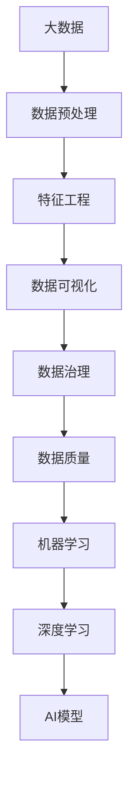

                 

# 大数据：AI学习的基石

> 关键词：大数据、人工智能(AI)、机器学习、深度学习、数据挖掘、数据预处理、特征工程、数据可视化、数据治理、数据质量

## 1. 背景介绍

### 1.1 问题由来
在过去几十年里，信息技术以惊人的速度快速发展，深刻改变了人类社会的各个方面。尤其是随着互联网、移动互联网和物联网的普及，数据量呈爆炸式增长。大数据成为信息时代的核心资产，对各行各业产生了深远的影响。而人工智能（AI）作为当代最具潜力的技术之一，正逐渐从理论研究走向实际应用，其中，大数据是AI学习和应用的重要基石。

### 1.2 问题核心关键点
大数据和AI之间的关系是密不可分的。一方面，大数据为AI提供了丰富的数据来源和训练材料，使得AI模型能够不断学习和进步。另一方面，AI技术的发展和应用，也极大地提升了大数据的价值和应用前景。本文将重点探讨大数据在AI学习中的重要角色，以及如何利用大数据来提升AI模型的性能和应用效果。

### 1.3 问题研究意义
理解和掌握大数据在AI学习中的应用，对于推动AI技术的发展和应用具有重要意义。这不仅能帮助企业更好地利用数据资源，提高运营效率和决策水平，还能促进AI技术在更多行业和领域的落地和应用，为未来的智能社会建设奠定坚实的基础。

## 2. 核心概念与联系

### 2.1 核心概念概述

为了深入理解大数据在AI学习中的应用，首先需要明确一些核心概念：

- **大数据（Big Data）**：指在传统数据处理应用软件无法有效处理的大量和/或复杂的数据集。通常包含结构化数据、半结构化数据和非结构化数据，涉及面广，数据量庞大。
- **人工智能（AI）**：使用算法、统计模型和计算工具来模拟人类智能，进行感知、决策、学习和执行任务的能力。
- **机器学习（ML）**：一种人工智能的分支，通过数据训练模型，使模型能够自动学习和改进，而无需显式编程。
- **深度学习（DL）**：一种特殊的机器学习方法，使用神经网络模型对大规模数据进行端到端学习，以提高模型的表示能力和泛化能力。
- **数据挖掘（Data Mining）**：从大规模数据集中提取有用信息和知识的过程，包括分类、聚类、关联规则挖掘等。
- **数据预处理（Data Preprocessing）**：对原始数据进行清洗、转换和规范化，以提高数据质量和可用性。
- **特征工程（Feature Engineering）**：设计和提取对模型学习有用的特征，以提升模型的表现和效果。
- **数据可视化（Data Visualization）**：使用图表、图形等方式将数据进行可视化展示，帮助理解数据和模型。
- **数据治理（Data Governance）**：确保数据的质量、完整性和可用性，制定数据使用和管理标准。
- **数据质量（Data Quality）**：描述数据集的质量水平，包括准确性、完整性、一致性、及时性和可信度等。

这些概念共同构成了大数据在AI学习中的基础框架，帮助我们在设计和实现AI模型时，能够全面考虑数据的特点和应用需求。

### 2.2 概念间的关系

下图展示了大数据与AI学习之间的关键联系和作用机制。



这个流程图展示了从数据预处理到最终AI模型构建的全过程，强调了数据质量在整个环节中的重要性。大数据不仅为AI学习提供了丰富的数据资源，还通过数据治理和特征工程等手段，提高了数据的质量和可用性，从而提升了AI模型的性能和应用效果。

## 3. 核心算法原理 & 具体操作步骤
### 3.1 算法原理概述

在大数据背景下，AI的学习过程主要分为数据预处理、特征工程、模型训练和模型应用四个步骤。其中，数据预处理和特征工程是AI学习的基础，模型训练是核心，模型应用是最终目标。

### 3.2 算法步骤详解

**步骤1：数据预处理**

数据预处理是大数据在AI学习中的第一步，也是最为关键的一步。其目的是清洗、转换和规范化原始数据，以提高数据质量和可用性。具体步骤如下：

1. **数据清洗**：去除重复、缺失和异常数据，保证数据的一致性和完整性。
2. **数据转换**：将数据从原始格式转换为适合模型处理的形式，如标准化、归一化等。
3. **数据规范化**：将不同来源的数据按照统一的标准进行转换，保证数据的兼容性和可比性。

**步骤2：特征工程**

特征工程是大数据在AI学习中的重要环节，其目的是从原始数据中提取有用的特征，以提升模型的性能和效果。具体步骤如下：

1. **特征选择**：从原始数据中筛选出对模型学习有用的特征。
2. **特征提取**：使用数学、统计等方法从原始数据中提取新的特征。
3. **特征转换**：将特征进行转换，如生成多项式特征、组合特征等。

**步骤3：模型训练**

模型训练是大数据在AI学习中的核心步骤，其目的是通过数据训练模型，使其能够自动学习和改进。具体步骤如下：

1. **选择合适的算法**：根据任务类型和数据特点选择合适的机器学习或深度学习算法。
2. **划分训练集和测试集**：将数据划分为训练集和测试集，用于模型训练和测试。
3. **训练模型**：使用训练集数据训练模型，优化模型参数。
4. **模型评估**：使用测试集数据评估模型性能，调整模型参数。

**步骤4：模型应用**

模型应用是大数据在AI学习中的最终目标，其目的是将训练好的模型应用于实际问题，以解决问题和提高决策水平。具体步骤如下：

1. **模型部署**：将训练好的模型部署到实际应用中。
2. **模型监控**：实时监控模型性能和运行状态，及时调整参数和优化模型。
3. **模型维护**：定期维护和更新模型，保证模型的稳定性和可靠性。

### 3.3 算法优缺点

大数据在AI学习中的应用具有以下优点：

1. **数据丰富性**：大数据提供了丰富的数据资源，使得AI模型能够不断学习和进步。
2. **数据多样性**：大数据包含结构化、半结构化和非结构化数据，能够全面反映真实世界的情况。
3. **数据时效性**：大数据实时更新，能够及时反映变化，提高AI模型的适应性和应用效果。

同时，大数据在AI学习中也存在一些缺点：

1. **数据质量问题**：大数据通常存在数据质量问题，如缺失、异常、重复等，影响模型的准确性和可靠性。
2. **数据安全问题**：大数据涉及大量敏感信息，可能存在数据泄露和隐私风险。
3. **数据处理难度大**：大数据量庞大，处理复杂，需要先进的处理技术和工具。

### 3.4 算法应用领域

大数据在AI学习中的应用领域非常广泛，包括但不限于以下几个方面：

1. **金融领域**：大数据在金融领域的应用包括信用评分、风险管理、欺诈检测等，通过分析大量交易数据，提高金融机构的运营效率和风险控制能力。
2. **医疗领域**：大数据在医疗领域的应用包括疾病预测、基因分析、药物研发等，通过分析海量医疗数据，提升医疗服务的质量和效率。
3. **零售领域**：大数据在零售领域的应用包括销售预测、客户分析、供应链优化等，通过分析消费者行为和市场数据，提高零售企业的市场竞争力和客户满意度。
4. **交通领域**：大数据在交通领域的应用包括交通流量预测、智能交通管理、交通拥堵缓解等，通过分析交通数据，优化交通系统，提高交通效率。
5. **制造业**：大数据在制造业的应用包括设备维护、质量控制、生产优化等，通过分析生产数据，提高生产效率和产品质量。

## 4. 数学模型和公式 & 详细讲解 & 举例说明

### 4.1 数学模型构建

在大数据背景下，AI模型的构建通常使用机器学习和深度学习算法。以下是一个简单的线性回归模型的构建过程：

**假设**：
- 输入特征为 $x$，目标变量为 $y$。
- 线性回归模型的参数为 $\theta$。

**目标**：
- 最小化预测值和实际值之间的误差，即 $J(\theta) = \frac{1}{2m} \sum_{i=1}^m (h_\theta(x^{(i)}) - y^{(i)})^2$。

**求解**：
- 使用梯度下降算法，求解最小化目标函数 $J(\theta)$。

**步骤**：
1. 随机初始化模型参数 $\theta$。
2. 对于每个训练样本 $x^{(i)}$，计算预测值 $h_\theta(x^{(i)}) = \theta^T x^{(i)}$。
3. 计算目标函数的梯度 $\nabla_\theta J(\theta)$。
4. 使用梯度下降算法，更新模型参数 $\theta = \theta - \eta \nabla_\theta J(\theta)$。
5. 重复步骤2-4，直到目标函数收敛或达到预设的迭代次数。

### 4.2 公式推导过程

假设有一个简单的线性回归模型 $h_\theta(x) = \theta^T x$，目标是最小化均方误差损失函数 $J(\theta) = \frac{1}{2m} \sum_{i=1}^m (h_\theta(x^{(i)}) - y^{(i)})^2$。

**推导过程**：

1. 对 $J(\theta)$ 关于 $\theta$ 求偏导数，得到梯度：
$$
\nabla_\theta J(\theta) = \frac{1}{m} \sum_{i=1}^m (h_\theta(x^{(i)}) - y^{(i)}) x^{(i)}
$$

2. 使用梯度下降算法更新 $\theta$：
$$
\theta = \theta - \eta \nabla_\theta J(\theta)
$$

3. 代入 $\nabla_\theta J(\theta)$ 的表达式，得到更新公式：
$$
\theta = \theta - \eta \frac{1}{m} \sum_{i=1}^m (h_\theta(x^{(i)}) - y^{(i)}) x^{(i)}
$$

4. 代入 $h_\theta(x) = \theta^T x$ 的表达式，得到最终更新公式：
$$
\theta = \theta - \eta \frac{1}{m} \sum_{i=1}^m ((\theta^T x^{(i)}) - y^{(i)}) x^{(i)}
$$

通过上述推导过程，我们可以看到，线性回归模型的参数更新是通过梯度下降算法实现的，每次迭代都会根据梯度方向调整参数，以最小化目标函数。

### 4.3 案例分析与讲解

假设我们有一个简单的数据集，包含 $x$ 和 $y$ 两个变量，如下所示：

| $x$ | $y$ |
| --- | --- |
| 1   | 1   |
| 2   | 2   |
| 3   | 3   |

我们可以使用线性回归模型对数据进行拟合，使用梯度下降算法求解最优参数 $\theta$。

**步骤1**：随机初始化模型参数 $\theta = [0, 0]$。

**步骤2**：对于每个训练样本 $x^{(i)}$，计算预测值 $h_\theta(x^{(i)}) = \theta^T x^{(i)}$。

**步骤3**：计算目标函数的梯度 $\nabla_\theta J(\theta)$。

**步骤4**：使用梯度下降算法，更新模型参数 $\theta = \theta - \eta \nabla_\theta J(\theta)$。

通过上述步骤，我们可以得到最优的参数 $\theta = [1, 1]$，即线性回归模型为 $h_\theta(x) = x$。

## 5. 项目实践：代码实例和详细解释说明

### 5.1 开发环境搭建

在进行AI项目实践前，我们需要准备好开发环境。以下是使用Python进行Scikit-learn开发的开发环境配置流程：

1. 安装Anaconda：从官网下载并安装Anaconda，用于创建独立的Python环境。

2. 创建并激活虚拟环境：
```bash
conda create -n myenv python=3.8 
conda activate myenv
```

3. 安装Scikit-learn：
```bash
pip install scikit-learn
```

4. 安装NumPy、Pandas等库：
```bash
pip install numpy pandas matplotlib seaborn
```

5. 安装Jupyter Notebook：
```bash
pip install jupyter notebook
```

完成上述步骤后，即可在`myenv`环境中开始AI项目实践。

### 5.2 源代码详细实现

以下是一个简单的线性回归模型的实现，使用Scikit-learn库进行数据预处理和模型训练。

```python
from sklearn.linear_model import LinearRegression
from sklearn.model_selection import train_test_split
import numpy as np

# 准备数据
X = np.array([[1], [2], [3]])
y = np.array([1, 2, 3])

# 划分训练集和测试集
X_train, X_test, y_train, y_test = train_test_split(X, y, test_size=0.2, random_state=0)

# 训练模型
model = LinearRegression()
model.fit(X_train, y_train)

# 测试模型
y_pred = model.predict(X_test)

# 输出结果
print("训练集得分：", model.score(X_train, y_train))
print("测试集得分：", model.score(X_test, y_test))
```

在这个例子中，我们首先准备了数据集，然后使用Scikit-learn的`train_test_split`函数将数据集划分为训练集和测试集。接着，我们使用`LinearRegression`类训练线性回归模型，并使用`predict`函数进行预测。最后，我们输出了模型的训练集和测试集得分。

### 5.3 代码解读与分析

让我们再详细解读一下关键代码的实现细节：

**线性回归模型**：
- 首先，我们使用`LinearRegression`类创建了一个线性回归模型。
- 接着，我们使用`fit`函数对模型进行训练，将训练集数据作为输入参数。
- 最后，我们使用`predict`函数对测试集数据进行预测。

**数据划分**：
- 我们使用`train_test_split`函数将数据集划分为训练集和测试集。
- 其中，`test_size`参数指定了测试集的比例，`random_state`参数指定了随机种子，以保证每次划分结果的一致性。

**输出结果**：
- 我们使用`score`函数计算模型在训练集和测试集上的得分，即R平方值。
- 这个值越大，说明模型的拟合效果越好。

这个例子展示了Scikit-learn库在数据预处理和模型训练中的使用。通过这个例子，我们可以看到，Scikit-learn库提供了简单易用的API，使得数据预处理和模型训练变得非常容易。

## 6. 实际应用场景

### 6.1 智能推荐系统

智能推荐系统是大数据在AI学习中的一个重要应用场景。通过分析用户的行为数据，推荐系统能够预测用户的兴趣和需求，从而提供个性化的推荐内容。

在实践中，我们可以使用用户的历史行为数据，如浏览记录、点击记录、购买记录等，作为训练数据。然后使用机器学习或深度学习模型，训练推荐系统模型，从而实现个性化推荐。

**技术实现**：
- 使用Scikit-learn或TensorFlow等库，训练推荐模型。
- 使用特征工程技术，提取用户和物品的特征。
- 使用数据挖掘技术，发现用户兴趣和行为规律。
- 使用模型评估技术，评估推荐模型的性能和效果。

**应用案例**：
- 电商平台：推荐用户可能感兴趣的商品。
- 新闻网站：推荐用户可能感兴趣的文章。
- 视频平台：推荐用户可能感兴趣的视频。

### 6.2 金融风险控制

金融风险控制是大数据在AI学习中的另一个重要应用场景。通过分析大量金融数据，金融机构能够及时发现和防范风险，保障金融安全。

在实践中，我们可以使用历史交易数据、市场数据、新闻数据等作为训练数据。然后使用机器学习或深度学习模型，训练风险控制模型，从而实现风险预警和防范。

**技术实现**：
- 使用Scikit-learn或TensorFlow等库，训练风险控制模型。
- 使用数据预处理技术，清洗和转换数据。
- 使用特征工程技术，提取有用的特征。
- 使用模型评估技术，评估风险控制模型的性能和效果。

**应用案例**：
- 银行：预警信用卡欺诈行为。
- 证券公司：预测股票价格变化。
- 保险公司：评估客户信用风险。

### 6.3 智能制造

智能制造是大数据在AI学习中的另一个重要应用场景。通过分析生产数据和设备数据，智能制造系统能够优化生产流程，提高生产效率和产品质量。

在实践中，我们可以使用生产线数据、设备数据、工人数据等作为训练数据。然后使用机器学习或深度学习模型，训练智能制造系统模型，从而实现生产优化。

**技术实现**：
- 使用Scikit-learn或TensorFlow等库，训练智能制造系统模型。
- 使用数据预处理技术，清洗和转换数据。
- 使用特征工程技术，提取有用的特征。
- 使用模型评估技术，评估智能制造系统模型的性能和效果。

**应用案例**：
- 汽车制造：优化装配线流程。
- 电子制造：提高产品质量。
- 食品制造：优化供应链管理。

## 7. 工具和资源推荐

### 7.1 学习资源推荐

为了帮助开发者系统掌握大数据在AI学习中的应用，这里推荐一些优质的学习资源：

1. **《Python机器学习》**：一本经典的机器学习教材，详细介绍了机器学习的基本概念和算法。
2. **《深度学习》**：DeepMind联合创始人Ian Goodfellow所著，系统介绍了深度学习的基本原理和应用。
3. **《大数据分析实战》**：讲解大数据处理和分析的实用技术和工具，包括Hadoop、Spark等。
4. **《数据科学手册》**：一本全面的数据科学教材，涵盖了数据科学的基本概念和实践。
5. **Kaggle**：一个数据科学竞赛平台，提供了大量真实数据集和模型竞赛，帮助学习者提升技能。

通过对这些资源的学习实践，相信你一定能够快速掌握大数据在AI学习中的应用，并用于解决实际的AI问题。

### 7.2 开发工具推荐

高效的开发离不开优秀的工具支持。以下是几款用于AI项目开发的常用工具：

1. **Python**：一种强大的编程语言，支持多种开源库和框架，适用于数据科学和机器学习项目。
2. **Jupyter Notebook**：一个交互式的笔记本环境，支持多种编程语言和库，适合数据探索和模型开发。
3. **Scikit-learn**：一个开源的机器学习库，提供了多种机器学习算法和工具。
4. **TensorFlow**：由Google开发的深度学习框架，支持分布式计算和模型部署。
5. **PyTorch**：一个开源的深度学习框架，提供了灵活的动态计算图和丰富的模型库。

合理利用这些工具，可以显著提升AI项目开发的效率，加快创新迭代的步伐。

### 7.3 相关论文推荐

大数据在AI学习中的应用源于学界的持续研究。以下是几篇奠基性的相关论文，推荐阅读：

1. **《Google 大数据分析：原则与实践》**：谷歌开源的大数据分析指南，详细介绍了大数据处理和分析的最佳实践。
2. **《大数据的统计分析》**：统计学家David B. Dunson和Jeff A. Bilmes所著，介绍了大数据的统计分析方法。
3. **《大数据与人工智能》**：一本综合性的书籍，介绍了大数据和AI的基本概念和应用。
4. **《机器学习：理论与算法》**：斯坦福大学教授Tom Mitchell所著，系统介绍了机器学习的基本理论和算法。
5. **《深度学习：概念与实践》**：深度学习专家Ian Goodfellow、Yoshua Bengio和Aaron Courville所著，详细介绍了深度学习的基本概念和实践。

这些论文代表了大数据在AI学习的发展脉络。通过学习这些前沿成果，可以帮助研究者把握学科前进方向，激发更多的创新灵感。

除上述资源外，还有一些值得关注的前沿资源，帮助开发者紧跟大数据和AI学习的最新进展，例如：

1. **arXiv论文预印本**：人工智能领域最新研究成果的发布平台，包括大量尚未发表的前沿工作，学习前沿技术的必读资源。
2. **顶级会议论文**：如NIPS、ICML、CVPR、ACL等人工智能领域顶级会议的论文，代表了当前领域的最新研究进展。
3. **行业分析报告**：各大咨询公司如McKinsey、PwC等针对大数据和AI行业的分析报告，有助于从商业视角审视技术趋势，把握应用价值。

总之，对于大数据在AI学习的应用，需要开发者保持开放的心态和持续学习的意愿。多关注前沿资讯，多动手实践，多思考总结，必将收获满满的成长收益。

## 8. 总结：未来发展趋势与挑战

### 8.1 研究成果总结

本文对大数据在AI学习中的应用进行了全面系统的介绍。首先阐述了大数据和AI学习的关系，明确了大数据在AI学习中的重要角色。其次，从数据预处理、特征工程、模型训练和模型应用四个方面，详细讲解了AI模型的构建过程。最后，我们展示了大数据在多个领域的应用案例，并推荐了一些优质的学习资源和开发工具。

通过本文的系统梳理，可以看到，大数据不仅为AI学习提供了丰富的数据资源，还通过数据预处理和特征工程等手段，提高了数据的质量和可用性，从而提升了AI模型的性能和应用效果。大数据在AI学习中的地位和作用，将随着技术的不断进步和应用领域的不断拓展，愈发重要。

### 8.2 未来发展趋势

展望未来，大数据在AI学习中的应用将呈现以下几个发展趋势：

1. **数据规模不断扩大**：随着互联网、物联网和传感器技术的发展，数据规模将不断扩大，数据类型也将更加多样化。
2. **数据处理技术不断提升**：数据处理技术和工具将不断提升，如分布式计算、大数据分析等，使得数据处理更加高效和便捷。
3. **数据治理和隐私保护**：数据治理和隐私保护将成为重要的研究方向，确保数据的安全性和可用性。
4. **数据驱动的AI应用**：AI应用将更加依赖于数据，数据驱动的AI将变得更加重要。
5. **跨领域数据融合**：不同领域的数据将更加容易融合和共享，促进跨领域的AI应用。

以上趋势凸显了大数据在AI学习中的广阔前景。这些方向的探索发展，必将进一步提升AI系统的性能和应用效果，为构建智能社会奠定坚实的基础。

### 8.3 面临的挑战

尽管大数据在AI学习中取得了显著进展，但在迈向更加智能化、普适化应用的过程中，它仍面临着诸多挑战：

1. **数据质量问题**：大数据通常存在数据质量问题，如缺失、异常、重复等，影响模型的准确性和可靠性。
2. **数据安全问题**：大数据涉及大量敏感信息，可能存在数据泄露和隐私风险。
3. **数据处理难度大**：大数据量庞大，处理复杂，需要先进的处理技术和工具。
4. **计算资源需求高**：大数据处理和分析需要大量的计算资源，包括高性能计算设备和算法。
5. **数据隐私保护**：数据隐私保护将成为重要的研究方向，确保数据的安全性和合法性。

### 8.4 研究展望

面对大数据在AI学习中所面临的挑战，未来的研究需要在以下几个方面寻求新的突破：

1. **提高数据质量**：通过数据清洗、数据增强等技术，提高数据的质量和可用性。
2. **加强数据治理**：制定数据使用和管理标准，确保数据的安全性和合法性。
3. **优化数据处理**：开发高效的数据处理算法和技术，提高数据处理效率。
4. **提升数据隐私保护**：研究数据隐私保护技术和方法，确保数据的安全性和隐私性。
5. **探索数据驱动的AI应用**：研究数据驱动的AI应用，提高AI系统的性能和应用效果。

这些研究方向的探索，必将引领大数据在AI学习中的持续发展，为构建更加智能、可靠和安全的AI系统提供技术支撑。

## 9. 附录：常见问题与解答

**Q1：如何提高数据质量？**

A: 提高数据质量是AI项目成功的关键。以下是一些常见的提高数据质量的方法：

1. **数据清洗**：去除重复、缺失和异常数据，保证数据的一致性和完整性。
2. **数据增强**：通过数据扩充、数据合成等方式，增加数据的多样性和数量。
3. **数据标准化**：将不同来源的数据按照统一的标准进行转换，保证数据的兼容性和可比性。
4. **数据预处理**：对数据进行规范化、归一化等处理，提高数据的质量和可用性。

**Q2：如何提高数据处理效率？**

A: 提高数据处理效率是大数据处理的关键。以下是一些常见的方法：

1. **分布式计算**：使用分布式计算框架，如Hadoop、Spark等，提高数据处理的效率。
2. **数据压缩**：使用数据压缩技术，减少数据的存储和传输成本。
3. **数据并行处理**：使用数据并行处理技术，如MapReduce、Spark等，提高数据处理的效率。
4. **数据缓存**：使用数据缓存技术，减少数据访问时间，提高数据处理速度。

**Q3：如何保护数据隐私？**

A: 数据隐私保护是大数据处理中的重要问题。以下是一些常见的方法：

1. **数据匿名化**：对数据进行匿名化处理，保护用户的隐私。
2. **数据加密**：对数据进行加密处理，防止

