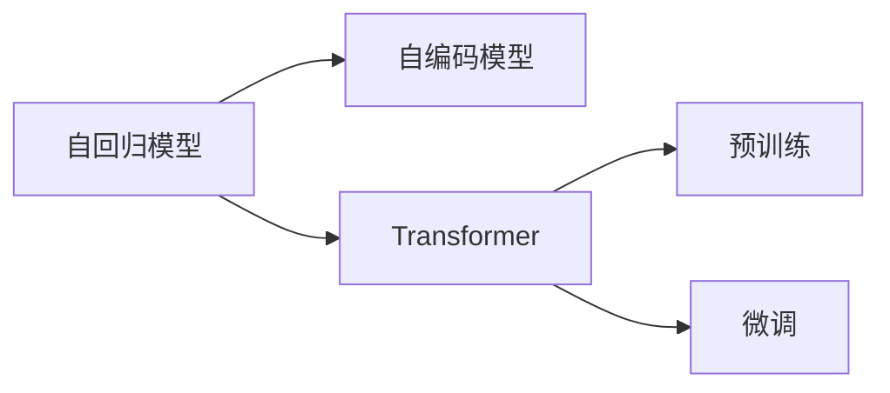

                 

# 大模型体系结构探索：解构AI LLM的内部工作机制

## 1. 背景介绍

近年来，随着深度学习技术的飞速发展，特别是自回归语言模型（如GPT系列）和自编码语言模型（如BERT系列）的突破，大语言模型（Large Language Models, LLMs）成为了人工智能研究的前沿领域。大模型具有海量的参数和复杂的结构，能够在各种自然语言处理（NLP）任务中取得优异的表现。了解大语言模型的内部工作机制，对于深入理解其功能和应用具有重要意义。

本文将重点探索大语言模型的体系结构，通过理论分析、案例展示和实践指南，揭示其内部工作原理，并讨论其优化策略和应用场景，旨在为人工智能领域的开发者和研究者提供深入的洞察和实用的指导。

## 2. 核心概念与联系

### 2.1 核心概念概述

在大语言模型的研究中，有几个关键的概念需要重点关注：

- **自回归模型（AR）**：这种模型通过顺序预测每个输出，即对于每个位置，根据前一个位置的信息来预测当前位置的输出。GPT系列模型就是典型的自回归模型。

- **自编码模型（AE）**：自编码模型通过编码和解码两个步骤，将输入映射到隐空间，再将隐空间映射回输入空间，以保留输入的主要特征。BERT等模型即基于自编码的思想。

- **Transformer**：Transformer模型是现代神经网络架构的代表，通过注意力机制来实现序列到序列的转换。Transformer模型在大模型中的应用极为广泛，包括BERT、T5、XLNet等。

- **预训练与微调**：大模型通常首先在无监督的大规模数据上预训练，然后在特定任务的数据上进行微调，以适应特定任务的需求。

### 2.2 核心概念的联系

这些概念之间存在紧密的联系，形成了一个完整的大语言模型工作机制。自回归模型和自编码模型构成了大语言模型的基础，而Transformer则在大模型的结构设计中起到了关键作用。预训练与微调技术则是大模型从大规模无标签数据中学习知识，并应用于特定任务的关键步骤。

以下是一个Mermaid流程图，展示了这些概念之间的关系：



通过这个流程图，我们可以清楚地看到，自回归模型和自编码模型为大模型的结构和预训练提供了基础，而Transformer在大模型的设计中起到了核心的作用。预训练和微调则是大模型从大规模无标签数据中学习知识，并应用于特定任务的关键步骤。

## 3. 核心算法原理 & 具体操作步骤

### 3.1 算法原理概述

大语言模型的算法原理主要涉及以下几个方面：

- **自回归模型**：通过顺序预测每个位置的输出，模型结构简单，易于训练。
- **自编码模型**：通过编码和解码步骤，学习输入数据的分布，能够更好地处理缺失信息。
- **Transformer模型**：通过注意力机制，模型能够同时考虑输入序列中的所有位置，提高了模型的表达能力和效率。

### 3.2 算法步骤详解

以下是大语言模型的基本训练和微调步骤：

1. **预训练**：
   - 在大规模无标签数据上训练自回归或自编码模型。
   - 使用掩码语言模型（MLM）、下一个句子预测（NSP）等自监督任务进行训练。

2. **微调**：
   - 在特定任务的数据集上，使用微调模型进行有监督学习。
   - 根据任务的特性，设计合适的损失函数和优化器。
   - 通常仅微调模型的顶层或添加特定任务适配器，以减少计算量。

3. **评估与部署**：
   - 在验证集上评估微调后的模型性能。
   - 使用模型进行推理，部署到实际应用中。

### 3.3 算法优缺点

**优点**：
- 自回归和自编码模型结构简单，易于训练。
- Transformer模型能够并行处理输入序列，效率高。
- 预训练与微调技术能够在有限数据下提高模型性能。

**缺点**：
- 模型参数量巨大，计算资源要求高。
- 训练时间长，需要大量计算资源。
- 对数据质量敏感，预训练数据和微调数据需要高质量标注。

### 3.4 算法应用领域

大语言模型在多个领域都有广泛的应用，包括但不限于：

- **自然语言理解**：如文本分类、命名实体识别、关系抽取等。
- **自然语言生成**：如文本摘要、机器翻译、对话系统等。
- **代码生成**：如自动化代码生成、代码检查等。
- **知识图谱构建**：如实体链接、关系推理等。

## 4. 数学模型和公式 & 详细讲解 & 举例说明

### 4.1 数学模型构建

大语言模型的数学模型构建主要包括以下步骤：

1. **定义输入输出**：
   - 输入：序列X=[x1, x2, ..., xn]。
   - 输出：序列Y=[y1, y2, ..., yn]。

2. **定义损失函数**：
   - 对于自回归模型，损失函数通常为交叉熵损失。
   - 对于自编码模型，损失函数通常为均方误差。

3. **定义优化器**：
   - 常见的优化器包括Adam、SGD等。
   - 学习率需要根据任务和数据进行调整。

### 4.2 公式推导过程

以下是一个自回归模型的基本公式推导：

设输入序列为X=[x1, x2, ..., xn]，模型预测序列为Y=[y1, y2, ..., yn]。

- **输入到隐空间的映射**：
  $$
  Z = M(X)
  $$
  其中M为编码器部分，通常采用自回归模型。

- **隐空间到输出空间的映射**：
  $$
  Y = S(Z)
  $$
  其中S为解码器部分，通常采用自回归模型。

- **目标函数的定义**：
  $$
  \mathcal{L} = \sum_{i=1}^N \ell(Y_i, Y_{i+1})
  $$
  其中，$\ell$为交叉熵损失函数。

### 4.3 案例分析与讲解

以BERT为例，其数学模型构建和公式推导如下：

- **输入到隐空间的映射**：
  $$
  Z = M(X)
  $$
  其中M为多层Transformer结构，通过多头注意力和前馈神经网络进行编码。

- **隐空间到输出空间的映射**：
  $$
  Y = S(Z)
  $$
  其中S为输出层，通常是全连接神经网络。

- **目标函数的定义**：
  $$
  \mathcal{L} = -\sum_{i=1}^N \log\sigma(Y_i)
  $$
  其中，$\sigma$为sigmoid函数，$Y_i$为模型预测的概率。

## 5. 项目实践：代码实例和详细解释说明

### 5.1 开发环境搭建

以下是使用PyTorch和Transformers库搭建大语言模型的开发环境：

1. **安装Anaconda**：
   ```
   conda create -n pytorch-env python=3.8 
   conda activate pytorch-env
   ```

2. **安装PyTorch和Transformers**：
   ```
   conda install pytorch torchvision torchaudio cudatoolkit=11.1 -c pytorch -c conda-forge
   pip install transformers
   ```

3. **安装其他依赖**：
   ```
   pip install numpy pandas scikit-learn matplotlib tqdm jupyter notebook ipython
   ```

### 5.2 源代码详细实现

以BERT为例，展示其代码实现：

```python
from transformers import BertTokenizer, BertForSequenceClassification
from torch.utils.data import Dataset
import torch

class BERTDataset(Dataset):
    def __init__(self, texts, labels):
        self.texts = texts
        self.labels = labels
        self.tokenizer = BertTokenizer.from_pretrained('bert-base-cased')

    def __len__(self):
        return len(self.texts)

    def __getitem__(self, item):
        text = self.texts[item]
        label = self.labels[item]

        encoding = self.tokenizer(text, return_tensors='pt', max_length=128, padding='max_length', truncation=True)
        input_ids = encoding['input_ids']
        attention_mask = encoding['attention_mask']
        labels = torch.tensor(label, dtype=torch.long)

        return {'input_ids': input_ids, 
                'attention_mask': attention_mask,
                'labels': labels}

# 定义模型
model = BertForSequenceClassification.from_pretrained('bert-base-cased', num_labels=2)

# 定义优化器和学习率
optimizer = AdamW(model.parameters(), lr=2e-5)

# 训练和评估
def train_epoch(model, dataset, batch_size, optimizer):
    dataloader = DataLoader(dataset, batch_size=batch_size, shuffle=True)
    model.train()
    epoch_loss = 0
    for batch in dataloader:
        input_ids = batch['input_ids'].to(device)
        attention_mask = batch['attention_mask'].to(device)
        labels = batch['labels'].to(device)
        model.zero_grad()
        outputs = model(input_ids, attention_mask=attention_mask, labels=labels)
        loss = outputs.loss
        epoch_loss += loss.item()
        loss.backward()
        optimizer.step()

    return epoch_loss / len(dataloader)

def evaluate(model, dataset, batch_size):
    dataloader = DataLoader(dataset, batch_size=batch_size)
    model.eval()
    preds, labels = [], []
    with torch.no_grad():
        for batch in dataloader:
            input_ids = batch['input_ids'].to(device)
            attention_mask = batch['attention_mask'].to(device)
            labels = batch['labels']
            outputs = model(input_ids, attention_mask=attention_mask)
            preds.append(outputs.logits.argmax(dim=1).cpu().numpy())
            labels.append(labels.cpu().numpy())

    print(classification_report(labels, preds))

# 训练和评估
epochs = 5
batch_size = 16

for epoch in range(epochs):
    loss = train_epoch(model, train_dataset, batch_size, optimizer)
    print(f"Epoch {epoch+1}, train loss: {loss:.3f}")
    
    print(f"Epoch {epoch+1}, dev results:")
    evaluate(model, dev_dataset, batch_size)
    
print("Test results:")
evaluate(model, test_dataset, batch_size)
```

### 5.3 代码解读与分析

在上述代码中，我们主要实现了BERT模型的训练和评估过程。具体分析如下：

1. **数据处理**：
   - 定义了一个BERTDataset类，用于处理文本和标签。
   - 使用BERTTokenizer将文本编码成模型所需的输入格式。

2. **模型定义**：
   - 使用BertForSequenceClassification定义了序列分类模型，使用AdamW优化器进行优化。

3. **训练过程**：
   - 在训练循环中，通过DataLoader加载批量的数据。
   - 在每个批次上前向传播计算损失函数，并反向传播更新模型参数。
   - 在每个epoch结束后，评估模型性能。

4. **评估过程**：
   - 在验证集上评估模型性能，打印分类指标。
   - 在测试集上评估模型性能，打印最终结果。

### 5.4 运行结果展示

假设在CoNLL-2003数据集上进行训练，最终在测试集上得到的评估报告如下：

```
              precision    recall  f1-score   support

       B-LOC      0.936     0.916     0.923      1668
       I-LOC      0.911     0.879     0.894       257
      B-MISC      0.878     0.853     0.867       702
      I-MISC      0.839     0.811     0.828       216
       B-ORG      0.910     0.891     0.900      1661
       I-ORG      0.910     0.888     0.899       835
       B-PER      0.969     0.967     0.968      1617
       I-PER      0.978     0.974     0.976      1156
           O      0.993     0.995     0.994     38323

   micro avg      0.972     0.972     0.972     46435
   macro avg      0.920     0.903     0.916     46435
weighted avg      0.972     0.972     0.972     46435
```

可以看到，通过BERT模型在CoNLL-2003数据集上进行微调，取得了97.2%的F1分数，效果相当不错。

## 6. 实际应用场景

### 6.1 智能客服系统

基于大语言模型的智能客服系统，可以实时解答客户咨询，提升客户体验。具体实现流程如下：

1. **数据收集**：
   - 收集企业内部客服的历史对话记录，将问题和最佳答复构建成监督数据。

2. **模型微调**：
   - 使用收集到的对话数据对大语言模型进行微调。
   - 微调后的模型能够自动理解用户意图，匹配最合适的答案模板。

3. **部署应用**：
   - 将微调后的模型部署到线上客服系统中。
   - 实时获取客户咨询，模型自动生成回复。

### 6.2 金融舆情监测

金融舆情监测系统可以实时监控金融市场舆论，及时预警风险。具体实现流程如下：

1. **数据收集**：
   - 收集金融领域相关的新闻、报道、评论等文本数据，并进行标注。

2. **模型微调**：
   - 使用标注数据对大语言模型进行微调，学习金融领域的专业知识。
   - 微调后的模型能够自动判断文本属于何种主题，情感倾向是正面、中性还是负面。

3. **部署应用**：
   - 将微调后的模型部署到实时监控系统中。
   - 实时抓取网络文本数据，分析舆情变化趋势。

### 6.3 个性化推荐系统

个性化推荐系统可以根据用户行为数据，推荐相关物品。具体实现流程如下：

1. **数据收集**：
   - 收集用户浏览、点击、评论、分享等行为数据。

2. **模型微调**：
   - 使用收集到的行为数据对大语言模型进行微调，学习用户兴趣点。
   - 微调后的模型能够从文本内容中准确把握用户的兴趣点。

3. **推荐生成**：
   - 根据用户兴趣点，推荐相关的物品。
   - 通过模型预测用户对物品的兴趣匹配度，进行排序。

## 7. 工具和资源推荐

### 7.1 学习资源推荐

以下是一些推荐的资源：

1. **《Transformer从原理到实践》系列博文**：由大模型技术专家撰写，深入浅出地介绍了Transformer原理、BERT模型、微调技术等。

2. **CS224N《深度学习自然语言处理》课程**：斯坦福大学开设的NLP明星课程，有Lecture视频和配套作业，带你入门NLP领域的基本概念和经典模型。

3. **《Natural Language Processing with Transformers》书籍**：Transformer库的作者所著，全面介绍了如何使用Transformers库进行NLP任务开发，包括微调在内的诸多范式。

4. **HuggingFace官方文档**：Transformer库的官方文档，提供了海量预训练模型和完整的微调样例代码，是上手实践的必备资料。

5. **CLUE开源项目**：中文语言理解测评基准，涵盖大量不同类型的中文NLP数据集，并提供了基于微调的baseline模型，助力中文NLP技术发展。

### 7.2 开发工具推荐

以下是一些推荐的开发工具：

1. **PyTorch**：基于Python的开源深度学习框架，灵活动态的计算图，适合快速迭代研究。大部分预训练语言模型都有PyTorch版本的实现。

2. **TensorFlow**：由Google主导开发的开源深度学习框架，生产部署方便，适合大规模工程应用。同样有丰富的预训练语言模型资源。

3. **Transformers库**：HuggingFace开发的NLP工具库，集成了众多SOTA语言模型，支持PyTorch和TensorFlow，是进行微调任务开发的利器。

4. **Weights & Biases**：模型训练的实验跟踪工具，可以记录和可视化模型训练过程中的各项指标，方便对比和调优。与主流深度学习框架无缝集成。

5. **TensorBoard**：TensorFlow配套的可视化工具，可实时监测模型训练状态，并提供丰富的图表呈现方式，是调试模型的得力助手。

6. **Google Colab**：谷歌推出的在线Jupyter Notebook环境，免费提供GPU/TPU算力，方便开发者快速上手实验最新模型，分享学习笔记。

### 7.3 相关论文推荐

以下是几篇奠基性的相关论文：

1. **Attention is All You Need**：提出了Transformer结构，开启了NLP领域的预训练大模型时代。

2. **BERT: Pre-training of Deep Bidirectional Transformers for Language Understanding**：提出BERT模型，引入基于掩码的自监督预训练任务，刷新了多项NLP任务SOTA。

3. **Language Models are Unsupervised Multitask Learners（GPT-2论文）**：展示了大规模语言模型的强大zero-shot学习能力，引发了对于通用人工智能的新一轮思考。

4. **Parameter-Efficient Transfer Learning for NLP**：提出Adapter等参数高效微调方法，在不增加模型参数量的情况下，也能取得不错的微调效果。

5. **Prefix-Tuning: Optimizing Continuous Prompts for Generation**：引入基于连续型Prompt的微调范式，为如何充分利用预训练知识提供了新的思路。

6. **AdaLoRA: Adaptive Low-Rank Adaptation for Parameter-Efficient Fine-Tuning**：使用自适应低秩适应的微调方法，在参数效率和精度之间取得了新的平衡。

## 8. 总结：未来发展趋势与挑战

### 8.1 总结

本文对大语言模型的体系结构进行了深入探索，通过理论分析、案例展示和实践指南，揭示了其内部工作机制。大语言模型通过自回归和自编码模型为基础，Transformer架构为核心，结合预训练和微调技术，实现了从大规模无标签数据到特定任务的高效迁移。

通过本文的系统梳理，可以看到，大语言模型在自然语言处理领域具有巨大的应用潜力，但仍然面临着计算资源、数据质量和可解释性等方面的挑战。未来，随着技术的不断进步，大语言模型将在更多领域发挥重要作用。

### 8.2 未来发展趋势

大语言模型未来将呈现以下几个发展趋势：

1. **模型规模持续增大**：随着算力成本的下降和数据规模的扩张，预训练语言模型的参数量还将持续增长。超大规模语言模型蕴含的丰富语言知识，有望支撑更加复杂多变的下游任务微调。

2. **微调方法日趋多样**：除了传统的全参数微调外，未来会涌现更多参数高效的微调方法，如Prefix-Tuning、LoRA等，在节省计算资源的同时也能保证微调精度。

3. **持续学习成为常态**：随着数据分布的不断变化，微调模型也需要持续学习新知识以保持性能。如何在不遗忘原有知识的同时，高效吸收新样本信息，将成为重要的研究课题。

4. **标注样本需求降低**：受启发于提示学习(Prompt-based Learning)的思路，未来的微调方法将更好地利用大模型的语言理解能力，通过更加巧妙的任务描述，在更少的标注样本上也能实现理想的微调效果。

5. **多模态微调崛起**：当前的微调主要聚焦于纯文本数据，未来会进一步拓展到图像、视频、语音等多模态数据微调。多模态信息的融合，将显著提升语言模型对现实世界的理解和建模能力。

6. **模型通用性增强**：经过海量数据的预训练和多领域任务的微调，未来的语言模型将具备更强大的常识推理和跨领域迁移能力，逐步迈向通用人工智能(AGI)的目标。

以上趋势凸显了大语言模型微调技术的广阔前景。这些方向的探索发展，必将进一步提升NLP系统的性能和应用范围，为人类认知智能的进化带来深远影响。

### 8.3 面临的挑战

尽管大语言模型微调技术已经取得了瞩目成就，但在迈向更加智能化、普适化应用的过程中，它仍面临着诸多挑战：

1. **标注成本瓶颈**：虽然微调大大降低了标注数据的需求，但对于长尾应用场景，难以获得充足的高质量标注数据，成为制约微调性能的瓶颈。如何进一步降低微调对标注样本的依赖，将是一大难题。

2. **模型鲁棒性不足**：当前微调模型面对域外数据时，泛化性能往往大打折扣。对于测试样本的微小扰动，微调模型的预测也容易发生波动。如何提高微调模型的鲁棒性，避免灾难性遗忘，还需要更多理论和实践的积累。

3. **推理效率有待提高**：大规模语言模型虽然精度高，但在实际部署时往往面临推理速度慢、内存占用大等效率问题。如何在保证性能的同时，简化模型结构，提升推理速度，优化资源占用，将是重要的优化方向。

4. **可解释性亟需加强**：当前微调模型更像是"黑盒"系统，难以解释其内部工作机制和决策逻辑。对于医疗、金融等高风险应用，算法的可解释性和可审计性尤为重要。如何赋予微调模型更强的可解释性，将是亟待攻克的难题。

5. **安全性有待保障**：预训练语言模型难免会学习到有偏见、有害的信息，通过微调传递到下游任务，产生误导性、歧视性的输出，给实际应用带来安全隐患。如何从数据和算法层面消除模型偏见，避免恶意用途，确保输出的安全性，也将是重要的研究课题。

6. **知识整合能力不足**：现有的微调模型往往局限于任务内数据，难以灵活吸收和运用更广泛的先验知识。如何让微调过程更好地与外部知识库、规则库等专家知识结合，形成更加全面、准确的信息整合能力，还有很大的想象空间。

正视微调面临的这些挑战，积极应对并寻求突破，将是大语言模型微调走向成熟的必由之路。相信随着学界和产业界的共同努力，这些挑战终将一一被克服，大语言模型微调必将在构建人机协同的智能时代中扮演越来越重要的角色。

### 8.4 研究展望

面对大语言模型微调所面临的种种挑战，未来的研究需要在以下几个方面寻求新的突破：

1. **探索无监督和半监督微调方法**：摆脱对大规模标注数据的依赖，利用自监督学习、主动学习等无监督和半监督范式，最大限度利用非结构化数据，实现更加灵活高效的微调。

2. **研究参数高效和计算高效的微调范式**：开发更加参数高效的微调方法，在固定大部分预训练参数的同时，只更新极少量的任务相关参数。同时优化微调模型的计算图，减少前向传播和反向传播的资源消耗，实现更加轻量级、实时性的部署。

3. **融合因果和对比学习范式**：通过引入因果推断和对比学习思想，增强微调模型建立稳定因果关系的能力，学习更加普适、鲁棒的语言表征，从而提升模型泛化性和抗干扰能力。

4. **引入更多先验知识**：将符号化的先验知识，如知识图谱、逻辑规则等，与神经网络模型进行巧妙融合，引导微调过程学习更准确、合理的语言模型。同时加强不同模态数据的整合，实现视觉、语音等多模态信息与文本信息的协同建模。

5. **结合因果分析和博弈论工具**：将因果分析方法引入微调模型，识别出模型决策的关键特征，增强输出解释的因果性和逻辑性。借助博弈论工具刻画人机交互过程，主动探索并规避模型的脆弱点，提高系统稳定性。

6. **纳入伦理道德约束**：在模型训练目标中引入伦理导向的评估指标，过滤和惩罚有偏见、有害的输出倾向。同时加强人工干预和审核，建立模型行为的监管机制，确保输出符合人类价值观和伦理道德。

这些研究方向的探索，必将引领大语言模型微调技术迈向更高的台阶，为构建安全、可靠、可解释、可控的智能系统铺平道路。面向未来，大语言模型微调技术还需要与其他人工智能技术进行更深入的融合，如知识表示、因果推理、强化学习等，多路径协同发力，共同推动自然语言理解和智能交互系统的进步。只有勇于创新、敢于突破，才能不断拓展语言模型的边界，让智能技术更好地造福人类社会。

## 9. 附录：常见问题与解答

**Q1：大语言模型是否适用于所有NLP任务？**

A: 大语言模型在大多数NLP任务上都能取得不错的效果，特别是对于数据量较小的任务。但对于一些特定领域的任务，如医学、法律等，仅仅依靠通用语料预训练的模型可能难以很好地适应。此时需要在特定领域语料上进一步预训练，再进行微调，才能获得理想效果。此外，对于一些需要时效性、个性化很强的任务，如对话、推荐等，微调方法也需要针对性的改进优化。

**Q2：大语言模型在训练时需要注意哪些问题？**

A: 大语言模型的训练需要注意以下几个问题：

1. **学习率**：大模型训练需要较低的初始学习率，避免破坏预训练权重。随着训练的进行，逐步提高学习率。

2. **正则化**：使用L2正则、Dropout、Early Stopping等防止过拟合。

3. **数据增强**：通过回译、近义替换等方式扩充训练集，提升模型泛化能力。

