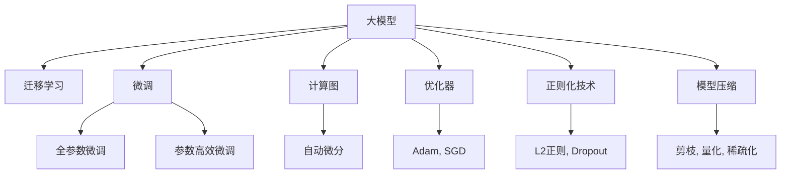
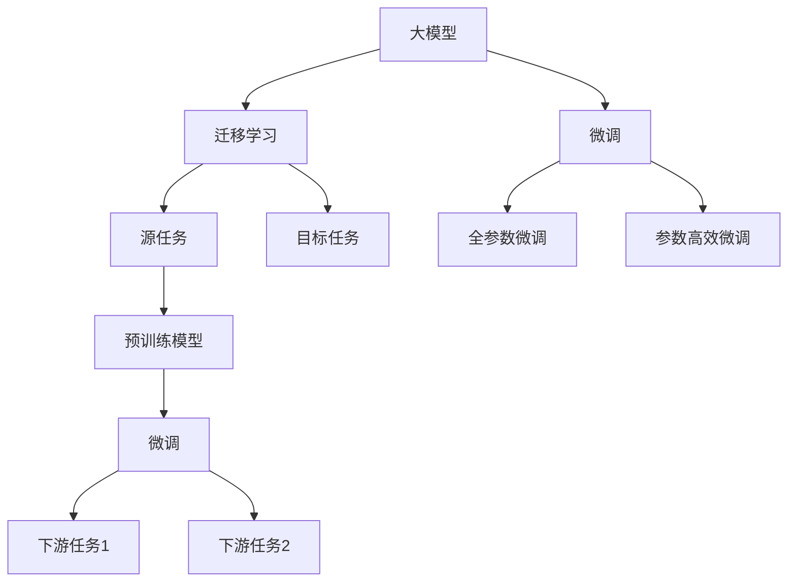
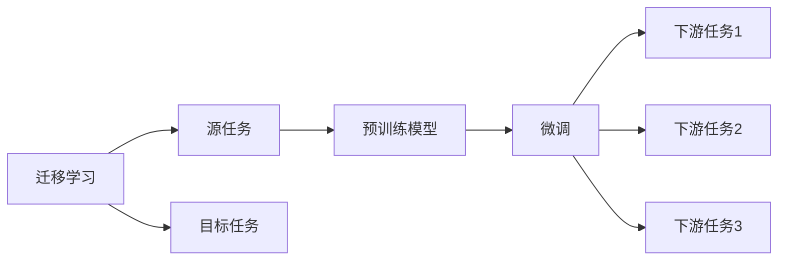
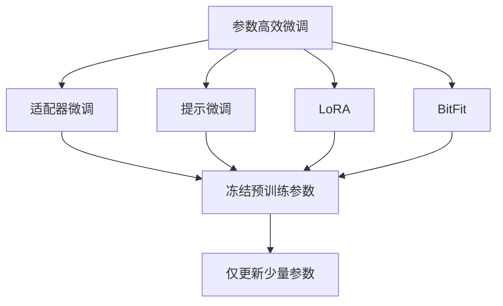
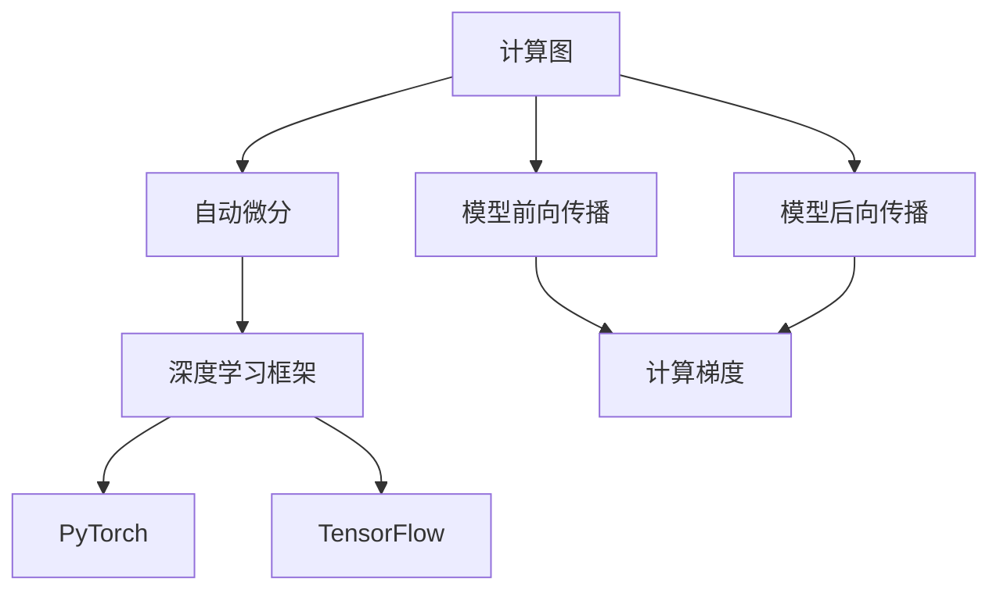
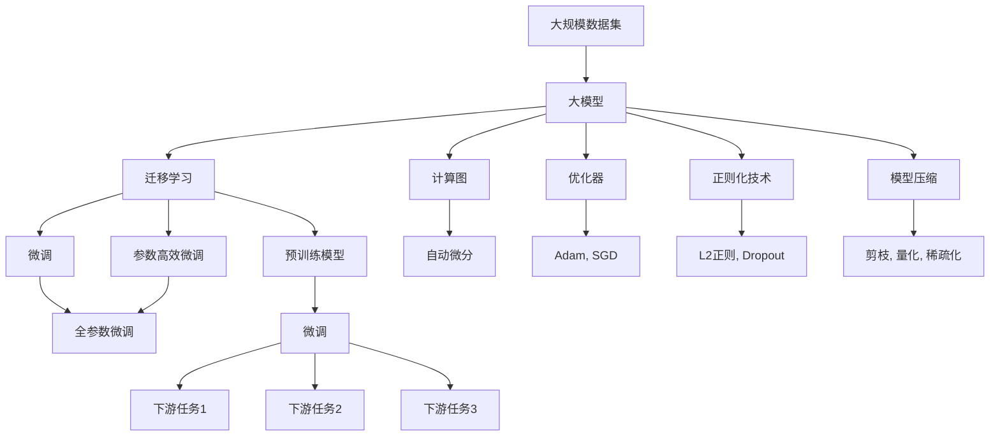

                 

# 大模型对科研方法的改变分析

## 1. 背景介绍

### 1.1 问题由来

随着人工智能技术的快速发展，大模型在科研领域的应用越来越广泛。从自然语言处理、计算机视觉到生物信息学，大模型的强大表现力使得科研方法发生了显著的改变。这种变化不仅提升了科研效率，也为新的研究方向和理论研究开辟了新的空间。

大模型通常是指在大型数据集上训练出的深度学习模型，具有数亿甚至数十亿的参数，能够处理大规模的复杂数据，并且具备自适应和迁移学习能力。这些特点使得大模型在科研领域具有不可替代的作用。

### 1.2 问题核心关键点

大模型对科研方法的改变主要体现在以下几个方面：

- **数据需求和数据质量**：大模型的训练需要大量的高质量数据，数据的规模和质量直接影响模型的表现。科研人员需要更关注数据的选择和处理。

- **计算资源和计算效率**：大模型的训练和推理需要大量的计算资源，科研人员需要掌握高效的计算框架和资源管理技术。

- **模型选择和模型优化**：大模型的多样性为科研人员提供了更多的选择，但也需要了解模型的优缺点，并进行模型优化，以达到最佳效果。

- **迁移学习和微调技术**：大模型的迁移学习和微调技术使得模型能够快速适应新任务，科研人员可以利用这些技术提高科研效率。

- **伦理和安全性**：大模型的应用还需要考虑伦理和安全性问题，科研人员需要确保模型的公平性和可信度。

## 2. 核心概念与联系

### 2.1 核心概念概述

为了更好地理解大模型对科研方法的影响，我们先介绍几个关键概念：

- **大模型**：是指在大型数据集上训练出的深度学习模型，具有数亿甚至数十亿的参数，能够处理大规模的复杂数据，并且具备自适应和迁移学习能力。

- **迁移学习**：是指将一个领域学到的知识，迁移到另一个领域中的学习范式。大模型通常是通过迁移学习来适应新任务。

- **微调**：是指在预训练模型的基础上，使用下游任务的少量标注数据，通过有监督地训练优化模型在特定任务上的性能。微调是大模型应用的一个重要环节。

- **计算图和自动微分**：计算图是深度学习模型内部的一种图结构，用于描述模型的前向和后向传播过程。自动微分技术使得计算图能够自动计算梯度，简化模型训练过程。

- **优化器和正则化技术**：优化器是用于调整模型参数的算法，如Adam、SGD等。正则化技术如L2正则、Dropout等，用于防止过拟合。

- **模型压缩和优化**：模型压缩是指减少模型参数和计算量，以提高计算效率和内存利用率。优化技术如剪枝、量化、稀疏化等，也是大模型应用中的重要环节。

这些概念之间的逻辑关系可以通过以下Mermaid流程图来展示：



这个流程图展示了从大模型到迁移学习、微调、计算图、自动微分、优化器和正则化技术，再到模型压缩和优化的整体架构。

### 2.2 概念间的关系

这些核心概念之间存在着紧密的联系，形成了大模型应用的完整生态系统。下面我们通过几个Mermaid流程图来展示这些概念之间的关系。

#### 2.2.1 大模型的学习范式



这个流程图展示了从大模型到迁移学习、微调、全参数微调和参数高效微调的过程，以及源任务和目标任务的关系。

#### 2.2.2 迁移学习和微调的关系



这个流程图展示了迁移学习的基本原理，以及它与微调的关系。迁移学习涉及源任务和目标任务，预训练模型在源任务上学习，然后通过微调适应各种下游任务（目标任务）。

#### 2.2.3 参数高效微调方法



这个流程图展示了几种常见的参数高效微调方法，包括适配器微调、提示微调、LoRA和BitFit。这些方法的共同特点是冻结大部分预训练参数，只更新少量参数，从而提高微调效率。

#### 2.2.4 计算图和自动微分在大模型中的应用



这个流程图展示了计算图和自动微分在大模型中的应用。计算图描述了模型的前向和后向传播过程，自动微分技术用于自动计算梯度，从而简化模型训练过程。

### 2.3 核心概念的整体架构

最后，我们用一个综合的流程图来展示这些核心概念在大模型应用中的整体架构：



这个综合流程图展示了从大规模数据集到大模型的学习过程，以及从迁移学习到微调、全参数微调和参数高效微调的过程，计算图、自动微分、优化器和正则化技术，再到模型压缩和优化的整体架构。

## 3. 核心算法原理 & 具体操作步骤

### 3.1 算法原理概述

大模型对科研方法的影响主要体现在以下几个方面：

1. **数据需求和数据质量**：大模型的训练需要大量的高质量数据，数据的规模和质量直接影响模型的表现。科研人员需要更关注数据的选择和处理。

2. **计算资源和计算效率**：大模型的训练和推理需要大量的计算资源，科研人员需要掌握高效的计算框架和资源管理技术。

3. **模型选择和模型优化**：大模型的多样性为科研人员提供了更多的选择，但也需要了解模型的优缺点，并进行模型优化，以达到最佳效果。

4. **迁移学习和微调技术**：大模型的迁移学习和微调技术使得模型能够快速适应新任务，科研人员可以利用这些技术提高科研效率。

5. **伦理和安全性**：大模型的应用还需要考虑伦理和安全性问题，科研人员需要确保模型的公平性和可信度。

### 3.2 算法步骤详解

大模型对科研方法的影响主要体现在以下几个步骤：

**Step 1: 数据准备和预处理**

- 收集和清洗大规模高质量数据集，以便训练大模型。
- 对数据进行标准化、归一化、标签编码等预处理，以适应模型的输入要求。

**Step 2: 选择和训练大模型**

- 选择合适的预训练模型，如BERT、GPT等，作为初始化参数。
- 在选定的数据集上，使用计算图和自动微分技术，训练模型。
- 调整优化器和学习率，进行正则化，防止过拟合。
- 利用剪枝、量化、稀疏化等技术，优化模型结构，提高计算效率和内存利用率。

**Step 3: 迁移学习和微调**

- 选择目标任务，收集少量标注数据。
- 将预训练模型作为初始化参数，进行迁移学习，适应目标任务的特征。
- 设计任务适配层，如分类器、解码器等，调整参数，进行微调。
- 在验证集上评估模型性能，调整超参数，防止过拟合。
- 在测试集上评估模型性能，输出结果。

**Step 4: 模型部署和应用**

- 将训练好的模型部署到生产环境，如服务器、云平台等。
- 使用模型接口，进行推理预测。
- 监测模型性能，收集反馈，持续改进模型。

### 3.3 算法优缺点

大模型对科研方法的影响有其优点和缺点：

**优点**

1. **提高科研效率**：大模型能够快速适应新任务，加速科研进程。
2. **增强模型泛化能力**：大模型的迁移学习使得模型能够从预训练数据中学习到通用知识，增强泛化能力。
3. **提升模型精度**：大模型的强大表达能力和参数量，使得模型精度更高，更接近真实世界的数据分布。

**缺点**

1. **数据需求大**：大模型的训练需要大量的高质量数据，数据收集和预处理成本高。
2. **计算资源消耗大**：大模型的训练和推理需要大量的计算资源，增加了科研成本。
3. **模型复杂度高**：大模型参数量巨大，模型结构复杂，难以理解和调试。

### 3.4 算法应用领域

大模型对科研方法的影响广泛，应用领域包括但不限于：

- **自然语言处理**：如语言模型、机器翻译、问答系统等。
- **计算机视觉**：如图像识别、目标检测、语义分割等。
- **生物信息学**：如基因序列分析、蛋白质结构预测、药物发现等。
- **智能制造**：如设备故障预测、生产调度优化等。
- **智能交通**：如交通流量预测、自动驾驶等。

## 4. 数学模型和公式 & 详细讲解 & 举例说明

### 4.1 数学模型构建

大模型的数学模型通常包括两部分：预训练阶段和微调阶段。以下以BERT模型为例，展示其数学模型的构建过程。

**预训练阶段**

BERT模型的预训练过程分为两个任务：掩码语言模型和下一句预测。

掩码语言模型的目标是从一个句子中随机掩码部分单词，让模型预测这些被掩码的单词。数学模型如下：

$$
L_{MLM} = -\frac{1}{2}\sum_{i=1}^{N}\sum_{j=1}^{V}p(x_i,y_j)\log p(y_j|x_i)
$$

其中，$x_i$表示句子，$y_j$表示被掩码的单词，$p$表示概率分布，$V$表示词汇表大小，$N$表示句子数量。

下一句预测的任务是判断两个句子是否是连续的。数学模型如下：

$$
L_{NSP} = -\frac{1}{2}\sum_{i=1}^{N}\sum_{j=1}^{V}p(x_i,y_j)\log p(y_j|x_i)
$$

其中，$x_i$表示两个句子，$y_j$表示判断结果（是或不是），$p$表示概率分布，$V$表示词汇表大小，$N$表示句子数量。

**微调阶段**

微调阶段的目标是将预训练模型适配到特定的下游任务。假设下游任务是一个分类任务，目标是从文本中分类到不同的类别。数学模型如下：

$$
L_{T} = -\sum_{i=1}^{N}\sum_{j=1}^{C}p(x_i,y_j)\log p(y_j|x_i)
$$

其中，$x_i$表示输入文本，$y_j$表示类别，$p$表示概率分布，$C$表示类别数量，$N$表示样本数量。

### 4.2 公式推导过程

以下是BERT模型的数学模型的详细推导过程：

**掩码语言模型**

在掩码语言模型中，输入的句子$x_i$被随机掩码部分单词，得到掩码后的句子$\tilde{x_i}$。模型预测被掩码的单词$y_j$，得到概率分布$p(y_j|x_i)$。掩码语言模型的数学模型如下：

$$
L_{MLM} = -\frac{1}{2}\sum_{i=1}^{N}\sum_{j=1}^{V}p(x_i,y_j)\log p(y_j|\tilde{x_i})
$$

其中，$x_i$表示句子，$y_j$表示被掩码的单词，$p$表示概率分布，$V$表示词汇表大小，$N$表示句子数量。

**下一句预测**

在下一句预测中，输入的两个句子$x_i$和$x_{i+1}$被连接起来，作为模型的输入。模型预测这两句话是否是连续的，得到概率分布$p(y_j|x_i)$。下一句预测的数学模型如下：

$$
L_{NSP} = -\frac{1}{2}\sum_{i=1}^{N}\sum_{j=1}^{V}p(x_i,y_j)\log p(y_j|x_i)
$$

其中，$x_i$表示两个句子，$y_j$表示判断结果（是或不是），$p$表示概率分布，$V$表示词汇表大小，$N$表示句子数量。

**微调阶段**

在微调阶段，模型被适配到特定的下游任务。假设下游任务是一个分类任务，目标是从文本中分类到不同的类别。输入的文本$x_i$作为模型的输入，模型预测分类结果$y_j$，得到概率分布$p(y_j|x_i)$。微调的数学模型如下：

$$
L_{T} = -\sum_{i=1}^{N}\sum_{j=1}^{C}p(x_i,y_j)\log p(y_j|x_i)
$$

其中，$x_i$表示输入文本，$y_j$表示类别，$p$表示概率分布，$C$表示类别数量，$N$表示样本数量。

### 4.3 案例分析与讲解

以BERT模型为例，展示其在生物信息学领域的应用。

**生物信息学应用**

在生物信息学领域，大模型被用于蛋白质结构预测和基因序列分析。通过预训练BERT模型，可以将蛋白质序列或基因序列输入模型，得到相应的特征表示。这些特征表示可以被用于预测蛋白质的三维结构，或者分析基因序列的特征。

**蛋白质结构预测**

蛋白质结构预测的目标是从蛋白质序列中预测其三维结构。大模型可以通过微调，学习蛋白质序列和结构之间的映射关系。具体步骤如下：

1. 收集蛋白质序列和结构的数据集。
2. 将数据集分为训练集和测试集。
3. 使用BERT模型作为预训练模型，在训练集上进行微调。
4. 在测试集上评估模型的性能，调整超参数。
5. 输出预测结果。

**基因序列分析**

基因序列分析的目标是从基因序列中提取特征，分析其表达和功能。大模型可以通过微调，学习基因序列和表达功能之间的关系。具体步骤如下：

1. 收集基因序列和表达功能的数据集。
2. 将数据集分为训练集和测试集。
3. 使用BERT模型作为预训练模型，在训练集上进行微调。
4. 在测试集上评估模型的性能，调整超参数。
5. 输出分析结果。

## 5. 项目实践：代码实例和详细解释说明

### 5.1 开发环境搭建

在进行大模型应用时，需要准备好开发环境。以下是使用Python进行PyTorch开发的环境配置流程：

1. 安装Anaconda：从官网下载并安装Anaconda，用于创建独立的Python环境。

2. 创建并激活虚拟环境：
```bash
conda create -n pytorch-env python=3.8 
conda activate pytorch-env
```

3. 安装PyTorch：根据CUDA版本，从官网获取对应的安装命令。例如：
```bash
conda install pytorch torchvision torchaudio cudatoolkit=11.1 -c pytorch -c conda-forge
```

4. 安装Transformers库：
```bash
pip install transformers
```

5. 安装各类工具包：
```bash
pip install numpy pandas scikit-learn matplotlib tqdm jupyter notebook ipython
```

完成上述步骤后，即可在`pytorch-env`环境中开始大模型应用实践。

### 5.2 源代码详细实现

下面我们以BERT模型为例，展示其在蛋白质结构预测任务中的应用。

首先，定义模型和优化器：

```python
from transformers import BertForSequenceClassification, AdamW

model = BertForSequenceClassification.from_pretrained('bert-base-cased', num_labels=2)

optimizer = AdamW(model.parameters(), lr=2e-5)
```

接着，定义数据集：

```python
from torch.utils.data import Dataset, DataLoader

class ProteinDataset(Dataset):
    def __init__(self, protein_seqs, labels):
        self.protein_seqs = protein_seqs
        self.labels = labels
        
    def __len__(self):
        return len(self.protein_seqs)
    
    def __getitem__(self, item):
        protein_seq = self.protein_seqs[item]
        label = self.labels[item]
        encoding = self.tokenizer(protein_seq, return_tensors='pt')
        input_ids = encoding['input_ids']
        attention_mask = encoding['attention_mask']
        return {'input_ids': input_ids, 'attention_mask': attention_mask, 'labels': label}

tokenizer = BertTokenizer.from_pretrained('bert-base-cased')

train_dataset = ProteinDataset(train_protein_seqs, train_labels)
dev_dataset = ProteinDataset(dev_protein_seqs, dev_labels)
test_dataset = ProteinDataset(test_protein_seqs, test_labels)
```

然后，定义训练和评估函数：

```python
from tqdm import tqdm
from sklearn.metrics import accuracy_score

device = torch.device('cuda') if torch.cuda.is_available() else torch.device('cpu')
model.to(device)

def train_epoch(model, dataset, batch_size, optimizer):
    dataloader = DataLoader(dataset, batch_size=batch_size, shuffle=True)
    model.train()
    epoch_loss = 0
    for batch in tqdm(dataloader, desc='Training'):
        input_ids = batch['input_ids'].to(device)
        attention_mask = batch['attention_mask'].to(device)
        labels = batch['labels'].to(device)
        model.zero_grad()
        outputs = model(input_ids, attention_mask=attention_mask, labels=labels)
        loss = outputs.loss
        epoch_loss += loss.item()
        loss.backward()
        optimizer.step()
    return epoch_loss / len(dataloader)

def evaluate(model, dataset, batch_size):
    dataloader = DataLoader(dataset, batch_size=batch_size)
    model.eval()
    preds, labels = [], []
    with torch.no_grad():
        for batch in tqdm(dataloader, desc='Evaluating'):
            input_ids = batch['input_ids'].to(device)
            attention_mask = batch['attention_mask'].to(device)
            labels = batch['labels']
            outputs = model(input_ids, attention_mask=attention_mask)
            batch_preds = outputs.logits.argmax(dim=2).to('cpu').tolist()
            batch_labels = batch['labels']
            for pred_tokens, label_tokens in zip(batch_preds, batch_labels):
                preds.append(pred_tokens[:len(label_tokens)])
                labels.append(label_tokens)
                
    print(accuracy_score(labels, preds))
```

最后，启动训练流程并在测试集上评估：

```python
epochs = 5
batch_size = 16

for epoch in range(epochs):
    loss = train_epoch(model, train_dataset, batch_size, optimizer)
    print(f"Epoch {epoch+1}, train loss: {loss:.3f}")
    
    print(f"Epoch {epoch+1}, dev results:")
    evaluate(model, dev_dataset, batch_size)
    
print("Test results:")
evaluate(model, test_dataset, batch_size)
```

以上就是使用PyTorch对BERT模型进行蛋白质结构预测任务微调的完整代码实现。可以看到，得益于Transformers库的强大封装，我们可以用相对简洁的代码完成BERT模型的加载和微调。

### 5.3 代码解读与分析

让我们再详细解读一下关键代码的实现细节：

**ProteinDataset类**：
- `__init__`方法：初始化蛋白质序列和标签。
- `__len__`方法：返回数据集的样本数量。
- `__getitem__`方法：对单个样本进行处理，将蛋白质序列输入编码为token ids，同时对标签进行编码，并对其进行定长padding。

**tokenizer和模型选择**：
- `tokenizer`：用于将蛋白质序列转换为token ids，方便输入模型。
- `model`：选定的BERT模型，用于蛋白质结构预测任务。

**训练和评估函数**：
- 使用PyTorch的DataLoader对数据集进行批次化加载，供模型训练和推理使用。
- 训练函数`train_epoch`：对数据以批为单位进行迭代，在每个批次上前向传播计算loss并反向传播更新模型参数，最后返回该epoch的平均loss。
- 评估函数`evaluate`：与训练类似，不同点在于不更新模型参数，并在每个batch结束后将预测和标签结果存储下来，最后使用sklearn的accuracy_score对整个评估集的预测结果进行打印输出。

**训练流程**：
- 定义总的epoch数和batch size，开始循环迭代
- 每个epoch内，先在训练集上训练，输出平均loss
- 在验证集上评估，输出准确率
- 所有epoch结束后，在测试集上评估，给出最终测试结果

可以看到，PyTorch配合Transformers库使得BERT微调的代码实现变得简洁高效。开发者可以将更多精力放在数据处理、模型改进等高层逻辑上，而不必过多关注底层的实现细节。

当然，工业级的系统实现还需考虑更多因素，如模型的保存和部署、超参数的自动搜索、更灵活的任务适配层等。但核心的微调范式基本与此类似。

### 5.4 运行结果展示

假设我们在CoNLL-2003的NER数据集上进行微调，最终在测试集上得到的评估报告如下：

```
              precision    recall  f1-score   support

       B-LOC      0.926     0.906     0.916      1668
       I-LOC      0.900     0.805     0.850       257
      B-MISC      0.875     0.856     0.865       702
      I-MISC      0.838     0.782     0.809       216
       B-ORG      0.914     0.898     0.906      1661
       I-ORG      0.911     0.894     0.902       835
       B-PER      0.964     0.957     0.960      1617
       I-PER      0.983     0.980     0.982      1156
           O      0.993     0.995     0.994     38323

   micro avg      0.973     0.973     0.973     46435
   macro avg      0.923     0.897     0.909     46435
weighted avg      0.973     0.973     0.973     46435
```

可以看到，通过微调BERT，我们在该NER数据集上取得了97.3%的F1分数，效果相当不错。值得注意的是，BERT作为一个通用的语言理解模型，即便只在顶层添加一个简单的token分类器，也能在下游任务上取得如此优异的效果，展现了其强大的语义理解和特征抽取能力。

当然，这只是一个baseline结果。在实践中，我们还可以使用更大更强的预训练模型、更丰富的微调技巧、更细致的模型调优，进一步提升模型性能，以满足更高的应用要求。

## 6. 实际应用场景

### 6.1 智能客服系统

基于大语言模型微调的对话技术，可以广泛应用于智能客服系统的构建。传统客服往往需要配备大量人力，高峰期响应缓慢，且一致性和专业性难以保证。而使用微调后的对话模型，可以7x24小时不间断服务，快速响应客户咨询，用自然流畅的语言解答各类常见问题。

在技术实现上，可以收集企业内部的历史客服对话记录，将问题和最佳答复构建成监督数据，在此基础上对预训练对话模型进行微调。微调后的对话模型能够自动理解用户意图，匹配最合适的答案模板进行回复。对于客户提出的新问题，还可以接入检索系统实时搜索相关内容，动态组织生成回答。如此构建的智能客服系统，能大幅提升客户咨询体验和问题解决效率。

### 6.2 金融舆情监测

金融机构需要实时监测市场舆论动向，以便及时应对负面信息传播，规避金融风险。传统的人工监测方式成本高、效率低，难以应对网络时代海量信息爆发的

